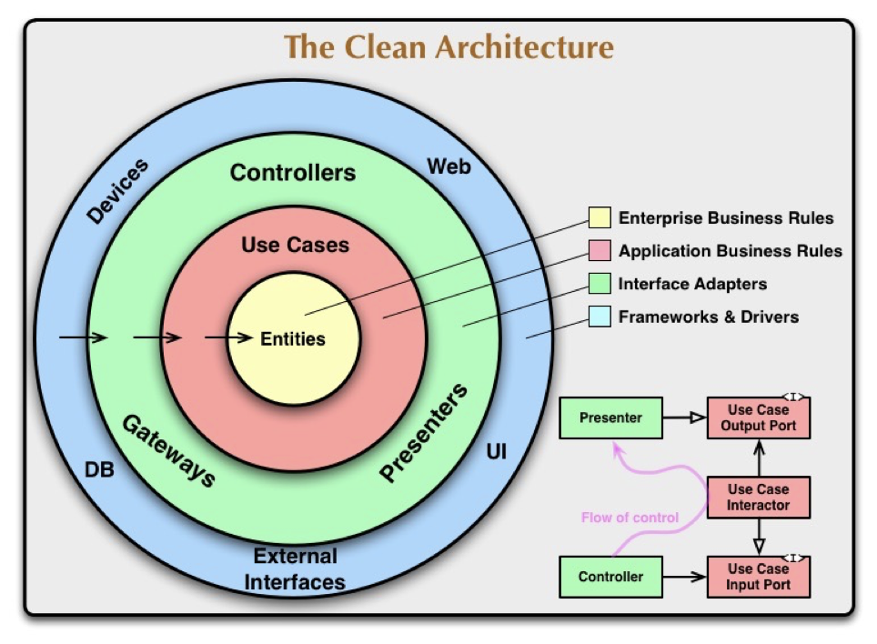

# Введение

Приветствую!

Недавно познакомил друга с понятием "Чистая архитектура". С того момента он часто атаковал меня вопросами по типу "А как это сделать? А как то сделать?". В один момент хотел просто кинуть ему ссылку с туториалом, но не нашел подходящего.

Поэтому, перечитав книгу Мартина Фаулера ["Чистая архитектура"](https://www.chitai-gorod.ru/product/chistaya-arhitektura-iskusstvo-razrabotki-programmnogo-obespecheniya-2640391), освежив свои знания и преисполнившись в познании, приступаю.

# Что такое чистая архитектура

Чистую архитектуру можно описать фразой - `строй приложение вокруг бизнес-логики`:
- Сначала моделируется предметная область и в конце обкладываем его всякими контроллерами, БД, HTTP клиентами и т.д.;
- Все решения по поводу работы с внешним миром откладываются, пока не будет реализована бизнес-логика.

Частные случаи этого:
1. Нет никаких контроллеров/презентеров;
2. Мы не знаем ни о какой базе данных - только об абстрактном хранилище чего-либо;
3. Как мы работаем с другими сервисами не известно - просто вызываем функции/методы.

<spoiler title="Domain first подход">

В контексте работы с БД есть 3 подхода:
- Code first
- Database first
- Model first

Для API сервисов:
- Code first
- Contract first

Для подхода чистой архитектуры я бы дал название `Domain-first`

<spoiler>

Многие видели эту диаграмму из книги "Чистая архитектура":



Попытаюсь объяснить что на ней происходит.

Слева мы видим общий взгляд на архитектуру проекта. Модули разделены по слоям (снизу вверх):
1. Entities 
   - Сущности, которые содержат самую важную логику/алгоритмы
   - Пример: расчет угла броска снаряда 
2. Use Cases 
   - Наши бизнес-процессы
   - Этот слой содержит прикладную логику - логику нашей предметной области
   - Занимается тем, что манипулирует Entities
   - Пример: приложения для расчета угла удара в бильярде и траектории выстрела из пушки  
3. Контроллеры/Презентеры 
   - Те, с кем внешний мир взаимодействует
   - Пример: MVC контроллеры, заглушка для gRPC, модель представления (MVVM)
4. UI, БД, Устройства 
   - Это тот самый внешний мир
   - Пример: база данных, внешний сервис

<spoiler title="Объяснение из книги">

В книге Мартин Фаулер дает следующие определения:
- Critical Business Rules - это правила и законы, по которым работает система и без наших программ
   > ... they are critical to the business itself, and would exist even if there were no system to automate them

- Critical Business Data - это данные, которые необходимы для работы этих самых Critical Business Rules
   > ... the data that would exist even if the system were not automated
  
И теперь переходим к определению самого `Entity`:

> Entity - это объект, который хранит в себе Critical Business Rules и нужные для их работы Critical Business Data

А `Use Cases` - это объекты, которые манипулируют этими `Entity`, так как это делается в настоящей системе.

В качестве примера дается модель банковской системы:
- Critical Business Rules - это функция для расчета процентной ставки по кредиту;
- Critical Business Data - это параметры для этого процента: банковская ставка, размер залога, время кредитования;
- Entity - это объект, который по формуле `Critical Business Rules` вычисляет процентную ставку по `Critical Business Data`;
- Use Case - это сервис, который исходя из того, кто хочет взять кредит повышает или понижает требования по первоначальному взносу.

</spoiler>

Также стоит заметить 2 вещи:
1. На диаграмме представлены зависимости **исходного кода** - не поток управления (то, что будет вызвано в реальности);
2. Зависимости идут строго от внешних слоев ко внутренним - один модуль может ссылать на другой, только если по этой иерархии он расположен ниже.

Справа идет диаграмма зависимостей - то, как приложение должно себя вести в чистой архитектуре.
Диаграмма представлена в формате UML и стрелки представляют соответственно связи между объектами.

Что на ней показано:
- `Controller` - это объект 3 уровня, с которым общаются внешние клиенты;
- `Use Case Input Port` - это интерфейс, представляющий наши варианты использования - бизнес-процессы;
- `Use Case Interactor` - это уже реализация `Use Case Input Port`, которая содержит бизнес-логику;
- `Use Case Output Port` - это интерфейс для представления результатов работы нашего бизнес-процесса. Результатом может быть изменение записи в БД, публикация нового события в очередь сообщений, отправка письма и т.д.;
- `Presenter` - это сама реализация `Use Case Output Port`. Им может быть Presenter, который обновит информацию на экране телефона или объект, который выполнит SQL запрос для обновления данных.

Также сквозь всю диаграмму, от `Controller` к `Presenter`, касаясь `Use Case Interactor`, движется стрелка.
Это уже поток управления - кто-кого вызывает. 

При правильной реализации поток управления будет выглядеть следующим образом: `Controller` -> `Use Case Interactor` -> `Presenter`. 
Пример:
1. Клиент сделал запрос на контроллер;
2. Контроллер вызвал нужный метод на доменном сервисе;
3. Доменный сервис вызвал метод хранилища, который обновил базу данных.

Если сейчас не понятно, то, надеюсь, к концу станет яснее.

# Разрабатываем систему

## Предметная область

Чтобы стало понятнее, создадим свой проект, используя идею чистой архитектуры.

Задача следующая: разработать систему для бронирования и покупки билетов в кинотеатре. Вначале соберем требования и поймем основные правила этого мира.

*Процесс сбора требований. 3.. 2.. 1.. Требования собраны* 
*Процесс моделирования предметной области. 3.. 2.. 1.. Предметная область смоделирована*

Итак, правила следующие:
- Просмотр фильмов организован в сеансы;
- На каждый сеанс есть определенное количество мест;
- Одно место может купить только один человек;
- Все места на начало сеанса свободные;
- Клиент может забронировать свободное место;
- Клиент может купить свободное место, либо то, которое было забронировано за ним.

Правил немного, но этого хватит.

> Стоит отметить, что кроме бронирования и покупки мы ничего больше не делаем: не знаем как появляются новые сеансы, откуда берутся клиенты и т.д.

## Моделирование предметной области

Когда стало понятнее, с чем мы имеем дело, можно приступать к моделированию в коде.

Наша главная задача - бронировать и покупать места для посетителей на сеансах.
Сеанс содержит в себе интервал, когда он действует, фильм, показ которого ведется, и сами места.
В коде, его можно реализовать следующим образом:

```csharp
class Session
{
    /// <summary>
    /// Идентификатор сеанса
    /// </summary>
    public int Id { get; }
   
    private readonly Seat[] _seats;
    
    /// <summary>
    /// Места для этого сеанса 
    /// </summary>
    public IReadOnlyCollection<Seat> Seats => _seats;
    
    public Session(SessionInterval interval, int movieId, IEnumerable<Seat> seats)
    {
        ArgumentNullException.ThrowIfNull(interval);
        ArgumentNullException.ThrowIfNull(seats);
        
        Interval = interval;
        MovieId = movieId;
        _seats = BuildSeatsArray(seats);
    }

    private static Seat[] BuildSeatsArray(IEnumerable<Seat> seats)
    {
        var array = seats.ToArray();
        for (var i = 0; i < array.Length; i++)
        {
            if (array[i] == null!)
            {
                throw new ArgumentNullException(nameof(seats), $"Объект места на {i} позиции был null");
            }
        }

        return array;
    }
    
    // ...
}
```

Единственный способ нарушить состояние — самим накосячить:
- Создание объекта через вызов конструктора, где проверяются все входные параметры;
- В коде просто так состояние не изменить — все свойства неизменяемые (get-only, IReadOnlyCollection);

Для объекта места используется класс `Seat`, но его определения еще не было, — это далее.

Место может иметь 3 состояния: свободно, забронировано и куплено. Причем, если место забронировано или куплено, то ЗА КЕМ-ТО. Если бы мы сначала думали про БД, то реализовали как-то так:

```csharp
enum SeatType
{
    Free = 0,
    Booked = 1,
    Bought = 2,
}

class Seat
{
    public SeatType Type { get; set; }
    public int SessionId { get; set; }
    public Session Session { get; set; }
    public int Number { get; set; }
    public int? ClientId { get; set; }
}
```

Это простой POCO класс, где вся реализация открыта наружу.

Мы, конечно, могли бы добавить пару методов для дополнительных проверок и логики.
Например, для получения `Id` клиента, когда место забронировано:

```csharp
class Seat
{
    public bool TryGetClientIdBooked(out int clientId)
    {
        if (Type == SeatType.Booked)
        {
            clientId = ClientId.Value;
            return true;
        }
        clientId = default;
        return true;
    }
}
```

Но этот подход плох тем, что:
1. Состояние может изменить любой желающий и полагаться на добросовестность разработчиков не стоит: можно случайно выставить Id клиента в `null` для купленного места;
2. У разных состояний обязательно должны быть поля, которые ему не нужны: например, Id клиента для свободного места;
3. Поле `ClientId` у разных состояний означает разные вещи: тот кто забронировал и кто купил место - то же самое может случиться и с другими полями.

Будем исправлять эти проблемы поэтапно и начнем с 2 пункта. Можно заметить, что каждое состояние можно представить отдельным классом - без необходимости перечисления типа. Перепишем следующим образом:

```csharp
abstract class Seat
{
    /// <summary>
    /// Номер места в зале
    /// </summary>
    public int Number { get; }
    protected internal Seat(int number)
    {
        if (number < 1)
        {
            throw new ArgumentOutOfRangeException(nameof(number), number, "Номер места должно быть положительным");
        }
        Number = number;
    }
} 

class FreeSeat: Seat
{
    public FreeSeat(int number) : base(number)
    { }
}

class BookedSeat: Seat
{
    /// <summary>
    /// Клиент, который забронировал место
    /// </summary>
    public int ClientId { get; }

    public BookedSeat(int number, int clientId) : base(number)
    {
        ClientId = clientId;
    }
}

class BoughtSeat: Seat
{
    /// <summary>
    /// Клиент, который купил место
    /// </summary>
    public int ClientId { get; }

    public BoughtSeat(int number, int clientId) : base(number)
    {
        ClientId = clientId;
    }
}
```

Стоит заметить следующее:
- Для каждого состояния места отдельный класс, поэтому проблем с перечислением нет;
- Можно утверждать, что типы мест зафиксированы - конструктор помечен `internal`, поэтому подтипы могут располагаться только в сборке с доменными сущностями и никто свинью не подложит;
- Есть проверка на корректность номера места;
- Теперь у каждого места есть поля, которые нужны только ему;
- Нет необходимости хранить служебные поля для схемы БД (`Session` для связи места с сеансом).

Пункт 1 исправился на ходу: все объекты стали неизменяемы, поэтому случайно сломать не получится.

Пункт 3 - на любителя. Сейчас из названия самого класса понятно, за что отвечает поле `ClientId`, но если очень хочется, то можно именовать по-особому (и другие состояния это не затронет):
```csharp
public class BoughtSeat: Seat
{
    /// <summary>
    /// Клиент, который купил место
    /// </summary>
    public int BoughtId { get; }

    public BoughtSeat(int number, int boughtId) : base(number)
    {
        BoughtId = boughtId;
    }
}

public class BookedSeat: Seat
{
    /// <summary>
    /// Клиент, который забронировал место
    /// </summary>
    public int BookedId { get; }

    public BookedSeat(int number, int bookedId) : base(number)
    {
        BookedId = bookedId;
    }
}
```

Место может быть либо куплено, либо забронировано, причем для каждого состояния свои правила перехода. Обязуем каждое состояние поддерживать эти операции. В C# это можно реализовать с помощью абстрактных методов.

```csharp
abstract class Seat
{
    /// <summary>
    /// Забронировать место за указанным клиентом
    /// </summary>
    /// <param name="clientId">Id клиента, за которым нужно забронировать место</param>
    /// <returns>Забронированное место</returns>
    /// <exception cref="SeatBoughtException">Указанное место уже куплено, возможно этим же посетителем</exception>
    /// <exception cref="SeatBookedException">Указанное место забронировано, возможно этим же посетителем</exception>
    public abstract BookedSeat Book(int clientId);
    
    /// <summary>
    /// Купить место для указанного посетителя
    /// </summary>
    /// <param name="clientId">Id клиента, для которого нужно купить место</param>
    /// <returns>Купленное место</returns>
    /// <exception cref="SeatBoughtException">Указанное место уже куплено, возможно этим же посетителем</exception>
    /// <exception cref="SeatBookedException">Указанное место забронировано другим посетителем</exception>
    public abstract BoughtSeat Buy(int clientId);
}

class BookedSeat: Seat
{
    public override BookedSeat Book(int clientId)
    {
        if (ClientId == clientId)
        {
            return this;
        }
        
        throw new SeatBookedException(ClientId);
    }

    public override BoughtSeat Buy(int clientId)
    {
        if (ClientId == clientId)
        {
            return new BoughtSeat(Number, clientId);
        }

        throw new SeatBookedException(ClientId);
    }
}
```

Осталось только научиться бронировать места на сеансе. Эту логику уже выделим в сам объект сеанса.

```csharp
class Session
{
    // Реализацию FindSeatByPlace опустил - простая фильтрация
    
    /// <summary>
    /// Купить указанное место для клиента
    /// </summary>
    /// <param name="place">Место, которое нужно купить</param>
    /// <param name="clientId">Клиент, которому нужно купить место</param>
    /// <returns><c>true</c> - место было куплено, <c>false</c> - место УЖЕ было куплено этим клиентом</returns>
    /// <exception cref="SeatNotFoundException">Место с указанным номером не найдено</exception>
    /// <exception cref="SeatBoughtException">Указанное место куплено, возможно этим самым клиентом</exception>
    /// <exception cref="SeatBookedException">Указанное место забронировано другим клиентом</exception>
    public BoughtSeat Buy(int place, int clientId)
    {
        var (seat, index) = FindSeatByPlace(place);

        var bought = seat.Buy(clientId);
        if (bought == seat)
        {
            // Место уже было куплено этим клиентом
            throw new SeatBoughtException(clientId);
        }

        _seats[index] = seat;
        return bought;
    }
    
    /// <summary>
    /// Забронировать место за указанным клиентом 
    /// </summary>
    /// <param name="place">Место, которое нужно забронировать</param>
    /// <param name="clientId">Клиент, за которым нужно забронировать место</param>
    /// <returns><c>true</c> - место забронировано, <c>false</c> - место уже было забронировано этим клиентом</returns>
    /// <exception cref="SeatNotFoundException">Место с указанным номером не найдено</exception>
    /// <exception cref="SeatBoughtException">Указанное место уже куплено, возможно этим же самым посетителем</exception>
    /// <exception cref="SeatBookedException">Указанное место забронировано, возможно этим самым посетителем посетителем</exception>
    public BookedSeat Book(int place, int clientId)
    {
        var (seat, index) = FindSeatByPlace(place);
        var booked = seat.Book(clientId);
        if (booked == seat)
        {
            // Место уже было забронировано за этим клиентом
            throw new SeatBookedException(clientId);
        }
        
        _seats[index] = booked;
        return booked;
    }
}
```

Что делать в случае нарушения правил бизнес-логики стало понятно из кода - стратегия доменных исключений. Например, когда клиент хочет забронировать уже купленное место, то бросается `SeatBoughtException`.

`Entity` реализованы, осталось дело за малым - `Use Cases`. У нас есть 2 процесса - бронирование и покупка мест. Для этого определим отдельный сервис - `SeatService`. В нем будет содержаться наша бизнес-логика.

```csharp
class SeatService
{
    public Task BookSeatAsync(int sessionId, int place, int clientId, CancellationToken token)
    {
        // ...
    }
    
    public Task BuySeatAsync(int sessionId, int place, int clientId, CancellationToken token)
    {
        // ...
    }
}
```

Перед реализацией логики нужно подумать откуда брать эти сеансы и места? Для этого выделим отдельный сервис-хранилище данных: `ISessionRepository`.
От него нам нужно только 2 действия:
- Получить сеанс с его местами;
- Обновить информацию о месте (после бронирования/покупки).

```csharp
interface ISessionRepository
{
    public Task<Session> GetSessionByIdAsync(int sessionId, CancellationToken token = default);
    public Task UpdateSeatAsync(int sessionId, Seat seat, CancellationToken token = default);
}
```

На этом можно приступить к реализации.

```csharp
class SeatService
{
    private readonly ISessionRepository _sessionRepository;

    public SeatService(ISessionRepository sessionRepository)
    {
        _sessionRepository = sessionRepository;
    }
    
    public async Task<BookedSeat> BookSeatAsync(int sessionId, int place, int clientId, CancellationToken token = default)
    {
        var session = await _sessionRepository.GetSessionByIdAsync(sessionId, token);
        var bookedSeat = session.Book(place, clientId);
        await _sessionRepository.UpdateSeatAsync(sessionId, bookedSeat, token);
        return bookedSeat;
    }
    
    public async Task<BoughtSeat> BuySeatAsync(int sessionId, int place, int clientId, CancellationToken token = default)
    {
        var session = await _sessionRepository.GetSessionByIdAsync(sessionId, token);
        var boughtSeat = session.Buy(place, clientId);
        await _sessionRepository.UpdateSeatAsync(sessionId, boughtSeat, token);
        return boughtSeat;
    }
}
```

На этом наша предметная область готова. Можно начинать думать о внешнем мире.

## Работаем с внешним миром

### Хранилище

Бизнес-логика реализована. 
Теперь уже стоит подумать как мы будем работать с внешним миром.

Для нас это означает 1 вещь - реализацию `ISessionRepository`.
По требованиям мы должны хранить данные в БД, поэтому и реализация будет ее использовать.

Во-первых, надо разработать схему того, как эти данные будут храниться в БД.
Я использую ORM (Entity Framework), поэтому покажу в виде классов.

> Для разграничения доменных моделей и моделей БД использую префикс `Database`

```csharp
public class DatabaseSession
{
    public int Id { get; set; }
    public DateTime Start { get; set; }
    public DateTime End { get; set; }
    public int MovieId { get; set; }
    public ICollection<DatabaseSeat> Seats { get; set; } 
}

public class DatabaseSeat
{
    public int SessionId { get; set; }
    public DatabaseSession Session { get; set; }
    public int Number { get; set; }
    public SeatType Type { get; set; }
    public int? ClientId { get; set; }
}
```

> Можете заметить, что для модели сеанса у нас появились дополнительные (лишние) поля. Как уже было сказано, мы моделируем только бронирование и покупку мест, а остальное (как создаются новые сеансы, откуда берутся места в залах и т.д.) - за рамками наших обязанностей.
> Вот тут и приходит еще один плюс разграничения модели БД и доменной модели - одну и ту же схему можно использовать для различных областей. Все что нам остается - правильно отобразить модели. 

Остался только вопрос - как определять какой тип места нам передали для правильного его сохранения.

Сделать это можно несколькими способами. Первое, что приходит на ум - рефлексия:
```csharp
public void DoSomething(Seat seat)
{
    switch (seat)
    {
        case FreeSeat freeSeat:
            // ...
        case BookedSeat bookedSeat:
            // ...
        case BoughtSeat boughtSeat:
            // ...
        default:
            throw new ArgumentException("Неизвестный тип места");
    }
}
```

Но этот путь мне не нравится:
- Каждый метод/функция будет сильно раздуваться;
- При добавлении нового типа места необходимо будет найти ВСЕ точки использования этого `switch`.

Эти проблемы можно частично исправить добавив перечисление типа, но придется изменить доменную модель. Я выбрал другой способ - паттерн [Посетитель](https://metanit.com/sharp/patterns/3.11.php).

```csharp
public interface ISeatVisitor<out T>
{
    T Visit(FreeSeat freeSeat);
    T Visit(BoughtSeat boughtSeat);
    T Visit(BookedSeat bookedSeat);
}

abstract class Seat
{
    public abstract T Accept<T>(ISeatVisitor<T> visitor);
}

class FreeSeat: Seat
{
    public override T Accept<T>(ISeatVisitor<T> visitor)
    {
        return visitor.Visit(this);
    }
}


class BookedSeat: Seat
{
    public override T Accept<T>(ISeatVisitor<T> visitor)
    {
        return visitor.Visit(this);
    }
}

class BoughtSeat: Seat
{   
    public override T Accept<T>(ISeatVisitor<T> visitor)
    {
        return visitor.Visit(this);
    }
}
```

Такое расширение функциональности я считаю допустимым:
- Бизнес-логика не нарушается;
- Внедрение посетителя не дает знаний доменному уровню о том, где он исполняется.

Теперь перейдем к самой реализации хранилища `ISessionRepository`.

```csharp
public class PostgresSessionRepository: ISessionRepository
{
    private readonly SessionDbContext _context;

    public PostgresSessionRepository(SessionDbContext context)
    {
        _context = context;
    }
    
    public async Task<Session> GetSessionByIdAsync(int sessionId, CancellationToken token = default)
    {
        var found = await _context.Sessions
                                  .AsNoTracking()
                                  .Include(s => s.Seats)
                                  .Select(x => new
                                   {
                                       x.Id,
                                       x.Seats
                                   })
                                  .FirstOrDefaultAsync(s => s.Id == sessionId, token);
        if (found is null)
        {
            throw new SessionNotFoundException(sessionId);
        }

        return new Session(found.Id, found.Seats.Select(seat => seat.ToDomainSeat()));
    }
    
    public async Task UpdateSeatAsync(int sessionId, Seat seat, CancellationToken token = default)
    {
        var databaseSeat = seat.Accept(new DatabaseSeatMapperSeatVisitor(sessionId));
        await _context.Seats
                      .Where(s => s.SessionId == sessionId && s.Number == seat.Number)
                      .ExecuteUpdateAsync(calls => calls.SetProperty(s => s.ClientId, databaseSeat.ClientId)
                                                        .SetProperty(s => s.Type, databaseSeat.Type), token);
    }
}
```

**Важное замечание!** 
Не вся бизнес-логика находится в нашем коде. В данном случае, `ISessionsRepository` может кинуть исключение, если не нашел нужного сеанса - гораздо выгоднее переложить задачу нахождения сущности на хранилище, а не загружать всю БД в память и там выполнять поиск.
Как такие места правильно выделять - мне не известно, просто я так чувствую. Но если и нахожу, то нужно четко всем рассказать, что этот сервис может кинуть такое исключение. В C# это можно сделать с помощью строк документации для интерфейса.

Вот и получается, что слой хранения занимается 2 вещами:
- Маппинг объектов между слоями;
- Транслирует ошибки из внешней системы на внутреннюю (в этом примере - исключение, если нужного сеанса не найдено).

### Пользуемся

На последнее я оставил то, как пользователь будет взаимодействовать с нашей системой.
Выбирать мы можем любой способ - бизнес-логика ничего не знает о слое взаимодействия с пользователями.

Представим, что мы делаем RESTful API по HTTP. Тогда реализация будет примерно следующей.

```csharp
[ApiController]
[Route("sessions")]
public class SessionsController: ControllerBase
{
    private readonly ISeatService _seatService;

    public SessionsController(ISeatService seatService)
    {
        _seatService = seatService;
    }

    [HttpPut("{sessionId:int}/places/{placeId:int}/book")]
    public async Task<IActionResult> BookSeat(int sessionId, int placeId, [FromQuery][Required] int userId, CancellationToken token = default)
    {
        await _seatService.BookSeatAsync(sessionId, placeId, userId, token);
        return Ok();
    }
    
    [HttpPut("{sessionId:int}/places/{placeId:int}/buy")]
    public async Task<IActionResult> BuySeat(int sessionId, int placeId, [FromQuery][Required] int userId, CancellationToken token = default)
    {
        await _seatService.BuySeatAsync(sessionId, placeId, userId, token);
        return Ok();
    }
}
```

Вот и все - нам достаточно только получить этот `ISeatService` и вызвать нужный метод.

Напоследок оставил вопрос обработки доменных исключений. Можно в каждом методе контроллера прописывать `try/catch` блок, но я воспользуюсь возможностями ASP.NET Core и создам фильтр исключений.

```csharp
class DomainExceptionFilterAttribute: ExceptionFilterAttribute
{
    public override void OnException(ExceptionContext context)
    {
        if (context.Exception is not DomainException domainException)
        {
            return;
        }
    
        var responseObject = new {message = domainException.Message};
        context.Result = domainException switch
                         {
                             SeatNotFoundException    => new NotFoundObjectResult(responseObject),
                             SessionNotFoundException => new NotFoundObjectResult(responseObject),
                             _                        => new BadRequestObjectResult(responseObject)
                         };
    
        context.ExceptionHandled = true;
    }
}

[DomainExceptionFilter]
public class SessionsController: ControllerBase
{
    // ...
}
```

Вот и все приложение готово!

## Как это все соотносится с диаграммой

В самом начале я сделал обзор на диаграмму чистой архитектуры. Пришло время сопоставить 

Начнем с диаграммы архитектуры:

| Слой из диаграммы    | Слой из проекта |
|----------------------|-----------------|
| UI, Web, Devies      | Интернет, HTTP  |
| Controllers/Gateways | MVC Контроллеры |
| Use Cases            | SeatService     |
| Entities             | Seat            |

Стоит отметить, что `Entities` и `Use Cases` объединены в одном проекте (в терминах .NET), поэтому эти 2 слоя я представил в терминах классов, которые они олицетворяют.

Теперь посмотрим как организован поток управления:

| Объект из диаграммы     | Объект из проекта            |
|-------------------------|------------------------------|
| `Controller`            | `SessionsController`         |
| `Use Case Input Port`   | `ISeatService`               |
| `Use Case Interactor`   | `SeatService`                |
| `Use Case Output Port`  | `ISessionsRepository`        |
| `Presenter`             | `PostgresSessionsRepository` |

Поток управления организован точно так же как и в диаграмме:
1. Клиент делает запрос в `SessionsController`
2. Контроллер вызывает нужный метод у `ISeatService`
3. `ISeatService` реализуется `SeatService`, который этот метод и выполняет
4. `SeatService` вызывает методы у `ISessionsRepository`
5. `ISessionsRepository` реализуется `PostgresSessionsRepository`, который делает нужные запросы к БД

# Тестирование

Теперь перейдем к деталям, которые ранее были опущены. Начнем с тестирования.

Бизнес-логика прекрасно тестируется - никаких внешних зависимостей делать не нужно, просто создадим моки.

Для примера, напишем тест на бронирования места.

```csharp
public class SeatServiceTests
{
    private static readonly SessionInterval StubInterval = new(new DateTime(2022, 1, 1), new DateTime(2022, 2, 1));
    private static readonly SeatEqualityComparer SeatComparer = new();
    
    [Fact]
    public async Task BookSeatAsync__WhenSeatIsFree__ShouldMarkSeatBooked()
    {
        var (sessionId, seatNumber, movieId, clientId) = ( 1, 1, 1, 2 );
        var expectedSeat = new BookedSeat(seatNumber, clientId); 
        var session = new Session(sessionId, StubInterval, movieId, new[] {new FreeSeat(seatNumber)});
        var sessionRepo = new StubSessionRepository(new[] {session});
        var service = new SeatService(sessionRepo);

        var actual = await service.BookSeatAsync(sessionId, seatNumber, clientId);
        
        Assert.Equal(expectedSeat, actual, SeatComparer);
    }

    [Fact]
    public async Task BookSeatAsync__WhenSeatIsBought__ShouldThrowSeatBoughtException()
    {
        var (sessionId, seatNumber, movieId, clientId, boughtClientId) = ( 1, 1, 1, 2, 10 );
        var session = new Session(sessionId, StubInterval, movieId, new[] {new BoughtSeat(seatNumber, boughtClientId)});
        var sessionRepo = new StubSessionRepository(new[] {session});
        var service = new SeatService(sessionRepo);

        await Assert.ThrowsAnyAsync<SeatBoughtException>(() => service.BookSeatAsync(sessionId, seatNumber, clientId));
    }

    [Fact]
    public async Task BookSeatAsync__WhenSeatIsBought__ShouldSpecifyCorrectClientIdInException()
    {
        var (sessionId, seatNumber, movieId, clientId, boughtClientId) = ( 1, 1, 1, 2, 10 );
        var session = new Session(sessionId, StubInterval, movieId, new[] {new BoughtSeat(seatNumber, boughtClientId)});
        var sessionRepo = new StubSessionRepository(new[] {session});
        var service = new SeatService(sessionRepo);

        var exception = (SeatBoughtException) ( await Record.ExceptionAsync(() => service.BookSeatAsync(sessionId, seatNumber, clientId)) )!;
        Assert.Equal(boughtClientId, exception.ClientId);
    }
}
```

# Декораторы

Объекты в доменном проекте не имеют лишних, внешних зависимостей: никакого логирования, трейсинга, аудита, сбора метрик и т.д.

Но подключать эти зависимости к доменному проекту нельзя, вместо них мы можем использовать декораторы.
Алгоритм выглядит так:
1. Выделить места, где необходимо добавить функциональность;
2. При необходимости выделить отдельные объекты для них;
3. Вынести эту функциональность в интерфейсы;
4. Вместо самостоятельного создания этих объектов и использования конкретных классов - внедрение зависимостей выделенных интерфейсов.

Для примера, добавим сбор метрик приложения:
- Количество купленных мест
- Количество забронированных мест

TODO: ссылка на этот проект

```csharp
public static class MetricsRegistry
{
    public static readonly Meter AppMeter = new Meter("CinemaBooking", "1.0.0");
    public static readonly Counter<long> BoughtSeatsCount = AppMeter.CreateCounter<long>(
        name: "seats-bought-count",
        unit: null,
        description: "Количество купленных мест");

    public static readonly Counter<long> BookedSeatsCount = AppMeter.CreateCounter<long>(
        name: "booked-seats-count",
        unit: null,
        description: "Количество забронированных мест"); 
}

public class MetricScrapperSeatService: ISeatService
{
    private readonly ISeatService _service;

    public MetricScrapperSeatService(ISeatService service)
    {
        _service = service;
    }

    public async Task<BookedSeat> BookSeatAsync(int sessionId, int place, int clientId, CancellationToken token = default)
    {
        var booked = await _service.BookSeatAsync(sessionId, place, clientId, token);
        MetricsRegistry.BookedSeatsCount.Add(1);
        return booked;
    }

    public async Task<BoughtSeat> BuySeatAsync(int sessionId, int place, int clientId, CancellationToken token = default)
    {
        var bought = await _service.BuySeatAsync(sessionId, place, clientId, token);
        MetricsRegistry.BoughtSeatsCount.Add(1);
        return bought;
    }
}
```

# Подключение новых точек входа

Для примера, мы использовали только HTTP Rest интерфейс. Но есть и другие интерфейсы входа.

## gRPC интерфейс

Попробуем добавить gRPC интерфейс. Для этого добавим отдельный проект, в котором реализуем всю нужную функциональность.

Вначале, сам `proto` файл с контрактом:
```protobuf
syntax = 'proto3';

option csharp_namespace = "CinemaBooking.Grpc";

enum OperationResultCode {
   Ok = 0;
   SessionNotFound = 1;
   SeatNotFound = 2;
   SeatBooked = 3;
   SeatBought = 4;
}

message BookRequest {
   int32 sessionId = 1;
   int32 seatNumber = 2;
   int32 userId = 3;
}

message BookResponse {
   OperationResultCode resultCode = 1;
}

message BuyRequest {
   int32 sessionId = 1;
   int32 seatNumber = 2;
   int32 userId = 3;
}

message BuyResponse {
   OperationResultCode resultCode = 1;
}

service SeatService {
   rpc BookSeat(BookRequest) returns (BookResponse);
   rpc BuySeat(BuyRequest) returns (BuyResponse);
}
```

Теперь сгенерируем все нужные классы и реализуем наш сервис.

```csharp
public class GrpcSeatService: SeatService.SeatServiceBase
{
    private readonly ISeatService _service;

    public GrpcSeatService(ISeatService service)
    {
        _service = service;
    }
    
    public override async Task<BookResponse> BookSeat(BookRequest request, ServerCallContext context)
    {
        var code = await ExecuteGetResultCodeAsync(t => _service.BookSeatAsync(request.SessionId, request.SeatNumber, request.UserId, t), context.CancellationToken);
        return new BookResponse() {ResultCode = code};
    }

    public override async Task<BuyResponse> BuySeat(BuyRequest request, ServerCallContext context)
    {
        var code = await ExecuteGetResultCodeAsync(t => _service.BuySeatAsync(request.SessionId, request.SeatNumber, request.UserId, t), context.CancellationToken);
        return new BuyResponse() {ResultCode = code};
    }

    private static async Task<OperationResultCode> ExecuteGetResultCodeAsync(Func<CancellationToken, Task> code, CancellationToken token)
    {
        try
        {
            await code(token);
            return OperationResultCode.Ok;
        }
        catch (SessionNotFoundException)
        {
            return OperationResultCode.SessionNotFound;
        }
        catch (SeatNotFoundException)
        {
            return OperationResultCode.SeatNotFound;
        }
        catch (SeatBoughtException)
        {
            return OperationResultCode.SeatBought;
        }
        catch (SeatBookedException)
        {
            return OperationResultCode.SeatBought;
        }
    }
}
```

Вот gRPC и добавили - без лишней мороки.

## Консольное приложение

А теперь попробуем что-нибудь посложнее.
Представим, что мы захотели автоматизировать работу, поэтому нужно создать консольное приложение.
Тут тоже ничего сложного: все что нам нужно - всего 2 зависимости: проект с доменными сущностями и реализацией сервисов.

```csharp
// void Main()
var arguments = CommandLineArguments.FromCommandLineArguments(args);

await using var database = GetDatabaseConnection();
var repo = new PostgresSessionRepository(database);
var seatService = new SeatService(repo);
var (command, sessionId, seat, clientId) = arguments;

var responseCode = 0;
try
{
    switch (command)
    {
        case OperationType.Book:
            try
            {
                await seatService.BookSeatAsync(sessionId, seat, clientId);
                Console.WriteLine($"Место забронировано");
            }
            catch (SeatBookedException e) when (e.ClientId == clientId)
            {
                Console.WriteLine($"Вы уже забронировали это место");
            }

            break;
        case OperationType.Buy:
            try
            {
                await seatService.BuySeatAsync(sessionId, seat, clientId);
                Console.WriteLine($"Место куплено");
            }
            catch (SeatBoughtException e) when (e.ClientId == clientId)
            {
                Console.WriteLine($"Вы уже купили это место");
            }

            break;
        default:
            throw new ArgumentOutOfRangeException(nameof(command), command, "Неизвестная команда");
    }
}
catch (SeatNotFoundException snf)
{
    Console.WriteLine($"Место {snf.Seat} не найдено");
    responseCode = 2;
}
catch (SessionNotFoundException snf)
{
    Console.WriteLine($"Сеанс {snf.SessionId} не найден");
    responseCode = 3;
}
catch (SeatBookedException)
{
    Console.WriteLine($"Указанное место забронировано за другим посетителем");
    responseCode = 4;
}
catch (SeatBoughtException)
{
    Console.WriteLine($"Указанное место куплено другим посетителем");
    responseCode = 5;
}

return responseCode;
```

В итоге, для создания простого консольного приложения потребовалось добавить только 3 файла.

Тот же самый трюк можно провернуть и для других точек входа:
- Оконное приложение
- Мобильное приложение
- Serverless

TODO: добавить ссылку на консольный проект

# Немного про IRepository<T>

Хотелось бы побольше поговорить про `IRepository`, а если быть точнее, то про его обобщенное объявление, которое выглядит примерно так:

```csharp
interface IRepository<T>
{
    void Add(T item);
    void Remove(T item);
    T GetById(int id);
    IEnumerable<T> GetAll();
}
```

И вот дальше начинается ад:
- Мы указали, тип ID для этого `T` - `int`, но что если это не `int`, а какой-нибудь `Guid` или `long`?
- А если мне не нужны какие-то методы? Зачем тащить ненужные?
- Какой тип мне использовать: `IRepository<User>` или `IUserRepository`, который наследуется от `IRepository<User>`? 
- Если я в этот базовый `IRepository` добавлю единственный метод, то все наследники должны реализовать указанный, т.е. мы жестко связываем все объекты.

Я предпочитаю специализированные сервисы `IxxxRepository`, в которых содержатся только необходимые методы.
Плюсы этого подхода:
- Все методы интерфейса необходимы - не нужно писать лишний код;
- Работу каждого метода можно оптимизировать - можно писать логику под конкретное использование (например, более оптимизированный SQL запрос).

Хорошо. Решили, что будем создавать `IRepository` под конкретные варианты использования. Остался вопрос - что делать с запросами на чтение? Например, мы хотим получить все сеансы за эту неделю, или статистику посещения кинотеатра за весь месяц.

Есть 2+ вариантов:
1. Под каждый такой вариант писать отдельный метод репозитория. Например,
   ```csharp
   interface ISessionRepository
   {
       int GetTotalSessionsCountForLastWeek();
       int GetMostPopularSeats();
       // ...
   }
   ```
   Этот подход мне не нравится, т.к. в бизнес-логике появляется слишком много ненужных методов и это затрудняет понимание кода.

2. Использовать подключение к источнику данных напрямую - делать прямые запросы к БД, другим сервисам. 
   Для примера, я добавил контроллер для получения информации из БД, используя этот подход. 
   ```csharp
   [ApiController]
   [Route("admin")]
   public class AdminController: ControllerBase
   {
       private readonly SessionDbContext _context;
   
       public AdminController(SessionDbContext context)
       {
           _context = context;
       }
   
       [HttpGet("sessions")]
       public async Task<IActionResult> GetAllSessionsAsync(CancellationToken token)
       {
           return Ok(await _context.Sessions.Select(s => new
           {
               s.Id, s.Start, s.End, s.MovieId
           }).ToListAsync(token));
       }
   }   
   ```

   <spoiler title="CQRS">
   
   Второй подход - это некоторый вариант CQRS. Подход, когда все запросы разделяются на чтение и запись.
   
   В данном примере, для чтения мы напрямую работаем с БД, а для записи - используем операции над доменными объектами. Чаще всего я видел его в связке с паттерном [Медиатр](https://metanit.com/sharp/patterns/3.9.php). Это обширная тема, которую здесь я покрывать не стану.
   
   Плюсы данного подхода:
   - Для чтения можно использовать различные источники, а не только БД. Например, мы могли бы использовать Redis для кэширования сложных запросов,
     и работать с моделями БД напрямую, а не через доменные;
     - Производительность операций чтения увеличивается, т.к. не нужно тратить время на маппинг и дополнительные проверки;
     - Модифицирующие операции все так же защищены, т.к. работаем мы с доменными объектами;
   
   Что касается синхронизации со схемой в БД, то мы используем ORM. Если схема изменится (и при этом нарушится запрос чтения), то проект даже не будет компилироваться.
   Про CQRS можно почитать [здесь](https://habr.com/ru/articles/547746/) и [здесь](https://habr.com/ru/companies/simbirsoft/articles/329970/).    

   </spoiler>

3. Посередине между 1 и 2 пунктом лежит 3-й вариант - паттерн "Спецификация". 
   
   <spoiler title="Объяснение и реализация">
   
   Его суть заключается в том, что для этого репозитория мы добавляем отдельный метод, именуемый примерно как `GetAll(Specification spec)`.
   То, как этот класс `Specification` реализован зависит от разработчика, но она должна позволять фильтровать элементы. Для .NET чаще всего видел решение через использование `Expression`. 
   Сам паттерн в базовом представлении выглядит следующим образом:
   
   ```csharp
   public abstract class Specification<T>
   {
       public abstract Expression<Func<T, bool>> Expression { get; }
   
       public Specification<T> And(Specification<T> other)
       {
           return new AndSpecification<T>(this, other);
       }
   
       public Specification<T> Or(Specification<T> other)
       {
           return new OrSpecification<T>(this, other);
       }
   
       public Specification<T> Not()
       {
           return new NotSpecification<T>(this);
       }
   
       public static implicit operator Expression<Func<T, bool>>(Specification<T> spec) => spec.Expression;
   }
   ```
   А теперь реализуем свои спецификации:
   ```csharp
   public static class SessionSpecifications
   {
       public static Specification<DatabaseSession> LastDays(int days)
       {
           var boundary = DateTime.SpecifyKind( DateTime.Now - TimeSpan.FromDays(days), DateTimeKind.Utc);
           return new GenericSpecification<DatabaseSession>(session => boundary < session.Start);
       }
   
       public static Specification<DatabaseSession> AllFreeSeats()
       {
           return new GenericSpecification<DatabaseSession>(session =>
               session.Seats.All(seat => seat.Type == SeatType.Free));
       }
   }
   
   [HttpGet("sessions/unvisited")]
   public async Task<IActionResult> GetUnvisitedSessions([FromQuery][Required] int days, CancellationToken token)
   {
       var response = await _context.Sessions
                                    .Where(SessionSpecifications.LastDays(days).And(SessionSpecifications.AllFreeSeats()))
                                    .ToListAsync(token);
       return Ok(response);
   }
   ```
   
   Я не стал реализовывать `GetAll(Specification<Session> specification)` в `ISessionRepository`, чтобы не нагромождать место лишним кодом.
   
   </spoiler>

   
# Заключение

Чистая архитектура - это идея, а не готовый фреймворк. Идея разделения чистой и правильной бизнес-логики от грязного и тупого внешнего мира. 

Реализовать ее можно самыми различными способами и каждый будет правильным в своей степени. Например:

## Убрать доменные исключения

Вместо доменных исключений можно возвращать специализированные `Result<TResult, TError>`. 
Этот паттерн позволяет избавиться от внезапных и неожиданных исключений ведь все ошибки будут отображены в самом `Result<TResult, TError>`.

Для примера, можно было сделать так:
```csharp
enum ErrorType
{
    SeatBooked = 0,
    SeatBought = 1,
    SessionNotFound = 2,
    SeatNotFound = 3,
}

class SeatService
{
    Result<BookedSeat, ErrorType> BookSeat()
    {
        if (success)
        {
            return Result.FromSuccess(/* успешный ответ */);
        }
        else
        {
            return Result.FromError(/* код ошибки */);
        }
    }
}

class SessionsController
{
    public IActionResult BookSeat()
    {
        var result = _seatService.BookSeat();
        return result.Map(
            success => Ok(new SuccessDto(success)),
            error   => BadRequest(new ErrorDto(error)));
    }
}
```

# Заменить абстрактные методы на посетителей

Класс `Seat` - абстрактный с 2 обязательными к реализации методами `Buy` и `Book`. Но строго говоря, ничто нам не мешает вместо этих методов определить отдельные `ISeatVisitor`, которые и будут определять какие действия для указанного состояния нужно выполнить.

Я выбрал подход с абстрактными методами `Buy` и `Book`, так как:
- Во-первых, бронирование и покупка мест наша главная обязанность и должна быть явно отражена в коде (см. [кричащая архитектура](https://blog.cleancoder.com/uncle-bob/2011/09/30/Screaming-Architecture.html));
- Во-вторых, посетитель был добавлен для того, чтобы внешние пользователи могли без болей определять подтипы `Seat`.

TODO: привести в порядок терминологию с клиентом/посетителем

# Анемичные/богатые модели 

Наши объекты - богатые модели: они содержат не только нужные им данные, но и поведение. Существуют также и анемичные модели - это просто набор данных без логики.

У этих 2 лагерей есть свои сторонники:
- За анемичные модели - эта [статья](https://en.wikipedia.org/wiki/Anemic_domain_model); 
- За богатые - [эта](https://dev.to/crovitz/have-you-anemic-or-rich-domain-model-2ala).

Я сторонник богатой модели, так как она позволяет понять логику получше (данные и алгоритмы хранятся вместе) и могут сохранить корректное состояние.

# Различные стратегии разбиения модулей

В этом проекте использовалась стратегия разбиения порты и адаптеры: 
- Центральный проект с доменными сущностями, сервисами и интерфейсами для внешних систем/хранилищ - ни от кого не зависит;
- Проект с реализациями интерфейсов внешних систем/сервисов - зависит от доменного;
- Точка входа приложения - объединяет доменный проект и проект с реализациями.

Но существуют и другие подходы. Обзор на них можно посмотреть в этой [статье](https://habr.com/ru/articles/683456/).

# Не только ООП языки это поддерживают

Я .NET разработчик и поэтому привел пример на C#:
- В качестве модулей используются проекты (.csproj);
- Для абстракций используются интерфейсы (`interface`);
- Сущности представлены классами с методами и указанными модификаторами доступа.

Но это не значит, что на других ЯП нельзя реализовать нечто подобное.

Возьмем к примеру, функциональный язык F#. Эти самые концепции можно выразить следующим образом:
- В качестве модулей можно использовать проекты или файлы;
- Абстракции можно передавать в качестве отдельных функций;
- Сущности можно представить модулем (`module`).

<spoiler title="Реализация на F#">

```fsharp
namespace CinemaBooking.Domain.Functional

open Microsoft.FSharp.Core


// Для корректного представления номера места создадим отдельный тип данных
module SeatNumber =
    type SeatNumber = private SeatNumber of int

    let number (seat: SeatNumber) : int =
        match seat with
        | SeatNumber(n) -> n
    
    let create number =
        if number < 1 then
            Option.None
        else
            Option.Some(SeatNumber number)

type ClientId = int32

module Seat =
    open SeatNumber
    
    // Само место можем представить в качестве размеченного объединения (Discriminated Union)
    type Seat =
        | FreeSeat of Number: SeatNumber
        | BookedSeat of Number: SeatNumber * ClientId: ClientId
        | BoughtSeat of Number: SeatNumber * ClientId: ClientId

    let number seat =
        match seat with
        | FreeSeat number -> number
        | BookedSeat(number, _) -> number
        | BoughtSeat(number, _) -> number

    // Функции-конструкторы
    let free (number: SeatNumber) : Seat = FreeSeat number
    let booked (number: SeatNumber, clientId: ClientId) : Seat = BookedSeat(number, clientId)
    let bought (number: SeatNumber, clientId: ClientId) : Seat = BoughtSeat(number, clientId)

    type TransitionError =
        | SeatBought of ClientId: ClientId
        | SeatBooked of ClientId: ClientId

    // Покупка места
    let buy clientId seat =
        match seat with
        | FreeSeat number -> Ok(BoughtSeat(number, clientId))
        | BookedSeat(number, bookedClientId) when (bookedClientId = clientId) -> Ok(BoughtSeat(number, clientId))
        | BookedSeat(_, bookedClientId) -> Error(TransitionError.SeatBooked bookedClientId)
        | BoughtSeat(_, boughtClientId) when (clientId = boughtClientId) -> Ok seat
        | BoughtSeat(_, boughtClientId) -> Error(TransitionError.SeatBought boughtClientId)

    // Бронирование места
    let book clientId seat : Result<Seat, TransitionError> =
        match seat with
        | FreeSeat number -> Ok(BookedSeat(number, clientId))
        | BookedSeat(_, bookedClientId) when (clientId = bookedClientId) -> Ok seat
        | BookedSeat(_, bookedClientId) -> Error(TransitionError.SeatBooked bookedClientId)
        | BoughtSeat(_, boughtClientId) -> Error(TransitionError.SeatBought boughtClientId)


module Session =
    open Seat
    
    type SessionId = int32

    type Session =
            { Id: SessionId
              Seats: Seat.Seat list }

    // Создать новый сеанс
    let create id seats : Session = { Id = id; Seats = seats }
    
    // Найти указанное место на сеансе
    let tryFindSeat seatNumber session =
        List.tryFind (fun seat -> number seat = seatNumber) session.Seats
    
    // Обновить место на сеансе
    let setSeat session seat =
        {session with Seats = session.Seats
                                     |> List.map (fun s -> if number s = number seat then seat else s)}
    
    type OperationError =
        | SeatNotFound
        | SeatBooked of ClientId: ClientId
        | SeatBought of ClientId: ClientId

    let makeSeatTransition (operation: Seat -> Result<Seat, TransitionError>) seat =
        match operation seat with
        | Ok newSeat -> Ok newSeat
        | Error e -> match e with
                     | TransitionError.SeatBought clientId -> Error (OperationError.SeatBought clientId)
                     | TransitionError.SeatBooked clientId -> Error (OperationError.SeatBooked clientId)
    
    // Покупка места на сеансе
    let buy session seatNumber clientId =
        match session |> tryFindSeat seatNumber with
        | None -> Error SeatNotFound
        | Some seat -> seat
                        |> makeSeatTransition (buy clientId)
                        |> Result.map (setSeat session)
    
    // Бронирование места на сеансе
    let book session seatNumber clientId =
        match session |> tryFindSeat seatNumber with
        | None -> Error SeatNotFound
        | Some seat -> seat
                        |> makeSeatTransition (book clientId)
                        |> Result.map (setSeat session)


module SeatService =    
    open Session
    
    // Вместо интерфейсов - отдельные функции
    type SessionFinder = SessionId -> Session option
    type SessionUpdater = Session -> Unit
    
    type ServiceError =
        | SessionNotFound
        | SeatNotFound
        | SeatBooked of ClientId: ClientId
        | SeatBought of ClientId: ClientId
        
    let toOperationError e =
        match e with
        | OperationError.SeatNotFound -> ServiceError.SeatNotFound
        | OperationError.SeatBooked clientId -> ServiceError.SeatBooked clientId
        | OperationError.SeatBought clientId -> ServiceError.SeatBought clientId
    
    // Передаем функции-интерфейсы в качестве непосредственных аргументов для функции
    let book sessionId number clientId sessionFinder sessionUpdater =
        let session = sessionFinder sessionId
        match session with
        | None -> Error SessionNotFound
        | Some session -> book session number clientId
                          |> Result.mapError toOperationError
                          |> Result.map (fun s -> sessionUpdater s; s) 
                          
    let buy sessionId number clientId sessionFinder sessionUpdater =
        let session = sessionFinder sessionId
        match session with
        | None -> Error SessionNotFound
        | Some session -> buy session number clientId
                          |> Result.mapError toOperationError
                          |> Result.map (fun s -> sessionUpdater s; s)
```

</spoiler>
