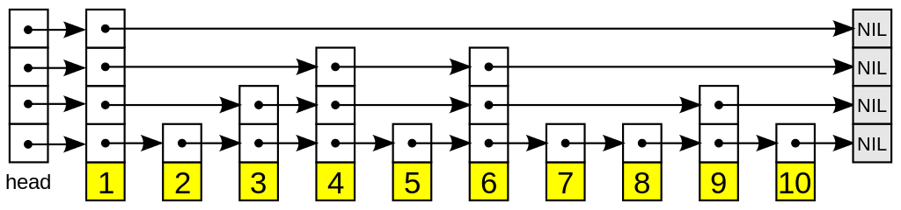

# Конкурентная очередь с приоритетами

# Введение

Очередь с приоритетами - это абстрактный тип данных с 2 операциями: 
- Enqueue - Добавить элемент
- Dequeue - Извлечь элемент с минимальным/максимальным ключом
  
Обычно она реализуется с помощью кучи. Но это синхронная реализация. Что если нужна конкурентная работа?

# Конкурентные реализации

Попыток создать конкурентные реализации было несколько. 
В результате многие пришли к выводу, что лучшей структурой данных лежащей в основе, будет список с пропусками.

<spoiler title="Список с пропусками">
Список с пропусками - это вероятностная структура данных. Она основана на нескольких отсортированных связных списках.

Всего есть несколько слоев, причем первый это обычный *упорядоченный* связный список. А каждый следующий уровень - отдельный список, который может указывать на другие.

За счет рандомизации высоты каждого узла, можно достичь логарифмической сложности `O(log(N))`.

Важная деталь - на первом уровне все узлы расположены в порядке возрастания.



</spoiler>

# Реализация 

При реализации конкурентной очереди с приоритетом в основе я использовал статью Linden and .. TODO: добавить ссылку на статью.

Моя реализация буквально слово в слово повторяет их, за исключением моментов: адаптации к C# и поддержки одинаковых ключей

## Основные структуры данных

Основной структурой является узел

```cs
internal class SkipListNode<TKey, TValue>
{
    /// <summary>
    /// Ключ
    /// </summary>
    public TKey Key = default!;
    
    /// <summary>
    /// Значение
    /// </summary>
    public TValue Value = default!;

    /// <summary>
    /// Массив указателей на другие узлы в списке.
    /// Каждый индекс соответствует своему уровню, начиная снизу.
    /// </summary>
    public SkipListNode<TKey, TValue>[] Successors = null!;

    /// <summary>
    /// Следующий узел логически удален
    /// </summary>
    public volatile bool NextDeleted;
    
    /// <summary>
    /// Узел находится в процессе вставки
    /// </summary>
    public volatile bool Inserting;

    /// <summary>
    /// Блокировка на время обновления узла
    /// </summary>
    public SpinLock UpdateLock = new();
} 
```

Сама очередь с приоритетами представляется таким образом

```cs
public class ConcurrentPriorityQueue<TKey, TValue>
{
    /// <summary>
    /// Голова списка
    /// </summary>
    private readonly SkipListNode<TKey, TValue> _head;
    
    /// <summary>
    /// Хвост списка
    /// </summary>
    private readonly SkipListNode<TKey, TValue> _tail;
    
    /// <summary>
    /// Максимальная высота списка
    /// </summary>
    private int Height => _head.Successors.Length;
    
    /// <summary>
    /// Максимальное количество хранимых логически удаленных узлов
    /// </summary>
    private readonly int _deleteThreshold;
    

    // ...
}    
```

## Enqueue

Первой операцией рассмотрим вставку нового элемента.
Механика вставки похожа на вставку в обычный список с пропусками. 

Эта операция делится на 2 части:
1. Вставка узла на 1 уровне
2. Наращивание высоты узла

### Вставка на 1 уровне

Вначале определяется место для вставки нового элемента.
Алгоритм такой же как и в обычном списке с пропусками:
1. Переходим на `i` уровень
2. Пропускаем все удаленные узлы
3. Пропускаем все узлы с ключами не больше, либо пока не наткнемся на хвост списка
4. Сохраняем 2 узла: на котором остановились и на который указывает этот узел на `i` уровне (между ними вставляем новый узел)

Повторяем так, пока не достигнем первого уровня.

```cs
/// <summary>
/// Для заданного ключа получить список всех ближайших левых (ключ меньше) узлов
/// </summary>
private (SkipListNode<TKey, TValue>[] Predecessors, SkipListNode<TKey, TValue>[] Successors, SkipListNode<TKey, TValue>? LastDeleted) GetInsertLocation(TKey key)
{
   var previous = _head;
   // Последний удаленный узел
   var lastDeleted = ( SkipListNode<TKey, TValue>? ) null;
   // Предшествующие узлы
   var predecessors = new SkipListNode<TKey, TValue>[Height];
   // Последующие узлы
   var successors = new SkipListNode<TKey, TValue>[Height];
   var i = Height - 1;
   while (0 <= i)
   {
         var current = previous.Successors[i];
         while (!IsTail(current) && 
               (
                  IsLessOrEqualThan(current.Key, key)
               || current.NextDeleted
               || ( previous.NextDeleted && i == 0 ) )
               )
         {
            if (previous.NextDeleted && i == 0)
            {
               // Запоминаем последний удаленный узел из префикса
               lastDeleted = current;
            }

            previous = current;
            current = previous.Successors[i];
         }

         predecessors[i] = previous;
         successors[i] = current;
         i--;
   }
   
   return ( predecessors, successors, lastDeleted );
}
```

В результате у нас есть 2 массива: `predecessors` и `successors` - предшествующие и последующие узлы для нового узла,
`i`-ый элемент которых указывает на предшествующий или последующий узел на `i` высоте

// TODO: картинка с логикой вставки и визуализацией элементов массивов

Далее, когда нам нужно будет вставить элемент на уровне `i` после предшествующего узла, нужно сравнить узел на который он указывает на `i` уровне с хранящимся элементом у нас (`successors[i]`)

Когда эти массивы получены вставляем элемент на первом уровне через `CAS`.
В случае, если операция провалилась - повторяем этот этап заново, так как список был изменен (в частности, перед предшественником на 1 уровне параллельно вставили узел)

```cs
public void Enqueue(TKey key, TValue value)
{
   // 1. Аллоцируем память, под узел
   var height = _random.Next(1, Height);

   var node = new SkipListNode<TKey, TValue>()
   {
      Key = key, 
      Value = value, 
      Successors = new SkipListNode<TKey, TValue>[height],
      Inserting = true,
   };
   // 2. Находим место, куда нужно вставить элемент
   var (predecessors, successors, lastDeleted) = GetInsertLocation(key);

   // 3. Пытаемся вставить в список на 1 уровне.
   //    Эта операция аналогична добавлению узла в сам список
   while (true)
   {
         node.Successors[0] = successors[0];
         var pred = predecessors[0];
         
         // Пытаемся атомарно обновить следующий узел в предыдущем узле
         var taken = false;
         pred.UpdateLock.Enter(ref taken);
         try
         {
            if (pred.Successors[0] == successors[0]
            && !successors[0].NextDeleted)
            {
               pred.Successors[0] = node;
               break;
            }
         }
         finally
         {
            if (taken)
            {
               pred.UpdateLock.Exit();
            }
         }

         // Заново рассчитываем предшественников и последователей
         ( predecessors, successors, lastDeleted ) = GetInsertLocation(key);
   }

   // ...
}
```

### Наращивание высоты

Когда узел был успешно добавлен в список, переходим ко 2 этапу - наращивание высоты. 
Начиная с этого момента, вставляемый узел является полноценным членом списка, поэтому в любой момент может быть удален, либо около него вставлены элементы.

Наращивание высоты происходит так же как и в обычном списке с пропусками снизу вверх (за исключением дополнительных проверок):
1. Переходим к очередному уровню `i`
2. Проверяем, что узел не удален
3. На новом узле выставляем ссылку на следующий узел на высоте `i` 
4. Атомарно (`CAS`) меняем ссылку на следующий узел у предшествующего узла с проверкой на равенство нашему последователю 
5. Если обмена не произошло, то 
   1. Вычисляем предшествующие и последующие узлы заново 
   2. Если предшествующий узел не равен добавляемому, то прекратить алгоритм

На шаге 2 мы делаем 2 проверки: 
- Следующий сразу после нас узел не удален
- Последующие узлы на каждом уровне не удалены

Обе они проверяют, что узлы *после* нас не удалены - проверки, что *вставляемый* узел удален не делаем.
Такая проверка исходит из того, что флаг удаления хранится в предыдущем узле и перед нами может в любой момент быть вставлен новый узел.

В оригинальной статье предполагалось наличие различных ключей, поэтому на этапе 5.2 проверялось равенство с последующим узлом. Я немного изменил алгоритм (добавил поддержку различных ключей), поэтому новые элементы с одинаковыми ключами добавляются после старых элементов. 
Может случиться и так, что добавился новый узел с одинаковым ключом, но наш узел еще не до конца добавлен. Я принял решение прекращать добавление новых узлов, так как это проще реализовать. 

```cs
public void Enqueue(TKey key, TValue value)
{
   // ...

   // 4. Постепенно наращиваем высоту вставляемого узла
   var i = 1;
   while (i < height)
   {
         if (node.NextDeleted
            || // Узел удален в процессе вставки 
            successors[i].NextDeleted
            || // Узел дальше удален, соответсвенно и мы
            successors[i] == lastDeleted)
         {
            // Узел был удален в процессе вставки
            break;
         }

         node.Successors[i] = successors[i];

         var old = Interlocked.CompareExchange(ref predecessors[i].Successors[i], node, successors[i]);
         if (old != successors[i])
         {
            // Кто-то другой изменил список, заходим на другой круг
            ( successors, predecessors, lastDeleted ) = GetInsertLocation(key);
            if (!ReferenceEquals(predecessors[0], node))
            {
               // Если добавлен новый узел
               break;
            }
         }

         i++;
   }

   node.Inserting = false;
}
```

## Dequeue

Удаление тоже разделено на 2 части: логическое и физическое.

### Логическое удаление

Логическое удаление - выставление флага удаления `NextDeleted`. 
Для логического удаления итерируются все узлы на первом уровне, пока не найдется тот, у которого следующий узел не удален.
Когда такой найден, выставляется флаг, и удаленным считается *следующий узел*.

В оригинальной статье, этот флаг хранился в наименьшем значащем бите указателя на первом уровне (`Successors[0]`).

В 32-х битных системах это будут 2 бита, а в 64-х битных - 3. 
Часто так и поступают (используют LSB в качестве флагов), но:
- В управляемых языках (C#, Java, Python) нет возможности прямого управления указателями
- В word-aligned архитектурах нет LSB в указателях - все место заполнено

Для решения этой проблемы я выделил флаг удаления в отдельное поле `NextDeleted` и, чтобы выполнить логическое удаление, беру блокировку.
В качестве блокировки использую `SpinLock`. Под капотом он использует `Interlocked.CompareExchange`, и так как при захваченной блокировке выполняется только простая проверка с присвоением (сложной логики нет), то (грубо) все действия можно заменить на один `CAS`.

```cs
public bool TryDequeue(out TKey key, out TValue value)
{
   // Текущий первый узел
   var currentHead = _head.Successors[0];
   
   // Запоминаем первый узел, чтобы избежать гонки при удалении старых узлов
   var observedHead = currentHead;
   
   // Количество пройденных удаленных узлов
   var deletedCount = 0;
   
   // Здесь храним новую голову списка, которой заменим старую 
   var newHead = ( SkipListNode<TKey, TValue>? ) null;
   
   while (true)
   {
      if (IsTail(currentHead))
      {
            key = default!;
            value = default!;
            return false;
      }

      if (currentHead.Inserting && 
            newHead is null)
      {
            newHead = currentHead;
      }

      if (currentHead.Deleted)
      {
            deletedCount++;
            currentHead = currentHead.Successors[0];
            continue;
      }

      // CAS
      lock (currentHead)
      {
         if (!currentHead.Deleted)
         {
            currentHead.Deleted = true;
            deletedCount++;
            break;
         }
      }

      currentHead = currentHead.Successors[0];
      deletedCount++;
   }

   // На этом моменте, в currentHead хранится узел, который мы удалили
   if (deletedCount < _deleteThreshold)
   {
      key = currentHead.Key;
      value = currentHead.Value;
      return true;
   }

   // ...
}
```

### Физическое удаление

Физическое удаление - очищение памяти. В случае управляемого языка, это значит просто удалить все указатели на удаленные узлы, а GC сам очистит память.
Для оптимизации физическое удаление происходит батчами, т.е. при достижении определенного количества логически удаленных узлов. Размер указывается параметром `DeleteThreshold`

Все логически удаленные узлы формируют префикс и таким образом список можно разделить на 2 части: 
- Префикс из удаленных узлов
- Список с живыми узлами с неубывающими ключами (сам список с пропусками)

Удаление так же выполняется с помощью `CAS` - старый первый узел меняется новым. 
Причем новый первый узел должен быть также удаленным, т.е. после первого удаления голова списка всегда будет указывать на удаленный узел. 

```cs
public bool TryDequeue(out TKey key, out TValue value)
{
   // ...

   // На данный момент, если newHead не null, то содержит узел, который был в процессе вставки в момент обхода.
   newHead ??= currentHead;

   var updated = false;

   // CAS
   lock(_head)
   {
      if (_head.Successors[0] == observedHead)
      {
         _head.Successors[0] = newHead;
         updated = true;
      }
   }
   
   if (updated)
   {
      RemoveDeletedNodes();
   }

   key = currentHead.Key;
   value = currentHead.Value;
   return true;
}

/// <summary>
/// Удалить ссылки на удаленные узлы из головы списка
/// </summary>
/// <remarks>
/// Удаление происходит только на верхних уровнях - первый не затрагивается
/// </remarks>
private void RemoveDeletedNodes()
{
   var i = Height - 1;
   var previous = _head;
   while (i > 0)
   {
      // Запоминаем старую голову списка, чтобы при обновлении не задеть новую
      var savedHead = _head.Successors[i];
      if (!savedHead.NextDeleted)
      {
            i--;
            continue;
      }
      
      var next = previous.Successors[i];

      // Находим последний удаленный узел
      while (next.NextDeleted)
      {
            previous = next;
            next = previous.Successors[i];
      }
      
      // Выставляем ссылку на следующий узел у головы списка
      var old = Interlocked.CompareExchange(ref _head.Successors[i], previous.Successors[i], savedHead);
      if (old == savedHead)
      {
            // Успешно обновили ссылку.
            // Ссылка могла не обновиться если есть несколько конкурентных операций Restructure,
            // в таком случае, просто повторяем операцию
            i--;
      }
   }
}
```

# Бенчмарки

Теперь настало время сравнения производительности.
Для сравнения я использовал очередь с приоритетом из стандартной библиотеки `System.Collections.Generic.PriorityQueue`. 

Сама очередь реализована с помощью 4-арной кучей (вместо 2 потомков - 4). Разбор реализации есть в [этой статье](https://habr.com/ru/companies/skbkontur/articles/666018/). А блокировка выполнена с помощью `lock`

```cs
public class LockingPriorityQueue<TKey, TValue>
{
   private readonly PriorityQueue<TValue, TKey> _queue = new();

   public void Enqueue(TKey key, TValue value)
   {
      lock (_queue)
      {
         _queue.Enqueue(value, key);
      }
   }

   public bool TryDequeue(out TKey key, out TValue value)
   {
      lock (_queue)
      {
         return _queue.TryDequeue(out value, out key);
      }
   }
}
```

Предварительно я добавил пулинг массивов `successors` и `predecessors` при вставке нового элемента. Реализован он с помощью `ConcurrentQueue`

Добавляемые ключи и значения генерируются предварительно. Количество элементов 100000. Во всех тестах используются одни и те же значения, так как ключ

Для тестов используются 2 вида поведения:
- Равномерное: каждый поток, после каждого `Enqueue` вызывает `Dequeue`
- Сначала вставка, потом удаление: каждый поток сначала добавляет все элементы затем вызывает `Dequeue` столько раз, сколько вызывал `Enqueue`

Параметры стенда:
- AMD Ryzen 5 6600H, 12 логических и 6 физических ядер
- .NET 6.0.21
- Ubuntu 22.04

Результаты представлены на графиках


Как видно: моя конкурентная реализация сильно уступает версии с глобальной блокировкой.

Даже когда заменил инстанциирование новых массивов `Successors` на пуллинг, а в версии с глобальной блокировкой заменил `SpinLock` на `lock` практически ничего не поменялось: даже худшее исполнение глобальной блокировки было лучше конкурентной версии кратно.

# Вывод

Оказалось версия с глобальной блокировкой сильно обгоняет конкурентную версию. 
Причиной этому я вижу:
- Большие накладные расходы на поиск места вставки нового узла и его постоянные вычисления
- Расходы на аллокации памяти для новых узлов
- Оптимальная реализация версии из стандартной библиотеки перевешивает затраты на глобальную блокировку

В оригинальной статье приводилось сравнение с другими  *конкурентными* реализациями, но сравнения с синхронной под блокировкой не было. Зато она была в статье [Jakob Gruber](https://arxiv.org/pdf/1509.07053.pdf) и там, версия Linden сильно обгоняла все остальные. 


> В ней использовалась реализация от авторов статьи. Думаю, в их реализации есть оптимизация некоторых моментов, которые я не учел.

Если есть предположения причин подобного, то пишите в комментариях. 
