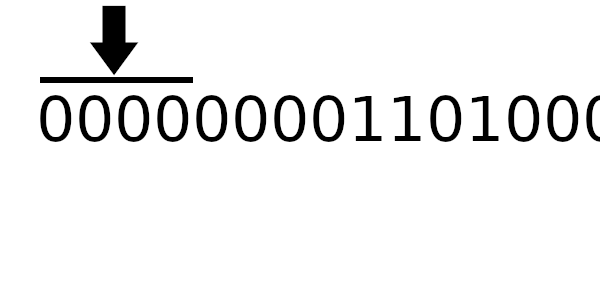

# Мотивация (введение)

Целостность - это важное свойство системы. 
Будет плохо, если пользовательские данные будут искажены, а мы и глазом не моргнем.

Существуют различные способы достижения этого. Как например, коды коррекции или обнаружения ошибок.
Собственно задача следующая: нам поступают пакеты данных и в процессе передачи данные могут быть искажены, 
поэтому принимающая сторона должна уметь обнаруживать подобные ситуации.

Одним из таких механизмов является CRC (Cyclic Redundancy Check) - циклический избыточный код.
Именно его я решил использовать для проверки целостности в приложении. 
Его реализаций в интернете полно - Ctrl + C, Ctrl + V не хочу.
Но я не я, если бы не ~~сделал свой велосипед~~ разобрался как этот алгоритм работает.

# Обзор алгоритма

Грубо говоря, CRC - это просто остаток от деления. Но до этого мы еще дойдем.

## Деление чисел с остатком

Что мы хотим - обнаружение изменения даже одного байта сообщения. 
Т.е. все биты данных должны учитываться. 
Но неплохо было бы иметь и "лавинность" как у криптографических хэш-функций.
На ум приходит деление, а точнее остаток от деления.

Например, поделим $645372$ на $43621$ и получим в остатке $34678$.


Поменяем только 1 цифру в делимом и попробуем снова: $644372 \%  43621 = 33678$.


Результат изменился - $34678$ и $33678$ не равны.

Что если представить поток байт, для которого нужно подсчитать чек-сумму, в виде очень большого числа?
Тогда нам остается только найти остаток от деления этого большого числа на делитель.
Уже неплохо. Но как этот делитель найти?
Тут надо вспомнить важное свойство остатка - он всегда меньше делителя.
Прекрасно! Тогда возьмем такой делитель, чтобы остаток укладывался в определенное число байт.
Например, если чек-сумма должна быть 4 байтной, то и максимальное значение делителя должно быть меньше 2^33.

Основу заложили - представляем байты в виде большого числа и находим его остаток от деления на число меньше 2^33.

Посмотрим, как реализуется деление с остатком в двоичном виде:


## Деление многочлена с остатком

Но работа в CRC ведется с полиномами, а не числами.
Тут мы подходим к другой важной концепции: остаток от деления многочлена. 

Получить остаток от деления можно не только от числа, но и от многочлена. 
Определяется остаток так же как и для обычных чисел. 
Разница только в том, что результатом будет не число, а многочлен.

Например, поделим многочлен $x^6 + 8x^4$ на $x^5 + 1$, тогда в результате получим:
- Частное: $x$
- Остаток: $8x^4 - x$


Но при чем тут многочлены? 
Дело в том, что многочлен можно закодировать в последовательность чисел, где каждое отражает коэффициент при соответствующей степени.

| Число        | x^6 | x^5 | x^4 | x^3 | x^2 | x^1 | x^0 |
|--------------|-----|-----|-----|-----|-----|-----|-----|
| $x^6 + 8x^4$ | 1   |     | 8   |     |     |     |     |
| $x^5 + 1$    |     | 1   |     |     |     |     | 1   |
| $x$          |     |     |     |     |     | 1   |     |
| $8x^4 - x$   |     |     | 8   |     |     | -1  |     |
 

## Многочлены над конечным полем GF(2)

Можно подметить, что двоичные числа - это закодированные многочлены.
Но есть один момент, который нужно учитывать - перенос коэффициентов. 

Например, возьмем $x^4 + x^2 + 1$ и $x^3 + x$. Их двоичное представление: $10101$ и $1010$ соответственно. Если мы их перемножим то получим:
- $10101 * 1010 = 11010010$
- $(x^4 + x^2 + 1) * (x^3 + x) = x^7 + 2x^5 + 2x^3 + x$

Вот тут мы можем заметить разницу между операциями над двоичными числами и операциями с многочленами - работа с коэффициентами. Когда мы перемножали многочлены, то получили $2x^5$ и $2x^3$, но коэффициент $2$ закодировать в двоичном представлении не можем. То если, просто так, работать с двоичными числами как многочленами - не можем.

Здесь на арену приходит "полиномиальная арифметика по модулю 2". 
Вкратце, она говорит, что 
- Все коэффициенты при каждой степени независимы друг от друга - "полиномиальная арифметика" 
- Результирующий коэффициент - это остаток от деления полученной суммы коэффициентов на 2 - "по модулю 2" (поле $GF(2)$ - [вики](https://en.wikipedia.org/wiki/GF(2)))

Попробуем умножить 2 многочлена в этой арифметике - $x^4 + x^2 + 1$ и $x^3 + x^2 + x$: 


К получившейся сумме добавим $x^3 + x$:


## Складываем все вместе

Но зачем вся эта информация?

Дело в том, что CRC работает в терминах многочленов над конечным полем GF(2) - "полиномиальная арифметика по модулю 2".
В частности, операции над числами в битовом представлении и есть это представление операций над такими многочленами (биты представляют коэффициенты).

Подытожим:
- Работаем с многочленами в конечном поле по модулю 2 (GF(2));
- На вход подается многочлен - байты для вычисления чек-суммы;
- Делитель - другой многочлен/полином (его называют порождающим многочленом);
- Задача CRC - найти остаток от деления переданного многочлена на порождающий.

Также важно уточнить, что порождающий многочлен всегда будет иметь в начале (старшим битом) 1.
Например, 8-битный полином $110110$ на самом деле будет равен $100110110$ или в CRC32, который порождает 4 байтную (32 бита) чек-сумму, полином, на самом деле, 33 битный.
Чаще всего он опускается, т.к. алгоритм построен так, чтобы можно было не писать его явно.

И главное, что надо заметить: XOR операции над двоичными числами отражают соответствующие операции деления многочленов над конечным полем GF(2).

Вот пруфы:


А теперь, это же деление, но используя представление в виде двоичных чисел:


Результат мы получаем один и тот же - зачем платить больше?

> Дальше будем говорить о делителе как о числе, а не полиноме.

# Реализация в лоб

Реализация у нас уже на руках.
Осталось только несколько моментов:
- Добавим регистр - переменную, в которой будем хранить промежуточный результат после каждого шага вычитания. 
  Его размер должен быть таким же как и у результата.
- Сообщение нужно дополнять в конце нулевыми байтами, чтобы регистр смог правильно обработать сообщение.
  Дополнять нужно столько-же, сколько занимает регистр (в битах).

Далее будем вычислять CRC для:
- Полинома: $00101101$
- Сообщения: $11010001$


> Заметьте дополняющие биты вначале и в конце

```cs
uint InitialSimpleRegister = 0xFFFFFFFF;
uint Polynomial = 0x04C11DB7;

uint ComputePerBit(byte[] payload)
{
    var register = InitialSimpleRegister;
    
    foreach (var bit in IterateBits())
    {
        var bitSet = ( register & 0x80000000 ) != 0;
        register <<= 1;
        register |= bit;
        if (bitSet)
        {
            register ^= Polynomial;
        }
    }
    
    // Обрабатываем нулевые биты сообщения (дополненные)
    for (var i = 0; i < 32; i++)
    {
        var bitSet = ( register & 0x80000000 ) != 0;
        register <<= 1;
        // Дальше идут только 0
        // register |= bitSet;
        if (bitSet)
        {
            register ^= Polynomial;
        }
    }
    
    return register;

    IEnumerable<uint> IterateBits()
    {
        foreach (var b in payload)
        {
            for (byte byteMask = 0b10000000; byteMask != 0; byteMask >>= 1)
            {
                yield return ( b & byteMask ) == 0 
                                 ? 0u
                                 : 1u;
            }
        }
    }
}
```

# Оптимизируем работу с байтами (табличная реализация)
   
Предыдущая реализация в лоб режет глаз. 
Она не оптимальна, как минимум, потому что компьютер работает с байтами, а не потоком бит.
Хотелось бы, чтобы работа велась с минимальным куском (byte) данных - байтом.

Есть один момент, который стоит заметить, - зависимость операций.
Каждая операция зависит только от текущего бита и предыдущих операций - в будущее мы не смотрим.

Для примера рассчитаем табличные значения для $1101$ и $1100$ (пригодятся дальше), а полином возьмем из предыдущего примера:


А к чему будет это значение применяться? К новому регистру (регистр смещается влево и к нему добавляется байт сообщения).
Теперь рассчитаем значение полинома используя этот алгоритм:



Компьютер всегда работает с байтами - отдельных битов быть не может. 
Давайте вычислим значения, которые нужно применять, в зависимости от старшего байта!

В этом и заключается оптимизация - создание подобной таблицы.

```cs
uint[] ComputeCrcTable()
{
    var table = new uint[256];
    
    for (int i = 0; i < 256; i++)
    {
        var crc = ( uint )( i << 24 );
        for (int bit = 0; bit < 8; bit++)
        {
            var bitSet = ( crc & 0x80000000 ) != 0;
            crc <<= 1;
            if (bitSet)
            {
                crc ^= Polynomial;
            }
        }
    
        table[i] = crc;
    }
    
    return table;
}

uint ComputeTableSimple(byte[] payload)
{
    var table = ComputeCrcTable();
    var register = InitialSimpleRegister;

    foreach (var b in payload)
    {
        register = ( ( register << 8 ) | b ) ^ table[register >> 24];
    }

    for (int i = 0; i < 4; i++)
    {
        register = ( register << 8 ) ^ table[register >> 24];
    }
    
    return register;
}
```

# Дальнейшие оптимизации

Заметили дополнительный цикл, который идет после обработки самого сообщения?
Это дополняющие биты, о которых было сказано ранее.
Вроде 4 байта, но не всегда удобно следить за таким (да и не совсем красиво). 

Можно, конечно, заставить самого пользователя добавлять нулевые биты в конце, но тогда может нарушиться логика, если внезапно забудешь это сделать.

На самом деле, эту проблему уже решили. 
Причем, на мой взгляд, кардинальным способом - изменили сам алгоритм (взгляд на него).

Чтобы понять, что имеется ввиду, обратим внимание на следующие факты:
1. Конечные нулевые байты нужны только для того, чтобы были корректно обработаны все байты исходного сообщения.
   Причем сами нули ни на что не влияют (`x XOR 0 = x`). Т.е. по факту, можно их не добавлять - главное провести все байты сообщения через алгоритм. 
2. Первые 4 цикла - это просто загрузка первых 4 байт сообщения.
   Причем независимо от того, что в регистре было изначально, этот этап можно опустить/сократить и сразу начать загружать байты сообщения.

<spoiler title="Почему первые 4 цикла можно опустить">

В зависимости от значения регистра может быть 2 случая:
1. Изначально был 0

    Все просто - первые 4 цикла загрузят первые 4 байта сообщения и никаким образом их не изменят.
    Изменений не будет, так как табличное значение для 0 - это 0, а `x XOR 0 = x`.
    Это можно заметить, если приглядеться к визуализациям выше.

2. Изначально был НЕ 0

    Этот случай не отличается от того, что если бы мы выполнили XOR между первыми 4 байтами сообщения и другим начальным значением регистра.
    Только это новое значение регистра не случайное, а вычисляется из изначального значения регистра старого алгоритма (об этом дальше).

</spoiler>

<spoiler title="Как работает получение индекса для табличного значения">

В старом алгоритме, после сдвига регистра в конец дописывалось само сообщение (его первые байты). А после, по мере работы алгоритма, к нему применялись операции из таблицы.

Т.е. происходило следующее: `message_byte XOR op1 XOR op2 XOR op3`:
- `message_byte` - байт сообщения, который дописали в конец
- `op*` - соответствующие табличные операции (* - номер операции)

Заметим 2 факта:
- XOR - ассоциативен. Это значит, что `message_byte XOR op1 XOR op2 XOR op3` дает тот же самый результат, что и `op1 XOR op2 XOR op3 XOR message_byte`
- `x XOR 0 = x` - XOR с 0, даст исходный результат.

Суммируя выше сказанное, можно переписать `message_byte XOR op1 XOR op2 XOR op3` в `0 XOR op1 XOR op2 XOR op3 XOR message_byte`.

В итоге, можно сделать такую корректировку алгоритма: 
1. После сдвига регистра можно не писать добавлять байты сообщения, а оставить 0 - `0`
2. По мере работы алгоритма, в этой части соберется накопленное значение всех операций - `0 XOR op1 XOR op2 XOR op3`
3. Когда нужно сдвинуть старший байт, то берем этот байт из сообщения только в этот момент - `0 XOR op1 XOR op2 XOR op3 XOR message_byte`

Результат будет один и тот же

</spoiler>

После небольшой модификации, алгоритм становится следующим:

1. Инициализируем регистр `register` (уже новым значением)
2. Для каждого байта `b` из сообщения:
   1. Берем старший байт из регистра `top_byte`
   2. Сдвигаем регистр на байт влево
   3. Вычисляем индекс для таблицы: `b XOR top_byte`
   4. Получаем значение из таблицы по полученному индексу
   5. XOR'им регистр с полученным значением из таблицы


Единственное, что пока непонятно - как рассчитывать новое начальное значение регистра.
Чтобы вычислить новое значение регистра, нужно пропустить старое через цикл 4 раза (только начальное значение, без байтов сообщения).

```cs
uint ComputeNewInitialValue()
{
    var register = InitialSimpleRegister;
    
    for (var i = 0; i < 32; i++)
    {
        var bitSet = ( register & 0x80000000 ) != 0;
        register <<= 1;
        if (bitSet)
        {
            register ^= Polynomial;
        }
    }
    
    return register;
}
```

<spoiler title="Пример с ненулевым начальным регистром">

Для примера возьмем то же самое число, но начальное значение регистра на этот раз будет `01100000`.
Нам также потребуются табличные значения:

| Ключ | Значение |
|------|----------|
| 0110 | 11101110 |
| 1001 | 01101000 |
| 1100 | 11110001 |
| 1110 | 10101011 |

Рассчитаем CRC для обычного табличного алгоритма:


В результате мы получили: $01110001$

Теперь попробуем новый табличный алгоритм. Для начала вычислим новое значение регистра: 


И теперь сам CRC:


Новый табличный алгоритм дал `01110001` - то же самое значение.

</spoiler>


Собственно сам код оптимизированного табличного алгоритма:
```cs
uint InitialOptimizedRegister = 0xC704DD7B;

uint ComputeTableOptimized(byte[] payload)
{
    var register = InitialOptimizedRegister;

    foreach (var b in payload)
    {
        register = ( register << 8 ) ^ Table[( register >> 24 ) ^ b];
    }
    
    return register;
}

uint ComputeTableOptimized(byte[] payload)
{
    var register = InitialOptimizedRegister;

    foreach (var b in payload)
    {
        register = ( register << 8 ) ^ Table[( register >> 24 ) ^ b];
    }
    
    return register;
}
```

# Параметризация

Вот мы и дошли до конца.
На текущий момент, мы увидели 3 места, которые могут быть настроены: 
1. Размер полинома
2. Значение полинома
3. Исходное значение регистра.

Но на самом деле их больше. Можно добавить еще 2 параметра:
- XOR конечного результата с каким-то числом - перед возвращением результата он XOR'ится с каким-то числом
- Порядок байтов - можно указать, что при работе все биты должны быть отзеркалены (UART отправляет биты в обратном порядке) 

Росс Уильямс выделяет такую параметризацию:
- **Width** - Степень полинома, число битов в регистре
- **Poly** - Значение полинома
- **Init** - Стартовое значение (указывается именно для табличного варианта)
- **RefIn** (Reflect In) - Изменить порядок бит перед началом обработки  
- **RefOut** (Reflect Out) - Изменить порядок бит перед передачей на XorOut этап 
- **XorOut** - Значение с которым нужно XOR'ить результирующее значение перед возвращением

Также есть 2 дополнительных поля. Лично я отношу их больше к метаданным:
- **Name** - Название алгоритма (этого сборника параметров)
- **Check** - Результирующее значение при обработке строки "123456789" (в ASCII кодировке)

Некоторые варианты реализации представлены в таблице ниже

| Name          | Width | Poly       | Init       | RefIn | RefOut | XorOut | Check     |
|---------------|-------|------------|------------|-------|--------|--------|-----------|
| CRC-5/ITU     | 5     | 0x15       | 0x0        | true  | true   | 0x0    | 0x7       |
| CRC-8         | 8     | 0x7        | 0x0        | false | false  | 0x0    | 0xF4      |
| CRC-16/USB    | 16    | 0x8005     | 0xFFFF     | true  | true   | 0xFFFF | 0xB4C8    |
| CRC-32/MPEG-2 | 32    | 0x04C11DB7 | 0xFFFFFFFF | false | false  | 0x0    | 0x376E6E7 |

# Заключение

Ну вот мы и прошли этот эволюционный путь от обработки потоков битов, до оптимизированного табличного алгоритма.

Но есть еще несколько тем, которые не были раскрыты:

## Выбор полинома

От выбора полинома зависит вероятность обнаружения ошибки.
Филлип Купман провел исследование влияния различных полиномов на вероятность нахождения ошибок за нас ([сайт](https://users.ece.cmu.edu/~koopman/crc/index.html)).
Он исследовал зависимость расстояния Хэмминга ошибок от полинома (и его длины соответственно). 
Исследования выявили оптимальные полиномы для расстояний Хэмминга от 2 до 6 (т.е. может заметить от 1 до 5 ошибок).
Ниже представлена часть таблицы с лучшими найденными полиномами:

| Расстояние хэмминга / Размер полинома | 8    | 16     | 32         |
|---------------------------------------|------|--------|------------|
| 2                                     | 0xE7 | 0x8D95 | 0xAD0424F3 |
| 3                                     | 0xE7 | 0x8D95 | 0xAD0424F3 |
| 4                                     | 0x83 | 0xD175 | 0xC9D204F5 |
| 5                                     | 0xEB | 0xAC9A | 0xD419CC15 |
| 6                                     | 0x9B | 0x9EB2 | 0x9960034C |


## Аппаратная поддержка

Вычисление CRC на столько популярна, что специальные операции были добавлены машинные инструкции:
- SSE4.2 ([вики](https://ru.wikipedia.org/wiki/SSE4#Подсчет_CRC32))
- ARM ([спецификация, 203с](http://www.heenes.de/ro/material/arm/arm_instruction_set_reference_guide.pdf))

# Полезные ссылки:
- A painless guide to CRC error detection algorithms ([оригинал](https://ceng2.ktu.edu.tr/~cevhers/ders_materyal/bil311_bilgisayar_mimarisi/supplementary_docs/crc_algorithms.pdf), [русский перевод](https://electronics-components.ru/files/2011/crcguide_168.pdf))
- Реализация CRC на C/Java ([GitHub](https://github.com/Michaelangel007/crc32))
- Каталог полиномов ([сайт](https://users.ece.cmu.edu/~koopman/crc/index.html))
