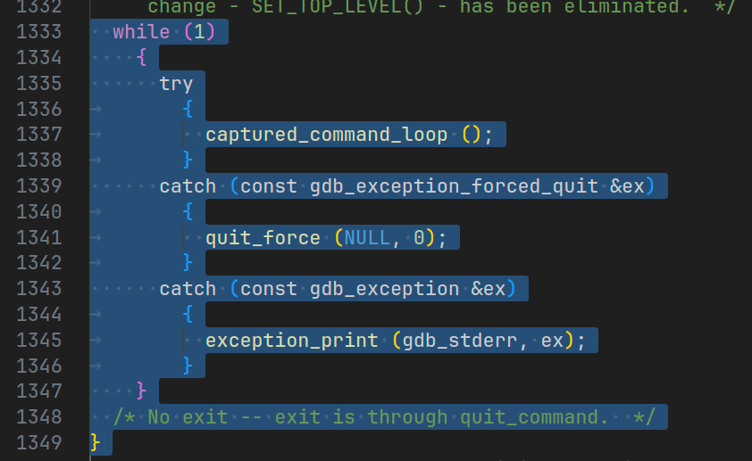

# Немного об отладке

> Отладка кода вдвое сложнее, чем его написание. Так что если вы пишете код настолько умно, насколько можете, то вы по определению недостаточно сообразительны, чтобы его отлаживать.
>
> Брайан Керниган

Приветствую.

Вы пользовались отладчиком? Если нет, то дальше читать не стоит. Если да, то вопрос: "Вы знаете, что такое отладка?". Нет, я серьезно. Всякие точки останова, шаги, перехват исключений и т. д. Вы использовали эту функциональность как пользователь, но интересовались, что там под капотом?

Я такой человек, что мне сложно что-то использовать, не понимая как это работает. Не люблю магию и черные ящики. Если вы такой же как и я, то добро пожаловать. Приключение на 20 минут.

ВНИМАНИЕ: Автор не клеймит себя великим знатоком, он может (и скорее всего) ошибаться. Если нашли ошибку — сообщите, исправлю.

# Ядро

Итак, мы хотим понять как происходит отладка. Для начала определим наш сетап. У меня Linux + amd64 (x86) и у читателя, думаю, тоже, поэтому ядро отладки рассмотрим для этой конфигурации.

Для этой конфигурации весь процесс отладки крутится вокруг 2 вещей:

- `ptrace`
- `INT 3`

`ptrace` — это системный вызов, который используется для отслеживания процесса (**p**rocess **trace**):

```c
long ptrace(enum __ptrace_request request, pid_t pid, void *addr, void *data);
```

Можно заметить сходство с другими вызовами по типу `ioctl` или `fcntl` — код запроса (перечисление `__ptrace_request`), идентификатор объекта (`pid`) и вспомогательные данные (`addr`, `data`).

> Понимаю, что на этом вызове много обязанностей и трудно придумать более тонкий вариант, но это как-то контрастирует с философией Unix — `делают что-то одно`.
> Может я прикапываюсь.

Благодаря этому системному вызову можно:

- `PTRACE_CONT`/`PTRACE_SINGLESTEP` — получить контроль над выполнением.
- Прочитать и изменять:
  - `PTRACE_GETREGS`/`PTRACE_SETREGS` — регистры.
  - `PTRACE_PEEKDATA`/`PTRACE_POKEDATA` — память и код.
  - `PTRACE_PEEKUSER`/`PTRACE_POKEUSER` — TODO: придумать как назвать.
  - `PTRACE_SET_THREAD_AREA` — локальные данные потока (TLS).
- `PTRACE_SET_SYSCALL` — подменять вызываемые системные вызовы.
- `PTRACE_SECCOMP_GET_FILTER` — получать информацию о [seccomp](https://man.archlinux.org/man/seccomp.2.en).

<spoiler title="Откуда пришли PEEK & POKE">

`PEEK` и `POKE` это не случайные названия функций. Изначально это функции из BASIC. Первая читает из ячейки памяти по указанному адресу, а вторая — записывает. Причем адрес абсолютный.

Но не это интересно, а история вокруг нее. На [jargon.net](http://jargon.net/jargonfile/p/peek.html) есть история этого термина. И вот вырезка:

> question like "How do I do a peek in C?" is diagnostic of the newbie

Перевожу: если кто-то задает вопрос "А как делать PEEK в C?", то скорее всего он новенький, так как современные *высокоуровневые* языки программирования и ОС позволяют абстрагироваться от подобных деталей.

</spoiler>

Для начала рассмотрим общий взгляд на процесс отладки. Грубо говоря, процесс отладки итеративный и каждую итерацию можно представить в виде 3 шагов:

1. Ждем точку останова.
2. Выполняем необходимые действия.
3. Продолжаем работы

Рассмотрим каждый шаг.

> Далее буду использовать терминологию из man: `tracer` - отладчик, `tracee` - процесс, который отлаживаем

## Ждем точку останова

Первое - нам необходимо дождаться остановки tracee. Пока представим, что она есть и рано или поздно tracee до нее дойдет.

Главный принцип работы `ptrace` можно описать так: tracee получает сигнал (спойлер - `SIGTRAP`) и останавливается, а tracer в этот момент получает контроль, что-то делает и продолжает работу tracee. Для ожидания этого сигнала tracer использует `waitpid`.

И сам смысл точки останова в следующем:

> tracee останавливается каждый раз, когда *получает сигнал* (любой), а tracer в это время пробуждается и *`WIFSTOPPED`*, вызванный на полученном статусе, возвращает `true`.

То есть, отслеживаемый процесс получает любой сигнал, в этот момент останавливается и `waitpid` возвращается с соответствующим статусом.

Ждать остановки tracee требуется обязательно - практически все `ptrace` вызовы, которые изменяют состояние tracee, вернут `ESRCH`, если будут вызваны над работающим процессом. С одной стороны, ограничение - нельзя вставить палку в колеса едущему велосипеду, но, с другой, интересно было бы посмотреть что случится. Только 5 команд не требуют остановленного состояния, но и они используются для начала и окончания процесса отладки. Об этих командах можно посмотреть в секции Informational and restarting ptrace commands в `man 2 ptrace`.

<spoiler title="Разные статусы остановки">

Когда `waitpid` возвращается, то tracee остановлен, да. Но вот типов таких остановок несколько. Общее состояние, когда tracee остановлен для обработки им tracer'ом называется ptrace-stop и он разбивается на подгруппы:

- `signal-delivery-stop` - tracee получил сигнал и мы его перехватили
- `group-stop` - многопоточный процесс
- `PTRACE_EVENT stop` - получено событие от `ptrace` (ниже)
- `syscall-stop` - мы вызвали `ptrace(PTRACE_SYSCALL)` и начался системный вызов

По `PTRACE_EVENT stop` подробнее. Вызов `PTRACE_SETOPTIONS` позволяет выставить "свойства" `ptrace`, его поведение. Например, если с этим вызовом передать `PTRACE_O_TRACEFORK`, то мы остановимся при следующем вызове `fork` и tracee войдет в состояние `PTRACE_EVENT stop`.

И еще - вызов блокирующего системного вызов это не ptrace-stop. Процесс может остановиться, да, но он не в ptrace-stop состоянии.

</spoiler>

Когда `waitpid` вернулся, то необходимо проверить его статус. Грубо говоря, статус можно разделить 2 случая - останов и конец работы процесса. Определить это можно по упомянутому выше `WIFSTOPPED`. С учетом того, что останавливаться будем множество раз, то код отладчика в общем случае можно представить следующим образом:

```cpp
pid_t pid;
int wstatus;
while (true)
{
    /* 
     * Ждем остановки tracee 
     */
    pid_t ret_pid = waitpid(pid, &wstatus, 0);
    if (!WIFSTOPPED(wstatus))
    {
        /* 
         * Процесс завершил работу
         */
        break;
    }

    /* 
     * Выполняем необходимые действия
     * ...
     */

    /* 
     * И продолжаем работу
     * ...
     */
}
```

## Основные манипуляции

На этом моменте, tracee остановлен, а нам (дебаггеру) вернули управление из `waitpid`. Представим, что точка останова сработала и процесс не завершил свою работу. Теперь начинается самое интересное - процесс отладки: просмотр и изменение состояния tracee.

Команды, которые призваны получать и изменять состояние tracee, в документации называются информационными (informational). Есть множество аспектов процесса, которыми мы можем управлять и для них есть по 2 команды (`PTRACE_*`) - для чтения и записи.

Сейчас нас будут интересовать только `PTRACE_PEEKTEXT`/`PTRACE_POKETEXT` и `PTRACE_GETREGS`/`PTRACE_SETREGS`. Первая команда используется для получения и изменения данных и кода процесса, а вторая - для регистров.

> Дополнительно есть `PTRACE_PEEKDATA`/`PTRACE_POKEDATA`.
> Эта команда должна работать с данными процесса (областью памяти), а `PTRACE_PEEKTEXT`/`PTRACE_POKETEXT` - с секцией кода (`.text`). Но, как описано в man, у линукса адресное пространство данных и кода единое, поэтому обе команды выполняют одно и то же.

В сигнатуре `ptrace` используется 4 аргумента: первые 2 для идентификации процесса и операции, а вторые 2 - для передачи специфичных для конкретной операции параметров. В частности, передаются 2 указателя. Их семантика отличается от команды к команде, а некоторые команды используют только часть, либо не используют эти параметры вообще, поэтому для каждой команды надо смотреть отдельно.

Для примера, если `rax` равен 0, то записать число 1 (4 байтное число), по адресу из регистра `rbx`. Реализовать это можно следующим образом:

```cpp
struct user_regs_struct regs;
ptrace(PTRACE_GETREGS, child_pid, NULL, &regs);
if (regs.rax == 0)
{
    void *addr = (void *)regs.rbx;
    long data = ptrace(PTRACE_PEEKTEXT, child_pid, addr, NULL);
    *((int *)&data) = 1;
    ptrace(PTRACE_POKETEXT, child_pid, addr, (void*)data);
}
```

Обратите внимание на то, как записывается число 1. Загвоздка в том, что команды `PEEKTEXT` и `POKETEXT` работают с *машинным словом*, грубо говоря, размером указателя. У меня 64-битная машина, поэтому его размер 8 байтов, а записываю я 4-х байтное. Если бы я хотел записать 8 байтное (`long`), то мог бы сделать это проще, без read-modify-write.

```cpp
struct user_regs_struct regs;
ptrace(PTRACE_GETREGS, child_pid, NULL, &regs);
if (regs.rax == 0)
{
    void *addr = (void *)regs.rbx;
    long data = 1L;
    ptrace(PTRACE_POKETEXT, child_pid, addr, (void*)data);
}
```

Ну и вообще, вся работа с памятью (чтение и запись) ведется подобным образом - читаем необходимый диапазон памяти по машинному слову и после записываем также по машинному слову.

## Продолжение работы

Когда все необходимые действия выполнили, то надо продолжить работу процесса.
Сделать это можно 2 способами:

- `PTRACE_SINGLESTEP` - Выполнить только 1 инструкцию
- `PTRACE_CONT` - Продолжить выполнение

Логично, что следующая остановка у первой команды будет у начала следующей инструкции, а у второй — при следующем сигнале.

## Изначальный запуск

Последнее, что мы не покрыли — как начинается процесс отладки. У нас есть 2 варианта:

- Сами запускаем процесс для отладки
- Присоединяемся к уже работающему процессу

### Самостоятельный запуск

Для самостоятельного запуска есть следующий паттерн:

1. Форкаемся.
2. Потомок вызывает `ptrace(PTRACE_TRACEME, 0, NULL, NULL)` и запускает `exec**` с нужной программой.
3. Родитель постоянно вызывает `waitpid` с пидом потомка и ждет, пока не остановится.

```c++
void child_main()
{
    /* 
     * Позволяем родителю отслеживать себя
     */
    ptrace(PTRACE_TRACEME, 0, NULL, NULL);
    /* 
     * Запускаем отлаживаемую программу
     */
    execlp("executable", "arg1");
}

void parent_main(pid_t child)
{
    int wstatus;
    while (1)
    {
        /* 
         * Ждем остановки потомка
         */
        waitpid(child_pid, &wstatus, 0);
        if (!WIFSTOPPED(wstatus))
        {
            /*
             * Потомок завершил работу
             */
            break;
        }
        /*
         * Выполняем необходимые действия над потомком
         */
        perform_actions(child_pid);
        /* 
         * Продолжаем его работу
         */
        ptrace(PTRACE_CONT, child_pid, NULL, NULL);
    }
}

int main()
{
    pid_t child_pid;
    if ((child_pid = fork()) == 0)
    {
        child_main();   
    }
    else
    {
        parent_main(child_pid);
    }
}
```

### Присоединяемся к запущенному процессу

Если какой-то процесс уже запущен и мы хотим его отладить, то для этого используется уже другой вызов - `PTRACE_ATTACH`.

При присоединении к другому процессу через `PTRACE_ATTACH` отлаживаемому процессу посылается `SIGSTOP` - это нужно, чтобы мы могли остановить процесс и поработать с ним. Системные вызовы могут вернуть `EINTR`, когда они прерываются сигналом. Поэтому, можно сказать, что `PTRACE_ATTACH` создает этот `errno`.

```c++

int main()
{
    int wstatus;
    pid_t child_pid = obtain_pid();
    ptrace(PTRACE_ATTACH, child_pid, NULL, NULL);
    while (1)
    {
        waitpid(child_pid, &wstatus, 0);
        if (!WIFSTOPPED(wstatus))
        {
            /*
             * Потомок завершил работу
             */
            break;
        }
        /*
         * Выполняем необходимые действия над потомком
         */
        perform_actions(child_pid);

        /* 
         * Продолжаем его работу
         */
        ptrace(PTRACE_CONT, child_pid, NULL, NULL);
    }
}
```

Если нам НЕ нужно останавливать процесс после присоединения, то для этого используется `PTRACE_SEIZE`. В этом случае, нам становится доступна еще одна команда - `PTRACE_INTERRUPT`. Как понятно из имени, он нужен для прерывания потока.

В man'е описано 4 варианта развития событий при выполнении этой команды:

- При выполняющемся системном вызове этот вызов вернет `EINTR`
- Уже остановленный, но при применении `PTRACE_LISTEN`
- При конкурентном событии остановки
- Все остальные случаи
  
## Собирая детали вместе

На этом моменте, в голове уже имеется общая картина, того как работают отладчики: процесс останавливается сигналом, мы его препарируем `ptrace`'ом и продолжаем его работу.

Для примера, мы будем использовать программу для сложения 2 чисел. В ней будет ошибка и нам нужно будет ее отловить - вместо `+` используется `-`. Но эта программа будет не на C/Java/Go и т.д. Мы оперируем инструкциями, единственным что понимает процессор (и точки останова это машинные инструкции). Соответственно мы должны работать не с исходным кодом, а инструкциями (для простоты далее, буду говорить ассемблер).

Для начала, код нашей багованной программы:

<spoiler title="Код tracee">

Дополнительно, код в C для простоты понимания

```c
#include <stdio.h>
#include <stdlib.h>

long sum(long a, long b) {
    long c = a - b;
    return c;
}

int main(int argc, char **argv) {
    long left = atol(argv[0]);
    long right = atol(argv[1]);
    long result = sum(left, right);
    printf("%ld\n", result);
    return 0;
}
```

```asm
.globl main

.section .rodata
format_str: .asciz "%ld\n"

.section .text
sum:
    # return a - b
    subq %rsi, %rdi
    movq %rdi, %rax
    ret

main:
    pushq %rbp
    movq %rsp, %rbp

    # %r12 - argv
    # %r13 - left
    # %r14 - right

    mov %rsi, %r12

    # long left = atol(argv[1])
    movq 8(%rsi), %rdi
    call atol
    movq %rax, %r13

    # long right = atol(argv[2])
    movq 16(%r12), %rdi
    call atol
    movq %rax, %r14

    # long result = sum(left, right)
    movq %r13, %rdi
    movq %r14, %rsi
    call sum

    # printf("%ld\n", result)
    movq $format_str, %rdi
    movq %rax, %rsi
    call printf

    xor %rax, %rax
    movq %rbp, %rsp
    popq %rbp
    ret
```

</spoiler>

Теперь нам нужно найти проблемное место. Представим, что знаем, что оно в функции `sum` и мы должны поставить точку останова прямо перед выходом, чтобы посмотреть, что эта функция возвращает.

Готового отладчика нет, поэтому придется написать самим. Мы не будем сейчас писать общий отладчик для всех и каждого - напишем конкретно для этой программы. Но для начала, что такое точка останова.

## int 0x3

Процессор понимает только инструкции и точка останова одна из таких.

`int 0x3` - это инструкция точки останова:

- `int` - это ассемблерная инструкция, генерирующая прерывание. Она принимает на вход аргумент
- `0x3` - номер прерывания точки останова

Когда выполнение доходит до этой инструкции, то вызывается обработчик из [вектора прерываний](https://wiki.osdev.org/Interrupt_Vector_Table#:~:text=On%20the%20x86%20architecture%2C%20the,older%20software%20(e.g.%20MS-DOS%20programs)). В результате Linux посылает сигнал `SIGTRAP`, который перехватывает отладчик и вот в момент его получения мы можем получить контроль над процессом.

<spoiler title="SIGTRAP особенный">

Если мы посмотрим как обрабатывается int3, то увидим, что он отправляет тот самый `SIGTRAP`

```c
/* https://github.com/torvalds/linux/blob/ec9eeb89e60d86fcc0243f47c2383399ce0de8f8/arch/x86/kernel/traps.c#L735 */
DEFINE_IDTENTRY_RAW(exc_int3)
{
	/*
	 * poke_int3_handler() is completely self contained code; it does (and
	 * must) *NOT* call out to anything, lest it hits upon yet another
	 * INT3.
	 */
	if (poke_int3_handler(regs))
		return;

	/*
	 * irqentry_enter_from_user_mode() uses static_branch_{,un}likely()
	 * and therefore can trigger INT3, hence poke_int3_handler() must
	 * be done before. If the entry came from kernel mode, then use
	 * nmi_enter() because the INT3 could have been hit in any context
	 * including NMI.
	 */
	if (user_mode(regs)) {
		irqentry_enter_from_user_mode(regs);
		instrumentation_begin();
		do_int3_user(regs);
		instrumentation_end();
		irqentry_exit_to_user_mode(regs);
	} else {
		irqentry_state_t irq_state = irqentry_nmi_enter(regs);

		instrumentation_begin();
		if (!do_int3(regs))
			die("int3", regs, 0);
		instrumentation_end();
		irqentry_nmi_exit(regs, irq_state);
	}
}

static void do_int3_user(struct pt_regs *regs)
{
	if (do_int3(regs))
		return;

	cond_local_irq_enable(regs);
	do_trap(X86_TRAP_BP, SIGTRAP, "int3", regs, 0, 0, NULL);
	cond_local_irq_disable(regs);
}
```

Также мы можем зарегистировать обработчики сигналов. Если это не сделать, то поведение будет по умолчанию (указано в `man 7 signal`): core-dump, termination, ignore. Еще существуют специальные константы `SIG_DFL` и `SIG_IGN` - если при регистрации обработчика указать их то сигнал будет обрабатывать по умолчанию или игнороварться.

Но не все так просто. Некоторые сигналы игноровароть нельзя (выставить `SIG_IGN`). Таковыми являются `SIGKILL` и `SIGSTOP`. Об этих 2 сигналах говорится и в `man 7 signal`

> The signals SIGKILL and SIGSTOP cannot be caught, blocked, or ignored.

И в [SUS версии 4 2016 года](https://archive.org/download/single_unix_specification_version_4_2016_edition)

> The system shall not allow the action for the signals SIGKILL or SIGSTOP to be set to SIG_IGN

Но исследуя код Linux, обнаружил, что к ним добавляется еще и `SIGTRAP`:

```c
/* https://github.com/torvalds/linux/blob/adc218676eef25575469234709c2d87185ca223a/arch/x86/kernel/ptrace.c#L1408 */
void send_sigtrap(struct pt_regs *regs, int error_code, int si_code)
{
	struct task_struct *tsk = current;

	tsk->thread.trap_nr = X86_TRAP_DB;
	tsk->thread.error_code = error_code;

	/* Send us the fake SIGTRAP */
	force_sig_fault(SIGTRAP, si_code,
			user_mode(regs) ? (void __user *)regs->ip : NULL);
}

/* https://github.com/torvalds/linux/blob/adc218676eef25575469234709c2d87185ca223a/kernel/signal.c#L1733 */
int force_sig_fault(int sig, int code, void __user *addr)
{
	return force_sig_fault_to_task(sig, code, addr, current);
}

int force_sig_fault_to_task(int sig, int code, void __user *addr,
			    struct task_struct *t)
{
	struct kernel_siginfo info;

	clear_siginfo(&info);
	info.si_signo = sig;
	info.si_errno = 0;
	info.si_code  = code;
	info.si_addr  = addr;
	return force_sig_info_to_task(&info, t, HANDLER_CURRENT);
}

static int
force_sig_info_to_task(struct kernel_siginfo *info, struct task_struct *t,
	enum sig_handler handler)
{
	unsigned long int flags;
	int ret, blocked, ignored;
	struct k_sigaction *action;
	int sig = info->si_signo;

	action = &t->sighand->action[sig-1];
	ignored = action->sa.sa_handler == SIG_IGN;
	blocked = sigismember(&t->blocked, sig);
	if (blocked || ignored || (handler != HANDLER_CURRENT)) {
		action->sa.sa_handler = SIG_DFL;
		if (handler == HANDLER_EXIT)
			action->sa.sa_flags |= SA_IMMUTABLE;
		if (blocked)
			sigdelset(&t->blocked, sig);
	}
    
    /* ... */
	return ret;
}
```

</spoiler>

Но мало знать про молоток, надо знать как его использовать.

Во-первых, как эту точку останова добавить? Первым в голову приходит вставить эту инструкцию перед той, где нужно остановиться. Но это практически не реализовать: нам нужно будет сдвинуть все остальные инструкции далее (все существующие адреса останутся преждними), но при этом выделенное для секции кода место не расширить. Единственное решение - это переписать существующие инструкции. Кто-то может спрость "как так? секция `.text` недоступна для записи!". Да, но только для пользовательского пространства, а в случае с `ptrace` - 1) часть ядра, 2) может выполняться только если выполняется с полученными привилегиями. Короче говоря, с помощью `ptrace` можно изменять и секцию `.text` (в общем, он может манипулировать адресным пространством как захочет). Вы могли заметить команду `PTRACE_POKETEXT` - как можно догадаться это она изменяет код программы (то что по переданному адресу находится).

`int ARG` - это полноценная инструкция с аргументом. x86 - это CISC, то есть все инструкции имеют разную длину. Если посмотреть в эту инструкцию, то окажется, что она занимает 2 байта: `0xCD ARG`. А теперь представим, что мы хотим поставить точку останова в таком месте:

```c
/* 
 * Пользователь обновил свой интервал бронирования номера - нам нужно уведомить об этом других
 */
void notify_user_rest_interval(long start, long end)
{
    if (start == end)
    {
        /* 
         * Однодневный интервал пропускаем для оптимизации
         */
        return;
    }

    /* 
     * Уведомляем по телеге
     */
    notify_telegram();
}
```

После компиляции, мы можем получить такой ассемблерный код (справа машинный код):

```assembler
notify_user_rest_interval:
    cmpq %rdi, %rsi         # 48 39 FE
    jnz pass                # 75 01
    ret                     # C3
pass:
    call notify_telegram    # e8 00 00 00 00
```

Что случится, если поставим точку останова на `ret`? Подсказка, `ret` занимает 1 байт, а точка останова - 2. Правильно, мы затрем следующую инструкцию - `call`. А что тогда произойдет, если мы выполним `jnz` на этот (бывший) `call`? Правильно, ничего хорошего. Но для наглядности посмотрим, что будет при 2 байтной инструкции.

```assembler
    notify_user_rest_interval:
    cmpq %rdi, %rsi         # 48 39 FE
    jnz pass                # 75 01
    int $3                  # CD
pass:
    addl (%rax), %eax       # 03 00 
    addb %al, (%rax)        # 00 00  
    n/a                     # 00
```

Здесь важно заметить, что для `call` я ранее передавал нули, так как реальный адрес появится только во время выполнения.
Поэтому для примера я также использую нули.

И уже тут можно заметить, что:

1. Вызов функции `notify_telegram` исчез
2. Добавились новые инструкции, которые изменяют содержимое регистров (наше состояние), причем скорее всего мусором, так как используется `rax` - регистр для результата функции (не инициализирован)
3. В конце вообще появилась некорректная инструкция `00` - обозначил n/a

В данном случае, мы хотя-бы словим `SIGILL` за счет последней некорректной инструкции и ничего плохого не сделаем.
Но с учетом того, что адрес будет случайным (спасибо ASLR), то на месте мной указанных появятся случайные инструкции и тогда будь что будет.

Хорошо что об этом уже позаботились. Для `int 3` существует отдельная 1-байтовая инструкция - `0xCC`. Вот ее мы и будем использовать.

Таким образом, в реализации точек останова можно выделить 2 основных алгоритма: ее выставление и момент захода в нее.

Выставление точки останова:

1. Получаем адрес нужной нам инструкции (`ptrace(PEEKTEXT)`)
2. Пишем поверх нее инструкцию `int 0x3`/`0xCC` (запоминаем что затерли!) (`ptrace(POKETEXT)`)

Заход в точку останова:

1. Точка останова срабатывает (генерирование прерывания)
2. Tracer подготавливает окружение:
   1. Получает управление (`SIGTRAP`)
   2. Переходит к предыдущей инструкции (`RIP = RIP - 1`)
   3. Восстанавливает затертую инструкцию (`ptrace(POKETEXT)`)
3. Tracer выполняет необходимые манипуляции
4. Tracer продолжает выполнение tracee

Для tracee это все происходит прозрачно - кроме сигнала практически нет внешних эффектов.

Вот теперь, можно сказать, что тему ядра отладчиков покрыли. Суммируя:

1. Вся магия заключена в комбинации системного вызова `ptrace` и инструкции точки останова `int 0x3`
2. Отладчик просто ждет пока потомок не остановится при возникновении очередного сигнала
3. Для создания этого сигнала используется `int 0x3`, которая создает `SIGTRAP` сигнал
4. Точка останова - это `int 0x3` записанная поверх исходных инструкций и, когда до нее доходим, восстанавливаем исходные инструкции и ступаем на 1 инструкцию назад

Возвращаюсь к исходной программе на ассемблере, которую мы хотели отладить (где вместо суммы было вычитание). Используя новые знанния мы можем написать такой ad-hoc отладчик:

<spoiler title="ad-hoc отладчик">

```c
#include <stdlib.h>
#include <stdio.h>

#include <unistd.h>
#include <errno.h>
#include <sys/ptrace.h>
#include <sys/wait.h>
#include <sys/user.h>

static int child_main() {
    const char *argv[] = {"./tracee", "1", "2", NULL};
    if (ptrace(PTRACE_TRACEME, 0, 0, 0) == -1) {
        perror("ptrace(PTRACE_TRACEME)");
        exit(1);
    }
    execve(argv[0], (char * const*) argv, NULL);
    perror("execve");
    exit(1);
}

int main(int argc, const char **argv) {
    pid_t child_pid = fork();
    if (child_pid == -1) {
        exit(1);
    }

    if (child_pid == 0) {
        child_main();
        exit(1);
    }
    
    int status;
    if (waitpid(child_pid, &status, 0) == -1) {
        perror("waitpid");
        exit(2);
    }

    if (WIFEXITED(status) || WIFSIGNALED(status)) {
        printf("child existed with status code: %d", WEXITSTATUS(status));
        exit(2);
    }

    /* Адрес инструкции перед началом sub */
    // const long sum_addr = 0x401136;
    const long sum_addr = 0x401136;

    /* Выставляем точку останова в начале функции sum */
    long word = ptrace(PTRACE_PEEKDATA, child_pid, (void *)sum_addr, NULL);
    if (word == -1) {
        perror("ptrace(PTRACE_PEEKDATA)");
        exit(3);
    }

    long saved_instruction = word;
    word = (word & ~0xFF) | ((long) 0xCC);
    if (ptrace(PTRACE_POKEDATA, child_pid, (void*)sum_addr, word) == -1) {
        perror("ptrace(PTRACE_POKEDATA)");
        exit(3);
    }

    /* Продолжаем выполнение */
    if (ptrace(PTRACE_CONT, child_pid, 0, 0) == -1) {
        perror("ptrace(PTRACE_CONT)");
        exit(3);
    }

    /* Дожидаемся остановки */
    if (waitpid(child_pid, &status, 0) == -1) {
        perror("waitpid");
        exit(3);
    }

    if (WIFEXITED(status) || WIFSIGNALED(status)) {
        printf("child existed with status code: %d", WEXITSTATUS(status));
        exit(3);
    }

    struct user_regs_struct regs;
    if (ptrace(PTRACE_GETREGS, child_pid, NULL, &regs) == -1) {
        perror("ptrace(PTRACE_GETREGS)");
        exit(4);
    }

    printf("Before sum: RDI = %lld, RSI = %lld\n", regs.rdi, regs.rsi);
    
    /* Восстанавливаем инструкцию, откатываемся и делаем шаг */
    if (ptrace(PTRACE_POKEDATA, child_pid, sum_addr, saved_instruction) == -1) {
        perror("ptrace(PTRACE_POKEDATA)");
        exit(4);
    }

    if (ptrace(PTRACE_GETREGS, child_pid, NULL, &regs) == -1) {
        perror("ptrace(PTRACE_GETREGS)");
        exit(5);
    }

    regs.rip--;
    if (ptrace(PTRACE_SETREGS, child_pid, NULL, &regs) == -1) {
        perror("ptrace(PTRACE_SETREGS)");
        exit(5);
    }

    if (ptrace(PTRACE_SINGLESTEP, child_pid, 0, 0) == -1) {
        perror("ptrace(PTRACE_GETREGS)");
        exit(5);
    }

    if (waitpid(child_pid, &status, 0) == -1) {
        perror("waitpid");
        exit(6);
    }

    if (WIFEXITED(status) || WIFSIGNALED(status)) {
        printf("child exited with status code: %d", WEXITSTATUS(status));
        exit(4);
    }

    /* Читаем состояние после этой инструкции */
    if (ptrace(PTRACE_GETREGS, child_pid, NULL, &regs) == -1) {
        perror("ptrace(PTRACE_GETREGS)");
        exit(4);
    }

    printf("After sum: RDI = %lld, RSI = %lld\n", regs.rdi, regs.rsi);

    /* Выполняем до остановки */
    if (ptrace(PTRACE_CONT, child_pid, 0, 0) == -1) {
        perror("ptrace(PTRACE_CONT)");
        exit(5);
    }

    if (waitpid(child_pid, &status, 0) == -1) {
        perror("waitpid");
        exit(5);
    }

    if (!WIFEXITED(status)) {
        printf("Child is still running");
        exit(5);
    }

    return 0;
}
```

</spoiler>

Но ставит точку останова на функции (точнее сказать метке) `sum`, по ее достижении выводит значения `RDI` и `RSI`, восстанавливает инструкцию, отходит назад (1 байт инструкции), выполняет 1 инструкцию (`sub`), снова выводит содержимое этих регистров.

Я получил такой вывод (передал аргументы 1 и 2):

```text
Before sum: RDI = 1, RSI = 2
After sum: RDI = -1, RSI = 2
-1
```

Вроде бы просто, но нет - я схитрил. Linux использует ASLR, то есть адрес этой метки должен быть случайным, но если посмотрите в код, то увидите, что этот адрес я уже знаю. Почему? Потому что я специально скомпилировал код без поддержки ASLR (флаг `-no-pie`). По умолчанию, все бинари наоборот включают его, так как это повышает безопасность. А знают эту информацию символы отладки.

# Детали работы отладчиков

Когда tracee останавливается мы знаем где находимся сейчас относительно *машинных инструкций*, но больше особо ничего - ни о типах (структурах), ни об исходном коде, ни о чем другом не знаем. Это дополнительная информация, которая в основном полезна во время разработки (еще полезен стэк-трейс при кордампе, но это другая история). Чтобы эту информацию получить мы должны использовать отладочную информацию. Она хранится в отладочных символах, мосте, соединяющим 2 мира - машинный код и исходный код.

## Отладочные символы

Скорее всего, вы и так уже знаете что такое отладочные символы. Это специальные символы (symbols), которые добавляют некоторую полезную информацию, относительно исходного кода.

Существует множество форматов для разных ЯП, но в ядре своем они нужны, чтобы получить 3 вида информации:

- Типы - встроенные/примитивные, пользовательские, модификаторы, размер
- Символы - переменные (глобальные или локальные), функции
- Исходный код - отображение машинных инструкций на строки исходного кода

Существует множество форматов этих символов. Я чаще всего слышал про DWARF (в контексте *nix) и CodeView (в контексте Windows). Он не единственный, но начну с него.

### DWARF

[DWARF, Debugging With Arbitrary Record Formats](https://dwarfstd.org/doc/DWARF5.pdf) - формат отладочной информации, широко распространенный в *nix'ах (Linux, FreeBSD и т.д.).
Существует несколько версий и на момент написания статьи последняя версия - 5.Дальнейшее описание будет для этой версии.

Символы хранятся в том же файле, что и код. Для хранения отладочной информации используются секции. Название всех секций начинается с префикса `.debug_`. Работать будем с этими таблицами:

- `.debug_info` - общая отладочная информация. Здесь хранится информация о типах и символах
- `.debug_line` - информация для таблицы строк. Из нее создаем таблицу строк для отображения строк исходного кода на машинные инструкции

Кроме них есть еще и:

- `.debug_abbrev` - "схема", хранит информацию об типах атрибутов и DIE. Например, то что `DW_AT_name` в `DW_TAG_subprogram` - это строка (что за `DW_xxx` будет далее)
- `.debug_names` - таблица публичных имен (строк), на которую ссылаются некоторые записи (вместо того, чтобы хранить строку непосредственно)
- `.debug_loc` - список мест, в которых может находиться переменная т.е. может менять свое нахождение в процессе работы. Например, между вызовами функций хранится в разных регистрах (если код оптимизирован).
- `.debug_str` - общая таблица строк. В ней хранятся строки, которые не попали в другие секции
- `.debug_macro` - информация о макросах
- `.debug_addr` - таблица адресов различных объектов, которые нуждаются в релокации

Внутри вся информация хранится иерархично, в виде дерева. Каждый узел этого дерева называется DIE - Debugging Information Entry. DIE хранят в себе самую различную информацию, например, могут представлять из себя выражение, которое нужно вычислить для получения адреса переменной или информацию об объектном модуле.

Для того, чтобы уметь различать DIE используются тэги. Название каждого тэга начинается с префикса `DW_TAG_`. Например, `DW_TAG_constant` - это константа. Дальнейшее содержимое определятся уже этим тэгом.

У каждого DIE есть свой список атрибутов (пар ключ-значение). Ключом также явлется перечисление, название которого начинается с `DW_AT_`. Например, `DW_AT_const_value` - константное значение (может быть для константы, а может и для значений enum). Значением может быть выражение, константа и д.р. За каждым атрибутом закреплен свой список достимых типов значений.

Так, для `DW_TAG_constant` допустимы следующие атрибуты:

- `DW_AT_name` - название константной переменной
- `DW_AT_type` - тип константы
- `DW_AT_endianity` - big-endian или little-endian значение константы
- `DW_AT_const_value` - само значение константы
- `DW_AT_external` - видна ли другим CU
- `DW_AT_declaration` - является ли только объявлением
- `DW_AT_accessibility` - видимость переменной
- `DW_AT_start_scope` - область, в которой переменная становится доступна
- `DW_AT_visibility` - видимость символа (локальная, глобальная ...)

Также стоит упомянуть и о выражениях, тем которые надо вычислить для получения целевого значения, например, для получения адреса поля структуры. Для их вычисления создается стек (на него кладутся операнды и операторы), а затем вычисляются команды своей виртуальной машины.

Узлы, которые представляют собой операции/команды, имеют свое перечисление, начинающееся с `DW_OP_`, например, `DW_OP_div` - деление, а `DW_OP_deref` - разыменовывание указателя на вершине стека (значение на вершине стека интерпретируется как указатель).

Вся программа - это множество Compilation Unit (CU). Каждый CU хранит в себе специфичные для своего ЯП детали: модуль/неймспейс/импортированные объекты и т.д.  

Если мы говорим о C, то часто в нем будут храниться функции. Для представления функций используется DIE - `DW_TAG_subprogram`. В нем нам интересны 3 атрибута:

- `DW_TAG_name` - название функции
- `DW_TAG_low_pc` и `DW_TAG_high_pc` - диапазон инструкций, занимаемых функцией

С помощью них можно понять, где мы сейчас находимся (на основании текущего `RIP`).

Для получения информации о переменных используется DIE `DW_TAG_variable`. В нем нам интересны следующие атрибуты:

- `DW_TAG_name` - название переменной
- `DW_TAG_location` - расположение переменной (выражение)
- `DW_TAG_type` - тип переменной

Для получений результирующей информации - обходим все функции внутри каждого CU и все переменные внутри каждой функции. Все это - обход дерева.

Таким образом, мы получаем информацию о символах. Теперь перейдем к представлению типов.

DWARF определяет несколько групп типов. Часть из них специфична для конкретных ЯП, например, `coarray` (массив, который хранится в другом процессе). Все их описывать не буду, остановлюсь на 2 подтипах: базовые и составные.

Базовые, `DW_TAG_base_type` - это примитивные типы, которые встроены в язык. Например, `int`. Все такие типы по умолчанию считаются численными - целочисленные или с плавающей точкой. Для того, чтобы их различать используется атрибут `DW_AT_encoding`. Например, значение `DW_DS_singed` - знаковое число, а `DW_DS_float` - с плавающей точкой.

Составные, `DW_TAG_structure_type`, `DW_TAG_class_type` - это составные типы, структуры/классы. В нем интересны следующие поля:

- `DW_AT_name` - название структуры (если не анонимная)
- `DW_AT_byte_size` - размер в байтах

Для членов структуры используется DIE `DW_TAG_member` (дочерний узел). В нем нам интересны следующие атрибуты:

- `DW_AT_name` - название поля
- `DW_AT_type` - тип этого поля
- `DW_AT_data_member_location` - выражение для получения адреса этого поля

Но это касается типов, которые представляют уже конкретные *данные* (назову так). Но вот когда мы указываем тип, то может указать дополнительные квалификаторы: указатель, `volatile`, `const` и т.д. Они обрабатываются интересным способом. Для каждого такого квалификатора определяется свой тэг. Например, для указателя это `DW_TAG_pointer_type`, а для `const` - `DW_TAG_const_type`. А далее, такие декораторы указывают на целевой тип. В результате, для `const SampleStruct**` мы получим следующее дерево:

```text
/*
 *  struct SampleStruct {
 *      int value;
 *      const double value2;
 *  };
 */

DW_TAG_pointer_type
    DW_TAG_pointer_type
        DW_TAG_const_type
            DW_TAG_structure_type
            DW_AT_name: SampleStruct

                DW_TAG_member
                DW_AT_name: value
                    DW_TAG_base_type
                    DW_AT_name: int

                DW_TAG_member
                DW_AT_name: value2
                    DW_TAG_const_type
                        DW_TAG_base_type
                        DW_AT_name: double
```

Теперь должно стать понятно, как получать информацию о типах: обходим все CU и обрабатываем каждый DIE для типа в зависимости от тэга: базовые - просто запоминаем, составные - спускаемся и исследуем внутренности (поля).

Теперь, перейдем к получению информации об исходном коде. Эта информация хранится в секции `.debug_lines`. При отладке нам нужна информация по каждой строке - файл, номер строки, номер столбца, сколько занимает, эпилог или пролог и т.д. Если хранить всю эту информацию в чистом виде, то размер исполняемого файла будет слишком огромным. Поэтому часто для хранения этой информации используют свои "виртуальные машины" - код, который нужно выполнить для получения таблицы строк. В DWARF также пошли этим путем.

Это программа, которая применяет команды для своей машины состояний. В DWARF это называется line number program. Вся работа заключается в том, чтобы изменять состояние регистров этой виртуальной машины. Примеры этих регистров: address - PC инструкции, file - индекс названия файла, line - номер текущей строки.

Сама программа состоит из заголовка с метаданными и последовательности команд. Команды могут иметь операнды, но не обязательно. Примеры команд:

- `DW_LNS_advance_pc` - сместить текущий PC на указанное значение
- `DW_LNS_advance_line` - сместить текущий номер строки на указанное значение
- `DW_LNS_set_file` - выставить указанное название исходного файла

После каждой выполненной команды в таблицу строк добавляется новая запись об исходном коде. Например, после `DW_LNS_advance_pc` будет новая запись, в которой разница с предыдущей только в 1-ом поле.

DWARF поддерживает широкий диапазон различных ЯП вместе с их особенностями. Согласно перечислению `DW_LANG` (значения языков) это:

- C
- C++
- Ada
- COBOL
- Fortran
- Pascal
- Modula
- Java
- PLI
- Objective C
- Objective C++
- UPC
- D
- Python
- OpenCL
- Go
- Haskell
- OCaml
- Rust
- Swift
- Julia
- Dylan
- RenderScript
- BLISS

Для некоторых ЯП имеются отдельные значения для разных версий. Так для C это `DW_LANG_C11` и `DW_LANG_C89`. Сама эта "особенная" информация относится к особенностям языка. Модули в Modula, level-88 condition из COBOL (конструкция похожая на switch/case), выражения with из Pascal или Modula. Для таких фич существуют отдельные атрибуты. Они не имеют смысла для других ЯП.

### STABS

Теперь, рассмотрим другие форматы. И начнем со STABS.

[STABS](./stabs.pdf) (Symbol TABle Strings) - один из первых форматов отладочных символов (1980-е). Название исходит из того, что все данные для отладки хранились в виде простых строк в таблице символов объектного файла (тогда еще `a.out` - не ELF).

Изначально создавался для pdx - дебаггера Pascal. Сейчас поддерживается и для других языков.

Вся отладочная информация хранится в специальных таблицах символов - stab. Для добавления разной информации имеются разные директивы ассемблера:

- `.stabs` (stab string) - строковая информация: функции, структуры, строки исходного кода, глобальные переменные (используется чаще всего)
- `.stabn` (stab number) - числовая информация (скорее та, для которой не нужны строки): общее количество символов, адрес `catch` для GNU C++ (`N_CATCH`)
- `.stabd` (stub dot) - то же, что и `stabn`, но значение - текущая строка (явно не указывается значение): (примеров не нашел)

Внимание акцентируем на `.stabs`. Первым аргументом эта директива принимает строку. И вот тут кроется сила этого формата, так как с помощью простой строки можно описать довольно много вещей. Но важен и 2 аргумент - type. Если коротко, то это тип этой записи. Она определяет семантику строки. Например, для функций используется 36 (`N_FUN`), а для типов - 128 (`N_LSYM`). Рассмотрим представление типов.

Для описания типов используется `.stabs`. Первым аргументом он принимает строку. В формате: `name:symbol-descriptor type-information`:

- `name` - название символа (вообще, кому принадлежит это название определяется следующим полем - символу, типу и т.д.)
- `symbol-descriptor` - тип этого символа. Например, `c` - константа, `s` - локальная переменная, а `t` - это тип
- `type-information` - определение свойств этого символа.

Основная информация о типе содержится в `type-information` и у него есть свой формат.

Вначале, идет символ - type descriptor. Он описывает какого рода перед нами тип: `e` - перечисление, `r` - поддиапазон (subrange), `s` - структура и т.д. Список можно найти [тут](https://sourceware.org/gdb/current/onlinedocs/stabs.html/Type-Descriptors.html#Type-Descriptors).

Далее, указывается индетификатор этого типа. Этим идентификатором может быть как число, так и пара чисел (номер файла, номер типа в этом файле). Последнее, GNU/Sun специфично.

После - список значений атрибутов, разделенных `;`.

Посмотрим как представляютя встроенные типы, такие как `int` или `char`. С ними ситуация интересная так как при определении типа мы можем общего подхода для указания встроенных типов не сложилось: `acc` (Sun) используется `b` и `R` в `type-descriptor`, а IBM - отрицательные индексы типа, но никто не запрещает указать их как самостоятельные типы (`t`). Для `int` и `double` я получил следующие директивы:

```asm
.stabs   "int:t(0,1)=r(0,1);-2147483648;2147483647;",128,0,0,0
.stabs   "double:t(0,15)=r(0,1);8;0;",128,0,0,0
```

Как видим, идентификатор - это пара чисел, для встроенных типов используется тип `r`, а далее идет 2 числа - начало и конец диапазона. И вот это как раз та "convoluted" часть: `r` - это поддиапазон, но не число. Таким образом, на отладчик возлагается большая ответственность в обнаружении встроенных типов. Но это становится не так сложно, учитывая, что мы знаем ЯП, а в начале `type-information` идет название самого типа.

Теперь сложные типы - структуры. Для них подтип - `s`. А вот список атрибутов уже не простые числа - каждый атрибут это отдельное поле и представляет из себя строку `name:type id, bit offset from the start of the struct, number of bits in the element`. Название поля: ID этого типа, смещение в битах от начала структуры, размер поля в битах.

Для `SampleStruct` будет следующая запись:

```asm
.stabs   "SampleStruct:T(0,21)=s16value:(0,1),0,32;value2:(0,15),64,64;;",128,0,0,0
```

- `(0, 21)` - идентификтор (не с 1, так как до нее уже были определены другие типы)
- `s` - структура
- `16=` - для структуры, всегда идет число 16, за которым =
- `value:(0,1),0,32` - поле `value` типа `int` (см. выше), начинающееся с начала (`0`) и размером в 4 байта (32 бита)
- `value2:(0,15),64,64` - поле `value2` типа `double` (см. выше), начинающееся с 8 байта (64 бита) и размером в 8 байт (64 бита)

Также, если есть квалификторы типа, то для них будут созданы свои типы, на которые далее будем ссылаться (`k` - `const`, `B` - `volatile` и т.д.). Практически также как и в DWARF.

Но типы это не единственное, что можно хранить с помощью `.stabs`. Как уже ранее сказал, вторым аргументом передается `type` - константа типа записи. Для типов это 128 (уже видели на примере директивы), но конечно же есть и другие.

Для функции этот тип будет `N_FUN` (36). В самой строке будет `name:return-type-id` - название функции и тип возвращаемого значения. Передаваемые же аргументы представляются другим типом - `N_PSYM`(160). Его строка имеет вид `name:type-id` - название аргумента и его тип. Таким образом, для входной точки `int main(int argc, char **argv)` мы увидим нечто подобное:

```asm
.stabs    "main:F(0,1)",36,0,0,main
.stabs    "argc:p(0,1)",160,0,0,-4
.stabs    "argv:p(0,23)=*(0,24)=*(0,2)",160,0,0,-16
```

Перейдем к хранению информации о строках исходного кода. Для этой цели используется директива `.stabn`. Этой директиве также передается ее `type`. Здесь он первый и для строки исходного кода равен `N_SLINE`(68). Второе поле пропустим и сконцетрируемся на 2 последних: `Line` и `Offset`. Эта директива добавляется *перед* началом строки исходного кода, поэтому поле `Line` определяет строку, которой принадлежат дальшейшие инструкции, а `Offset` - адрес начала этого кода.

Давайте посмотрим, как же эта информация записывается:

```c
int main(int argc, char **argv)
{
    int a;
    int b;
    a = 1;
    b = 2;
    a = a * 10 + b;
    return a;
}
```

```asm
main:
    .stabn    68,0,8,.LM0-.LFBB1
.LM0:
.LFBB1:
.LFB0:
    pushq    %rbp
    movq    %rsp, %rbp
    movl    %edi, -20(%rbp)
    movq    %rsi, -32(%rbp)
    .stabn    68,0,11,.LM1-.LFBB1
.LM1:
    movl    $1, -8(%rbp)
    .stabn    68,0,12,.LM2-.LFBB1
.LM2:
    movl    $2, -4(%rbp)
    .stabn    68,0,13,.LM3-.LFBB1
.LM3:
    movl    -8(%rbp), %edx
    movl    %edx, %eax
    sall    $2, %eax
    addl    %edx, %eax
    addl    %eax, %eax
    movl    %eax, %edx
    movl    -4(%rbp), %eax
    addl    %edx, %eax
    movl    %eax, -8(%rbp)
    .stabn    68,0,14,.LM4-.LFBB1
.LM4:
    movl    -8(%rbp), %eax
    .stabn    68,0,15,.LM5-.LFBB1
.LM5:
    popq    %rbp
    ret
```

### OMF

[OMF](https://refspecs.linuxfoundation.org/elf/TIS1.1.pdf)(Relocatable Object Module Format) - это на самом деле формат объектных файлов, а не отладочной информации. Но поддержка отладочной информации встроена в него - отдельные, "well-known" записи.

Объектный файл представляется в виде последовательности записей, каждая из которых состоит из 4 "полей":

|               | Тип                                     | Длина                                       | Данные                                             | Чек-сумма                      |
| ------------- | --------------------------------------- | ------------------------------------------- | -------------------------------------------------- | ------------------------------ |
| Размер (байт) | 1                                       | 2                                           | N                                                  | 1                              |
| Описание      | Определяет какие данные содержит запись | Длина оставшейся части (Данные и Чек-сумма) | Сама полезная нагрузка. Содержимое зависит от Типа | Чек-сумма всех остальных полей |

Как можно заметить, поле тип определяет содержимое записи. В TIS определили 28 типов записи. Например, запись PUBDEF (PUBlic DEFinitions) определяет список экспортируемых (глобальных) символов. Но пока сфокусируемся на отладке.

Для отладки можно использовать следующие записи:

- `LINNUM` - Отображение строк исходного кода, на адреса машинных инструкций
- `LINSYM` - Отображение функций на строки исходного кода (вместе с `LINNUM` позволяет понять адрес начала функции)
- `PUBDEF`, `LPUBDEF` - Функции и переменные - глобальные и локальные (в зависимости от префикса L). Можно сказать, что разница в том указывается ли `static` или нет
- `COMDEF`, `LCOMDEF` - Общие (communal) переменные - неинициализированные статические или те, что могут соответствовать инициализированным, но в другой единице компиляции

У `PUBDEF` и `COMDEF` есть свои братья `LPUBDEF` и `LCOMDEF` соответственно. Первые экспортируют свои символы, а вторые имеют видимость только в пределах своего модуля.

Перечисленные записи указываются в TIS как актуальные. Но в расширениях были определены и другие (в документе помечены как устаревшие):

- `DEBSYM` - Дополнительная отладочная информация
- `TYPDEF` - Информация о типе
- `LOCSYM` - Информация о локальных символах
- `BLKDEF` - Информация о блоке программы, которая содержит свою видимость, локальные переменные

Это довольно старый формат: последняя версия V5.0 была издана Intel в 1985. За все время существования многие компании создали свои ответвления/надстройки: в документе (ссылка сверху) дана спецификация для OMF, созданная из компиляции 6 различных источников. После 5 версии выкладывались и другие версии, но они были специфичны для разлиных платформ, например, IBM в 1993 выложил свою [спецификацию IBM-OMF](http://bitsavers.informatik.uni-stuttgart.de/pdf/ibm/pc/os2/OS2_OMF_and_LX_Object_Formats_Revision_8_199406.pdf). Но не думаю, что этот формат мертв. Как минимум, автор [этой статьи](https://habr.com/ru/articles/576770/) приложил усилия и перевел свою систему программирования на PL/1-KT с 16 на 64 бит.

Рассмотрим хранение информации о типах. Для этого используется запись `TYPDEF`. В сравнении с предыдущими форматами отладки, здесь поддерживаемая функциональность примитивная. Запись имеет следующую разметку:

| Тип    | Длина   | Название | Флаг EN | Leaf-Descriptor | Checksum |
| ------ | ------- | -------- | ------- | --------------- | -------- |
| `0x8E` | 2 байта | \<var\>  | 1 байт  | \<var\>         | 1 байт   |

Из всего этого нам интересно поле `Leaf-Descriptor`. В нем-то и содержится информация о типе. Это поле также подразбивается на 2 типа: NEAR и FAR. Первый доступен из того же data сегмента, а второй нет.

NEAR имеет следующую разметку:

| Код    | Тип переменной | Размер в битах |
| ------ | -------------- | -------------- |
| `0x62` | 1 байт         | \<var\>        |

Поле Тип переменной определяет что за тип перед нами. Поддерживается только 3 значения:

- `0x77` - массив
- `0x79` - структура
- `0x7B` - скалярное значение

А Размер в битах говорит само за себя - это размер типа в битах. Заметьте еще что размер этого поля - переменный. Кодирование длины использует следующий принцип: первый байт меньше 128 - это и есть значение, 129 - размер занимает следующие 2 байта, 132 - 3 байта, 136 - 4 байта.

FAR имеет уже другую разметку, но поддерживает только тип массива. Останавливаться не буду.

Доступа к компилятору, который создаст мне этот формат, у меня нет, поэтому возьму пример из документации - представление `int` (16-битного на тот момент) в байтовом виде.

| Код  | Длина | Название     | Флаг EN | Код Leaf-Descriptor | Тип переменной | Размер в битах          | Чек-сумма |
| ---- | ----- | ------------ | ------- | ------------------- | -------------- | ----------------------- | --------- |
| `8E` | `06`  | `00` (пусто) | `00`    | `62` (NEAR)         | `7B` (скаляр)  | `10`  (2 байта, 16 бит) | `7B`      |

Теперь, посмотрим на представление исходного кода. За это отвечает запись `LINNUM` - Line Numbers Record. Она имеет следующую разметку:

| Код           | Длина   | Base group    | Base segment  | Info    | Checksum |
| ------------- | ------- | ------------- | ------------- | ------- | -------- |
| `0x94`/`0x95` | 2 байта | 1 или 2 байта | 1 или 2 байта | \<var\> | 1 байт   |

Поля `Base group` и `Base segment` позволяют определить код, которому принадлежит запись. А само отображение на исходный код хранится в поле `Info`. Вообще, это поле называется `Debugger Style-specific Information` и не просто так: чтобы понять, какого формата записи хранятся в этом поле необходимо прочитать другую запись - `COMMENT`. В документации описан формат, который использует Microsoft и это просто пара - номер строки (2 байта) и смещение, относительно сегмента (2 или 4 байта).

Таким образом, нам просто нужно пройтись по всему массиву, без необходимости что-то вычислять.

### CTF

[CTF](https://www.sourceware.org/binutils/docs/ctf-spec.html) (Compact C Type Format) - это формат отладочной информации, который содержит информацию преимущественно об используемых типах (как можно догадаться из названия) и переменных (внутри функций).

Изначально он разработан для Solaris, но позже был добавлен и в другие ОС. Например:

- Linux  - в 2012 портировали libdtrace ([первый коммит](https://github.com/oracle/libdtrace-ctf/commit/248dc18174b23fec1a6a932263b3a2b5ce5adbcc))
- FreeBSD - в нем CTF это [модуль ядра](https://docs.freebsd.org/en/books/handbook/dtrace/#dtrace-implementation), без которого не будет его поддержки

Изначально, CTF проектировался как компактный и простой формат. Компактность достигается за счет:

- Тесного "содружества" с ELF форматом - CTF использует уже готовые таблицы символов, предоставляемые ELF файлом. В частности, переиспользует таблицу строк
- Использования сжатия с помощью zlib

Проста же достигается за счет того, что в симолах отладки есть только информация о типах, без какой-либо лишней информации.

Отладочная информация хранится в том же объектном файле, что и программа, в секции `.ctf`. Внутри этой секции хранится словарь (dictionary). Словарь состоит из 2 частей: заголовка и множества секций.

Заголовок состоит из преамбулы, с помощью которой можно опредилить версию CTF и как его обрабатывать, и смещений до других секций.

Содержательная часть находится в самих секциях:

- type - описание всех top-level типов программы (можно назвать главной секцией)
- label - соотношение строки из `strtab` к ID типа
- symtypetab - это 2 секции, которые нужны для соотношения функции/символов из ELF на соответствующие им ID типов
- function info index
- variable - соотношение названия переменной к ее типу
- string - таблица строк в ELF формате

Типы хранятся в секции `type`, поэтому рассмотрим ее. Из себя она представляет массив записей, которые представляют какой-либо тип. Для идентификации типов используется ID. Это простое число от 0 до 2^32 (т.е. `uint32`), причем 0 - это ID типа, который представить нельзя.

Каждая запись типа состоит из обязательной части за которой может идти опциональная. Таким образом, размер записи переменный.

Обязательная часть имеет следующее расположение:

```c
typedef struct ctf_stype
{
  uint32_t ctt_name; // Name
  uint32_t ctt_info; // Info
  __extension__
  union
  {
    uint32_t ctt_size;
    uint32_t ctt_type;
  }; // Size/Type
} ctf_stype_t;

```

`Name` - смещение строки названия типа в таблице строк. `Size/Type` - это union, либо размер (единица измерения зависит от типа), либо сам тип. Но главная часть - `Info`. Это 4-байта поделенные на 3 поля:

- `kind` - Type kind (ниже)
- `isroot` - тип виден остальным при просмотре
- `vlen` - дополнительное место используемое типом

Из всего этого главным можно назвать Type kind. Он определяет что перед нами за тип. Всего их 14 штук:

```cpp
/* https://sourceware.org/git/?p=binutils-gdb.git;a=blob;f=include/ctf.h;h=4414cb0ebed95f9049ec84f9089ef8f149f21eda;hb=32778522c7d8777803c88684b8e428ee729f0b22#l408 */
#define CTF_K_UNKNOWN   0       /* Unknown type (used for padding and
                                   unrepresentable types).  */
#define CTF_K_INTEGER   1       /* Variant data is CTF_INT_DATA (see below).  */
#define CTF_K_FLOAT     2       /* Variant data is CTF_FP_DATA (see below).  */
#define CTF_K_POINTER   3       /* ctt_type is referenced type.  */
#define CTF_K_ARRAY     4       /* Variant data is single ctf_array_t.  */
#define CTF_K_FUNCTION  5       /* ctt_type is return type, variant data is
                                   list of argument types (unsigned short's for v1,
                                   uint32_t's for v2).  */
#define CTF_K_STRUCT    6       /* Variant data is list of ctf_member_t's.  */
#define CTF_K_UNION     7       /* Variant data is list of ctf_member_t's.  */
#define CTF_K_ENUM      8       /* Variant data is list of ctf_enum_t's.  */
#define CTF_K_FORWARD   9       /* No additional data; ctt_name is tag.  */
#define CTF_K_TYPEDEF   10      /* ctt_type is referenced type.  */
#define CTF_K_VOLATILE  11      /* ctt_type is base type.  */
#define CTF_K_CONST     12      /* ctt_type is base type.  */
#define CTF_K_RESTRICT  13      /* ctt_type is base type.  */
#define CTF_K_SLICE     14      /* Variant data is a ctf_slice_t.  */
```

Да, определено 15 значений, но смысл имеют только 14 - есть специальный тип `CTF_K_UNKNOWN`, `0`. Например, в gcc имеется поддержка CTF, которая реализована хуком в [`dwarf2ctf.c`](https://gcc.gnu.org/git/?p=gcc.git;a=blob;f=gcc/dwarf2ctf.cc;h=00b876e2fe2cb901ca6e8e5c8c01e78f0d812723;hb=36774cec1f8d224e202dd3ca2012dae79d4e8ba9#l921), - если DIE нельзя отобразить в тип CTF, то используется `CTF_K_UNKNOWN`.

> Я не нашел подходящего синонима, чтобы перевести `type kind` лучше, чем "тип типа". Поэтому буду писать на английском как в оригинале.

Дальнейшная обработка записи типа зависит от его type kind. Некоторые используют дополнительное место, а некоторым не надо - это определяется из самого типа.

Пример также на 2 типах: `int` и `struct`.

`CTF_K_INTEGER` (`1`) представляет собой целочисленный тип. Он заполняет поле `Size` количеством занимаемых байт. Но этого недостаточно и он использует дополнительные поля:

- Encoding - представление этого типа
- Offset - смещение, относительно начала структуры
- Bit-width - размер в битах

Поле Encoding необходимо для понимания того, как правильно представить пользователю этот тип данных (числовой знаковый/беззнаковый, char, bool ...). А вот Offset и Bit-width это уже функциональность для обработки битвовых полей - они хоть и занимают `Size` байт, то полезные данные хранятся в `Offset`:`Offset + Bit-width`.

С помощью `objdump` можно получить информацию о типах CTF (если использовались они). Вот часть вывода, в котором отображаются

```text
  Types:
    0x1: (kind 1) long unsigned int (format 0x0) (size 0x8) (aligned at 0x8)
    0x2: (kind 1) unsigned int (format 0x0) (size 0x4) (aligned at 0x4)
    0x3: (kind 1) unsigned char (format 0x2) (size 0x1) (aligned at 0x1)
    0x4: (kind 1) short unsigned int (format 0x0) (size 0x2) (aligned at 0x2)
    0x5: (kind 1) signed char (format 0x3) (size 0x1) (aligned at 0x1)
    0x6: (kind 1) short int (format 0x1) (size 0x2) (aligned at 0x2)
    0x7: (kind 1) int (format 0x1) (size 0x4) (aligned at 0x4)
```

Теперь перейдем к структурам. Их представляет `CTF_K_STRUCT`. Здесь уже используется поле `vlen` - оно хранит в себе количество полей этой структуры. Каждое поле представляется структурой:

```c
typedef struct ctf_member_v2
{
  uint32_t ctm_name;     // Name
  uint32_t ctm_offset;   // Offset
  uint32_t ctm_type;     // Type
} ctf_member_t;
```

`Name` - имя поля (также смещение строки). `Offset` - смещение относительно начала структуры. `Type` - ID типа поля.

Также эта структура используется и для перечисления (`CTF_K_ENUM`). Разница в том, что поля перечисления могут пересекаться.

Осталось только сказать о том, как же хранятся квалификаторы типов: `const`, `volatile`, указатели и т.д. В общем-то также как это делалось в других форматах - мы создаем новый тип, оборачивающий старый и ссылаемся на него. Теперь, посмотрим что выдаст `objdump`:

```text
0xa: (kind 6) struct SampleStruct (size 0x10) (aligned at 0x4)
     [0x0] value: ID 0x7: (kind 1) int (format 0x1) (size 0x4) (aligned at 0x4)
     [0x40] value2: ID 0xc: (kind 12) const double (size 0x8) (aligned at 0x8)
0xb: (kind 2) double (format 0x2) (size 0x8) (aligned at 0x8)
0xc: (kind 12) const double (size 0x8) (aligned at 0x8) -> 0xb: (kind 2) double (format 0x2) (size 0x8) (aligned at 0x8)
0xd: (kind 12) const struct SampleStruct (size 0x10) (aligned at 0x4) -> 0xa: (kind 6) struct SampleStruct (size 0x10) (aligned at 0x4)
0xe: (kind 5) int (*) () (aligned at 0x8)
0xf: (kind 3) const struct SampleStruct * (size 0x8) (aligned at 0x8) -> 0xd: (kind 12) const struct SampleStruct (size 0x10) (aligned at 0x4) -> 0xa: (kind 6) struct SampleStruct (size 0x10) (aligned at 0x4)
0x10: (kind 3) const struct SampleStruct ** (size 0x8) (aligned at 0x8) -> 0xf: (kind 3) const struct SampleStruct * (size 0x8) (aligned at 0x8) -> 0xd: (kind 12) const struct SampleStruct (size 0x10) (aligned at 0x4) -> 0xa: (kind 6) struct SampleStruct (size 0x10) (aligned at 0x4)
```

Видим что у нас есть:

- структура `SampleStruct` с 2 полями:
  - `value` - ID типа `0x7` (int, см. выше)
  - `value2` - ID типа `0xC` (это `const double`, ссылающийся на `double`)
- `const struct SampleStruct **` (`0x10`) -> `const struct SampleStruct *` (`0xF`) -> `const struct SampleStruct` (`0xD`) -> `struct SampleStruct` (`0xA`)

### BTF

[BTF](https://docs.kernel.org/bpf/btf.html) (BPF Type Format) - это формат метаданных, разработанный специально для [BPF программ](https://habr.com/ru/articles/493880/). Сегодня, на замену BPF пришел eBPF, но я буду использовать BPF - так короче. Он создан на основании CTF и изначально он поддерживал только информацию о типах (что отражается в самом названии), но после была добавлена поддержка информации о функцях, исходном кода и др.

Сам по себе BPF это последовательно 64-битных инструкций, которые JIT-компилируются ядром. Но для разработки этот ассемблер не очень удобен, поэтому разработали libbpf и формат ELF специально для BPF. `libbpf` читает этот ELF файл, выполняет необходимые манипуляции и сам уже вызывает необходимые системные вызовы. А для создания этого объектника можно использовать понятные нам языки по типу C или Rust.

Отладка возможна благодаря отладочным секциям, которые содержат нужную информацию.

- `.BTF` - Различная полезная информация - типы, переменные, квалификаторы, функции и т.д.
- `.BTF.ext` - Данные, необходимые загрузчику для манипуляций перед загрузкой в ядро.
- `.BTF_ids` - Содержит BTF ID - идентификаторы, которые использует ядро.

Как можно понять, именно в секции `.BTF` содержится вся необходимая для нас информация. Она состоит из 2 частей: таблица строк (string table) и массив отладочной информации, далее МОИ (в документации говорится `type data`, но мне кажется "массив отладочной информации" более говорящее название). Таблица строк - это просто массив C-style строк, к которой обращается каждый элемент МОИ.

Каждый элемент МОИ имеет общую структуру, но далее каждый конкретный тип расширяет эту структуру, добавляет свои специфичные данные. Под типом имеется ввиду не только `type`, но разные синтаксические конструкции и другая информация. В исходном коде, это называют `KIND`, но другого перевода я не нашел.

На данный момент, поддерживаются следующие типы.

```cpp
/* https://github.com/torvalds/linux/blob/1722389b0d863056d78287a120a1d6cadb8d4f7b/include/uapi/linux/btf.h#L59 */
enum {
	BTF_KIND_UNKN		= 0,	/* Unknown	*/
	BTF_KIND_INT		= 1,	/* Integer	*/
	BTF_KIND_PTR		= 2,	/* Pointer	*/
	BTF_KIND_ARRAY		= 3,	/* Array	*/
	BTF_KIND_STRUCT		= 4,	/* Struct	*/
	BTF_KIND_UNION		= 5,	/* Union	*/
	BTF_KIND_ENUM		= 6,	/* Enumeration up to 32-bit values */
	BTF_KIND_FWD		= 7,	/* Forward	*/
	BTF_KIND_TYPEDEF	= 8,	/* Typedef	*/
	BTF_KIND_VOLATILE	= 9,	/* Volatile	*/
	BTF_KIND_CONST		= 10,	/* Const	*/
	BTF_KIND_RESTRICT	= 11,	/* Restrict	*/
	BTF_KIND_FUNC		= 12,	/* Function	*/
	BTF_KIND_FUNC_PROTO	= 13,	/* Function Proto	*/
	BTF_KIND_VAR		= 14,	/* Variable	*/
	BTF_KIND_DATASEC	= 15,	/* Section	*/
	BTF_KIND_FLOAT		= 16,	/* Floating point	*/
	BTF_KIND_DECL_TAG	= 17,	/* Decl Tag */
	BTF_KIND_TYPE_TAG	= 18,	/* Type Tag */
	BTF_KIND_ENUM64		= 19,	/* Enumeration up to 64-bit values */

	NR_BTF_KINDS,
	BTF_KIND_MAX		= NR_BTF_KINDS - 1,
};
```

Можно заметить, что практически все элементы перечисления похожи на типы CTF, но поддерживается гораздо больший диапазон типов. BTF был добавлен в [этом патче](https://git.kernel.org/pub/scm/linux/kernel/git/netdev/net.git/commit/?id=69b693f0aefa0ed521e8bd02260523b5ae446ad7) и вот отрывок из него:

> Hence, it basically focus on the C programming language which the modern BPF is primary using.
> ...
> BTF has its root from CTF (Compact C-Type format).

Информация о типах хранится в том же самом представлении, что и в CTF. Различаются только названия констант. Поэтому рассмотрим то, как хранится информация о строках исходного кода.

Для хранения этой информации используется секция `.BTF.ext`. По аналогии со словарем, эта секция также начинается с заголовка, организованного аналогично: преамбула с версией и смещения до нужных секций. Есть 2 раздела, но нас интересует `line_info` - в нем и хранятся строки. Этот раздел внутри делится на несколько частей для разных секций и внутри каждой такой части хранится массив структур `bpf_line_info`:

```c
struct bpf_line_info {
    __u32   insn_off; /* [0, insn_cnt - 1] */
    __u32   file_name_off; /* offset to string table for the filename */
    __u32   line_off; /* offset to string table for the source line */
    __u32   line_col; /* line number and column number */
};
```

Подобное уже видели - храним смещение инструкции, название файла (смещение в таблице строк) и сам номер строки. Но вот чего еще не было - хранение строки исходного кода напрямую (поле `line_off`).

### VMS

[VMS](https://www.digiater.nl/openvms/freeware/v50/debug/alpha_dstrecrds.sdl) - это формат отладочной информации, созданный для ОС OpenVMS.

> Информации у меня было очень мало. Единственный документ, который указал в ссылке, - это описание структуры DST (Debug Symbol Table), генерируемый компилятором Alpha для отладчика VMS, в формате SDL

В VMS имеется собственный формат объектного файла и информация об отладочных символах в них встроена. В заголовке исполняемого файла имеется поле `IHD$W_SMDBGOFF` - адрес (смещение) до Debug Symbol Table.

Сам DST состоит из последовательности DST записей. Каждая запись в начале имеет 2-байтный заголовок: размер и тип. Причем, это не хаотичный набор записей, а иерархичная структура - имеются открывающие и закрывающие записи, которые внутри себя хранят потомков. Например, имеется 2 записи Routine Bebin и Routine End, они определяют границы функции, а внутри них хранятся записи Data - переменные. Пример вложенности из документации:

```text
		Program Structure			DST Record Sequence
		-----------------			-------------------

		MODULE M =				Module Begin M
		    BEGIN
		    VAR SYM_M1: INTEGER;		Data SYM_M1 (DTYPE_L)
		    VAR SYM_M2: REAL;			Data SYM_M2 (DTYPE_F)

		    ROUTINE R1 =			Routine Begin R1
			BEGIN
			VAR SYM_R11: BOOLEAN;		Data SYM_R11 (BOOLEAN)
			VAR SYM_R12: INTEGER;		Data SYM_R12 (DTYPE_L)
			END;				Routine End (for R1)

		    ROUTINE R2 =			Routine Begin R2
			BEGIN
			VAR SYM_R21: DOUBLE;		Data SYM_R21 (DTYPE_D)
			VAR SYM_R22: INTEGER;		Data SYM_R22 (DTYPE_L)
			ROUTINE R2A =			Routine Begin R2A
			    BEGIN
			    VAR SYM_R2A: BYTE;		Data SYM_R2A (DTYPE_B)
				BEGIN			Block Begin (no name)
				VAR BLK_V1: WORD;	Data BLK_V1 (DTYPE_W)
				ROUTINE R2BLKR =	Routine Begin R2BLKR
				    BEGIN
				    FOO:BEGIN		Block Begin FOO
					VAR FOO_V:REAL;	Data FOO_V (DTYPE_F)
					END;		Block End (for FOO)

				    VAR R2BLK_V2:REAL;	Data R2BLK_V2 (DTYPE_F)
				    END;		Routine End (for R2BLKR)

				VAR BLK_V2: DOUBLE;	Data BLK_V2 (DTYPE_D)
				END;			Block End (for no name)

			    END;			Routine End (for R2A)

			VAR SYM_R23: REAL;		Data SYM_R23 (DTYPE_F)
			END;				Routine End (for R2)

		    END;				Module End
```

За объявление базовых типов (не структур) отвечают записи Type Specification DST Record.

У каждой Type записи есть общая часть - это общий для всех записей заголовок, название типа (строка), общая длина записи, а также `kind`. В зависимости от этого `kind` происходит дальнейшая обработка.

Всего определено 32 `kind`:

```text
CONSTANT (
	DST$K_TS_ATOM,				{ 1, Atomic Type Spec
	DST$K_TS_DSC,				{ 2, VAX Standard Desciptor Type Spec
	DST$K_TS_IND,				{ 3, Indirect Type Spec
	DST$K_TS_TPTR,				{ 4, Typed Pointer Type Spec
	DST$K_TS_PTR,				{ 5, Pointer Type Spec
	DST$K_TS_PIC,				{ 6, Pictured Type Spec
	DST$K_TS_ARRAY,				{ 7, Array Type Spec
	DST$K_TS_SET,				{ 8, Set Type Spec
	DST$K_TS_SUBRANGE,			{ 9, Subrange Type Spec
	DST$K_TS_ADA_DSC,			{ 10, ADA Descriptor Type Spec
	DST$K_TS_FILE,				{ 11, File Type Spec
	DST$K_TS_AREA,				{ 12, Area Type Spec (PL/I)
	DST$K_TS_OFFSET,			{ 13, Offset Type Spec (PL/I)
	DST$K_TS_NOV_LENG,			{ 14, Novel Length Type Spec
	DST$K_TS_IND_TSPEC,			{ 15, DEBUG internally generated pointer to
								{      Type Spec (cannot appear in DST)
	DST$K_TS_SELF_REL_LABEL,	
								{ 16, Self-Relative Label Type Spec (PL/I)
	DST$K_TS_RFA,				{ 17, Record File Address Type Spec (BASIC)
	DST$K_TS_TASK,				{ 18, Task Type Spec (ADA)
	DST$K_TS_ADA_ARRAY,			{ 19, ADA Array Type Spec
	DST$K_TS_XMOD_IND,			{ 20, Cross-Module Indirect Type Spec
	DST$K_TS_CONSTRAINED,		{ 21, Constrained Type Spec (ADA)
	DST$K_TS_MAYBE_CONSTR,		{ 22, Might-be-constrained Type Spec (ADA)
	DST$K_TS_DYN_NOV_LENG,		{ 23, Dynamic Novel Length Type Spec
	DST$K_TS_TPTR_D,			{ 24, Typed Pointer to descriptor
	DST$K_TS_SCAN_TREE,			{ 25, SCAN Tree Type Spec
	DST$K_TS_SCAN_TREEPTR,		{ 26, SCAN Treeptr Type Spec
	DST$K_TS_INCOMPLETE,		{ 27, Incomplete Type Spec
	DST$K_TS_BLISS_BLOCK,		{ 28, Bliss Block DST
	DST$K_TS_TPTR_64,			{ 29, Typed 64-bit Pointer Type Spec
	DST$K_TS_PTR_64,			{ 30, 64-bit Pointer Type Spec
	DST$K_TS_REF,				{ 31, C++ Reference Type
	DST$K_TS_REF_64				{ 32, C++ Reference Type, 64-bit pointer
	) equals #minimum_ts_dtype
          increment 1
          counter #ts_dtype_counter;
```

Можете заметить, что поддерживаются и специфичные для некоторых ЯП типы. Поддерживаемых языков много:

- Macro
- Macro64
- Fortran
- Bliss
- Cobol
- Basic
- PL/I
- Pascal
- C
- RPG
- Ada
- Scan
- Dibol
- Modula
- Pillar
- C++
- Amacro

Но я отвлеклся. Вернемся к информации о типах.

В отличие от предыдущих форматов, здесь информация о базовых типах предопределена. Базовый тип представляет запись `DST$K_TS_ATOM` - Atomic type. Все что эта запись хранит - байт типа. Они уже определены:

```text
DSC$K_DTYPE_Z		= 0,	{ Unspecified (May not appear in DST).
DSC$K_DTYPE_V		= 1,	{ Bit.
DSC$K_DTYPE_BU		= 2,	{ Byte logical.
DSC$K_DTYPE_WU		= 3,	{ Word logical.
DSC$K_DTYPE_LU		= 4,	{ Longword logical.
DSC$K_DTYPE_QU		= 5,	{ Quadword logical.
DSC$K_DTYPE_B		= 6,	{ Byte integer.
DSC$K_DTYPE_W		= 7,	{ Word integer.
DSC$K_DTYPE_L		= 8,	{ Longword integer.
DSC$K_DTYPE_Q		= 9,	{ Quadword integer.
DSC$K_DTYPE_F		= 10,	{ Single-precision floating.
DSC$K_DTYPE_D		= 11,	{ Double-precision floating.
DSC$K_DTYPE_FC		= 12,	{ Complex.
DSC$K_DTYPE_DC		= 13,	{ Double-precision Complex.
DSC$K_DTYPE_T		= 14,	{ ASCII text string.
DSC$K_DTYPE_NU		= 15,	{ Numeric string, unsigned.
DSC$K_DTYPE_NL		= 16,	{ Numeric string, left separate sign.
DSC$K_DTYPE_NLO		= 17,	{ Numeric string, left overpunched sign.
DSC$K_DTYPE_NR		= 18,	{ Numeric string, right separate sign.
DSC$K_DTYPE_NRO		= 19,	{ Numeric string, right overpunched sign
DSC$K_DTYPE_NZ		= 20,	{ Numeric string, zoned sign.
DSC$K_DTYPE_P		= 21,	{ Packed decimal string.
DSC$K_DTYPE_ZI		= 22,	{ Sequence of instructions.
DSC$K_DTYPE_ZEM		= 23,	{ Procedure entry mask.
DSC$K_DTYPE_DSC 	= 24,	{ Descriptor, used for arrays of
							{      dynamic strings
DSC$K_DTYPE_OU		= 25,	{ Octaword logical
DSC$K_DTYPE_O		= 26,	{ Octaword integer
DSC$K_DTYPE_G		= 27,	{ Double precision G floating, 64 bit
DSC$K_DTYPE_H		= 28,	{ Quadruple precision floating, 128 bit
DSC$K_DTYPE_GC		= 29,	{ Double precision complex, G floating
DSC$K_DTYPE_HC		= 30,	{ Quadruple precision complex, H floating
DSC$K_DTYPE_CIT		= 31, 	{ COBOL intermediate temporary
DSC$K_DTYPE_BPV		= 32,	{ Bound Procedure Value
DSC$K_DTYPE_BLV		= 33,	{ Bound Label Value
DSC$K_DTYPE_VU		= 34,	{ Bit Unaligned
DSC$K_DTYPE_ADT		= 35,	{ Absolute Date-Time
					= 36,	{ Unused (not supported by DEBUG)
DSC$K_DTYPE_VT		= 37,   { Varying Text
DSC$K_DTYPE_T2		= 38, 	{ 16-bit char
DSC$K_DTYPE_VT2		= 39,	{ 16-bit varying char
```

Таким образом, `int32` мы представим такой записью:

| Type            | Length | Type Spec Kind  | Atomic Type      |
| --------------- | ------ | --------------- | ---------------- |
| `DST$K_TYPSPEC` | 2      | `DST$K_TS_ATOM` | `DSC$K_DTYPE_LU` |

Теперь, перейдем к представлении структур. Если посмотрите на значения Type specification, то не найдете упоминания о структурах. Для определения структур использутся другая запись - Record. Причем это не 1 запись, а 2 - Begin и End, а ее поля хранятся между ними, их представляют записи Data DST Record (их несколько разновидностей).

В заголовке хранится общая информация: название структуры, флаги. Но количество полей не хранится. Во-первых, мы и так сможем найти конец структуры с помощью Record End, а, во-вторых, кроме записей полей могут содержаться записи объявления типа.

В документации дано такое представление записей структуры:

```text
Program Structure			DST Record Sequence
-----------------			-------------------
							Data REC1 (SepTypSpec)
TYPE RECTYP =					Record Begin (RECTYP)
	RECORD OF
	COMP1: INTEGER;					Data COMP1 (DTYPE_L)
	COMP2: REAL;					Data COMP2 (DTYPE_F)
	COMP3: DOUBLE;					Data COMP3 (DTYPE_D)
	END;						Record End (for RECTYP)
VAR REC1: RECTYP;
VAR REC2: RECTYP;			Data REC2 (SepTypSpec)
							Type Spec DST record
								(Indirect Type Spec
								 pointing to RECTYP)
```

Из этой схемы становится понятно, что:

1. Тип структуры укызывается при необходимости прямо после определения переменной
2. Он определяется единожды, а затем мы ссылаемся на него (`Indirect Type Spec`)

Record Begin рассмотрели, Record End - это просто маркер (там ничего нет), поэтому рассмотрим поближе Data запись. Одно из таких значений Data записей - `Standard Data DST`. Также можете заметить, что она используется и для определения переменных. Храненит в себе `Atomic` типы (примитивные) и состоит из названия (название поля или переменной), `kind` и полей расположения (регистр и смещение). Для определения базового типа это достаточно.

Здесь есть 3 `Standard Data DST`: `COMP1`, `COMP2` и `COMP3`. Их типы указываются в скобках - Long, Float, Double.

Но вот если тип этой переменной сложный (читай структура), то используется уже другая Data запись - `Separate Type Specification DST Record`. В ней также имеется поле для названия, но вот внутри себя она хранит не код встроенного типа, а ничего. Если мы встретили структуру, то дальше должно идти определение этой структуры. Это мы видим в переменной `REC1` - переменная определяется с помощью `Seperate Type Specification`, а после идет само определение структуры.

Чтобы избавиться от постоянного дублирования используется следующий подход - мы определяем структуру единожды, а далее просто ссылаемся на нее. Это используется во второй переменной `REC2`. В таком случае, после `Separate Type Specification` будет идти запись типа `Indirect Type Specification` (для нее имеется константа `DST$K_TS_IND`). Внутри себя она имеет единственное поле `DST$L_TS_IND_PTR` - байтовое смещение с начала всего DST на нужную запись (такой, персистентый указатель).

С типам закончили, давайте рассмотрим механизм хранения строк исходного кода.

За это отвечает `Line Number PC-Corrlation DST Record`. Внутри себя она хранит массив не пар `Line Number` - `PC`, а команды. Эти команды манипулируют состоянием машины состояний. Сами команды имеют разный размер: первым байтом всегда идет opcode (код операции), а далее 1, 2 или 4 байта параметр. Также отдельно стоит специальный opcode - отрицательный. Тогда, это 1 байтная команда "увеличить PC на указнное значение байтов" (абсолютное значение этого opcode) и параметров не передается. Всего команд, исключая отрицательную ранее, 21:

```text
DST$K_DELTA_PC_W,		{  1, Delta-PC Word command
DST$K_INCR_LINUM,		{  2, Increment Line Number Byte command
DST$K_INCR_LINUM_W,		{  3, Increment Line Number Word command
DST$K_SET_LINUM_INCR,	{  4, Set Line Number Increment Byte command
DST$K_SET_LINUM_INCR_W,	{  5, Set Line Number Increment Word command
DST$K_RESET_LINUM_INCR,	{  6, Reset Line Number Increment command
DST$K_BEG_STMT_MODE,	{  7, Begin Statement Mode command
DST$K_END_STMT_MODE,	{  8, End Statement Mode command
DST$K_SET_LINUM,		{  9, Set Line Number Word command
DST$K_SET_PC,			{ 10, Set Relative PC Byte command
DST$K_SET_PC_W,			{ 11, Set Relative PC Word command
DST$K_SET_PC_L,			{ 12, Set Relative PC Longword command
DST$K_SET_STMTNUM,		{ 13, Set Statement Number Byte command
DST$K_TERM,				{ 14, Terminate Line Byte command
DST$K_TERM_W,			{ 15, Terminate Line Word command
DST$K_SET_ABS_PC,		{ 16, Set Absolute PC Longword command
DST$K_DELTA_PC_L,		{ 17, Delta-PC Longword command
DST$K_INCR_LINUM_L,		{ 18, Increment Line Number Longword command
DST$K_SET_LINUM_B,		{ 19, Set Line Number Byte command
DST$K_SET_LINUM_L,		{ 20, Set Line Number Longword command
DST$K_TERM_L			{ 21, Terminate Line Longword command
```

Состояние, которым они манипулируют состоят из 7 переменных. Основными можно назвать `CURRENT_LINE` (текущая строка) и `CURRENT_PC` (текущий PC). Также есть 2 режима работы, которые зависят от флага `CURRENT_STMT_MODE`: если он выставлен, то мы как бы говорим, что выполняем очередной стейтмент, но при этом остаемся на текущей строке. Это полезно, для ЯП, поддерживающих возможность указания нескольких стейтментов в 1 строке (например, в C их можно указать через `;`).

### CodeView

> Источников информациии совсем немного. Изначально, эту секцию я писал ориентируясь на [Microsoft Symbol and Type Information](https://openwatcom.org/ftp/devel/docs/CodeView.pdf) (далее MSTI). Но только когда дописал, то понял, что этот документ вышел в 199x году (скорее всего 1993).
> После было несколько попыток поиска актуальной документации. В результате я остановился на исходном коде для LLVM ([код](https://github.com/llvm/llvm-project/tree/0b0874755d4f339ae3ef6a43421405ebe9d645f3/llvm/lib/DebugInfo/CodeView), [заголовочные файлы](https://github.com/llvm/llvm-project/tree/0b0874755d4f339ae3ef6a43421405ebe9d645f3/llvm/include/llvm/DebugInfo/CodeView)).
> Далее будет то, что нашел в исходных кодах LLVM и microsoft-pdb. Иногда будут замечания по поводу MSTI.

CodeView - это сам формат отладочных символов, а PDB - это контейнер для отладочных символов (не обязательно CodeView). Для начала познакомимся с PDB.

PDB, Program DataBase - это файл с отладочными символами. Он используется в Windows и в нем отладочные символы хранятся отдельно от самого исполняемого файла.

PDB имеет разметку, которая называется MSF (Multi-Stream Format), то есть представляет из себя множество потоков, где каждый поток может быть поделен на несколько страниц (например, если поток большой, то удобно его разделить на несколько отдельных файлов). Такой формат называют "file system within a file" (поток - это "файл", чанки - это "страница"). Этот формат описан на [LLVM](https://llvm.org/docs/PDB/MsfFile.html).

CodeView - это формат отладочной информации. В MSTI говорится о том, что он нужен только для символов и типов, но в LLVM он используется и для исходного кода. Этот формат используется в экосистеме Windows - компиляторы Visual C++/C#/VB.NET, Visual Studio debugger, WinDbg.

> CodeView и PDB файлы тесно связаны. Поэтому отделить одно от другого трудно.

Его спецификация никогда не публиковалась, но [в 2015 году решили подсобить LLVM](https://lists.llvm.org/pipermail/cfe-dev/2015-October/045780.html) и дали первую часть - информация о типах. Далее, создали [репозиторий](https://github.com/microsoft/microsoft-pdb), но он заархивирован год назад, а последние изменения в нем были 8 лет назад. На основании кода в этом репозитории пишут свой код уже в LLVM. Часто перед какой-либо структурой можно заметить комментарий по типу `Corresponds to the CV_... struct`.

Хранить отладочную информацию мы можем в виде встраиваемых симолов и PDB потоков. В обоих случаях, различается только способ доступа к информации, а сама эта информация имеет одинаковый формат.

Если CodeView встраивается, то поддерживаются 2 формата объектных файлов: OMF и COFF. В каждом разное наименование целевых секций (из MSTI):

- COFF (секции):
  - Типы - `.debug$T`
  - Символы - `.debug$S`
- OMF (записи LEDATA)
  - Типы - `$$TYPES`
  - Символы - `$$SYMBOLS`

Для них есть потоки в PDB:

- типы:
  - TPI Stream
  - IPI Stream
- символы:
  - Public Symbol Stream
  - Global Symbol Stream
  - Module Info Stream

Таблица символов - описывает символы. Таблица типов - типы для этих символов. Причем, символы могут ссылаться на типы, а типы на себя же.

В секции типов хранятся как примитивные (`int`, `char`, `double`), так и пользовательские (`typedef`, `struct`) типы. Информация о них хранится в виде ацикличного ориентированного графа (DAG):

- Узлы - сами типы
- Ребра - отношение включения типа (использует/ссылается)

У каждого типа есть свой индекс (считай ID). Если нужно сослаться на какой-то тип, то используется он. Причем, для наиболее используемых, встроенных типов зарезервированы индексы до `4096` (`0x1000`), а `0` - особое значение "no type" (используется как `NULL`). Назначение индексов должно быть последовательным, а пропуски запрещены. То есть, индексы идут `0x1000`, `0x1001`, `0x1002` ... а `0x1000`, `0x1003`, `0x1004` запрещено.

Главная проблема здесь - это циклы. Например, можно сразу определить структуру, у которой поле - ссылка на саму себя. Эта проблема решается тем, что используется предварительное объявление. В [этом видео](https://youtu.be/5twzd06NqGU?si=rr6cZW7Tw1pnsUGY&t=590) более подробно описывается алгоритм работы с типами и описывается этот DAG.

Как это обрабатывается описано в [этих слайдах](https://www.llvm.org/devmtg/2016-11/Slides/Kleckner-CodeViewInLLVM.pdf). Вот открывок:

```text
0x1000: struct Foo;
0x1001: Foo*                # <0x1000>
0x1003: { Foo *p; };        # <0x1001>
0x1004: struct Foo <0x1003>
```

Для примитивных типов индексы определены. Вот отрывок кода из LLVM с определением этих индексов:

<spoiler title="Индексы простых типов">

```c++
/* https://github.com/llvm/llvm-project/blob/ab4b5a2db582958af1ee308a790cfdb42bd24720/llvm/include/llvm/DebugInfo/CodeView/TypeIndex.h#L26 */
enum class SimpleTypeKind : uint32_t {
  None = 0x0000,          // uncharacterized type (no type)
  Void = 0x0003,          // void
  NotTranslated = 0x0007, // type not translated by cvpack
  HResult = 0x0008,       // OLE/COM HRESULT

  SignedCharacter = 0x0010,   // 8 bit signed
  UnsignedCharacter = 0x0020, // 8 bit unsigned
  NarrowCharacter = 0x0070,   // really a char
  WideCharacter = 0x0071,     // wide char
  Character16 = 0x007a,       // char16_t
  Character32 = 0x007b,       // char32_t
  Character8 = 0x007c,        // char8_t

  SByte = 0x0068,       // 8 bit signed int
  Byte = 0x0069,        // 8 bit unsigned int
  Int16Short = 0x0011,  // 16 bit signed
  UInt16Short = 0x0021, // 16 bit unsigned
  Int16 = 0x0072,       // 16 bit signed int
  UInt16 = 0x0073,      // 16 bit unsigned int
  Int32Long = 0x0012,   // 32 bit signed
  UInt32Long = 0x0022,  // 32 bit unsigned
  Int32 = 0x0074,       // 32 bit signed int
  UInt32 = 0x0075,      // 32 bit unsigned int
  Int64Quad = 0x0013,   // 64 bit signed
  UInt64Quad = 0x0023,  // 64 bit unsigned
  Int64 = 0x0076,       // 64 bit signed int
  UInt64 = 0x0077,      // 64 bit unsigned int
  Int128Oct = 0x0014,   // 128 bit signed int
  UInt128Oct = 0x0024,  // 128 bit unsigned int
  Int128 = 0x0078,      // 128 bit signed int
  UInt128 = 0x0079,     // 128 bit unsigned int

  Float16 = 0x0046,                 // 16 bit real
  Float32 = 0x0040,                 // 32 bit real
  Float32PartialPrecision = 0x0045, // 32 bit PP real
  Float48 = 0x0044,                 // 48 bit real
  Float64 = 0x0041,                 // 64 bit real
  Float80 = 0x0042,                 // 80 bit real
  Float128 = 0x0043,                // 128 bit real

  Complex16 = 0x0056,                 // 16 bit complex
  Complex32 = 0x0050,                 // 32 bit complex
  Complex32PartialPrecision = 0x0055, // 32 bit PP complex
  Complex48 = 0x0054,                 // 48 bit complex
  Complex64 = 0x0051,                 // 64 bit complex
  Complex80 = 0x0052,                 // 80 bit complex
  Complex128 = 0x0053,                // 128 bit complex

  Boolean8 = 0x0030,   // 8 bit boolean
  Boolean16 = 0x0031,  // 16 bit boolean
  Boolean32 = 0x0032,  // 32 bit boolean
  Boolean64 = 0x0033,  // 64 bit boolean
  Boolean128 = 0x0034, // 128 bit boolean
};
```

</spoiler>

Для оптимизации производительности используется выравнивание записей.
Если это используется, то в начале таблицы добавляется заголовок `0x00000001`.

Для хранения типов используется DAG - это отражается и в том как представляются типы. У нас также есть представление дерева. Каждый узел этого дерева (структура) хранит в себе поле `leaf` - перечисление `LF_...`. Оно говорит о том, что перед нами за структура. Возможные значения можно посмотреть [здесь](https://github.com/llvm/llvm-project/blob/18225c783a00bde62f19a177a57de388e20c2bba/llvm/include/llvm/DebugInfo/CodeView/CodeViewTypes.def).

Дальнейшее содержимое зависит от типа узла. Все leaf можно разделить на 4 группы:

1. Записи, на которые могут ссылаться из таблицы символов
   - `LF_MODIFIER` - модификатор типа (const, volatile, unaligned ...)
   - `LF_POINTER` - типизированный указатель
   - `LF_CLASS` - класс
   - `LF_STRUCTURE` - структура
   - `LF_PROCEDURE` - функции
2. Записи, на которые НЕ могут ссылаться из таблицы символов, но могут из других записей
    - `LF_ARGLIST` - аргументы функции
    - `LF_DEFARG` - значение функции по умолчанию
    - `LF_FIELDLIST` - список из полей структуры/класса/объединения/перечисления
    - `LF_BITFIELD` - битовое поле
3. Используется для создания сложных структур
    - `LF_BCLASS` - базовый класс
    - `LF_MEMBER` - поле класса
    - `LF_METHOD` - функция класса (как перегруженная, так и нет)
    - `LF_NESTTYPE` - вложенный тип
    - `LF_FRIENDCLS` - дружественный (friend) класс
4. Используется для хранения числовых значений.
   Здесь применили интересный подход: если при обходе записей мы знаем, что дальше должно быть значение, то мы смотрим на следующие 2 байта:
    - Если эти 2 байта меньше `0x8000` - то это нужное нам значение (константа)
    - В противном случае, мы интепретируем это число как leaf:
      - `LF_CHAR` - 1 байт
      - `LF_SHORT` - 2 байта
      - `LF_LONG` - 4 байта
      - `LF_REAL32` - 4 байтное с плавающей точкой

Предопределенные примитивные типы имеют индексы меньше 4096, т.е. 0x0FFF и меньше. Их индексы имеют такую маску

| Режим указателя | Тип    |
| --------------- | ------ |
| 3 бита          | 16 бит |

Режим указателя - какой тип указателя представляет:

- Не указатель
- Near pointer
- Far pointer
- Huge pointer

Тип - один из примитивных типов:

- Целочисленное знаковое
- Целочисленные беззнаковое
- Bool
- С плавающей точкой
- Комплексное
- Особый (special)

> В MSTI другая разметка примитивного типа. Например, в ней есть поле размер. Оно интерпретируется в зависимости от типа:
>
> - Целочисленные и bool - размер в байтах
> - С плавающей точкой - битность (32, 64, 80, 128, 48)
> - Особые значения:
>   - Абсолютный символ
>   - Сегмент
>   - Void
>   - Валюта

Для представления класса/структуры/интерфейса используется следующая запись:

| Индекс   | Кол-во полей | Свойства | Индекс списка | Наследует | V-Table | Размер | Название |
| -------- | ------------ | -------- | ------------- | --------- | ------- | ------ | -------- |
| LF_CLASS | int16        | int16    | int32         | int32     | int32   | int64  | string   |

Поля:

- Индекс - тип записи (маркер). В примере указан `LF_CLASS`, но может быть `LF_STRUCTURE` и `LF_INTERFACE`
- Кол-во полей - сколько полей хранится в классе
- Свойства - битовая маска свойств/характеристик класса. Например, вложенность, имеет конструктор/деструктор или перегруженный оператор
- Индекс списка - индекс списка (`LF_FIELDLIST`), который описывает каждое поле структуры (то есть эта информация хранится отдельно)
- Наследует - индекс списка, который описывает другие классы, от которых этот класс наследуется
- V-Table - индекс виртуальной таблицы
- Размер - размер класса в байтах
- Название - название этого класса

Под символами имеются ввиду не только символы в понимании ассемблера (метки функций и т.д.), но грубо говоря, все что не типы. Например, имеется символ `S_UNAMESAPCE` - `using namespace` или `S_COMPILE` - флаги компиляции. Храненин информации происходит также иерархично, а для оптимизации поиска, записи, которые начинают область имеют ссылки на своих родителей (чтобы не читать все записи).

Каждая запись для символа имеет общий заголовок: длина + тип символа (индекс). Дальнейшее содержимое зависит от флага. Индексы можно разделить на 5 групп (примеры приведены):

1. Символы, формат которых не меняется в зависимости от окружения: символы регистров, символы пользовательских типов и т.д.
   - Флаги компиляции
   - Константы и перечисления
   - Название объектных файлов
   - Пользовательские типы
2. Символы для архитектур с сегментированным режимом адресации 16:16
   - Переменные, хранящиеся на стеке
   - Не экспортируемые символы
   - Глобальные и static функции
   - Области видимости (начало и конец блоков)
3. Символы для архитектур с сегментированным режимом адресации 16:32 (примеры те же)
4. Символы, специфичные для MIPS архитектуры или компилятора
   - Глобальные и static функции
5. Для CodeView оптимизации
   - Глобальные хэш таблицы для функций и переменных

Для хранения переменных используется несколько индексов - в зависимости от хранилища (регистр или стек) и битности (16, 32 и т.д.). Для представления переменной, хранящейся на стеке используется следующая запись:

| Длина | Индекс  | Смещение | Тип   | Название |
| ----- | ------- | -------- | ----- | -------- |
| int32 | S_BPREL | int32    | int32 | string   |

Поля:

- Длина - общая длина записи
- Индекс - индекс/маркер записи, равно `S_BPREL`
- Смещение - смещение относительно регистра BP (EBP/RBP ...), где хранится переменная
- Тип - индекс типа из таблицы типов
- Название - название переменной (в 1 байте - длина строки)

Для получения таблицы строк исходного кода используется отдельная таблица. Если это PDB, то используется поток DBI - Debug Information. В нем содержится множество подпотоков. Информация об исходных файлах хранится иерархично: модуль -> файл -> сегменты. И так для каждого объектного модуля. Можно представить так:

- Модуль 1
  - Файл 1
    - Сегмент 1
    - Сегмент 2
  - Файл 2
    - Сегмент 1
    - Сегмент 2

Сама информация об отображении исходного кода на инструкции хранится в `Debug Lines Subsection`. Она состоит из 2 частей:

- Заголовок
- Список `LineBlockFragment`

В заголовке нам интересно только 1 поле - флаги. Один из флагов - наличие информации о столбцах в исходном коде. Таким образом мы можем хранить информацию о нескольких стейтментах в одной строке.

Сама информация по отображению исходного кода на инструкции хранится в `LineBlockFragment` - элементах списка. Каждый такой элемент хранит в себе 3 поля:

1. `NameIndex` - индекс файла, который этот блок описывает
2. `NumLines` - размеры следующих массивов (кол-во строк, которые этот блок хранит в себе)
3. Массив `LineNumberEntry` - отображение строки исходного кода на машинные инструкции
4. Массив `ColumnNumberEntry` - дополнительная информация о столбцах

3 и 4 - это параллельные массивы, причем 4 может отсутствовать - необходимо проверять флаг из заголовка (сказал ранее).

Каждый `LineNumberEntry` - это:

- `Offset` - адрес инструкции
- `Start:24` - номер строки
- `End:7` - размер строки (сколько строк занимает), может отсутствовать
- `IsStatement:1` - это стейтмент или выражение

Последние 3 поля хранятся в виде битовых полей, в общем они занимают 4 бита, а вся запись в общем 8 байт.

### ADATA

[ADATA](./HLASM_ADATA.pdf) - это формат отладочной информации, изобретенный специально для HLASM (High Level Assembler), ассемблема IBM. Этот ассемблер имеет некоторые конструкции, специфичные для высокоуровневых языков, например, поддержка переменных, в качестве операндов могут быть выражения (не нужны отдельные инструкции для их вычислений), различные строковые операции (конкатенация, подстрока, длина) и т.д.

Вся отладочная информация хранится в отдельном файле - SYSADATA. Он создается во время компиляции.

Состоит этот файл из последовательности записей.
Каждая запись имеет 12 байтный заголовок:

|               | Lanuage Code | Record Type | Architecture Level | Flag | Edition | Reserved |
| ------------- | ------------ | ----------- | ------------------ | ---- | ------- | -------- |
| Размер, байты | 4            | 2           | 4                  | 1    | 4       | 1        |

Поля:

- Language Code - код исходного языка, пока константа = 16
- Record Type - тип записи
- Architecture Level - уровень архитектуры, в этом случае - версия загловка
- Flag - различные флаги свойств: имеется ли продолжение, endianess ...
- Edition - версия самой записи (содержимого)
- Reserved - зарезервированная область

Есть множество типов записей, но нам будут интересны следующие:

- Source Analysis Record
- Machine Instruction Record
- Symbol Record
- DC/DS Record

Для создания таблицы исходного кода используются `Source Analysis Record` и `Machine Instruction Record`. Здесь стоит вспомнить, что формат создан для "высокоуровневого" ассемблера. Один из аспектов высокоуровневости - поддержка макросов, они могут создавать более 1 инструкции, поэтому необходимо знать соответствие исходного кода и ассемблера.

Source Analysis Record позволяет нам сопоставить исходный код с инструкциями. Эта запись позволяет сопоставлять 1 строку исходного кода с инструкциями.

Здесь стоит вспомнить, что формат создан для "высокоуровневого" ассемблера. Один из аспектов высокоуровневости - поддержка макросов, они могут создавать более 1 инструкции, поэтому необходимо знать соответствие исходного кода и ассемблера.

Поэтому, эта запись, во-первых, имеет смысл, во-вторых, имеет множество подтипов:

- Комментарий - описывает строку комментария
- Инструкция - описывает строку, которая 1 на 1 отображается в инструкцию
- Стейтмент - описывает строку, которая может отобразиться на несколько ассемблерных инструкций. Это можно назвать стейтментом, а пример - условые инструкции, например, условное копирование
- Вызов макроса - вызов макроса
- Определение макроса - описывает реализацию макроса

Эта запись генерируется для каждой строки в каждом файле исходников. Формат записи одинаковый независимо от типа строки, поэтому некоторые поля могут не использоваться. Сам адрес инструкции хранится в поле `Location Counter` - IBM-специфичный аналог PC.

Также есть `Machine Instruction Record` - запись, которая содержит сгенерированный машинный код. Она идет после Source Analysis Record, если инструкции были сгенерированы. Таким образом, нам необходимо просто прочитать все Source Analysis записи и получить из них пары строка файла - `Location Counter`.

> Также стоит отметить, что обе записи в себе содержат копию исходного кода или ассемблерных инструкций, поэтому они самодостаточны, т.е. можно воссоздать весь исходник с помощью файла отладочной информации

Другая запись - `Symbol Record`. Она хранит в себе информацию о символе.

Еще один аспект "высокоуровневости" - переменные. Для их создания используется отдельный стейтмент - `DS`, Define Storage. Переменная тоже является символом, поэтому будет влючена в эту запись. HLASM - это ассемблер, а машина о типах не знает, но с другой стороны, это высокоуровневый ассемблер, поэтому поддержка типов есть, хотя и ограниченная.

За каждым символом закреплен свой `Type attribute` - его тип. Это перечисление, указывающее на тип символа. Обычно, оно выражается с помощью символа. [Здесь](https://faculty.cs.niu.edu/~hutchins/csci360/pdf/lang-ref.pdf) я нашел их список и разбил таким образом:

- Числа с плавающей точкой:
  - `D` - long floating-point
  - `E` - short floating-point
- Числа, с фиксированной точкой:
  - `F`,  fullword fixed point
  - `G` - fixed point
  - `H` - half fixed point
- Адрес (тип адреса):
  - `A` - A-type, J-type
  - `S` - S-type
  - `R` - A, S, Q, J, R, V, Y-type
- Числовые значения:
  - `B` - binary (может использоваться как bool)
  - `C` - character
  - `F` - floating point
  - `X` - hexadecimal
  - `Z` - zoned decimal
  - `@` - graphic
  - `P` - packed decimal
  - `N` - numeric
- Специальные:
  - `U` - undefined/unknown/unassigned
  - `O` - omitted

Эта информация хранится в записи `DC/DS`, то есть рядом с символом. Там же находится и другая вспомогательная информация, необходимая для уточнения типа, например, длина.

Все эти записи хранятся в файле `SYSADATA`, который генерируется во время компиляции. В документации он называется Associated Data File. Записи в файле организованы следующим образом.

- `Compilation Unit Start`
- Вспомогательные записи
- Основные записи
- `Compilation Unit End`

Compilation Unit Start/End - это записи обозначающие границы единицы компиляции. Вся информация по каждому CU хранится внутри них. В начале имеется несколько вспомогательных записей. Они хранят некоторые метаданные, например, Options Record - показывает с какими флагами была запущена компиляция. Дальше идут уже записи для отладки. Source Analysis, Machine Instruction и Symbol записи хранятся здесь.

> В примерах, все записи были в порядке следования стейтментов исходного кода, но в документации я не нашел должен ли быть такой порядок. Как минимум, есть очерки, что после Source Analysis должен идти Machine Instruction

### IEEE-695

[IEEE-695](./IEEE695.pdf) - это формат объектного модуля, разработанный для встраиваемых систем (MUFOM - Microprocessor Universal for Object Modules). Но также как и OMF здесь есть поддержка отладочных символов.

Это разработка IEEE и она платная, но, так как это спецификация, то есть множество реализаций - документация для них есть в свободном доступе. Например, реализация от Microtec и HP (ссылка ранее). Я буду считать ее референсной, так как именно они (компании) положили основу формату и создали пропозал в IEEE.
Дальше будет описание именно их реализации.

> Также я [нашел](./IEEE695-proposed.pdf) один из первых пропозалов. Уже не помню где, но главное что можно отметить - это способ хранения данных - текстовый, не бинарный. Это было сделано для того, чтобы сделать объектные модули как можно более переносимыми. Но вот после добавили поддержку бинарного формата и с этих пор допускаются 2 вида. Я буду говорить о бинарном.

Отладочная информация хранится в отдельной части модуля - Debug Information Part, которая состоит из записей.

Информация о типах хранится в записи `TY` - Define Types. Формат этой записи

| Маркер    | Индекс типа   | Маркер    | Индекс названия | Код          |
| --------- | ------------- | --------- | --------------- | ------------ |
| `0xF2`    | число         | `0xCE`    | число           | число        |
| Константа | Не меньше 256 | Константа | Не меньше 32    | Перечисление |

- Есть 2 поля маркер - это константы. Если первый указывает на тип самой записи, то зачем 2-ой маркер - не знаю.
- Индес типа - это индекс этого типа в глобальной таблице типов.
    В этой таблице хранятся все типы, которые используются в программе.
- Индекс названия - это индекс `NN` записи.
    `NN` запись - это грубо говоря пара из числа (глобального индекса) и строки (названия).
    Ее используют не только для названий типов, например, для переменных или номеров строк.
- Код - это маркер самого типа, дискриминатор.

Есть несколько кодов типов (определяются ASCII символами):

- '!' - неизвестный тип
- 'A' - массив
- 'a' - массив из FORTRAN (он в column-major порядке)
- 'N' - перечисление
- 'E' - простое перечисление
- 'O' - small указатели
- 'P' - large указатели
- 'R' - диапазон (range)
- 'S' - структура
- 'G' - структура с битовыми полями
- 'U' - объединение (union)
- 'X' - внешняя процедура (объявление)
- 'V', 'v' - void
- 'c', 'd' - комплексное и двойное комплексное
- 'f' - название файла (Pascal)
- 'g' - битовое поле
- 'n' - квалификатор (const, volatile)
- 's' - множество (set)
- 'x' - процедура с зависимостями компилятора

Дальнейшие поля записи зависят от кода типа. Например, для структуры ('S') и для объединения ('U') дальше идет массив из тройки полей:

- Название поля - хранится простой строкой
- Индекс типа - индекс в глобальной таблице типов
- Размер типа - размер в байтах, причем для пользовательских типов можно указывать размер в битах (т.е. не кратный байтам).

Таким образом, структура/объединение - это просто массив таких троек.

Информация о структуре программы хранится в отдельной части объектного файла - `Debug Information Part`. Она содержит в себе блоки. Каждый блок - это информация по какой-то логической части исходной программы, например, определение глобальной функции.

Блоки определяют область (начало и конец), которая может содержать другие записи/блоки. Границы размечаются `BB$` и `BE$` - Block Begin и End, а `$` - номер типа:

- 1 - типы в локальной видимости
- 2 - типы в глобальной видимости
- 3 - модуль
- 4 - глобальная функция (подпрограмма)
- 5 - строка исходного кода
- 6 - локальная функция (подпрограмма)
- 10 - дебаг информация для ассемблера
- 20 - информация для библиотеки

> Дальше буду говорить *BB$*, вместо *блок типа $* - так короче, да и в документах и коде используется такой подход.

Для включения блоков друг в друга есть правила. Например, BB3 может содержать в себе BB4 (модуль определяет глобальную функцию), но наоборот - нет, что вполне логично. Для получения информации о типах используются BB1 и BB2 блоки. Они содержат TY и NN записи, описанные ранее. Для получения таблицы строк используется блок BB5 - File name for source line numbers.

Вот так выглядит заголовок блока BB5:

| Маркер начала | Размер блока в байтах | Название файла | Штамп     | Маркер NN | Номер файла | ID файла |
| ------------- | --------------------- | -------------- | --------- | --------- | ----------- |
| BB5           | int                   | string         | Timestamp | NN        | int         | string   |

Заметки:

- Размер блока в байтах может быть 0 - значит неизвестен размер
- Название файла - абсолютный путь
- Штамп содержит в себе дату и время компиляции: год, месяц, число, час, минута, секунда
- ID файла в коде везде пустая строка

> Последние 3 поля образуют 1 запись NN. В стандарте MRI/HP отмечается, что такая запись должна быть единственной на каждый файл исходного кода, но не могу сказать, есть ли в самом стандарте IEEE такое ограничение.

Дальше идет множество записей о строке исходного кода. Каждая логическая запись состоит из 2 отдельных записей: ATN и ASN.

ATN - id строки -> номер строки в файле

| Маркер ATN | Индекс символа | Тип символа | Дескриптор атрибутов | Номер строки | Номер столбца |
| ---------- | -------------- | ----------- | -------------------- | ------------ | ------------- |
| 0xF1CE     | int            | 0           | 7                    | int          | 0             |

Замечания:

- Указанные конкретные значения взял из кода. Они специфичны для ATN номеров строк.
- Дескриптор атрибутов можно интерпретировать как подтип ATN - он определяет
  сколько будет дальше полей и каков их смысл. Для номеров строк используется
  значение 7, но есть и другие, например, 3 - статическая переменная.
- Номер столбца 0, т.к. в коде нет возможности получить номер столбца, только номер строки.

ASN - id строки -> адрес инструкции

| Маркер ASN | Индекс строки | Адрес инструкции |
| ---------- | ------------- | ---------------- |
| `0xE2CE`   | int           | int              |

Для воссоздания таблицы символов нужно прочитать все записи из BB5 для каждого файла.

## Пишем свой отладчик

Чтобы понять, как это все объединить предлагаю написать свой отладчик. Я назвал его [Dumbugger](https://github.com/ashenBlade/dumbugger), потому что он ~~тупой~~ максимально простой:

- Поддерживается только C
- Функции все простые (например, `inline` функции не поддерживаю)
- Из модификаторов только `const` или `typedef` (например, `volatile` не поддерживаю)
- Без макросов

Мы реализуем следующие фичи:

- Точки останова - на функции, на строке файла, на инструкции
- Шаги по исходному коду - step over, step out, step in
- Чтение значений переменных (примитивные типы и структуры)
- Получение цепочки вызовов (backtrace)
- Дизассемблирование
- Чтение и изменение регистров

Для тестирования функциональности буду использовать простенькую программу на C (смысла в ее работе нет).

```c
#include <stdio.h>

typedef struct Data {
    int value1;
    long value2;
} Data;

int do_magic(Data *data) {
    int temp = data->value1 * 2;
    if (0 < temp) {
        data->value2 *= 3;
    } else {
        data->value1 -= 1;
    }
    
    return (temp + 2) / 6;
}

int main(int argc, const char **argv) {
    Data data = {
        .value1 = 3,
        .value2 = 1
    };
    if (do_magic(&data)) {
        printf("value1 is: %ld", data.value2);
    }
    return 0;
}
```

### Чтение отладочных символов

Перед началом работы нам следует получить информацию о программе и о процессе. Информация о процессе - это загрузочный адрес и исполняемый файл (база). Эту информацию можно получить с помощью `procfs`. Нам нужно прочитать следующие файлы:

1. `/proc/<PID>/exe` - путь до исполняемого файла (soft-link)
2. `/proc/<PID>/maps` - адреса загрузки различных файлов (исполняемых и библиотек)

Это сделать довольно просто: 1 - это прочитать ссылку (`readlink`), а 2 - спарсить файл. Также у 2 шага стоит заметить, что записи о нашей программе будут скорее всего первыми, но не уверен, что так будет всегда, то есть нельзя просто так возвращать первую прочитанную строку.

В maps мы находим первую строку, файл которой равен прочитанному из 1 шага, - в нем читаем начало диапазона. Например, вот такой кусок этого файла:

```text
62d87e0a9000-62d87e0aa000 r--p 00000000 103:02 59118213                  /home/user/a.out
62d87e0aa000-62d87e0ab000 r-xp 00001000 103:02 59118213                  /home/user/a.out
62d87e0ab000-62d87e0ac000 r--p 00002000 103:02 59118213                  /home/user/a.out
62d87e0ac000-62d87e0ad000 r--p 00002000 103:02 59118213                  /home/user/a.out
62d87e0ad000-62d87e0ae000 rw-p 00003000 103:02 59118213                  /home/user/a.out
62d87f207000-62d87f228000 rw-p 00000000 00:00 0                          [heap]
```

Загрузочный адрес `a.out` - `0x62d87e0a9000`.

Чтобы понять зачем он нам нужен, прочитаем отладочную информацию. Я поддерживаю только DWARF 5 в самом исполняемом файле (не в отдельном файле). Для работы с ним использую библиотеку [libdwarf](https://www.prevanders.net/libdwarfdoc/). В самом же DWARF хранятся данные об отображении функций и других символов на их адреса, но в современных ОС повсеместно используется ASLR (случайный адрес загрузки кода). В итоге получается, что сырой `RIP` не совпадает с адресом из DWARF, но, как уже догадались, это легко исправляется учетом этого загрузочного адреса (вычитаем его из `RIP`).

Чтобы прочитать файл нам потребуется путь до исполняемого файла, полученный на 1 шаге. Передаем этот путь и библиотека инициализируется. Теперь начнем инициализировать свое состояние.

Для начала посмотрим, какая отладочная информация есть в программе. Это можно сделать с помощью утилиты `dwarfdump` (из того же проекта, что и `libdwarf`).

Программу я представляю как множество функций, где каждая состоит из:

- Название
- Расположение (файл с исходным кодом)
- Переменные
  - Название
  - Расположение
  - Тип (далее)
- Диапазон занимаемых адресов

Для простоты поддерживаю 3 типа:

- Примитив (`int`, `long`, `char`)
- Структура
- Указатель (на примитив, структуру или другой указатель)

Другие типы, как `union`, `enum` и т.д., не поддерживаю.

Осталось только собрать эту информацию. Чтобы было проще и понятнее, что и где нужно искать я часто пользовался `dwarfdump` вместо того, чтобы искать что-то в спецификации - так нагляднее.

<spoiler title="Некоторая отладочная информация">

Я не буду вставлять код сборки отладочной информации, так как там много внутреннего/инфраструктурного кода, как например, обработка ошибок. Но для наглядности, покажу некоторые части DWARF для тестовой программы (вывод `dwarfdump`).

Представление `do_magic`:

```text
< 1><0x00000058>    DW_TAG_base_type
                      DW_AT_byte_size             0x00000004
                      DW_AT_encoding              DW_ATE_signed
                      DW_AT_name                  int

...

< 1><0x0000010e>    DW_TAG_pointer_type
                      DW_AT_byte_size             0x00000008
                      DW_AT_type                  <0x00000072>
< 1><0x00000113>    DW_TAG_subprogram
                      DW_AT_name                  do_magic
                      DW_AT_type                  <0x00000058>
                      DW_AT_low_pc                0x00001139
                      DW_AT_high_pc               <offset-from-lowpc> 96 <highpc: 0x00001199>
< 2><0x00000135>      DW_TAG_formal_parameter
                        DW_AT_name                  data
                        DW_AT_type                  <0x00000152>
                        DW_AT_location              len 0x0002: 0x9158: 
                            DW_OP_fbreg -40
< 2><0x00000143>      DW_TAG_variable
                        DW_AT_name                  temp
                        DW_AT_type                  <0x00000058>
                        DW_AT_location              len 0x0002: 0x916c: 
                            DW_OP_fbreg -20
< 1><0x00000152>    DW_TAG_pointer_type
                      DW_AT_byte_size             0x00000008
                      DW_AT_type                  <0x0000009d>
```

Описание:

- DIE функции `do_magic` имеет смещение `0x00000113`
- Сама функция занимает диапазон с `0x00001139` по `0x00001199`
- У нее есть 4 дочерних узла:
  - входной аргумент `data` (`DW_TAG_formal_parameter`)
  - 1 переменная `temp` (`DW_TAG_variable`)
- Возвращает функция - `int` (`DW_AT_type`)

Структура `Data` описывается следующим образом:

```text
< 1><0x00000058>    DW_TAG_base_type
                      DW_AT_byte_size             0x00000004
                      DW_AT_encoding              DW_ATE_signed
                      DW_AT_name                  int
< 1><0x0000005f>    DW_TAG_base_type
                      DW_AT_byte_size             0x00000008
                      DW_AT_encoding              DW_ATE_signed
                      DW_AT_name                  long int

...

< 1><0x00000077>    DW_TAG_structure_type
                      DW_AT_name                  Data
                      DW_AT_byte_size             0x00000010
< 2><0x00000084>      DW_TAG_member
                        DW_AT_name                  value1
                        DW_AT_type                  <0x00000058>
                        DW_AT_data_member_location  0
< 2><0x00000090>      DW_TAG_member
                        DW_AT_name                  value2
                        DW_AT_type                  <0x0000005f>
                        DW_AT_data_member_location  8
< 1><0x0000009d>    DW_TAG_typedef
                      DW_AT_name                  Data
                      DW_AT_type                  <0x00000077>
```

Описание:

- DIE структуры `Data` имеет смещение `0x00000077`
- Структура занимает 16 байтов (`DW_AT_byte_size`) - с учетом паддинга
- У нее есть 2 поля - `value1` с типом `0x00000058` (`int`) и `value2` с типом `0x0000005f` (`long int`)
- Для этой структуры имеется `typedef` - `0x0000009d` (`DW_TAG_typedef`)

</spoiler>

### Точки останова

В отладчике мы можем указать 3 места, куда точки останова можно ставить:

1. Машинная инструкция
2. Начало функции
3. Строка исходного кода

Как ставить точку останова на машинную инструкцию уже известно - алгоритм описан ранее. Остальные 2 имеют ту же механику (кладем инструкцию `0xCC` на место точки останова), но различается способ определения места расположения. Если мы ставим точку останова на инструкцию, то ее адрес нам уже должен быть известен, в противном же случае этот адрес необходимо определить самостоятельно и в обоих случаях необходимы символы отладки.

Чтобы поставить точку останова на функцию необходимо знать где эта функция начинается. В DWARF для функции указывается ее диапазон: `lowpc` (начало) и `highpc` (конец).Нам необходимо поставить точку основа на ее начало, то есть на ее `lowpc`.

Но нельзя так просто взять и поставить точку останована `lowpc`:

1. Не обязательно функция будет занимать *непрерывный* участок памяти. В случае оптимизаций, тело функции может быть разбито на несколько различных участков. DWARF в подобных случаях хранит список занимаемых диапазонов, уже не просто `low/highpc`
2. Верхний адрес (`lowpc`) - не обязательно будет точкой входа, там может находится какой-нибудь другой код, например, для проверок целосности и т.д. . В DWARF поэтому имеется атрибут `DW_AT_entry_point` - он указывает адрес точки входа и по хорошему точку останова надо ставить туда.
3. У функции могут быть пролог и/или эпилог - вспомогательные участки кода в начале и конце функции, соответственно. Например, они могут использоваться для настройки фрейма (обновление RBP регистра). По хорошему точку останова надо ставить в конце пролога и начале эпилога (вход и выход из функции), иначе можем наткнуться на не до конца инициалазированное состояние (например, переменная хранится на стеке с доступом по смещению относительно `RBP`, но пролог ее еще мог не обновить этот регистр и он будет указывать на старый фрейм). Но я столкнулся с проблемой, что gcc (компилирую им) не добавляет информацию о прологе и эпилоге в DWARF. Поэтому я добавил костыль - когда я достигаю точки останова, то смотрю на 2 дальнейшие инструкции - если это стандартный эпилог (`push %rbp; mov %rsp, %rbp;`) то дополнительно выполняю 2 инструкции (есть еще `endbr64`, но проверять его не стал)

Вот так выглядит информация о диапазоне функции в DWARF:

```text
< 1><0x000000c1>    DW_TAG_subprogram
                      DW_AT_name                  main
                      DW_AT_type                  <0x00000058>
                      DW_AT_low_pc                0x00001199
                      DW_AT_high_pc               <offset-from-lowpc> 80 <highpc: 0x000011e9>
```

Для целей отладки я компилирую без оптимизаций (`-O0`), поэтому занимается непрерывный диапазон памяти - `highpc` - это смещение относительно `lowpc`.

Чтобы поставить точку останова на строку исходного кода нам нужен уже другой подход - мы будем использовать таблицу строк исходного кода. Она хранится в секции `.debug_line`. Для тестовой программы она будет выглядеть следующим образом (справа добавил исходный код, чтобы было понятнее, `dwarfdump` этого не показывает):

```text
.debug_line: line number info for a single cu
Source lines (from CU-DIE at .debug_info offset 0x0000000c):

            NS new statement, BB new basic block, ET end of text sequence
            PE prologue end, EB epilogue begin
            IS=val ISA number, DI=val discriminator value
<pc>        [lno,col] NS BB ET PE EB IS= DI= uri: "filepath"
0x00001139  [   8,26] NS uri: "/home/user/dumbugger/src/sample.c"   |   int do_magic(Data *data) {
0x00001141  [   9,20] NS                                            |       int temp = data->value1 * 2;
0x00001147  [   9, 9] NS                                            |       int temp = data->value1 * 2;
0x0000114c  [  10, 8] NS                                            |       if (0 < temp) {
0x00001152  [  11,13] NS                                            |           data->value2 *= 3;
0x0000115b  [  11,22] NS                                            |           data->value2 *= 3;
0x00001172  [  13,13] NS                                            |           data->value1 -= 1;
0x00001178  [  13,22] NS                                            |           data->value1 -= 1;
0x00001181  [  16,18] NS                                            |       return (temp + 2) / 6;
0x00001187  [  16,23] NS                                            |       return (temp + 2) / 6;
0x0000119a  [  16,23] DI=0x1                                        |       return (temp + 2) / 6;
0x0000119c  [  17, 1] NS                                            |   }
0x0000119e  [  19,39] NS                                            |   int main(int argc, const char **argv) {
0x000011ad  [  20,10] NS                                            |       Data data = {
0x000011c1  [  24, 9] NS                                            |       if (do_magic(&data)) {
0x000011cd  [  24, 8] NS DI=0x1                                     |       if (do_magic(&data)) {
0x000011d1  [  25, 9] NS                                            |           printf("value1 is: %d", data.value2);
0x000011ee  [  27,12] NS                                            |       return 0;
0x000011f3  [  28, 1] NS                                            |   }
0x000011f5  [  28, 1] NS ET                                         |   }
```

Так как мы работаем с уже готовой отладочной информацией, а не с исходным кодом, то можно понять, что точки останова мы можем ставить указывая название файла и номер строки (возможно с номером столбца), но не номер строки внутри функции, так как работаем с простым текстом.

Логика выставления точки останова находится в `dmbg_set_breakpoint_function`:

```c
int dmbg_set_breakpoint_function(DumbuggerState *state, const char *function) {
    STOPPED_PROCESS_GUARD(state);

    if (function == NULL) {
        errno = ENOENT;
        return -1;
    }

    FunctionInfo *func;
    int res = debug_syms_get_function_by_name(state->debug_info, function, &func);
    if (res == -1) {
        return -1;
    }

    if (res == 0) {
        errno = ENOENT;
        return -1;
    }

    return set_breakpoint_at_addr(state, func->low_pc - state->load_addr);
}
```

Все что делаем - находим `lowpc` переданной функции, а затем выставляем точку останова по этому адресу (с учетом адреса загрузки). Но основная логика конечно же в функции `set_breakpoint_at_addr`:

```c
static int set_breakpoint_at_addr(DumbuggerState *state, long addr) {
    long text;
    /* 
     * Читаем инструкцию по переданному адресу
     */
    if (peek_text(state, addr, &text) == -1) {
        return -1;
    }

    /* 
     * Сохраняем прочитанную инструкцию, чтобы восстановить
     */
    breakpoint_info bi = {
        .address = addr,
        .saved_text = text,
    };

    /* 
     * Заменяем байт инструкции на 0xCC - точку останова x86
     */
    long new_text = (text & ~0xFF) | ((long) 0xCC);
    if (poke_text(state, addr, new_text) == -1) {
        return -1;
    }

    /* 
     * Сохраняем эту точку останова
     */
    if (dumbugger_state_add_breakpoint(state, &bi) == -1) {
        return -1;
    }

    return 0;
}
```

> У меня получилась интересная ситуация, касательно адреса загрузки. Я решил скомпилировать gcc вручную, но не указал флаг `--enable-default-pie`. Из-за этого, при компиляции у меня создавались бинари без PIE и ASLR не применялся. В результате, адрес `RIP` совпадал с адресом из DWARF и, когда я пытался вызвать `ptrace` с измененным адресом (вычитание адреса загрузки), то валился с `EIO`, так как получал невалидный адрес.

Ранее сказал, что нужно пропускать пролог функции, а здесь его нет. Как же так? В своей реализации эту проверку я делаю после срабатывания точки останова. Для обнаружения читаю инструкцию по текущему адресу и если обнаружил, то просто выполняю 2 инструкции:

```c
#define IS_FRAMESETUP(text) (((text) & 0xFFFFFFFF) == 0xe5894855)

static int skip_frame_setup(DumbuggerState *state, long rip) {
    FunctionInfo *cur_func;
    if (debug_syms_get_function_at_addr(state->debug_info, rip - state->load_addr, &cur_func) == -1) {
        if (errno == ENOENT) {
            return 0;
        }
        return -1;
    }

    if (cur_func->low_pc != rip - state->load_addr) {
        return 0;
    }

    long text;
    if (peek_text(state, rip, &text) == -1) {
        return -1;
    }

    if (IS_FRAMESETUP(text)) {
        /* Читаем 2 инструкции: push rbp и mov rsp rbp */
        if (make_single_instruction_step(state) == -1) {
            return -1;
        }

        if (make_single_instruction_step(state) == -1) {
            return -1;
        }
    }

    return 0;
}
```

### Шаги в исходном коде

Теперь, перейдем к возможности выполнения шагов. В начале, реализуем возможность выполнения 1 инструкции. Здесь я просто хочу показать использования `ptrace(PTRACE_SINGLESTEP)`. Это реализовано в функции `make_single_instruction_step` (уже видели ранее).

```c
static int make_single_instruction_step(DumbuggerState *state) {
    if (ptrace(PTRACE_SINGLESTEP, state->pid, NULL, NULL) == -1) {
        return -1;
    }

    if (waitpid(state->pid, &state->wstatus, 0) != state->pid) {
        return -1;
    }

    if (WIFEXITED(state->wstatus) || WIFSIGNALED(state->wstatus)) {
        state->state = PROCESS_STATE_FINISHED;
        return 1;
    }

    if (handle_child_stopped(state) == -1) {
        return -1;
    }

    state->state = PROCESS_STATE_STOPPED;
    return 0;
}
```

В начале делаю 2 проверки: `WIFEXITED` - процесс завершился нормально, `WIFSIGNALED` - процесс завершился из-за полученного сигнала.

Я не стал делать шаг инструкции с пропуском ветвления (`step over` для инструкций) - не хочу зарываться в декодирование инструкций. Поэтому сразу перейдем к шагам в исходном коде, семейству `step XXX` команд:

- `step out` - выйти из текущей выполняемой функции
- `step over` - выполнить текущую строку без захода во внутрь других функций
- `step in` - выполнить текущую строку и зайти во внутрь выполняемой

Первой реализуем `step in` - выполняем 1 строку и если был вызов функции, то спускаемся в нее.

Это самая простая реализация, так как нам просто нужно выполнять инструкции пока не уйдем с текущей строки. Причем не важно куда - на строку в текущей или другой функции. Но также не стоит забывать о том, что при входе в другую функцию мы можем попасть на ее пролог. Если остановимся прямо перед ним, то состояние будет не совсем корректным - надо учесть.

```c
int dmbg_step_in(DumbuggerState *state) {
    STOPPED_PROCESS_GUARD(state);

    long rip;
    if (get_rip(state, &rip) == -1) {
        return -1;
    }
    rip -= state->load_addr;
    /* Находим текущую строку кода и ее функцию */
    long start;
    long end;
    if (debug_syms_get_line_bounds(state->debug_info, rip, &start, &end) == -1) {
        return -1;
    }

    /* 
     * Выполняем по 1 инструкции до тех пор, пока информация о контексте не
     * поменяется
     */
    do {
        switch (make_single_instruction_step(state)) {
            case -1:
                return -1;
            case 1:
                /* Закончили выполнение */
                return 0;
        }

        if (get_rip(state, &rip) == -1) {
            return -1;
        }
        rip -= state->load_addr;

    } while (start <= rip && rip <= end);

    if (skip_frame_setup(state, rip) == -1) {
        return -1;
    }

    return 0;
}
```

И тут есть некоторое замечание - функция `debug_syms_get_line_bounds`. Я знаю только текущий `RIP`, но не номер строки кода. DWARF хранит только номер строки и адрес ее начала. Поэтому нужно найти такую запись, что адрес в этой записи был не меньше, а адрес следующей меньше. Говоря языком интервалов: `[target_line.addr .. RIP .. next_line.addr)`.

Но опять загвоздка. Если смотрели вывод DWARF для строк кода, то заметили, что для одной и той же строки есть несколько записей (например, для 9, где выполняется умножение с присваиванием). Поэтому может оказаться, что этот `next_line` относится к той же строке (номеру строки). Я не стал такую ситуацию обрабатывать - так проще.

Теперь `step over`. Здесь уже нельзя просто выполнять инструкции. Банальное: выполнять по 1 инструкции внутри вызванной инструкции (с возможными вызовами других функций) пока не вернемся звучит интересно, но производительность будет страдать сильно. Поэтому применим другой подход - будем ставить точки останова на строке внутри функции. Наивный подход - ставить точку останова на следующую строку. Иногда он может сработать, но стоит вспомнить об управляющих конструкциях (`for`, `if`, `goto`) так станет понятно, что это нерабочий подход - управление может перейти куда угодно. Чтобы это исправить мы будем ставить точки останова на все строки (кроме текущей конечно), а когда остановимся, то удалим их.

```c
int dmbg_step_over(DumbuggerState *state) {
    long rip;
    if (get_rip(state, &rip) == -1) {
        return -1;
    }

    FunctionInfo *cur_func;
    if (debug_syms_get_function_at_addr(state->debug_info, rip - state->load_addr, &cur_func) == 0) {
        errno = ENOENT;
        return -1;
    }

    assert(cur_func != NULL);

    long rbp;
    if (get_rbp(state, &rbp) == -1) {
        return -1;
    }

    long return_addr;
    if (peek_text(state, rbp + 0x8, &return_addr) == -1) {
        return -1;
    }

    bp_list *set_breakpoints;
    if (bp_list_init(&set_breakpoints) == -1) {
        return -1;
    }

    breakpoint_info return_addr_bp = {
        .address = return_addr,
        .saved_text = 0,
    };
    if (bp_list_add(set_breakpoints, &return_addr_bp) == -1) {
        bp_list_free(set_breakpoints);
        return -1;
    }

    rip -= state->load_addr;

    /* Создаем массив наших точек останова */
    SourceLineInfo *line;
    foreach (line, cur_func->line_table) {
        /* Пропускаем только текущую строку */
        if (line->addr == rip) {
            continue;
        }

        breakpoint_info cur_bp = {
            .address = line->addr + state->load_addr,
            .saved_text = 0,
        };

        if (bp_list_add(set_breakpoints, &cur_bp) == -1) {
            return -1;
        }
    }

    /* Выставляем точки останова на все строки */
    breakpoint_info *bp;
    foreach (bp, set_breakpoints) {
        if (set_breakpoint_at_addr(state, bp->address) == -1) {
            return -1;
        }
    }

    /* Продолжаем выполнение */
    if (dmbg_continue(state) == -1) {
        return -1;
    }

    if (dmbg_wait(state) == -1) {
        return -1;
    }

    /* Удаляем точки останова */
    foreach (bp, set_breakpoints) {
        if (remove_breakpoint(state, bp->address) == -1) {
            return -1;
        }
    }
    
    if (bp_list_free(set_breakpoints) == -1) {
        return -1;
    }

    if (get_rip(state, &rip) == -1) {
        return -1;
    }

    if (rip != return_addr) {
        return 0;
    }

    if (exec_after_return(state) == -1) {
        return -1;
    }

    return 0;
}
```

> Можно прочитать инструкции текущей строки и определить есть ли там инструкции перехода, но это сложно и затратно

Как можете догдаться и тут не все так просто. Есть 2 момента и все они связаны с возвратом из функции.

Во-первых, инструкция возвращения из функции. Если сейчас мы находимся в на последней строке (возвращении), то наш код не сработает - мы выставили точки останова на строку внутри текущей функции. Но не учли, что после этого выполнение продолжится в следующей функции. Это исправляется тем, что мы выставляем точку останова на адресе возвращения. Код в начале обрабатывает эту ситуацию - читаем адрес возврата и ставим туда точку останова. Откуда мы ее читаем? Из стека - когда мы вызываем функцию (`call`), то на стеке сохраняется адрес возврата, а затем стандатный пролог дополнительно сохраняет `RBP`. Поэтому нам необходимо прочитать значение по адресу `%RBP + 0x8`

```text
 |-------------| <----- RBP + 16
 | return addr |
 |-------------| <----- RBP + 8
 |  prev rbp   |
 |-------------| <----- RBP
 |    .....    |
```

Но и это не всегда правда. Оптимизации могут создать листовую функцию - она никого не вызывает и поэтому `RBP` сохранять не нужно. В этом случае, этот код сработает неверно.

Во-вторых, что происходит после возвращения из функции. Когда мы выполняем `ret`, то переходим к следующей инструкции, после того `call`. Но мы можем быть еще в невалидном состоянии - после возвращения из функции часто восстанавливается контекст (регистры) или выполняется код сохранения результата (на стек). Поэтому, нам нужно обрабатывать такие ситуации - при возвращении из функции продолжаем выполнение, пока не изменим строку (на которую вернулись). Этой частью занимается функция `exec_after_return`:

```c
static int exec_after_return(DumbuggerState *state) {
    long rip;
    if (get_rip(state, &rip) == -1) {
        return -1;
    }
    rip -= state->load_addr;
    
    FunctionInfo *cur_func;
    SourceLineInfo *cur_line;
    if (debug_syms_get_context(state->debug_info, rip, &cur_func, &cur_line) == -1) {
        if (errno == ENOENT) {
            return 0;
        }
        return -1;
    }

    FunctionInfo *prev_func;
    SourceLineInfo *prev_line;
    if (debug_syms_get_context(state->debug_info, rip - 1, &prev_func, &prev_line) == -1) {
        if (errno == ENOENT) {
            return 0;
        }
        return -1;
    }

    /* Для обнаружения return проверяю текущую и предыдущую функции */
    if (!(SOURCE_LINE_INFO_EQUAL(cur_line, prev_line) && FUNCTION_INFO_EQUAL(cur_func, prev_func))) {
        return 0;
    }


    FunctionInfo *cur_function;
    if (debug_syms_get_function_at_addr(state->debug_info, rip, &cur_function) == 0) {
        return 0;
    }
    
    /* Находим следующую строку - нам нужен адрес ее начала */
    SourceLineInfo *next_line = NULL;
    SourceLineInfo *sl_info;
    foreach (sl_info, cur_function->line_table) {
        if (cur_line == NULL) {
            if (sl_info->addr <= rip) {
                cur_line = sl_info;
            }
        } else {
            next_line = sl_info;
            break;
        }
    }

    /* 
     * Возможно, следующей строки нет, т.к. текущая была последней.
     * В этом случае, используем последний адрес функции (high_pc) как конец
     * последней инструкции
     */
    long line_end_addr;
    if (next_line == NULL) {
        line_end_addr = cur_function->high_pc;
    } else {
        line_end_addr = next_line->addr;
    }

    /* 
     * Выполняем по 1 инструкции, пока не достигнем следующей функции
     */
    do {
        switch (make_single_instruction_step(state)) {
            case -1:
                return -1;
            case 1:
                return 0;
            default:
                break;
        }

        if (get_rip(state, &rip) == -1) {
            return -1;
        }
        rip -= state->load_addr;
    } while (cur_line->addr <= rip && rip <= line_end_addr);
    return 0;
}
```

Последней рассмотрим - `step out`. Она просто выходит из текущей функции. То есть поставить точку останова на адресе возврата. Но не забываем (как в предыдущем шаге) выполнить инструкции до следующей строки, чтобы восстановить контекст. Все необходимые знания и функции (чтение адреса возврата и выполнение кода после `return`) для этого уже имеются:

```c
int dmbg_step_out(DumbuggerState *state) {
    /* Читаем адрес возврата */
    long rbp;
    if (get_rbp(state, &rbp) == -1) {
        return -1;
    }

    long return_addr;
    if (peek_text(state, rbp + 0x8, &return_addr) == -1) {
        return -1;
    }

    /* Выставляем точку останова на адрес возврата */
    if (set_breakpoint_at_addr(state, return_addr) == -1) {
        return -1;
    }

    /* И продолжаем исполнение */
    if (dmbg_continue(state) == -1) {
        return -1;
    }

    if (dmbg_wait(state) == -1) {
        return -1;
    }

    if (state->state == PROCESS_STATE_FINISHED) {
        return 0;
    }

    /* Удалим точку останова */
    if (remove_breakpoint(state, return_addr) == -1) {
        return -1;
    }

    /* И довыполним оставшиеся инструкции */
    if (exec_after_return(state) == -1) {
        return -1;
    }

    return 0;
}
```

### Чтение значений переменных

Переходим к другой основной функциональности - чтении значений переменных. Просто так выполнять код не имеет смысла, если мы не знаем над какими данными выполняются операции.

Отладчик поддерживает только DWARF 5 версии и только следующие типы:

- примитивы (`int`, `long`, `char`, ...)
- структуры
- указатели

Также для структур буду выводить только ее поля - без рекурсивного спуска в другие структуры. Если у поля структуры есть указатель или вложенная структура, то их выводить не буду.

Первым делом нам необходимо найти где переменная хранится. Я предполагаю, что все переменные хранятся на стеке непрерывным участком, то есть без регистров и без покусочного хранения. В такой реализации, чтобы найти значение переменной необходимо прочитать данные на стеке по определенному смещению.

Здесь все просто: Адрес переменной = `RBP` + смещение. (С 99.99999999% вероятностью это будет отрицательное смещение). Если посмотрим на символы DWARF, то увидим эти (отрицательные) смещения (`DW_AT_location` - `DW_OP_fbreg -40`):

```text
< 1><0x00000113>    DW_TAG_subprogram
                      DW_AT_name                  do_magic
                      DW_AT_type                  <0x00000058>
                      DW_AT_low_pc                0x00001139
                      DW_AT_high_pc               <offset-from-lowpc> 96 <highpc: 0x00001199>
                      DW_AT_frame_base            len 0x0001: 0x9c: 
                          DW_OP_call_frame_cfa
< 2><0x00000135>      DW_TAG_formal_parameter
                        DW_AT_name                  data
                        DW_AT_type                  <0x00000152>
                        DW_AT_location              len 0x0002: 0x9158: 
                            DW_OP_fbreg -40
```

Переменная `data` хранится на стеке со смещением `-40` относительно начала фрейма.

> Можете заметить DIE `DW_AT_frame_base` - это выражение, которое нужно вычислить для получения базы фрейма. Это может быть полезно для листовых функций, которые никого не вызывают и их `RBP` не меняется. Я предполагаю, что все функции настроили свой `RBP`.

<spoiler title="Нахождение переменных в нетривиальных местах">

Переменные могут хранится не только на стеке. Часто они хранятся напрямую в регистрах. Чтобы обрабатывать такие ситуации в DWARF многие аспекты выражаются в виде выражений, как тот же `DW_AT_location`. Например, возьмем такую программу:

```c
typedef struct SampleStruct
{
    int value1;
    long value2;
    char value3[16];
} SampleStruct;

static int function2(SampleStruct *sample)
{
    sample->value3[3] = 'H';
    return (int) sample->value2;
}

static int function1(SampleStruct *sample)
{
    if (sample->value1 != 0)    
    {
        return function2(sample);
    }
    return 0;
}

int main()
{
    SampleStruct sample;
    return function1(&sample);
}
```

И посмотрим, что выведет `dwarfdump` для этих функций и переменных:

```text
< 1><0x000000de>    DW_TAG_subprogram
                      DW_AT_name                  function1
< 2><0x00000100>      DW_TAG_formal_parameter
                        DW_AT_name                  sample
                        DW_AT_location              0x00000010
      .debug_loclists offset  : 0x00000010
      <debug_loclists offset 0x00000010 with 3 entries follows>
   [ 0]<start,end            0x00001131 0x0000113c>
                            DW_OP_reg5
   [ 1]<start,end            0x0000113c 0x0000113e>
                            DW_OP_entry_value 0x00000001 contents 0x55
                            DW_OP_stack_value
   [ 2]<end-of-list>

```

Можно заметить, что расположение этой же самой переменной выражается в виде списка расположений (смещение относительно `.debug_loclists`) в зависимости от текущей инструкции. Причем, это не просто значение, а команды (выражения), которые нужно вычислить. Таким образом, эта переменная хранится:

- `DW_OP_reg5` - В текущем регистре `RDI`, если инструкция между адресами `0x1131` и `0x113c`
- `DW_OP_entry_value, DW_OP_stack_value` - В значении `RDI`, что был при входе в функцию - если инструкция между адресами `0x113c` и `0x113e`

</spoiler>

Но стоит также сделать замечание касательно самого DWARF. Смещение в `DW_OP_fbreg` указывает на *САМОЕ* начало фрейма - с учетом адреса возврата и сохраненного регистра `RBP`. Поэтому выражение для получения адреса будет выглядеть так: `%RBP + offset + 16` (8 (размер сохраненого `RBP`) + 8 (размер указателя)). Таким образом, вот так находим адрес значения переменной:

```c
int dmbg_get_variable_value(DumbuggerState *state, const char *variable,
                            char ***out_values, int *out_count) {
    Variable *var;
    if (get_current_variable(state, variable, &var) == -1) {
        return -1;
    }

    long rbp;
    if (get_rbp(state, &rbp) == -1) {
        return -1;
    }

    long addr = rbp + var->frame_offset + 16;

    /* ... */
}
```

Теперь будем читать значения. Логика разделяется на 3 случая в зависимости от типа:

#### Примитив

Если это примитив, то мы читаем слово (`PEEK_TEXT`) и отсекаем столько, сколько тип занимает. А когда будем отображать, то дополнительно учтем знак. В DWARF размер и знак указываются в атрибутах `DW_AT_byte_size` и `DW_AT_encoding`, соответственно. Например, для `int` запись будет такой:

```text
< 1><0x00000058>    DW_TAG_base_type
                      DW_AT_byte_size             0x00000004
                      DW_AT_encoding              DW_ATE_signed
                      DW_AT_name                  int
```

Для чтения базовых переменных имеется функция `read_simple_value`. Она читает значение и возвращает строку, представляющую значение. Я немного схитрил и не стал приводить значение прочитанного слова к общему - вместо этого я использую разные строки формата для одного и того же переданного значения.

```c
static int read_simple_value(DumbuggerState *state, BaseType *type, 
                             long addr, char **value) {
    if (type->kind == TypeKindStruct) {
        *value = strdup("");
        if (*value == NULL) {
            return -1;
        }
        return 0;
    }

    /* 
     * Предполагаю, что значения примитивных типов не превышает
     * размер указателя, что может быть вполне справедливо для 64-битной системы
     */
    long text;
    if (peek_text(state, addr, &text) == -1) {
        return -1;
    }

    char buf[32];
    memset(buf, 0, sizeof(buf));
    const char *formatter;
    if (type->kind == TypeKindPrimitive) {
        PrimitiveType *prim = (PrimitiveType *)type;
        switch (prim->byte_size) {
            case 1:
                if (prim->is_signed) {
                    formatter = "%d";
                } else {
                 
                    formatter = "%u";
                }
                break;
            case 2:
                if (prim->is_signed) {
                    formatter = "%hd";
                } else {
                    formatter = "%hu";
                }
                break;
            case 4:
                if (prim->is_signed) {
                    formatter = "%d";
                } else {
                    formatter = "%u";
                }
                break;
            case 8:
            default:
                if (prim->is_signed) {
                    formatter = "%ld";
                } else {
                    formatter = "%lu";
                }
                break;
        }
    } else {
        assert(type->kind == TypeKindPointer);
        formatter = "%p";
    }

    int written = snprintf(buf, sizeof(buf), formatter, text);
    if (written < 0) {
        return -1;
    }

    *value = strndup(buf, written);
    if (*value == NULL) {
        return -1;
    }

    return 0;
}
```

#### Структура

Значение структуры - это значение всех ее полей. Но как уже сказал, все поля обрабатываются как примитивные, без рекурсивного спуска в значения других структур. Сама структура - это множество полей. У каждого поля есть свое смещение относительно начала структуры.

Например, для структуры `Data` с 2 полями разного типа в DWARF будет следующая запись:

```text
< 1><0x00000077>    DW_TAG_structure_type
                      DW_AT_name                  Data
                      DW_AT_byte_size             0x00000010
                      DW_AT_sibling               <0x0000009d>
< 2><0x00000084>      DW_TAG_member
                        DW_AT_name                  value1
                        DW_AT_type                  <0x00000058>
                        DW_AT_data_member_location  0
< 2><0x00000090>      DW_TAG_member
                        DW_AT_name                  value2
                        DW_AT_type                  <0x0000005f>
                        DW_AT_data_member_location  8
```

Каждое поле структуры указывает свой тип (`DW_AT_type`) и смещение (`DW_AT_member_location`). Чтение структуры можно свести к циклу: читаем тип (`DW_AT_type`) по адресу `base_addr + DW_AT_member_location`, где `base_addr` - это адрес начала структуры (то есть простые случаи).

Собственно, таким образом и реализуется логика чтения структуры:

```c
static int get_struct_values(DumbuggerState *state, long base_addr,
                             StructType *structure, char **values) {
    StructMember *member;
    bool error = false;
    int i = 1;
    foreach (member, structure->members) {
        if (read_simple_value(state, member->type, base_addr + member->byte_offset, &values[i + 1]) == -1) {
            error = true;
            break;
        }
        values[i] = strdup(member->name);
        if (values[i] == NULL) {
            error = true;
            break;
        }
        i += 2;
    }
    
    if (error) {
        for (i = 1; i < list_size(structure->members); ++i) {
            free(values[i]);
            values[i] = NULL;
        }
        return -1;
    }

    return 0;
}
```

#### Указатель

Последний тип - указатель. Когда встречается указатель, то вывожу то, на что он указывает, то есть разыменовываю указатель. А дальнейшая обработка зависит уже от типа на который указывал.

Единственное что нам остается для него сделать - разыменовать его, то есть получить адрес, который он хранит.

```c
static int read_pointer_values(DumbuggerState *state, long addr, 
                               PointerType *ptr, char ***out_values, int *out_count) {
    /* 
     * int *value   - разыменовываем
     * int **value  - значение самого указателя
     */
    int count = 2;
    char **values = calloc(2, sizeof(char *));
    if (values == NULL) {
        return -1;
    }

    /* Прочитаем, что находится на месте указателя */
    long ptr_value;
    if (peek_text(state, state->load_addr + addr, &ptr_value) == -1) {
        free(values);
        return -1;
    }

    char buf[16];
    memset(buf, 0, sizeof(buf));
    if (snprintf(buf, sizeof(buf), "0x%p", (void*)ptr_value) < 0) {
        free(values);
        return -1;
    }
    buf[sizeof(buf) - 1] = '\0';

    values[0] = strdup(buf);
    if (values[0] == NULL) {
        free(values);
        return -1;
    }

    /* 
     * После, попытаемся прочитать, что находится уже по указателю
     */
    char *ptr_deref_value = NULL;
    if (ptr_value != 0 && 
        read_simple_value(state, ptr->type, ptr_value, &ptr_deref_value) == -1 &&
        errno != EIO) {
        /* 
         * Если указатель невалидный, то при попытке 
         * прочтения мы получим errno == EIO
         */
        free(values[0]);
        free(values);
        return -1;
    }

    if (ptr_deref_value == NULL) {
        ptr_deref_value = strdup("<invalid>");
        if (ptr_deref_value == NULL) {
            free(values[0]);
            free(values);
            return -1;
        }
    }

    values[1] = ptr_deref_value;

    *out_values = values;
    *out_count = count;
    return 0;
}

int dmbg_get_variable_value(DumbuggerState *state, const char *variable,
                            char ***out_values, int *out_count) {
    Variable *var;
    /* ... */
    switch (var->type->kind) {
        case TypeKindPointer:
            ptr = (PointerType *)var->type;
            long ptr_value;
            switch (ptr->type->kind) {
                case TypeKindPrimitive:
                case TypeKindPointer:
                    /*
                     * int  *value
                     * int **value
                     */
                    if (read_pointer_values(state, addr, ptr, &values, &count) == -1) {
                        return -1;
                    }
                    break;
                case TypeKindStruct:
                    /* Struct *value */

                    /* Читаем, что находится по этому указателю */
                    if (peek_text(state, addr, &ptr_value) == -1) {
                        return -1;
                    }

                    char buf[16];
                    memset(buf, 0, sizeof(buf));
                    if (snprintf(buf, sizeof(buf), "%p", (void*)ptr_value) < 0) {
                        return -1;
                    }
                    char *ptr_value_str = strdup(buf);
                    if (ptr_value_str == NULL) {
                        return -1;
                    }

                    structure = (StructType *)ptr->type;
                    /* 
                     * 0 - значение указателя
                     * [название поля, значение поля] - для каждого поля
                     */
                    count = 1 + 2 * list_size(structure->members);
                    values = calloc(count, sizeof(char *));
                    if (values == NULL) {
                        free(ptr_value_str);
                        return -1;
                    }
                    
                    if (list_size(structure->members) == 0) {
                        values[0] = ptr_value_str;
                        break;
                    }

                    /* 
                     * Разыменовываем указатель и читаем поля структуры.
                     * Если указатель невалидный, то просто отдадим
                     * единственное значение - значение указателя.
                     */
                    if (get_struct_values(state, ptr_value, structure, values) == -1) {
                        if (errno == EIO) {
                            free(values);
                            values = calloc(1, sizeof(char *));
                            if (values == NULL) {
                                return -1;
                            }

                            values[0] = ptr_value_str;
                            count = 1;
                            break;
                        }

                        free(ptr_value_str);
                        free(values);
                        return -1;
                    }
                    break;
                default:
                    assert(false);
                    return -1;
            }
            break;
        /* ... */
    }
}
```

### Цепочка вызовов

В процессе работы может быть вызвано множество функций. Было бы полезно просмотреть весь стек вызовов, то есть получить стэктрейс. Сейчас мы эту функциональность реализуем.

В процессе работы вызывается множество функций и каждая имеет свой фрейм. В этом фрейме может храниться что угодно, но нам важно самое начало, 16 байт. В этих 16 байтах хранятся:

- Сохраненный `RBP` - чтобы найти базу предыдущего фрейма
- Адрес возврата - чтобы найти функцию, которой принадлежит этот фрейм

Как они располагаются во фрейме уже рассматривали. В итоге, можно написать такой псевдокод обработки следующего фрейма:

1. Получаем адрес возврата текущей функции
2. Находим название этой функции
3. Получаем сохраненный `RBP`
4. Переходим к фрейму из этого `RBP`

Начинаем работу с текущего фрейма. Единственное отличие от алгоритма в том, что мы знаем адрес текущего фрейма - это `RIP`, а где `RBP` уже известно (хранится в нашем фрейме).

Но как понять, что пора остановиться? Когда прочитаем `0` в очередном `RBP`. В итоге, мы получаем следующую функцию для получения бэктрейса:

```c
int dmbg_get_backtrace(DumbuggerState *state, int max, char ***out_bt,
                       int *out_count) {
    /* Сохраняем текущий контекст (функция + строка файла) */
    long rip;
    if (get_rip(state, &rip) == -1) {
        return -1;
    }

    char **backtrace;
    int count;
    backtrace = calloc(max, sizeof(char *));
    if (get_bt_function_at_addr(state, rip - state->load_addr, backtrace) == -1) {
        return -1;
    }

    /* Начинаем итерироваться по предыдущим фреймам */
    long rbp;
    if (get_rbp(state, &rbp) == -1) {
        return -1;
    }

    count = 1;
    while (count < max) {
        /* Получаем контекст предыдущей функции по адресу возврата */
        long ret_addr;
        if (peek_text(state, rbp + 0x8, &ret_addr) == -1) {
            return -1;
        }

        if (get_bt_function_at_addr(state, ret_addr - state->load_addr, &backtrace[count]) == -1) {
            return -1;
        }

        /* Переходим к следующей - читаем предыдущий RBP на основании текущего */
        ++count;

        if (count == max) {
            break;
        }

        if (peek_text(state, rbp, &rbp) == -1) {
            return -1;
        }

        /* 
         * Если полученный RBP - 0, то значит мы дошли 
         * до первородной функции и дальше ничего нет
         */
        if (rbp == 0) {
            break;
        }
    }

    *out_bt = backtrace;
    *out_count = count;
    return 0;
}
```

### Полезности

Основная функциональность отладчика реализована, но осталось много вспомогательных фич: отображение исходного кода, чтение регистров и дизассемблирование.

#### Отображение исходного кода

Чтобы отобразить текущее положение в исходном коде нам необходимо знать только `RIP` и таблицу строк исходного кода: с их помощью мы получаем файл и номер строки в нем. Но это только путь к файлу, а не его содержимое. Хорошо, что путь к файлу - полный, с корнем. Поэтому алгоритм такой: читаем `RIP`, находим по нему файл и номер строки, открываем этот файл и читаем строки возле указанного номера.

Эту часть логики я разделил между бэкэндом (логикой отладчика) и фронтэндом (чтение файла).

```c
static int show_src_lines_cmd(program_state *state, int argc,
                              const char **argv) {
    char *line_buf;
    int target_line_no;
    if (dmbg_get_src_position(state->dmbg_state, &line_buf, &target_line_no) == -1) {
        if (errno == ENOENT) {
            printf("no source file found for current instruction\n");
            return 0;
        }
        return -1;
    }

    FILE *src_file = fopen(line_buf, "r");
    if (src_file == NULL) {
        printf("could not open source file: %s\n", line_buf);
        free(line_buf);
        return 0;
    }

    free(line_buf);
    ssize_t cur_line_len = 0;
    size_t buf_len = 0;
    int cur_line_no = 0;
    int prefix_start_no = target_line_no - 4;
    int suffix_end_no = target_line_no + 4;

    while (0 < (cur_line_len = getline(&line_buf, &buf_len, src_file))) {
        if (prefix_start_no <= cur_line_no && cur_line_no <= suffix_end_no) {
            if (cur_line_no == target_line_no - 1) {
                printf("%d\t---> ", cur_line_no + 1);
            } else {
                printf("%d\t     ", cur_line_no + 1);
            }

            printf("%s", line_buf);
        } else if (suffix_end_no < cur_line_no) {
            break;
        }

        ++cur_line_no;
    }
    printf("\n");
    fflush(stdout);
    fclose(src_file);
    if (line_buf != NULL) {
        free(line_buf);
    }

    if (cur_line_len < 0 && errno != 0) {
        return -1;
    }

    return 0;
}

int dmbg_get_src_position(DumbuggerState *state, char **filename,
                          int *line_no) {
    long rip;
    if (get_rip(state, &rip) == -1) {
        return -1;
    }

    FunctionInfo *fi;
    SourceLineInfo *sli;
    if (debug_syms_get_context(state->debug_info, rip - state->load_addr, &fi, &sli) == -1) {
        return -1;
    }

    *filename = strdup(fi->decl_filename);
    *line_no = sli->logical_line_no;
    return 0;
}
```

Вся нужная информация уже хранится в символах отладки, поэтому сложная часть логики больше на стороне фронтэнда.

#### Дизассемблирование

Дизассембилрование не каждый день необходимо, но это весьма полезная фича. В частности, она необходима если мы хотим поставить точку останова на ассемблерной команде - нужно знать ее адрес.

Самостоятельно это реализовывать долго и сложно, поэтому я воспользовался библиотекой `libopcodes`. Она позволяет дизассемблировать код различных архитектур в различном формате (AT&T, Intel). Скорее всего, вы уже встречали ее - она используется в `objdump`.

Для дизассемблирования ей нужно передать сами инструкции для дизассемблирования. Причем, эта часть сделана обобщенной - мы можем передавать как уже полностью прочитанный файл, либо реализовать колбэк и при его вызове читать необходимый диапазон данных. Так как нужно дизассемблировать только текущий участок, то я использовал 2 вариант - реализовал свой колбэк.

На вход колбэку передается буфер (куда записывать прочитанные данные), адрес (по которому читать) и количество байт (сколько читать). Он реализован в функции `read_child_memory_opcodes_callback`, а сама логика в `dmbg_disassemble`.

```c
static int read_child_memory_opcodes_callback(bfd_vma memaddr, bfd_byte *myaddr,
                                              unsigned int length,
                                              struct disassemble_info *dinfo) {
    if (length == 0) {
        return 0;
    }

    unsigned int left = length;

    /* 
     * В каждом цикле читаем по 8 байт (размер слова)
     */
    while (0 < left) {
        long read = ptrace(
            PTRACE_PEEKDATA,
            ((dumbugger_assembly_dump_buffer *) dinfo->stream)->child_pid,
            (void *) memaddr, NULL);
        if (read == -1 && errno != 0) {
            return errno;
        }

        if (left < sizeof(long)) {
            memcpy(myaddr, &read, left);
            break;
        }

        memcpy(myaddr, &read, sizeof(long));
        myaddr += sizeof(long);
        left -= sizeof(long);
        memaddr += sizeof(long);
    }

    return 0;
}

int dmbg_disassemble(DumbuggerState *state, int length,
                     DumbuggerAssemblyDump *result) {
    assert(state != NULL);
    STOPPED_PROCESS_GUARD(state);

    if (length < 0) {
        errno = EINVAL;
        return -1;
    }

    if (length == 0) {
        memset(result, 0, sizeof(DumbuggerAssemblyDump));
        return 0;
    }

    long rip;
    if (get_rip(state, &rip) == -1) {
        return -1;
    }

    dumbugger_assembly_dump_buffer buf = {
        .insn_index = 0,
        .asm_str_index = 0,
        .dump = result,
        .child_pid = state->pid,
    };

    memset(result, 0, sizeof(DumbuggerAssemblyDump));
    result->insns = malloc((size_t) length * sizeof(result->insns[0]));
    if (result->insns == NULL) {
        return -1;
    }
    result->length = length;

    struct disassemble_info di;
    init_disassemble_info(
        &di, &buf, (fprintf_ftype) fprintf_dumbugger_assembly_dump,
        (fprintf_styled_ftype) fprintf_styled_dumbugger_assembly_dump);
    di.arch = bfd_arch_i386;
    di.mach = bfd_mach_x86_64;
    di.endian = BFD_ENDIAN_LITTLE;

    di.disassembler_options = "att-mnemonic,att";
    disassemble_init_for_target(&di);

    di.read_memory_func = read_child_memory_opcodes_callback;
    di.buffer = NULL;
    di.buffer_length = 0;
    di.buffer_vma = 0;

    disassembler_ftype disasmler =
        disassembler(di.arch, di.endian == BFD_ENDIAN_BIG, di.mach, NULL);

    while (buf.insn_index < length) {
        int processed = disasmler((bfd_vma) rip, &di);
        if (processed == -1) {
            return -1;
        }
        buf.dump->insns[buf.insn_index].addr = rip;
        buf.dump->insns[buf.insn_index].str[buf.asm_str_index] = '\0';
        rip += processed;
        ++buf.insn_index;
        buf.asm_str_index = 0;
    }

    return 0;
}
```

<spoiler title="Разница между -O0 и -Og">

Вы уже могли мельком увидеть, что между `O0` и `Og` разница есть. Но до этого момента я явно не говорил какая. Пришло время это исправить.

Для начала, это оба флаги уровня оптимизаций:

- `-O0` - практически полностью убирает всякие оптимизации
- `-Og` - разрешает некоторые оптимизации, которые `offering ... good debugging experience`

Также, из документации `gcc` становится ясно, что `-Og` это `-O1`, но некоторые оптимизации отключены.

В основном я пользуюсь отладчиком из IDE и в глубины не лезу, поэтому для меня раньше особо незаметна была разница между этими уровнями. Но когда начал писать отладчик и заглянул в отладочные символы, то сразу все стало ясно (Спойлер - лучше использовать `-O0`).

Чтобы понять в чем разница, посмотрим на вывод `dwarfdump` для референсной программы. Начнем информации о функциях.

В случае `-O0` все просто и понятно - переменные хранятся на стеке, функция занимает непрерывный участок памяти и т.д. В общем, то что уже видели:

```text
< 1><0x000000c1>    DW_TAG_subprogram
                      DW_AT_external              yes(1)
                      DW_AT_name                  main
                      DW_AT_type                  <0x00000058>
                      DW_AT_low_pc                0x00001199
                      DW_AT_high_pc               <offset-from-lowpc> 80 <highpc: 0x000011e9>
                      DW_AT_frame_base            len 0x0001: 0x9c: 
                          DW_OP_call_frame_cfa
                      DW_AT_call_all_tail_calls   yes(1)
                      DW_AT_sibling               <0x0000010e>
< 2><0x000000e3>      DW_TAG_formal_parameter
                        DW_AT_name                  argc
                        DW_AT_type                  <0x00000058>
                        DW_AT_location              len 0x0002: 0x915c: 
                            DW_OP_fbreg -36
< 2><0x000000f1>      DW_TAG_formal_parameter
                        DW_AT_name                  argv
                        DW_AT_type                  <0x0000010e>
                        DW_AT_location              len 0x0002: 0x9150: 
                            DW_OP_fbreg -48
< 2><0x000000ff>      DW_TAG_variable
                        DW_AT_name                  data
                        DW_AT_type                  <0x0000009d>
                        DW_AT_location              len 0x0002: 0x9160: 
                            DW_OP_fbreg -32
< 1><0x0000010e>    DW_TAG_pointer_type
                      DW_AT_byte_size             0x00000008
                      DW_AT_type                  <0x00000072>
< 1><0x00000113>    DW_TAG_subprogram
                      DW_AT_name                  do_magic
                      DW_AT_type                  <0x00000058>
                      DW_AT_low_pc                0x00001139
                      DW_AT_high_pc               <offset-from-lowpc> 96 <highpc: 0x00001199>
                      DW_AT_frame_base            len 0x0001: 0x9c: 
                          DW_OP_call_frame_cfa
                      DW_AT_call_all_calls        yes(1)
                      DW_AT_sibling               <0x00000152>
< 2><0x00000135>      DW_TAG_formal_parameter
                        DW_AT_name                  data
                        DW_AT_type                  <0x00000152>
                        DW_AT_location              len 0x0002: 0x9158: 
                            DW_OP_fbreg -40
< 2><0x00000143>      DW_TAG_variable
                        DW_AT_name                  temp
                        DW_AT_type                  <0x00000058>
                        DW_AT_location              len 0x0002: 0x916c: 
                            DW_OP_fbreg -20
```

Но давайте посмотрим на вывод уже с `-Og`:

```text
< 1><0x000000c1>    DW_TAG_subprogram
                      DW_AT_external              yes(1)
                      DW_AT_name                  main
                      DW_AT_type                  <0x00000058>
                      DW_AT_low_pc                0x0000116c
                      DW_AT_high_pc               <offset-from-lowpc> 66 <highpc: 0x000011ae>
                      DW_AT_frame_base            len 0x0001: 0x9c: 
                          DW_OP_call_frame_cfa
                      DW_AT_call_all_calls        yes(1)
                      DW_AT_sibling               <0x00000148>
< 2><0x000000e1>      DW_TAG_formal_parameter
                        DW_AT_name                  argc
                        DW_AT_type                  <0x00000058>
                        DW_AT_location              0x00000010
      .debug_loclists offset  : 0x00000010
      <debug_loclists offset 0x00000010 with 3 entries follows>
   [ 0]<start,end            0x0000116c 0x00001183>
                            DW_OP_reg5
   [ 1]<start,end            0x00001183 0x000011ae>
                            DW_OP_entry_value 0x00000001 contents 0x55
                            DW_OP_stack_value
   [ 2]<end-of-list>
                        DW_AT_GNU_locviews          0x0000000c
< 2><0x000000f3>      DW_TAG_formal_parameter
                        DW_AT_name                  argv
                        DW_AT_type                  <0x00000148>
                        DW_AT_location              0x00000022
      .debug_loclists offset  : 0x00000022
      <debug_loclists offset 0x00000022 with 3 entries follows>
   [ 0]<start,end            0x0000116c 0x00001187>
                            DW_OP_reg4
   [ 1]<start,end            0x00001187 0x000011ae>
                            DW_OP_entry_value 0x00000001 contents 0x54
                            DW_OP_stack_value
   [ 2]<end-of-list>
                        DW_AT_GNU_locviews          0x0000001e
< 2><0x00000105>      DW_TAG_variable
                        DW_AT_name                  data
                        DW_AT_type                  <0x0000009d>
                        DW_AT_location              len 0x0002: 0x9160: 
                            DW_OP_fbreg -32
< 2><0x00000114>      DW_TAG_call_site
                        DW_AT_call_return_pc        0x00001188
                        DW_AT_call_origin           <0x0000014d>
                        DW_AT_sibling               <0x0000012c>
< 3><0x00000125>        DW_TAG_call_site_parameter
                          DW_AT_location              len 0x0001: 0x55: 
                              DW_OP_reg5
                          DW_AT_call_value            len 0x0002: 0x9160: 
                              DW_OP_fbreg -32
< 2><0x0000012c>      DW_TAG_call_site
                        DW_AT_call_return_pc        0x000011ac
                        DW_AT_call_origin           <0x000000a9>
< 3><0x00000139>        DW_TAG_call_site_parameter
                          DW_AT_location              len 0x0001: 0x55: 
                              DW_OP_reg5
                          DW_AT_call_value            len 0x0009: 0x030420000000000000: 
                              DW_OP_addr 0x00002004
< 1><0x00000148>    DW_TAG_pointer_type
                      DW_AT_byte_size             0x00000008
                      DW_AT_type                  <0x00000072>
< 1><0x0000014d>    DW_TAG_subprogram
                      DW_AT_name                  do_magic
                      DW_AT_type                  <0x00000058>
                      DW_AT_low_pc                0x00001139
                      DW_AT_high_pc               <offset-from-lowpc> 51 <highpc: 0x0000116c>
                      DW_AT_frame_base            len 0x0001: 0x9c: 
                          DW_OP_call_frame_cfa
                      DW_AT_call_all_calls        yes(1)
                      DW_AT_sibling               <0x00000190>
< 2><0x0000016d>      DW_TAG_formal_parameter
                        DW_AT_name                  data
                        DW_AT_type                  <0x00000190>
                        DW_AT_location              len 0x0001: 0x55: 
                            DW_OP_reg5
< 2><0x0000017b>      DW_TAG_variable
                        DW_AT_name                  temp
                        DW_AT_type                  <0x00000058>
                        DW_AT_location              0x00000036
      .debug_loclists offset  : 0x00000036
      <debug_loclists offset 0x00000036 with 4 entries follows>
   [ 0]<start,end            0x0000113e 0x00001151>
                            DW_OP_reg1
   [ 1]<start,end            0x00001151 0x00001162>
                            DW_OP_breg1-2
                            DW_OP_stack_value
   [ 2]<start,end            0x00001165 0x0000116c>
                            DW_OP_reg1
   [ 3]<end-of-list>
                        DW_AT_GNU_locviews          0x00000030
```

Можем заметить следующие усложнения:

- Места хранения переменных зависят от текущего `RIP`
- Добавляются DIE `DW_TAG_call_site` - для отслеживания вызовов других функций

Зачем нам последний `DW_TAG_call_site`? Потому что `do_magic` теперь листовая функция и у нее нет пролога настройки фрейма:

```asm
0000000000001139 <do_magic>:
    1139:       8b 07                   mov    (%rdi),%eax
    113b:       8d 14 00                lea    (%rax,%rax,1),%edx
    113e:       85 d2                   test   %edx,%edx
    1140:       7e 23                   jle    1165 <do_magic+0x2c>

# ...
```

Более того, иногда в отладчике вы можете видеть на месте когда-то использованных переменных магическое `<optimized out>`.

А если посмотрим на информацию о строках, то будет следующее:

```text
0x00001139  [   8,26] NS
0x00001139  [   9, 5] NS
0x00001139  [   9,20]
0x0000113b  [   9, 9]
0x0000113e  [  10, 5] NS
0x0000113e  [  10, 8]
0x00001142  [  11, 9] NS
0x00001142  [  11,13]
0x00001146  [  11,22]
0x0000114e  [  16, 5] NS
0x0000114e  [  16,18]
0x00001151  [  16,23]
0x00001162  [  16,23]
0x00001164  [  17, 1]
0x00001165  [  13, 9] NS
0x00001165  [  13,22]
0x0000116c  [  19,39] NS
0x0000116c  [  19,39]
0x00001170  [  20, 5] NS
0x00001170  [  20,10]
0x00001180  [  24, 5] NS
0x00001180  [  24, 9]
0x00001183  [  24, 9]
0x00001188  [  24, 8] DI=0x1
0x0000118c  [  27, 5] NS
0x0000118c  [  28, 1]
0x00001196  [  25, 9] NS
0x000011ae  [  25, 9] NS ET
```

На первый взгляд, кажется что у нас просто стало меньше `NS`. Но это не так - вспомним, что выдал нам `-O0`:

```text
0x00001139  [   8,26] NS
0x00001141  [   9,20] NS
0x00001147  [   9, 9] NS
0x0000114c  [  10, 8] NS
0x00001152  [  11,13] NS
0x0000115a  [  11,22] NS
0x0000116d  [  13,13] NS
0x00001173  [  13,22] NS
0x0000117c  [  16,18] NS
0x00001182  [  16,23] NS
0x00001195  [  16,23] DI=0x1
0x00001197  [  17, 1] NS
0x00001199  [  19,39] NS
0x000011a8  [  20,10] NS
0x000011b7  [  24, 9] NS
0x000011c3  [  24, 8] NS DI=0x1
0x000011c7  [  25, 9] NS
0x000011e2  [  27,12] NS
0x000011e7  [  28, 1] NS
0x000011e9  [  28, 1] NS ET
```

Внимательно посмотрите на *адреса* строк. Да, при `-O0` мы теряем информацию об адресах инструкций для подвыражений внутри стейтмента.

А что касается моего отладчика, то в лучшем случае он не будет выдавать информацию о типах, так как из-за сложной логики их вычисления будет просто отвергать такие (я так запрограммировал). С этих пор, я указываю уровень `-O0`.

</spoiler>

<spoiler title="Разница между -g и -ggdb">

Также рассмотрим разницу между gcc флагами `-g` и `-ggdb`. Ранее я видел как кто-то использует то одно, то другое, но разницы не знал.

Для начала введение. gcc поддерживает множество различных форматов отладки. Но давать пользователю выбирать этот формат, когда есть де-факто стандарт DWARF незачем. Поэтому было принято решение добавить флаг `-g` - он указывает на формат отладки по умолчанию:

> Generate debug information in default format.

Далее, надо знать, что gcc своенравный и известен тем, что любит отходить от стандарта. Это же касается и форматов отладки. Практически для всех форматов (флагов) имеется отдельная версия добавляющие больше информации, но она уже специфична для `gdb`. Как можете догадаться `-ggdb` - это тот же `-g`, только добавляется больше отладочных символов. Кроме него, есть и другие, в их флагах добавлены `+` в конце: `-gstabs+`, `-gxcoff+`. Вот описание `-ggdb`:

> Generate debug information in default extended format.

Прекрасно. Но что это за `default format`? Он задается в момент сборки gcc с помощью макроса `PREFERRED_DEBUGGING_TYPE` (выставляется флагом в `configure`) и по умолчанию он имеет значение DWARF 2:

```c
/* gcc/defaults.h */
/* Default to DWARF2_DEBUGGING_INFO.  Legacy targets can choose different
   by defining PREFERRED_DEBUGGING_TYPE.  */
#ifndef PREFERRED_DEBUGGING_TYPE
#if defined DWARF2_DEBUGGING_INFO || defined DWARF2_LINENO_DEBUGGING_INFO
#define PREFERRED_DEBUGGING_TYPE DWARF2_DEBUG
#else
#error You must define PREFERRED_DEBUGGING_TYPE if DWARF is not supported
#endif
```

Если посмотреть внутрь исходников, то увидим как это значение выставляется:

```c
#define DEFAULT_GDB_EXTENSIONS 1

/* gcc/opts.cc */
bool
common_handle_option (struct gcc_options *opts,
		      struct gcc_options *opts_set,
		      const struct cl_decoded_option *decoded,
		      unsigned int lang_mask, int kind ATTRIBUTE_UNUSED,
		      location_t loc,
		      const struct cl_option_handlers *handlers,
		      diagnostic_context *dc,
		      void (*target_option_override_hook) (void))
{
   /* ... */
   case OPT_g:
      set_debug_level (NO_DEBUG, DEFAULT_GDB_EXTENSIONS, arg, opts, opts_set,
                       loc);
      break;
    /* ... */
    case OPT_ggdb:
      set_debug_level (NO_DEBUG, 2, arg, opts, opts_set, loc);
      break;
    /* ... */
}

static void
set_debug_level (uint32_t dinfo, int extended, const char *arg,
		 struct gcc_options *opts, struct gcc_options *opts_set,
		 location_t loc)
{
  if (dinfo == NO_DEBUG)
    {
      if (opts->x_write_symbols == NO_DEBUG)
	{
      /* Формат по умолчанию */
	  opts->x_write_symbols = PREFERRED_DEBUGGING_TYPE;

	  if (extended == 2)
	    {
#if defined DWARF2_DEBUGGING_INFO || defined DWARF2_LINENO_DEBUGGING_INFO
	      if (opts->x_write_symbols & CTF_DEBUG)
		opts->x_write_symbols |= DWARF2_DEBUG;
	      else
		opts->x_write_symbols = DWARF2_DEBUG;
#endif
	    }

	  if (opts->x_write_symbols == NO_DEBUG)
	    warning_at (loc, 0, "target system does not support debug output");
	}
      else if ((opts->x_write_symbols & CTF_DEBUG)
	       || (opts->x_write_symbols & BTF_DEBUG))
	{
	  opts->x_write_symbols |= DWARF2_DEBUG;
	  opts_set->x_write_symbols |= DWARF2_DEBUG;
	}
    }
  /* ... */
}
```

Можете заметить, что `-g` отличается от `-ggdb` тем, что последний передает 2 в параметре, что означает использовать расширенный формат.

</spoiler>

## Исследуем gdb

Теперь давайте посмотрим на то, как работают настоящие отладчики. Сделаем это на примере gdb.

Для начала, историческая справка. `gdb` - это интеративный (в первую очередь) отладчик, поддерживающий широкий диапазон (копилируемых) ЯП. Он является частью GNU и тесно связан с другими проектами (активно их использует) - о них далее.

На данный момент, последняя мажорная версия 15 - ее я и буду рассматривать, но этот код будет корректен и для других версий, так как сконцентируемся на базовой логике, которая вряд-ли поменяется.

<spoiler title="Отступы">

Одна из вещей, которая меня поразила, но не вписывается в повествование - это стиль кода, а точнее отступов. Первый раз в жизни встретился со стилем GNU - чаще встречал K&R или Allman.

В GNU отступ - 2 пробела, причем скобки имеют свой уровень. Но больше поразило не это, а использование табов и пробелов - они используются совместно. Ранее, я думал, что табы и пробелы хаотично смешаны, но затем понял, что каждые 8 пробелов заменяются 1 табом. То есть не просто только таб или пробел, а именно их смешение.



Не знаю почему, но вопрос об отступах для меня закрыт.

</spoiler>

### Структура файлов

Как уже сказал, `gdb` использует множество библиотек для своей работы. Все они содержатся внутри репозитория и являются частью GNU. Пройдемся по основным:

- `libbfd` (Binary File Descriptor) - обработка объектных файлов различного формата (ELF, a.out, IEEE 695, mach-o ...)
- `libopcodes` - библиотека для дизассемблирования инструкций
- `cpu` - множество файлов описывающих особенности некоторых архитектур ЦП. Файлы имеют расширения `.cpu` и `.opc`, хотя исходный код `Scheme` и `C` соответственно (в комментарии на 1 строке указан исходный код).
- `gas` - ассебмлер GNU
- `gprof` - профилировщик GNU
- `libintl` - библиотека для интернационализации (основана на gettext)
- `ld` - линковщик GNU
- `libdecnumber` - библиотека для работы с десятичными числами (32/64/128 битных)
- `libiberty` - библиотека, содержащая множество вспомогательных функций, которые используются во многих проектах GNU (например, реализация `random` или `sha`)
- `libreadline` - библиотека, содержащая множество функций для реализации интерактивной командной строки (история, автодополнение, буферизация...)
- `sim` - симулятор некоторых ЦП (при запуске gdb в режиме симуляции)
- `zlib` - библиотека для сжатия
- `binutils` - набор различных утилит для работы с объектными и исполняемыми файлами (ld, gas, grpof, nm, objdump ...)
- `gold` - линковщик для ELF файлов с упором на скорость
- `elfcpp` - библиотека для чтения и записи ELF файлов

### Архитектура

Архитектура `gdb` - событийно-ориентированная. Для обработки событий используется цикл событий. Его реализация располагается в файле [`event-loop.cс`](https://sourceware.org/git/?p=binutils-gdb.git;a=blob;f=gdbsupport/event-loop.cc;h=52e7fd2223fa90a7224e3ddd72466652b6ab3d57;hb=02c10eaecb63e5dbb99cbfdd1c5385e53ed031ff) - `poll` и неблокирующие дескрипторы. Всего есть 3 типа событий (в скобках указана функция обработчик типа события):

- Таймауты событий (`poll_timers`)
- Файловые дескрипторы (`gdb_wait_for_event`)
- Асинхронные события (`check_async_event_handlers`)

Командная строка (уведомление о вводе) и события отлаживаемого процесса - это все файловые дескрипторы: `stdin` и пайп (self-pipe trick).

<spoiler title="Регистрация обработчиков событий">

Регистрация дескриптора командной строки (stdin/stdout). После, в обработчике события управление получает `readline`.

```c++

/* gdb/main.c */
static void
captured_main_1 (struct captured_main_args *context)
{
    /* ... */
    main_ui = new ui (stdin, stdout, stderr);
    /* ... */
}

/* gdb/ui.c */
ui::ui (FILE *instream_, FILE *outstream_, FILE *errstream_)
  : input_fd (fileno (instream)),
{ /* ... */ }

void
ui::register_file_handler ()
{
  if (input_fd != -1)
    add_file_handler (input_fd, stdin_event_handler, this,
		      string_printf ("ui-%d", num), true);
}
```

Регистрация обработчика событий отлаживаемого процесса (в терминах gdb - target/inferrior). В начале, небольшое описание класса `event_pipe` - использует `pipe` и `self-pipe trick` для реализации дескриптора события.

```c++
/* gdbsupport/event-pipe.h */
class event_pipe
{
public:
    /* The file descriptor of the waitable file to use in the event
       loop.  */
  int event_fd () const
  { return m_fds[0]; }

private:
  int m_fds[2] = { -1, -1 };
}

/* gdbsupport/event-pipe.cc */
bool
event_pipe::open_pipe ()
{
  if (is_open ())
    return false;

  if (gdb_pipe_cloexec (m_fds) == -1)
    return false;

  if (fcntl (m_fds[0], F_SETFL, O_NONBLOCK) == -1
      || fcntl (m_fds[1], F_SETFL, O_NONBLOCK) == -1)
    {
      close_pipe ();
      return false;
    }

  return true;
}

void
event_pipe::mark ()
{
  int ret;

  /* It doesn't really matter what the pipe contains, as long we end
     up with something in it.  Might as well flush the previous
     left-overs.  */
  flush ();

  do
    {
      ret = write (m_fds[1], "+", 1);
    }
  while (ret == -1 && errno == EINTR);

  /* Ignore EAGAIN.  If the pipe is full, the event loop will already
     be awakened anyway.  */
}

/* gdb/inf-ptrace.h */
struct inf_ptrace_target : public inf_child_target
{
public:
  /* ... */
  int async_wait_fd () override
  { return m_event_pipe.event_fd (); }
  /* ... */
private:
  static event_pipe m_event_pipe;
}

/* gdb/linux-nat.c */
void
linux_nat_target::async (bool enable)
{
    /* ... */
    add_file_handler (async_wait_fd (), handle_target_event, NULL,
                      "linux-nat");
    /* ... */
}
```

А теперь сама регистрация обработчика. Здесь я указал только реализацию с `poll`. Есть другая - она использует `select` (обертку над ним).

```c++
/* gdbsupport/event-loop.cc */
void
add_file_handler (int fd, handler_func *proc, gdb_client_data client_data,
		  std::string &&name, bool is_ui)
{
    /* ... */
    create_file_handler (fd, POLLIN, proc, client_data, std::move (name),
            is_ui);
    /* ... */
}

static void
create_file_handler (int fd, int mask, handler_func * proc,
		     gdb_client_data client_data, std::string &&name,
		     bool is_ui)
{
    /* ... */
    struct pollfd new_fd;
    new_fd.fd = fd;
    new_fd.events = mask;
    new_fd.revents = 0;
    gdb_notifier.poll_fds.push_back (new_fd);
    /* ... */
}
```

</spoiler>

Но вот внезапные сигналы файловыми дескрипторами обработать не сможем. Для них используются уже `async_event`. Обработкой этих сигналов занимается функция `infrun_async_inferior_event_handler`. Но если опять посмотреть в глубь, то ничего сложного эта асинхронность из себя не представляет - мы просто вызываем `waitpid` для всех inferior'ов, а затем вызываем необходимые обработчики в зависимости от типа события:

<spoiler title="Ожидание завершения">

```c++
/* gdb/infrun.c */
static void
infrun_async_inferior_event_handler (gdb_client_data data)
{
  inferior_event_handler (INF_REG_EVENT);
}

/* gdb/inf-loop.c */
void
inferior_event_handler (enum inferior_event_type event_type)
{
  /* ... */
  fetch_inferior_event ();
  /* ... */
}

/* gdb/infrun.c */
void
fetch_inferior_event ()
{
  /* ... */
  do_target_wait (waiton_ptid, &ecs, TARGET_WNOHANG);
  /* ... */
}

/* gdb/infrun.c */
static bool
do_target_wait (ptid_t wait_ptid, execution_control_state *ecs,
		target_wait_flags options)
{
  /* ... */
  do_target_wait_1 (inf, wait_ptid, &ecs->ws, options);
  /* ... */
}

/* gdb/infrun.c */
static ptid_t
do_target_wait_1 (inferior *inf, ptid_t ptid,
		  target_waitstatus *status, target_wait_flags options)
{
  /* ... */
  return target_wait (ptid, status, options);
}

/* gdb/target.c */
ptid_t
target_wait (ptid_t ptid, struct target_waitstatus *status,
	     target_wait_flags options)
{
  /* ... */
  ptid_t event_ptid = target->wait (ptid, status, options);
  /* ... */
}

/* gdb/linux-nat.c */
ptid_t
linux_nat_target::wait (ptid_t ptid, struct target_waitstatus *ourstatus,
			target_wait_flags target_options)
{
  /* ... */
  event_ptid = linux_nat_wait_1 (ptid, ourstatus, target_options);
  /* ... */
}

/* gdb/linux-nat.c */
static ptid_t
linux_nat_wait_1 (ptid_t ptid, struct target_waitstatus *ourstatus,
		  target_wait_flags target_options)
{
  /* ... */
  errno = 0;
  lwpid = my_waitpid (-1, &status,  __WALL | WNOHANG);
  /* ... */
}

/* gdb/nat/linux-waitpid.c */
int
my_waitpid (int pid, int *status, int flags)
{
  /* Обертка над waitpid обрабатывающая EINTR */
  return gdb::handle_eintr (-1, ::waitpid, pid, status, flags);
}

```

</spoiler>

Таким образом, обработка событий от процесса поделилась на 2 типа событий: события файлового дескриптора и синхронное ожидание с помощью `waitpid`.

В проекте существует огромное количество файлов и каждый файл отвечает за свою функциональность. Каждый такой файл можно считать отдельным модулем со своими интерфейсом и состоянием. Их достаточно много и для автоматизации существует инфраструктура - каждый модуль определяет глобальную функцию `_initialize_XXX` (где XXX - название какой-либо фукциональности) и в момент сборки (через `make`) создается функция `initialize_all_files`, которая поочередно вызывает все эти функции. Например, в файле `breakpoint.c` находится функционал для работы с точками останова и для его инициализации существует функция `_initialize_breakpoint`.

<spoiler title="Кодогенерация для инициализации">

```c++
/* gdb/breakpoint.c */
void _initialize_breakpoint ();
void
_initialize_breakpoint ()
{
  struct cmd_list_element *c;

  gdb::observers::solib_unloaded.attach (disable_breakpoints_in_unloaded_shlib,
					 "breakpoint");
  gdb::observers::free_objfile.attach (disable_breakpoints_in_freed_objfile,
				       "breakpoint");
  gdb::observers::memory_changed.attach (invalidate_bp_value_on_memory_change,
					 "breakpoint");

  /* Don't bother to call set_breakpoint_count.  $bpnum isn't useful
     before a breakpoint is set.  */
  breakpoint_count = 0;

  tracepoint_count = 0;

  add_com ("ignore", class_breakpoint, ignore_command, _("\
Set ignore-count of breakpoint number N to COUNT.\n\
Usage is `ignore N COUNT'."));

  commands_cmd_element = add_com ("commands", class_breakpoint,
				  commands_command, _("\
Set commands to be executed when the given breakpoints are hit.\n\
Give a space-separated breakpoint list as argument after \"commands\".\n\
A list element can be a breakpoint number (e.g. `5') or a range of numbers\n\
(e.g. `5-7').\n\
With no argument, the targeted breakpoint is the last one set.\n\
The commands themselves follow starting on the next line.\n\
Type a line containing \"end\" to indicate the end of them.\n\
Give \"silent\" as the first line to make the breakpoint silent;\n\
then no output is printed when it is hit, except what the commands print."));

  const auto cc_opts = make_condition_command_options_def_group (nullptr);
  static std::string condition_command_help
    = gdb::option::build_help (_("\
Specify breakpoint number N to break only if COND is true.\n\
Usage is `condition [OPTION] N COND', where N is an integer and COND\n\
is an expression to be evaluated whenever breakpoint N is reached.\n\
\n\
Options:\n\
%OPTIONS%"), cc_opts);

  c = add_com ("condition", class_breakpoint, condition_command,
	       condition_command_help.c_str ());
  set_cmd_completer_handle_brkchars (c, condition_completer);

  c = add_com ("tbreak", class_breakpoint, tbreak_command, _("\
Set a temporary breakpoint.\n\
Like \"break\" except the breakpoint is only temporary,\n\
so it will be deleted when hit.  Equivalent to \"break\" followed\n\
by using \"enable delete\" on the breakpoint number.\n\
\n"
BREAK_ARGS_HELP ("tbreak")));
  set_cmd_completer (c, location_completer);

  c = add_com ("hbreak", class_breakpoint, hbreak_command, _("\
Set a hardware assisted breakpoint.\n\
Like \"break\" except the breakpoint requires hardware support,\n\
some target hardware may not have this support.\n\
\n"
BREAK_ARGS_HELP ("hbreak")));
  set_cmd_completer (c, location_completer);

  c = add_com ("thbreak", class_breakpoint, thbreak_command, _("\
Set a temporary hardware assisted breakpoint.\n\
Like \"hbreak\" except the breakpoint is only temporary,\n\
so it will be deleted when hit.\n\
\n"
BREAK_ARGS_HELP ("thbreak")));
  set_cmd_completer (c, location_completer);

  cmd_list_element *enable_cmd
    = add_prefix_cmd ("enable", class_breakpoint, enable_command, _("\
Enable all or some breakpoints.\n\
Usage: enable [BREAKPOINTNUM]...\n\
Give breakpoint numbers (separated by spaces) as arguments.\n\
With no subcommand, breakpoints are enabled until you command otherwise.\n\
This is used to cancel the effect of the \"disable\" command.\n\
With a subcommand you can enable temporarily."),
		      &enablelist, 1, &cmdlist);

  add_com_alias ("en", enable_cmd, class_breakpoint, 1);
  /* ... */
}

/* gdb/init.c */
void initialize_all_files ();
void
initialize_all_files ()
{
  std::vector<initialize_file_ftype *> functions =
    {
      /* ... */
      _initialize_breakpoint,
      /* ... */
    };

  /* If GDB_REVERSE_INIT_FUNCTIONS is set (any value), reverse the
     order in which initialization functions are called.  This is
     used by the testsuite.  */
  if (getenv ("GDB_REVERSE_INIT_FUNCTIONS") != nullptr)
    std::reverse (functions.begin (), functions.end ());

  for (initialize_file_ftype *function : functions)
    function ();
}

```

</spoiler>

Для выполнения команд также существует своя инфраструктура. Во-первых, все команды регистрируются в едином реестре (во время вызова `_initialize_XXX`). Во-вторых, не существует команды самой по себе - она принадлежит какому-то классу (даже может быть вложенность). Например, команды точек останова принадлежат классу `class_breakpoins`, а далее для нее регистрируются уже сами команды. Регистрация команды выполняется с помощью функции `add_cmd` (есть `add_com` - обертка над этой), причем у обработчика должна быть следующая сигнатура:

```c
/* 
 * args - строка аргументов (без разбиения)
 * from_tty - исполняется в интерактивном режиме
 */
typedef void cmd_simple_func_ftype (const char *args, int from_tty);
```

Можно заметить, что все команды - это функции, не методы класса, и передаются только аргументы команды. Это потому что состояние хранится в глобальных переменных, либо получается через публичный интерфейс (но также хранится в `static` переменных).

В терминах `gdb` отлаживаемый процесс называется `inferrior`. Причина этого в том, что отлаживаться может не только процесс, но и core-dump или эмулируемый процесс (не настоящий).

`gdb` должен быть максимально кросс-платформенным и поддерживать самые разнообразные форматы отладки и объектных файлов. Это достигается с помощью абстракций.

Так, `gdbarch` - структура, которая представляет целевую платформу. Она хранит в себе не только состояние (например, размер переменной `long double`), но и функции взаимодействия (например, для получения `PC` регистра).

<spoiler title="struct gdbarch">

```c++
/* gdb/gdbarch.c */
struct gdbarch
{
  /* Has this architecture been fully initialized?  */
  bool initialized_p = false;

  /* An obstack bound to the lifetime of the architecture.  */
  auto_obstack obstack;
  /* Registry.  */
  registry<gdbarch> registry_fields;

  /* basic architectural information.  */
  const struct bfd_arch_info * bfd_arch_info;
  enum bfd_endian byte_order;
  enum bfd_endian byte_order_for_code;
  enum gdb_osabi osabi;
  const struct target_desc * target_desc;

  /* target specific vector.  */
  gdbarch_tdep_up tdep;
  gdbarch_dump_tdep_ftype *dump_tdep = nullptr;

  int short_bit = 2*TARGET_CHAR_BIT;
  int int_bit = 4*TARGET_CHAR_BIT;
  int long_bit = 4*TARGET_CHAR_BIT;
  int long_long_bit = 2*4*TARGET_CHAR_BIT;
  int bfloat16_bit = 2*TARGET_CHAR_BIT;
  const struct floatformat ** bfloat16_format = floatformats_bfloat16;
  int half_bit = 2*TARGET_CHAR_BIT;
  const struct floatformat ** half_format = floatformats_ieee_half;
  int float_bit = 4*TARGET_CHAR_BIT;
  const struct floatformat ** float_format = floatformats_ieee_single;
  int double_bit = 8*TARGET_CHAR_BIT;
  const struct floatformat ** double_format = floatformats_ieee_double;
  int long_double_bit = 8*TARGET_CHAR_BIT;
  const struct floatformat ** long_double_format = floatformats_ieee_double;
  int wchar_bit = 4*TARGET_CHAR_BIT;
  int wchar_signed = -1;
  gdbarch_floatformat_for_type_ftype *floatformat_for_type = default_floatformat_for_type;
  int ptr_bit = 4*TARGET_CHAR_BIT;
  int addr_bit = 0;
  int dwarf2_addr_size = 0;
  int char_signed = -1;
  gdbarch_read_pc_ftype *read_pc = nullptr;
  gdbarch_write_pc_ftype *write_pc = nullptr;
  gdbarch_virtual_frame_pointer_ftype *virtual_frame_pointer = legacy_virtual_frame_pointer;
  gdbarch_pseudo_register_read_ftype *pseudo_register_read = nullptr;
  gdbarch_pseudo_register_read_value_ftype *pseudo_register_read_value = nullptr;
  gdbarch_pseudo_register_write_ftype *pseudo_register_write = nullptr;
  gdbarch_deprecated_pseudo_register_write_ftype *deprecated_pseudo_register_write = nullptr;
  int num_regs = -1;
  int num_pseudo_regs = 0;
  gdbarch_ax_pseudo_register_collect_ftype *ax_pseudo_register_collect = nullptr;
  gdbarch_ax_pseudo_register_push_stack_ftype *ax_pseudo_register_push_stack = nullptr;
  gdbarch_report_signal_info_ftype *report_signal_info = nullptr;
  int sp_regnum = -1;
  int pc_regnum = -1;
  int ps_regnum = -1;
  int fp0_regnum = -1;
  gdbarch_stab_reg_to_regnum_ftype *stab_reg_to_regnum = no_op_reg_to_regnum;
  gdbarch_ecoff_reg_to_regnum_ftype *ecoff_reg_to_regnum = no_op_reg_to_regnum;
  gdbarch_sdb_reg_to_regnum_ftype *sdb_reg_to_regnum = no_op_reg_to_regnum;
  gdbarch_dwarf2_reg_to_regnum_ftype *dwarf2_reg_to_regnum = no_op_reg_to_regnum;
  gdbarch_register_name_ftype *register_name = nullptr;
  gdbarch_register_type_ftype *register_type = nullptr;
  gdbarch_dummy_id_ftype *dummy_id = default_dummy_id;
  int deprecated_fp_regnum = -1;
  gdbarch_push_dummy_call_ftype *push_dummy_call = nullptr;
  enum call_dummy_location_type call_dummy_location = AT_ENTRY_POINT;
  gdbarch_push_dummy_code_ftype *push_dummy_code = nullptr;
  gdbarch_code_of_frame_writable_ftype *code_of_frame_writable = default_code_of_frame_writable;
  gdbarch_print_registers_info_ftype *print_registers_info = default_print_registers_info;
  gdbarch_print_float_info_ftype *print_float_info = default_print_float_info;
  gdbarch_print_vector_info_ftype *print_vector_info = nullptr;
  gdbarch_register_sim_regno_ftype *register_sim_regno = legacy_register_sim_regno;
  gdbarch_cannot_fetch_register_ftype *cannot_fetch_register = cannot_register_not;
  gdbarch_cannot_store_register_ftype *cannot_store_register = cannot_register_not;
  gdbarch_get_longjmp_target_ftype *get_longjmp_target = nullptr;
  int believe_pcc_promotion = 0;
  gdbarch_convert_register_p_ftype *convert_register_p = generic_convert_register_p;
  gdbarch_register_to_value_ftype *register_to_value = nullptr;
  gdbarch_value_to_register_ftype *value_to_register = nullptr;
  gdbarch_value_from_register_ftype *value_from_register = default_value_from_register;
  gdbarch_pointer_to_address_ftype *pointer_to_address = unsigned_pointer_to_address;
  gdbarch_address_to_pointer_ftype *address_to_pointer = unsigned_address_to_pointer;
  gdbarch_integer_to_address_ftype *integer_to_address = nullptr;
  gdbarch_return_value_ftype *return_value = nullptr;
  gdbarch_return_value_as_value_ftype *return_value_as_value = default_gdbarch_return_value;
  gdbarch_get_return_buf_addr_ftype *get_return_buf_addr = default_get_return_buf_addr;
  gdbarch_dwarf2_omit_typedef_p_ftype *dwarf2_omit_typedef_p = default_dwarf2_omit_typedef_p;
  gdbarch_update_call_site_pc_ftype *update_call_site_pc = default_update_call_site_pc;
  gdbarch_return_in_first_hidden_param_p_ftype *return_in_first_hidden_param_p = default_return_in_first_hidden_param_p;
  gdbarch_skip_prologue_ftype *skip_prologue = nullptr;
  gdbarch_skip_main_prologue_ftype *skip_main_prologue = nullptr;
  gdbarch_skip_entrypoint_ftype *skip_entrypoint = nullptr;
  gdbarch_inner_than_ftype *inner_than = nullptr;
  gdbarch_breakpoint_from_pc_ftype *breakpoint_from_pc = default_breakpoint_from_pc;
  gdbarch_breakpoint_kind_from_pc_ftype *breakpoint_kind_from_pc = nullptr;
  gdbarch_sw_breakpoint_from_kind_ftype *sw_breakpoint_from_kind = NULL;
  gdbarch_breakpoint_kind_from_current_state_ftype *breakpoint_kind_from_current_state = default_breakpoint_kind_from_current_state;
  gdbarch_adjust_breakpoint_address_ftype *adjust_breakpoint_address = nullptr;
  gdbarch_memory_insert_breakpoint_ftype *memory_insert_breakpoint = default_memory_insert_breakpoint;
  gdbarch_memory_remove_breakpoint_ftype *memory_remove_breakpoint = default_memory_remove_breakpoint;
  CORE_ADDR decr_pc_after_break = 0;
  CORE_ADDR deprecated_function_start_offset = 0;
  gdbarch_remote_register_number_ftype *remote_register_number = default_remote_register_number;
  gdbarch_fetch_tls_load_module_address_ftype *fetch_tls_load_module_address = nullptr;
  gdbarch_get_thread_local_address_ftype *get_thread_local_address = nullptr;
  CORE_ADDR frame_args_skip = 0;
  gdbarch_unwind_pc_ftype *unwind_pc = default_unwind_pc;
  gdbarch_unwind_sp_ftype *unwind_sp = default_unwind_sp;
  gdbarch_frame_num_args_ftype *frame_num_args = nullptr;
  gdbarch_frame_align_ftype *frame_align = nullptr;
  gdbarch_stabs_argument_has_addr_ftype *stabs_argument_has_addr = default_stabs_argument_has_addr;
  int frame_red_zone_size = 0;
  gdbarch_convert_from_func_ptr_addr_ftype *convert_from_func_ptr_addr = convert_from_func_ptr_addr_identity;
  gdbarch_addr_bits_remove_ftype *addr_bits_remove = core_addr_identity;
  gdbarch_remove_non_address_bits_ftype *remove_non_address_bits = default_remove_non_address_bits;
  gdbarch_memtag_to_string_ftype *memtag_to_string = default_memtag_to_string;
  gdbarch_tagged_address_p_ftype *tagged_address_p = default_tagged_address_p;
  gdbarch_memtag_matches_p_ftype *memtag_matches_p = default_memtag_matches_p;
  gdbarch_set_memtags_ftype *set_memtags = default_set_memtags;
  gdbarch_get_memtag_ftype *get_memtag = default_get_memtag;
  CORE_ADDR memtag_granule_size = 0;
  gdbarch_software_single_step_ftype *software_single_step = nullptr;
  gdbarch_single_step_through_delay_ftype *single_step_through_delay = nullptr;
  gdbarch_print_insn_ftype *print_insn = default_print_insn;
  gdbarch_skip_trampoline_code_ftype *skip_trampoline_code = generic_skip_trampoline_code;
  const solib_ops * so_ops = &solib_target_so_ops;
  gdbarch_skip_solib_resolver_ftype *skip_solib_resolver = generic_skip_solib_resolver;
  gdbarch_in_solib_return_trampoline_ftype *in_solib_return_trampoline = generic_in_solib_return_trampoline;
  gdbarch_in_indirect_branch_thunk_ftype *in_indirect_branch_thunk = default_in_indirect_branch_thunk;
  gdbarch_stack_frame_destroyed_p_ftype *stack_frame_destroyed_p = generic_stack_frame_destroyed_p;
  gdbarch_elf_make_msymbol_special_ftype *elf_make_msymbol_special = nullptr;
  gdbarch_coff_make_msymbol_special_ftype *coff_make_msymbol_special = default_coff_make_msymbol_special;
  gdbarch_make_symbol_special_ftype *make_symbol_special = default_make_symbol_special;
  gdbarch_adjust_dwarf2_addr_ftype *adjust_dwarf2_addr = default_adjust_dwarf2_addr;
  gdbarch_adjust_dwarf2_line_ftype *adjust_dwarf2_line = default_adjust_dwarf2_line;
  int cannot_step_breakpoint = 0;
  int have_nonsteppable_watchpoint = 0;
  gdbarch_address_class_type_flags_ftype *address_class_type_flags = nullptr;
  gdbarch_address_class_type_flags_to_name_ftype *address_class_type_flags_to_name = nullptr;
  gdbarch_execute_dwarf_cfa_vendor_op_ftype *execute_dwarf_cfa_vendor_op = default_execute_dwarf_cfa_vendor_op;
  gdbarch_address_class_name_to_type_flags_ftype *address_class_name_to_type_flags = nullptr;
  gdbarch_register_reggroup_p_ftype *register_reggroup_p = default_register_reggroup_p;
  gdbarch_fetch_pointer_argument_ftype *fetch_pointer_argument = nullptr;
  gdbarch_iterate_over_regset_sections_ftype *iterate_over_regset_sections = nullptr;
  gdbarch_make_corefile_notes_ftype *make_corefile_notes = nullptr;
  gdbarch_find_memory_regions_ftype *find_memory_regions = nullptr;
  gdbarch_create_memtag_section_ftype *create_memtag_section = nullptr;
  gdbarch_fill_memtag_section_ftype *fill_memtag_section = nullptr;
  gdbarch_decode_memtag_section_ftype *decode_memtag_section = nullptr;
  gdbarch_core_xfer_shared_libraries_ftype *core_xfer_shared_libraries = nullptr;
  gdbarch_core_xfer_shared_libraries_aix_ftype *core_xfer_shared_libraries_aix = nullptr;
  gdbarch_core_pid_to_str_ftype *core_pid_to_str = nullptr;
  gdbarch_core_thread_name_ftype *core_thread_name = nullptr;
  gdbarch_core_xfer_siginfo_ftype *core_xfer_siginfo = nullptr;
  gdbarch_core_read_x86_xsave_layout_ftype *core_read_x86_xsave_layout = nullptr;
  const char * gcore_bfd_target = 0;
  int vtable_function_descriptors = 0;
  int vbit_in_delta = 0;
  gdbarch_skip_permanent_breakpoint_ftype *skip_permanent_breakpoint = default_skip_permanent_breakpoint;
  ULONGEST max_insn_length = 0;
  gdbarch_displaced_step_copy_insn_ftype *displaced_step_copy_insn = nullptr;
  gdbarch_displaced_step_hw_singlestep_ftype *displaced_step_hw_singlestep = default_displaced_step_hw_singlestep;
  gdbarch_displaced_step_fixup_ftype *displaced_step_fixup = NULL;
  gdbarch_displaced_step_prepare_ftype *displaced_step_prepare = nullptr;
  gdbarch_displaced_step_finish_ftype *displaced_step_finish = NULL;
  gdbarch_displaced_step_copy_insn_closure_by_addr_ftype *displaced_step_copy_insn_closure_by_addr = nullptr;
  gdbarch_displaced_step_restore_all_in_ptid_ftype *displaced_step_restore_all_in_ptid = nullptr;
  ULONGEST displaced_step_buffer_length = 0;
  gdbarch_relocate_instruction_ftype *relocate_instruction = NULL;
  gdbarch_overlay_update_ftype *overlay_update = nullptr;
  gdbarch_core_read_description_ftype *core_read_description = nullptr;
  int sofun_address_maybe_missing = 0;
  gdbarch_process_record_ftype *process_record = nullptr;
  gdbarch_process_record_signal_ftype *process_record_signal = nullptr;
  gdbarch_gdb_signal_from_target_ftype *gdb_signal_from_target = nullptr;
  gdbarch_gdb_signal_to_target_ftype *gdb_signal_to_target = nullptr;
  gdbarch_get_siginfo_type_ftype *get_siginfo_type = nullptr;
  gdbarch_record_special_symbol_ftype *record_special_symbol = nullptr;
  gdbarch_get_syscall_number_ftype *get_syscall_number = nullptr;
  const char * xml_syscall_file = 0;
  struct syscalls_info * syscalls_info = 0;
  const char *const * stap_integer_prefixes = 0;
  const char *const * stap_integer_suffixes = 0;
  const char *const * stap_register_prefixes = 0;
  const char *const * stap_register_suffixes = 0;
  const char *const * stap_register_indirection_prefixes = 0;
  const char *const * stap_register_indirection_suffixes = 0;
  const char * stap_gdb_register_prefix = 0;
  const char * stap_gdb_register_suffix = 0;
  gdbarch_stap_is_single_operand_ftype *stap_is_single_operand = nullptr;
  gdbarch_stap_parse_special_token_ftype *stap_parse_special_token = nullptr;
  gdbarch_stap_adjust_register_ftype *stap_adjust_register = nullptr;
  gdbarch_dtrace_parse_probe_argument_ftype *dtrace_parse_probe_argument = nullptr;
  gdbarch_dtrace_probe_is_enabled_ftype *dtrace_probe_is_enabled = nullptr;
  gdbarch_dtrace_enable_probe_ftype *dtrace_enable_probe = nullptr;
  gdbarch_dtrace_disable_probe_ftype *dtrace_disable_probe = nullptr;
  int has_global_solist = 0;
  int has_global_breakpoints = 0;
  gdbarch_has_shared_address_space_ftype *has_shared_address_space = default_has_shared_address_space;
  gdbarch_fast_tracepoint_valid_at_ftype *fast_tracepoint_valid_at = default_fast_tracepoint_valid_at;
  gdbarch_guess_tracepoint_registers_ftype *guess_tracepoint_registers = default_guess_tracepoint_registers;
  gdbarch_auto_charset_ftype *auto_charset = default_auto_charset;
  gdbarch_auto_wide_charset_ftype *auto_wide_charset = default_auto_wide_charset;
  const char * solib_symbols_extension = 0;
  int has_dos_based_file_system = 0;
  gdbarch_gen_return_address_ftype *gen_return_address = default_gen_return_address;
  gdbarch_info_proc_ftype *info_proc = nullptr;
  gdbarch_core_info_proc_ftype *core_info_proc = nullptr;
  gdbarch_iterate_over_objfiles_in_search_order_ftype *iterate_over_objfiles_in_search_order = default_iterate_over_objfiles_in_search_order;
  struct ravenscar_arch_ops * ravenscar_ops = NULL;
  gdbarch_insn_is_call_ftype *insn_is_call = default_insn_is_call;
  gdbarch_insn_is_ret_ftype *insn_is_ret = default_insn_is_ret;
  gdbarch_insn_is_jump_ftype *insn_is_jump = default_insn_is_jump;
  gdbarch_program_breakpoint_here_p_ftype *program_breakpoint_here_p = default_program_breakpoint_here_p;
  gdbarch_auxv_parse_ftype *auxv_parse = nullptr;
  gdbarch_print_auxv_entry_ftype *print_auxv_entry = default_print_auxv_entry;
  gdbarch_vsyscall_range_ftype *vsyscall_range = default_vsyscall_range;
  gdbarch_infcall_mmap_ftype *infcall_mmap = default_infcall_mmap;
  gdbarch_infcall_munmap_ftype *infcall_munmap = default_infcall_munmap;
  gdbarch_gcc_target_options_ftype *gcc_target_options = default_gcc_target_options;
  gdbarch_gnu_triplet_regexp_ftype *gnu_triplet_regexp = default_gnu_triplet_regexp;
  gdbarch_addressable_memory_unit_size_ftype *addressable_memory_unit_size = default_addressable_memory_unit_size;
  const char * disassembler_options_implicit = 0;
  std::string * disassembler_options = 0;
  const disasm_options_and_args_t * valid_disassembler_options = 0;
  gdbarch_type_align_ftype *type_align = default_type_align;
  gdbarch_get_pc_address_flags_ftype *get_pc_address_flags = default_get_pc_address_flags;
  gdbarch_read_core_file_mappings_ftype *read_core_file_mappings = default_read_core_file_mappings;
  gdbarch_use_target_description_from_corefile_notes_ftype *use_target_description_from_corefile_notes = default_use_target_description_from_corefile_notes;
};
```

</spoiler>

Если посмотрели на код, то могли заметить большое количество полей, название типа которых в конце имеет `_ftype`. Можно сказать, что `gdbarch` - это интерфейс, у которого все методы по умолчанию не реализованы (значит не поддерживаются). Каждая поддерживаемая архитектура записывает в эти поля свои обработчики (реализует их). Например, для функции `skip_main_prologue` нашел поддерживаемые архитектуры: `x86_64`, `x86`, `FR-V`, `RS/6000`, `ARM`.

Доступ к этим методам выполняется с первоначальной проверкой, что этот метод реализован (не `NULL`). Причем выполняется эта проверка не вручную, а с помощью функций `gdbarch_XXX_p` (`XXX` - это название функций). Для того же `skip_main_prologue` будет следующий интерфейс доступа:

<spoiler title="Доступ к skip_main_prologue">

```c++
/* gdb/gdbarch.c */
bool
gdbarch_skip_main_prologue_p (struct gdbarch *gdbarch)
{
  gdb_assert (gdbarch != NULL);
  return gdbarch->skip_main_prologue != NULL;
}

CORE_ADDR
gdbarch_skip_main_prologue (struct gdbarch *gdbarch, CORE_ADDR ip)
{
  gdb_assert (gdbarch != NULL);
  gdb_assert (gdbarch->skip_main_prologue != NULL);
  if (gdbarch_debug >= 2)
    gdb_printf (gdb_stdlog, "gdbarch_skip_main_prologue called\n");
  return gdbarch->skip_main_prologue (gdbarch, ip);
}

void
set_gdbarch_skip_main_prologue (struct gdbarch *gdbarch,
				gdbarch_skip_main_prologue_ftype skip_main_prologue)
{
  gdbarch->skip_main_prologue = skip_main_prologue;
}

```

</spoiler>

Но это не единственная точка расширяемости - многая часть функциональности реализована в виде интерфейса (структура с указателями на функции). Многие из таких имеют суффикс `ops`. Например, есть интерфейсы для:

- Точек останова - `breakpoint_ops` (поставить точку останова)
- Отлаживаемого процесса - `target_ops` (продолжить выполнение, присоединиться)
- Скриптового языка - `extension_language_script_ops` (GDB, python)
- Динамических библиотек - `solib_ops` (открытие, адрес загрузки)
- Чисел с плавающей точкой - `target_float_ops` (мат. операции, приведение к строке, приведение к другому типу)
- Записи трейса - `trace_file_write_ops` (открытие/закрытие файла, запись)
- Вычисления адреса символа - `symbol_computed_ops` (описание расположения, получение значения)

Есть много других, но о них не буду говорить, но остановлюсь на моем сетапе - Linux, x86_64. Для нее будут использованы следующие ops/функции:

- `svr4_so_ops` - взаимодействие с динамическими библиотеками SVR4
- `code_breakpoint_ops` - дефолтный интерфейс создания точек останова
- `amd64_linux_XXX` - семейство функций для работы с платформой - регистры, стек ... (находятся в `amd64-linux-tdep.c`)
- `i386_gdbarch_tdep` - структура с платформо-зависимыми функциями (включает в себя `amd64_linux_XXX` функции выше)

Теперь, рассмотрим то, как реализуется функциональность отладчика.

### Старт

Для начала, рассмотрим что происходит на старте: запуск процесса и чтение символов.

Первым идет чтение символов запускаемого файла - как основные, так и отладочные. Для обработки ELF файлов используется функция `elf_symfile_read`. Символы отладки использую DWARF - для них используется функция `cooked_index_worker`. Точнее это интерфейс, который реализуют 2 основных класса и каждый ответственнен за свою секцию:

- `cooked_index_debug_names` - `.debug_names`
- `cooked_index_debug_info` - `.debug_info`, `.debug_types` ...

Первый - читает все строки из `.debug_names` секции. Более интересен второй, так как в `.debug_info` и `.debug_types` содержится основная отладочная информация - DIE.

Логика обработки `.debug_info` (со всеми его DIE) содержится в методе `index_dies` класса `cooked_indexer`. Там находится большой `while` цикл, проходящийся по всем DIE и рекурсивно спускающийся к дочерним. Например, вот кусок обработки `DW_TAG_subprogram`:

<spoiler title="Обработка DW_TAG_subprogram">

```c++
/* gdb/dwarf2/read.c */
const gdb_byte *
cooked_indexer::index_dies (cutu_reader *reader,
			    const gdb_byte *info_ptr,
			    const cooked_index_entry *parent_entry,
			    bool fully)
{
  const gdb_byte *end_ptr = (reader->buffer
			     + to_underlying (reader->cu->header.sect_off)
			     + reader->cu->header.get_length_with_initial ());

  while (info_ptr < end_ptr)
    {
      sect_offset this_die = (sect_offset) (info_ptr - reader->buffer);
      unsigned int bytes_read;
      const abbrev_info *abbrev = peek_die_abbrev (*reader, info_ptr,
						   &bytes_read);
      info_ptr += bytes_read;
      if (abbrev == nullptr)
	break;

      const char *name = nullptr;
      parent_map::addr_type defer {};
      cooked_index_flag flags = IS_STATIC;
      sect_offset sibling {};
      const cooked_index_entry *this_parent_entry = parent_entry;

      info_ptr = scan_attributes (reader->cu->per_cu, reader, info_ptr,
				  info_ptr, abbrev, &name, &linkage_name,
				  &flags, &sibling, &this_parent_entry,
				  &defer, &is_enum_class, false);
      /* ... */
      if (abbrev->has_children)
	{
	  switch (abbrev->tag)
	    {
	    /* ... */
	    case DW_TAG_subprogram:
	      if ((m_language == language_fortran
		   || m_language == language_ada)
		  && this_entry != nullptr)
		{
		  info_ptr = recurse (reader, info_ptr, this_entry, true);
		  continue;
		}
	      break;
	    }
	}
      /* ... */
    }

  return info_ptr;
}
```

Рекурсивная часть реализовано функцией `recurse` - рекурсивно вызывает тот же метод `index_dies`, но в отличие от первого запуска уже передает указатель на родителя (в самом начале передавался `NULL`):

```c++
const gdb_byte *
cooked_indexer::recurse (cutu_reader *reader,
			 const gdb_byte *info_ptr,
			 const cooked_index_entry *parent_entry,
			 bool fully)
{
  info_ptr = index_dies (reader, info_ptr, parent_entry, fully);

  if (parent_entry != nullptr)
    {
      /* Both start and end are inclusive, so use both "+ 1" and "- 1" to
	 limit the range to the children of parent_entry.  */
      parent_map::addr_type start
	= parent_map::form_addr (parent_entry->die_offset + 1,
				 reader->cu->per_cu->is_dwz);
      parent_map::addr_type end
	= parent_map::form_addr (sect_offset (info_ptr - 1 - reader->buffer),
				 reader->cu->per_cu->is_dwz);
      m_die_range_map->add_entry (start, end, parent_entry);
    }

  return info_ptr;
}
```

</spoiler>

Также стоит обратить внимание и на то как читаются отладочные символы. В больших программах отладочной информации много и прочитать их все в 1 поток может занять большое количество времени. Поэтому здесь вступает в работу фоновая многопоточная обработка.

В фоновом потоке запукается основная функция чтения отладочных символов - `cooked_index_worker::start`. Но так как к моменту запуска отлаживаемого процесса символы еще могут быть не считаны, то дополнительно используется лок, который ожидает `gdb`.

Но это еще не все. Для большей оптимизации эта работа распараллеливается. У нас есть множество CU, которые между собой не связаны. Это и есть точка распараллеливания. Но будет плохо если 1 поток возьмет 2 CU по 100Мб, а другой тоже 2, но по 1Мб. Поэтому для распределения CU используется их размер - каждому выделяется примерно равное количество CU по размеру (сумма размеров CU / количество потоков).

<spoiler title="Иллюстрация">

В комментариях `gdb/dwarf2/cooked-index.h` я нашел такую интересную иллюстрацию того как организовано чтение отладочных символов с точки зрения работы кода.

```c++
/* The main index of DIEs.

   The index is created by multiple threads.  The overall process is
   somewhat complicated, so here's a diagram to help sort it out.

   The basic idea behind this design is (1) to do as much work as
   possible in worker threads, and (2) to start the work as early as
   possible.  This combination should help hide the effort from the
   user to the maximum possible degree.

   . Main Thread                |       Worker Threads
   ============================================================
   . dwarf2_initialize_objfile
   . 	      |
   .          v
   .     cooked index ------------> cooked_index_worker::start
   .          |                           / | \
   .          v                          /  |  \
   .       install                      /   |	\
   .  cooked_index_functions        scan CUs in workers
   .          |               create cooked_index_shard objects
   .          |                           \ | /
   .          v                            \|/
   .    return to caller                    v
   .                                 initial scan is done
   .                                state = MAIN_AVAILABLE
   .                              "main" name now available
   .                                        |
   .                                        |
   .   if main thread calls...              v
   .   compute_main_name         cooked_index::set_contents
   .          |                           / | \
   .          v                          /  |  \
   .   wait (MAIN_AVAILABLE)          finalization
   .          |                          \  |  /
   .          v                           \ | /        
   .        done                      state = FINALIZED
   .                                        |
   .                                        v
   .                              maybe write to index cache
   .                                  state = CACHE_DONE
   .
   .
   .   if main thread calls...
   .   any other "quick" API
   .          |
   .          v
   .   wait (FINALIZED)
   .          |
   .          v
   .    use the index
*/
```

</spoiler>

### Точки останова

Перейдем к точкам останова.

В `gdb` имеется общая структура `breakpoint`. Она может представлять не только точки останова, но tracepoint'ы ([tracepoint](https://www.sourceware.org/gdb/current/onlinedocs/gdb.html/Tracepoints.html)), и watchpoint'ы ([watchpoint](https://www.sourceware.org/gdb/current/onlinedocs/gdb.html/Set-Watchpoints.html)). Дополнительно идет разделение на `Software` (программные) и `Hardware` (аппаратные) точки останова - последние реализуются с помощью поддержки железа (как можно догадаться). Например, они используются для реализации отслеживания изменения какого-либо участка памяти (data breakpoint).

Перечисление `bp_loc_type` хранит различаемые типы точек останова:

```c
enum bp_loc_type
{
  bp_loc_software_breakpoint,
  bp_loc_hardware_breakpoint,
  bp_loc_software_watchpoint,
  bp_loc_hardware_watchpoint,
  bp_loc_tracepoint,
  bp_loc_other
};
```

Чтобы поставить точку останова необходимо вызвать большое количество функций. По большей части это все абстракции. Но логика выставления точки останова практически такая же как написали мы: находим адрес инструкции, читаем старое значение, заменяем первый байт на `0xCC`, записываем и сохраняем старое значение. Эта логика хранится в функции `default_memory_insert_breakpoint`.

<spoiler title="default_memory_insert_breakpoint">

```c++
/* gdb/mem-break.c */
/* Insert a breakpoint on targets that don't have any better
   breakpoint support.  We read the contents of the target location
   and stash it, then overwrite it with a breakpoint instruction.
   BP_TGT->placed_address is the target location in the target
   machine.  BP_TGT->shadow_contents is some memory allocated for
   saving the target contents.  It is guaranteed by the caller to be
   long enough to save BREAKPOINT_LEN bytes (this is accomplished via
   BREAKPOINT_MAX).  */

int
default_memory_insert_breakpoint (struct gdbarch *gdbarch,
				  struct bp_target_info *bp_tgt)
{
  CORE_ADDR addr = bp_tgt->placed_address;
  const unsigned char *bp;
  gdb_byte *readbuf;
  int bplen;
  int val;

  /* Determine appropriate breakpoint contents and size for this address.  */
  bp = gdbarch_sw_breakpoint_from_kind (gdbarch, bp_tgt->kind, &bplen);

  /* Save the memory contents in the shadow_contents buffer and then
     write the breakpoint instruction.  */
  readbuf = (gdb_byte *) alloca (bplen);
  val = target_read_memory (addr, readbuf, bplen);
  if (val == 0)
    {
      /* These must be set together, either before or after the shadow
	 read, so that if we're "reinserting" a breakpoint that
	 doesn't have a shadow yet, the breakpoint masking code inside
	 target_read_memory doesn't mask out this breakpoint using an
	 unfilled shadow buffer.  The core may be trying to reinsert a
	 permanent breakpoint, for targets that support breakpoint
	 conditions/commands on the target side for some types of
	 breakpoints, such as target remote.  */
      bp_tgt->shadow_len = bplen;
      memcpy (bp_tgt->shadow_contents, readbuf, bplen);

      val = target_write_raw_memory (addr, bp, bplen);
    }

  return val;
}
```

</spoiler>

Но перед тем как переходить к следующему шагу, надо рассмотреть то, как происходит работа с памятью отлаживаемого процесса. Здесь также используется своя инфраструктура. Функции `target_read_raw_memory` и `target_write_raw_memory` можно назвать интерфейсом этой инфраструктуры - чтение и запись, соответственно.
Платформо-зависимые функции хранятся в интерфейсе `target_ops` (см. выше). Здесь нам интересна функция/поле `to_xfer_partial`. Функции которые занимаются чтением/записью памяти имеют в себе `xfer` (`X transFER`) - потому что в ядре своем имеется единственная функция, логика которой зависит от передаваемых аргументов.

`gdb` хранит внутри вебя кэш памяти процесса. Когда происходит запрос на чтение или запись, то вначале информация ищется в нем.

Теперь вопрос - как ведется работа с памятью в процессе? В своем отладчике я использовал `ptrace` для чтения/записи в его адресное пространство. Это рабочий подход, но если потребуется прочитать большой участок памяти, то могут возникнуть проблемы с производительностью. В реальном мире эта задача решается тем, что мы используем `procfs` - читаем из файла памяти процесса: `/proc/<PID>/mem`. Для чтения/записи используются системные вызовы `pread64` и `pwrite64` соответственно (либо обычные `read`/`write` если отсутствуют).

Сама функция для чтения/записи памяти из файла:

<spoiler title="linux_proc_xfer_memory_partial_fd">

```c++
/* gdb/linux-nat.c */

/* Helper for linux_proc_xfer_memory_partial and
   proc_mem_file_is_writable.  FD is the already opened /proc/pid/mem
   file, and PID is the pid of the corresponding process.  The rest of
   the arguments are like linux_proc_xfer_memory_partial's.  */
static enum target_xfer_status
linux_proc_xfer_memory_partial_fd (int fd, int pid,
				   gdb_byte *readbuf, const gdb_byte *writebuf,
				   ULONGEST offset, LONGEST len,
				   ULONGEST *xfered_len)
{
  ssize_t ret;

  gdb_assert (fd != -1);

  /* Use pread64/pwrite64 if available, since they save a syscall and
     can handle 64-bit offsets even on 32-bit platforms (for instance,
     SPARC debugging a SPARC64 application).  But only use them if the
     offset isn't so high that when cast to off_t it'd be negative, as
     seen on SPARC64.  pread64/pwrite64 outright reject such offsets.
     lseek does not.  */
#ifdef HAVE_PREAD64
  if ((off_t) offset >= 0)
    ret = (readbuf != nullptr
	   ? pread64 (fd, readbuf, len, offset)
	   : pwrite64 (fd, writebuf, len, offset));
  else
#endif
    {
      ret = lseek (fd, offset, SEEK_SET);
      if (ret != -1)
	ret = (readbuf != nullptr
	       ? read (fd, readbuf, len)
	       : write (fd, writebuf, len));
    }

  if (ret == -1)
    {
      linux_nat_debug_printf ("accessing fd %d for pid %d failed: %s (%d)",
			      fd, pid, safe_strerror (errno), errno);
      return TARGET_XFER_E_IO;
    }
  else if (ret == 0)
    {
      /* EOF means the address space is gone, the whole process exited
	 or execed.  */
      linux_nat_debug_printf ("accessing fd %d for pid %d got EOF",
			      fd, pid);
      return TARGET_XFER_EOF;
    }
  else
    {
      *xfered_len = ret;
      return TARGET_XFER_OK;
    }
}
```

</spoiler>

> У этого подхода есть преимущество - мы можем продолжить читать память даже если какой-то поток будет уничтожен. Более того - это файл, значит мы можем читать память даже тогда, когда все потоки запущены (`ptrace` такое не допускает)

Но это возможно только если `/proc/<PID>/mem` файл доступен для записи. Для устаревших ядер (примером в документации указывается ядро RHEL6) происходит откат к `ptrace` реализации. Ее логика работы заключена в функции `inf_ptrace_peek_poke`. Она довольно проста - последовательно вызываем `ptrace` пока буфер не окажется нужной длины. Единственное, что хочется отметить - `ptrace` обернут своей функцией `gdb_ptrace`.

<spoiler title="inf_ptrace_peek_poke">

```c++
/* gdb/inf-ptrace.c */

/* Transfer data via ptrace into process PID's memory from WRITEBUF, or
   from process PID's memory into READBUF.  Start at target address ADDR
   and transfer up to LEN bytes.  Exactly one of READBUF and WRITEBUF must
   be non-null.  Return the number of transferred bytes.  */
static ULONGEST
inf_ptrace_peek_poke (ptid_t ptid, gdb_byte *readbuf,
		      const gdb_byte *writebuf,
		      ULONGEST addr, ULONGEST len)
{
  ULONGEST n;
  unsigned int chunk;

  /* We transfer aligned words.  Thus align ADDR down to a word
     boundary and determine how many bytes to skip at the
     beginning.  */
  ULONGEST skip = addr & (sizeof (PTRACE_TYPE_RET) - 1);
  addr -= skip;

  for (n = 0;
       n < len;
       n += chunk, addr += sizeof (PTRACE_TYPE_RET), skip = 0)
    {
      /* Restrict to a chunk that fits in the current word.  */
      chunk = std::min (sizeof (PTRACE_TYPE_RET) - skip, len - n);

      /* Use a union for type punning.  */
      union
      {
	PTRACE_TYPE_RET word;
	gdb_byte byte[sizeof (PTRACE_TYPE_RET)];
      } buf;

      /* Read the word, also when doing a partial word write.  */
      if (readbuf != NULL || chunk < sizeof (PTRACE_TYPE_RET))
	{
	  errno = 0;
	  buf.word = gdb_ptrace (PT_READ_I, ptid,
				 (PTRACE_TYPE_ARG3)(uintptr_t) addr, 0);
	  if (errno != 0)
	    break;
	  if (readbuf != NULL)
	    memcpy (readbuf + n, buf.byte + skip, chunk);
	}
      if (writebuf != NULL)
	{
	  memcpy (buf.byte + skip, writebuf + n, chunk);
	  errno = 0;
	  gdb_ptrace (PT_WRITE_D, ptid, (PTRACE_TYPE_ARG3)(uintptr_t) addr,
		  buf.word);
	  if (errno != 0)
	    {
	      /* Using the appropriate one (I or D) is necessary for
		 Gould NP1, at least.  */
	      errno = 0;
	      gdb_ptrace (PT_WRITE_I, ptid, (PTRACE_TYPE_ARG3)(uintptr_t) addr,
			  buf.word);
	      if (errno != 0)
		break;
	    }
	}
    }

  return n;
}
```

</spoiler>

Кроме этих способов есть еще один - системные вызовы `process_vm_readv` и `process_vm_writev`. Они позволяют читать и писать в адресное пространство другого процесса, причем передать за раз можно несколько буферов (векторное чтение, `v` в названии). Но его использование отклонили из-за нескольких проблем:

1. `process_vm_writev` не позволяет записывать в RO страницы. Это критический недостаток, так как именно таким способом и ставятся точки останова.
2. `process_vm_*v` может вызвать гонку в моменты, когда дочерний процесс вызывает какой-либо `exec`, так как адресное пространство будет изменено.

<spoiler title="Различные точки останова">

В gdb существует большое количество типов точек останова. Хоть они все и делают одно и то же (останавливают работу дочернего процесса), различается метод их обработки. Их виды описаны в перечислении `bptype`:

```c++
/* gdb/breakpoint.h */

/* Type of breakpoint.  */
enum bptype
  {
    bp_none = 0,		/* Eventpoint has been deleted */
    bp_breakpoint,		/* Normal breakpoint */
    bp_hardware_breakpoint,	/* Hardware assisted breakpoint */
    bp_single_step,		/* Software single-step */
    bp_until,			/* used by until command */
    bp_finish,			/* used by finish command */
    bp_watchpoint,		/* Watchpoint */
    bp_hardware_watchpoint,	/* Hardware assisted watchpoint */
    bp_read_watchpoint,		/* read watchpoint, (hardware assisted) */
    bp_access_watchpoint,	/* access watchpoint, (hardware assisted) */
    bp_longjmp,			/* secret breakpoint to find longjmp() */
    bp_longjmp_resume,		/* secret breakpoint to escape longjmp() */

    /* Breakpoint placed to the same location(s) like bp_longjmp but used to
       protect against stale DUMMY_FRAME.  Multiple bp_longjmp_call_dummy and
       one bp_call_dummy are chained together by related_breakpoint for each
       DUMMY_FRAME.  */
    bp_longjmp_call_dummy,

    /* An internal breakpoint that is installed on the unwinder's
       debug hook.  */
    bp_exception,
    /* An internal breakpoint that is set at the point where an
       exception will land.  */
    bp_exception_resume,

    /* Used by wait_for_inferior for stepping over subroutine calls,
       and for skipping prologues.  */
    bp_step_resume,

    /* Used by wait_for_inferior for stepping over signal
       handlers.  */
    bp_hp_step_resume,

    /* Used to detect when a watchpoint expression has gone out of
       scope.  These breakpoints are usually not visible to the user.

       This breakpoint has some interesting properties:

       1) There's always a 1:1 mapping between watchpoints
       on local variables and watchpoint_scope breakpoints.

       2) It automatically deletes itself and the watchpoint it's
       associated with when hit.

       3) It can never be disabled.  */
    bp_watchpoint_scope,

    /* The breakpoint at the end of a call dummy.  See bp_longjmp_call_dummy it
       is chained with by related_breakpoint.  */
    bp_call_dummy,

    /* A breakpoint set on std::terminate, that is used to catch
       otherwise uncaught exceptions thrown during an inferior call.  */
    bp_std_terminate,

    /* Some dynamic linkers (HP, maybe Solaris) can arrange for special
       code in the inferior to run when significant events occur in the
       dynamic linker (for example a library is loaded or unloaded).

       By placing a breakpoint in this magic code GDB will get control
       when these significant events occur.  GDB can then re-examine
       the dynamic linker's data structures to discover any newly loaded
       dynamic libraries.  */
    bp_shlib_event,

    /* Some multi-threaded systems can arrange for a location in the 
       inferior to be executed when certain thread-related events occur
       (such as thread creation or thread death).

       By placing a breakpoint at one of these locations, GDB will get
       control when these events occur.  GDB can then update its thread
       lists etc.  */

    bp_thread_event,

    /* On the same principal, an overlay manager can arrange to call a
       magic location in the inferior whenever there is an interesting
       change in overlay status.  GDB can update its overlay tables
       and fiddle with breakpoints in overlays when this breakpoint 
       is hit.  */

    bp_overlay_event, 

    /* Master copies of longjmp breakpoints.  These are always installed
       as soon as an objfile containing longjmp is loaded, but they are
       always disabled.  While necessary, temporary clones of bp_longjmp
       type will be created and enabled.  */

    bp_longjmp_master,

    /* Master copies of std::terminate breakpoints.  */
    bp_std_terminate_master,

    /* Like bp_longjmp_master, but for exceptions.  */
    bp_exception_master,

    bp_catchpoint,

    bp_tracepoint,
    bp_fast_tracepoint,
    bp_static_tracepoint,
    /* Like bp_static_tracepoint but for static markers.  */
    bp_static_marker_tracepoint,

    /* A dynamic printf stops at the given location, does a formatted
       print, then automatically continues.  (Although this is sort of
       like a macro packaging up standard breakpoint functionality,
       GDB doesn't have a way to construct types of breakpoint from
       elements of behavior.)  */
    bp_dprintf,

    /* Event for JIT compiled code generation or deletion.  */
    bp_jit_event,

    /* Breakpoint is placed at the STT_GNU_IFUNC resolver.  When hit GDB
       inserts new bp_gnu_ifunc_resolver_return at the caller.
       bp_gnu_ifunc_resolver is still being kept here as a different thread
       may still hit it before bp_gnu_ifunc_resolver_return is hit by the
       original thread.  */
    bp_gnu_ifunc_resolver,

    /* On its hit GDB now know the resolved address of the target
       STT_GNU_IFUNC function.  Associated bp_gnu_ifunc_resolver can be
       deleted now and the breakpoint moved to the target function entry
       point.  */
    bp_gnu_ifunc_resolver_return,
  };
```

Некоторые из них мы будем использовать:

- `bp_single_step`
- `bp_step_resume`
- `bp_finish`

Первые 2 для реализации одного шага инструкции, step over и step in, а 3 - для step out.

</spoiler>

### Step in/out/over

Теперь самая интересная часть - шаги в коде. Пойдем также - step in, step over, step out. У gdb другое именование - step, next и fininsh соответственно. Я буду использовать step XXX именование для единообразия.

Но в начале рассмотрим шаг инструкции.

#### Single instruction step

Семантика step over и step in распространяется и на инструкции. Только здесь эту логику реализовать немного проще - мы точно знаем какие инструкции могут вызвать ветвление. Их надо просто декодировать и определить.

Начнем с простого - step in. Тут все просто - нужно вызвать `ptrace(PTRACE_SINGLESTEP)`. Эта логика содержится в методе `i386_linux_nat_target::low_resume`.

<spoiler title="Шаг инструкции step in">

```c++
/* gdb/i386-linux-nat.c */
void
i386_linux_nat_target::low_resume (ptid_t ptid, int step, enum gdb_signal signal)
{
  /* ... */
  if (step)
    {
      /* ... */
      request = PTRACE_SINGLESTEP;
      /* ... */
    }
  /* ... */
  ptrace (request, pid, 0, gdb_signal_to_host (signal));
}
```

</spoiler>

Более интересная ситуация со step over. Как уже сказал, нам нужно обойти инструкцию ветвления, но вот никакого декодирования инструкции не происходит. Все довольно просто - мы выполняем 1 шаг (`PTRACE_SINGLESTEP`) и сохраняем информацию о том, что начали шаг step over. Когда получаем сигнал остановки, то проверяем не в процессе ли мы шага. Если так, то ставим точку останова на адресе возврата. Описание того, как это происходит в следующей секции.

#### Step over

Обработка step over разделена на 2 части: запуск и обработка останова. Вспомним, что архитектура событийно-ориентированная, поэтому эти 2 части можно описать так:

- Запуск - настройка окружения и запуск процесса
- Обработка останова - решаем что делать, когда процесс остановился

И вот тут начинается разница с реализацией dumbugger - я ставил точку останова на все строки внутри этой функции, а после удалял. В gdb используется другой подход: выполняем по одной инструкции до тех пор пока текущая строка не поменяется, а если мы встретим вызов функции, то ставим точку останова на адрес возврата.

Работает это таким образом. На этапе запуска вызывается `step_1`. Главное что она выполняет - инициализирует `thread_control_state`. Это структура, которая хранит состояние для выполнения логики `step`. Например, диапазон PC текущей строки, фрейм, в котором начали выполнение, и т.д.

После того, как подготовили свое состояние, начинаем выполнять по одной инструкции - `ptrace(PTRACE_SINGLESTEP)`. На этом завершается 1-ая и начинается 2-ая часть. Она заключается в постоянной обработке остановки дочернего процесса - каждый раз после его остановки соответствующий сигнал будет отправляться gdb (событийно-ориентированная архитектура).

Когда мы выполняем инструкции, у нас есть 2 исхода - переходим к следующей инструкции или вызываем функцию (ветвления по типу `jmp` или `loop` - это к step in). Каждый раз мы проверяем где остановились

1. В том же диапазоне инструкций
2. Вышли за диапазон, но заметили, что находимся в начале какой-то функции
3. Вышли за диапазон

3-ий случай - завершение шага. На этом можно вернуть управление пользователю и продолжать выполнять его команды. Но нас интересуют 2 остальных.

Если мы находимся в том же диапазоне, то продолжаем выполнение. Но выполняем по одной инструкции за раз. Благодаря этому нам не надо постоянно перезаписывать память процесса (ставить точки останова). Обнаруживаем это с помощью такой проверки:

```c++
/* gdb/infrun.c */
if (pc_in_thread_step_range (ecs->event_thread->stop_pc (),
			     ecs->event_thread)
    && (execution_direction != EXEC_REVERSE
	|| *curr_frame_id == original_frame_id))
  {
    /* ... */
    keep_going (ecs);
  }
```

Но что если мы вызывали функцию? `gdb` в этом случае ставит точку на адресе возврата и продолжает выполнение. По возвращении выполняет ту же самую проверку (3 варианта выше). За эту ситуацию отвечает этот код:

```c++
/* gdb/infrun.c */
if ((get_stack_frame_id (frame)
     != ecs->event_thread->control.step_stack_frame_id)
    && get_frame_type (frame) != SIGTRAMP_FRAME
    && ((frame_unwind_caller_id (frame)
         == ecs->event_thread->control.step_stack_frame_id)
	&& ((ecs->event_thread->control.step_stack_frame_id
	     != outer_frame_id)
	    || (ecs->event_thread->control.step_start_function
		!= find_pc_function (ecs->event_thread->stop_pc ())))))
  {
    /* ... */
    if (ecs->event_thread->control.step_over_calls == STEP_OVER_ALL)
      {
        insert_step_resume_breakpoint_at_caller (frame);
        keep_going (ecs);
        return;
      }
  }
```

Можно заметить, что для проверки функций используется структура `frame_id`. gdb для каждой функции создает свой уникальный слепок (просто структура с полями). Он вычисляется в функции `compute_frame_id`. Внутри же вызывается функция из поля `this_id` - именно в ней и содержится основная логика. Например, для моей программы вызвалась `dwarf2_frame_this_id`, так как я использовал символы отладки DWARF.

<spoiler title="Вычисление слепка фрейма">

```c++
/* gdb/frame.c */
static void
compute_frame_id (const frame_info_ptr &fi)
{
  /* ... */
  unsigned int entry_generation = get_frame_cache_generation ();
  /* Mark this frame's id as "being computed.  */
  fi->this_id.p = frame_id_status::COMPUTING;

  /* Find the unwinder.  */
  if (fi->unwind == NULL)
    frame_unwind_find_by_frame (fi, &fi->prologue_cache);
  
  /* Find THIS frame's ID.  */
  /* Default to outermost if no ID is found.  */
  fi->this_id.value = outer_frame_id;
  fi->unwind->this_id (fi, &fi->prologue_cache, &fi->this_id.value);
}

/* gdb/dwarf2/frame.c */
static void
dwarf2_frame_this_id (const frame_info_ptr &this_frame, void **this_cache,
		      struct frame_id *this_id)
{
  struct dwarf2_frame_cache *cache =
    dwarf2_frame_cache (this_frame, this_cache);

  if (cache->unavailable_retaddr)
    (*this_id) = frame_id_build_unavailable_stack (get_frame_func (this_frame));
  else if (cache->undefined_retaddr)
    return;
  else
    (*this_id) = frame_id_build (cache->cfa, get_frame_func (this_frame));
}

/* gdb/frame.c */
struct frame_id
frame_id_build (CORE_ADDR stack_addr, CORE_ADDR code_addr)
{
  struct frame_id id = null_frame_id;

  id.stack_addr = stack_addr;
  id.stack_status = FID_STACK_VALID;
  id.code_addr = code_addr;
  id.code_addr_p = true;
  return id;
}
```

</spoiler>

#### Step in

На самом деле, step in и step over - это один и тот же код, просто изначальные условия (`thread_control_state`) немного отличаются: поле `step_over_calls` для `step over` равно `STEP_OVER_ALL`, а для `step in` - `STEP_OVER_NONE`. Эту разницу можно увидеть так (см. арг. `skip_subroutines`):

```c++
/* gdb/infcmd.c */

/* Step until outside of current statement.  */
static void
step_command (const char *count_string, int from_tty)
{
  step_1 (0, 0, count_string);
}

/* Likewise, but skip over subroutine calls as if single instructions.  */
static void
next_command (const char *count_string, int from_tty)
{
  step_1 (1, 0, count_string);
}

static void
step_1 (int skip_subroutines, int single_inst, const char *count_string)
{ /* ... */ }
```

В таком случае, проверка на `STEP_OVER_ALL` (см. код выше) не сработает и мы пойдем дальше. А дальше нас ждем другое условие, под которое мы попадаем:

```c++
/* gdb/infrun.c */
static void
process_event_stop_test (struct execution_control_state *ecs)
{
  /* ... */
  struct symtab_and_line tmp_sal;

  tmp_sal = find_pc_line (ecs->stop_func_start, 0);
  if (tmp_sal.line != 0
      && !function_name_is_marked_for_skip (ecs->stop_func_name,
                                            tmp_sal)
      && !inline_frame_is_marked_for_skip (true, ecs->event_thread))
    {
       if (execution_direction == EXEC_REVERSE)
         /* ... */
       else
         handle_step_into_function (gdbarch, ecs);
       return;
    }
  /* ... */
}
```

`handle_step_into_function` - функция, которая продолжает выполнение до первой строки исходного кода.

#### Step out

Step out реализован немного по другому. Вначале мы также выставляем точку остнова: ставим ее на адрес возврата и продолжаем выполнение. Состояние программы представляется как цепочка фреймов (вызовов функций). Для получения адреса возврата нам нужно получить предыдущий фрейм в этой цепочке и получить его PC. Предыдущий фрейм находится с помощью функции `get_prev_frame`.

В функции `finish_forward` заключаются действия 1-ой части - ставим точку останова и продолжаем работу:

```c++
static void
finish_forward (struct finish_command_fsm *sm, const frame_info_ptr &frame)
{
  struct frame_id frame_id = get_frame_id (frame);
  struct gdbarch *gdbarch = get_frame_arch (frame);
  struct symtab_and_line sal;
  struct thread_info *tp = inferior_thread ();

  sal = find_pc_line (get_frame_pc (frame), 0);
  sal.pc = get_frame_pc (frame);

  sm->breakpoint = set_momentary_breakpoint (gdbarch, sal,
					     get_stack_frame_id (frame),
					     bp_finish);

  /* We want to print return value, please...  */
  tp->control.proceed_to_finish = 1;

  proceed ((CORE_ADDR) -1, GDB_SIGNAL_DEFAULT);
}
```

Когда точка останова выставлена, то процесс продолжает работу. При остановке точка удаляется.

Если помните, то в dumbugger после возвращения из функции я дополнительно выполнял код до следующей строки. Так вот - gdb этого не делает, поэтому кода не будет.

Из интересного - обнаружение `main` - входной точки. В случае step out это важно, так как выходить за пределы `main` нет смысла. За это отвечает функция `inside_main_func`. Ее логика проста: получаем название входной точки (символ) и проверяем, что текущий фрейм не этой функции. 2-ая часть проста - надо проверить адрес. Но 1-ая часть не тривиальна, так как в разных ЯП разное название входной точки. Но это решается просто - функция `main_name` возвращает символ входной точки. В начале проверяется, что есть символы специфичные для ЯП: `__gnat_ada_main_program_name` (ADA), `D main` (D), `main.main` (go), `_p__M0_main_program` или `pascal_main_program` (Pascal). Если не нашлись, то используется стандартный `main`.

<spoiler title="Обнаружение названия входной точки">

```c++
/* gdb/ada-lang.c */
/* The name of the symbol to use to get the name of the main subprogram.  */
static const char ADA_MAIN_PROGRAM_SYMBOL_NAME[]
  = "__gnat_ada_main_program_name";

/* gdb/d-lang.c */
/* The name of the symbol to use to get the name of the main subprogram.  */
static const char D_MAIN[] = "D main";

/* Pascal */
/* All GPC versions until now (2007-09-27) also define a symbol called
   '_p_initialize'.  Check for the presence of this symbol first.  */
static const char GPC_P_INITIALIZE[] = "_p_initialize";

/* The name of the symbol that GPC uses as the name of the main
   procedure (since version 20050212).  */
static const char GPC_MAIN_PROGRAM_NAME_1[] = "_p__M0_main_program";

/* Older versions of GPC (versions older than 20050212) were using
   a different name for the main procedure.  */
static const char GPC_MAIN_PROGRAM_NAME_2[] = "pascal_main_program";

/* gdb/symtab.c */
static void
find_main_name (void)
{
  /* ... */
  new_main_name = ada_main_name ();
  if (new_main_name != NULL)
    {
      set_main_name (pspace, new_main_name, language_ada);
      return;
    }

  new_main_name = d_main_name ();
  if (new_main_name != NULL)
    {
      set_main_name (pspace, new_main_name, language_d);
      return;
    }

  new_main_name = go_main_name ();
  if (new_main_name != NULL)
    {
      set_main_name (pspace, new_main_name, language_go);
      return;
    }

  new_main_name = pascal_main_name ();
  if (new_main_name != NULL)
    {
      set_main_name (pspace, new_main_name, language_pascal);
      return;
    }

  /* The languages above didn't identify the name of the main procedure.
     Fallback to "main".  */
  set_main_name (pspace, "main", language_unknown);
}


/* gdb/go-lang.c */
/* The main function in the main package.  */
static const char GO_MAIN_MAIN[] = "main.main";

/* gdb/frame.c */
static bool
inside_main_func (const frame_info_ptr &this_frame)
{
  if (current_program_space->symfile_object_file == nullptr)
    return false;

  CORE_ADDR sym_addr = 0;
  const char *name = main_name ();
  bound_minimal_symbol msymbol
    = lookup_minimal_symbol (name, NULL,
			     current_program_space->symfile_object_file);

  if (msymbol.minsym != nullptr)
    sym_addr = msymbol.value_address ();

  /* Favor a full symbol in Fortran, for the case where the Fortran main
     is also called "main".  */
  if (msymbol.minsym == nullptr
      || get_frame_language (this_frame) == language_fortran)
    {
      /* In some language (for example Fortran) there will be no minimal
	 symbol with the name of the main function.  In this case we should
	 search the full symbols to see if we can find a match.  */
      struct block_symbol bs = lookup_symbol (name, nullptr,
					      SEARCH_FUNCTION_DOMAIN, nullptr);

      /* This lookup should always yield a block-valued symbol.  */
      if (bs.symbol != nullptr && bs.symbol->aclass () == LOC_BLOCK)
	{
	  const struct block *block = bs.symbol->value_block ();
	  gdb_assert (block != nullptr);
	  sym_addr = block->start ();
	}
      else if (msymbol.minsym == nullptr)
	return false;
    }

  /* Convert any function descriptor addresses into the actual function
     code address.  */
  sym_addr = (gdbarch_convert_from_func_ptr_addr
	      (get_frame_arch (this_frame), sym_addr,
	       current_inferior ()->top_target ()));

  return sym_addr == get_frame_func (this_frame);
}
```

</spoiler>

### Отображение значений

Так как значения типов зависят от языка, то и за отображение ответственнен он (ЯП). Другая важная функциональность - вывод состояния (значения переменных, адресов памяти и т.д.). В gdb есть 2 команды для печати:

- `x` - скалярное значение по переданному адресу
- `print` - вычисление выражение и вывод результата в соответствии с его реальным типом

Они разные, но в конечном счете обе используют одни и те же функции, только с разными аргументами. Можно выделить 2 функции:

- `value_print_scalar_formatted`
- `value_print`

Вначале рассмотрим первую функцию. Она выводит в лог скалярное значение. Максимальная типизация - указание размера числа и знаковость. Спускаясь ниже по стеку вызовов, за саму печать разных форматов чисел используются разные функции:

- `print_XXX_chars` - число указанной длинны в указанном `XXX` основании, например, `print_hex_chars`
- `print_floating` - число с плавающей точкой
- `print_address` - адрес

Многие из этих функций достойны внимания.

- `print_octal_chars` - выводит число в восьмеричной системе. Загвоздка заключается в том, что каждая цифра представляется 3 битами - не кратно 4. Поэтому было принято решение - разделить логику на циклы по 3 шага. В каждом происходит перенос оставшихся бит на следующий шаг. Таким образом, за 3 шага мы обрабатываем 24 бита = 3 байта. Идея аналогична base64.

<spoiler title="print_octal_chars">

```c++
   void
print_octal_chars (struct ui_file *stream, const gdb_byte *valaddr,
		   unsigned len, enum bfd_endian byte_order)
{
  const gdb_byte *p;
  unsigned char octa1, octa2, octa3, carry;
  int cycle;

  /* Octal is 3 bits, which doesn't fit.  Yuk.  So we have to track
   * the extra bits, which cycle every three bytes:
   *
   * Byte side:       0            1             2          3
   *                         |             |            |            |
   * bit number   123 456 78 | 9 012 345 6 | 78 901 234 | 567 890 12 |
   *
   * Octal side:   0   1   carry  3   4  carry ...
   *
   * Cycle number:    0             1            2
   *
   * But of course we are printing from the high side, so we have to
   * figure out where in the cycle we are so that we end up with no
   * left over bits at the end.
   */
#define BITS_IN_OCTAL 3
#define HIGH_ZERO     0340
#define LOW_ZERO      0034
#define CARRY_ZERO    0003
#define HIGH_ONE      0200
#define MID_ONE       0160
#define LOW_ONE       0016
#define CARRY_ONE     0001
#define HIGH_TWO      0300
#define MID_TWO       0070
#define LOW_TWO       0007

  /* For 32 we start in cycle 2, with two bits and one bit carry;
     for 64 in cycle in cycle 1, with one bit and a two bit carry.  */

  cycle = (len * HOST_CHAR_BIT) % BITS_IN_OCTAL;
  carry = 0;

  gdb_puts ("0", stream);
  bool seen_a_one = false;
  for (p = valaddr + len - 1;
       p >= valaddr;
       p--)
    {
      switch (cycle)
        {
	  case 0:
	    /* Carry out, no carry in */

	    octa1 = (HIGH_ZERO & *p) >> 5;
	    octa2 = (LOW_ZERO & *p) >> 2;
	    carry = (CARRY_ZERO & *p);
	    emit_octal_digit (stream, &seen_a_one, octa1);
	    emit_octal_digit (stream, &seen_a_one, octa2);
	    break;

	  case 1:
	    /* Carry in, carry out */
            octa1 = (carry << 1) | ((HIGH_ONE & *p) >> 7);
	    octa2 = (MID_ONE & *p) >> 4;
	    octa3 = (LOW_ONE & *p) >> 1;
	    carry = (CARRY_ONE & *p);
	    emit_octal_digit (stream, &seen_a_one, octa1);
	    emit_octal_digit (stream, &seen_a_one, octa2);
	    emit_octal_digit (stream, &seen_a_one, octa3);
	    break;

	  case 2:
	    /* Carry in, no carry out */

	    octa1 = (carry << 2) | ((HIGH_TWO & *p) >> 6);
	    octa2 = (MID_TWO & *p) >> 3;
	    octa3 = (LOW_TWO & *p);
	    carry = 0;
	    emit_octal_digit (stream, &seen_a_one, octa1);
	    emit_octal_digit (stream, &seen_a_one, octa2);
	    emit_octal_digit (stream, &seen_a_one, octa3);
	    break;

	  default:
	    error (_("Internal error in octal conversion;"));
	}

      cycle++;
      cycle = cycle % BITS_IN_OCTAL;
    }
}
```

</spoiler>

- `print_decimal_chars` - эта функция выводит число в десятичном представлении. В ней используется достаточно интересный алгоритм - он переводит в десятичное представление шестандцатеричное *любой* длины в байтах (то есть не только кратное 2 - `short`, `int`, `long`).

<spoiler title="print_decimal_chars">

В идее этого алгоритма, то что число представляется в виде потока байт, а сам байт - это 2 шестнадцатеричных числа. Все что нам нужно - это пройтись по всем этим числам и сконвертировать.

Для хранения результирующего числа используется вектор. Количество цифр мы уже можем оценить - оно точно не больше чем количество шестнадцатеричных умноженное в 2 раза (так как шестнадцатеричное число может быть больше 10). Поэтому, этот вектор сразу инициализируем этим количеством. Сам этот вектор будет хранить цифры нашего десятичного числа.

Теперь переходим к самой идее. Здесь используется примерно тот же алгоритм, что и при обычном переводе числа из 16-ого основания в 10-е. Работа происходит итерациями. На каждой итерации мы проходимся по всем полубайтам (шестнадцатеричным цифрам) исходного числа от MSB до LSB.

Как мы добавим *шестнадцатеричное* число к *десятичному*? Переведем его в десятичное основание и сложим. Но наше число хранится в виде вектора цифр - нам придется также раскладывать число по разрядам и складывать. Это накладно поэтому используется другой подход.

Мы берем очередной полубайт и складываем его с нашей *первой цифрой*. А затем лавинно переносим в следующий разряд переполнение.

Еще одна важная деталь - мы проходим от MSB до LSB. Если мы будем просто складывать числа и делать простой перенос, то знание о разрядах потеряется. То есть, просто складывая мы не получим корректного ответа, если в числе будет больше 1 байта. Для учета разряда в алгоритме сделан такой подход: перед тем как переходить к следующему полубайту предыдущее число сдвигается на 1 разряд (умножается на 16). Если мы умножим каждую цифру в десятичном числе на 16, то мы сдвинем влево шестнадцатеричное на 1 разряд (припишем справа `0`). А теперь магия - если к этому числу добавить очередной полубайт, то получится то же самое число до этого разряда.

Таким образом, в конце каждой итерации у нас на руках десятичное представление для шестнадцатеричного числа до N разряда (с начала). Как только мы доходим до 0 разряда, то алгоритм завершен.

Чтобы лучше понять, рассмотрим такой пример - перевод числа `4D2` (это десятичное 1234). В шагах я буду указывать что находится в векторе цифр:

| Цифра (итерация) | Вектор      |
| ---------------- | ----------- |
| 4                | 4 0 0 0     |
| D                | 64 0 0 0    |
|                  | 77 0 0 0    |
|                  | 7 7 0 0     |
| 2                | 112 112 0 0 |
|                  | 114 112 0 0 |
|                  | 4 123 0 0   |
|                  | 4 3 12 0    |
|                  | 4 3 2 1     |

Можете заметить, что в конце каждой итерации мы получаем десятичные числа для числа до определенного разряда (если обрезать):

- 4 - 4
- 4D - 77
- 4D2 - 1234

P.S. цифры в векторе в обратном порядке

P.P.S. `NIBBLE` - полубайт. Интересная игра слов: `byte` - кусок, `nibble` - огрызок.

```c++
/* gdb/valprint.c */
void
print_decimal_chars (struct ui_file *stream, const gdb_byte *valaddr,
		     unsigned len, bool is_signed,
		     enum bfd_endian byte_order)
{
#define TEN             10
#define CARRY_OUT(  x ) ((x) / TEN)	/* extend char to int */
#define CARRY_LEFT( x ) ((x) % TEN)
#define SHIFT( x )      ((x) << 4)
#define LOW_NIBBLE(  x ) ( (x) & 0x00F)
#define HIGH_NIBBLE( x ) (((x) & 0x0F0) >> 4)

  const gdb_byte *p;
  int carry;
  int decimal_len;
  int i, j, decimal_digits;
  int dummy;
  int flip;

  gdb::byte_vector negated_bytes;
  if (is_signed
      && maybe_negate_by_bytes (valaddr, len, byte_order, &negated_bytes))
    {
      gdb_puts ("-", stream);
      valaddr = negated_bytes.data ();
    }

  /* Base-ten number is less than twice as many digits
     as the base 16 number, which is 2 digits per byte.  */

  decimal_len = len * 2 * 2;
  std::vector<unsigned char> digits (decimal_len, 0);

  /* Ok, we have an unknown number of bytes of data to be printed in
   * decimal.
   *
   * Given a hex number (in nibbles) as XYZ, we start by taking X and
   * decimalizing it as "x1 x2" in two decimal nibbles.  Then we multiply
   * the nibbles by 16, add Y and re-decimalize.  Repeat with Z.
   *
   * The trick is that "digits" holds a base-10 number, but sometimes
   * the individual digits are > 10.
   *
   * Outer loop is per nibble (hex digit) of input, from MSD end to
   * LSD end.
   */
  decimal_digits = 0;		/* Number of decimal digits so far */
  p = (byte_order == BFD_ENDIAN_BIG) ? valaddr : valaddr + len - 1;
  flip = 0;
  while ((byte_order == BFD_ENDIAN_BIG) ? (p < valaddr + len) : (p >= valaddr))
    {
      /*
       * Multiply current base-ten number by 16 in place.
       * Each digit was between 0 and 9, now is between
       * 0 and 144.
       */
      for (j = 0; j < decimal_digits; j++)
	{
	  digits[j] = SHIFT (digits[j]);
	}

      /* Take the next nibble off the input and add it to what
       * we've got in the LSB position.  Bottom 'digit' is now
       * between 0 and 159.
       *
       * "flip" is used to run this loop twice for each byte.
       */
      if (flip == 0)
	{
	  /* Take top nibble.  */

	  digits[0] += HIGH_NIBBLE (*p);
	  flip = 1;
	}
      else
	{
	  /* Take low nibble and bump our pointer "p".  */

	  digits[0] += LOW_NIBBLE (*p);
	  if (byte_order == BFD_ENDIAN_BIG)
	    p++;
	  else
	    p--;
	  flip = 0;
	}

      /* Re-decimalize.  We have to do this often enough
       * that we don't overflow, but once per nibble is
       * overkill.  Easier this way, though.  Note that the
       * carry is often larger than 10 (e.g. max initial
       * carry out of lowest nibble is 15, could bubble all
       * the way up greater than 10).  So we have to do
       * the carrying beyond the last current digit.
       */
      carry = 0;
      for (j = 0; j < decimal_len - 1; j++)
	{
	  digits[j] += carry;

	  /* "/" won't handle an unsigned char with
	   * a value that if signed would be negative.
	   * So extend to longword int via "dummy".
	   */
	  dummy = digits[j];
	  carry = CARRY_OUT (dummy);
	  digits[j] = CARRY_LEFT (dummy);

	  if (j >= decimal_digits && carry == 0)
	    {
	      /*
	       * All higher digits are 0 and we
	       * no longer have a carry.
	       *
	       * Note: "j" is 0-based, "decimal_digits" is
	       *       1-based.
	       */
	      decimal_digits = j + 1;
	      break;
	    }
	}
    }

  /* Ok, now "digits" is the decimal representation, with
     the "decimal_digits" actual digits.  Print!  */

  for (i = decimal_digits - 1; i > 0 && digits[i] == 0; --i)
    ;

  for (; i >= 0; i--)
    {
      gdb_printf (stream, "%1d", digits[i]);
    }
}
```

</spoiler>

- `print_floating` - выводит число с плавающей точкой. Здесь интересно то, что для работы с плавающей точкой используется интерфейс - `target_float_ops`. На моей машине используется формат float IEEE 754 одинарной точности, поэтому для работы с ней используется структура `floatformat`. Для вывода значения используется 3 шага:
    1. создаем строку форматирования
    2. конвертируем в формат float исполняемой машины
    3. выводим с помощью `printf`

- `print_binary_chars` - выводит двоичное представление числа. Здесь все просто - проходим по всем битам и выводим. Но даже здесь есть интересная деталь - обнаружение ниббла без всех нулей. Если такой встретился, то мы должны вывести его весь. Причина проста - нибблы равные 0000 отображаются просто как 0 (чтобы уменьшить занимаемое место).

<spoiler title="print_binary_chars">

```c++
/* gdb/valprint.c */
void
print_binary_chars (struct ui_file *stream, const gdb_byte *valaddr,
		    unsigned len, enum bfd_endian byte_order, bool zero_pad,
		    const struct value_print_options *options)
{
  const gdb_byte *p;
  unsigned int i;
  int b;
  bool seen_a_one = false;
  const char *digit_separator = nullptr;

  /* Declared "int" so it will be signed.
     This ensures that right shift will shift in zeros.  */

  const int mask = 0x080;

  if (options->nibblesprint)
    digit_separator = current_language->get_digit_separator();

  for (p = valaddr + len - 1;
     p >= valaddr;
     p--)
  {
    for (i = 0; i < (HOST_CHAR_BIT * sizeof (*p)); i++)
      {
        if (options->nibblesprint && seen_a_one && i % 4 == 0)
  	  gdb_putc (*digit_separator, stream);

        if (*p & (mask >> i))
  	  b = '1';
        else
  	  b = '0';

        if (zero_pad || seen_a_one || b == '1')
  	  gdb_putc (b, stream);
        else if (options->nibblesprint)
  	{
          /* Обнаружение не нулевого ниббла */
  	  if ((0xf0 & (mask >> i) && (*p & 0xf0))
  	      || (0x0f & (mask >> i) && (*p & 0x0f)))
  	    gdb_putc (b, stream);
  	}

        if (b == '1')
  	  seen_a_one = true;
      }
  }

  /* When not zero-padding, ensure that something is printed when the
     input is 0.  */
  if (!zero_pad && !seen_a_one)
    gdb_putc ('0', stream);
}
```

</spoiler>

Когда дело доходит до команды `print` ситуация иная. Ему на вход поступает *выражение* из родного ЯП. Его нужно не только вычислить (для получения результата), но и понять тип для его корректного отображения.

Информация о ЯП представляется базовым классом `language_defn` - от него наследуются все конкретные ЯП. Например, для C это будет класс `c_language`. Также есть и для ADA, D, rust и др. В этом классе нам интересен метод `value_print` - он печатает переданное значение. Опять же для C реализация есть в функции `c_value_print_inner`.

Если посмотреть в нее, то можно заметить уже знакомый шаблон: проверяем `typedef`, а затем выводим в соответствии с типом (gdb использует внутреннее представление типов, общие для многих ЯП, как например, массив или целое число).

<spoiler title="c_value_print_inner">

```c++
/* gdb/c-valprint.c */
void
c_value_print_inner (struct value *val, struct ui_file *stream, int recurse,
		     const struct value_print_options *options)
{
  struct type *type = val->type ();

  type = check_typedef (type);
  switch (type->code ())
    {
    case TYPE_CODE_ARRAY:
      c_value_print_array (val, stream, recurse, options);
      break;

    case TYPE_CODE_PTR:
      c_value_print_ptr (val, stream, recurse, options);
      break;

    case TYPE_CODE_UNION:
    case TYPE_CODE_STRUCT:
      c_value_print_struct (val, stream, recurse, options);
      break;

    case TYPE_CODE_CHAR:
    case TYPE_CODE_INT:
      c_value_print_int (val, stream, options);
      break;

    case TYPE_CODE_METHODPTR:
    case TYPE_CODE_MEMBERPTR:
    case TYPE_CODE_REF:
    case TYPE_CODE_RVALUE_REF:
    case TYPE_CODE_ENUM:
    case TYPE_CODE_FLAGS:
    case TYPE_CODE_FUNC:
    case TYPE_CODE_METHOD:
    case TYPE_CODE_BOOL:
    case TYPE_CODE_RANGE:
    case TYPE_CODE_FLT:
    case TYPE_CODE_DECFLOAT:
    case TYPE_CODE_VOID:
    case TYPE_CODE_ERROR:
    case TYPE_CODE_UNDEF:
    case TYPE_CODE_COMPLEX:
    default:
      generic_value_print (val, stream, recurse, options, &c_decorations);
      break;
    }
}
```

</spoiler>

Как выводятся целые числа (`TYPE_CODE_INT`, `TYPE_CODE_CHAR`) знаем - `value_print_scalar_formatted` (вызывается внутри). Рассмотрим то, как выводится структура (`TYPE_CODE_STRUCT`).

За ее отображение отвечает функция `cp_print_value_fields`. Отображение полей структуры можно грубо описать циклом по каждому полю: выводим название поля и его значение. Для представления типов используется структура `type`. Она хранит в себе всю информацию о типе, который представляет. Поля структуры (у типа) хранятся в виде массива и доступ к ним происходит аналогично - по индексу. Само поле представляется структурой `field`. У нее есть интересующий нас метод - `name`, он возвращает название поля.

Но для получения поля структуры используется не `type` и не `field` - структура `value`. Она представляет какое-либо значение, но о своем типе не знает. Там есть метод `primitive_field` - он позволяет получить значение (другой `value`) поля. Но так как `value` о своем типе не знает, то мы его передаем отдельно (сам тип родительской структуры). Если посмотреть на реализацию `primitive_field`, то можно увидеть уже знакомые шаги:

- Получаем тип родителя и поля
- Проверяем их `typedef`
- Находим смещение поля относительно структуры
- Читаем значение поля

<spoiler title="primitive_field">

```c++
/* gdb/value.c */
struct value *
value::primitive_field (LONGEST offset, int fieldno, struct type *arg_type)
{
  struct value *v;
  struct type *type;
  int unit_size = gdbarch_addressable_memory_unit_size (arch ());

  arg_type = check_typedef (arg_type);
  type = arg_type->field (fieldno).type ();

  check_typedef (type);

  if (arg_type->field (fieldno).bitsize ())
    {
      /* Упакованная структура */
    }
  else if (fieldno < TYPE_N_BASECLASSES (arg_type))
    {
      /* Поле базового класса */
    }
  else if (NULL != TYPE_DATA_LOCATION (type))
    {
      /* Динамическое поле */
    }
  else
    {
      /* Обычное поле */
      offset += (arg_type->field (fieldno).loc_bitpos ()
		 / (HOST_CHAR_BIT * unit_size));

      if (this->lval () == lval_register && lazy ())
	fetch_lazy ();

      if (lazy ())
	v = value::allocate_lazy (type);
      else
	{
	  v = value::allocate (type);
	  contents_copy_raw (v, v->embedded_offset (),
			     embedded_offset () + offset,
			     type_length_units (type));
	}
      v->set_offset (this->offset () + offset + embedded_offset ());
    }
  v->set_component_location (this);
  return v;
}
```

Далее, для вывода значения используется функция `common_val_print`. Но как уже ранее было сказано, значения (их отображение и интерпретация) часто зависят от ЯП, поэтому в реальности вывод значения делегируется самому ЯП - методу `value_print` класса `language_defn`. Таким образом, мы входим в рекурсию.

</spoiler>

### Backtrace

Теперь перейдем к команде `backtrace`, отображении цепочки вызовов до текущей функции. Вся логика это просто цикл, в котором мы идем по каждому фрейму, начиная с текущего, и отображаем информацию о нем. Это реализуется в цикле:

<spoiler title="backtrace_command_1">

```c++
/* gdb/stack.c */
static void
backtrace_command_1 (const frame_print_options &fp_opts,
		     const backtrace_cmd_options &bt_opts,
		     const char *count_exp, int from_tty)
{
  frame_info_ptr fi;
  int count;
  int py_start = 0, py_end = 0;
  enum ext_lang_bt_status result = EXT_LANG_BT_ERROR;
  
  /* ... */

  if (bt_opts.no_filters || result == EXT_LANG_BT_NO_FILTERS)
    {
      frame_info_ptr trailing;
      
      /* ... */

      for (fi = trailing; fi && count--; fi = get_prev_frame (fi))
	{
	  print_frame_info (fp_opts, fi, 1, LOCATION, 1, 0);
	  if ((flags & PRINT_LOCALS) != 0)
	    print_frame_local_vars (fi, false, NULL, NULL, 1, gdb_stdout);

	  trailing = fi;
	}
      
      /* ... */

    }
}
```

</spoiler>

Но эта функция особо ничего не говорит нам, так как в ней используется уже готовый код получения предыдущего фрейма.

На самом деле, реализация не так проста. В dumbugger я просто проиходил по фреймам, используя `RBP` и адрес возврата. Но если пользовались gdb, то знаете, что он дополнительно выводит значения аргументов. Для того, чтобы реализовать подобное используются символы отладки и интерфейс ЯП совместно: символы отладки говорят как получить стек вызовов, а ЯП выводит значения переданных аргументов. Это очень платформо-зависимая часть (регистры процессора, символы отладки, C), поэтому объясню для моего сетапа.

Представим, что текущий фрейм нам известен и нам нужно найти предыдущий. За развертку стека отвечает интерфейс `frame_unwind` и в нем имеется метод `prev_register` - он и возвращает значение предыдущего регистра. Вспомним, что наивная (dumbugger) реализация просто читала адрес возврата из фрейма (базу фрейма находили через `RBP`), но в реальном мире опять не все так просто. Из-за различных оптимизаций некоторая информация могла стереться/видоизмениться и нам придется искать пути, чтобы ее найти. А кто это знает? Правильно - символы отладки. В моем случае, интерфейс `frame_unwind` принадлежит DWARF, а сам метод `prev_register` реализует `dwarf2_frame_prev_register`.

<spoiler title="dwarf2_frame_prev_register">

Замечание: `regnum` равен 16, это `RIP`.

```c++
static struct value *
dwarf2_frame_prev_register (const frame_info_ptr &this_frame, void **this_cache,
			    int regnum)
{
  struct gdbarch *gdbarch = get_frame_arch (this_frame);
  struct dwarf2_frame_cache *cache =
    dwarf2_frame_cache (this_frame, this_cache);
  CORE_ADDR addr;
  int realnum;

  switch (cache->reg[regnum].how)
    {
    case DWARF2_FRAME_REG_UNDEFINED:
      /* If CFI explicitly specified that the value isn't defined,
	 mark it as optimized away; the value isn't available.  */
      return frame_unwind_got_optimized (this_frame, regnum);
   
    /*------------
     * Идем сюда
     *------------*/
    case DWARF2_FRAME_REG_SAVED_OFFSET:
      addr = cache->cfa + cache->reg[regnum].loc.offset;
      return frame_unwind_got_memory (this_frame, regnum, addr);

    case DWARF2_FRAME_REG_SAVED_REG:
      realnum = dwarf_reg_to_regnum_or_error
	(gdbarch, cache->reg[regnum].loc.reg);
      return frame_unwind_got_register (this_frame, regnum, realnum);

    case DWARF2_FRAME_REG_SAVED_EXP:
      addr = execute_stack_op (cache->reg[regnum].loc.exp.start,
			       cache->reg[regnum].loc.exp.len,
			       cache->addr_size,
			       this_frame, cache->cfa, 1,
			       cache->per_objfile);
      return frame_unwind_got_memory (this_frame, regnum, addr);

    case DWARF2_FRAME_REG_SAVED_VAL_OFFSET:
      addr = cache->cfa + cache->reg[regnum].loc.offset;
      return frame_unwind_got_constant (this_frame, regnum, addr);

    case DWARF2_FRAME_REG_SAVED_VAL_EXP:
      addr = execute_stack_op (cache->reg[regnum].loc.exp.start,
			       cache->reg[regnum].loc.exp.len,
			       cache->addr_size,
			       this_frame, cache->cfa, 1,
			       cache->per_objfile);
      return frame_unwind_got_constant (this_frame, regnum, addr);

    case DWARF2_FRAME_REG_UNSPECIFIED:
      /* GCC, in its infinite wisdom decided to not provide unwind
	 information for registers that are "same value".  Since
	 DWARF2 (3 draft 7) doesn't define such behavior, said
	 registers are actually undefined (which is different to CFI
	 "undefined").  Code above issues a complaint about this.
	 Here just fudge the books, assume GCC, and that the value is
	 more inner on the stack.  */
      if (regnum < gdbarch_num_regs (gdbarch))
	return frame_unwind_got_register (this_frame, regnum, regnum);
      else
	return nullptr;

    case DWARF2_FRAME_REG_SAME_VALUE:
      return frame_unwind_got_register (this_frame, regnum, regnum);

    case DWARF2_FRAME_REG_CFA:
      return frame_unwind_got_address (this_frame, regnum, cache->cfa);

    case DWARF2_FRAME_REG_CFA_OFFSET:
      addr = cache->cfa + cache->reg[regnum].loc.offset;
      return frame_unwind_got_address (this_frame, regnum, addr);

    case DWARF2_FRAME_REG_RA_OFFSET:
      addr = cache->reg[regnum].loc.offset;
      regnum = dwarf_reg_to_regnum_or_error
	(gdbarch, cache->retaddr_reg.loc.reg);
      addr += get_frame_register_unsigned (this_frame, regnum);
      return frame_unwind_got_address (this_frame, regnum, addr);

    case DWARF2_FRAME_REG_FN:
      return cache->reg[regnum].loc.fn (this_frame, this_cache, regnum);

    default:
      internal_error (_("Unknown register rule."));
    }
}
```

</spoiler>

Можете заметить, что для получения адреса возврата мы просто читаем его со стека (`DWARF2_FRAME_REG_SAVED_OFFSET`) по известному смещению - `addr = cache->cfa + cache->reg[regnum].loc.offset`. Правое слагаемое нам понятно - это само смещение (оно равно `-8`). Но вот о левом пока не говорили: что такое `cfa`? CFA - Canonical Frame Address. Можно сказать, что это адрес, по которому начинается фрейм функции. В DWARF ей посвещена отдельная секция с описанием того, как с ней работать. Почему это не так просто - даны пояснения.

<spoiler title="Почему вычисление CFA не просто">

Когда нам нужно развернуть стек, то выполняется виртуальное развертывание - мы "в голове" выполняем код. Но чтобы сделать это в architecture-independent way необходимо учитывать следующее:

> Prologue and epilogue code is not always in distinct blocks at the beginning and end of a subroutine. It is common to duplicate the epilogue code at the site of each return from the code. Sometimes a compiler breaks up the register save/unsave operations and moves them into the body of the subroutine to just where they are needed.

Пролог и эпилог функции необязательно будут строго в ее начале и конце. Эпилог может дублироваться для всех инструкций возвращения. Сам компилятор может вынести код сохранения/загрузки регистров прямо в тело самой функции (где необходимы).

> Compilers use different ways to manage the call frame. Sometimes they use a frame pointer register, sometimes not

Различные компиляторы используют разные средства управления фреймом: могут использовать frame pointer register (для x86 это `EBP`, base pointer), а могут и нет

> The algorithm to compute CFA changes as you progress through the prologue and epilogue code. (By definition, the CFA value does not change.)

Алгоритмы вычисления CFA не всегда останется таким же каким и был в начале - он может меняться.

> Some subroutines have no call frame.

У некоторых функций вообще может не быть своего фрейма (листовые функции)

> Sometimes a register is saved in another register that by convention does not need to be saved.

Некоторые регистры могут сохраняться в других scratch регистрах (scratch регистры не сохраняются при вызове другой функции)

> Some architectures have special instructions that perform some or all of the register management in one instruction, leaving special information on the stack that indicates how registers are saved.

В некоторых архитектурах есть особые инструкции, которые управляют множеством регистров. А как эти регистры сохранились, информация хранится на стеке.

> Some architectures treat return address values specially. For example, in one architecture, the call instruction guarantees that the low order two bits will be zero and the return instruction ignores those bits. This leaves two bits of storage that are available to other uses that must be treated specially.

В некоторых архитектурах есть ограничения на адрес возврата. Например, последние 2 бита адреса игнорируются. Их могут использовать в своих нуждах

</spoiler>

Так как же мы этот CFA получаем? Вычисляем выражения. Оно хранится в атрибуте `DW_AT_frame_base`, а инструкции имеют префикс `DW_OP_`. Чаще всего я встречал единственную операцию `DW_OP_call_frame_cfa` - она просто читает `RBP`.

# Особенности управляемых языков

До этого момента мы говорили о C (возможно C++), но это низкоуровневый язык (относительно). Значительная часть разработчиков использует более высокоуровневые языки - Python, Java, C#, JavaScript. В них процесс отладки устроен по другому и мы это рассмотрим. Есть и другие ЯП, но рассмотрю только их.

## C\#

Начнем с C\#, а точнее было бы сказать с платформы .NET реализации самих Microsoft. Репозиторий находится [тут](https://github.com/dotnet/runtime). Я буду рассматривать 8 версию (.NET 8).

Для начала справка. `.NET` - это кроссплатформенный рантайм для IL (intermediate language) - промежуточного языка для виртуальной машины. Весь исполняемый код всегда JIT компилируется, без этапа интерпретации.

### Архитектура

В директории `src/coreclr/debug` содержатся все экспортируемые сущности, используемые для отладки.

У отладчика разделяют 2 части - left-side и right-side:

- Left-side - отладчик на стороне самого процесса (RC, Runtime-Controller)
- Right-side - это сторона запускающего (DI, Debugger Interface)

Таким образом, процесс отладки - это взаимодействие отладчика на строне отлаживаемого процесса и отладчика с нашей стороны. Рассматривать будем LHS - способ взаимодействия с управляемым кодом. Файлы для LHS/RC описаны в директории `ee` (execution engine), а для RHS/DI - в `di` (debug engine).

Для взаимодействия между LHS и RHS используются события. Структура `DebuggerIPCEvent` представляет такое событие. Можно заметить, что используется IPC. Все IPC события описаны в файле `src/coreclr/debug/inc/dgbipceventtypes.h`, причем в обе строны - как RHS -> LHS, так и наоборот.

<spoiler title="DebuggerIPCEvent">

```c++
/* src/coreclr/debug/inc/dbgipcevents.h */

//
// Event structure that is passed between the Runtime Controller and the
// Debugger Interface. Some types of events are a fixed size and have
// entries in the main union, while others are variable length and have
// more specialized data structures that are attached to the end of this
// structure.
//
struct MSLAYOUT DebuggerIPCEvent
{
    DebuggerIPCEvent*       next;
    DebuggerIPCEventType    type;
    DWORD             processId;
    DWORD             threadId;
    VMPTR_AppDomain   vmAppDomain;
    VMPTR_Thread      vmThread;

    HRESULT           hr;
    bool              replyRequired;
    bool              asyncSend;

    union MSLAYOUT
    {
        struct MSLAYOUT
        {
            // Pointer to a BOOL in the target.
            CORDB_ADDRESS pfBeingDebugged;
        } LeftSideStartupData;

        struct MSLAYOUT
        {
            // Module whose metadata is being updated
            // This tells the RS that the metadata for that module has become invalid.
            VMPTR_DomainAssembly vmDomainAssembly;

        } MetadataUpdateData;

        struct MSLAYOUT
        {
            // Handle to CLR's internal appdomain object.
            VMPTR_AppDomain vmAppDomain;
        } AppDomainData;

        struct MSLAYOUT
        {
            VMPTR_DomainAssembly vmDomainAssembly;
        } AssemblyData;

#ifdef TEST_DATA_CONSISTENCY
        // information necessary for testing whether the LS holds a lock on data
        // the RS needs to inspect. See code:DataTest::TestDataSafety and
        // code:IDacDbiInterface::TestCrst for more information
        struct MSLAYOUT
        {
            // the lock to be tested
            VMPTR_Crst vmCrst;
            // indicates whether the LS holds the lock
            bool       fOkToTake;
        } TestCrstData;

        // information necessary for testing whether the LS holds a lock on data
        // the RS needs to inspect. See code:DataTest::TestDataSafety and
        // code:IDacDbiInterface::TestCrst for more information
        struct MSLAYOUT
        {
            // the lock to be tested
            VMPTR_SimpleRWLock vmRWLock;
            // indicates whether the LS holds the lock
            bool               fOkToTake;
        } TestRWLockData;
#endif // TEST_DATA_CONSISTENCY

        // Debug event that a module has been loaded
        struct MSLAYOUT
        {
            // Module that was just loaded.
            VMPTR_DomainAssembly vmDomainAssembly;
        }LoadModuleData;


        struct MSLAYOUT
        {
            VMPTR_DomainAssembly vmDomainAssembly;
            LSPTR_ASSEMBLY debuggerAssemblyToken;
        } UnloadModuleData;


        // The given module's pdb has been updated.
        // Queury PDB from OOP
        struct MSLAYOUT
        {
            VMPTR_DomainAssembly vmDomainAssembly;
        } UpdateModuleSymsData;

        DebuggerMDANotification MDANotification;

        struct MSLAYOUT
        {
            LSPTR_BREAKPOINT breakpointToken;
            mdMethodDef  funcMetadataToken;
            VMPTR_DomainAssembly vmDomainAssembly;
            bool         isIL;
            SIZE_T       offset;
            SIZE_T       encVersion;
            LSPTR_METHODDESC  nativeCodeMethodDescToken; // points to the MethodDesc if !isIL
            CORDB_ADDRESS codeStartAddress;
        } BreakpointData;

        struct MSLAYOUT
        {
            mdMethodDef funcMetadataToken;
            VMPTR_Module pModule;
        } DisableOptData;

        struct MSLAYOUT
        {
            LSPTR_BREAKPOINT breakpointToken;
        } BreakpointSetErrorData;

        struct MSLAYOUT
        {
#ifdef FEATURE_DATABREAKPOINT
            CONTEXT context;
#else
            int dummy;
#endif
        } DataBreakpointData;

        struct MSLAYOUT
        {
            LSPTR_STEPPER        stepperToken;
            VMPTR_Thread         vmThreadToken;
            FramePointer         frameToken;
            bool                 stepIn;
            bool                 rangeIL;
            bool                 IsJMCStop;
            unsigned int         totalRangeCount;
            CorDebugStepReason   reason;
            CorDebugUnmappedStop rgfMappingStop;
            CorDebugIntercept    rgfInterceptStop;
            unsigned int         rangeCount;
            COR_DEBUG_STEP_RANGE range; //note that this is an array
        } StepData;

        struct MSLAYOUT
        {
            // An unvalidated GC-handle
            VMPTR_OBJECTHANDLE GCHandle;
        } GetGCHandleInfo;

        struct MSLAYOUT
        {
            // An unvalidated GC-handle for which we're returning the results
            LSPTR_OBJECTHANDLE GCHandle;

            // The following are initialized by the LS in response to our query:
            VMPTR_AppDomain vmAppDomain; // AD that handle is in (only applicable if fValid).
            bool            fValid; // Did the LS determine the GC handle to be valid?
        } GetGCHandleInfoResult;

        // Allocate memory on the left-side
        struct MSLAYOUT
        {
            ULONG      bufSize;             // number of bytes to allocate
        } GetBuffer;

        // Memory allocated on the left-side
        struct MSLAYOUT
        {
            void        *pBuffer;           // LS pointer to the buffer allocated
            HRESULT     hr;                 // success / failure
        } GetBufferResult;

        // Free a buffer allocated on the left-side with GetBuffer
        struct MSLAYOUT
        {
            void        *pBuffer;           // Pointer previously returned in GetBufferResult
        } ReleaseBuffer;

        struct MSLAYOUT
        {
            HRESULT     hr;
        } ReleaseBufferResult;

        // Apply an EnC edit
        struct MSLAYOUT
        {
            VMPTR_DomainAssembly vmDomainAssembly;      // Module to edit
            DWORD cbDeltaMetadata;              // size of blob pointed to by pDeltaMetadata
            CORDB_ADDRESS pDeltaMetadata;       // pointer to delta metadata in debuggee
                                                // it's the RS's responsibility to allocate and free
                                                // this (and pDeltaIL) using GetBuffer / ReleaseBuffer
            CORDB_ADDRESS pDeltaIL;             // pointer to delta IL in debugee
            DWORD cbDeltaIL;                    // size of blob pointed to by pDeltaIL
        } ApplyChanges;

        struct MSLAYOUT
        {
            HRESULT hr;
        } ApplyChangesResult;

        struct MSLAYOUT
        {
            mdTypeDef   classMetadataToken;
            VMPTR_DomainAssembly vmDomainAssembly;
            LSPTR_ASSEMBLY classDebuggerAssemblyToken;
        } LoadClass;

        struct MSLAYOUT
        {
            mdTypeDef   classMetadataToken;
            VMPTR_DomainAssembly vmDomainAssembly;
            LSPTR_ASSEMBLY classDebuggerAssemblyToken;
        } UnloadClass;

        struct MSLAYOUT
        {
            VMPTR_DomainAssembly vmDomainAssembly;
            bool  flag;
        } SetClassLoad;

        struct MSLAYOUT
        {
            VMPTR_OBJECTHANDLE vmExceptionHandle;
            bool        firstChance;
            bool        continuable;
        } Exception;

        struct MSLAYOUT
        {
            VMPTR_Thread   vmThreadToken;
        } ClearException;

        struct MSLAYOUT
        {
            void        *address;
        } IsTransitionStub;

        struct MSLAYOUT
        {
            bool        isStub;
        } IsTransitionStubResult;

        struct MSLAYOUT
        {
            CORDB_ADDRESS    startAddress;
            bool             fCanSetIPOnly;
            VMPTR_Thread     vmThreadToken;
            VMPTR_DomainAssembly vmDomainAssembly;
            mdMethodDef      mdMethod;
            VMPTR_MethodDesc vmMethodDesc;
            SIZE_T           offset;
            bool             fIsIL;
            void *           firstExceptionHandler;
        } SetIP; // this is also used for CanSetIP

        struct MSLAYOUT
        {
            int iLevel;

            EmbeddedIPCString<MAX_LOG_SWITCH_NAME_LEN + 1> szCategory;
            Ls_Rs_StringBuffer szContent;
        } FirstLogMessage;

        struct MSLAYOUT
        {
            int iLevel;
            int iReason;

            EmbeddedIPCString<MAX_LOG_SWITCH_NAME_LEN + 1> szSwitchName;
            EmbeddedIPCString<MAX_LOG_SWITCH_NAME_LEN + 1> szParentSwitchName;
        } LogSwitchSettingMessage;

        // information needed to send to the RS as part of a custom notification from the target
        struct MSLAYOUT
        {
            // Domain file for the domain in which the notification occurred
            VMPTR_DomainAssembly vmDomainAssembly;

            // metadata token for the type of the CustomNotification object's type
            mdTypeDef    classToken;
        } CustomNotification;

        struct MSLAYOUT
        {
            VMPTR_Thread vmThreadToken;
            CorDebugThreadState debugState;
        } SetAllDebugState;

        DebuggerIPCE_FuncEvalInfo FuncEval;

        struct MSLAYOUT
        {
            CORDB_ADDRESS argDataArea;
            LSPTR_DEBUGGEREVAL debuggerEvalKey;
        } FuncEvalSetupComplete;

        struct MSLAYOUT
        {
            RSPTR_CORDBEVAL funcEvalKey;
            bool            successful;
            bool            aborted;
            void           *resultAddr;

            // AppDomain that the result is in.
            VMPTR_AppDomain vmAppDomain;

            VMPTR_OBJECTHANDLE vmObjectHandle;
            DebuggerIPCE_ExpandedTypeData resultType;
        } FuncEvalComplete;

        struct MSLAYOUT
        {
            LSPTR_DEBUGGEREVAL debuggerEvalKey;
        } FuncEvalAbort;

        struct MSLAYOUT
        {
            LSPTR_DEBUGGEREVAL debuggerEvalKey;
        } FuncEvalRudeAbort;

        struct MSLAYOUT
        {
            LSPTR_DEBUGGEREVAL debuggerEvalKey;
        } FuncEvalCleanup;

        struct MSLAYOUT
        {
            void           *objectRefAddress;
            VMPTR_OBJECTHANDLE vmObjectHandle;
            void           *newReference;
        } SetReference;

        struct MSLAYOUT
        {
            NameChangeType  eventType;
            VMPTR_AppDomain vmAppDomain;
            VMPTR_Thread    vmThread;
        } NameChange;

        struct MSLAYOUT
        {
            VMPTR_DomainAssembly vmDomainAssembly;
            BOOL             fAllowJitOpts;
            BOOL             fEnableEnC;
        } JitDebugInfo;

        // EnC Remap opportunity
        struct MSLAYOUT
        {
            VMPTR_DomainAssembly vmDomainAssembly;
            mdMethodDef funcMetadataToken ;        // methodDef of function with remap opportunity
            SIZE_T          currentVersionNumber;  // version currently executing
            SIZE_T          resumeVersionNumber;   // latest version
            SIZE_T          currentILOffset;       // the IL offset of the current IP
            SIZE_T          *resumeILOffset;       // pointer into left-side where an offset to resume
                                                   // to should be written if remap is desired.
        } EnCRemap;

        // EnC Remap has taken place
        struct MSLAYOUT
        {
            VMPTR_DomainAssembly vmDomainAssembly;
            mdMethodDef funcMetadataToken;         // methodDef of function that was remapped
        } EnCRemapComplete;

        // Notification that the LS is about to update a CLR data structure to account for a
        // specific edit made by EnC (function add/update or field add).
        struct MSLAYOUT
        {
            VMPTR_DomainAssembly vmDomainAssembly;
            mdToken         memberMetadataToken;   // Either a methodDef token indicating the function that
                                                   // was updated/added, or a fieldDef token indicating the
                                                   // field which was added.
            mdTypeDef       classMetadataToken;    // TypeDef token of the class in which the update was made
            SIZE_T          newVersionNumber;      // The new function/module version
        } EnCUpdate;

        struct MSLAYOUT
        {
            void      *oldData;
            void      *newData;
            DebuggerIPCE_BasicTypeData type;
        } SetValueClass;


        // Event used to tell LS if a single function is user or non-user code.
        // Same structure used to get function status.
        // @todo - Perhaps we can bundle these up so we can set multiple funcs w/ 1 event?
        struct MSLAYOUT
        {
            VMPTR_DomainAssembly vmDomainAssembly;
            mdMethodDef     funcMetadataToken;
            DWORD           dwStatus;
        } SetJMCFunctionStatus;

        struct MSLAYOUT
        {
            TASKID      taskid;
        } GetThreadForTaskId;

        struct MSLAYOUT
        {
            VMPTR_Thread vmThreadToken;
        } GetThreadForTaskIdResult;

        struct MSLAYOUT
        {
            CONNID     connectionId;
        } ConnectionChange;

        struct MSLAYOUT
        {
            CONNID     connectionId;
            EmbeddedIPCString<MAX_LONGPATH> wzConnectionName;
        } CreateConnection;

        struct MSLAYOUT
        {
            void               *objectToken;
            CorDebugHandleType handleType;
        } CreateHandle;

        struct MSLAYOUT
        {
            VMPTR_OBJECTHANDLE vmObjectHandle;
        } CreateHandleResult;

        // used in DB_IPCE_DISPOSE_HANDLE event
        struct MSLAYOUT
        {
            VMPTR_OBJECTHANDLE vmObjectHandle;
            CorDebugHandleType handleType;
        } DisposeHandle;

        struct MSLAYOUT
        {
            FramePointer                  framePointer;
            SIZE_T                        nOffset;
            CorDebugExceptionCallbackType eventType;
            DWORD                         dwFlags;
            VMPTR_OBJECTHANDLE            vmExceptionHandle;
        } ExceptionCallback2;

        struct MSLAYOUT
        {
            CorDebugExceptionUnwindCallbackType eventType;
            DWORD                               dwFlags;
        } ExceptionUnwind;

        struct MSLAYOUT
        {
            VMPTR_Thread vmThreadToken;
            FramePointer frameToken;
        } InterceptException;

        struct MSLAYOUT
        {
            VMPTR_Module vmModule;
            void * pMetadataStart;
            ULONG nMetadataSize;
        } MetadataUpdateRequest;
    };
};
```

</spoiler>

В поле `type` хранится сам тип события. Оно определяет содержимое этого перечисления. У каждого значения есть префикс `DB_IPCE_`.

Для отправки событий используются различные стратегии в зависимости от цели. Если отлаживаемый процесс находится локально, то используется механизм общей памяти - событие записывается в память отлаживаемого процесса (DCB, Debugger IPC Control Block), а затем выставляется Condition Variable и LHS узнает о событии.

<spoiler title="Отправка события в общую память">

```c++
/* src/coreclr/debug/di/localeventchannel.cpp */
HRESULT LocalEventChannel::SendEventToLeftSide(DebuggerIPCEvent * pEvent, SIZE_T eventSize)
{
    HRESULT hr       = E_FAIL;
    BOOL    fSuccess = FALSE;

    // Copy the event into the shared memory segment.
    hr = SafeWriteBuffer(RemoteReceiveBuffer(eventSize), reinterpret_cast<BYTE *>(pEvent));
    if (FAILED(hr))
    {
        return hr;
    }

    // Tell the runtime controller there is an event ready.
    fSuccess = SetEvent(m_rightSideEventAvailable);

    if (!fSuccess)
    {
        ThrowHR(HRESULT_FROM_GetLastError());
    }

    return S_OK;
}
```

</spoiler>

Рассмотрим как реализуются основные операции.

### Точки останова

У точки останова 2 события:

- `DB_IPCE_BREAKPOINT_ADD` - выставление
- `DB_IPCE_BREAKPOINT_REMOVE` - удаление

Сама точка останова представляется классом `DebuggerBreakpoint`. Так как код управляемый и JIT компилируется, то в процессе выполнения наш код может быть либо уже скомпилированым в нативный, либо все еще в IL. Этот класс отвечает за оба случая.

<spoiler title="RAII">

Можно заметить, что используется паттерн RAII - функция выставления точки останова вызывается из конструктора.

```c++
DebuggerBreakpoint::DebuggerBreakpoint(Module *module,
                                       mdMethodDef md,
                                       AppDomain *pAppDomain,
                                       SIZE_T offset,
                                       bool native,
                                       SIZE_T ilEnCVersion,  // must give the EnC version for non-native bps
                                       MethodDesc *nativeMethodDesc,  // use only when m_native
                                       DebuggerJitInfo *nativeJITInfo,  // optional when m_native, null otherwise
                                       bool nativeCodeBindAllVersions,
                                       BOOL *pSucceed
                                       )
                                       : DebuggerController(NULL, pAppDomain)
{
    if (native && !nativeCodeBindAllVersions)
    {
        (*pSucceed) = AddBindAndActivateNativeManagedPatch(nativeMethodDesc, nativeJITInfo, offset, LEAF_MOST_FRAME, pAppDomain);
    }
    else
    {
        (*pSucceed) = AddILPatch(pAppDomain, module, md, NULL, ilEnCVersion, offset, !native);
    }
}
```

</spoiler>


Для выставления точки останова в машинном коде используется метод `AddBindAndActivateNativeManagedPatch`. Выставление точки останова и применение патчей схожи. Это отражается и в коде:

- класс `DebuggerControllerPatch` представляет изменения в коде
- метод `DebuggerController::ApplyPatch` применяет переданный патч
- в глобальном переменной-массиве `g_patches` хранятся все патчи (точки останова)

Инструкция точки останова платформо-зависимая. За ее выставление (непосредственно по адресу) ответственнен метод `CORDbgInsertBreakpoint`. У нее есть множество реализаций - на каждую поддерживаемую архитектуру:

- `x86_64`
- `x86`
- `LoongArch`
- `RISC-V`
- `ARM`

Если посмотрим на реализацию x86_64, то увидим знакомые действия.

```c++
/* src/coreclr/debug/inc/amd64 */
inline void CORDbgInsertBreakpoint(UNALIGNED CORDB_ADDRESS_TYPE *address)
{
    *((unsigned char*)address) = 0xCC; // int 3 (single byte patch)
    FlushInstructionCache(GetCurrentProcess(), address, 1);
}
```

<spoiler title="Другие архитектуры">

Ради интереса добавлю реализации и для других поддерживаемых архитектур.

ARM

```c++
/* src/coreclr/debug/inc/arm/primitives.h */
#ifdef __linux__
#define CORDbg_BREAK_INSTRUCTION (USHORT)0xde01
#else
#define CORDbg_BREAK_INSTRUCTION (USHORT)0xdefe
#endif


/* src/coreclr/debug/inc/arm_primitives.h */
inline void CORDbgInsertBreakpointExImpl(UNALIGNED CORDB_ADDRESS_TYPE *address)
{
    LIMITED_METHOD_CONTRACT;

    CORDbgSetInstruction(address, CORDbg_BREAK_INSTRUCTION);
}
```

LoongSon

```c++
/* src/coreclr/debug/inc/loongarch64/primitives.h */
#define CORDbg_BREAK_INSTRUCTION (LONG)0x002A0005

inline void CORDbgInsertBreakpointExImpl(UNALIGNED CORDB_ADDRESS_TYPE *address)
{
    LIMITED_METHOD_CONTRACT;

    CORDbgSetInstruction(address, CORDbg_BREAK_INSTRUCTION);
}
```

Risc-V

```c++
/* src/coreclr/debug/inc/riscv64/primitives.h */
#define CORDbg_BREAK_INSTRUCTION (LONG)0x00100073

inline void CORDbgInsertBreakpoint(UNALIGNED CORDB_ADDRESS_TYPE *address)
{
    LIMITED_METHOD_CONTRACT;

    CORDbgSetInstruction(address, CORDbg_BREAK_INSTRUCTION);
}
```

</spoiler>

За патч в IL код отвечается функция `AddILPatch`. Но нельзя просто взять и вписать инструкцию останова, так как один и тот же код может быть за-JIT-ен множество раз - причина generic'и. Поэтому используется такой подход: мы также создаем патч, но не применяем его - он будет применен уже после JIT компиляции. Когда код будет скомпилирован, то для него будет создан новый патч - и вот уже он будет применен. Такой патч (для IL кода еще не скомпилированного) называется Primary Patch и за его выставление ответственна функция `AddILPrimaryPatch`.


<spoiler title="ApplyPatch">

```c++
/* src/coreclr/debug/ee/controller.cpp */
bool DebuggerController::ApplyPatch(DebuggerControllerPatch *patch)
{
    if (patch->IsNativePatch())
    {
        if (patch->fSaveOpcode)
        {
            // We only used SaveOpcode for when we've moved code, so
            // the patch should already be there.
            patch->opcode = patch->opcodeSaved;
            return true;
        }

        LPVOID baseAddress = (LPVOID)(patch->address);

#if !defined(HOST_OSX) || !defined(HOST_ARM64)
        DWORD oldProt;

        if (!VirtualProtect(baseAddress,
                            CORDbg_BREAK_INSTRUCTION_SIZE,
                            PAGE_EXECUTE_READWRITE, &oldProt))
        {
            // we may be seeing unwriteable directly mapped executable memory.
            // let's try copy-on-write instead,
            if (!VirtualProtect(baseAddress,
                CORDbg_BREAK_INSTRUCTION_SIZE,
                PAGE_EXECUTE_WRITECOPY, &oldProt))
            {
                return false;
            }
        }
#endif // !defined(HOST_OSX) || !defined(HOST_ARM64)

        patch->opcode = CORDbgGetInstruction(patch->address);

        CORDbgInsertBreakpoint((CORDB_ADDRESS_TYPE *)patch->address);
        LOG((LF_CORDB, LL_EVERYTHING, "DC::ApplyPatch Breakpoint was inserted at %p for opcode %x\n",
            patch->address, patch->opcode));

#if !defined(HOST_OSX) || !defined(HOST_ARM64)
        if (!VirtualProtect(baseAddress,
                            CORDbg_BREAK_INSTRUCTION_SIZE,
                            oldProt, &oldProt))
        {
            return false;
        }
#endif // !defined(HOST_OSX) || !defined(HOST_ARM64)
    }
// TODO: : determine if this is needed for AMD64
#if defined(TARGET_X86) //REVISIT_TODO what is this?!
    else
    {
        DWORD oldProt;

        //
        // !!! IL patch logic assumes reference insruction encoding
        //
        if (!VirtualProtect((void *) patch->address, 2,
                            PAGE_EXECUTE_READWRITE, &oldProt))
        {
            if (!VirtualProtect((void*)patch->address, 2,
                PAGE_EXECUTE_WRITECOPY, &oldProt))
            {
                return false;
            }
        }

        patch->opcode = (unsigned int) *(unsigned short*)(patch->address+1);

        ExecutableWriterHolder<BYTE> breakpointWriterHolder((BYTE*)patch->address, 2);
        *(unsigned short *) (breakpointWriterHolder.GetRW()+1) = CEE_BREAK;

        if (!VirtualProtect((void *) patch->address, 2, oldProt, &oldProt))
        {
            return false;
        }
    }
#endif //TARGET_X86

    return true;
}
```

</spoiler>

За удаление точки останова отвечает метод `UnapplyPatch` (противоположный `ApplyPatch`).

<spoiler title="UnapplyPatch">

```c++
/* src/coreclr/debug/ee/controller.cpp */
bool DebuggerController::UnapplyPatch(DebuggerControllerPatch *patch)
{
    if (patch->IsNativePatch())
    {
        if (patch->fSaveOpcode)
        {
            // We're doing this for MoveCode, and we don't want to
            // overwrite something if we don't get moved far enough.
            patch->opcodeSaved = patch->opcode;
            InitializePRD(&(patch->opcode));
            return true;
        }

        LPVOID baseAddress = (LPVOID)(patch->address);

#if !defined(HOST_OSX) || !defined(HOST_ARM64)
        DWORD oldProt;

        if (!VirtualProtect(baseAddress,
                            CORDbg_BREAK_INSTRUCTION_SIZE,
                            PAGE_EXECUTE_READWRITE, &oldProt))
        {
            if (!VirtualProtect(baseAddress,
                CORDbg_BREAK_INSTRUCTION_SIZE,
                PAGE_EXECUTE_WRITECOPY, &oldProt))
            {
                //
                // We may be trying to remove a patch from memory
                // which has been unmapped. We can ignore the
                // error in this case.
                //
                InitializePRD(&(patch->opcode));
                return false;
            }
        }
#endif // !defined(HOST_OSX) || !defined(HOST_ARM64)

        CORDbgSetInstruction((CORDB_ADDRESS_TYPE *)patch->address, patch->opcode);

        // VERY IMPORTANT to zero out opcode, else we might mistake
        // this patch for an active one on ReadMem/WriteMem (see
        // header file comment).
        InitializePRD(&(patch->opcode));

#if !defined(HOST_OSX) || !defined(HOST_ARM64)
        if (!VirtualProtect(baseAddress,
                            CORDbg_BREAK_INSTRUCTION_SIZE,
                            oldProt, &oldProt))
        {
            return false;
        }
#endif // !defined(HOST_OSX) || !defined(HOST_ARM64)
    }
    else
    {
        DWORD oldProt;

        if (!VirtualProtect((void *) patch->address, 2,
                            PAGE_EXECUTE_READWRITE, &oldProt))
        {
            if (!VirtualProtect((void*)patch->address, 2,
                PAGE_EXECUTE_WRITECOPY, &oldProt))
            {
                //
                // We may be trying to remove a patch from memory
                // which has been unmapped. We can ignore the
                // error in this case.
                //
                InitializePRD(&(patch->opcode));
                return false;
            }
        }

        //
        // !!! IL patch logic assumes reference encoding
        //
// TODO: : determine if this is needed for AMD64
#if defined(TARGET_X86)
        _ASSERTE(*(unsigned short*)(patch->address+1) == CEE_BREAK);

        ExecutableWriterHolder<BYTE> breakpointWriterHolder((BYTE*)patch->address, 2);
        *(unsigned short *) (breakpointWriterHolder.GetRW()+1)
          = (unsigned short) patch->opcode;
#endif //this makes no sense on anything but X86

        // VERY IMPORTANT to zero out opcode, else we might mistake
        // this patch for an active one on ReadMem/WriteMem (see
        // header file comment.
        InitializePRD(&(patch->opcode));

        if (!VirtualProtect((void *) patch->address, 2, oldProt, &oldProt))
        {
            return false;
        }
    }

    return true;
}
```

</spoiler>

### Шаги в исходном коде

Шаги также реализованы событиями. Команды для них:

- `DB_IPCE_STEP` - шаг в коде (поведение зависит от аргументов)
- `DB_IPCE_STEP_OUT` - step out

В результате их выполнения мы получаем такие события:

- `DB_IPCE_STEP_RESULT` - успешная обработка команды выше
- `DB_IPCE_STEP_COMPLETE` - команда выше завершена

Разница между ними в том, что 1 отправляется сразу (синхронный ответ), а 2 только когда шаг был завершен (асинхронный ответ). Это необходимо, так как выполнение шага может занять большое количество времени, а за 1 раз можно обрабатывать только 1 событие. Таким образом, работа ведется следующим образом:

1. <- `DB_IPCE_STEP`/`DB_IPCE_STEP_OUT`
2. -> `DB_IPCE_STEP_RESULT`
3. *проходит время*
4. -> `DB_IPCE_STEP_COMPLETE`

Разберем как работает `DB_IPCE_STEP`. Структура для этого события выглядит следующим образом:

<spoiler title="Структура события для шага">

Это анонимная структура - поле внутри другой структуры `DebuggerIPCEvent`.

```c++
struct MSLAYOUT
{
    LSPTR_STEPPER        stepperToken;
    VMPTR_Thread         vmThreadToken;
    FramePointer         frameToken;
    bool                 stepIn;
    bool                 rangeIL;
    bool                 IsJMCStop;
    unsigned int         totalRangeCount;
    CorDebugStepReason   reason;
    CorDebugUnmappedStop rgfMappingStop;
    CorDebugIntercept    rgfInterceptStop;
    unsigned int         rangeCount;
    COR_DEBUG_STEP_RANGE range; //note that this is an array
} StepData;
```

</spoiler>

Можно заметить поле `stepIn` - это флаг. Если он выставлен, то необходимо выполнить step in, иначе step out. Есть и другие, например, поле `rangeIL` - это тоже флаг и используется для указания того, что переданные данные для IL кода, а не нативного (прямо как в gdb можно указать какое количество шагов выполнить, только здесь не машинные инструкции). Логика шагания заключена в классе `DebuggerStepper` и его методе `Step`.

> Также есть класс `DebuggerJMCStepper`. Он используется для JMC, [Just My Code](https://learn.microsoft.com/en-us/visualstudio/debugger/just-my-code?view=vs-2022). То есть отладчик будет работать только с *нашими* функциями и не будет проваливаться во внутренние функции платформы или чужие модули. Если флаг `IsJMCStop` в событии выставлен, то будет использоваться эта структура.

Для реализации мы ставим точку останова на следующей выполняемой инструкции. Также мы используем предсказывание переходов.

Для того, чтобы получить следующую инструкцию используется специальный класс `NativeWalker`. Его главная задача - дать понять, какого типа инструкция идет дальше. Он различает 8 типов инструкций. Они определены в перечислении `WALK_TYPE`.

```c++
/* src/coreclr/debug/ee/walker.h */
enum WALK_TYPE
{
  WALK_NEXT,
  WALK_BRANCH,
  WALK_COND_BRANCH,
  WALK_CALL,
  WALK_RETURN,
  WALK_BREAK,
  WALK_THROW,
  WALK_META,
  WALK_UNKNOWN
};
```

При создании инстанса этого класса ему передается PC и состояние регистров. После этого, мы можем получить тип инструкции, на который PC указывает. С помощью этого мы и понимаем как ставить точку останова.

<spoiler title="TrapStep">

```c++
bool DebuggerStepper::TrapStep(ControllerStackInfo *info, bool in)
{
    /* ... */
    NativeWalker walker;
    walker.Init((BYTE*)GetControlPC(&(info->m_activeFrame.registers)), &info->m_activeFrame.registers);

    /* ... */
    while (TRUE)
    {
        const BYTE *ip = walker.GetIP();

        SIZE_T offset = CodeRegionInfo::GetCodeRegionInfo(ji, info->m_activeFrame.md).AddressToOffset(ip);

        if (!IsInRange(offset, range, rangeCount)
            && !ShouldContinueStep( info, offset ))
        {
            AddBindAndActivateNativeManagedPatch(info->m_activeFrame.md,
                     ji,
                     offset,
                     info->GetReturnFrame().fp,
                     NULL);
            return true;
        }

        switch (walker.GetOpcodeWalkType())
        {
        case WALK_RETURN:
            // In the loop above, if we're at the return address, we'll check & see
            // if we're returning to elsewhere within the same method, and if so,
            // we'll single step rather than TrapStepOut. If we see a return in the
            // code stream, then we'll set a breakpoint there, so that we can
            // examine the return address, and decide whether to SS or TSO then
            AddBindAndActivateNativeManagedPatch(info->m_activeFrame.md,
                     ji,
                     offset,
                     info->GetReturnFrame().fp,
                     NULL);
            return true;

        case WALK_CALL:
            // If we're doing some sort of intra-method jump (usually, to get EIP in a clever way, via the CALL
            // instruction), then put the bp where we're going, NOT at the instruction following the call
            if (IsAddrWithinFrame(ji, info->m_activeFrame.md, walker.GetIP(), walker.GetNextIP()))
            {
                // How else to detect this?
                AddBindAndActivateNativeManagedPatch(info->m_activeFrame.md,
                         ji,
                         CodeRegionInfo::GetCodeRegionInfo(ji, info->m_activeFrame.md).AddressToOffset(walker.GetNextIP()),
                         info->GetReturnFrame().fp,
                         NULL);
                return true;
            }

            if (IsTailCallJitHelper(walker.GetNextIP()) || IsTailCallThatReturns(walker.GetNextIP(), info))
            {
                if (!in)
                {
                    AddBindAndActivateNativeManagedPatch(info->m_activeFrame.md,
                                                         ji,
                                                         offset,
                                                         info->GetReturnFrame().fp,
                                                         NULL);
                    return true;
                }
            }

            if (in || fCallingIntoFunclet)
            {
                if (walker.GetNextIP() == NULL)
                {
                    AddBindAndActivateNativeManagedPatch(info->m_activeFrame.md,
                             ji,
                             offset,
                             info->GetReturnFrame().fp,
                             NULL);
                    m_reason = STEP_CALL;

                    return true;
                }

                if (TrapStepInHelper(info, walker.GetNextIP(), walker.GetSkipIP(), fCallingIntoFunclet, false))
                {
                    return true;
                }

            }

            if (walker.GetSkipIP() == NULL)
            {
                AddBindAndActivateNativeManagedPatch(info->m_activeFrame.md,
                         ji,
                         offset,
                         info->GetReturnFrame().fp,
                         NULL);

                m_reason = STEP_CALL;

                return true;
            }

            walker.Skip();
            break;

        default:
            if (walker.GetNextIP() == NULL)
            {
                AddBindAndActivateNativeManagedPatch(info->m_activeFrame.md,
                    ji,
                    offset,
                    info->GetReturnFrame().fp,
                    NULL);
                return true;
            }
            walker.Next();
            break;
        }
    }
    /* ... */
}
```

</spoiler>

Обрабатываются 3 ситуации (в зависимости от текущей инструкции):

- Обычная инструкция - ставим точку останова на следующей инструкции
- `RETURN` - ставим точку останова по адресу возврата
- `CALL` - ставим точку останова по указанному в CALL адресу

Но инструкция `CALL` не такая простая, как я описал. Для него предусмотрено несколько граничных случаев:

- Адрес находится внутри текущей функции
- Используется Tail Call (поддерживается платформой)
- Вызов funclet'ов (мини-функций: внутренних функций, try/catch блоки и т.д. - функция, которая использует стек родителя)

> Эта логика выполняется для управляемого кода, то есть скомпилированного из IL рантаймом. Кроме него есть и неуправляемый код. Если мы его встречаем, то ничего сделать не можем. В таких случаях, документация говорит выполнить step out и поставить точку останова уже в управляемом коде.

Теперь, перейдем к step out. Его логика тажке заключена в классе `DebuggerStepper`, но метод уже `StepOut`. Сама логика выставления точки останова заключена в `TrapStepOut`. Happy path простой - ставим точку останова на адресе возврата.

<spoiler title="TrapStepOut - Happy Path">

```c++
/* src/coreclr/debug/ee/controller.cpp */
// Place a single patch somewhere up the stack to do a step-out
void DebuggerStepper::TrapStepOut(ControllerStackInfo *info, bool fForceTraditional)
{
    ControllerStackInfo returnInfo;
    DebuggerJitInfo *dji;

    while (info->HasReturnFrame())
    {
        // Continue walking up the stack & set a patch upon the next
        // frame up.  We will eventually either hit managed code
        // (which we can set a definite patch in), or the top of the
        // stack.
        StackTraceTicket ticket(info);

        returnInfo.GetStackInfo(ticket, GetThread(), info->GetReturnFrame().fp, NULL, !(m_rgfMappingStop & STOP_UNMANAGED));
        info = &returnInfo;

        if (/* ... */)
        {
            /* Динамически скомпилированный код */
            continue;
        }
        else if (info->m_activeFrame.managed)
        {
            if (info->m_activeFrame.frame == NULL)
            {
                if (!fForceTraditional && !this->IsInterestingFrame(&info->m_activeFrame))
                    continue;

                dji = info->m_activeFrame.GetJitInfoFromFrame();

                // Note: we used to pass in the IP from the active frame to GetJitInfo, but there seems to be no value
                // in that, and it was causing problems creating a stepper while sitting in ndirect stubs after we'd
                // returned from the unmanaged function that had been called.
                ULONG reloffset = info->m_activeFrame.relOffset;

                AddBindAndActivateNativeManagedPatch(info->m_activeFrame.md,
                    dji,
                    reloffset,
                    info->GetReturnFrame().fp,
                    NULL);

                // Do not set m_reason to STEP_RETURN here.  Logically, the funclet and the parent method are the
                // same method, so we should not "return" to the parent method.
                if (!fReturningFromFinallyFunclet)
                {
                    m_reason = STEP_RETURN;
                }
                break;
            }
            else if (info->m_activeFrame.frame == FRAME_TOP)
            {
                /* Единственный фрейм */
                break;
            }
            else if (info->m_activeFrame.frame->GetFrameType() == Frame::TYPE_FUNC_EVAL)
            {
                /*
                 * Динамически вычисляемое выражения.
                 * Например, выражение для отладчика
                 */
                break;
            }
            else if (info->m_activeFrame.frame->GetFrameType() == Frame::TYPE_SECURITY &&
                     info->m_activeFrame.frame->GetInterception() == Frame::INTERCEPTION_NONE)
            {
                /* Фрейм для обработки политик безопасности */
                continue;
            }
            else
            {
                /* Остальные случаи */
            }
        }
        else
        {
            /* Неуправляемый код */
        }
    }
}
```

</spoiler>

Но интересно не это. Если посмотрели на код, то могли заметить, что также имеется некоторое количество граничных случаев:

- Динамически скомпилированный код - .NET позволяет своими силами в рантайме создавать сборки, компилировать их и запускать. Представьте ситуацию - динамически скомпилированный код вызвал нашу функцию и мы в ней остановились. Что будет, если мы пошлем команду step out? В .NET решили, что если на пути встретится фрейм динамического кода, то мы его **пропустим**.
- Единственный фрейм - такое может случиться, если это `Main`. Так как это единственный фрейм, то выход из него означает завершение работы программы. То есть, в этом случае мы ничего не будем делать.
- Вычисление динамического выражения - это случаи, когда отладчик отправляет в рантайм выражения, которые необходимо вычислить. Такие выражения ближе к динамически скомпилированному коду, но ведет себя как единственный фрейм, то есть ничего не делаем. В общем, поведение логичное - этот фрейм, грубо говоря, существует в вакууме, так как ни к кому не привязан.
- Политики безопасности - с помощью атрибутов можно задавать различные политики безопасности (декларативная безопасность). Если на методе есть такой атрибут, то перед его вызовом будет вызван перехватчик (interceptor) - код, который проверяет права. Если мы находимся в таком контексте, то необходимо поставить точку останова на функции выше в цепочке вызовов.
- Остальные случаи - этим я обозвал все случаи (в управляемом коде), которые не обработались выше. Если добрались сюда, то ставим точку останова на следующем фрейме, который будем выполнять. Такое поведение в комментарии назвали step next.
- Неуправляемый код - ставим точку останова на адресе возврата.

> Для работы с фреймами используется отдельный класс `Frame`. Он базовый - абстрактный. Всего я нашел 18 подклассов `Frame`. Например, `FuncEvalFrame` - это фрейм, который создается отладчиком во время вычисления выражения для вызова функций.

## Java

Для начала: Java - это язык, JVM - это виртуальная машина и спецификация. Есть множество реализаций JVM, я буду рассматривать HotSpot.

[Java Platform Debugger Architecture (JPDA)](https://docs.oracle.com/en/java/javase/23/docs/specs/jpda/architecture.html) - описание архитектуры JVM для целей отладки. Она состоит из нескольких слоев:

- JVM TI (Java VM Tool Interface) - определяет сервисы, которые JVM (отлаживаемая) предоставляет для отладки
- JDWP (Java Debug Wire Protocol) - коммуникационный протокол между отладчиком и JVM
- JDI (Java Debug Interface) - интерфейс Java для взаимодействия с отладчиком (отладка Java через Java)

На сайте JPDA дана такая визуализация этих компонентов.

```text
           Components                          Debugger Interfaces

                /    |--------------|
               /     |     VM       |
 debuggee ----(      |--------------|  <------- JVM TI - Java VM Tool Interface
               \     |   back-end   |
                \    |--------------|
                /           |
 comm channel -(            |  <--------------- JDWP - Java Debug Wire Protocol
                | \              |
                | -------------- |
                | front-end      |
                | -------------- | <------- JDI - Java Debug Interface |
                | UI             |
                | -------------- |

```

Для отладки JVM определен свой протокол - [Java Debug Wire Protocol (JDWP)](https://docs.oracle.com/en/java/javase/21/docs/specs/jdwp/jdwp-spec.html). Он описывает коммуникационный протокол между JVM и отладчиком.

Протокол использует пакеты для общения. Каждый пакет имеет заголовок фиксированного размера. Пакеты могут быть 2 типов: команда (command) и ответ (reply). В заголовке каждого пакета можно выделить 2 главных поля:

- `id` - идентификатор пакета
- `flags` - различные флаги

Сейчас во флагах может быть только 1 значение - `0x80`. Если он выставлен, то пакет - ответ, иначе - команда. Также есть 2 поля, специфичные для для команды/ответа:

- `command set` (команда) - номер набора команд
- `command` (команда) - номер команды в указанном наборе команд. Вместе с `command set` уникально идентифицирует команда
- `error code` (ответ) - код ошибки

Перед тем как начать взаимодействие по этому протоколу необходимо установить соединение. Делается это с помощью handshake пакета из 14 байт - `JDWP-Handshake`.

Протокол асинхронный и можно отправить несколько пакетов за раз. Для их разграничения существует поле `id`. Кроме того, в каждом пакете в конце идет поле переменной длины - `Data`. В ней хранятся данные, специфичные для конкретной команды. Чтобы определить длину этого поля, в заголовке первым полем идет `length` - длина всего пакета.

Теперь, перейдем к [JVM Tool Interface](https://docs.oracle.com/en/java/javase/23/docs/specs/jvmti.html). Напомню, что TI - это интерфейс самой JVM.
Он используется не только для отладки, но и для мониторинга, профилирования и различного рода анализа.

Также, стоит сказать, что этот интерфейс нативный, то есть реализован в C. JVM имеет концепцию агентов - линкующихся библиотек. С помощью JVM TI (и заголовочного файла jvmti.h) можно получить доступ к нему.

Но это нативный интерфейс - есть еще и JDWP. Он описывает протокол взаимодействия. Согласитесь, странно описывать бинарный протокол для нативных функций. Этот протокол для передачи пакетов использует отдельный транспорт. В [спецификации](https://docs.oracle.com/en/java/javase/17/docs/specs/jpda/conninv.html#transports) описаны TCP сокет и общая память, но есть возможность подключить и сторонний транспорт (Service Provider Interface).

Теперь перейдем к самой функциональности.

### Точки останова

За взаимодействие через JVM TI в HotSpot отвечает класс `JvmtiEnv`. Для выставления точки останова используется метод `SetBreakpoint`.

Но как водится в Java перед тем как сделать что-то встречаем большое количество абстракций и косвенности (насчитал еще 11 вспомогательных классов). Если спуститься вглубь, то в конечном счете используется метод `set` класса `BreakpointInfo`. Он работает так:

1. Получаем текущий поток
2. Находим адрес инструкции
3. Выставляем туда инструкцию точки останова - `Bytecodes::_breakpoint`

Можно заметить разницу с предыдущим рантаймом: в .NET точка останова ставится нативная (уже скомпилированный код), а в Java выставляется инструкция в байт код.Эти решения исходят из дизайна: .NET всегда JIT компилирует, а JVM имеет перед собой выбор - интерпретация или JIT компиляция. Работать с байткодом намного удобнее.

<spoiler title="BreakpointInfo::set">

```c++
/* src/hotspot/share/oops/method.cpp */
void BreakpointInfo::set(Method* method) {
  Thread *thread = Thread::current();
  *method->bcp_from(_bci) = Bytecodes::_breakpoint;
  method->incr_number_of_breakpoints(thread);
  {
    // Deoptimize all dependents on this method
    HandleMark hm(thread);
    methodHandle mh(thread, method);
    CodeCache::mark_dependents_on_method_for_breakpoint(mh);
  }
}
```

</spoiler>

Чтобы удалить точку останова есть аналогичный метод `clear`:

<spoiler title="BreakpointInfo::clear">

```c++
/* src/hotspot/share/oops/method.cpp */
void BreakpointInfo::clear(Method* method) {
  *method->bcp_from(_bci) = orig_bytecode();
  assert(method->number_of_breakpoints() > 0, "must not go negative");
  method->decr_number_of_breakpoints(Thread::current());
}
```

</spoiler>

### Шаги

Чтобы понять, как устроены шаги в исходном коде, стоит вспомнить, что архитектура отладки многоуровневая:

1. JVM
2. Агенты
3. JDWP
4. Клиенты

Из всего этого не рассматривали только 2 - агентов. Агентами называют подключаемые библиотеки, которые работают вместе с JVM. Агенты могут свободно взаимодействовать с JVM. Их можно и написать самим, но нам сейчас важен агент `jdk.jdwp.agent` - агент, реализующий протокол JDWP.

Но зачем это нужно знать? Дело в том, что в JVM TI предоставляет возможно выполнить только SINGLE_STEP - 1 инструкцию *байт-кода*. Поэтому реализовывать логику шагов (step XXX) нужно самим. Вот тут и помогает агент `jdk.jdwp.agent`.

> Это поведение можно сравнить и с `ptrace`: JVM как ОС предоставляет возможность выполнить 1 инструкцию, а мы как пользователи (агент) придаем смысл этим шагам.

В JDWP для шагов также есть команда, но только одна. Ее поведение различается в зависимости от аргументов (каждый аргумент имеет определенные константные значения):

- `depth` - поведение шага
  - `INTO = 0` - step into
  - `OVER = 1` - step over
  - `OUT = 2` - step out
- `size` - гранулярность единицы выполнения
  - `MIN = 0` - шагнуть как можно меньше (часто это просто 1 инструкция байт-кода)
  - `LINE = 1` - шагнуть до следующей строки исходного кода (если этой информации нет, то `MIN`)

Если `size = LINE`, то эта команда принимает уже знакомые очертания `step IN(TO)`, `step OVER` и `step OUT`.

Сами шаги - это асинхронные события. Поэтому, когда в JVM отправляем SINGLE_STEP, то ответ приходит в виде события (когда шаг окончен). В общем, step XXX реализованы через *постоянную отправку SINGLE_STEP* и отслеживания текущего положения. Очень похоже на реализацию gdb, но тут есть большая разница в одном моменте - обработка вызова функции. В gdb, когда мы запросили `step over` и была вызвана функция - мы ставим точку останова на адресе возврата. В JVM (как минимум в `jdk.jdwp.agent`) сделано иначе - мы *отслеживаем удаление фрейма*. Для этого используется отдельное событие `FramePop`

Таким образом, реализации шагов следующие (представим, что знаем где границы текущей строки):

- `step in`
  - выполняем `SINGLE_STEP` пока:
    - не будет вызвана другая функция (отслеживаем по количеству фреймов)
    - либо не изменится текущая строка
- `step over`
  - выполняем `SINGLE_STEP` пока не изменится текущая строка
  - если была вызвана функция, то подписываемся на событие удаления фрейма (NotifyFramePop) - продолжим когда вернемся обратно
- `step out`
  - подписываемся на событие удаления фрейма (NotifyFramePop)

Это все реализовано не 1 функцией, а несколькими - для нескольких событий. Например, в функции `stepControl_handleStep` - логика при получении события окончания `SINGLE_STEP`, а в `handleFramePopEvent` - при получении события удаления фрейма. Также есть обработчики для `JVMTI_EVENT_EXCEPTION_CATCH` и `JVMTI_EVENT_METHOD_ENTRY` - бросок исключения и вызов метода.

<spoiler title="stepControl_handleStep">

```c++
/* src/jdk.jdwp.agent/share/native/libjdwp/stepControl.c */
jboolean
stepControl_handleStep(JNIEnv *env, jthread thread,
                       jclass clazz, jmethodID method)
{
    jboolean completed = JNI_FALSE;
    StepRequest *step;
    jint currentDepth;
    jint fromDepth;
    jvmtiError error;
    char *classname;

    classname = NULL;
    stepControl_lock();

    step = threadControl_getStepRequest(thread);
    if (step == NULL) {
        EXIT_ERROR(AGENT_ERROR_INVALID_THREAD, "getting step request");
    }

    /*
     * Сейчас нет обрабатываемых шагов
     */
    if (!step->pending) {
        goto done;
    }

    /*
     * Если нужно выполнить STEP INTO 1 инструкции, то все уже готово
     */
    if (step->depth == JDWP_STEP_DEPTH(INTO) &&
        step->granularity == JDWP_STEP_SIZE(MIN)) {
        completed = JNI_TRUE;
        goto done;
    }

    /*
     * Функция, для который был вызыван STEP уже завершилась
     */
    if (step->frameExited) {
        completed = JNI_TRUE;
        goto done;
    }

    currentDepth = getFrameCount(thread);
    fromDepth = step->fromStackDepth;

    if (fromDepth > currentDepth) {
        /*
         * Скорее всего, не получили уведомление об удалении фрейма
         */
        completed = JNI_TRUE;
    } else if (fromDepth < currentDepth) {
        /* Провалились в вызов другой функции */
        if (   step->depth == JDWP_STEP_DEPTH(INTO)
            && (!eventFilter_predictFiltering(step->stepHandlerNode, clazz,
                                          (classname = getClassname(clazz))))
            && hasLineNumbers(method) ) {

            /* STEP INTO завершается, если по пути была вызвана функция */
            completed = JNI_TRUE;
        } else {
            /*
             * Нужно продолжить выполнение в функции, на которой начали шаги.
             * Подписываемся на событие FramePop, а после продолжим выполнение.
             * Можно заметить, что здесь обрабатывается step into - скорее всего
             * вызываемый метод нужно обойти стороной (не прошел фильтр)
             */
            disableStepping(thread);

            if (step->depth == JDWP_STEP_DEPTH(INTO)) {
                step->methodEnterHandlerNode =
                    eventHandler_createInternalThreadOnly(
                                       EI_METHOD_ENTRY,
                                       handleMethodEnterEvent, thread);
                if (step->methodEnterHandlerNode == NULL) {
                    EXIT_ERROR(AGENT_ERROR_INVALID_EVENT_TYPE,
                                "installing event method enter handler");
                }
            }

            error = JVMTI_FUNC_PTR(gdata->jvmti,NotifyFramePop)
                        (gdata->jvmti, thread, 0);
            if (error == JVMTI_ERROR_DUPLICATE) {
                error = JVMTI_ERROR_NONE;
            } else if (error != JVMTI_ERROR_NONE) {
                EXIT_ERROR(error, "setting up notify frame pop");
            }
        }
        jvmtiDeallocate(classname);
        classname = NULL;
    } else {
        /*
         * Остались в той же функции
         */
        if (step->granularity == JDWP_STEP_SIZE(MIN)) {
            /* Если нужно выполнить 1 инструкцию, то все уже сделано */
            completed = JNI_TRUE;
        } else {
            /* Закончить step in/over можно только если строка изменилась */
            if (step->fromLine != -1) {
                jint line = -1;
                jlocation location;
                jmethodID method;
                WITH_LOCAL_REFS(env, 1) {
                    jclass clazz;
                    error = getFrameLocation(thread,
                                        &clazz, &method, &location);
                    if ( isMethodObsolete(method)) {
                        method = NULL;
                        location = -1;
                    }
                    if (error != JVMTI_ERROR_NONE || location == -1) {
                        EXIT_ERROR(error, "getting frame location");
                    }
                    if ( method == step->method ) {
                        log_debugee_location("stepControl_handleStep: checking line loc",
                                thread, method, location);
                        line = findLineNumber(thread, location,
                                      step->lineEntries, step->lineEntryCount);
                    }
                    if (line != step->fromLine) {
                        completed = JNI_TRUE;
                    }
                } END_WITH_LOCAL_REFS(env);
            } else {
                /* 
                 * Случай, если нативная функция вызвала Java функцию.
                 * В таком случае, просто завершаем шаг, т.к. не можем
                 * корректно обработать различные события
                 */
                completed = JNI_TRUE;
            }
        }
    }
done:
    if (completed) {
        completeStep(env, thread, step);
    }
    stepControl_unlock();
    return completed;
}
```

</spoiler>

<spoiler title="handleFramePopEvent">

```c++
/* src/jdk.jdwp.agent/share/native/libjdwp/stepControl.c */
static void
handleFramePopEvent(JNIEnv *env, EventInfo *evinfo,
                    HandlerNode *node,
                    struct bag *eventBag)
{
    StepRequest *step;
    jthread thread = evinfo->thread;

    stepControl_lock();

    step = threadControl_getStepRequest(thread);
    if (step == NULL) {
        EXIT_ERROR(AGENT_ERROR_INVALID_THREAD, "getting step request");
    }

    if (step->pending) {
        /*
         * Note: current depth is reported as *before* the pending frame
         * pop.
         */
        jint currentDepth;
        jint fromDepth;
        jint afterPopDepth;

        currentDepth = getFrameCount(thread);
        fromDepth = step->fromStackDepth;
        afterPopDepth = currentDepth-1;

        /*
         * If we are exiting the original stepping frame, record that
         * fact here. Once the next step event comes in, we can safely
         * stop stepping there.
         */
        if (fromDepth > afterPopDepth ) {
            step->frameExited = JNI_TRUE;
        }

        if (step->depth == JDWP_STEP_DEPTH(OVER)) {
            /*
             * Either
             * 1) the original stepping frame is about to be popped
             *    [fromDepth == currentDepth]. Re-enable stepping to
             *    reach a point where we can stop.
             * 2) a method called from the stepping frame has returned
             *    (during which we had stepping disabled)
             *    [fromDepth == currentDepth - 1]. Re-enable stepping
             *    so that we can continue instructions steps in the
             *    original stepping frame.
             * 3) a method further down the call chain has notified
             *    of a frame pop [fromDepth < currentDepth - 1]. This
             *    *might* represent case (2) above if the stepping frame
             *    was calling a native method which in turn called a
             *    java method. If so, we must enable stepping to
             *    ensure that we get control back after the intervening
             *    native frame is popped (you can't get frame pop
             *    notifications on native frames). If the native caller
             *    calls another Java method before returning,
             *    stepping will be disabled again and another frame pop
             *    will be awaited.
             *
             *    If it turns out that this is not case (2) with native
             *    methods, then the enabled stepping is benign and
             *    will be disabled again on the next step event.
             *
             * Note that the condition not covered above,
             * [fromDepth > currentDepth] shouldn't happen since it means
             * that too many frames have been popped. For robustness,
             * we enable stepping in that case too, so that the errant
             * step-over can be stopped.
             *
             */
            enableStepping(thread);
        } else if (step->depth == JDWP_STEP_DEPTH(OUT) &&
                   fromDepth > afterPopDepth) {
            /*
             * The original stepping frame is about to be popped. Step
             * until we reach the next safe place to stop.
             */
            enableStepping(thread);
        } else if (step->methodEnterHandlerNode != NULL) {
            /* We installed a method entry event handler as part of a step into operation. */
            if (fromDepth >= afterPopDepth) {
                /*
                 * We've popped back to the original stepping frame without finding a place to stop.
                 * Resume stepping in the original frame.
                 */
                enableStepping(thread);
                (void)eventHandler_free(step->methodEnterHandlerNode);
                step->methodEnterHandlerNode = NULL;
            }
        }
    }

    stepControl_unlock();
}
```

<spoiler title="fullspeed режим">

В процессе исследования кода нашел упоминание о режиме [fullspeed debugging](https://docs.oracle.com/javase/8/docs/technotes/guides/jpda/enhancements1.4.html#fsd). Это специальный режим выполнения кода и важен он во время отладки.Код может либо интерпретироваться, либо JIT компилироваться. Но, как мы сможем отладить машинные инструкции, если работать умеем только с байт-кодом?

Раньше (до версии 1.4) если было необходимо отлаживать программу, то единственный способ ее выполнения - интерпретация. Эту проблему рашает fullspeed режим.

Работает он просто - если нужно поставить точку останова куда-то, то эта часть только интерпретируется, не компилируется. У класса потока есть отдельный флаг, который отслеживает этот `interpretation-only` режим:

```c++
/* src/hotspot/share/runtime/javaThread.hpp */
class JavaThread: public Thread {
  /* ... */
private:
  // Used by the interpreter in fullspeed mode for frame pop, method
  // entry, method exit and single stepping support. This field is
  // only set to non-zero at a safepoint or using a direct handshake
  // (see EnterInterpOnlyModeClosure).
  // It can be set to zero asynchronously to this threads execution (i.e., without
  // safepoint/handshake or a lock) so we have to be very careful.
  // Accesses by other threads are synchronized using JvmtiThreadState_lock though.
  int               _interp_only_mode;

 public:
  // used by the interpreter for fullspeed debugging support (see above)
  static ByteSize interp_only_mode_offset() { return byte_offset_of(JavaThread, _interp_only_mode); }
  bool is_interp_only_mode()                { return (_interp_only_mode != 0); }
  int get_interp_only_mode()                { return _interp_only_mode; }
  int set_interp_only_mode(int val)         { return _interp_only_mode = val; }
  void increment_interp_only_mode()         { ++_interp_only_mode; }
  void decrement_interp_only_mode()         { --_interp_only_mode; }
  
  /* ... */
}
```

За переход в `iterpretation-only` режим отвечает класс `EnterInterpOnlyModeClosure`.В нем есть такой комментарий, описывающий как работает этот режим:

```c++
/* src/hotspot/share/prims/jvmtiEventController.cpp */
class EnterInterpOnlyModeClosure {
 public:
  void do_thread(Thread* th) {
    JavaThread* jt = JavaThread::cast(th);
    JvmtiThreadState* state = jt->jvmti_thread_state();

    // invalidate_cur_stack_depth is called in enter_interp_only_mode
    state->enter_interp_only_mode();

    Continuation::set_cont_fastpath_thread_state(jt);

    if (jt->has_last_Java_frame()) {
      // If running in fullspeed mode, single stepping is implemented
      // as follows: first, the interpreter does not dispatch to
      // compiled code for threads that have single stepping enabled;
      // second, we deoptimize all compiled java frames on the thread's stack when
      // interpreted-only mode is enabled the first time for a given
      // thread (nothing to do if no Java frames yet).
      ResourceMark resMark;
      for (StackFrameStream fst(jt, false /* update */, false /* process_frames */); !fst.is_done(); fst.next()) {
        if (fst.current()->can_be_deoptimized()) {
          Deoptimization::deoptimize(jt, *fst.current());
        }
      }
    }
    _completed = true;
  }
};
```

Можно заметить, что логика довольно проста - проходимся по всем фреймам потока и переводим его в байт-код (деоптимизируем).

</spoiler>

## Python

Дальше мы будем препарировать Python, точнее его интерпретатор CPython. Он сильно отличается от предыдущих. И не только тем, что он только интерпретируемый.

Главное отличие - как реализована отладка, точнее отладчик. Отладчик Python реализован в Python: точки останова, шаги, вычисления выражений - это все в самом языке. Встроенный модуль `bdb` содержит 2 класса:

- `Bdb` - базовый класс отладчика: шаги, трейсинг, вычисление выражений, запуск/останов
- `Breakpoint` - класс точки останова: создание, удаление, (де)активация

Но я не говорил, что отладчик *полностью* реализован в Python. На самом деле весь отладчик реализован поверх единственной функции из модуля `sys` - `settrace`. Эта функция сохраняет колбек, который будет вызываться при любом интересном событии интерпретатора:

- Вызов/начало/продолжение/возвращение функции
- Исполнение новой строки (исходного) кода
- Исполнение новой инструкции (байт-кода)
- Обработка исключений
- Корутины

Как можно догадаться, работа отладчика заключается в том, чтобы корректно обработать эти события. Этим и занимается метод `Bdb.trace_dispatch` (он и регистрируется в `sys.settrrace`):

<spoiler title="Bdb.trace_dispatch">

```python
def trace_dispatch(self, frame, event, arg):
    """Dispatch a trace function for debugged frames based on the event.

    This function is installed as the trace function for debugged
    frames. Its return value is the new trace function, which is
    usually itself. The default implementation decides how to
    dispatch a frame, depending on the type of event (passed in as a
    string) that is about to be executed.

    The event can be one of the following:
        line: A new line of code is going to be executed.
        call: A function is about to be called or another code block
                is entered.
        return: A function or other code block is about to return.
        exception: An exception has occurred.
        c_call: A C function is about to be called.
        c_return: A C function has returned.
        c_exception: A C function has raised an exception.

    For the Python events, specialized functions (see the dispatch_*()
    methods) are called.  For the C events, no action is taken.

    The arg parameter depends on the previous event.
    """
    if self.quitting:
        return # None
    if event == 'line':
        return self.dispatch_line(frame)
    if event == 'call':
        return self.dispatch_call(frame, arg)
    if event == 'return':
        return self.dispatch_return(frame, arg)
    if event == 'exception':
        return self.dispatch_exception(frame, arg)
    if event == 'c_call':
        return self.trace_dispatch
    if event == 'c_exception':
        return self.trace_dispatch
    if event == 'c_return':
        return self.trace_dispatch
    print('bdb.Bdb.dispatch: unknown debugging event:', repr(event))
    return self.trace_dispatch
```

</spoiler>

За `trace` отвечают события:

- `line` - выполняется новая строка кода
- `call` - была вызвана функция
- `return` - функция возвращается (выход из нее)
- `exception` - возникло исключение

> Если посмотреть в документацию, то можно найти событие `opcode` - оно вызывается, когда интерпретатор собирается выполнить очередную инструкцию. Но в Python это не особо нужно

Но можете заметить также события с префиксом `c_`. Они относятся не к `settrace`, а к `setprofile` и работают с C-функциями. Точно не знаю почему их добавили, но предполагаю что для совместимости и устранения багов, так как для обеих функций используется 1 подсистема. Это подтверждает еще и то, что для этих событий нет обработчика (возвращается та же функция).

Если посмотреть на код, то можно заметить, что некоторые события возвращают функции. Это не спроста: колбек функция должна возвращать функцию, которая будет использоваться для трассировки нового `scope`'а. То есть, есть глобальная функция трассировщик, которая в зависимости от окружения/аргументов, может переопределить поведение следующего трассировщика.

Последний вопрос - как это все запустить? Когда мы отлаживаем код, то не вставляем явных вызовов `sys.set_trace` (это функция, запускающая отладчик). Ответ тоже простой - отдельный (встроенный) модуль `pdb`.

Главное что в нем есть - класс `Pdb`, интерактивный отладчик. Он наследуется от `Bdb` и использует его функциональность (так обычно и создают отладчики). В принципе нам даже не нужно иметь IDE для отладки - достаточно вызвать отладчик из консоли: `python -m pdb script.py`, либо вообще из кода - `import pdb; pdb.set_trace()` (в новых версиях это можно заменить на единственный вызов `breakpoint()`). После этого отладчик запустится и нам станет доступна интерактивная консоль. Какие команды дефолтный `Pdb` понимает есть в [документации](https://docs.python.org/3/library/pdb.html#debugger-commands).

Перейдем к функциональности. Если запускать через модуль, то идя ниже по стеку вызовов находим то, как реализуется отладка (стек вызовов):

- `pdb.main` - получаем цель для выполнения (модуль/скрипт)
- `target.code` - получаем код цели:
  - скрипт - читаем файл и компилируем его: `exec(compile(fp.read()!r, path, 'exec'))` (это простая строка!)
  - модуль - используем вспомогательный модуль `runpy` для получения кода модуля
- `Pdb._run` - выполняем цель
- `Bdb.run` - отлаживаем переданное выражение (`run` - функция для отладки выражений)
  - `compile(cmd)` - комплируем код, если передали простую строку (как в `target.code` для скрипта)
  - `sys.settrace(self.trace_dispatch)` - регистрируем колбэк для отладки
  - `exec(cmd)` - выполняем переданный код

<spoiler title="Стек вызовов">

```python
def main():
    # ...
    pdb = Pdb()
    pdb._run(target)
    # ...

class Pdb(bdb.Bdb, cmd.Cmd):
    def _run(self, target: Union[_ModuleTarget, _ScriptTarget]):
        # ...
        self.run(target.code)

class Bdb:
    def run(self, cmd, globals=None, locals=None):
        # ...
        if isinstance(cmd, str):
            cmd = compile(cmd, "<string>", "exec")
        sys.settrace(self.trace_dispatch)
        try:
            exec(cmd, globals, locals)
        finally:
            self.quitting = True
            sys.settrace(None)
```

</spoiler>

Вот так и реализуется отладка. На этом этапе уже должно стать понятно, как реализуются всякие step XXX, точки останова и т.д., но для полноты картины рассмотрим.

### Точки останова

Точку останова представляет класс `Breakpoint`. Это простой дата-класс, без логики. Но вот их хранение разделено:

- В `Pdb` хранится словарь файл -> номер строки где поставлена точка останова
- В `Breakpoint` хранится статический словарь `breaks`: (файл + номер строки) -> список объектов `Breakpoint`.

Точка останова зависит от номера строки, поэтому в `trace_dispatch` за проверку точек останова ответственна функция `dispatch_line`. Проверка находится в функции `break_here` и осуществляется так:

1. Проверяем, что в `Pdb` эта точка останова зарегистрирована
2. Получаем список всех точек останова находящихся на этой строке
   1. Пропускаем неактивные
   2. Пропускаем те, что не принадлежат функции (например, точка останова на объявлении функции (`def`))
   3. Пропускаем игнорируемые (счетчик `ignore`)
   4. С помощью `eval` проверяем условие
3. Если найденная точка останова временная - удаляем

Шаг 2 реализован в функции `effective`, что говорит само за себя - находим *действующую* точку останова.

<spoiler title="break_here">

```python
class Bdb:
    def break_here(self, frame):
        """Return True if there is an effective breakpoint for this line.

        Check for line or function breakpoint and if in effect.
        Delete temporary breakpoints if effective() says to.
        """
        filename = self.canonic(frame.f_code.co_filename)
        if filename not in self.breaks:
            return False
        lineno = frame.f_lineno
        if lineno not in self.breaks[filename]:
            # The line itself has no breakpoint, but maybe the line is the
            # first line of a function with breakpoint set by function name.
            lineno = frame.f_code.co_firstlineno
            if lineno not in self.breaks[filename]:
                return False

        # flag says ok to delete temp. bp
        (bp, flag) = effective(filename, lineno, frame)
        if bp:
            self.currentbp = bp.number
            if (flag and bp.temporary):
                self.do_clear(str(bp.number))
            return True
        else:
            return False

def effective(file, line, frame):
    """Return (active breakpoint, delete temporary flag) or (None, None) as
       breakpoint to act upon.

       The "active breakpoint" is the first entry in bplist[line, file] (which
       must exist) that is enabled, for which checkfuncname is True, and that
       has neither a False condition nor a positive ignore count.  The flag,
       meaning that a temporary breakpoint should be deleted, is False only
       when the condiion cannot be evaluated (in which case, ignore count is
       ignored).

       If no such entry exists, then (None, None) is returned.
    """
    possibles = Breakpoint.bplist[file, line]
    for b in possibles:
        if not b.enabled:
            continue
        if not checkfuncname(b, frame):
            continue
        # Count every hit when bp is enabled
        b.hits += 1
        if not b.cond:
            # If unconditional, and ignoring go on to next, else break
            if b.ignore > 0:
                b.ignore -= 1
                continue
            else:
                # breakpoint and marker that it's ok to delete if temporary
                return (b, True)
        else:
            # Conditional bp.
            # Ignore count applies only to those bpt hits where the
            # condition evaluates to true.
            try:
                val = eval(b.cond, frame.f_globals, frame.f_locals)
                if val:
                    if b.ignore > 0:
                        b.ignore -= 1
                        # continue
                    else:
                        return (b, True)
                # else:
                #   continue
            except:
                # if eval fails, most conservative thing is to stop on
                # breakpoint regardless of ignore count.  Don't delete
                # temporary, as another hint to user.
                return (b, False)
    return (None, None)
```

</spoiler>

А кто все это дело вызывает? Функция трассировщик - на событие новой строки кода вызывается свое событие. Вы уже 

<spoiler title="Вызов трассировщика">

```python
    def trace_dispatch(self, frame, event, arg):
        """Dispatch a trace function for debugged frames based on the event.

        This function is installed as the trace function for debugged
        frames. Its return value is the new trace function, which is
        usually itself. The default implementation decides how to
        dispatch a frame, depending on the type of event (passed in as a
        string) that is about to be executed.

        The event can be one of the following:
            line: A new line of code is going to be executed.
            call: A function is about to be called or another code block
                  is entered.
            return: A function or other code block is about to return.
            exception: An exception has occurred.
            c_call: A C function is about to be called.
            c_return: A C function has returned.
            c_exception: A C function has raised an exception.

        For the Python events, specialized functions (see the dispatch_*()
        methods) are called.  For the C events, no action is taken.

        The arg parameter depends on the previous event.
        """
        if self.quitting:
            return # None
        if event == 'line':
            return self.dispatch_line(frame)
        if event == 'call':
            return self.dispatch_call(frame, arg)
        if event == 'return':
            return self.dispatch_return(frame, arg)
        if event == 'exception':
            return self.dispatch_exception(frame, arg)
        if event == 'c_call':
            return self.trace_dispatch
        if event == 'c_exception':
            return self.trace_dispatch
        if event == 'c_return':
            return self.trace_dispatch
        print('bdb.Bdb.dispatch: unknown debugging event:', repr(event))
        return self.trace_dispatch

    def dispatch_line(self, frame):
        """Invoke user function and return trace function for line event.

        If the debugger stops on the current line, invoke
        self.user_line(). Raise BdbQuit if self.quitting is set.
        Return self.trace_dispatch to continue tracing in this scope.
        """
        if self.stop_here(frame) or self.break_here(frame):
            self.user_line(frame)
            if self.quitting: raise BdbQuit
        return self.trace_dispatch
```

</spoiler>

### Шаги

За шаги отвечают методы того же `Bdb`:

- `set_next` - step over
- `set_step` - step in
- `set_return` - step out

Но если посмотреть, то можно увидеть, что все они реализуются тем, что просто выставляют определенные значения полей:

- `stopframe` - фрейм, на котором надо остановиться
- `returnframe` - фрейм, на котором надо остановиться при *выходе*
- `stoplineno` - номер строки, на которой надо остановиться (остановиться на строке не меньшей, чем указано)

<spoiler title="Реализация set_XXX">

```python
class Bdb:
    def set_step(self):
        """Stop after one line of code."""
        # Issue #13183: pdb skips frames after hitting a breakpoint and running
        # step commands.
        # Restore the trace function in the caller (that may not have been set
        # for performance reasons) when returning from the current frame.
        if self.frame_returning:
            caller_frame = self.frame_returning.f_back
            if caller_frame and not caller_frame.f_trace:
                caller_frame.f_trace = self.trace_dispatch
        self._set_stopinfo(None, None)

    def set_next(self, frame):
        """Stop on the next line in or below the given frame."""
        self._set_stopinfo(frame, None)

    def set_return(self, frame):
        """Stop when returning from the given frame."""
        if frame.f_code.co_flags & GENERATOR_AND_COROUTINE_FLAGS:
            self._set_stopinfo(frame, None, -1)
        else:
            self._set_stopinfo(frame.f_back, frame)

    def _set_stopinfo(self, stopframe, returnframe, stoplineno=0):
        """Set the attributes for stopping.

        If stoplineno is greater than or equal to 0, then stop at line
        greater than or equal to the stopline.  If stoplineno is -1, then
        don't stop at all.
        """
        self.stopframe = stopframe
        self.returnframe = returnframe
        self.quitting = False
        # stoplineno >= 0 means: stop at line >= the stoplineno
        # stoplineno -1 means: don't stop at all
        self.stoplineno = stoplineno
```

</spoiler>

Таким образом, нужное поведение достигается различной комбинацией этих параметров:

|                     | stopframe        | returnframe   | stoplineno |
| ------------------- | ---------------- | ------------- | ---------- |
| step over           | текущий фрейм    | None          | 0          |
| step in             | None             | None          | 0          |
| step out            | предыдущий фрейм | текущий фрейм | 0          |
| step out (корутина) | текущий фрейм    | None          | -1         |

После при вызове колбэка определяем нужно ли останавливаться. В этой таблице более-менее все ясно кроме последней строки. Причина в деталях реализации: итерирование реализовано с помощью `while` цикла, который бросает исключение `StopIteration` по окончании. Генераторы - это сопрограммы, также итеративно возвращают значения, но и им новые значения также можно передать (с помощью `send`). Реализованы аналогично, но бросают `GeneratorExit` при окончании. Логическое окончание их работы наступает не тогда, когда их фрейм изменился (при возвращении из функции), а тогда, когда было выброшено соответствующее исключение. Поэтому отследить их окончание с помощью `return` нельзя. Но мы можем отлеживать исключения - для них есть отдельные события и свой обработчик - `dispatch_exception`. В нем и проверяется подобная ситуация.

<spoiler title="dispatch_exception">

```python
GENERATOR_AND_COROUTINE_FLAGS = CO_GENERATOR | CO_COROUTINE | CO_ASYNC_GENERATOR

def dispatch_exception(self, frame, arg):
    """Invoke user function and return trace function for exception event.

    If the debugger stops on this exception, invoke
    self.user_exception(). Raise BdbQuit if self.quitting is set.
    Return self.trace_dispatch to continue tracing in this scope.
    """
    if self.stop_here(frame):
        # When stepping with next/until/return in a generator frame, skip
        # the internal StopIteration exception (with no traceback)
        # triggered by a subiterator run with the 'yield from' statement.
        if not (frame.f_code.co_flags & GENERATOR_AND_COROUTINE_FLAGS
                and arg[0] is StopIteration and arg[2] is None):
            self.user_exception(frame, arg)
            if self.quitting: raise BdbQuit
    # Stop at the StopIteration or GeneratorExit exception when the user
    # has set stopframe in a generator by issuing a return command, or a
    # next/until command at the last statement in the generator before the
    # exception.
    elif (self.stopframe and frame is not self.stopframe
            and self.stopframe.f_code.co_flags & GENERATOR_AND_COROUTINE_FLAGS
            and arg[0] in (StopIteration, GeneratorExit)):
        self.user_exception(frame, arg)
        if self.quitting: raise BdbQuit

    return self.trace_dispatch
```

</spoiler>

А как же мы проверяем что нужно остановиться? Проверка в методе `stop_here` внутри обработчика события `line`:

<spoiler title="dispatch_line">

```python
class Bdb:
    def dispatch_line(self, frame):
        """Invoke user function and return trace function for line event.

        If the debugger stops on the current line, invoke
        self.user_line(). Raise BdbQuit if self.quitting is set.
        Return self.trace_dispatch to continue tracing in this scope.
        """
        if self.stop_here(frame) or self.break_here(frame):
            self.user_line(frame)
            if self.quitting: raise BdbQuit
        return self.trace_dispatch

    def stop_here(self, frame):
        "Return True if frame is below the starting frame in the stack."
        # (CT) stopframe may now also be None, see dispatch_call.
        # (CT) the former test for None is therefore removed from here.
        if self.skip and \
               self.is_skipped_module(frame.f_globals.get('__name__')):
            return False
        if frame is self.stopframe:
            if self.stoplineno == -1:
                return False
            return frame.f_lineno >= self.stoplineno
        if not self.stopframe:
            return True
        return False
```

</spoiler>

Вопрос остался не покрытым - как же мы отправляем команды отладчику? В тех обработчиках, что я показывал мы сразу же возвращали обработчик и выполнение продолжалось. Все просто: `Bdb` - это базовый отладчик, он содержит основную логику, а вот наследники уже знают как эту функциональность использовать. Одного такого наследника мы знаем - `Pdb`. Как же он получает управление? С помощью хуков - методов, которые наследники должны переопределить своим кодом. Такие обработчики в названии имеют префикс `user_`. В той же логие шагов есть вызов обработчика `user_line`. В `Pdb` эта функция возобновляет интерактивную сессию:

<spoiler title="Перехват управления">

```python
class Pdb(bdb.Bdb, cmd.Cmd):
    def user_line(self, frame):
        """This function is called when we stop or break at this line."""
        if self._wait_for_mainpyfile:
            if (self.mainpyfile != self.canonic(frame.f_code.co_filename)
                or frame.f_lineno <= 0):
                return
            self._wait_for_mainpyfile = False
        if self.bp_commands(frame):
            self.interaction(frame, None)

class Bdb:
    def user_line(self, frame):
        """Called when we stop or break at a line."""
        pass
```

</spoiler>

Python это конечно хорошо, но вы видели C? Нельзя не поговорить о питоне не затронув C, поэтому представляю эту подсистему событий: реализация `sys.settrace` и генерация события при переходе к новой строке:

<spoiler title="Базовая часть">

```c
/* Python/sysmodule.c */
static PyObject *
sys_settrace(PyObject *self, PyObject *args)
{
    PyThreadState *tstate = _PyThreadState_GET();
    if (args == Py_None) {
        if (_PyEval_SetTrace(tstate, NULL, NULL) < 0) {
            return NULL;
        }
    }
    else {
        if (_PyEval_SetTrace(tstate, trace_trampoline, args) < 0) {
            return NULL;
        }
    }
    Py_RETURN_NONE;
}

/* Python/legacy_tracing.c */
int
_PyEval_SetTrace(PyThreadState *tstate, Py_tracefunc func, PyObject *arg)
{
    /* Call _PySys_Audit() in the context of the current thread state,
       even if tstate is not the current thread state. */
    PyThreadState *current_tstate = _PyThreadState_GET();
    if (_PySys_Audit(current_tstate, "sys.settrace", NULL) < 0) {
        return -1;
    }

    int delta = (func != NULL) - (tstate->c_tracefunc != NULL);
    tstate->c_tracefunc = func;
    PyObject *old_traceobj = tstate->c_traceobj;
    tstate->c_traceobj = Py_XNewRef(arg);
    Py_XDECREF(old_traceobj);
    tstate->interp->sys_tracing_threads += delta;

    uint32_t events = 0;
    if (tstate->interp->sys_tracing_threads) {
        events =
            (1 << PY_MONITORING_EVENT_PY_START) | (1 << PY_MONITORING_EVENT_PY_RESUME) |
            (1 << PY_MONITORING_EVENT_PY_RETURN) | (1 << PY_MONITORING_EVENT_PY_YIELD) |
            (1 << PY_MONITORING_EVENT_RAISE) | (1 << PY_MONITORING_EVENT_LINE) |
            (1 << PY_MONITORING_EVENT_JUMP) | (1 << PY_MONITORING_EVENT_BRANCH) |
            (1 << PY_MONITORING_EVENT_PY_UNWIND) | (1 << PY_MONITORING_EVENT_PY_THROW) |
            (1 << PY_MONITORING_EVENT_STOP_ITERATION) |
            (1 << PY_MONITORING_EVENT_EXCEPTION_HANDLED);
        if (tstate->interp->f_opcode_trace_set) {
            events |= (1 << PY_MONITORING_EVENT_INSTRUCTION);
        }
    }
    return _PyMonitoring_SetEvents(PY_MONITORING_SYS_TRACE_ID, events);
}

/* Python/instrumentation.c */
int
_PyMonitoring_SetEvents(int tool_id, _PyMonitoringEventSet events)
{
    assert(0 <= tool_id && tool_id < PY_MONITORING_TOOL_IDS);
    PyInterpreterState *interp = _PyInterpreterState_Get();
    assert(events < (1 << _PY_MONITORING_UNGROUPED_EVENTS));
    if (check_tool(interp, tool_id)) {
        return -1;
    }
    uint32_t existing_events = get_events(&interp->monitors, tool_id);
    if (existing_events == events) {
        return 0;
    }
    set_events(&interp->monitors, tool_id, events);
    interp->monitoring_version++;
    return instrument_all_executing_code_objects(interp);
}

/* Вызов самого обработчика на новой строке */
/* Python/ceval.c */
PyObject* _Py_HOT_FUNCTION
_PyEval_EvalFrameDefault(PyThreadState *tstate, _PyInterpreterFrame *frame, int throwflag)
{
    /* ... */
    _Py_call_instrumentation_line(tstate, frame, here, prev);
    /* ... */
}

/* Pyhton/instrumentation.c */
int
_Py_call_instrumentation_line(PyThreadState *tstate, _PyInterpreterFrame* frame, _Py_CODEUNIT *instr, _Py_CODEUNIT *prev)
{
    /* ... */
    PyInterpreterState *interp = tstate->interp;
    int line = compute_line(code, i, line_data->line_delta);
    int prev_index = (int)(prev - _PyCode_CODE(code));
    int prev_line = _Py_Instrumentation_GetLine(code, prev_index);
    if (prev_line == line) {
        return;
    }

    PyObject *line_obj = PyLong_FromSsize_t(line);
    PyObject *args[3] = { NULL, (PyObject *)code, line_obj };
    int res = call_one_instrument(interp, tstate, &args[1],
                                  2 | PY_VECTORCALL_ARGUMENTS_OFFSET,
                                  tool, PY_MONITORING_EVENT_LINE);
    /* ... */
}

static int
call_one_instrument(
    PyInterpreterState *interp, PyThreadState *tstate, PyObject **args,
    Py_ssize_t nargsf, int8_t tool, int event)
{
    PyObject *instrument = interp->monitoring_callables[tool][event];
    if (instrument == NULL) {
        return 0;
    }
    int old_what = tstate->what_event;
    tstate->what_event = event;
    tstate->tracing++;
    PyObject *res = _PyObject_VectorcallTstate(tstate, instrument, args, nargsf, NULL);
    tstate->tracing--;
    tstate->what_event = old_what;
    if (res == NULL) {
        return -1;
    }
    Py_DECREF(res);
    return (res == &_PyInstrumentation_DISABLE);
}
```

</spoiler>

## JavaScript

Последним будем рассматривать JavaScript и в частности его рантайм NodeJS. Но NodeJS основан на движке V8, поэтому мы скорее будем рассматривать V8. Поэтому я мои слова будут справедливы для многих рантаймов, основанных на V8. Рассматриваю версию [23.1.0](https://github.com/nodejs/node/tree/v23.1.0), а версия самого [V8](https://github.com/v8/v8/tree/12.9.202.23) - 12.9.

Если движок встраивается, то разработчики для взаимодействия с отладчиком используют Inspector Protocol - протокол взаимодействия с отладчиком. Например, им пользуется Dev Tools в Chrome, но конечный пользователь им (протоколом) не пользуется.

Для начала опишу сам протокол инспектора. Во-первых, все команды предсталяются в виде JSON объектов примерно такой структуры:

```json
{
    // Номер-идентификатор сообщения для отслеживания
    "seq": "number",
    // Тип сообщения: запрос, ответ, событие
    "type": "request | response | event",
    // Если type === 'request'
    // Название команды
    "command": "string",
    // Объект из именованых пар: название - значение аргумента
    "arguments": {
        "argName": "value"
    },
    // Если type === 'response'
    // Ответ на какой запрос
    "request_seq": "number",
    // Выполнявшаяся команда
    "command": "string",
    // Успешно или нет выполнилось
    "success": "boolean",
    // Возвращаемое значение (в зависимости от команды)
    "body": "object",
    // Сообщение об ошибке, если !success
    "message": "string",
    // Флаг того, что VM приостановлена командой
    "running": "boolean",
    // Идентификаторы связных объектов (такое объекты имеют поле handle, на которое и идет ссылка)
    "refs": [],
    // Если type === 'event'
    // Название события
    "event": "string",
    // Данные события
    "body": "object"
}
```

Транспорт не оговаривается, но к инспектору обычно подключаются через HTTP, а в NodeJS через веб-сокеты (если запустить `node` с флагом `--inspect`, то будет выведен URL с веб-сокетом).

Но это вопрос представления объекта сообщения. Другой момент - как он кодируется. Если отправляем по HTTP, то кодировка ему на откуп (текстовый/бинарный), но вот внутри все сериализованные сообщения представляются в кодировке [CBOR](https://cbor.io/) - Concise Binary Object Representation (RFC 8949). Если очень коротко - это бинарный JSON: есть аналогичные литералы (true, false, null, undefined) и типы (строки, числа, объекты, массивы), нет строгой схемы. Он даже имеет CWT - аналог JWT, но для CBOR.

Строгой спецификации протокола я не нашел (возможно ее и нет), но все сообщения, используемые протоколом описываются в файле `js_protocol.pdl` ([ссылка](https://github.com/v8/v8/blob/12.9.202.23/include/js_protocol.pdl)), специальном формате, используемом для Chrome DevTools.

Также я файл в репозитории `bugger-v8-client` - [PROTOCOL.md](https://github.com/buggerjs/bugger-v8-client/blob/master/PROTOCOL.md) (последний коммит 9 лет назад). Он в более ~~щадящем~~ человеческом виде описывает протокол.

Теперь, перейдем к архитектуре отладчика.

Архитектура отладки 2 уровневая - Клиент и Бэкэнд. Если посмотреть поближе на реализацию, то увидим большое количество абстракций (не удивительно, ведь вдохновлялись HotSpot):

- `V8Inspector`
- `V8InspectorSession`
- `UberDispatcher`
- `DomainDispatcher`
- `FronendChannel`
- `Backend`/`Frontend`

Замечу, что 1) есть еще абстракции и 2) для каждой может быть несколько реализаций. Поэтому, чтобы было проще, опишу в 2 словах кто за что отвечает и как это работает:

`V8Inspector` - это интерфейс к движку V8. Главное что нам от него надо - доступ к `V8InspectorSession`, основному классу взаимодействия. Его можно получить через метод `connect`. Когда мы его получили, то все сообщения протокола отправляем ему. В самом `V8InspectorSession` нам нужен только 1 метод - `dispatchProtcolMessage`.
Все что делает этот метод - перенаправляет сообщение уже объекту `UberDispatcher`.

Ненадолго вернемся к протоколу. Все команды разделены по доменам (`Domain`). Можно сказать, это просто области различной функциональности. Название каждой команды в начале имеет название ее домена. Например, `Debugger.stepOver` - команда step over для отладчика, а `Profiler.startPreciseCoverage` - начало сбора информации о покрытии кода.

Так вот, задача `UberDispatcher` - это найти домен, которому принадлежит команда и отправить ее. Каждый такой домен (его обработчиу) - класс `DomainDispatcher` (его инстанс). Когда команда доходит до него, то она выполняется.

Последний этап - отправка ответа. Здесь стоит заметить, что `UberDispatcher` отправляет команды в 1 сторону, обратно ничего не возвращает. Это вполне сходится с асинхронной природой команд для отладчика (видели такое и раньше). Но как же отправляются ответы клиенту? Здесь мы приходим к последней абстракции - `FrontendChannel`. Из названия становится понятно, что это канал взаимодействия с фронтэндом (кто встраивает). Для взаимодействия с фронтэндом со стороны бэкэнда есть 2 основных метода: `SendProtocolResponse` и `sendProtocolNotification` (ответ и событие).

И вот мы подошли к финишной черте. Единственная абстракция, про которую мы не говорили - `Backend`. Это интерфейс для работы с рантаймом. Если посмотреть на его объявление, то можно заметить, что все его методы похожи на сгенерированный кодкакого-нибудь API: принимаемые аргументы указываются жестко (байтность, опциональность и т.д.), а возвращает объект класса `Response`.

> В реально так и есть - этот класс (как и много других описанных ранее классов) - продукт кодогенерации. Поэтому ссылок на них нет, только здесь могу код показать.

<spoiler title="Backend">

```c++
class Backend {
public:
    virtual ~Backend() { }

    virtual DispatchResponse continueToLocation(std::unique_ptr<protocol::Debugger::Location> in_location, Maybe<String> in_targetCallFrames) = 0;
    virtual DispatchResponse disable() = 0;
    virtual DispatchResponse enable(Maybe<double> in_maxScriptsCacheSize, String* out_debuggerId) = 0;
    virtual DispatchResponse evaluateOnCallFrame(const String& in_callFrameId, const String& in_expression, Maybe<String> in_objectGroup, Maybe<bool> in_includeCommandLineAPI, Maybe<bool> in_silent, Maybe<bool> in_returnByValue, Maybe<bool> in_generatePreview, Maybe<bool> in_throwOnSideEffect, Maybe<double> in_timeout, std::unique_ptr<protocol::Runtime::RemoteObject>* out_result, Maybe<protocol::Runtime::ExceptionDetails>* out_exceptionDetails) = 0;
    virtual DispatchResponse getPossibleBreakpoints(std::unique_ptr<protocol::Debugger::Location> in_start, Maybe<protocol::Debugger::Location> in_end, Maybe<bool> in_restrictToFunction, std::unique_ptr<protocol::Array<protocol::Debugger::BreakLocation>>* out_locations) = 0;
    virtual DispatchResponse getScriptSource(const String& in_scriptId, String* out_scriptSource, Maybe<Binary>* out_bytecode) = 0;
    virtual DispatchResponse disassembleWasmModule(const String& in_scriptId, Maybe<String>* out_streamId, int* out_totalNumberOfLines, std::unique_ptr<protocol::Array<int>>* out_functionBodyOffsets, std::unique_ptr<protocol::Debugger::WasmDisassemblyChunk>* out_chunk) = 0;
    virtual DispatchResponse nextWasmDisassemblyChunk(const String& in_streamId, std::unique_ptr<protocol::Debugger::WasmDisassemblyChunk>* out_chunk) = 0;
    virtual DispatchResponse getWasmBytecode(const String& in_scriptId, Binary* out_bytecode) = 0;
    virtual DispatchResponse getStackTrace(std::unique_ptr<protocol::Runtime::StackTraceId> in_stackTraceId, std::unique_ptr<protocol::Runtime::StackTrace>* out_stackTrace) = 0;
    virtual DispatchResponse pause() = 0;
    virtual DispatchResponse pauseOnAsyncCall(std::unique_ptr<protocol::Runtime::StackTraceId> in_parentStackTraceId) = 0;
    virtual DispatchResponse removeBreakpoint(const String& in_breakpointId) = 0;
    virtual DispatchResponse restartFrame(const String& in_callFrameId, Maybe<String> in_mode, std::unique_ptr<protocol::Array<protocol::Debugger::CallFrame>>* out_callFrames, Maybe<protocol::Runtime::StackTrace>* out_asyncStackTrace, Maybe<protocol::Runtime::StackTraceId>* out_asyncStackTraceId) = 0;
    virtual DispatchResponse resume(Maybe<bool> in_terminateOnResume) = 0;
    virtual DispatchResponse searchInContent(const String& in_scriptId, const String& in_query, Maybe<bool> in_caseSensitive, Maybe<bool> in_isRegex, std::unique_ptr<protocol::Array<protocol::Debugger::SearchMatch>>* out_result) = 0;
    virtual DispatchResponse setAsyncCallStackDepth(int in_maxDepth) = 0;
    virtual DispatchResponse setBlackboxPatterns(std::unique_ptr<protocol::Array<String>> in_patterns) = 0;
    virtual DispatchResponse setBlackboxedRanges(const String& in_scriptId, std::unique_ptr<protocol::Array<protocol::Debugger::ScriptPosition>> in_positions) = 0;
    virtual DispatchResponse setBreakpoint(std::unique_ptr<protocol::Debugger::Location> in_location, Maybe<String> in_condition, String* out_breakpointId, std::unique_ptr<protocol::Debugger::Location>* out_actualLocation) = 0;
    virtual DispatchResponse setInstrumentationBreakpoint(const String& in_instrumentation, String* out_breakpointId) = 0;
    virtual DispatchResponse setBreakpointByUrl(int in_lineNumber, Maybe<String> in_url, Maybe<String> in_urlRegex, Maybe<String> in_scriptHash, Maybe<int> in_columnNumber, Maybe<String> in_condition, String* out_breakpointId, std::unique_ptr<protocol::Array<protocol::Debugger::Location>>* out_locations) = 0;
    virtual DispatchResponse setBreakpointOnFunctionCall(const String& in_objectId, Maybe<String> in_condition, String* out_breakpointId) = 0;
    virtual DispatchResponse setBreakpointsActive(bool in_active) = 0;
    virtual DispatchResponse setPauseOnExceptions(const String& in_state) = 0;
    virtual DispatchResponse setReturnValue(std::unique_ptr<protocol::Runtime::CallArgument> in_newValue) = 0;
    virtual DispatchResponse setScriptSource(const String& in_scriptId, const String& in_scriptSource, Maybe<bool> in_dryRun, Maybe<bool> in_allowTopFrameEditing, Maybe<protocol::Array<protocol::Debugger::CallFrame>>* out_callFrames, Maybe<bool>* out_stackChanged, Maybe<protocol::Runtime::StackTrace>* out_asyncStackTrace, Maybe<protocol::Runtime::StackTraceId>* out_asyncStackTraceId, String* out_status, Maybe<protocol::Runtime::ExceptionDetails>* out_exceptionDetails) = 0;
    virtual DispatchResponse setSkipAllPauses(bool in_skip) = 0;
    virtual DispatchResponse setVariableValue(int in_scopeNumber, const String& in_variableName, std::unique_ptr<protocol::Runtime::CallArgument> in_newValue, const String& in_callFrameId) = 0;
    virtual DispatchResponse stepInto(Maybe<bool> in_breakOnAsyncCall, Maybe<protocol::Array<protocol::Debugger::LocationRange>> in_skipList) = 0;
    virtual DispatchResponse stepOut() = 0;
    virtual DispatchResponse stepOver(Maybe<protocol::Array<protocol::Debugger::LocationRange>> in_skipList) = 0;
};
```

</spoiler>

Этот интерфейс реализует класс `V8DebuggerAgentImpl`. Если посмотреть на его реализацию, то увидим, что и он на самом деле просто обертка над другим объектом. Но на этот раз последним - `V8Debugger`. Внутри него и содержится логика отладки. Например, вот реализация метода `stepOverStatement`:

<spoiler title=V8Debugger::stepOverStatement>

```c++
/* deps/v8/src/inspector/v8-debugger.h */
void V8Debugger::stepOverStatement(int targetContextGroupId) {
  m_targetContextGroupId = targetContextGroupId;
  v8::debug::PrepareStep(m_isolate, v8::debug::StepOver);
  continueProgram(targetContextGroupId);
}
```

</spoiler>

Собирая все вместе, можно построить такую схему взаимодействия с отладчиком

```text
                                    V8Inspector
                                         |
                                         |
                                         | connect()
                                         |
                                         |
              dispatch(msg)              V
   Frontend  ------------------> V8InspectorSession
    (клиент)                             |
      ^                                  | 
      |                                  | dispatch(msg)
      |                                  | 
      |                                  V
      |                           UberDispatcher
      |                                  |
      |                                  |
      |                                  | 
      |                                  | dispatch(msg)
      |                                  |
      |         SendResponse()           V
FrontendChannel <--------------- DomainDispatcher
                                      ^     |
                                      |     |
                                      |     | invoke function
                                      |     |
                                      |     V
                                      Backend   
                                      ^     |
                                      |     |
                                      |     |
                                      |     |
                                      |     V
                                     V8Debugger
                                       (магия)
```

Теперь, переходим к рассмотрению реализации функциональность отладчика.

### Точки останова

В установке точки останова принимает участие еще один важный объект (`V8Debugger` здесь не участвует, `Backend` отправляет запрос описанным далее объектам): `Script`. Это еще одна абстракция (интерфейс). Почему становится ясно, когда понимаешь, что V8 может выполнять не только JS, но и WASM, а способы выставления точек останова в них могут (так и есть) различаться. Поэтому за выставление точек останова ответственнен сам скрипт. И эта логика содержится в его методе `SetBreakPoint`. Также в нем есть объект другого класса - `Debug`. Этот класс ответственнен за работу с точками останова (так как скрипт лучше знает как в нем реализованы точки останова).

Перед выставлением точки останова необходимо подготовить окружение. Речь идет о байт-коде V8. Поведение не сильно отличается от, например, Java: выстраиваем функции (создаем обычные функции из inline), деоптимизация, получение байт-кода. Когда эта процедура закончена, то мы сохраняем точку останова в отдельном массиве, а после выставляем уже в коде. Само выставление точки останова находится в методе `ApplyDebugBreak`:

<spoiler title="ApplyDebugBreak">

```c++
/* deps/v8/src/interpreter/bytecode-array-iterator.cc */
void BytecodeArrayIterator::ApplyDebugBreak() {
  // Get the raw bytecode from the bytecode array. This may give us a
  // scaling prefix, which we can patch with the matching debug-break
  // variant.
  uint8_t* cursor = cursor_ - prefix_size_;
  interpreter::Bytecode bytecode = interpreter::Bytecodes::FromByte(*cursor);
  if (interpreter::Bytecodes::IsDebugBreak(bytecode)) return;
  interpreter::Bytecode debugbreak =
      interpreter::Bytecodes::GetDebugBreak(bytecode);
  *cursor = interpreter::Bytecodes::ToByte(debugbreak);
}
```

</spoiler>

Можно заметить, что здесь мы себя ведем точно также, как и с обычными машинными инструкциями - перетираем инструкцию точкой останова. Разве что, мы дополнительно проверяем, что там уже стоит точка останова. Когда мы хотим удалить точку останова, то делаем аналогичные вещи:

<spoiler title="ClearBreakPoint">

```c++
/* deps/v8/src/debug/debug.cc */
void BreakIterator::ClearDebugBreak() {
  DCHECK(GetDebugBreakType() >= DEBUGGER_STATEMENT);
  Tagged<BytecodeArray> bytecode_array =
      debug_info_->DebugBytecodeArray(isolate());
  Tagged<BytecodeArray> original =
      debug_info_->OriginalBytecodeArray(isolate());
  bytecode_array->set(code_offset(), original->get(code_offset()));
}
```

</spoiler>

> В коде используется класс `BreakIterator`. Это итератор по точкам останова. Выставление точек останова реализовано не кусками, а единым целым - удаляются и выставляются все одновременно.

<spoiler title="А что с WASM">

Я обронил слово, что для WASM будет другая логика. Теперь опишу почему. За него отвечает класс `WasmScript` (наследуется от `Script`).

Он переопределяет нужный нам метод `SetBreakPoint`. И если посмотреть на реализацию, то она состоит из 3 простых шагов: находим модуль, находим место для точки останова и выставляем ее.

```c++
/* deps/v8/src/wasm/wasm-debug.cc */
// static
bool WasmScript::SetBreakPoint(DirectHandle<Script> script, int* position,
                               DirectHandle<BreakPoint> break_point) {
  // Find the function for this breakpoint.
  const wasm::WasmModule* module = script->wasm_native_module()->module();
  int func_index = GetContainingWasmFunction(module, *position);
  if (func_index < 0) return false;
  const wasm::WasmFunction& func = module->functions[func_index];
  int offset_in_func = *position - func.code.offset();

  int breakable_offset = FindNextBreakablePosition(script->wasm_native_module(),
                                                   func_index, offset_in_func);
  if (breakable_offset == 0) return false;
  *position = func.code.offset() + breakable_offset;

  return WasmScript::SetBreakPointForFunction(script, func_index,
                                              breakable_offset, break_point);
}
```

Если опустимся ниже, то найдем как выставляются точки останова в WASM:

```c++
/* deps/v8/src/wasm/wasm-debug.cc */
class DebugInfo {
    /* ... */
    void SetBreakpoint(int func_index, int offset, Isolate* isolate) {
        // Get the set of previously set breakpoints, to check later whether a new
        // breakpoint was actually added.
        std::vector<int> all_breakpoints = FindAllBreakpoints(func_index);

        auto& isolate_data = per_isolate_data_[isolate];
        std::vector<int>& breakpoints =
            isolate_data.breakpoints_per_function[func_index];
        auto insertion_point =
            std::lower_bound(breakpoints.begin(), breakpoints.end(), offset);
        if (insertion_point != breakpoints.end() && *insertion_point == offset) {
            // The breakpoint is already set for this isolate.
            return;
        }
        breakpoints.insert(insertion_point, offset);

        // Find the insertion position within {all_breakpoints}.
        insertion_point = std::lower_bound(all_breakpoints.begin(),
                                           all_breakpoints.end(), offset);
        bool breakpoint_exists =
            insertion_point != all_breakpoints.end() && *insertion_point == offset;
        // If the breakpoint was already set before, then we can just reuse the old
        // code. Otherwise, recompile it. In any case, rewrite this isolate's stack
        // to make sure that it uses up-to-date code containing the breakpoint.
        WasmCode* new_code;
        if (breakpoint_exists) {
        new_code = native_module_->GetCode(func_index);
        } else {
        all_breakpoints.insert(insertion_point, offset);
        int dead_breakpoint =
            DeadBreakpoint(func_index, base::VectorOf(all_breakpoints), isolate);
        new_code = RecompileLiftoffWithBreakpoints(
            func_index, base::VectorOf(all_breakpoints), dead_breakpoint);
        }
        UpdateReturnAddresses(isolate, new_code, isolate_data.stepping_frame);
    }
    /* ... */
}
```

Можно заметить, что если мы поставили точку останова, то приходится перекомпилировать весь модуль. Даже с учетом того, что используется кэш, это не самый быстрый вариант.

> `Liftoff` - это компилятор WASM в V8

</spoiler>

Теперь, когда выполнение доходит до точки останова рантайм об этом узнает и вызовет обработчик `Runtime_DebugBreakOnBytecode`. Сама логика обработки точки останова находится в том же классе `Debug`, методе `Break`. Вот кусок этого метода, ответственный за обработку точек останова:

<spoiler title="Debug::Break">

```c++
/* deps/v8/src/debug/debug.cc */
void Debug::Break(JavaScriptFrame* frame,
                  DirectHandle<JSFunction> break_target) {
  // Just continue if breaks are disabled or debugger cannot be loaded.
  if (break_disabled()) return;

  // Enter the debugger.
  DebugScope debug_scope(this);
  DisableBreak no_recursive_break(this);

  // Return if we fail to retrieve debug info.
  Handle<SharedFunctionInfo> shared(break_target->shared(), isolate_);
  if (!EnsureBreakInfo(shared)) return;
  PrepareFunctionForDebugExecution(shared);

  Handle<DebugInfo> debug_info(TryGetDebugInfo(*shared).value(), isolate_);

  // Find the break location where execution has stopped.
  BreakLocation location = BreakLocation::FromFrame(debug_info, frame);
  const bool hitInstrumentationBreak =
      IsBreakOnInstrumentation(debug_info, location);
  bool shouldPauseAfterInstrumentation = false;
  if (hitInstrumentationBreak) {
    debug::DebugDelegate::ActionAfterInstrumentation action =
        OnInstrumentationBreak();
    switch (action) {
      case debug::DebugDelegate::ActionAfterInstrumentation::kPause:
        shouldPauseAfterInstrumentation = true;
        break;
      case debug::DebugDelegate::ActionAfterInstrumentation::
          kPauseIfBreakpointsHit:
        shouldPauseAfterInstrumentation = false;
        break;
      case debug::DebugDelegate::ActionAfterInstrumentation::kContinue:
        return;
    }
  }

  // Find actual break points, if any, and trigger debug break event.
  ClearMutedLocation();
  bool has_break_points;
  bool scheduled_break =
      scheduled_break_on_function_call() || shouldPauseAfterInstrumentation;
  MaybeHandle<FixedArray> break_points_hit =
      CheckBreakPoints(debug_info, &location, &has_break_points);
  if (!break_points_hit.is_null() || break_on_next_function_call() ||
      scheduled_break) {
    StepAction lastStepAction = last_step_action();
    debug::BreakReasons break_reasons;
    if (scheduled_break) {
      break_reasons.Add(debug::BreakReason::kScheduled);
    }
    // If it's a debugger statement, add the reason and then mute the location
    // so we don't stop a second time.
    bool is_debugger_statement = IsBreakOnDebuggerStatement(shared, location);
    if (is_debugger_statement) {
      break_reasons.Add(debug::BreakReason::kDebuggerStatement);
    }

    // Clear all current stepping setup.
    ClearStepping();
    // Notify the debug event listeners.
    OnDebugBreak(!break_points_hit.is_null()
                     ? break_points_hit.ToHandleChecked()
                     : isolate_->factory()->empty_fixed_array(),
                 lastStepAction, break_reasons);

    if (is_debugger_statement) {
      // Don't pause here a second time
      SetMutedLocation(shared, location);
    }
    return;
  }
  /* ... */
}
```

</spoiler>

<spoiler title="Кодогенерация">

Из интересного - интерфес рантайма. Если мы в режиме интерпретатора, то у каждого байт-кода есть своя функция обработчик. И название функции обработчки создается с помощью макроса `IGNITION_HANDLER`. Например, обработчик байт-кода `DebugBreak0` определяется так:

```c++
/* deps/v8/src/interpreter/interperter-generator.cc */
IGNITION_HANDLER(Name, InterpreterAssembler) {
    TNode<Context> context = GetContext();
    TNode<Object> accumulator = GetAccumulator();
    TNode<PairT<Object, Smi>> result_pair = CallRuntime<PairT<Object, Smi>>(
        Runtime::kDebugBreakOnBytecode, context, accumulator);
    TNode<Object> return_value = Projection<0>(result_pair);
    TNode<IntPtrT> original_bytecode = SmiUntag(Projection<1>(result_pair));
    SetAccumulator(return_value);
    DispatchToBytecodeWithOptionalStarLookahead(original_bytecode);
}
```

Замечания:

- На самом деле, имеется 5 байт-кодов для точки останова (как можно догадаться из суффикса `0`)
- Все `DebugBreakX` одинаковы, поэтому их определение создается с помощью другого макроса. Для удобства я раскрыл его.

Можете заметить, интересную функцию `CallRuntime`. Это функция, которая вызывает функции интерфейса рантайма. А для определения, какую функцию надо вызвать, передается код (перечисление). Очень похоже на системный вызов. Но и это еще не все. Посмотрим на ее определение:

```c++
/* deps/v8/src/runtime/runtime-debug.cc */
RUNTIME_FUNCTION_RETURN_PAIR(Runtime_DebugBreakOnBytecode) {
  using interpreter::Bytecode;
  using interpreter::Bytecodes;
  using interpreter::OperandScale;

  DirectHandle<Object> value = args.at(0);
  HandleScope scope(isolate);

  // Return value can be changed by debugger. Last set value will be used as
  // return value.
  ReturnValueScope result_scope(isolate->debug());
  isolate->debug()->set_return_value(*value);

  // Get the top-most JavaScript frame.
  JavaScriptStackFrameIterator it(isolate);
  if (isolate->debug_execution_mode() == DebugInfo::kBreakpoints) {
    isolate->debug()->Break(it.frame(),
                            handle(it.frame()->function(), isolate));
  }

  // If the user requested to restart a frame, there is no need
  // to get the return value or check the bytecode for side-effects.
  if (isolate->debug()->IsRestartFrameScheduled()) {
    Tagged<Object> exception = isolate->TerminateExecution();
    return MakePair(exception,
                    Smi::FromInt(static_cast<uint8_t>(Bytecode::kIllegal)));
  }

  // Return the handler from the original bytecode array.
  InterpretedFrame* interpreted_frame =
      reinterpret_cast<InterpretedFrame*>(it.frame());

  bool side_effect_check_failed = false;
  if (isolate->debug_execution_mode() == DebugInfo::kSideEffects) {
    side_effect_check_failed =
        !isolate->debug()->PerformSideEffectCheckAtBytecode(interpreted_frame);
  }

  // Make sure to only access these objects after the side effect check, as the
  // check can allocate on failure.
  Tagged<SharedFunctionInfo> shared = interpreted_frame->function()->shared();
  Tagged<BytecodeArray> bytecode_array = shared->GetBytecodeArray(isolate);
  int bytecode_offset = interpreted_frame->GetBytecodeOffset();
  Bytecode bytecode = Bytecodes::FromByte(bytecode_array->get(bytecode_offset));

  if (Bytecodes::Returns(bytecode)) {
    // If we are returning (or suspending), reset the bytecode array on the
    // interpreted stack frame to the non-debug variant so that the interpreter
    // entry trampoline sees the return/suspend bytecode rather than the
    // DebugBreak.
    interpreted_frame->PatchBytecodeArray(bytecode_array);
  }

  // We do not have to deal with operand scale here. If the bytecode at the
  // break is prefixed by operand scaling, we would have patched over the
  // scaling prefix. We now simply dispatch to the handler for the prefix.
  // We need to deserialize now to ensure we don't hit the debug break again
  // after deserializing.
  OperandScale operand_scale = OperandScale::kSingle;
  isolate->interpreter()->GetBytecodeHandler(bytecode, operand_scale);

  if (side_effect_check_failed) {
    return MakePair(ReadOnlyRoots(isolate).exception(),
                    Smi::FromInt(static_cast<uint8_t>(bytecode)));
  }
  Tagged<Object> interrupt_object = isolate->stack_guard()->HandleInterrupts();
  if (IsException(interrupt_object, isolate)) {
    return MakePair(interrupt_object,
                    Smi::FromInt(static_cast<uint8_t>(bytecode)));
  }
  return MakePair(isolate->debug()->return_value(),
                  Smi::FromInt(static_cast<uint8_t>(bytecode)));
}
```

Опять макросы. Вообще, весь код полон этих макросов и кодогенерации. Например, многе реализации упомянутые выше (`DomainDispatcher` и др.) на самом деле кодосгенерированы. Для генерации используется шаблонный язык jinja, а все файлы с шаблонами имеют расширение `.template`. Тот же `DomainDispatcher` генерируется шаблоном `TypeBuilder_cpp.template`.

Поэтому, если хотите поизучать его код, то без сборки исходников будет сложновато.

</spoiler>

### Шаги

Мы уже могли видеть метод `stepOverStatement` в классе `V8Debugger`. И да, остальные методы для шагов находятся в том же классе. Все эти методы-обработчики устроены по одному и тому же принципу: вызываем `v8::debug::PrepareStep` с нужным аргументом, а затем `continueProgram` для продолжения работы. Функция `v8::debug::PrepareStep` принадлежит уже знакомому классу `Debug`.

Сам алгоритм их обработки схож с тем, что видели в предыдущих рантаймах: сохраняем желаемое состояние (фрейм, строка и т.д.) и продолжаем выполнение, а как только программа остановилась, то сверяем текущее и желаемое состояние. В этом состоянии нам нужно знать только о 2 переменных:

1. `last_step_action` - последний выполнявшийся шаг (ставим равным запрошенному). Нужен просто чтобы обнаружить, что на момент остановки мы запросили шаг
2. `traget_frame_count` - количество фреймов, которое хотим достичь (глубина стека), или -1, если без разницы. Вспомните, что step into отличается от step over необходимостью остановки при вызове функции.

После, мы вызываем функцию `FloodWithOneShot`, которая позволит нам выполнить 1 шаг, и продолжаем выполнение.

За обработку шагов отвечает тот же метод, что и за точки останова - `Debug::Break`. Но уже 2 часть (оставил там в коде троеточие).

<spoiler title="Debug::Break">

```c++
/* deps/v8/src/debug/debug.cc */
void Debug::Break(JavaScriptFrame* frame,
                  DirectHandle<JSFunction> break_target) {
  /* ... */

  // No break point. Check for stepping.
  StepAction step_action = last_step_action();
  int current_frame_count = CurrentFrameCount();
  int target_frame_count = thread_local_.target_frame_count_;
  int last_frame_count = thread_local_.last_frame_count_;

  // StepOut at not return position was requested and return break locations
  // were flooded with one shots.
  if (thread_local_.fast_forward_to_return_) {
    // We might hit an instrumentation breakpoint before running into a
    // return/suspend location.
    // We have to ignore recursive calls to function.
    if (current_frame_count > target_frame_count) return;
    ClearStepping();
    PrepareStep(StepOut);
    return;
  }

  bool step_break = false;
  switch (step_action) {
    case StepNone:
      if (has_break_points) {
        SetMutedLocation(shared, location);
      }
      return;
    case StepOut:
      // StepOut should not break in a deeper frame than target frame.
      if (current_frame_count > target_frame_count) return;
      step_break = true;
      break;
    case StepOver:
      // StepOver should not break in a deeper frame than target frame.
      if (current_frame_count > target_frame_count) return;
      [[fallthrough]];
    case StepInto: {
      // StepInto and StepOver should enter "generator stepping" mode, except
      // for the implicit initial yield in generators, where it should simply
      // step out of the generator function.
      if (location.IsSuspend()) {
        ClearStepping();
        if (!IsGeneratorFunction(shared->kind()) ||
            location.generator_suspend_id() > 0) {
          thread_local_.suspended_generator_ =
              location.GetGeneratorObjectForSuspendedFrame(frame);
        } else {
          PrepareStep(StepOut);
        }
        return;
      }
      FrameSummary summary = FrameSummary::GetTop(frame);
      const bool frame_or_statement_changed =
          current_frame_count != last_frame_count ||
          thread_local_.last_statement_position_ !=
              summary.SourceStatementPosition();
      // If we stayed on the same frame and reached the same bytecode offset
      // since the last step, we are in a loop and should pause. Otherwise
      // we keep "stepping" through the loop without ever acutally pausing.
      const bool potential_single_statement_loop =
          current_frame_count == last_frame_count &&
          thread_local_.last_bytecode_offset_ == summary.code_offset();
      step_break = step_break || location.IsReturn() ||
                   potential_single_statement_loop ||
                   frame_or_statement_changed;
      break;
    }
  }

  StepAction lastStepAction = last_step_action();
  // Clear all current stepping setup.
  ClearStepping();

  if (step_break) {
    // If it's a debugger statement, add the reason and then mute the location
    // so we don't stop a second time.
    debug::BreakReasons break_reasons;
    bool is_debugger_statement = IsBreakOnDebuggerStatement(shared, location);
    if (is_debugger_statement) {
      break_reasons.Add(debug::BreakReason::kDebuggerStatement);
    }
    // Notify the debug event listeners.
    OnDebugBreak(isolate_->factory()->empty_fixed_array(), lastStepAction,
                 break_reasons);

    if (is_debugger_statement) {
      // Don't pause here a second time
      SetMutedLocation(shared, location);
    }
  } else {
    // Re-prepare to continue.
    PrepareStep(step_action);
  }
}
```

</spoiler>

И вот тут нам нужно состояние, которое мы выставляли ранее: В случае step over мы проверяем, что находимся во фрейме не ниже требуемого. А дальше все одинаково - просто останавливаемся (`return` без переустановки шагов и других функций).

- step out: если находимся во фрейме ниже требуемого, то продолжаем выполнение
- step over: если находимся во фрейме ниже требуемого, то продолжаем выполнение (идем в step into)
- step into: останавливаемся если (либо):
  - строка/кадри изменились
  - возможно мы в цикле из 1 стейтмента
  - на инструкции возврата

Еще можно заметить, что в step into дополнительно обрабатываются генераторы, а точнее `yeild` стейтмент. Если мы до них доходим, то переходим в режим step out, так как нам нужно вернуть результат, а это возврат из функции.

# Среды разработки

Теперь мы знаем о том как взаимодействуют отлачики с программой, но сегодня большая часть действий выполняется через IDE. Но как это происходит? Не может же IDE fork/exec'аться, а затем через stdin/stdout посылать команды *интерактивному* отладчику. Давайте разберемся как же устроен этот последний слой: IDE <-> отладчик.

## VS Code

Начнем с Visual Studio Code. Чтобы понять, как реализована отладка в нем достаточно посмотреть на [страницу документации](https://code.visualstudio.com/api/extension-guides/debugger-extension) связаной с разработкой расширения отладки.

VS Code это браузер и в качестве рантайма использует NodeJS. Как отлаживать последний мы уже рассмотрели, но ведь в нем мы можем отлаживать любую программу (и даже не программу). Почему так?

Дело в том как устроен сам процесс отладки. Расширение, которое именуется отладчиком, на самом деле является прослойкой между IDE и настоящим отладчиком. А главная его задача - это обеспечение взаимодействия между IDE и отладчиком по понятному (в первую очередь IDE) протоколу. И протокол этот называется DAP - [Debug Adapter Protocol](https://microsoft.github.io/debug-adapter-protocol/overview).


DAP - это протокол, созданный Microsoft. Как понятно из названия, главная его задача - абстрагироваться от деталей языка и предоставить общий интерфейс взаимодействия с отладчиком (шаги, исследование переменных, точки останова и т.д.). Этот протокол не привязан к контретному IDE, но описание самого протокола дано в виде TypeScript объектов: `interface`, типизация, комментарии. Предполагаю, что сделано это из-за того, что протокол в первую очередь был создан для VS Code, но сейчас им пользуются и другие IDE, например, [NeoVIM](https://github.com/mfussenegger/nvim-dap). [На сайте](https://microsoft.github.io/debug-adapter-protocol/implementors/adapters/) можно найти более полный список известных адаптеров для различных IDE.

Для взаимодействия между клиентом и адаптером используется простой текстовый протокол. Он похож на HTTP: сообщение состоит из заголовка и содержимого, которые разделяются CRLF, и все это в ASCII. Заголовок состоит из полей (таких же как в HTTP), но сейчас поддерживается только 1 - `Content-Length`. Содержимое же - это JSON объект сообщения. 

Сообщений может быть 3 типа:

1. `Request` - запрос, клиент -> адаптер, синхронный
2. `Response` - ответ, адаптер -> клиент, синхронный
3. `Event` - событие, адаптер -> клиент, асинхронный

Для различия этих объектов используется поле `type` (принимает значения `request`, `response`, `event`). Также и у каждого типа есть свои обязательные поля. Например, для `request` - это `command`, название команды, которую мы запрашиваем. Ей еще передаются аргументы, но как понятно, они зависят от самой команды. А для `response` - флаг `success`, успешно или нет выполнилась команда.

Мы уже видели, что многие события в отладчике происходят асинхронно. Аналогично это относится и к сообщениям в DAP. Чтобы решить некоторые проблемы связанные с асихронностью, каждое сообщение снабжается полем `seq`, числом монотонно инкреметирующимся с каждым сообщением. Благодаря этому такие сообщение можно идентифицировать и выстраивать их историю.

Но голая теория мало что даст. Получилось так, что я уже работал с этим протоколом задолго до написания этой секции. Мне необходимо было разработать расширение VS Code для взаимодействия с отладчиком - [PostgreSQL Hacker Helper](https://github.com/ashenBlade/postgres-dev-helper). Если вкратце, то в PostgreSQL (ядре) существует своя система типов, основанная на C-style наследовании: первое поле хранит тип (тэг), а дальше структура приводится к типу соответствующему этому тэгу. В коде на макросах это реализуется довольно просто, так как название тэга (`enum`'а) составляется как `T_` + название структуры. Но в рантайме есть только числа, то есть мы не можем в окне выражений написать что-то по типу `(substr(nodeTag(node)) *)node`, это приходилось делать отдельными шагами. Все что я хотел сделать - автоматизировать эту рутину. И спойлер - у меня получилось.

> Если кого заинтересовала тема типов в PostgreSQL, то ранее я писал статьи по исходному коду PostgreSQL (вот [в этой](https://habr.com/ru/articles/723668/) краткое их описание). Также у меня есть [доклад](https://rutube.ru/video/58b85572a9a6154cc5a8a2493e6a2e16/) на тему разработки PostgreSQL - в ней я рассказываю о разработке исходного кода и отладке (конечно с упоминанием расширения).

Если рассмотреть ядро логики расширения, то оно состоит из 4 простых шагов:

1. Получаем переменную - `(Node *)variable`
2. Получаем ее тэг - `((Node *)variable)->type = T_SampleStruct`
3. Убираем префикс `T_` - `T_SampleStruct = struct SampleStruct`
4. Приводим переменную к нужному типу - `((SampleStruct *)variable)`

Это простая логика, но дьявол кроется в деталях. Во-первых, как нам получить первые переменные (не поля уже известных переменных)? Это решается за счет 3 дополнительных вызовов: `threads`, `stackTrace` и `scopes` - получение информации о всех потоках, фреймы нужного потока и информация о scope'ах нужного фрейма соответственно. Последнее, scope - это какой-то именованный набор переменных. В моем случае, их было 2: `locals` (локальные переменные) и `registers` (регистры).
Во-вторых, как нам обращаться к ресурсам (указывать на конктреные переменные, потоки, фреймы и т.д.)?  Для этого имеются специальные идентификаторы. У них всех имеется суффикс `reference`. Например, `variablesReference` - это ID набора переменных (см. ранее). И этот `variablesReference` краеугольный камень моей логики, так как благодаря нему я и получаю информацию о переменных и полях: он передается в `scopes` (ответе), а также каждая переменная ее имеет (в этом случае, полученные переменные считаются либо полями структуры, либо элементами массива).

Теперь переведем это все на язык DAP:

1. `threads` - находим нужный нам поток
2. `stackTrace` - находим нужный нам фрейм
3. `scopes` - получаем `variablesReference` области переменных
4. `getVariables` - получаем все переменные по `variablesReference`
5. `evaluate` - вычисляю значение тэга узла с помощью выражения `((Node *)variable)->type` и нахожу настоящий тип структуры
6. `evaluate` - получаю `variablesReference` уже приведенного типа `((RealType *)variable)`

Повторяем 4 шаг уже с новым `variablesReference` пока не будем получать пустой ответ. И да, как вы могли догадаться `evaluate` - это вызов, с помощью которого можно динамически вычислять выражения, и он также возвращает `variablesReference`.

И здесь стоит сказать о третьей детали - DAP описывает протокол, но он не формат возвращаемых данных. В моем случае, это означает что я жестко привязан к конкретному адаптеру так как моя логика завязана на парсинг его ответов. К примеру, чтобы понять, что `getVariables` вернул простую структуру я проверяю не только тип (поле `type`), но и значение (поле `value`), так как для переменных значение равно `{...}`, а вот для поля (с типом структуры, не указатель) он возвращает пустую строку. Это отладчик [C/C++](https://marketplace.visualstudio.com/items?itemName=ms-vscode.cpptools), но когда я попробовал использовать расширение [CodeLLDB](https://marketplace.visualstudio.com/items?itemName=vadimcn.vscode-lldb), то к моему удивлению значения практически всех полей были отформатированы по другому и не были совместимы с моей логикой. В частности, структуры в поле значения форматировались полностью со всеми полями.

## GDB/MI

Ранее я уже сказал, что использовал расширение C/C++. Это всего-лишь прослойка (вообще это прослойка прослойки, но об этом позже) между настоящим отладчиком и VS Code. В качестве настоящего отладчика используется gdb. Если редактировали файл `launch.json`, то могли видеть такое поле как `miMode`. mi в данном случае - это сокращение Machine Interface.

[gdb mi](https://www.sourceware.org/gdb/current/onlinedocs/gdb.html/GDB_002fMI.html) (gdb Machine Interface) - текстовый интерфейс для взаимодействия с gdb. Его можно активировать запустив gdb с флагом `--interpreter` и предназначен для окружений, где отладчик является частью большой системы, такой как IDE. На данный момент, существует 4 версии этого протокола.

Сам протокол сильно похож на стандартный протокол/алгоритм отладчика. Имеем команды, ответы и уведомления. Ответ присылаются при отправке команды, а уведомления приходят асинхронно. Из интересного - совместимость с командами интерактивного режима. Она есть, но оговаривается, что поведение может быть непредсказуемым. Чтобы использовать их без проблем есть отдельная команда (mi) - `-interperter-exec`.

На странице документации есть примеры взаимодействия с gdb mi. Например, таким образом выставляется точка останова:

```text
-break-insert main

^done,bkpt={number="1",type="breakpoint",disp="keep",enabled="y",addr="0x000000000000114c",func="main",file="main.c",fullname="/path/to/file/main.c",line="9",thread-groups=["i1"],times="0",original-location="main"}
```

Сразу можно заметить, что у названий команд в начале идет тире, а затем список их аргументов. Если смотрели внутрь `launch.json`, то теперь знаете, что за команды в нем имеются при создании (`-enable-pretty-printing` например).

Но давайте посмотрим на другую строку. Как можно понять, это ответ. На [этой странице](https://www.sourceware.org/gdb/current/onlinedocs/gdb.html/GDB_002fMI-Output-Syntax.html#GDB_002fMI-Output-Syntax) приводится синтаксис вывода (output), но мне кажется приводить его здесь лишнее, поэтому просто опишу в общем и приведу примеры.

Вывод может быть 2 видов: результат (Result) и асинхронные (Async) события. На примере выше мы видели результат. Он начинается с циркумфлекса (`^`) и типа ответа - `^done`. На этом же примере, тип - завершение синхронной операции. После идет результат операции. Опять же, здесь это [информация о точке останова](https://www.sourceware.org/gdb/current/onlinedocs/gdb.html/GDB_002fMI-Breakpoint-Information.html#GDB_002fMI-Breakpoint-Information). Кроме `done` есть еще 4 типа ответа, но они не такие частые: запуск/остановка отладчика и ошибка.

И последнее - асинхронные события. Они разделяеются на 3 категории: уведомения выполнения (изменение в состоянии), статусные и общие уведомения. Как и у результата, в начале идет специальный символ идентифицирующих их тип. Например, мы продолжили выполнение и наткнулись на точку останова:

```text
^running
*running,thread-id="all"
(gdb) 
=breakpoint-modified,bkpt={number="2",type="breakpoint",disp="keep",enabled="y",addr="0x0000555555555153",func="main",file="main.c",fullname="/path/to/file/main.c",line="10",thread-groups=["i1"],times="1",original-location="main.c:10"}
~"\n"
~"Breakpoint 2, main () at main.c:10\n"
~"10\t  printf(\"%d\\n\", value);\n"
*stopped,reason="breakpoint-hit",disp="keep",bkptno="2",frame={addr="0x0000555555555153",func="main",args=[],file="main.c",fullname="/path/to/file/main.c",line="10",arch="i386:x86-64"},thread-id="1",stopped-threads="all",core="3"
```

Здесь можно заметить все 2 типа этих уведомлений:

- `*` - изменение состояния выполняемого процесса
- `=` - статусное уведомление

Также есть `~`. Некоторые команды могут в ответе отправлять какой-либо текст. Если так, то для его отправки используется такой тип уведомления.

## MIEngine

В VS Code я использую расширение C/C++ для разработки и мое расшрение использует его как DAP адаптер. Но если посмотреть вглубь, то окажется, что C/C++ расширение не само реализует DAP. Она использует [MIEngine](https://github.com/Microsoft/MIEngine) - движок отладки Visual Studio, который умеет "говорить" на языке MI (того самого как у gdb). Но это еще не все: последняя деталь  - `OpenDebugAD7`, адаптер для DAP (его код в том же проекте, что и MIEngine). На этой схеме показано взаимодействие между этими частями:


> AD7 - Active Debugging 7, фреймворк для создания отладчиков в Visual Studio

Для большей наглядности будем рассматривать путь запроса от пользователя до MIEngine и обратно, то есть включая действия OpenDebugAD7 и отправляемые в gdb команды. И начнем с запуска отладки.

За запуск отладки отвечает либо `launch`, либо `attach`. Я рассмотрю первый вариант.

Отладка произодвдится сессиями. Такую сессию отладки представляет класс `AD7DebugSession`. Он содержит в себе все методы, соответствующие запросам из DAP. Таким образом, за обработку `launch` запроса отвечает метод `HandleLaunchRequestAsync`. Но по факту, все что он делает - перенаправляет запросы другому объекту, движку MI. Это интейфейс `IDebugEngineLaunch2`, который реализует `AD7Engine`.

<spoiler title="Запуск процесса для отладки">

```cs
/* src/OpenDebugAD7/AD7DebugSession.cs */
internal sealed class AD7DebugSession
{
    private IDebugEngineLaunch2 m_engineLaunch;
    protected override void HandleLaunchRequestAsync(IRequestResponder<LaunchArguments> responder)
    {
        /* ... */
        hr = m_engineLaunch.LaunchSuspended(null,
            m_port,
            program,
            null,
            null,
            null,
            launchJson,
            flags,
            0,
            0,
            0,
            this,
            out m_process);

        hr = m_engineLaunch.ResumeProcess(m_process);
        /* ... */
    }
    /* ... */
}

/* src/MIDebugEngine/AD7.Impl/AD7Engine.cs */
sealed public class AE7Engine
{
    int IDebugEngineLaunch2.LaunchSuspended(string pszServer, IDebugPort2 port, string exe, string args, string dir, string env, string options, enum_LAUNCH_FLAGS launchFlags, uint hStdInput, uint hStdOutput, uint hStdError, IDebugEventCallback2 ad7Callback, out IDebugProcess2 process)
    {
        /* ... */
        StartDebugging(launchOptions);
        /* ... */
    }

    private void StartDebugging(LaunchOptions launchOptions)
    {
        /* ... */
        _pollThread = new WorkerThread(Logger);
        var cancellationTokenSource = new CancellationTokenSource();

        using (cancellationTokenSource)
        {
            _pollThread.RunOperation(ResourceStrings.InitializingDebugger, cancellationTokenSource, (HostWaitLoop waitLoop) =>
            {
                    _debuggedProcess = new DebuggedProcess(true, launchOptions, _engineCallback, _pollThread, _breakpointManager, this, _configStore, waitLoop);

                return _debuggedProcess.Initialize(waitLoop, cancellationTokenSource.Token);
            });
        }
        /* ... */
    }
}

/* src/MIDebugEngine/Engine.Impl/DebuggedProcess.cs */
internal class DebuggedProcess : MICore.Debugger
{
    public async Task Initialize(HostWaitLoop waitLoop, CancellationToken token)
    {
        /* ... */
        List<LaunchCommand> commands = await GetInitializeCommands();
        _childProcessHandler?.Enable();

        total = commands.Count;
        var i = 0;
        foreach (var command in commands)
        {
            token.ThrowIfCancellationRequested();
            waitLoop.SetProgress(total, i++, command.Description);
            if (command.IsMICommand)
            {
                Results results = await CmdAsync(command.CommandText, ResultClass.None);
            }
            else
            {
                string resultString = await ConsoleCmdAsync(command.CommandText, allowWhileRunning: false, ignoreFailures: command.IgnoreFailures);
            }
        }
        /* ... */
    }
}
```

</spoiler>

Как можем видеть по этой цепочке вызовов - мы запускаем отладчик, инициализируем его и запускаем программу. Но где же сами MI команды? Да, я их пропустил, но намеренно, чтобы сконцетрироваться на логике, а сейчас посмотрим на то, как их отправляют. Первый пример - это команды инициализации, те что были в методе `Initialize`. Они создаются в методе `GetInitializeCommands`.

<spoiler title="GetInitializeCommands">

```cs
/* src/MIDebugEngine/Engine.Impl/DebuggedProcess.cs */
internal class DebuggedProcess : MIcore.Debugger
{
    private async Task<List<LaunchCommand>> GetInitializeCommands()
    {
        List<LaunchCommand> commands = new List<LaunchCommand>();

        commands.AddRange(_launchOptions.SetupCommands);

        if (_launchOptions.DebuggerMIMode == MIMode.Gdb)
        {
            commands.Add(new LaunchCommand("-interpreter-exec console \"set pagination off\""));
        }

        // When user specifies loading directives then the debugger cannot auto load symbols, the MIEngine must intervene at each solib-load event and make a determination
        commands.Add(new LaunchCommand("-gdb-set auto-solib-add " + (_launchOptions.CanAutoLoadSymbols() ? "on" : "off")));

        // If the absolute prefix so path has not been specified, then don't set it to null
        // because the debugger might already have a default.
        if (!string.IsNullOrEmpty(_launchOptions.AbsolutePrefixSOLibSearchPath))
        {
            commands.Add(new LaunchCommand("-gdb-set solib-absolute-prefix " + _launchOptions.AbsolutePrefixSOLibSearchPath));
        }

        // On Windows ';' appears to correctly works as a path seperator and from the documentation, it is ':' on unix or cygwin envrionments
        string pathEntrySeperator = (_launchOptions.UseUnixSymbolPaths || IsCygwin) ? ":" : ";";
        string escapedSearchPath = string.Join(pathEntrySeperator, _launchOptions.GetSOLibSearchPath().Select(path => {
            return EnsureProperPathSeparators(path, ignoreSpaces: true);
        }));
        if (!string.IsNullOrWhiteSpace(escapedSearchPath))
        {
            if (_launchOptions.DebuggerMIMode == MIMode.Gdb)
            {
                // Do not place quotes around so paths for gdb
                commands.Add(new LaunchCommand("-gdb-set solib-search-path " + escapedSearchPath + pathEntrySeperator, ResourceStrings.SettingSymbolSearchPath));
            }
            else
            {
                // surround so lib path with quotes in other cases
                commands.Add(new LaunchCommand("-gdb-set solib-search-path \"" + escapedSearchPath + pathEntrySeperator + "\"", ResourceStrings.SettingSymbolSearchPath));
            }
        }

        if (this.MICommandFactory.SupportsStopOnDynamicLibLoad())
        {
            // Do not stop on shared library load/unload events while debugging core dump.
            // Also check _needTerminalReset because we need to work around a GDB bug and clear the terminal error message. 
            // This clear operation can't be done too early (because GDB only generate this message after start debugging) 
            // or too late (otherwise we might clear debuggee's output). 
            // The stop cause by first module load seems to be the perfect timing to clear the terminal, 
            // that's why we still need to initially turn stop-on-solib-events on then turn it off after the first stop.
            if ((_needTerminalReset || _launchOptions.WaitDynamicLibLoad) && !this.IsCoreDump)
            {
                commands.Add(new LaunchCommand("-gdb-set stop-on-solib-events 1"));
            }
        }

        if (MICommandFactory.SupportsChildProcessDebugging())
        {
            if (_launchOptions.DebugChildProcesses)
            {
                _childProcessHandler = new DebugUnixChild(this, this._launchOptions);  // TODO: let the user enable/disable this functionality
            }
        }

        // Custom launch options replace the built in launch steps. This is used on iOS
        // and Linux attach scenarios.
        if (_launchOptions.CustomLaunchSetupCommands != null)
        {
            commands.AddRange(_launchOptions.CustomLaunchSetupCommands);

            SetTargetArch(_launchOptions.TargetArchitecture);
        }
        else
        {
            LocalLaunchOptions localLaunchOptions = _launchOptions as LocalLaunchOptions;
            if (this.IsCoreDump)
            {
                // Load executable and core dump
                this.AddExecutableAndCorePathCommand(commands);

                // Important: this must occur after executable load but before anything else.
                this.AddGetTargetArchitectureCommand(commands);
            }
            else if (_launchOptions.ProcessId.HasValue)
            {
                // This is an attach

                if (this.MICommandFactory.Mode == MIMode.Gdb)
                {
                    if (_launchOptions is UnixShellPortLaunchOptions)
                    {
                        // This code path is probably applicable when the ExePath is not specified and can be used to determine the full executable path.
                        // For now it is limited to Linux and debugger running on remote machine.
                        Debug.Assert(_launchOptions.ExePath == null);

                        DetermineAndAddExecutablePathCommand(commands, _launchOptions as UnixShellPortLaunchOptions);
                    }
                    else if (!string.IsNullOrWhiteSpace(_launchOptions.ExePath))
                    {
                        this.AddExecutablePathCommand(commands);
                    }
                }

                // Important: this must occur after file-exec-and-symbols but before anything else.
                this.AddGetTargetArchitectureCommand(commands);

                // check for remote
                string destination = localLaunchOptions?.MIDebuggerServerAddress;
                bool useExtendedRemote = localLaunchOptions?.UseExtendedRemote ?? false;
                if (!string.IsNullOrWhiteSpace(destination))
                {
                    string remoteMode = useExtendedRemote ? "extended-remote" : "remote";
                    commands.Add(new LaunchCommand($"-target-select {remoteMode} {destination}", string.Format(CultureInfo.CurrentCulture, ResourceStrings.ConnectingMessage, destination)));
                }
                // Allow attach after connection only in extended-remote mode
                if (useExtendedRemote || (!useExtendedRemote && string.IsNullOrWhiteSpace(destination)))
                {
                    Action<string> failureHandler = (string miError) =>
                    {
                        if (miError.Trim().StartsWith("ptrace:", StringComparison.OrdinalIgnoreCase))
                        {
                            string message = string.Format(CultureInfo.CurrentCulture, ResourceStrings.Error_PTraceFailure, _launchOptions.ProcessId, MICommandFactory.Name, miError);
                            throw new LaunchErrorException(message);
                        }
                        else
                        {
                            string message = string.Format(CultureInfo.CurrentCulture, ResourceStrings.Error_ExePathInvalid, _launchOptions.ExePath, MICommandFactory.Name, miError);
                            throw new LaunchErrorException(message);
                        }
                    };

                    commands.Add(new LaunchCommand("-target-attach " + _launchOptions.ProcessId.Value.ToString(CultureInfo.InvariantCulture), ignoreFailures: false, failureHandler: failureHandler));
                }

                if (_launchOptions.PostRemoteConnectCommands != null) 
                {
                    commands.AddRange(_launchOptions.PostRemoteConnectCommands);
                }


                if (this.MICommandFactory.Mode == MIMode.Lldb)
                {
                    // LLDB finishes attach in break mode. Gdb does finishes in run mode. Issue a continue in lldb to match the gdb behavior
                    commands.Add(new LaunchCommand("-exec-continue", ignoreFailures: false));
                }

                return commands;
            }
            else
            {
                // The default launch is to start a new process

                if (!string.IsNullOrWhiteSpace(_launchOptions.WorkingDirectory))
                {
                    string escapedDir = this.EnsureProperPathSeparators(_launchOptions.WorkingDirectory, true);

                    commands.Add(new LaunchCommand("-environment-cd " + escapedDir));
                }

                // TODO: The last clause for LLDB may need to be changed when we support LLDB on Linux as LLDB's tty redirection doesn't work.
                if (localLaunchOptions != null &&
                    localLaunchOptions.UseExternalConsole &&
                    (PlatformUtilities.IsWindows() ||
                        (PlatformUtilities.IsOSX() && this.MICommandFactory.Mode == MIMode.Lldb)))
                {
                    commands.Add(new LaunchCommand("-gdb-set new-console on", ignoreFailures: true));
                }

                this.AddExecutablePathCommand(commands);

                // Important: this must occur after file-exec-and-symbols but before anything else.
                this.AddGetTargetArchitectureCommand(commands);

                // LLDB requires -exec-arguments after -file-exec-and-symbols has been run, or else it errors
                if (!string.IsNullOrWhiteSpace(_launchOptions.ExeArguments))
                {
                    commands.Add(new LaunchCommand("-exec-arguments " + _launchOptions.ExeArguments));
                }

                Func<Results, Task> breakMainSuccessResultsHandler = (Results bkptResult) =>
                {
                    if (bkptResult.Contains("bkpt"))
                    {
                        ResultValue b = bkptResult.Find("bkpt");
                        TupleValue bkpt = null;
                        if (b is TupleValue)
                        {
                            bkpt = b as TupleValue;
                        }
                        else if (b is ValueListValue) // Used when main breakpoint binds in more than one location
                        {
                            // Grab the first one as this is usually the <MULTIPLE> one that we can unbind them all with.
                            // This is usually "1" when the children manifest as "1.1", "1.2", etc
                            bkpt = (b as ValueListValue).Content[0] as TupleValue;
                        }

                        if (bkpt != null)
                        {
                            this._entryPointBreakpoint = bkpt.FindString("number");
                            this._deleteEntryPointBreakpoint = true;
                        }
                    }
                    return Task.FromResult(0);
                };

                // Builds '-break-insert' for 'main'.
                StringBuilder breakInsertCommand = await this.MICommandFactory.BuildEntryBreakInsert();
                breakInsertCommand.Append("main");

                commands.Add(new LaunchCommand(breakInsertCommand.ToString(), ignoreFailures: true, successResultsHandler: breakMainSuccessResultsHandler));

                if (null != localLaunchOptions)
                {
                    string destination = localLaunchOptions.MIDebuggerServerAddress;
                    if (!string.IsNullOrWhiteSpace(destination))
                    {
                        string remoteMode = localLaunchOptions.UseExtendedRemote ? "extended-remote" : "remote";
                        commands.Add(new LaunchCommand($"-target-select {remoteMode} {destination}", string.Format(CultureInfo.CurrentCulture, ResourceStrings.ConnectingMessage, destination)));
                        if (localLaunchOptions.RequireHardwareBreakpoints && localLaunchOptions.HardwareBreakpointLimit > 0) {
                            commands.Add(new LaunchCommand(string.Format(CultureInfo.InvariantCulture, "-interpreter-exec console \"set remote hardware-breakpoint-limit {0}\"", localLaunchOptions.HardwareBreakpointLimit.ToString(CultureInfo.InvariantCulture))));
                        }
                    }

                }

                if (_launchOptions.PostRemoteConnectCommands != null) 
                {
                    commands.AddRange(_launchOptions.PostRemoteConnectCommands);
                }

                // Environment variables are set for the debuggee only with the modes that support that
                foreach (EnvironmentEntry envEntry in _launchOptions.Environment)
                {
                    commands.Add(new LaunchCommand(MICommandFactory.GetSetEnvironmentVariableCommand(envEntry.Name, envEntry.Value)));
                }
            }
        }

        return commands;
    }
}
```

</spoiler>

Как можете заметить, во-первых, оперируем простыми, иногда с интерполированными параметрами, строками (это ведь текстовый протокол), и, во-вторых, больше количество кода используется для кроссплатформенности: речь не только об ОС (Windows, Cygwin, Linux ...), но и отладчике (gdb, lldb ...).

Теперь, посмотрим, как эти самые команды отправляются в сам отладчик. Для отправки данных на отладчик используется абстракция `ITransport` и зачем она нужна ставится понятно, если понять, что отладчик может находится не на нашем ПК, а где нибудь на сервере и взаимодействовать с ним нужно через сеть. Поэтому и реализаций этого транспорта несколько: pipe, tcp, shell, stream, local. Если мы хотим запустить локальный gdb, то будем использовать `LocalTransport` - он настраивает окружение, находим файл конфигурации (`.gdbinit`) и запускает сам `gdb`, а далее, для взаимодействия с ним используются абстракции C\# - `StreamReader` и `StreamWriter` (можно сказать, простые дескрипторы stdin/stdout).

Вот мы выполнили свою работу - теперь нужно ответить клиенту DAP. Для реализации DAP используется собственный фреймворк и в самом его ядре находится класс `DebugProtocol`. Он содержит основную логику: последний `seq`, заголовок ответа, поток ввода/вывода (для взаимодействия), сериализация и т.д. Клиенту просто необходимо реализовать бизнес-логику, то есть взаимодействие с отладчиком. За ответ отвечает метод `SendMessageCore` - в нем находится практически вся необходимая инфраструктурная логика: увеличение `seq`, сериализация, выставление заголовка:

<spoiler title="SendMessageCore">

Это дизассемблированные исходники

```cs
public abstract class DebugProtocol
{
    internal void SendMessageCore(ProtocolMessage message)
    {
        if (message.Seq == 0)
        {
            message.Seq = GetNextSequenceNumber();
        }

        TraceMessage(message, null, isSend: true);
        string s = JsonConvert.SerializeObject(message, jsonSettings);
        byte[] bytes = ProtocolEncoding.GetBytes(s);
        string s2 = "Content-Length: {0}\r\n\r\n".FormatInvariantWithArgs(bytes.Length);
        byte[] bytes2 = ProtocolEncoding.GetBytes(s2);
        byte[] array = new byte[bytes2.Length + bytes.Length];
        Buffer.BlockCopy(bytes2, 0, array, 0, bytes2.Length);
        Buffer.BlockCopy(bytes, 0, array, bytes2.Length, bytes.Length);
        lock (outgoingSyncObj)
        {
            outgoingQueue.Enqueue(array);
            if (!isSendingMessages)
            {
                isSendingMessages = true;
                messagesPendingEvent.Reset();
                Task.Run(delegate
                {
                    SendQueuedMessages();
                });
            }
        }
    }
}
```

</spoiler>

Подобная обощенная машинерия используется и для вызова соответствующего обработчика запроса на основании переданной команды. Но располагается она в классе `DebugAdapterBase`:

<spoiler title="Вызов соответствующего обработчика">

```cs
public abstract class DebugAdapterBase
{
    protected virtual ResponseBody HandleProtocolRequest(string requestType, object requestArgs)
    {
        return requestType switch
        {
            "addBreakpoint" => HandleAddBreakpointRequest((AddBreakpointArguments)requestArgs),
            "addFavorite" => HandleAddFavoriteRequest((AddFavoriteArguments)requestArgs),
            "attach" => HandleAttachRequest((AttachArguments)requestArgs),
            "breakpointLocations" => HandleBreakpointLocationsRequest((BreakpointLocationsArguments)requestArgs),
            "cancel" => HandleCancelRequest((CancelArguments)requestArgs),
            "completions" => HandleCompletionsRequest((CompletionsArguments)requestArgs),
            "configurationDone" => HandleConfigurationDoneRequest((ConfigurationDoneArguments)requestArgs),
            "continue" => HandleContinueRequest((ContinueArguments)requestArgs),
            "createObjectId" => HandleCreateObjectIdRequest((CreateObjectIdArguments)requestArgs),
            "dataBreakpointInfo" => HandleDataBreakpointInfoRequest((DataBreakpointInfoArguments)requestArgs),
            "destroyObjectId" => HandleDestroyObjectIdRequest((DestroyObjectIdArguments)requestArgs),
            "disassemble" => HandleDisassembleRequest((DisassembleArguments)requestArgs),
            "disconnect" => HandleDisconnectRequest((DisconnectArguments)requestArgs),
            "evaluate" => HandleEvaluateRequest((EvaluateArguments)requestArgs),
            "exceptionInfo" => HandleExceptionInfoRequest((ExceptionInfoArguments)requestArgs),
            "exceptionStackTrace" => HandleExceptionStackTraceRequest((ExceptionStackTraceArguments)requestArgs),
            "goto" => HandleGotoRequest((GotoArguments)requestArgs),
            "gotoTargets" => HandleGotoTargetsRequest((GotoTargetsArguments)requestArgs),
            "initialize" => HandleInitializeRequest((InitializeArguments)requestArgs),
            "launch" => HandleLaunchRequest((LaunchArguments)requestArgs),
            "loadedSources" => HandleLoadedSourcesRequest((LoadedSourcesArguments)requestArgs),
            "loadSymbols" => HandleLoadSymbolsRequest((LoadSymbolsArguments)requestArgs),
            "modules" => HandleModulesRequest((ModulesArguments)requestArgs),
            "moduleSymbolSearchLog" => HandleModuleSymbolSearchLogRequest((ModuleSymbolSearchLogArguments)requestArgs),
            "next" => HandleNextRequest((NextArguments)requestArgs),
            "pause" => HandlePauseRequest((PauseArguments)requestArgs),
            "readMemory" => HandleReadMemoryRequest((ReadMemoryArguments)requestArgs),
            "removeBreakpoint" => HandleRemoveBreakpointRequest((RemoveBreakpointArguments)requestArgs),
            "removeFavorite" => HandleRemoveFavoriteRequest((RemoveFavoriteArguments)requestArgs),
            "restartFrame" => HandleRestartFrameRequest((RestartFrameArguments)requestArgs),
            "restart" => HandleRestartRequest((RestartArguments)requestArgs),
            "reverseContinue" => HandleReverseContinueRequest((ReverseContinueArguments)requestArgs),
            "scopes" => HandleScopesRequest((ScopesArguments)requestArgs),
            "setBreakpoints" => HandleSetBreakpointsRequest((SetBreakpointsArguments)requestArgs),
            "setDataBreakpoints" => HandleSetDataBreakpointsRequest((SetDataBreakpointsArguments)requestArgs),
            "setDebuggerProperty" => HandleSetDebuggerPropertyRequest((SetDebuggerPropertyArguments)requestArgs),
            "setExceptionBreakpoints" => HandleSetExceptionBreakpointsRequest((SetExceptionBreakpointsArguments)requestArgs),
            "setExpression" => HandleSetExpressionRequest((SetExpressionArguments)requestArgs),
            "setFunctionBreakpoints" => HandleSetFunctionBreakpointsRequest((SetFunctionBreakpointsArguments)requestArgs),
            "setHitCount" => HandleSetHitCountRequest((SetHitCountArguments)requestArgs),
            "setInstructionBreakpoints" => HandleSetInstructionBreakpointsRequest((SetInstructionBreakpointsArguments)requestArgs),
            "setSymbolOptions" => HandleSetSymbolOptionsRequest((SetSymbolOptionsArguments)requestArgs),
            "setVariable" => HandleSetVariableRequest((SetVariableArguments)requestArgs),
            "source" => HandleSourceRequest((SourceArguments)requestArgs),
            "stackTrace" => HandleStackTraceRequest((StackTraceArguments)requestArgs),
            "stepBack" => HandleStepBackRequest((StepBackArguments)requestArgs),
            "stepIn" => HandleStepInRequest((StepInArguments)requestArgs),
            "stepInTargets" => HandleStepInTargetsRequest((StepInTargetsArguments)requestArgs),
            "stepOut" => HandleStepOutRequest((StepOutArguments)requestArgs),
            "terminate" => HandleTerminateRequest((TerminateArguments)requestArgs),
            "terminateThreads" => HandleTerminateThreadsRequest((TerminateThreadsArguments)requestArgs),
            "threads" => HandleThreadsRequest((ThreadsArguments)requestArgs),
            "updateBreakpoint" => HandleUpdateBreakpointRequest((UpdateBreakpointArguments)requestArgs),
            "variables" => HandleVariablesRequest((VariablesArguments)requestArgs),
            "vsCustomMessage" => HandleVsCustomMessageRequest((VsCustomMessageArguments)requestArgs),
            "writeMemory" => HandleWriteMemoryRequest((WriteMemoryArguments)requestArgs),
            _ => throw new InvalidOperationException("Unknown request type '{0}'!".FormatInvariantWithArgs(requestType)),
        };
    }
}
```

</spoiler>

Таким образом, можно сказать, что инфраструктурная часть реализуется с помощью паттерна Шаблонный метод.

### Точки останова

Теперь перейдем к точкам останова. В DAP они разделяются на 3 вида: function (на входе в функцию), data (точки останова на данные, watchpoint) и обычные. Я рассмотрю самые обычные точки останова. За них отвечает метод `HandleSetBreakpointsRequestAsync` и запрос `setBreakpoints` в DAP.

Здесь адаптер выступает в роли кэша - он запоминает какие точки останова уже были выставлены и при необходимости добавляет или удаляет.

<spoiler title="HandleSetBreakpointsRequestAsync">

```cs
/* src/OpenDebugAD7/AD7DebugSession.cs */
internal sealed class AD7DebugSession
{
    protected override void HandleSetBreakpointsRequestAsync(IRequestResponder<SetBreakpointsArguments, SetBreakpointsResponse> responder)
    {
        string path = null;
        string name = null;

        if (responder.Arguments.Source != null)
        {
            string p = responder.Arguments.Source.Path;
            if (p != null && p.Trim().Length > 0)
            {
                path = p;
            }
            string nm = responder.Arguments.Source.Name;
            if (nm != null && nm.Trim().Length > 0)
            {
                name = nm;
            }
        }

        var source = new Source()
        {
            Name = name,
            Path = path,
            SourceReference = 0
        };

        List<SourceBreakpoint> breakpoints = responder.Arguments.Breakpoints;

        bool sourceModified = responder.Arguments.SourceModified.GetValueOrDefault(false);

        string convertedPath = m_pathConverter.ConvertClientPathToDebugger(source.Path);

        HashSet<int> lines = new HashSet<int>(breakpoints.Select((b) => b.Line));

        Dictionary<int, IDebugPendingBreakpoint2> dict = null;
        if (m_breakpoints.ContainsKey(convertedPath))
        {
            dict = m_breakpoints[convertedPath];
            var keys = new int[dict.Keys.Count];
            dict.Keys.CopyTo(keys, 0);
            foreach (var l in keys)
            {
                // Delete all breakpoints that are no longer listed.
                // In the case of modified source, delete everything.
                if (!lines.Contains(l) || sourceModified)
                {
                    var bp = dict[l];
                    bp.Delete();
                    dict.Remove(l);
                }
            }
        }
        else
        {
            dict = new Dictionary<int, IDebugPendingBreakpoint2>();
            m_breakpoints[convertedPath] = dict;
        }

        foreach (var bp in breakpoints)
        {
            if (dict.ContainsKey(bp.Line))
            {
                // already created
                IDebugBreakpointRequest2 breakpointRequest;
                if (dict[bp.Line].GetBreakpointRequest(out breakpointRequest) == 0 &&
                    breakpointRequest is AD7BreakPointRequest ad7BPRequest)
                {
                    // Check to see if this breakpoint has a condition that has changed.
                    if (!StringComparer.Ordinal.Equals(ad7BPRequest.Condition, bp.Condition))
                    {
                        // Condition has been modified. Delete breakpoint so it will be recreated with the updated condition.
                        var toRemove = dict[bp.Line];
                        toRemove.Delete();
                        dict.Remove(bp.Line);
                    }
                    // Check to see if tracepoint changed
                    else if (!StringComparer.Ordinal.Equals(ad7BPRequest.LogMessage, bp.LogMessage))
                    {
                        ad7BPRequest.ClearTracepoint();
                        var toRemove = dict[bp.Line];
                        toRemove.Delete();
                        dict.Remove(bp.Line);
                    }
                    else
                    {
                        if (ad7BPRequest.BindResult != null)
                        {
                            // use the breakpoint created from IDebugBreakpointErrorEvent2 or IDebugBreakpointBoundEvent2
                            resBreakpoints.Add(ad7BPRequest.BindResult);
                        }
                        else
                        {
                            resBreakpoints.Add(new Breakpoint()
                            {
                                Id = (int)ad7BPRequest.Id,
                                Verified = true,
                                Line = bp.Line
                            });
                        }
                        continue;
                    }
                }
            }


            // Create a new breakpoint
            if (!dict.ContainsKey(bp.Line))
            {
                IDebugPendingBreakpoint2 pendingBp;
                AD7BreakPointRequest pBPRequest = new AD7BreakPointRequest(m_sessionConfig, convertedPath, m_pathConverter.ConvertClientLineToDebugger(bp.Line), bp.Condition);

                try
                {
                    bool verified = true;
                    if (!string.IsNullOrEmpty(bp.LogMessage))
                    {
                        // Make sure tracepoint is valid.
                        verified = pBPRequest.SetLogMessage(bp.LogMessage);
                    }

                    if (verified)
                    {
                        eb.CheckHR(m_engine.CreatePendingBreakpoint(pBPRequest, out pendingBp));
                        eb.CheckHR(pendingBp.Bind());

                        dict[bp.Line] = pendingBp;

                        resBreakpoints.Add(new Breakpoint()
                        {
                            Id = (int)pBPRequest.Id,
                            Verified = verified,
                            Line = bp.Line
                        });
                    }
                    else
                    {
                        resBreakpoints.Add(new Breakpoint()
                        {
                            Id = (int)pBPRequest.Id,
                            Verified = verified,
                            Line = bp.Line,
                            Message = string.Format(CultureInfo.CurrentCulture, AD7Resources.Error_UnableToParseLogMessage)
                        });
                    }
                }
                catch (Exception e)
                {
                    e = Utilities.GetInnerMost(e);
                    if (Utilities.IsCorruptingException(e))
                    {
                        Utilities.ReportException(e);
                    }

                    resBreakpoints.Add(new Breakpoint()
                    {
                        Id = (int)pBPRequest.Id,
                        Verified = false,
                        Line = bp.Line,
                        Message = eb.GetMessageForException(e)
                    });
                }
            }
        }
    }
}
```

</spoiler>

Ответственность за создание и управление (выставление/удаление) точкой останова лежит на разных сущностях. Создание - это движок (MIEngine), а управление - на самой точке останова.

За создание отвечает метод `CreatePendingBreakpoint`. По факту что он делает - создает новый объект, выставляет необходимые поля и добавляет ее в свой список. Поэтому опустим реализацию и сконцетрируемся на управлении.

Управление точкой останова проблема самой точки останова. Перед тем как выполнить целевое действие она иницилазирует и проверяет свое состояние: условие срабатывания, расположение и т.д. Когда приходит время выставить или удалить точку останова (отправить команду), то это делегируется классу `MICommandFactory`.

Из названия становится понятно, что это вспомогательный класс, который используется работы с коммандами MI. Так и есть, этот класс предоставляет программный интерфейс для команд MI протокола, а сам внутри собирает строки этих команд. Например, для выставления точки останова используется метод `BreakInsert`:

<spoiler title="BreakInsert">

Их 3 версии - на строку в файле, функцию и адрес инструкции.

```cs
/* src/MICore/CommandFactories/MICommandFactory.cs */
public abstract class MICommandFactory
{
    public virtual async Task<Results> BreakInsert(string filename, bool useUnixFormat, uint line, string condition, bool enabled, IEnumerable<Checksum> checksums = null, ResultClass resultClass = ResultClass.done)
    {
        StringBuilder cmd = await BuildBreakInsert(condition, enabled);

        if (checksums != null && checksums.Any())
        {
            cmd.Append(Checksum.GetMIString(checksums));
            cmd.Append(' ');
        }

        string filenameMI;
        bool quotes = PreparePath(filename, useUnixFormat, out filenameMI);
        if (quotes)
        {
            cmd.Append('\"');
        }
        cmd.Append(filenameMI);
        cmd.Append(':');
        cmd.Append(line.ToString(CultureInfo.InvariantCulture));
        if (quotes)
        {
            cmd.Append('\"');
        }

        return await _debugger.CmdAsync(cmd.ToString(), resultClass);
    }
    public virtual async Task<Results> BreakInsert(string functionName, string condition, bool enabled, ResultClass resultClass = ResultClass.done)
    {
        StringBuilder cmd = await BuildBreakInsert(condition, enabled);
        // TODO: Add support of break function type filename:function locations
        cmd.Append(functionName);
        return await _debugger.CmdAsync(cmd.ToString(), resultClass);
    }

    public virtual async Task<Results> BreakInsert(ulong codeAddress, string condition, bool enabled, ResultClass resultClass = ResultClass.done)
    {
        StringBuilder cmd = await BuildBreakInsert(condition, enabled);
        cmd.Append('*');
        cmd.Append(codeAddress);
        return await _debugger.CmdAsync(cmd.ToString(), resultClass);
    }

    public virtual Task<StringBuilder> BuildBreakInsert(string condition, bool enabled)
    {
        StringBuilder cmd = new StringBuilder("-break-insert -f ");
        if (condition != null)
        {
            cmd.Append("-c \"");
            cmd.Append(EscapeQuotes(condition));
            cmd.Append("\" ");
        }
        if (!enabled)
        {
            cmd.Append("-d ");
        }
        if (_debugger.LaunchOptions.RequireHardwareBreakpoints)
        {
            cmd.Append("-h ");
        }
        return Task<StringBuilder>.FromResult(cmd);
    }
}
```

</spoiler>

Удаление происходит аналогично и метод для MI - `BreakDelete`:

<spoiler title="BreakDelete">

```cs
/* src/MICore/CommandFactories/MICommandFactory.cs */
public abstract class MICommandFactory
{
    public virtual async Task BreakDelete(string bkptno, ResultClass resultClass = ResultClass.done)
    {
        await _debugger.CmdAsync("-break-delete " + bkptno, resultClass);
    }
}
```

</spoiler>

### Шаги

Переходим к шагам. В DAP за них отвечают команды `next`, `stepIn` и `stepOut` - step over, step into и step out соответственно.

Обработка этих запросов происходит похожим образом как видели ранее - все они обрабатываются единственным методом, в который просто передается тип шага, - `StepInternal`. И вся его логика состоит в том, чтобы вызвать метод `Step` у объекта движка. Который в свою очередь просто вызовет нужный метод у MICommandfFactory. Никакой другой логики кроме валидации и маппинга особо нет (в сравнии с другим кодом).

<spoiler title="Step XXX">

```cs
/* src/OpenDebugAD7/AD7DebugSession.cs */
internal sealed class AD7DebugSession
{
    protected override void HandleStepInRequestAsync(IRequestResponder<StepInArguments> responder)
    {
        try
        {
            var granularity = responder.Arguments.Granularity.GetValueOrDefault();
            StepInternal(responder.Arguments.ThreadId, enum_STEPKIND.STEP_INTO, granularity, AD7Resources.Error_Scenario_Step_In);
            responder.SetResponse(new StepInResponse());
        }
        catch (AD7Exception e)
        {
            responder.SetError(new ProtocolException(e.Message));
        }
    }

    protected override void HandleNextRequestAsync(IRequestResponder<NextArguments> responder)
    {
        try
        {
            var granularity = responder.Arguments.Granularity.GetValueOrDefault();
            StepInternal(responder.Arguments.ThreadId, enum_STEPKIND.STEP_OVER, granularity, AD7Resources.Error_Scenario_Step_Next);
            responder.SetResponse(new NextResponse());
        }
        catch (AD7Exception e)
        {
            responder.SetError(new ProtocolException(e.Message));
        }
    }

    protected override void HandleStepOutRequestAsync(IRequestResponder<StepOutArguments> responder)
    {
        try
        {
            var granularity = responder.Arguments.Granularity.GetValueOrDefault();
            StepInternal(responder.Arguments.ThreadId, enum_STEPKIND.STEP_OUT, granularity, AD7Resources.Error_Scenario_Step_Out);
            responder.SetResponse(new StepOutResponse());
        }
        catch (AD7Exception e)
        {
            responder.SetError(new ProtocolException(e.Message));
        }
    }
    private void StepInternal(int threadId, enum_STEPKIND stepKind, SteppingGranularity granularity, string errorMessage)
    {
        // If we are already running ignore additional step requests
        if (!m_isStopped)
            return;

        IDebugThread2 thread = null;
        lock (m_threads)
        {
            if (!m_threads.TryGetValue(threadId, out thread))
            {
                throw new AD7Exception(errorMessage);
            }
        }

        ErrorBuilder builder = new ErrorBuilder(() => errorMessage);
        m_isStepping = true;

        enum_STEPUNIT stepUnit = enum_STEPUNIT.STEP_STATEMENT;
        switch (granularity)
        {
            case SteppingGranularity.Statement:
            default:
                break;
            case SteppingGranularity.Line:
                stepUnit = enum_STEPUNIT.STEP_LINE;
                break;
            case SteppingGranularity.Instruction:
                stepUnit = enum_STEPUNIT.STEP_INSTRUCTION;
                break;
        }
        try
        {
            builder.CheckHR(m_program.Step(thread, stepKind, stepUnit));
        }
        catch (AD7Exception)
        {
            m_isStopped = true;
            throw;
        }
        // The program should now be stepping, so it is safe to discard the
        // cached program state.
        BeforeContinue();
        m_isStepping = true;
    }
}

/* src/MIDebugEngine/AD7.Impl/AD7Engine.cs */
sealed public class AD7Engine
{
    public int Step(IDebugThread2 pThread, enum_STEPKIND kind, enum_STEPUNIT unit)
    {
        AD7Thread thread = (AD7Thread)pThread;

        try
        {
            if (null == thread || null == thread.GetDebuggedThread())
            {
                return Constants.E_FAIL;
            }

            _debuggedProcess.WorkerThread.RunOperation(() => _debuggedProcess.Step(thread.GetDebuggedThread().Id, kind, unit));
        }
        catch (InvalidCoreDumpOperationException)
        {
            return AD7_HRESULT.E_CRASHDUMP_UNSUPPORTED;
        }
        catch (Exception e)
        {
            _engineCallback.OnError(EngineUtils.GetExceptionDescription(e));
            return Constants.E_ABORT;
        }

        return Constants.S_OK;
    }
}

internal class DebuggedProcess
{
    public async Task Step(int threadId, enum_STEPKIND kind, enum_STEPUNIT unit)
    {
        this.VerifyNotDebuggingCoreDump();

        await ExceptionManager.EnsureSettingsUpdated();

        if ((unit == enum_STEPUNIT.STEP_LINE) || (unit == enum_STEPUNIT.STEP_STATEMENT))
        {
            switch (kind)
            {
                case enum_STEPKIND.STEP_INTO:
                    await MICommandFactory.ExecStep(threadId);
                    break;
                case enum_STEPKIND.STEP_OVER:
                    await MICommandFactory.ExecNext(threadId);
                    break;
                case enum_STEPKIND.STEP_OUT:
                    await MICommandFactory.ExecFinish(threadId);
                    break;
                default:
                    throw new NotImplementedException();
            }
        }
        else if (unit == enum_STEPUNIT.STEP_INSTRUCTION)
        {
            switch (kind)
            {
                case enum_STEPKIND.STEP_INTO:
                    await MICommandFactory.ExecStepInstruction(threadId);
                    break;
                case enum_STEPKIND.STEP_OVER:
                    await MICommandFactory.ExecNextInstruction(threadId);
                    break;
                case enum_STEPKIND.STEP_OUT:
                    await MICommandFactory.ExecFinish(threadId);
                    break;
                default:
                    throw new NotImplementedException();
            }
        }
        else
        {
            throw new NotImplementedException();
        }
    }
}

/* src/MICore/CommandFactories/MICommandFactory.cs */
public abstract class MICommandFactory
{
    public async Task ExecStep(int threadId, ResultClass resultClass = ResultClass.running)
    {
        string command = "-exec-step";
        string args = string.Empty;
        await ThreadFrameCmdAsync(command, args, resultClass, threadId, 0);
    }

    public async Task ExecNext(int threadId, ResultClass resultClass = ResultClass.running)
    {
        string command = "-exec-next";
        string args = string.Empty;
        await ThreadFrameCmdAsync(command, args, resultClass, threadId, 0);
    }

    public async Task ExecFinish(int threadId, ResultClass resultClass = ResultClass.running)
    {
        string command = "-exec-finish";
        string args = string.Empty;
        await ThreadFrameCmdAsync(command, args, resultClass, threadId, 0);
    }

    public async Task ExecStepInstruction(int threadId, ResultClass resultClass = ResultClass.running)
    {
        string command = "-exec-step-instruction";
        string args = string.Empty;
        await ThreadFrameCmdAsync(command, args, resultClass, threadId, 0);
    }

    public async Task ExecNextInstruction(int threadId, ResultClass resultClass = ResultClass.running)
    {
        string command = "-exec-next-instruction";
        string args = string.Empty;
        await ThreadFrameCmdAsync(command, args, resultClass, threadId, 0);
    }
}
```

</spoiler>

## Code::Blocks

Code::Blocks - это кроссплатформенная IDE для C/C++/D/Fortran. Для визуальной части используется wxWidgets (что важно).

Отладка поддерживается IDE, но сама же функциональность реализована с помощью плагинов (отладчики реализуют интерфейс `cbDebuggerPlugin`). В частности, плагин `debuggergdb` - добавляет поддержку отладки с помощью GDB и CDB (Microsoft Console Debugger, для Windows).

Код визуальной части не тема статьи, но обойти не могу, поэтому вкратце. Имеется класс `DebuggerManager` и он тот самый менеджер - ничего не делает, а только дает доступ к другим. И под другими, в основном говорю об окнах. Таким окном, например, является `cbBreakpointsDlg` - окно точек останова. И вот эти самые окна содержат методы-обработчики кнопок, которые и запускают функциональность. Для того же окна точек останова есть метод `AddBreakpoints`, который как можно догадаться и вызывает логику добавления точки останова.

Для начала поговорим о главном - кто же отвечает за логику отладки. Уже заспойлерил - сами отладчики, а IDE просто с ними взаимодействует. Для взаимодействия с отладчиком используются методы класса `cbDebuggerPlugin`. В `debuggergdb` находится единственная реализация этого интерфейса - `DebuggerGDB`. И вот тут еще одна интересная деталь - это класс также является простым фасадом. Почему? Как минимум потому что поддерживается не только gdb, но и cdb, а интерфейс у них разный. Поэтому логика адресуется интерфейсу `DebuggerDriver`. И этих драйверов 2: `GDB_driver` и `CDB_driver`.

Так как же происходит взаимодействие с ними? Все просто - запускаем в через консоль, а затем взаимодействуем с помощью stdin/stdout/stderr. Причем для запуска используется функция `wxExecute` (из wxWidgets, как можно догадаться). А строку запуска создает уже сам драйвер, так как он сам знает где лежит его исполяемый файл.

<spoiler title="Запуск отладчика">

```c++
/* src/plugins/debuggergdb/debuggergdb.cpp */
int DebuggerGDB::DoDebug(bool breakOnEntry)
{
    /* ... */
    wxString cmdline;
    if (m_PidToAttach == 0)
    {
        /* ... */
        cmdline = m_State.GetDriver()->GetCommandLine(cmdexe, debuggee, GetActiveConfigEx().GetUserArguments());
    }
    else // m_PidToAttach != 0
        cmdline = m_State.GetDriver()->GetCommandLine(cmdexe, m_PidToAttach, GetActiveConfigEx().GetUserArguments());

    /* ... */

    // start the gdb process
    wxString wdir = m_State.GetDriver()->GetDebuggersWorkingDirectory();
    if (wdir.empty())
        wdir = m_pProject ? m_pProject->GetBasePath() : _T(".");
    int ret = LaunchProcess(cmdline, wdir);
    /* ... */
} // Debug

int DebuggerGDB::LaunchProcess(const wxString& cmd, const wxString& cwd)
{
    if (m_pProcess)
        return -1;

    // start the gdb process
    m_pProcess = new PipedProcess(&m_pProcess, this, idGDBProcess, true, cwd);
    Log(_("Starting debugger: ") + cmd);
    m_Pid = LaunchProcessWithShell(cmd, m_pProcess, cwd);

    if (!m_Pid)
    {
        delete m_pProcess;
        m_pProcess = 0;
        Log(_("failed"), Logger::error);
        return -1;
    }
    else if (!m_pProcess->GetOutputStream())
    {
        delete m_pProcess;
        m_pProcess = 0;
        Log(_("failed (to get debugger's stdin)"), Logger::error);
        return -2;
    }
    else if (!m_pProcess->GetInputStream())
    {
        delete m_pProcess;
        m_pProcess = 0;
        Log(_("failed (to get debugger's stdout)"), Logger::error);
        return -2;
    }
    else if (!m_pProcess->GetErrorStream())
    {
        delete m_pProcess;
        m_pProcess = 0;
        Log(_("failed (to get debugger's stderr)"), Logger::error);
        return -2;
    }
    return 0;
}

/* src/plugins/debuggergdb/gdb_driver.cpp */
wxString GDB_driver::GetCommandLine(const wxString& debugger, const wxString& debuggee, const wxString &userArguments)
{
    wxString cmd;
    cmd << debugger;
    if (m_pDBG->GetActiveConfigEx().GetFlag(DebuggerConfiguration::DisableInit))
        cmd << _T(" -nx");      // don't run .gdbinit
    cmd << _T(" -fullname");    // report full-path filenames when breaking
    cmd << _T(" -quiet");       // don't display version on startup
    cmd << wxT(" ") << userArguments;
    cmd << _T(" -args ") << debuggee;
    return cmd;
}

wxString GDB_driver::GetCommandLine(const wxString& debugger, cb_unused int pid, const wxString &userArguments)
{
    wxString cmd;
    cmd << debugger;
    if (m_pDBG->GetActiveConfigEx().GetFlag(DebuggerConfiguration::DisableInit))
        cmd << _T(" -nx");      // don't run .gdbinit
    cmd << _T(" -fullname");    // report full-path filenames when breaking
    cmd << _T(" -quiet");       // don't display version on startup
    cmd << wxT(" ") << userArguments;
    return cmd;
}

/* src/plugins/debuggergdb/cdb_driver.cpp */
wxString CDB_driver::GetCommandLine(const wxString& debugger, const wxString& debuggee, cb_unused const wxString &userArguments)
{
    wxString cmd = GetCommonCommandLine(debugger);
    cmd << _T(' ');

    // finally, add the program to debug
    wxFileName debuggeeFileName(debuggee);
    if (debuggeeFileName.IsAbsolute())
        cmd << debuggee;
    else
        cmd << m_Target->GetParentProject()->GetBasePath() << wxT("/") << debuggee;

    return cmd;
}

wxString CDB_driver::GetCommonCommandLine(const wxString& debugger)
{
    wxString cmd;
    cmd << debugger;
//    cmd << _T(" -g"); // ignore starting breakpoint
    cmd << _T(" -G"); // ignore ending breakpoint
    cmd << _T(" -lines"); // line info

    if (m_Target->GetTargetType() == ttConsoleOnly)
        cmd << wxT(" -2"); // tell the debugger to launch a console for us

    if (m_Dirs.GetCount() > 0)
    {
        // add symbols dirs
        cmd << _T(" -y ");
        for (unsigned int i = 0; i < m_Dirs.GetCount(); ++i)
            cmd << m_Dirs[i] << wxPATH_SEP;

        // add source dirs
        cmd << _T(" -srcpath ");
        for (unsigned int i = 0; i < m_Dirs.GetCount(); ++i)
            cmd << m_Dirs[i] << wxPATH_SEP;
    }
    return cmd;
}

wxString CDB_driver::GetCommandLine(const wxString& debugger, int pid, cb_unused const wxString &userArguments)
{
    wxString cmd = GetCommonCommandLine(debugger);
    // finally, add the PID
    cmd << _T(" -p ") << wxString::Format(_T("%d"), pid);
    return cmd;
}
```

</spoiler>

Но самая интересная часть - это обработка ответа. Ранее мы использовали DAP или GDB/MI. Но здесь мы запускаем интерактивный клиент, он ориентирован на человека. Писать кастомные парсеры? Почти - использовать регулярные выражения. Да, если заглянуть в код `gdb_driver.cpp`, то первое что мы увидим это регулярные выражения для парсинга ответов, например, результат после команды выставления точки останова. И эта функциональность (regex) также поставляется wxWidgets:

<spoiler title="Регулярки парсинга ответа">

```c++
/* src/plugings/debuggergdb/gdb_driver.cpp */

// the ">>>>>>" is a hack: sometimes, especially when watching uninitialized char*
// some random control codes in the stream (like 'delete') will mess-up our prompt and the debugger
// will seem like frozen (only "stop" button available). Using this dummy prefix,
// we allow for a few characters to be "eaten" this way and still get our
// expected prompt back.
#define GDB_PROMPT _T("cb_gdb:")
#define FULL_GDB_PROMPT _T(">>>>>>") GDB_PROMPT

//[Switching to thread 2 (Thread 1082132832 (LWP 12298))]#0  0x00002aaaac5a2aca in pthread_cond_wait@@GLIBC_2.3.2 () from /lib/libpthread.so.0
static wxRegEx reThreadSwitch(_T("^\\[Switching to thread .*\\]#0[ \t]+(0x[A-Fa-f0-9]+) in (.*) from (.*)"));
static wxRegEx reThreadSwitch2(_T("^\\[Switching to thread .*\\]#0[ \t]+(0x[A-Fa-f0-9]+) in (.*) from (.*):([0-9]+)"));

// Regular expresion for breakpoint. wxRegEx don't want to recognize '?' command, so a bit more general rule is used
// here.
//  ([A-Za-z]*[:]*) corresponds to windows disk name. Under linux it can be none empty in crosscompiling sessions;
//  ([^:]+) corresponds to the path in linux or to the path within windows disk in windows to current file;
//  ([0-9]+) corresponds to line number in current file;
//  (0x[0-9A-Fa-f]+) correponds to current memory address.
static wxRegEx reBreak(_T("\032*([A-Za-z]*[:]*)([^:]+):([0-9]+):[0-9]+:[begmidl]+:(0x[0-9A-Fa-f]+)"));

static wxRegEx reBreak2(_T("^(0x[A-Fa-f0-9]+) in (.*) from (.*)"));
static wxRegEx reBreak3(_T("^(0x[A-Fa-f0-9]+) in (.*)"));
// Catchpoint 1 (exception thrown), 0x00007ffff7b982b0 in __cxa_throw () from /usr/lib/gcc/x86_64-pc-linux-gnu/4.4.4/libstdc++.so.6
static wxRegEx reCatchThrow(_T("^Catchpoint ([0-9]+) \\(exception thrown\\), (0x[0-9a-f]+) in (.+) from (.+)$"));
// Catchpoint 1 (exception thrown), 0x00401610 in __cxa_throw ()
static wxRegEx reCatchThrowNoFile(_T("^Catchpoint ([0-9]+) \\(exception thrown\\), (0x[0-9a-f]+) in (.+)$"));

// easily match cygwin paths
//static wxRegEx reCygwin(_T("/cygdrive/([A-Za-z])/"));

// Pending breakpoint "C:/Devel/libs/irr_svn/source/Irrlicht/CSceneManager.cpp:1077" resolved
#ifdef __WXMSW__
static wxRegEx rePendingFound(_T("^Pending[ \t]+breakpoint[ \t]+[\"]+([A-Za-z]:)([^:]+):([0-9]+)\".*"));
#else
static wxRegEx rePendingFound(_T("^Pending[ \t]+breakpoint[ \t]+[\"]+([^:]+):([0-9]+)\".*"));
#endif
// Breakpoint 2, irr::scene::CSceneManager::getSceneNodeFromName (this=0x3fa878, name=0x3fbed8 "MainLevel", start=0x3fa87c) at CSceneManager.cpp:1077
static wxRegEx rePendingFound1(_T("^Breakpoint[ \t]+([0-9]+),.*"));

// Temporary breakpoint 2, main () at /path/projects/tests/main.cpp:136
static wxRegEx reTempBreakFound(wxT("^[Tt]emporary[ \t]breakpoint[ \t]([0-9]+),.*"));


// [Switching to Thread -1234655568 (LWP 18590)]
// [New Thread -1234655568 (LWP 18590)]
static wxRegEx reChildPid1(_T("Thread[ \t]+[xA-Fa-f0-9-]+[ \t]+\\(LWP ([0-9]+)\\)]"));
// MinGW GDB 6.8 and later
// [New Thread 2684.0xf40] or [New thread 2684.0xf40]
static wxRegEx reChildPid2(_T("\\[New [tT]hread[ \t]+[0-9]+\\.[xA-Fa-f0-9-]+\\]"));

static wxRegEx reInferiorExited(wxT("^\\[Inferior[ \\t].+[ \\t]exited normally\\]$"), wxRE_EXTENDED);
static wxRegEx reInferiorExitedWithCode(wxT("^\\[[Ii]nferior[ \\t].+[ \\t]exited[ \\t]with[ \\t]code[ \\t]([0-9]+)\\]$"), wxRE_EXTENDED);

```

</spoiler>

Но на этом инфраструктура отладчика не закончена. Мы рассмотрели запуск, но что же в рантайме? Как выполняются запросы? Проблема здесь заключается в IDE, а точнее оконном приложении. Они должны быть однопоточными, но многие команды отладчика могут выполняться долго и просто заблокироваться на его ожидании означает ~~смерть~~ зависание всего приложения.

Эту проблему решили просто - очередь команд/паттерн команда. Все действия, которые можно отправить отладчику представляются в виде класса `DebuggerCmd` (базовый класс). У него 2 главных метода: `Action` - выполнение действия и `ParseOutput` - парсинг ответа. А для их выполнения используется абстракция очереди команд. При добавлении новой команды она выполняется, но вот ответ парсится тогда, когда будет доступен. Ответ передается с помощью обработчика события `OnGDBOutput` (или `OnGDBError`).

Зная это, мы можем понять как происходит взаимодействие с отладчиком:

1. Форматируем строку команды как мы бы это сделали в gdb
2. Отправляем ее по stdin процессу
3. Ждем ответа от gdb
4. Парсим ответ

На этом можно было бы и закончить, так как это и есть ответ на основной вопрос - а по какому протоколу ведется взаимодействие. Но чтобы закрыть гештальты предоставлю команды добавления точки останова:

<spoiler title="GdbCmd_AddBreakpoint">

```c++
/* src/plugins/debuggergdb/gdb_commands.h */

// Breakpoint 1 at 0x4013d6: file main.cpp, line 8.
static wxRegEx reBreakpoint(_T("Breakpoint ([0-9]+) at (0x[0-9A-Fa-f]+)"));
// GDB7.4 and before will return:
// Breakpoint 1 ("/home/jens/codeblocks-build/codeblocks-1.0svn/src/plugins/debuggergdb/gdb_commands.h:125) pending.
// GDB7.5 and later will return:
// Breakpoint 4 ("E:/code/cb/test_code/DebugDLLTest/TestDLL/dllmain.cpp:29") pending.
static wxRegEx rePendingBreakpoint(_T("Breakpoint ([0-9]+)[ \t]\\(\"(.+):([0-9]+)(\"?)\\)[ \t]pending\\."));
// Hardware assisted breakpoint 1 at 0x4013d6: file main.cpp, line 8.
static wxRegEx reHWBreakpoint(_T("Hardware assisted breakpoint ([0-9]+) at (0x[0-9A-Fa-f]+)"));
// Hardware watchpoint 1: expr
static wxRegEx reDataBreakpoint(_T("Hardware watchpoint ([0-9]+):.*"));
// Temporary breakpoint 2 at 0x401203: file /home/obfuscated/projects/tests/_cb_dbg/watches/main.cpp, line 115.
static wxRegEx reTemporaryBreakpoint(wxT("^[Tt]emporary[ \t]breakpoint[ \t]([0-9]+)[ \t]at.*"));

class GdbCmd_AddBreakpoint : public DebuggerCmd
{
        cb::shared_ptr<DebuggerBreakpoint> m_BP;
    public:
        /** @param bp The breakpoint to set. */
        GdbCmd_AddBreakpoint(DebuggerDriver* driver, cb::shared_ptr<DebuggerBreakpoint> bp)
            : DebuggerCmd(driver),
            m_BP(bp)
        {
            // gdb doesn't allow setting the bp number.
            // instead, we must read it back in ParseOutput()...
            m_BP->index = -1;

            if (m_BP->enabled)
            {
                if (m_BP->type == DebuggerBreakpoint::bptCode)//m_BP->func.IsEmpty())
                {
                    wxString out = m_BP->filename;
                    // we add one to line,  because scintilla uses 0-based line numbers, while gdb uses 1-based
                    if (!m_BP->temporary)
                        m_Cmd << _T("break ");
                    else
                        m_Cmd << _T("tbreak ");
                    m_Cmd << _T('"') << out << _T(":") << wxString::Format(_T("%d"), m_BP->line) << _T('"');
                }
                else if (m_BP->type == DebuggerBreakpoint::bptData)
                {
                    if (m_BP->breakOnRead && m_BP->breakOnWrite)
                        m_Cmd << _T("awatch ");
                    else if (m_BP->breakOnRead)
                        m_Cmd << _T("rwatch ");
                    else
                        m_Cmd << _T("watch ");
                    m_Cmd << m_BP->breakAddress;
                }
                //GDB workaround
                //Use function name if this is C++ constructor/destructor
                else
                {
//                    if (m_BP->temporary)
//                        cbThrow(_T("Temporary breakpoint on constructor/destructor is not allowed"));
                    m_Cmd << _T("rbreak ") << m_BP->func;
                }
                //end GDB workaround

                m_BP->alreadySet = true;
                // condition and ignore count will be set in ParseOutput, where we 'll have the bp number
            }
        }
        void ParseOutput(const wxString& output)
        {
            // possible outputs (we 're only interested in 1st and 2nd samples):
            //
            // Hardware watchpoint 1: expr
            // Breakpoint 1 at 0x4013d6: file main.cpp, line 8.
            // No line 100 in file "main.cpp".
            // No source file named main2.cpp.
            if (reBreakpoint.Matches(output))
            {
//                m_pDriver->DebugLog(wxString::Format(_("Breakpoint added: file %s, line %d"), m_BP->filename.c_str(), m_BP->line + 1));
                if (!m_BP->func.IsEmpty())
                    m_pDriver->Log(_("GDB workaround for constructor/destructor breakpoints activated."));

                reBreakpoint.GetMatch(output, 1).ToLong(&m_BP->index);
                reBreakpoint.GetMatch(output, 2).ToULong(&m_BP->address, 16);

                // conditional breakpoint
                if (m_BP->useCondition && !m_BP->condition.IsEmpty())
                {
                    m_pDriver->QueueCommand(new GdbCmd_AddBreakpointCondition(m_pDriver, m_BP), DebuggerDriver::High);
                }

                // ignore count
                if (m_BP->useIgnoreCount && m_BP->ignoreCount > 0)
                {
                    wxString cmd;
                    cmd << _T("ignore ") << wxString::Format(_T("%d"), (int) m_BP->index) << _T(" ") << wxString::Format(_T("%d"), (int) m_BP->ignoreCount);
                    m_pDriver->QueueCommand(new DebuggerCmd(m_pDriver, cmd), DebuggerDriver::High);
                }
            }
            else if (rePendingBreakpoint.Matches(output))
            {
                if (!m_BP->func.IsEmpty())
                    m_pDriver->Log(_("GDB workaround for constructor/destructor breakpoints activated."));

                rePendingBreakpoint.GetMatch(output, 1).ToLong(&m_BP->index);

                // conditional breakpoint
                // condition can not be evaluated for pending breakpoints, so we only set a flag and do this later
                if (m_BP->useCondition && !m_BP->condition.IsEmpty())
                {
                    m_BP->wantsCondition = true;
                }

                // ignore count
                if (m_BP->useIgnoreCount && m_BP->ignoreCount > 0)
                {
                    wxString cmd;
                    cmd << _T("ignore ") << wxString::Format(_T("%d"), (int) m_BP->index) << _T(" ") << wxString::Format(_T("%d"), (int) m_BP->ignoreCount);
                    m_pDriver->QueueCommand(new DebuggerCmd(m_pDriver, cmd), DebuggerDriver::High);
                }
            }
            else if (reDataBreakpoint.Matches(output))
            {
                reDataBreakpoint.GetMatch(output, 1).ToLong(&m_BP->index);
            }
            else if (reHWBreakpoint.Matches(output))
            {
                reHWBreakpoint.GetMatch(output, 1).ToLong(&m_BP->index);
                reHWBreakpoint.GetMatch(output, 2).ToULong(&m_BP->address, 16);
            }
            else if (reTemporaryBreakpoint.Matches(output))
                reTemporaryBreakpoint.GetMatch(output, 1).ToLong(&m_BP->index);
            else
                m_pDriver->Log(output); // one of the error responses

            Manager::Get()->GetDebuggerManager()->GetBreakpointDialog()->Reload();
        }
};
```

</spoiler>

Не надо забывать и о CDB, у него тоже есть аналогичная команда:

<spoiler title="CdbCmd_AddBreakpoint">

```c++
/* src/plugins/debuggergdb/cdb_commands.h */
class CdbCmd_AddBreakpoint : public DebuggerCmd
{
        static int m_lastIndex;
    public:
        /** @param bp The breakpoint to set. */
        CdbCmd_AddBreakpoint(DebuggerDriver* driver, cb::shared_ptr<DebuggerBreakpoint> bp)
            : DebuggerCmd(driver),
            m_BP(bp)
        {
            if (bp->enabled)
            {
                if (bp->index==-1)
                    bp->index = m_lastIndex++;

                wxString out = m_BP->filename;
//                DebuggerGDB::ConvertToGDBFile(out);
                QuoteStringIfNeeded(out);
                // we add one to line,  because scintilla uses 0-based line numbers, while cdb uses 1-based
                m_Cmd << _T("bu") << wxString::Format(_T("%ld"), (int) bp->index) << _T(' ');
                if (m_BP->temporary)
                    m_Cmd << _T("/1 ");
                if (bp->func.IsEmpty())
                    m_Cmd << _T('`') << out << _T(":") << wxString::Format(_T("%d"), bp->line) << _T('`');
                else
                    m_Cmd << bp->func;
                bp->alreadySet = true;
            }
        }
        void ParseOutput(const wxString& output)
        {
            // possible outputs (only output lines starting with ***):
            //
            // *** WARNING: Unable to verify checksum for Win32GUI.exe
            // *** ERROR: Symbol file could not be found.  Defaulted to export symbols for C:\WINDOWS\system32\USER32.dll -
            // *** ERROR: Symbol file could not be found.  Defaulted to export symbols for C:\WINDOWS\system32\GDI32.dll -
            wxArrayString lines = GetArrayFromString(output, _T('\n'));
            for (unsigned int i = 0; i < lines.GetCount(); ++i)
            {
                if (lines[i].StartsWith(_T("*** ")))
                    m_pDriver->Log(lines[i]);
            }
        }

        cb::shared_ptr<DebuggerBreakpoint> m_BP;
};
```

</spoiler>

## Eclipse

Eclipse - это кроссплатформенная IDE, разрабатываемая Eclipse Foundation. Изначально, разработана на Java для Java, но сегодня поддерживает много других ЯП.

Это очень модульная IDE и многая функциональность поставляется с помощью пакетов. Отладка не исключение. В пакете `org.eclipse.debug.core` содержатся интерфейсы, которые необходимо реализовать отладчику (например, `IBreakpoint` - это интерфейс точки останова), а также объекты бизнес-логики (например, `BreakpointManager` - класс, ответственный за упраление точками останова.

Таким образом, пакет с отладчиком должен реализовать все необходимые интерфейсы. И тот самый `org.eclipse.jdt.debug` это делает ([репозиторий](https://github.com/eclipse-jdt/eclipse.jdt.debug)). Например, `IJavaBreakpoint` - это еще один интерфейс точки останова, но уже для Java, затем идет `JavaBreakpoint` - это абстрактный класс Java точки останова реализиующий этот интерфейс, а вот затем все конкретные точки останова его реализуют: `JavaLineBreakpoint`, `JavaClasPrepareBreakpoint`...

Я буду рассказывать об отладке Java (и его плагине), хотя Eclipse поддерживает и другие языки.

В инфраструктуре `eclipse`, чтобы создать плагин необходимо отнаследоваться от класса `Plugin`. Это делает класс `JDIDebugPlugin` и из названия становится понятно, что для отладки используется JDI, а также JDWP.

Реализация отладчика находится в 2 пакетах: самого плагина и `com.sun.jdi`. По факту, расширение - это удобная обертка над `com.sun.jdi`. Последний  берет на себя инфраструктурные вопросы: запуск, подключение к JVM, отправка команд и т.д.

Взаимодействие с JVM реализуется с помощью класса `com.sun.jdi.SocketListen`. То есть для подключения к JVM используется сокет. Далее, мы получаем инстанс класса `com.sun.jdi.VirtualMachine` - прокси для взаимодействия с JVM.

Если говорить о самом расширнеии, то корнем всей иерархии является класс `JDIDebugTarget`, он представляет отлаживаемую JVM и все операции проводятся над ней. Когда мы хотим выполнить какую-либо операцию, то вначале выполняется наша логика проверка (расширение), а затем вызывается код `com.sun.jdi`. Причем каждый такой запрос представляется в виде объекта запроса (`Request`), а затем он отправляется по протоколу.

Но давайте посмотрим как это все реализуется в коде. Для начала рассмотрим как выставляются точки останова. Как уже сказал, классов точек останова несколько, но логика их выставления везде одинакова - создаем запрос (`BreakpointRequest`), а затем настраиваем его (выставляем нужные поля).

Стек вызовов примерно такой:

<spoiler title="Выставление точки останова">

```java
/* org.eclipse.jdt.debug/model/org/eclipse/jdt/internal/debug/core/breakpoints/JavaBreakpoint.java */
public abstract class JavaBreakpoint {
    protected boolean createRequest(JDIDebugTarget target, ReferenceType type)
        throws CoreException {
    if (shouldSkipBreakpoint()) {
        return false;
    }
    EventRequest[] requests = newRequests(target, type);
    if (requests == null) {
        return false;
    }
    fInstalledTypeName = type.name();
    for (EventRequest request : requests) {
        registerRequest(request, target);
    }
    return true;
    }

    protected void configureRequest(EventRequest request, JDIDebugTarget target)
            throws CoreException {
        request.setSuspendPolicy(getJDISuspendPolicy());
        request.putProperty(JAVA_BREAKPOINT_PROPERTY, this);
        configureRequestThreadFilter(request, target);
        configureRequestHitCount(request);
        configureInstanceFilters(request, target);
        // Important: only enable a request after it has been configured
        updateEnabledState(request, target);
    }

	protected void registerRequest(EventRequest request, JDIDebugTarget target)
			throws CoreException {
		if (request == null) {
			return;
		}
		List<EventRequest> reqs = getRequests(target);
		if (reqs.isEmpty()) {
			fRequestsByTarget.put(target, reqs);
		}
		reqs.add(request);
		target.addJDIEventListener(this, request);
		// update the install attribute on the breakpoint
		if (!(request instanceof ClassPrepareRequest)) {
			incrementInstallCount();
			// notification
			fireInstalled(target);
		}
	}
}

/* org.eclipse.jdt.debug/model/org/eclipse/jdt/internal/debug/core/breakpoints/JavaLineBreakpoint.java */
public class JavaLineBreakpoint extends JavaBreakpoint
{
    @Override
	protected EventRequest[] newRequests(JDIDebugTarget target,
			ReferenceType type) throws CoreException {
		int lineNumber = getLineNumber();
		List<Location> locations = determineLocations(lineNumber, type, target);
		if (locations == null || locations.isEmpty()) {
			// could be an inner type not yet loaded, or line information not
			// available
			return null;
		}
		locations = filterLocations(locations);
		if (locations.isEmpty()) {
			return null;
		}
		EventRequest[] requests = new EventRequest[locations.size()];
		int i = 0;
		for(Location location : locations) {
			requests[i] = createLineBreakpointRequest(location, target);
			i++;
		}
		return requests;
	}

	protected BreakpointRequest createLineBreakpointRequest(Location location,
			JDIDebugTarget target) throws CoreException {
		EventRequestManager manager = target.getEventRequestManager();
        BreakpointRequest request = manager.createBreakpointRequest(location);
        configureRequest(request, target);
        return request;
	}
}

```

</spoiler>

Но здесь только код *создания* запроса. Где же отправка по JDWP? Она в самом классе запроса. Базовая реализация запроса - класс `EventRequestImpl`. Вот он то формирует и отправляет сетевые пакеты.

<spoiler title="EventRequestImpl">

```java
/* org.eclipse.jdt.debug/jdi/org/eclipse/jdi/internal/request/EventRequestImpl.java */
public abstract class EventRequestImpl extends MirrorImpl implements
		EventRequest {
	@Override
	public synchronized void enable() {
		if (isEnabled()) {
			return;
		}

		initJdwpRequest();
		try {
			ByteArrayOutputStream outBytes = new ByteArrayOutputStream();
			DataOutputStream outData = new DataOutputStream(outBytes);
			writeByte(eventKind(),
					"event kind", EventImpl.eventKindMap(), outData); //$NON-NLS-1$
			writeByte(
					suspendPolicyJDWP(),
					"suspend policy", EventRequestImpl.suspendPolicyMap(), outData); //$NON-NLS-1$
			writeInt(modifierCount(), "modifiers", outData); //$NON-NLS-1$
			writeModifiers(outData);

			JdwpReplyPacket replyPacket = requestVM(JdwpCommandPacket.ER_SET,
					outBytes);
			defaultReplyErrorHandler(replyPacket.errorCode());
			DataInputStream replyData = replyPacket.dataInStream();
			fRequestID = RequestID.read(this, replyData);
			virtualMachineImpl().eventRequestManagerImpl().addRequestIDMapping(this);
		} catch (IOException e) {
			defaultIOExceptionHandler(e);
		} finally {
			handledJdwpRequest();
		}
	}
}
```

</spoiler>

Отправили запрос теперь нужно ждать ответа. Где его обработка? Вернемся назад, в тот момент, когда добавляли запрос в класс `JDIDebugTarget`. Мы добавили не только запрос, но и специальный класс `Listener` - это колбэк, который вызывается после выполнения запроса. Обработка же ответов возлагается на класс `EventDispatcher` - для него запускается отдельный поток, в котором обрабатываются ответы от JVM.

<spoiler title="Обработка результата запроса">

```java
/* org.eclipse.jdt.debug/model/org/eclipse/jdt/internal/debug/core/model/JDIDebugTarget.java */
public class JDIDebugTarget
{
    public JDIDebugTarget(ILaunch launch, VirtualMachine jvm, String name,
			boolean supportTerminate, boolean supportDisconnect,
			IProcess process, boolean resume) {
		/* ... */
		initialize();
        /* ... */
	}
	protected synchronized void initialize() {
		setEventDispatcher(new EventDispatcher(this));
		/* ... */
		plugin.asyncExec(() -> {
			EventDispatcher dispatcher = getEventDispatcher();
			if (dispatcher != null) {
				Thread t = new Thread(
						dispatcher,
						JDIDebugModel.getPluginIdentifier()
								+ JDIDebugModelMessages.JDIDebugTarget_JDI_Event_Dispatcher);
				t.setDaemon(true);
				t.start();
			}
		});
	}
}

/* org.eclipse.jdt.debug/model/org/eclipse/jdt/internal/debug/core/EventDispatcher.java */
public class EventDispatcher implements Runnable {
	@Override
	public void run() {
        VirtualMachine vm = fTarget.getVM();
        EventQueue q = vm.eventQueue();
        while (!isShutdown()) {
            EventSet eventSet;
            try {
                // Get the next event set.
                eventSet = q.remove(1000);
            } catch (VMDisconnectedException e) {
                break;
            }

            dispatch(eventSet);
        }
	}

	private void dispatch(EventSet eventSet) {
		EventIterator iter = eventSet.eventIterator();
		IJDIEventListener[] listeners = new IJDIEventListener[eventSet.size()];
		boolean vote = false;
		boolean resume = true;
		int index = -1;
		List<Event> deferredEvents = null;
		while (iter.hasNext()) {
			index++;
			Event event = iter.nextEvent();
			// Dispatch events to registered listeners, if any
			IJDIEventListener listener = fEventHandlers.get(event.request());
			listeners[index] = listener;
			if (listener != null) {
				if (listener instanceof IJavaLineBreakpoint) {
					// Event dispatch to conditional breakpoints is deferred
					// until after
					// other listeners vote.
					try {
						if (((IJavaLineBreakpoint) listener).isConditionEnabled()) {
							if (deferredEvents == null) {
								deferredEvents = new ArrayList<>(5);
							}
							deferredEvents.add(event);
							continue;
						}
					} catch (CoreException exception) {
						JDIDebugPlugin.log(exception);
					}
				}
				vote = true;
				try {
					try {
						resume = listener.handleEvent(event, fTarget, !resume, eventSet) && resume;
					} finally {
						enableGCForExceptionEvent(event);
					}
				} catch (Throwable t) {
					logHandleEventError(listener, event, t);
				}
				continue;
			}

			// Dispatch VM start/end events
			if (event instanceof VMDeathEvent) {
				fTarget.handleVMDeath((VMDeathEvent) event);
				shutdown(); // stop listening for events
			} else if (event instanceof VMDisconnectEvent) {
				fTarget.handleVMDisconnect((VMDisconnectEvent) event);
				shutdown(); // stop listening for events
			} else if (event instanceof VMStartEvent) {
				fTarget.handleVMStart((VMStartEvent) event);
			} else {
				// not handled
			}
		}
        /* ... */
	}
}
```

</spoiler>

Таким образом, процесс отладки такой:

1. UI вызывает обработчик и он доходит до `JDIDebugTarget`
2. Находится объект, ответственный за логику (если это точка останова, то вызывается ее код)
3. Создается и регистрируется объект запроса
4. Запрос отправляется по протоколу JDWP
5. Регистрируется обработчик результата команды
6. `EventDispatcher` получает ответ от JVM
7. Вызывается обработчик запроса

## Spyder

[Spyder](https://github.com/spyder-ide/spyder) - это научно-ориентированная IDE для Python. Соответственно, у нее есть интеграция с популярными Data Science библиотеками: NumPy, SciPy, Matplotlib, Pandas. Если когда-нибудь запускали PyCharm с Matplotlib, то справа высвечивались отформатированные таблицы и графики - здесь тоже самое (бросив беглый взгляд, я разницы в этих таблицах/графиках не заметил).

Для запуска кода используется `IPython`. Его логика выполнения отличается от ванильного Python, но не сильно.

Поддержка отладки также реализуется за счет плагинов (но IDE знает об отладке и для отладчика выделен отдельный тип плагина). Есть 2 плагина: `ipythonconsole` - интерактивная консоль IPython, и `debugger` - сама функциональность отладчика. Первый предоставлет интерфейс для запуска команд отладчика (с помощью `pdb`), а `debugger` - вызывает команды отладчика (step over, breakpoint и т.д.).

Поддерживается 4 команды: `next` (step over), `step` (step into), `return` (step out) и `continue` (продолжить выполенение). Но вот как они выполняются отличается от рассметренных вариантов ранее. Если уже работали с IPython, то знаете, что она запускает интерактивную консоль и для управляющих команд используется префикс `!`. Так вот, плагин `debugger` просто отправляет эти команды в консоль как текст. Например, когда мы нажимаем кнопку `step over`, то `!next` отправляется в консоль и выполняется.

<spoiler title="Выполнение команд">

```python
# spyder/plugins/debugger/widgets/main_widget.py
class DebuggerWidget:
    def setup(self):
        # ...
        next_action = self.create_action(
            DebuggerWidgetActions.Next,
            text=_("Execute current line"),
            icon=self.create_icon('arrow-step-over'),
            triggered=lambda: self.debug_command("next"),
            register_shortcut=True
        )

        continue_action = self.create_action(
            DebuggerWidgetActions.Continue,
            text=_("Continue execution until next breakpoint"),
            icon=self.create_icon('arrow-continue'),
            triggered=lambda: self.debug_command("continue"),
            register_shortcut=True
        )

        step_action = self.create_action(
            DebuggerWidgetActions.Step,
            text=_("Step into function or method"),
            icon=self.create_icon('arrow-step-in'),
            triggered=lambda: self.debug_command("step"),
            register_shortcut=True
        )

        return_action = self.create_action(
            DebuggerWidgetActions.Return,
            text=_("Execute until function or method returns"),
            icon=self.create_icon('arrow-step-out'),
            triggered=lambda: self.debug_command("return"),
            register_shortcut=True
        )
        # ...

    def debug_command(self, command):
        """Debug actions"""
        self.sig_unmaximize_plugin_requested.emit()
        widget = self.current_widget()
        if widget is None:
            return
        widget.shellwidget.pdb_execute_command(command)

# spyder/plugins/ipythonconsole/widgets/debugging.py
class DebuggingWidget:
    def pdb_execute_command(self, command):
        """
        Execute a pdb command
        """
        self._pdb_take_focus = False
        self.pdb_execute(
            self._pdb_cmd_prefix() + command, hidden=False,
            echo_stack_entry=False, add_history=False)

    def pdb_execute(self, line, hidden=False, echo_stack_entry=True,
                    add_history=True):
        # ...
        self.executing.emit(line)
        # ...
```

</spoiler>

Но мы просто переложили ответственность за исполнение команд на другую сущность. Давайте рассмотрим то, как эти команды выполняет `IPython`. Для начала запуск.

Хоть за запуск ответственнено ядро `IPython`, но при отладке мы можем добавить свои хуки - `magic` (деталь реализации `IPython`). Такие магические команды начинаются с `%`. Если `IPython` встречает такую команду, то вызывает ассоциированный с ним обработчик. Для отладки IDE регистрирует команду `debugfile` - магическую команду. При ее вызове управление передается `Pdb` - отладчику Python, о котором уже говорили. Но не конкретно ему - `IPython` и `spyder` создают свои подклассы, наследующиеся от `Pdb` (добавляют свою логику).

Таким образом, запуск кода под отладкой имеет следующий вид:

<spoiler title="Запуск под отладкой">

```python
# extenrnal-deps/spyder-kernels/spyder_kernels/customize/code_runner.py
@magics_class
class SpyderCodeRunner(Magics):
    @runfile_arguments
    @needs_local_scope
    @line_magic
    def debugfile(self, line, local_ns=None):
        """
        Debug a file.
        """
        args, local_ns = self._parse_runfile_argstring(
            self.debugfile, line, local_ns)

        with self._debugger_exec(args.canonic_filename, True) as debug_exec:
            self._exec_file(
                filename=args.filename,
                canonic_filename=args.canonic_filename,
                args=args.args,
                wdir=args.wdir,
                exec_fun=debug_exec
            )

    @contextmanager
    def _debugger_exec(self, filename, continue_if_has_breakpoints):
        """Get an exec function to use for debugging."""
        if not self.shell.is_debugging():
            debugger = SpyderPdb()
            debugger.set_remote_filename(filename)
            debugger.continue_if_has_breakpoints = continue_if_has_breakpoints
            yield debugger.run
            return

    def _exec_file(
        self,
        filename=None,
        args=None,
        wdir=None,
        current_namespace=False,
        exec_fun=None
    ):
        # ...
        self._exec_code(
            file_code,
            filename,
            ns_globals,
            ns_locals,
            exec_fun=exec_fun)
        # ...

    def _exec_code(
        self,
        code,
        filename,
        ns_globals,
        ns_locals=None,
        exec_fun=None
    ):
        # ...
        ast_code = ast.parse(self._transform_cell(code))
        # ...
        exec_encapsulate_locals(
            ast_code, ns_globals, ns_locals, exec_fun, filename
        )
        # ...

    def exec_encapsulate_locals(
    code_ast, globals, locals, exec_fun=None, filename=None
):
    # exec_fun == SpyderPdb.run
    exec_fun(compile(code_ast, filename, "exec"), globals, None)

# external-deps/spyder-kernels/spyder_kernels/customize/spyderpdb.py
class SpyderPdb(ipyPdb):
    def run(self, cmd, globals=None, locals=None):
        """Debug a statement executed via the exec() function.

        globals defaults to __main__.dict; locals defaults to globals.
        """
        with DebugWrapper(self):
            # Вызывает Bdb.run()
            super(SpyderPdb, self).run(cmd, globals, locals)
```

</spoiler>

На самой вершине мы имеем класс `SpyderCodeRunner`. У него есть тот самый магический метод `debugfile` - отладка файла. Все уходит в общий метод `_exec_code`: парсит текст в байт-код и выполняет его (напомню, что в шаблоне).

В самом низу видим строку `super(SpyderPdb, self).run(cmd, globals, locals)`. Кому же передает управление `SpyderPdb`? `Bdb` - непосредственно отладчику Python. Таким образом, мы начинаем отладку.

Но вопрос еще без ответа - как мы все-таки вызываем step XXX, continue и т.д.? Сейчас мы просто делегируем это консоли IPython. Ответ прост - инфраструктура отладчика.

`Bdb` - это базовый класс отладчика. Он содержит в себе, назовем это, кодовую часть. А вот `Pdb` - это уже *интерактивный* отладчик. Он умеет обрабатывать команды пользователя, введенные им интерактивно. Но это не значит, что набор этих команд ограничен. Посмотрим на то, как обрабатываются команды пользователя.

У класса `Cmd` (от которого наследуется `Pdb`, но это не особо важно) есть метод `cmdloop` - цикл обработки команд, которые читаются с помощью `readline`. Затем эта команда парсится, причем:

1. команда, начинающаяся с `!` интерпретируется оболочкой (например, `!ls`)
2. имеется метод `default`, который должен возвращать обработчик по умолчанию для переданной команды. И главное - как же обработчики команд (`next`, `step` ...) находятся? Также, с помощью инфраструктуры, но уже самого Python: `getattr(self, 'do_' + cmd)` - таким образом мы получаем нужный нам обработчик, наример, `do_next` - обработчик step over (`getattr` - это функция, возвращающая нам атрибут объекта по переданному названию, а `cmd` - это название самой команды).

Если выполнить некоторые команды, то можно заметить, что отправляющиеся отладчиком команды в `IPython` консоль имеют префикс `!`, то есть должны отправляться в оболочку, но этого не происходит. Почему? Из-за `SpyderPdb` - он преопределяет `default` таким образом, что этот знак убирается. В результате, это тоже самое, что и отправить `next` самому `Pdb`.

Но хватит слов, давайте посмотрим на код:

<spoiler title="Обработка команд">

Я немного обманул: `cmdloop` - метод не самого `Pdb`, а его базового класса `Cmd`, но смысл прежний - обрабатываем пользовательский ввод в цикле.

```python
class Cmd:
    def cmdloop(self, intro=None):
        stop = None
        while not stop:
            # ...
            line = self.stdin.readline()
            # ...
            stop = self.onecmd(line)
            # ...

    def onecmd(self, line):
        cmd, arg, line = self.parseline(line)
        if not line:
            return self.emptyline()
        if cmd is None:
            return self.default(line)
        self.lastcmd = line
        if line == 'EOF' :
            self.lastcmd = ''
        if cmd == '':
            return self.default(line)
        else:
            try:
                func = getattr(self, 'do_' + cmd)
            except AttributeError:
                return self.default(line)
            return func(arg)

# external-deps/spyder-kernels/spyder_kernels/customize/spyderpdb.py
class SpyderPdb(ipyPdb):
    def default(self, line):
        if line[:1] == '!':
            line = line[1:]
        # ...
        cmd, arg, line = self.parseline(line)
        # ...
        cmd_func = getattr(self, 'do_' + cmd, None)
        # ...
        return cmd_func(arg)
        # ...

class Pdb(bdb.Bdb, cmd.Cmd):
    def do_next(self, arg):
        self.set_next(self.curframe)
        return 1

    def do_step(self, arg):
        self.set_step()
        return 1

    def do_until(self, arg):
        if arg:
            try:
                lineno = int(arg)
            except ValueError:
                self.error('Error in argument: %r' % arg)
                return
            if lineno <= self.curframe.f_lineno:
                self.error('"until" line number is smaller than current '
                           'line number')
                return
        else:
            lineno = None
        self.set_until(self.curframe, lineno)
        return 1
```

</spoiler>

За точки останова отвечает класс `BreakpointsManager`. И обрабатываются они также как и оговаривалось в секции про отладку Python - точки останова хранятся в поле самого `Bdb`. Мы пишем туда же:

<spoiler title="Выставление точек останова">

```python
# external-deps/spyder-kernels/spyder_kernels/customize/spyderpdb.py
class SpyderPdb(ipyPdb):
    def set_spyder_breakpoints(self, breakpoints):
        """Set Spyder breakpoints."""
        self.clear_all_breaks()
        # -----Really deleting all breakpoints:
        for bp in bdb.Breakpoint.bpbynumber:
            if bp:
                bp.deleteMe()
        bdb.Breakpoint.next = 1
        bdb.Breakpoint.bplist = {}
        bdb.Breakpoint.bpbynumber = [None]
        # -----
        for fname, data in list(breakpoints.items()):
            for linenumber, condition in data:
                try:
                    self.set_break(self.canonic(fname), linenumber,
                                   cond=condition)
                except ValueError:
                    # Fixes spyder/issues/15546
                    # The file is not readable
                    pass

    breakpoints = property(fset=set_spyder_breakpoints)
```

</spoiler>

# Другие ОС

Мы забрались слишком высоко - управляемые языки со своим рантаймом и IDE. Теперь пора вернуться опуститься и рассмотреть подробнее примеры каждого слоя. Начнем с операционных систем. Ранее мы рассмотрели только Linux - перейдем к Windows.

## Windows

Отладка на Windows отличается как используемым API, так и инструментами (это ведь разные ОС).

Во-первых, API. На Linux мы использовали (швейцарский нож) `ptrace`. Но в Windows пошли путем небольших функций делающих простые вещи. Для подключения функциональности отладки необходимо подключить соответствующий заголовок `<debugapi.h>`. В нем заключается основная функциональность связанная с отладкой.

### Цикл отладки

Если грубыми штрихами обрисовывать цикл отладки, то он похож на ранее увиденные:

1. Создаем отлаживаемый процесс: `CreateProcess(NAME, DEBUG_PROCESS)`
2. Заходим в вечный цикл ожидания следующего события: `WaitForDebugEvent(&event, TIMEOUT)`
3. Определяем, что за событие произошло: `switch (event.dwDebugEventCode)`
4. Продолжаем выполнение и идем на шаг 2: `ContinueDebugEvent(PID, TID, DBG_CONTINUE)`

Теперь рассморим каждый шаг. В начале мы создаем отлаживаемый процесс. Заметьте, что это выполняется функцией `CreateProcess` - в Linux мы отдельно создавали процесс и делали его отлаживаемым (`PTRACE_TRACEME`). И причина в архитектуре.
На Linux все процессы создается дочерними и после `fork` имеют какой-либо контроль над выполнением. Нам это время нужно для `ptrace(PTRACE_TRACEME)`. Но в Windows все процессы равноправны и при запуске выполняется сразу готовый код (можно сказать сразу `exec` выполняем). Теперь становится понятно, зачем флаг `DEBUG_PROCESS` добавлен - это можно назвать шорткатом для `fork + ptrace(PTRACE_TRACEME) + exec)`. Еще есть флаг `DEBUG_ONLY_THIS_PROCESS` на случай, если запускаемый будет создавать новые процессы - указываем, если хотим отлаживать только непосредственно созданный нами.

> Для подключения к уже запущенному процессу используется функция `DebugActiveProcess`

На 2 шаге мы заходим в вечный цикл ожидания следующего события от отлаживаемого процесса. Это также похоже на Linux, только там мы не явно ожидали события для отладчика, а просто события дочернего процесса (с помощью `waitpid`).

> На этом шаге тоже есть разница с Linux. В Windows вызывать `WaitForDebugEvent` может только поток, который вызвал `CreateProcess`. Но в Linux аналогичное требование отсутствует.

3 шаг - определение события. По моему мнению, в Windows это устроено проще: когда `WaitForDebugEvent` завершается, то он заполняет структуру `DEBUG_EVENT`. В ней довольно много информации, для получения которой не нужно сильно заморачиваться.

В начале мы также с помощью `switch/case` определяем, что перед нами за событие. Их может быть 9: создание/завершение процесса/потока, загрузка/выгрузка DLL, OutputDebugString (дочерний процесс явно хочет передать отладчику какую-то строку), `RIP_EVENT` (системная ошибка) и `EXCEPTION_DEBUG_EVENT` (возникло исключение). Для каждого события есть своя структура, которая и заполняется. А хранится она в объединении (`union`).

Когда мы обработали событие, отлаживаемый процесс необходимо продолжить. Это делается с помощью `ContinueDebugEvent`. Кажется это также на Linux - `ptrace(PTRACE_CONT)`, но не тут то было. Заметьте последний аргумент этой функции - `DBG_CONTINUE`. Этот последний аргумент имеет смысл только если событие было типа `EXCEPTION_DEBUG_EVENT`. Этот флаг принимает 2 значения: `DBG_CONTINUE` и `DBG_EXCEPTION_NOT_HANDLED`. Разница между ними проста - когда отладчик получает исключение от отлаживаемого, то это может быть как фатальная ошибка, либо как сигнал для отладчика (спойлер, точки останова). Поэтому, когда мы продолжаем выполнение этот флаг может сказать ОС что исключение обработано (`DBG_CONTINUE`), иначе обработка уже произойдет на строне отлаживаемого процесса (`DBG_EXCEPTION_NOT_HANDLED`). Это чуть-чуть похоже на Linux с точки зрения точки останова - если отладчика нет, то `SIGTRAP` приведет к core-dump'у.

> Есть еще 3-ий флаг - `DBG_REPLY_LATER`. На сколько я понял, если указать этот флаг, то при возобновлении работы указанного потока это событие вернется, чтобы обработать заново.

Собирая все вместе, цикл работы отладчика можно представить следующим образом:

<spoiler title="Цикл работы отладчика">

```c
int main(int argc, const char **argv) {
    DEBUG_EVENT event;

    STARTUPINFO si;
    PROCESS_INFORMATION pi;

    ZeroMemory(&si, sizeof(si));
    ZeroMemory(&pi, sizeof(pi));

    si.cb = sizeof(si);
    GetStartupInfo(&si);
    CreateProcess(NULL, 
                  L"dir",                                  // Запускаем 'dir' в качестве примера
                  NULL, NULL, FALSE, 
                  DEBUG_PROCESS | DEBUG_ONLY_THIS_PROCESS, // Отлаживаем только этот процесс
                  NULL, NULL,
                  &si, &pi);

    child_pid = pi.dwProcessId;
    child_tid = pi.dwThreadId;
    child_pHandle = pi.hProcess;
    child_tHandle = pi.hThread;

    while (TRUE) {
        BOOL should_stop = FALSE;
        DWORD continue_flag = DBG_EXCEPTION_NOT_HANDLED;
        
        if (!WaitForDebugEvent(&event, INFINITE)) {
            break;
        }

        switch (event.dwDebugEventCode) {
            case EXCEPTION_DEBUG_EVENT:
                // В процессе случилось исключение.
                // Вызывается также и тогда, когда достигнута инструкция остановки (int3)
                EXCEPTION_DEBUG_INFO *edi = &event.u.Exception;
                break;
            case CREATE_PROCESS_DEBUG_EVENT:
                // Создан новый процесс
                CREATE_PROCESS_DEBUG_INFO *cpdi = &event.u.CreateProcessInfo;
                break;
            case EXIT_PROCESS_DEBUG_EVENT:
                // Процесс завершается
                should_stop = TRUE;
                EXIT_PROCESS_DEBUG_INFO *epdi = &event.u.ExitProcess;
                break;
            case OUTPUT_DEBUG_STRING_EVENT:
                // Отлаживаемый процесс вызывает DebugOutputString - посылает строку отладчику
                OUTPUT_DEBUG_STRING_INFO *odsi = &event.u.DebugString;
                break;
            case CREATE_THREAD_DEBUG_EVENT:
                // Создан новый поток
                CREATE_THREAD_DEBUG_INFO *ctdi = &event.u.CreateThread;
                break;
            case EXIT_THREAD_DEBUG_EVENT:
                // Поток завершается
                EXIT_THREAD_DEBUG_INFO *etdi = &event.u.ExitThread;
                break;
            case LOAD_DLL_DEBUG_EVENT:
                // Загружается DLL
                LOAD_DLL_DEBUG_INFO *lddi = &event.u.LoadDll;
                break;
            case UNLOAD_DLL_DEBUG_EVENT:
                // DDL выгружается
                UNLOAD_DLL_DEBUG_INFO *uddi = &event.u.UnloadDll;
                break;
            case RIP_EVENT:
                // Системная ошибка
                RIP_INFO *ri = &event.u.RipInfo;
                should_stop = TRUE;
                break;
        }

        if (should_stop) {
            break;
        }
        
        // Продолжаем выполнение
        ContinueDebugEvent(event.dwProcessId, event.dwThreadId, continue_flag);
    }

    CloseHandle(child_pHandle);
    CloseHandle(child_tHandle);
    return 0;
}
```

</spoiler>

Но это мой код. Давайте посмотрим на цикл отладки в lldb:

<spoiler title="DebuggerThread::DebugLoop">

Когда писал код выше, то в lldb не смотрел. На удивление, этот кусок сильно похож на мой.

```c++
// https://github.com/llvm/llvm-project/blob/ab51eccf88f5321e7c60591c5546b254b6afab99/lldb/source/Plugins/Process/Windows/Common/DebuggerThread.cpp#L232
void DebuggerThread::DebugLoop() {
  DEBUG_EVENT dbe = {};
  bool should_debug = true;
  while (should_debug) {
    BOOL wait_result = WaitForDebugEvent(&dbe, INFINITE);
    if (wait_result) {
      DWORD continue_status = DBG_CONTINUE;
      bool shutting_down = m_is_shutting_down;
      switch (dbe.dwDebugEventCode) {
      default:
        llvm_unreachable("Unhandle debug event code!");
      case EXCEPTION_DEBUG_EVENT: {
        ExceptionResult status = HandleExceptionEvent(
            dbe.u.Exception, dbe.dwThreadId, shutting_down);

        if (status == ExceptionResult::MaskException)
          continue_status = DBG_CONTINUE;
        else if (status == ExceptionResult::SendToApplication)
          continue_status = DBG_EXCEPTION_NOT_HANDLED;

        break;
      }
      case CREATE_THREAD_DEBUG_EVENT:
        continue_status =
            HandleCreateThreadEvent(dbe.u.CreateThread, dbe.dwThreadId);
        break;
      case CREATE_PROCESS_DEBUG_EVENT:
        continue_status =
            HandleCreateProcessEvent(dbe.u.CreateProcessInfo, dbe.dwThreadId);
        break;
      case EXIT_THREAD_DEBUG_EVENT:
        continue_status =
            HandleExitThreadEvent(dbe.u.ExitThread, dbe.dwThreadId);
        break;
      case EXIT_PROCESS_DEBUG_EVENT:
        continue_status =
            HandleExitProcessEvent(dbe.u.ExitProcess, dbe.dwThreadId);
        should_debug = false;
        break;
      case LOAD_DLL_DEBUG_EVENT:
        continue_status = HandleLoadDllEvent(dbe.u.LoadDll, dbe.dwThreadId);
        break;
      case UNLOAD_DLL_DEBUG_EVENT:
        continue_status = HandleUnloadDllEvent(dbe.u.UnloadDll, dbe.dwThreadId);
        break;
      case OUTPUT_DEBUG_STRING_EVENT:
        continue_status = HandleODSEvent(dbe.u.DebugString, dbe.dwThreadId);
        break;
      case RIP_EVENT:
        continue_status = HandleRipEvent(dbe.u.RipInfo, dbe.dwThreadId);
        if (dbe.u.RipInfo.dwType == SLE_ERROR)
          should_debug = false;
        break;
      }

      ::ContinueDebugEvent(dbe.dwProcessId, dbe.dwThreadId, continue_status);

      // We have to DebugActiveProcessStop after ContinueDebugEvent, otherwise
      // the target process will crash
      if (shutting_down) {
        // A breakpoint that occurs while `m_pid_to_detach` is non-zero is a
        // magic exception that we use simply to wake up the DebuggerThread so
        // that we can close out the debug loop.
        if (m_pid_to_detach != 0 &&
            (dbe.u.Exception.ExceptionRecord.ExceptionCode ==
                 EXCEPTION_BREAKPOINT ||
             dbe.u.Exception.ExceptionRecord.ExceptionCode ==
                 STATUS_WX86_BREAKPOINT)) {

          // detaching with leaving breakpoint exception event on the queue may
          // cause target process to crash so process events as possible since
          // target threads are running at this time, there is possibility to
          // have some breakpoint exception between last WaitForDebugEvent and
          // DebugActiveProcessStop but ignore for now.
          while (WaitForDebugEvent(&dbe, 0)) {
            continue_status = DBG_CONTINUE;
            if (dbe.dwDebugEventCode == EXCEPTION_DEBUG_EVENT &&
                !(dbe.u.Exception.ExceptionRecord.ExceptionCode ==
                      EXCEPTION_BREAKPOINT ||
                  dbe.u.Exception.ExceptionRecord.ExceptionCode ==
                      STATUS_WX86_BREAKPOINT ||
                  dbe.u.Exception.ExceptionRecord.ExceptionCode ==
                      EXCEPTION_SINGLE_STEP))
              continue_status = DBG_EXCEPTION_NOT_HANDLED;
            ::ContinueDebugEvent(dbe.dwProcessId, dbe.dwThreadId,
                                 continue_status);
          }

          ::DebugActiveProcessStop(m_pid_to_detach);
          m_detached = true;
        }
      }

      if (m_detached) {
        should_debug = false;
      }
    } else {
      should_debug = false;
    }
  }
  FreeProcessHandles();

  ::SetEvent(m_debugging_ended_event);
}
```

</spoiler>

Основная работа отладчика заключается в обработке этих событий и выполнении соответствующих действий при остановке (выставление точек останова, трейсинг и т.д.). Начнем с базы - точки останова.

### Точки останова

Логика их обработки довольно проста. Для начала - как их обнаруживаем. Я уже заспойлерил, что за точки останова отвечает событие `EXCEPTION_DEBUG_EVENT`. Но вообще, это событие, как можно догадаться из названия, отвечает за исключения. Они могут быть разными, но определены. Чтобы понять какое исключение перед нами необходимо использовать поле `ExceptionCode` у структуры его события.

Я насчитал 23 кода ошибки. Например, `EXCEPTION_INT_DIVIDE_BY_ZERO` - ошибка деления на 0. Но в рамках отладки нас будут интересовать 2 исключения:

- `EXCEPTION_BREAKPOINT` - точка останова
- `EXCEPTION_SINGLE_STEP` - шаг инструкции

<spoiler title="SEH">

Эти исключения не относятся конкретно к отладчику, а к механизму SEH (Structured Exception Handling) в Windows. В `__try/__except` блоке можно вызвать функцию `GetExceptionCode` и получить код возникшей ошибки.

Он позволяет обрабатывать различные исключения - как hardware, так и software. Для их обработки он определяет 3* ключевых слова:

- `__try` - `try`
- `__except` - `catch`/`except`
- `__finally` - `finally`

Тут стоит рассказать о концепции first-chance exception. Если коротко, то при возникновении исключения отладчику могут дать возможность первому попытаться обработать исключение (дают ему первый шанс). Но как понять, что исключение обработано? Тут в игру вступают флаги, передаваемые `ContinueDebugEvent`: `DBG_CONTINUE` - исключение обработано, `DBG_EXCEPTION_NOT_HANDLED` - НЕ обработано. В первом случае, этого исключения как будто и не было, а во втором запустится стандартный поток обработки исключения в самом процессе.

Последний шаг: `EXCEPTION_BREAKPOINT` И `EXCEPTION_SINGLE_STEP` - это first-chance исключения. Мы в принципе сами может их обработать (пример из официальной документации Microsoft):

```c++
BOOL CheckForDebugger()
{
    __try 
    {
        DebugBreak();
    }
    __except(GetExceptionCode() == EXCEPTION_BREAKPOINT ? 
             EXCEPTION_EXECUTE_HANDLER : EXCEPTION_CONTINUE_SEARCH) 
    {
        // No debugger is attached, so return FALSE 
        // and continue.
        return FALSE;
    }
    return TRUE;
}
```

> Я сказал 3 ключевых слова под звездочкой, так как согласно той же документации функцию `GetExceptionCode` компилятор Microsoft обрабатывает его как ключевое слово и выдает ошибку, если использовать вне `__try/__except` блоков.

</spoiler>

Логика выставления/удаления точек останова такая же как и в Linux, то есть ОС предоставляет нам возможность копаться в адресном пространстве отлаживаемого процесса, но что мы туда запишем - нам на откуп, мы сами должны знать инструкцию точки останова.

Для работы с адресным пространством Windows предоставляет 2 функции: `ReadProcessMemory` и `WriteProcessMemory` - чтение и запись соответственно. Это простые функции, которые читают непрерывный участок памяти (не векторизованное чтение).

> Тут тоже можно заметить разницу `ptrace(PTRACE_PEEKDATA)` позволяет читать с гранулярностью в 1 *слово* (8/4 байт в зависимости от битности). `ReadProcessMemory` и `WriteProcessMemory` - с гранулярностью 1 *байт*. Но чтение из файла памяти или `process_vm_readv`/`process_vm_writev`, которые рассмотрели в секции gdb, - в Linux уже позволяют по байту читать/писать.

Мы уже знаем как выставляются точки останова: запоминаем, что было по адресу и записываем туда `0xCC`:

<spoiler title="Выставление точки останова">

```c
static BYTE set_breakpoint(LPVOID pAddress) {
    BYTE saved;
    SIZE_T numberOfBytes;
    ReadProcessMemory(child_pHandle, pAddress, (LPVOID)&saved, sizeof(saved), &numberOfBytes);

    BYTE br = 0xCC;
    WriteProcessMemory(child_pHandle, pAddress, &br, sizeof(BYTE), &numberOfBytes);
    FlushInstructionCache(child_pHandle, pAddress, sizeof(BYTE));
    
    return saved;
}
```

</spoiler>

Единственное замечание: использование функции `FlushInstructionCache`. Как можно догадаться, она используется для того чтобы сбросить сделанные нами изменения в инструкциях и CPU их подхватил.

Теперь посмотрим, как это реализуется в lldb. Он кросплатформенный и его платформо-зависимые части реализованы в виде подклассов других абстрактных классов. И оно понятно: у разных платформ разные системные вызовы.

Логика выставления точки останова находится в методе `NativeProcessProtocol::EnableSoftwareBreakpoint`.

<spoiler title="EnableSoftwareBreakpoint">

```c++
/* lldb/source/Host/common/NativeProcessProtocol.cpp */
llvm::Expected<NativeProcessProtocol::SoftwareBreakpoint>
NativeProcessProtocol::EnableSoftwareBreakpoint(lldb::addr_t addr,
                                                uint32_t size_hint) {
  auto expected_trap = GetSoftwareBreakpointTrapOpcode(size_hint);
  if (!expected_trap)
    return expected_trap.takeError();

  llvm::SmallVector<uint8_t, 4> saved_opcode_bytes(expected_trap->size(), 0);
  // Save the original opcodes by reading them so we can restore later.
  size_t bytes_read = 0;
  Status error = ReadMemory(addr, saved_opcode_bytes.data(),
                            saved_opcode_bytes.size(), bytes_read);
  if (error.Fail())
    return error.ToError();

  // Ensure we read as many bytes as we expected.
  if (bytes_read != saved_opcode_bytes.size()) {
    return llvm::createStringError(
        llvm::inconvertibleErrorCode(),
        "Failed to read memory while attempting to set breakpoint: attempted "
        "to read {0} bytes but only read {1}.",
        saved_opcode_bytes.size(), bytes_read);
  }

  // Write a software breakpoint in place of the original opcode.
  size_t bytes_written = 0;
  error = WriteMemory(addr, expected_trap->data(), expected_trap->size(),
                      bytes_written);
  if (error.Fail())
    return error.ToError();

  // Ensure we wrote as many bytes as we expected.
  if (bytes_written != expected_trap->size()) {
    return llvm::createStringError(
        llvm::inconvertibleErrorCode(),
        "Failed write memory while attempting to set "
        "breakpoint: attempted to write {0} bytes but only wrote {1}",
        expected_trap->size(), bytes_written);
  }

  llvm::SmallVector<uint8_t, 4> verify_bp_opcode_bytes(expected_trap->size(),
                                                       0);
  size_t verify_bytes_read = 0;
  error = ReadMemory(addr, verify_bp_opcode_bytes.data(),
                     verify_bp_opcode_bytes.size(), verify_bytes_read);
  if (error.Fail())
    return error.ToError();

  // Ensure we read as many verification bytes as we expected.
  if (verify_bytes_read != verify_bp_opcode_bytes.size()) {
    return llvm::createStringError(
        llvm::inconvertibleErrorCode(),
        "Failed to read memory while "
        "attempting to verify breakpoint: attempted to read {0} bytes "
        "but only read {1}",
        verify_bp_opcode_bytes.size(), verify_bytes_read);
  }

  if (llvm::ArrayRef(verify_bp_opcode_bytes.data(), verify_bytes_read) !=
      *expected_trap) {
    return llvm::createStringError(
        llvm::inconvertibleErrorCode(),
        "Verification of software breakpoint "
        "writing failed - trap opcodes not successfully read back "
        "after writing when setting breakpoint at {0:x}",
        addr);
  }

  return SoftwareBreakpoint{1, saved_opcode_bytes, *expected_trap};
}
```

</spoiler>

Можно выделить 3 платформо-зависимых места (функции): `GetSoftwareBreakpointTrapOpcode`, `ReadMemory` и `WriteMemory`. Первый - получение инструкции точки останова. Она зависит больше от CPU, чем от ОС, поэтому опустим и сконцетрируемся на 2 последних.

Реализация чтения/записи для Windows находится в классе `ProcessDebugger` методах `ReadMemory`/`WriteMemory`. Внутри это просто обертка над `ReadProcessMemory`. Но дополнительно мы делаем повторную попытку чтения, если произошла ошибка чтения из-за того, что указанный диапазон слишком большой (превышает допустимый), то пытаемся прочитать сколько сможем:

<spoiler title="ReadMemory">

```c++
/* lldb/source/Plugins/Process/Windows/Common/ProcessDebugger.cpp */
Status ProcessDebugger::ReadMemory(lldb::addr_t vm_addr, void *buf, size_t size,
                                   size_t &bytes_read) {
  Status error;
  bytes_read = 0;
  Log *log = GetLog(WindowsLog::Memory);
  llvm::sys::ScopedLock lock(m_mutex);

  if (!m_session_data) {
    error = Status::FromErrorString(
        "cannot read, there is no active debugger connection.");
    return error;
  }

  lldb::process_t handle = m_session_data->m_debugger->GetProcess()
                               .GetNativeProcess()
                               .GetSystemHandle();
  void *addr = reinterpret_cast<void *>(vm_addr);
  SIZE_T num_of_bytes_read = 0;
  if (::ReadProcessMemory(handle, addr, buf, size, &num_of_bytes_read)) {
    bytes_read = num_of_bytes_read;
    return Status();
  }
  error = Status(GetLastError(), eErrorTypeWin32);
  MemoryRegionInfo info;
  if (GetMemoryRegionInfo(vm_addr, info).Fail() ||
      info.GetMapped() != MemoryRegionInfo::OptionalBool::eYes)
    return error;
  size = info.GetRange().GetRangeEnd() - vm_addr;
  if (::ReadProcessMemory(handle, addr, buf, size, &num_of_bytes_read)) {
    bytes_read = num_of_bytes_read;
    return Status();
  }
  error = Status(GetLastError(), eErrorTypeWin32);
  return error;
}
```

</spoiler>

Запись выглядит так же как и описали ранее. `WriteProcessMemory` + `FlushInstructionCache`:

<spoiler title="WriteMemory"> 

```c++
/* lldb/source/Plugins/Process/Windows/Common/ProcessDebugger.cpp */
Status ProcessDebugger::WriteMemory(lldb::addr_t vm_addr, const void *buf,
                                    size_t size, size_t &bytes_written) {
  Status error;
  bytes_written = 0;
  Log *log = GetLog(WindowsLog::Memory);
  llvm::sys::ScopedLock lock(m_mutex);

  if (!m_session_data) {
    error = Status::FromErrorString(
        "cannot write, there is no active debugger connection.");
    return error;
  }

  HostProcess process = m_session_data->m_debugger->GetProcess();
  void *addr = reinterpret_cast<void *>(vm_addr);
  SIZE_T num_of_bytes_written = 0;
  lldb::process_t handle = process.GetNativeProcess().GetSystemHandle();
  if (::WriteProcessMemory(handle, addr, buf, size, &num_of_bytes_written)) {
    FlushInstructionCache(handle, addr, num_of_bytes_written);
    bytes_written = num_of_bytes_written;
  } else {
    error = Status(GetLastError(), eErrorTypeWin32);
  }
  return error;
}
```

</spoiler>

<spoiler title="hardware vs software">

Вы уже могли заметить сочетание `SoftwareBreakpoint`. Можно выделить 2 типа точек останова: software и hardware. Если говорить грубо, то:

- `software` - это инструкции точки останова
- `hardware` - это CPU исключения

До этого момента мы использовали только `software` точки останова - ставили инструкцию `0xCC`. Они доступны практически для любого CPU так как не требуют особых условий.

`hardware` с другой строны, как можно догадаться, используют возможности CPU. С одной стороны, эти точки останова сильно зависят от железа (CPU) и их количество сильно ограничено. С другой, они позволяют то, чего `software` нет, в частности, точка останова при изменении данных по определенному адресу.

О hardware/software мы поговорим позже.

</spoiler>

Но это точки останова. Иногда необходимо выполнить только 1 инструкцию. В Windows это реализуется не с помощью отдельной функции, а с помощью выставления `TF` (Trap Flag) флага в регистре `RFLAGS` (для x86). Этот флаг 9-ый, то есть его шестнадцатеричное представление - `0x100`.

Когда этот шаг сделан, то возникает то же исключение `EXCEPTION_DEBUG_BREAK`, но код исключения будет уже `EXCEPTION_SINGLE_STEP`.

<spoiler title="Выставление TF">

```c
static void make_single_step() {
    /* Выставление режима Single step */
    CONTEXT ctx;
    GetThreadContext(child_hThread, &ctx);
    ctx.EFlags |= 0x100;
    SetThreadContext(child_hThread, &ctx);

    /* Продолжение работы */
    ContinueDebugEvent(child_hProcess, child_hThread, DBG_CONTINUE);
    DEBUG_EVENT event;
    WaitForDebugEvent(&event, INFINITE);
    if (event.dwDebugEventCode == EXCEPTION_DEBUG_EVENT && 
        event.u.Exception.ExceptionRecord.ExceptionCode == EXCEPTION_SINGLE_STEP) {
        /* Single step */
    }
}
```

Поле называется `EFLAGS`. Это название из 32-битного мира, для 64-битных используется префикс `R`.

</spoiler>

Если мы посмотрим на реализацию lldb, то увидим, что они также выставляют этот флаг:

<spoiler title="TargetThreadWindows::DoResume">

```c++
/* lldb/source/Plugins/Process/Windows/Common/TargetThreadWindows.cpp */
Status TargetThreadWindows::DoResume() {
  StateType resume_state = GetTemporaryResumeState();
  StateType current_state = GetState();
  if (resume_state == current_state)
    return Status();

  if (resume_state == eStateStepping) {
    Log *log = GetLog(LLDBLog::Thread);

    uint32_t flags_index =
        GetRegisterContext()->ConvertRegisterKindToRegisterNumber(
            eRegisterKindGeneric, LLDB_REGNUM_GENERIC_FLAGS);
    uint64_t flags_value =
        GetRegisterContext()->ReadRegisterAsUnsigned(flags_index, 0);
    ProcessSP process = GetProcess();
    const ArchSpec &arch = process->GetTarget().GetArchitecture();
    switch (arch.GetMachine()) {
    /* 
     * 
     * Выставляем флаг TF
     *
     */
    case llvm::Triple::x86:
    case llvm::Triple::x86_64:
      flags_value |= 0x100; // Set the trap flag on the CPU
      break;
    case llvm::Triple::aarch64:
    case llvm::Triple::arm:
    case llvm::Triple::thumb:
      flags_value |= 0x200000; // The SS bit in PState
      break;
    default:
      LLDB_LOG(log, "single stepping unsupported on this architecture");
      break;
    }
    GetRegisterContext()->WriteRegisterFromUnsigned(flags_index, flags_value);
  }

  if (resume_state == eStateStepping || resume_state == eStateRunning) {
    DWORD previous_suspend_count = 0;
    HANDLE thread_handle = m_host_thread.GetNativeThread().GetSystemHandle();
    do {
      // ResumeThread returns -1 on error, or the thread's *previous* suspend
      // count on success. This means that the return value is 1 when the thread
      // was restarted. Note that DWORD is an unsigned int, so we need to
      // explicitly compare with -1.
      previous_suspend_count = ::ResumeThread(thread_handle);

      if (previous_suspend_count == (DWORD)-1)
        return Status(::GetLastError(), eErrorTypeWin32);

    } while (previous_suspend_count > 1);
  }

  return Status();
}
```

</spoiler>

### Отладочная информация

Теперь переходим к части поинтереснее - отладочные символы. Подход Windows - хранить отладочные символы CodeView в отдельном файле `.pdb`.

Для работы с отладочными символами необходимо подключить уже другой заголовок - `<DbgHelp.h>`. В нем определено множество вспомогательных функций для работы с символами отладки. 

Перед началом работы с символами необходимо инициализировать состояние. Это делается с помощью функции `SymInitialize`. Эта библиотека часто на вход принимает дескрипторы процесса, потока и даже файла. Но откуда их взять?
Кажется это сложно, но в Windows поняли, что возможно чаще всего библиотеку будут инициализировать в самом начале. Поэтому они сделали такое решение: когда процесс создается, то генерируется событие `CREATE_PROCESS_DEBUG_EVENT` и в его структуре данных события уже хранятся нужные нам дескрипторы.

Когда библиотека инициализирована нужно ее настроить. Для этого используется функция `SymSetOptions`. На вход ей передается маска флагов состояния. Сейчас я передаю 1 флаг - `SYMOPT_LOAD_LINES`, загрузить информацию о строках исходного кода

Последним шагом, скармливаем ей наш модуль, из которого она должна прочитать символы. Это делается с помощью функции `SymLoadModule`.

Собирая все вместе получаем нечто подобное.

<spoiler title="Инициализация при запуске">

```c
int main(int argc, const char **argv) {
    /* ... */
    while (TRUE) {
        DEBUG_EVENT event;
        BOOL should_stop = FALSE;
        DWORD continue_flag = DBG_EXCEPTION_NOT_HANDLED;
        
        if (!WaitForDebugEvent(&event, INFINITE)) {
            break;
        }

        switch (event.dwDebugEventCode) {

            case CREATE_PROCESS_DEBUG_EVENT:
                if (SymInitialize(event.u.CreateProcessInfo.hProcess, NULL, FALSE)) {
                    SymSetOptions(SYMOPT_LOAD_LINES);
                    DWORD64 base =
                      SymLoadModule(event.u.CreateProcessInfo.hProcess, 
                                    event.u.CreateProcessInfo.hFile, 
                                    event.u.CreateProcessInfo.lpImageName, 
                                    NULL, 
                                    (DWORD64)event.u.CreateProcessInfo.lpStartAddress, 
                                    0);
                }
                break;
            /* ... */
        }
    }
    return 0;
}
```

</spoiler>

Как можете заметить, вся необходимая информация уже находится с данных события, что очень удобно. Можете заметить, что `SymLoadModule` возвращает какой-то `base`. Это базовый адрес модуля, но я его интерпретирую как дескриптор/идентификатор, так как его нужно передавать везде.

Далее можем приступать к работе. Для начала, рассмотрим как получается информация о строках исходного кода. И на удивление просто: нам нужно только 2 функции: `SymEnumSourceFiles` и `SymEnumLines`. Обе устроены одинаково: передаем идентификатор цели (процесс, дескриптор, файл...), контекст (значение, которое будет передаваться) и колбэк, который будет вызван для каждого элемента множества. Под множеством, как можно догадаться из названий функций, имеется ввиду множество файлов исходного кода и строк внутри них соответственно.

Все это можно описать так:

<spoiler title="SymEnumSourceFiles">

Выводим файл и номера строк внутри него.

```c
static BOOL CALLBACK process_single_source_file(PSRCCODEINFO line, PVOID context) {
    /* Файл:Строка (Адрес инструкции) */
    printf("%s: %d (%llx)\n", line->FileName, line->LineNumber, line->Address);
    return TRUE;
}

static BOOL CALLBACK process_source_files_info(PSOURCEFILE file, PVOID context) {
    DWORD64 base = (DWORD64)context;
    if (!SymEnumLines(child_hProcess, base, NULL, NULL, process_single_source_file, context)) {
        print_error("SymEnumLines");
    }
    printf("\n");
    return TRUE;
}

static void show_source_file_info(DWORD64 base) {
    if (!SymEnumSourceFiles(child_hProcess, base, "*.c", process_source_files_info, (PVOID)base)) {
        print_error("SymEnumSourceFiles");
    }
}
```

</spoiler>

Можете заметить, что колбэк для `SymEnumLines` получает структуру `SRCCODEINFO` и она довольно полезная, потому что хранит в себе не только номер строки и файл, но еще и адрес этой инструкции (`line->Address`).

> Выводиться будут все файлы, участвовавшие в компиляции конкретного файла. Даже заголовки (или как в моем случае, неизвестные `.cpp` файлы), поэтому стоит проверить название файла в колбэке.

Теперь, перейдем к более интересной теме - типам. Для них также есть отдельная функция, которая принимает колбэк - `SymEnumTypes`. Передаваемый колбэк получает на вход указатель на структуру `SYMBOL_INFO`. В ней хранится информация связанная с символом.

Также, как как Windows сильно связан с PDB, то в этой структуре есть поле `Tag`. Она хранит тэг типа из *PDB* файла. С ее помощью (если PDB доступен) мы можем получить тип символа.

Но было бы все так просто. Я сказал, что в `SYMBOL_INFO` хранится информация о символе, но символы бывают разные и, соответственно, данные могут быть разные. В этой структуре хранятся все необходимые данные для *начала* работы, а все остальное надо получить самим.

Получать дополнительную информацию о символе мы можем с помощью функции `SymGetTypeInfo`. Для ее использования мы передаем значение из перечисления `IMAGEHLP_SYMBOL_TYPE_INFO` (команду) и адрес, в который будет записываться результат (тип зависит от команды). Всего есть 39 команд, но все описывать не буду. 

Просто покажу пример использования. Мы будем получать все структуры (классы) и выводить все их поля вместе с типами. Для простоты, я буду выводить только `int`, `char` и `float`.

<spoiler title="Определение типа структур">

```c
static BOOL CALLBACK process_type_info(PSYMBOL_INFO symbol, ULONG symbol_size, PVOID context) {    
    /* 1 */
    if (symbol->Tag != SymTagUDT) {
        return TRUE;
    }

    /* 1.5 */
    DWORD kind; 
    if (!SymGetTypeInfo(child_hProcess, symbol->ModBase, symbol->TypeIndex, TI_GET_UDTKIND, &kind)) {
        return FALSE;
    }

    if (kind != UdtStruct && kind != UdtClass) {
        return TRUE;
    }
    
    /* 2 */
    DWORD childrenCount;
    if (!SymGetTypeInfo(child_hProcess, symbol->ModBase, symbol->TypeIndex, TI_GET_CHILDRENCOUNT, &childrenCount)) {
        return FALSE;
    }

    int findChildrenSize = sizeof(TI_FINDCHILDREN_PARAMS) + childrenCount * sizeof(ULONG);
    TI_FINDCHILDREN_PARAMS *children = malloc(findChildrenSize);
    memset(children, 0, findChildrenSize);
    children->Count = childrenCount;

    if (!SymGetTypeInfo(child_hProcess, symbol->ModBase, symbol->TypeIndex, TI_FINDCHILDREN, children)) {
        return FALSE;
    }

    /* 3 */
    printf("%s %s\n", kind == UdtClass ? "class" : "struct", symbol->Name);
    for (DWORD i = 0; i < childrenCount; i++) {
        /* 4 */
        DWORD childTag;
        if (!SymGetTypeInfo(child_hProcess, symbol->ModBase, children->ChildId[i], TI_GET_SYMTAG, &childTag)) {
            return FALSE;
        }

        if (childTag != SymTagData) {
            continue;
        }

        WCHAR *memberName;
        if (!SymGetTypeInfo(child_hProcess, symbol->ModBase, children->ChildId[i], TI_GET_SYMNAME, &memberName)) {
            return FALSE;
        }

        /* 5 */
        DWORD typeId;
        if (!SymGetTypeInfo(child_hProcess, symbol->ModBase, children->ChildId[i], TI_GET_TYPEID, &typeId)) {
            return FALSE;
        }

        DWORD memberTypeTag;
        if (!SymGetTypeInfo(child_hProcess, symbol->ModBase, typeId, TI_GET_SYMTAG, &memberTypeTag)) {
            return FALSE;
        }

        /* 6 */
        char *typeName;
        if (memberTypeTag == SymTagBaseType) {
            DWORD baseType;
            if (!SymGetTypeInfo(child_hProcess, symbol->ModBase, typeId, TI_GET_BASETYPE, &baseType)) {
                return FALSE;
            }

            typeName = "unknown";
            switch (baseType) {
                case btInt:
                    typeName = "int";
                    break;
                case btChar:
                    typeName = "char";
                    break;
                case btFloat:
                    typeName = "float";
                    break;
            }
        } else {
            typeName = "*complex*";
        }

        printf("\t%s %ls\n", typeName, memberName);
    }
    printf("\n");
    
    return TRUE;
}

static void show_types_info(DWORD64 base, ULONG64 baseOfImage) {
    if (!SymEnumTypes(child_hProcess, baseOfImage, process_type_info, (PVOID)base)) {
        print_error("SymEnumTypes");
    }
}
```

</spoiler>

Теперь, давайте разберем, что здесь написано. Для удобства я добавил комментарии по частям. Вначале (1) мы проверяем, что переданный символ - это пользовательский тип (`SymTagUDT`). Тэг хранится в поле `Tag`, но также мы можем получить тэг сами (1.5).

После (2) мы получаем информацию о дочерних членах этого символа. В этой части необходимо вначале получить их общее количество, а затем аллоцировать необходимое место для структуры. Делается это с помощью 2 команд.
В результате мы получим массив из `TypeIndex` дочерних членов (т.е. просто индексы, не структура `SYMBOL_INFO`).

Далее (3) начинаем итерироваться по всем членам и обрабатывать каждый. Сперва (4), проверяем, что этот член - поле (`SymTagData`). Дело в том, что дочерними могут быть функции или базовые классы (я тестировал логику на C, поэтому такую проверку я мог и не делать).

Теперь (4), получаем информацию о типе этого поля. Делается это за 3 шага: 

1. получаем индекс типа поля
2. получаем тэг этого тип и 
3. получаем название этого типа. 

Шаг 1 наверное понятен, поэтому рассмотрим остальные. Здесь типы хранятся примерно также как и в DWARF, то есть для указателя, структуры пользовательской, базового (встроенного) типа, `typedef`'ов и т.д. есть свои тэги и обрабатывать их необходимо также в зависимости от тэга. Для этого мы его и получили. Я вывожу название только для базовых типов, поэтому на шаге 3 получаю индекс базового типа (Base Type). Они все определены и значения хранятся в перечислении `BasicType` (префикс `bt` у его значений).

Вроде просто, но не совсем. Кто хочет использовать `DbgHelp`, то вам несколько советов:

1. Многие перечисления и другая информация о PDB файле (то же самое перечисление `SymTagEnum`) по умолчанию заголовком `DbgHelp.h` не отдается. Для этого необходимо перед его включением объявить макрос `_NO_CVCONST_H`. Это тогда, когда когда у вас нет заголовочного файла `cvconst.h`. Его можно просто [скачать](https://github.com/microsoft/microsoft-pdb/tree/master/include) с репозитория Microsoft на GitHub (что я и сделал)
2. У каждого тэга есть свои определенные команды (`TI_GET_XXX`), которые он поддерживает. Если нет, то возникнет ошибка `Incorrect function`. Я искал, но не нашел список поддерживаемых команд (скорее всего они в документации PDB). Зато нашел [проект `TypeInfoDump`](https://www.debuginfo.com/tools/typeinfodump.html), в котором есть примеры использования этих команд для различных тэгов. Во время написания кода для меня он стал документацией.

### Стек вызовов

Честно говоря, эту часть я писать изначально не планировал, но в любой статье посвященной отладчику на Windows она есть, поэтому исключением не стану. Напомню, что стек вызовов - это пройтись по всем фреймам, начиная с текущего, и вывести информацию о нем.

Для развертки стека в Windows имеется отдельная функция `StackWalk`. Это рабочая лошадка всего - мы просто вызываем ее в цикле, пока не наткнемся на адрес возврата `0`. Это означает, что мы дошли до конца.

Эта функция работает со структурой `STACKFRAME`. В самом начале мы заполняем ее поля (обычно текущим фреймом с помощью `GetThreadContext`), а далее заходим в цикл и считываем данные очередного фрейма.

Для примера я вывожу файл и номер строки, на которой этот фрейм находится в данный момент. Делаю это с помощью `DbgHelp`.

Собрая все вместе мы получаем:

<spoiler title="StackWalk">

```c
static void dump_callstack() {
    CONTEXT ctx;
    ctx.ContextFlags = CONTEXT_FULL;
    if (!GetThreadContext(child_hThread, &ctx)) {
        print_error("GetThreadContext");
        return;
    }
    STACKFRAME stack = {0};
    stack.AddrPC.Offset = ctx.Rip;
    stack.AddrPC.Mode = AddrModeFlat;
    stack.AddrFrame.Offset = ctx.Rbp;
    stack.AddrFrame.Mode = AddrModeFlat;
    stack.AddrStack.Offset = ctx.Rsp;
    stack.AddrStack.Mode = AddrModeFlat;

    do
    {
        if (!StackWalk(IMAGE_FILE_MACHINE_AMD64, child_hProcess, child_hThread, &stack, &ctx, 
                       NULL, SymFunctionTableAccess64, SymGetModuleBase64, NULL)) {
            print_error("StackWalk");
            return;
        }
        DWORD displacement;
        IMAGEHLP_LINE64 line;
        DWORD64 addr = stack.AddrPC.Offset;
        if (SymGetLineFromAddr(child_hProcess, addr, &displacement, &line)) {
            /* Файл:Строка */
            printf("%s:%d\n", line.FileName, line.LineNumber);
        }

        if (GetLastError() == ERROR_MOD_NOT_FOUND) {
            continue;
        }
    } while (stack.AddrReturn.Offset != 0);
}
```

</spoiler>

Но и тут не без замечаний. Для доступа к функции `SymGetLineFromAddr` необходима библиотека `DbgHelp`. И здесь стоит вернуться к моменту ее инициализации. Изначально я передавал еще 1 флаг - `SYMOPT_DEFERRED_LOADS`, для ленивой загрузки информации, но когда я начал тестировать код, то *всегда* возникала ошибка `The specified module could not be found`. Она исчезла после удаления этого флага. Причину я не искал.

Но все же эта ошибка говорит о том, что указанный модуль найти не удалось и это вполне нормальная (если так можно сказать) ситуация. Например, если вверх по стеку находится не наш код и доступа к отладочным символам у нас нет. Для тестирования я вызывал функцию `DebugBreak` (генерирует исключение для отладки) - она была первой в стеке и для нее не было отладочной информации, поэтому для нее возникала эта ошибка.

## KolibriOS

Я думал, какую-бы еще ОС рассмотреть. Но рынок делится между UNIX-подобными ОС и Windows. Linux рассмотрели, Window тоже, а остальные похожи на Linux. Поэтому принял решение рассмотреть что-нибудь необычное. Остановился на [KolibriOS](https://kolibrios.org/ru/).

Для начала введение - что это такое. KolibriOS это форк (2004 год) другой ОС MenuetOS. Ее ядро написано полностью на ассемблере FASM, но прикладные программы (браузер, редакторы, плеер и т.д.), которые поставляются вместе, уже на C.

Часто говорят, что она помещается на 1 дискете. Это правда, но частично - это подготовленный образ для дискеты. Загрузочный образ для диска (.iso) весит уже чуть более 100 Мб. Чтобы добиться такого, флоппи образ был сильно урез в некоторых частях, но даже с учетом этого при первой загрузке я разницы в UI не заметил: то же окно и те же программы (даже игры).

Теперь перейдем к основной теме - отладке.

Как могли заметить, чтобы программу выполняющуюся на платформе X можно было отладить, необходимо чтобы эта платформа X предоставляла нужные инструменты. В случае ОС это системные вызовы. KolibriOS их тоже имеет - 80 штук, причем у некоторых системных вызовов есть подкатегории. В KolibriOS они называются функции и подфункции, соответственно. Их вызов выполняется как и во многих других ОС - выставляем в регистр `eax` номер системного вызова (другие регистры заполняем при необходимости, например в `ebx` - номер подфункции) и вызываем инструкцию `int 0x40`, которая нужна для системного вызова (на Linux используется же `int 0x80`).

Для отладки имеется собственный системный вызов под [номером 69](https://wiki.kolibrios.org/wiki/SysFn69/ru). Она так и называется - Отладка. Также имеется 10 подфункций (по номерам):

0. Указание буфера для сохранения отладочных сообщений
1. Получение регистров
2. Сохранение регистров
3. Отсоединение от отлаживамого процесса
4. Приостановка потока
5. Возобновление потока
6. Чтение из памяти процесса
7. Запись в память процесса
8. Завершение отлаживаемого потока
9. Установить/снять *аппаратную* точку останова

Эти вызовы можно применить только для отлаживаемого процесса. Чтобы начать отлиживать процесс необходимо создать его с определенным флагом. Для создания новых процессов используется системный вызов 70, подфункция 7 - Запуск программы (далее, такие пары буду указывать как `70,7`). Ей передается указатель на особую структуру, в которой необходимо выставить бит 0 в поле флагов. Пока это единственный поддерживаемый флаг.

> В документации на wiki.kolibrios.org используется именование функция-подфункция. Но чтобы не было конфликтов с обычными функциями, я буду называть их системными вызовами.

В качестве подопытного мы будем рассматривать `koldbg` - интерактивный (оконный) отладчик для KolibriOS. Он кстати тоже написан полностью на ассемблере, поэтому примеры кода будут интересными. Кроме него есть еще `mtdbg`, но у первого больше функциональности.

<spoiler title="Макрос mcall">

Далее, буду показывать кода ассемблера. KolibriOS написан на FASM и в нем есть концепция макросов. Один из часто используемых - `mcall`. По сути, это просто макрос для системеного вызова. Просто посмотрите на его определение и сами все поймете:

```asm
macro mcall a,b,c,d,e,f,g {   ; [mike.dld], [Ghost]
 local  ..ret_point
 __mov eax,a
 __mov ebx,b
 __mov ecx,c
 __mov edx,d
 __mov esi,e
 __mov edi,f
 __mov ebp,g

 if __CPU_type eq p5
        int     0x40
 else
  if __CPU_type eq p6
        push    ebp
        mov     ebp, esp
        push    ..ret_point     ; it may be 2 or 5 byte
        sysenter
 ..ret_point:
        pop     edx
        pop     ecx

  else
   if __CPU_type eq k6
        push    ecx
        syscall
        pop     ecx
   else
        display 'ERROR : unknown CPU type (set to p5)', 10, 13
        __CPU_type equ p5
        int     0x40
   end if
  end if
 end if
}
```

Вначале, мы выставляем аргументы системного вызова, а затем, в зависимости от архитектуры - соответствующую инструкцию для вызова ядра.

</spoiler>


### Архитектура

Для начала немного архитектуры. В `koldbg` она событийно-ориентированная.

Перед началом работы выставляются флаги событий, которые мы отслеживаем, системный вызов `40` - установить маску для ожидаемых событий. Отслеживается 4 события: нажатие на клавиши (клавиатуры), нажатие на кнопку (окна), событие отладки и перерисовка окна (да, оконная подсистема внутри ядра).

Далее, вызывается бизнес-логика и по ее окончании вызывается функция `WaitEvent` - ожидание другого события и запуск для него обработчика. Это системный вызов `10` - ожидать события.

<spoiler title="Событийная часть">

`SF_WAIT_EVENT` - это константа 10

```asm
; Входная точка (не уверен)
Start:
    ; ...

    ; set event mask - default events and debugging events
    mcall   40,EVM_REDRAW or EVM_KEY or EVM_BUTTON or EVM_DEBUG
    
    ; ...

; Ожидание следующего события и запуск обработчика для него
WaitEvent:
        push    SF_WAIT_EVENT
        pop     eax
        int     40h

        cmp     al,9
        jz      DebugMsg
        dec     eax
        jz      Redraw
        dec     eax
        jz      Key
        sub     eax,4
        jz      Mouse
        ; Дальше код закрытия окна - обработчик EVM_BUTTON (т.к. кнопка одна - закрытие)

; Событие отладки
DebugMsg:
        ; ...

    DbgMsgStart:
        ; ...

    DbgNotify:
        ; ...

    ; Процесс завершился
    Terminated:
        ; ...

    ; Исключение
    Exception: 
        ; ...
        .Int3:
        .UserINT3:
        .NotDbg:
        .Suspended:
        ; ...
    DbgMsgEnd:
        ; ...
        jmp     WaitEvent

; Перерисовка окна
Redraw:
        ; ...
    .ReSize:
        ; ...
    .ReSizeDraw:
        ; ...

; Нажатие клавиши
Key:
        ; ...
        
        cmp     [DebuggeePID],0
        jz      DoCommandLine
        cmp     [CmdLineActive],0
        jnz     GetCommandLine

        jmp     WinSwitch

        ; Step into
    F7: 
        jz      .No
        call    OnStep
        .No:jmp     WaitEvent

        ; Step over
    F8:
        jz      F7.No
        call    OnProceed
        jmp     F7.No

; Кнопка мыши
Mouse:
        ; Обработка клика и двойного клика
        jmp     WaitEvent

```

</spoiler>

В ассемблере могли заметить обработчик нажатия клавиши - `Key`. Внутри он вызывает другую функцию `DoCommandLine`. Из названия становится ясно, что она обрабатывает командную строку.
В общих чертах, отладчик хранит буфер текущей команды и как только обработчик `Key` получает `Enter`, то происходит процесс выполнения команды. Для поиска команды используется функция `FindCmd`. После ее нахождения в регистре `esi` будет храниться адрес нужного обработчика. Функции всех обработчиков имеют вид `OnXXX`, где `XXX` - это название команды.

### Запуск процесса под отладкой

Теперь, мы знаем достаточно, чтобы начать исследовать отладчик.

В начале, рассмотрим процесс запуска отлаживаемого процесса. Для запуска программы используется команда `load`. На вход она получает путь к программе и аргументы. Здесь ничего необычного.

За `load` отвечает функция `OnLoad`. Внутри она просто обертка над системным вызовом `70,7`. Этот системный вызов просто создает и запускает новый процесс. Он принимает указатель на структуру с информацией о целевом процессе. В нем имеется поле флагов, в котором необходимо выставить единственный флаг - сигнал о том, что процесс необходимо отлаживать.

<spoiler title="Запуск процесса">

```asm
; Статически аллоцированная структура
FN70LoadBlock:  dd 7 ; Первое поле - это номер подфункции
                dd 1 ; Флаг - запуск под отладкой
LoadParams      dd 0 ; Остальные поля заполняются в OnLoadInit
                dd 0
                dd 0
LoadName:       db 0
                rb 255

OnLoad: mov     esi,[CurArg]
OnLoadInit:
        ; ...
DoReLoad:
        ; ...
        
        ; Вызов 70,7
        mcall   70,FN70LoadBlock
        test    eax,eax
        jns     .Loaded

        ; ...

    .Loaded:
        ; Подгрузка отладочных символов
        ; ...
        mov     dword [ecx],'.dbg'
        call    OnLoadSymbols.Silent    ; Try to load .dbg file
        ; ...
        mov     dword [ecx],'.map'      ; If failed, try .map file too
        call    OnLoadSymbols.Silent
        ret
```

Можете заметить инструкции в конце. Они нужны для загрузки `map` файлов - символьной информации (адреса функций, переменных и другой символьной информации). Вначале, пробуется `.dbg` файл (генерируется FASM), а затем `.map` (генерируется GCC).

</spoiler>

### Точки останова

Теперь, перейдем к более интересной теме - точки останова. За них отвечает команда `bp` и соответствующий обработчик `OnBp`. Внутри нее происходит тривиальная логика: вычисление расположения, нахождение существующей точки останова, ее выставление и показ сообщения.

Точка останова выставляется также как и на всех других платформах - запись инструкции `0xCC`. Эта логика находится в функции `EnableBreakPoint`. Для ее выставления необходимо взаимодействовать с памятью отлаживаемого процесса - это реализуется с помощью системных вызовов `69,6` (прочитать из памяти отлаживаемого процесса) и `69,7` (записать в память отлаживаемого процесса):

<spoiler title="EnableBreakPoint">

```asm
EnableBreakPoint:
        ; ...
        ; Сохраняем инструкцию
        mcall   69,6,[DebuggeePID],1,[edi-5]
        dec     eax
        jnz     .Err
        push    0xCC
        mov     edi,esp
        ; 7 = 6 + 1
        inc     ebx
        ; Записываем инструкцию
        mcall   69
        pop     eax
        ; ...
    .DR:
        ; Выставление аппаратной точки останова
        ; ...
        mcall   69,9,[DebuggeePID]
        ; ...
```

Можете заметить, что в конце имеется вызов `69,9` - это аппаратная точка останова.

</spoiler>

Когда мы достигаем точки останова (программной), то вызывается обработчик события исключения. Эту часть уже могли видеть, но продублирую еще раз:

<spoiler title="Обработчик события исключения">

```asm
DebugMsg:
        ; ...

    ; Обработчик исключения
    Exception:  
    ; int3 command generates exception 0x0D, #GP
        push    eax
        cmp     al,0x0D
        jnz     .NotDbg
    ; check for 0xCC byte at eip
        push    0
        mcall   69,6,[DebuggeePID],1,[_EIP],esp
        pop     eax
        cmp     al,0xCC
        je      .Int3
    ; check for 0xCD03 word at eip
        push    0
        inc     edx
        mcall   69;,6,[DebuggeePID],2,[_EIP],esp
        pop     eax
        cmp     ax,0x03CD
        jne     .NotDbg
        mov     eax,[_EIP]
        inc     [_EIP]
        inc     [_EIP]
        jmp     .UserINT3
    .Int3:
    ; this is either dbg breakpoint or int3 cmd in debuggee
        mov     eax,[_EIP]
        call    FindEnabledBreakPoint
        jnz     .UserINT3
    ; dbg breakpoint; clear if one-shot
        ; Обрабатываем точку останова
        ; ...

    .UserINT3:
        ; Это пользовательская инструкция int3
        ; ...

    .NotDbg:
        ; ...
        jmp     WaitEvent

```

</spoiler>

Когда мы получаем исключение, то проверяем, что код исключения, который генерирует `int3`. А затем проверяем, что под нами находится либо:

- `0xCC` - это наш `int3` либо
- `0xCD03` - это уже развернутая версия `int 3` (напомню, что `3` - это аргумент для `int`, а сама инструкция `int` имеет код `0xCD`)

Потом мы просто проверим, что это наша точка останова (мы ее выставили).

<spoiler title="Немного жаргонизма">

Читая документацию к `koldbg` узнал, что точки останова назвают *бряки*

> Соответствующие условия называются точками останова, breakpoint(s), в просторечии - бряками.

</spoiler>

### Шаги

Теперь приступим к шагам. Мы рассматриваем `koldbg`, это ассемблерный отладчик, то есть здесь нет информации о строких исходного кода, только ассемблер, поэтому всего у нас будет 2 типа шагов:

1. Step
2. Proceed

Первое - это всем известное step into. То есть мы просто выполняем текущую инструкцию. Шаг выполняется с помощью команды `step` (или `s`) и за его обработку отвечает функция `OnStep`.

Реализовано это с помощью выставления `TF` флага в регистрах. Но дальше уже становится интереснее, потому что происходит исследование текущей инструкции. В частности, мы проверяем сейчас мы выполняем инструкции:

- `int XXX`
- `syscall`
- `sysenter`

Если мы встретили хотя-бы один из них, то `TF` флаг убирается, и после этих инструкций выставляется временная точки останова (one-shot breakpoint).

<spoiler title="OnStep">

```asm
OnStep:
        ; ...
        ; Выставляем флаг TF
        call    GetContext
        or      byte [_EFL+1],1 ; set TF
        call    SetContext
        and     byte [_EFL+1],not 1
        
        ; if instruction at eip is "int xx", set one-shot breakpoint immediately after
        mov     eax,[_EIP]
        call    FindEnabledBreakPoint
        jnz     @F
        cmp     byte [edi+5],0xCD
        jz      .Int
     @@:
        ; Проверяем следующую инструкцию
        push    0
        mcall   69,6,[DebuggeePID],3,[_EIP],esp
        ; int XXX
        cmp     eax,edx
        pop     eax
        jnz     .DoIt
        cmp     al,0xCD
        jz      .Int
        ; syscall
        cmp     ax,0x050F
        jz      .SysCall
        ; sysenter
        cmp     ax,0x340F
        jz      .SysEnter
        ; resume process

    .DoIt:
        ret

    ; return address is [ebp-4]
    ; У SysEnter и SysCall логика примерно одинаковая - объединил
    .SysEnter:
    .SysCall:
        and     byte [_EFL+1],not 1     ; clear TF - avoid system halt (!)
        call    SetContext
    ; Выставляем временную точку останова после
    ; после текущей инструкции, если не выставлена
    .Int:
        mov     eax,[_EIP]
        inc     eax
        inc     eax
    @@:
        push    eax
        call    FindEnabledBreakPoint
        pop     eax
        jz      .DoIt
        ; there is no enabled breakpoint yet; set temporary breakpoint
        mov     bl,5
        call    AddBreakPoint
        jmp     .DoIt
```

</spoiler>

Теперь подойдем к Proceed. Если не догадались, то это step over. Шаг выполняется с помощью команды `proceed` (или `p`).

Я выделил 3 категории инструкций, которые необходимо обрабатывать по особенному:

1. Операции со строками: `movs` (копирование), `cmps` (сравнение), `stos` (сохранение), `lods` (чтение), `scas` (поиск)
2. Циклы: `loopnz`, `loopz`, `loop`
3. Вызов функции: `call`

Если мы встречаем одну из таких, то просто вставляем временную точку останова после этой инструкции. В противном случае, выполняем step (буквально вызываем его обработчик).

<spoiler title="OnProceed">

```asm
OnProceed:
        ; ...

    @@:
        ; Если мы на точке останова, то выполняем step и заходим в нее
        call    GetByteNoBreak
        jc      OnStep
        inc     esi
    
    ; skip prefixes
        call    IsPrefix
        jz      @B
        cmp     al,0xE8         ; call
        jnz     @f
        add     esi,4
        jmp     .DoIt
    
    ; Обнаруживаем особенные инструкции
    ; Строковые
    ; A4,A5 = movs; A6,A7 = cmps
    @@:
        cmp     al,0xA4
        jb      @F
        cmp     al,0xA8
        jb      .DoIt

    ; AA,AB = stos; AC,AD = lods; AE,AF = scas
    @@:
        cmp     al,0xAA
        jb      @F
        cmp     al,0xB0
        jb      .DoIt

    ; Циклы
    ; E0 = loopnz; E1 = loopz; E2 = loop
    @@:
        cmp     al,0xE0
        jb      .NoLoop
        cmp     al,0xE2
        ja      .NoLoop
        inc     esi
        jmp     .DoIt

    ; Вызов функции
    ; FF /2 = call
    .NoLoop:
        cmp     al,0xFF
        jnz     OnStep

        ; ...
    
    ; Ставим временную точку останова и продолжаем выполнение
    .DoIt:
    ; insert one-shot breakpoint at esi and resume
        call    GetByteNoBreak
        jc      OnStep
        mov     eax,esi
        call    FindEnabledBreakPoint
        jz      @F
        mov     eax,esi
        mov     bl,5
        call    AddBreakPoint
        jmp     OnStep.DoIt
    @@:
        ret
```

</spoiler>

Также, вы могли заметить, что в начале этой функции находится вызов другой функции `IsPrefix`. Причина в том, что в инструкциях x86 каждая инструкция может иметь префикс - 1 байт описывающий команду или уточняющий ее семантику. Например, можно выделить такие примеры префиксов:

- Указание размера операнда (32/16 битные регистры)
- Указание размера адреса (64/32 битный адрес)
- Повторить (rep, repnz)
- Заблокировать кэш линию для атомарной операции (lock)

Они просто информационные, поэтому их стоит пропустить. Но здесь кроется разгадка того почему для строковых инструкций и цикла мы ставим точку останова вместо того, чтобы просто выполнить ее (step). Все дело в префиксе `rep`/`repnz` - повторение инструкции пока регистр `RCX` не станет равным 0. Сама инструкция (строковая или цикл) выполняет только 1 действие, но из-за `rep` она будет постоянно выполнять эту инструкцию раз за разом.

А если посмотрим на функцию `IsPrefix`, то поймем, что она не возвращает, что за тип префикса перед нами. Поэтому все что нам остается - думать о худшем и поставить точку останова.

<spoiler title="IsPrefix">

```asm
IsPrefix:
        cmp     al,0x64         ; fs:
        jz      .Ret
        cmp     al,0x65         ; gs:
        jz      .Ret
        cmp     al,0x66         ; use16/32
        jz      .Ret
        cmp     al,0x67         ; addr16/32
        jz      .Ret
        cmp     al,0xF0         ; lock
        jz      .Ret
        cmp     al,0xF2         ; repnz
        jz      .Ret
        cmp     al,0xF3         ; rep(z)
        jz      .Ret
        cmp     al,0x2E         ; cs:
        jz      .Ret
        cmp     al,0x36         ; ss:
        jz      .Ret
        cmp     al,0x3E         ; ds:
        jz      .Ret
        cmp     al,0x26         ; es:
    .Ret:
        ret
```

</spoiler>

Ну и последний вопрос - как мы понимаем, что остановились из-за шага? Все очень просто - в обработчике исключения мы перепрыгиваем через обработчики точки останова и передаем управление пользователю. А флаг `TF` очищается всегда, даже если не выставлен.

# Другие архитектуры

Теперь перейдем к самому низу - процессорам. К этому моменту уже становится понятно, что от процессора нам необходимо по сути 2 вещи: знать инструкцию точки останова и возможность выполнить только 1 инструкцию. Дополнительно, можно указать возможность поставить аппаратную точку останова.

Начнем с x86, так как все примеры выше относились к нему, поэтому начать будет просто.

## x86

Также известен под: i386, 8086, IA-32

> Это 32 бит, 64 рассматриваю отдельно

В начале немного теории.

Процессор выполняет инструкции последовательно (есть пайплайны, но они должны быть прозрачными для пользователя). Но что же делать, если нам пришло уведомление от кого-то и надо его проверить?

Здесь в игру вступают прерывания (interrupts) и исключения (exceptions):

- interrupt - это прерывание, генерируемое внешним устройством (например, сетевая карта)
- exception - это сигнал, который генерируется самим процессором из-за внештатной (или не очень) ситуации (например, деление на 0)

Когда ОС загружается одна из первых вещей, которые она делает - инициализирует IDT, Interrupt Descriptor Table. Можно сказать, что это массив обработчиков таких прерываний/исключений. Все исключения имеют свой номер и когда он случается, то запускается обработчик из IDT. Можно сказать, что это массив, но не указателей, а специальной записи, которая хранит информацию где этот обработчик.

Подобный механизм для обработки асинхронных событий есть практически в каждом процессоре. Теперь перейдем к функциональности.

### Точки останова

x86 - это CISC архитектура, то есть размеры ее инструкций переменные. Чтобы мы могли безопасно вставлять инструкции точки останова ее размер должен быть равен размеру наименьшей адресуемой ячейчки. В данном случае это 1 байт - `0xCC`. Вообще, это сокращенная форма общей 2 байтной инструкции `int 3` (`0xCD03`). Когда процессор выполняет эту инструкцию, то генерируется исключение Breakpoint Exception (#BP).

Но эти 2 формы - не одно и то же. Согласно [документации](https://www.felixcloutier.com/x86/intn:into:int3:int1), разница проявляется при использовании VM8086 режима (virtual-8086 mode). Цитирую из [документации](https://moss.cs.iit.edu/cs450/etc/325383-sdm-vol-2abcd.pdf):

> An interrupt generated by the `INTO`, `INT3`, or `INT1` instruction differs from one generated by `INT n` in the following ways:
>
> - The normal IOPL checks do not occur in virtual-8086 mode. The interrupt is taken (without fault) with any IOPL value.
> - The interrupt redirection enabled by the virtual-8086 mode extensions (VME) does not occur. The interrupt is always handled by a protected-mode handler.
>
> (These features do not pertain to `CD03`, the “normal” 2-byte opcode for `INT 3`. Intel and Microsoft assemblers will not generate the `CD03` opcode from any mnemonic, but this opcode can be created by direct numeric code definition or by self-modifying code.)

Подытоживая, `INT3`, `INT1` и `INTO` обходят различные проверки IOPL (I/O Priviledge Level) и сразу же отправляются обработчику прерывания. Но к `CD03` (полный `INT3`) это не относится.

Посмотрим как это исключение обрабатывается в ядре Linux:

<spoiler title="Обработка BP">

В обработке исключения участвует множество функций. Я расположил их сверху вних, в порядке вызова.

```c
/* 
 * Номер исключения
 * arch/x86/include/asm/trapnr.h
 */
#define X86_TRAP_BP		 3	/* Breakpoint */

/* 
 * Регистрация IDT
 * arch/x86/kernel/idt.c
 */
static const __initconst struct idt_data early_idts[] = {
    /* ... */
	SYSG(X86_TRAP_BP,		asm_exc_int3),
    /* ... */
};


/* 
 * Определение обработчика
 * arch/x86/kernel/traps.c 
 */
DEFINE_IDTENTRY_RAW(exc_int3)
{
    /* ... */
	if (user_mode(regs)) {
		do_int3_user(regs);
	} else {
		if (!do_int3(regs))
			die("int3", regs, 0);
	}
}

static void do_int3_user(struct pt_regs *regs)
{
    /* ... */
	do_trap(X86_TRAP_BP, SIGTRAP, "int3", regs, 0, 0, NULL);
    /* ... */
}

static void
do_trap(int trapnr, int signr, char *str, struct pt_regs *regs,
	long error_code, int sicode, void __user *addr)
{
    /* ... */
	if (!sicode)
		force_sig(signr);
	else
        /* ... */
}
```

</spoiler>

Можете заметить, что мы зарегистрировали обработчик для `int 3` (по коду исключения 3), а затем превратили его в сигнал `SIGTRAP`, который отправили процессу.

Если вы внимательно читали код, то могли заметить, что в KolibriOS обрабатывается не #BP, а *#GP* - General Protection Exception (код исключения `0x0D`). Еще раз приведу этот участок проверки:

<spoiler title="Обработка GP вместо BP">

```asm
DebugMsg:
        ; ...
Exception:
        ; ...
    ; int3 command generates exception 0x0D, #GP
        push    eax
        cmp     al,0x0D
        jnz     .NotDbg
        ; ...
```

</spoiler>

Но точка останова генерирует #BP (`0x03`). Почему так? Ответ мы найдем, если почитаем документацию немного дальше:

> Each of the `INT n`, `INTO`, and `INT3` instructions generates a general-protection exception (#GP) if the **CPL** is greater than the **DPL** value in the selected gate descriptor in the IDT.

Здесь речь идет о каких-то CPL и DPL - Current Protection Level и Descriptor Protection Level, соответственно. Если говорить коротко, то когда выполняем `int XXX`, то за его обработку отвечает функция, которая хранится в IDT (Interrupt Description Table). Грубо говоря, это массив из 8 байтных (для 32-битной системы) дескрипторов. За обработку прерывания `XXX` (аргумент для `int`) отвечает обработчик под индексом `XXX` в IDT.

Но безопасность превыше всего, поэтому чтобы ограничить доступ непривилегированным процессам каждый такой дескриптор имеет "уровень допуска" - этот самый DPL. Он задается как 2 битное число и соответствует своему [кольцу защиты](https://wiki.osdev.org/Security#Rings). Их может быть 4 (от 0 до 3), но на практике используется 0 (kernel-space) и 3 (user-space).

А теперь, следите за руками. Согласно документации, все `int XXX` должны проверять свой IOPL (I/O Priviledge Level) - CPL должен быть не больше DPL (то есть у вызывающего процесса привилегий для вызова не меньше, что логично), но если это не так, то будет вызвано исключение #GP и `int3` тому не исключение.

Где задается этот уровень привилегий для обработчика прерывания? В том самом дескрипторе - элементе IDT.

| Offset | P   | **DPL**   | 0   | Gate Type | Reserved | Segment Selector | Offset |
| ------ | --- | --------- | --- | --------- | -------- | ---------------- | ------ |
| 63-48  | 47  | **46-45** | 44  | 43-40     | 39-32    | 31-16            | 15-0   |

Жирным я выделил поле, которое за этот DPL отвечает. Оно как раз занимает 2 бита.

Чтобы все положить на свои места посмотрим как регистрируются обработчики IDT в ядре KolibriOS:

<spoiler title="Регистрация IDT">

```asm
build_interrupt_table:
        ; Создание таблицы IDT
        mov     edi, idts
        mov     esi, sys_int
        mov     ecx, 0x40
        mov     eax, (10001110b shl 24) + os_code
  @@:
        movsw   ; low word of code-entry
        stosd   ; interrupt gate type : os_code selector
        movsw   ; high word of code-entry
        loop    @b
        movsd   ; copy low  dword of trap gate for int 0x40
        movsd   ; copy high dword of trap gate for int 0x40
        mov     ecx, 23
        mov     eax, (10001110b shl 24) + os_code
  @@:
        movsw   ; low word of code-entry
        stosd   ; interrupt gate type : os_code selector
        movsw   ; high word of code-entry
        loop    @b

        ; Регистрация таблицы
        lidt    [esi]
        ret

; Статически выделенная область адресов обработчиков исключений 
sys_int:
    ; exception handlers addresses (for interrupt gate construction)
        dd      e0,e1,e2,e3,e4,e5,e6,except_7 ; SEE: core/fpu.inc
        dd      e8,e9,e10,e11,e12,e13,page_fault_exc,e15
        dd      e16, e17,e18, e19
        times   12 dd unknown_interrupt ;int_20..int_31

; Шаблонный код функции обработчика исключений
macro exc_wo_code [num] {
  e#num :
        save_ring3_context
        mov     bl, num
        ; Обобщенный обработчик исключения
        jmp     exc_c
} exc_wo_code   0,1,2,3,4,5,6,15,16,19
```

<spoiler>

Можно заметить, что для создания этой таблицы используется шаблонный код - в каждом элементе IDT различаются только адреса функции обработчика. Но все остальное у них одинаково. Давайте рассмотрим эту одинаковую часть, а именно вот эту инструкцию - `mov eax, (10001110b shl 24) + os_code`.

Адрес обработчика занимает 32 бита, но разбит на 2 16-битные части. В начале мы копируем первую часть, т.е. 16 бит, и уже после нее выполняем интересующую нас инструкцию. Эта инструкция копирует 32 бита в текущий дескриптор (который заполняем на этой итерации). Заполнение происходит с 16-ого бита, поэтому мы заполняем биты с 16 по 48. Вычислим чему будет равно `(10001110b shl 24) + os_code` - это 32 битное число. Если мы наложим ее на маску этого дескриптора, то получим, что битовое число `10001110` это биты с 40 по 47, то есть отвечают за поля `P`, `DPL` и `Gate Type`. А что же в `DPL` у нас записано? Правильно - `00`, то есть все обработчики в IDT имеют право выполняться только в кольце ядра. А согласно документации, если `CPL` > `DPL` (3 > 0, в случае отладчика), то будет генерироваться #GP. Вот и все!

### Шаги

Теперь, посмотрим на шаги. Реализовать их можно 2 способами.

Про первый мы уже слышали: выставление флага `TF` (Trap Flag) в `EFLAGS` регистре. Если он выставлен, то после каждой выполненной инструкции процессор будет генерировать исключение #DB (`0x01`).

Второй способ - это инструкция `int1` (у нее также есть своя 1-байтовая короткая версия - `0xF1`). Она также посылает исключение #DB. Но разница между ними есть - работа с регистрами. Согласитесь, если мы получили #DB, то в общем случае не ясно из-за чего - выставленный флаг или инструкция. Поэтому, было решено добавить специальный флаг `BS` в регистр `DR6` (Debug-Status): этот флаг выставляется, если #DB посылается из-за выставленного флага `TF`.

Я не разработчик железа, но про `int1` (osdev или документация intel) пишут, что он подходит для отладки железа по причине того, что он обходит проверку на DPL и может сразу отправить #DB (т.е. не получим #GP):

> In contrast, the INT1 instruction can deliver a #DB even if the CPL is greater than the DPL of descriptor 1 in the IDT. (This behavior supports the use of INT1 by hardware vendors performing hardware debug)

Таким образом, в обычной программе нам достаточно просто выставить флаг `TF`, чтобы запустить single-stepping режим (что в Windows руками и делали).

Давайте, посмотрим как `ptrace` реализует этот режим:

<spoiler title="ptrace(PTRACE_SINGLESTEP)">

```c
#define is_singlestep(request)		((request) == PTRACE_SINGLESTEP)

/* 
 * kernel/ptrace.c 
 */
static int ptrace_resume(struct task_struct *child, long request,
			 unsigned long data)
{
	
	if (/* ... */) {
		/* ... */
	} else if (is_singlestep(request) || /* ... */) {
		if (unlikely(!arch_has_single_step()))
			return -EIO;
		user_enable_single_step(child);
	} else {
		/* ... */
	}
    /* ... */
	return 0;
}

/* arch/x86/kernel/step.c */
void user_enable_single_step(struct task_struct *child)
{
	enable_step(child, 0);
}

static void enable_step(struct task_struct *child, bool block)
{
	if (enable_single_step(child) && /* ... */)
		/* ... */
	else if (/* ... */)
		/* ... */
}

static int enable_single_step(struct task_struct *child)
{
	struct pt_regs *regs = task_pt_regs(child);
	
    /* ... */

	/* Set TF on the kernel stack.. */
	regs->flags |= X86_EFLAGS_TF;

    /* ... */
	return 1;
}
```

</spoiler>

Как и ожидалось, `ptrace` просто выставляет флаг `TF` в `EFLAGS`.

### Аппаратные точки останова

Последнее - точки останова. Как вы могли догадаться, речь пойдет об аппаратных точках останова.

В x86 поддерживается 4 аппаратных точки останова. Напомню, что эти точки останова срабатывают при попытке работы с какой-либо ячейкой памяти. Регистры `DR0`, `DR1`, `DR2` и `DR3` хранят эти адреса.

Также, в регистре `DR7` (Debug Control) хранится описание этих точек останова. Для каждой свой набор характеристик (далее `n` - это номер точки останова, 0-3):

- Локальная или глобальная (первая, очищается при переключении задачи, вторая - сохраняется) - `Ln` или `Gn`
- Условия запуска (чтение, запись, выполнение) - `Bn`
- Размер адреса (накладывается маска, чтобы определить подходит ли адрес) - `LENn`

Все эти точки останова вызывают #DB, но это исключение генерируется в различное время: чтение/запись после, а выполнение - перед выполнением целевой инструкции. В документации делают разделение на классы исключений: первое - это `Trap` (генерируется после выполнения инструкции), второе - `Fault` (перед выполнением).

> На самом деле, `Fault` возникает *после* выполнения, просто состояние восстанавливается каким было до выполнения.

Чтобы понять, что #DB возник из-за аппаратной точки останова используются флаги `B0` - `B3` регистра `DR6`. Они выставляются перед выполнением обработчика. Это позволяет нам определить, какая из них сработала.

Давайте посмотрим как они (аппаратные точки останова) используются. Но делать это будет на примере gdb, так как это функциональность предоставляемая процессам.

В gdb аппаратные точки останова называются `watchpoint` (или `data breakpoint`). Для ее установки используется команда `watch`.

Сама логика ее выставления находится в функции `x86_dr_insert_watchpoint`:

<spoiler title="x86_dr_insert_watchpoint">

```c++
/* dbg/nat/x86-dregs.c */
int
x86_dr_insert_watchpoint (struct x86_debug_reg_state *state,
			              enum target_hw_bp_type type,
			              CORE_ADDR addr, int len)
{
    int retval;
    /* Work on a local copy of the debug registers, and on success,
       commit the change back to the inferior.  */
    struct x86_debug_reg_state local_state = *state;

    if (type == hw_read)
        return 1; /* unsupported */

    if (((len != 1 && len != 2 && len != 4)
         && !(TARGET_HAS_DR_LEN_8 && len == 8))
        || addr % len != 0)
    {
        retval = x86_handle_nonaligned_watchpoint (&local_state,
                                                   WP_INSERT,
                                                   addr, len, type);
    }
    else
    {
        unsigned len_rw = x86_length_and_rw_bits (len, type);

        retval = x86_insert_aligned_watchpoint (&local_state,
                                                addr, len_rw);
    }

    if (retval == 0)
        x86_update_inferior_debug_regs (state, &local_state);

    if (show_debug_regs)
        x86_show_dr (state, "insert_watchpoint", addr, len, type);

  return retval;
}

static int
x86_insert_aligned_watchpoint (struct x86_debug_reg_state *state,
			       CORE_ADDR addr, unsigned len_rw_bits)
{
    int i;
  
    if (!x86_dr_low_can_set_addr () || !x86_dr_low_can_set_control ())
      return -1;
  
    /* First, look for an occupied debug register with the same address
       and the same RW and LEN definitions.  If we find one, we can
       reuse it for this watchpoint as well (and save a register).  */
    ALL_DEBUG_ADDRESS_REGISTERS (i)
    {
        if (!X86_DR_VACANT (state, i)
            && state->dr_mirror[i] == addr
          && X86_DR_GET_RW_LEN (state->dr_control_mirror, i) == len_rw_bits)
        {
            state->dr_ref_count[i]++;
            return 0;
        }
    }
  
    /* Next, look for a vacant debug register.  */
    ALL_DEBUG_ADDRESS_REGISTERS (i)
    {
        if (X86_DR_VACANT (state, i))
  	        break;
    }
  
    /* No more debug registers!  */
    if (i >= DR_NADDR)
        return -1;
  
    /* Now set up the register I to watch our region.  */
  
    /* Record the info in our local mirrored array.  */
    state->dr_mirror[i] = addr;
    state->dr_ref_count[i] = 1;
    X86_DR_SET_RW_LEN (state, i, len_rw_bits);
    /* Note: we only enable the watchpoint locally, i.e. in the current
       task.  Currently, no x86 target allows or supports global
       watchpoints; however, if any target would want that in the
       future, GDB should probably provide a command to control whether
       to enable watchpoints globally or locally, and the code below
       should use global or local enable and slow-down flags as
       appropriate.  */
    X86_DR_LOCAL_ENABLE (state, i);
    state->dr_control_mirror |= DR_LOCAL_SLOWDOWN;
    state->dr_control_mirror &= X86_DR_CONTROL_MASK;
  
    return 0;
}

/* gdb/nat/x86-linux-dregs.c */
void
x86_linux_update_debug_registers (struct lwp_info *lwp)
{
    ptid_t ptid = ptid_of_lwp (lwp);
    int clear_status = 0;
  
    gdb_assert (lwp_is_stopped (lwp));
  
    if (lwp_debug_registers_changed (lwp))
    {
        struct x86_debug_reg_state *state = x86_debug_reg_state (ptid.pid ());
        int i;
  
        /* Prior to Linux kernel 2.6.33 commit
           72f674d203cd230426437cdcf7dd6f681dad8b0d, setting DR0-3 to
           a value that did not match what was enabled in DR_CONTROL
           resulted in EINVAL.  To avoid this we zero DR_CONTROL before
           writing address registers, only writing DR_CONTROL's actual
           value once all the addresses are in place.  */
        x86_linux_dr_set (ptid, DR_CONTROL, 0);
  
        ALL_DEBUG_ADDRESS_REGISTERS (i)
  	    if (state->dr_ref_count[i] > 0)
  	    {
  	        x86_linux_dr_set (ptid, i, state->dr_mirror[i]);
  
  	        /* If we're setting a watchpoint, any change the inferior
  	           has made to its debug registers needs to be discarded
  	           to avoid x86_stopped_data_address getting confused.  */
  	        clear_status = 1;
  	    }
  
        /* If DR_CONTROL is supposed to be zero then it's already set.  */
        if (state->dr_control_mirror != 0)
  	        x86_linux_dr_set (ptid, DR_CONTROL, state->dr_control_mirror);
  
        lwp_set_debug_registers_changed (lwp, 0);
    }
  
    if (clear_status
        || lwp_stop_reason (lwp) == TARGET_STOPPED_BY_WATCHPOINT)
        x86_linux_dr_set (ptid, DR_STATUS, 0);
}

static void
x86_linux_dr_set (ptid_t ptid, int regnum, unsigned long value)
{
    int tid;

    gdb_assert (ptid.lwp_p ());
    tid = ptid.lwp ();

    errno = 0;
    ptrace (PTRACE_POKEUSER, tid, u_debugreg_offset (regnum), value);
    if (errno != 0)
      perror_with_name (_("Couldn't write debug register"));
}
```

</spoiler>

Можем заметить 4 вещи:

1. В начале, мы проверяем маску длины адреса. Проверяются 3 маски, а также еще 4-ая, но с флагом (в следующем разделе объяснение)
2. gdb хранит копию (mirror) настоящих регистров отладки, работает с ними, а после обновляет настоящие
3. Для обновления DR регистров используется `ptrace(POKEUSER)`
4. Все аппаратные точки останова выставляются локальными (`X86_DR_LOCAL_ENABLE (state, i);`), хотя поддержка для глобальных имеется
5. gdb не поддерживает `watchpoint` с доступом чтения (`hw_read`)

По последнему пункту отдельно. В [документации gdb](https://www.sourceware.org/insight/onlinedocs/gdbint_3.html) нашел следующее:

> x86 processors support setting watchpoints on I/O reads or writes. However, since no target supports this (as of March 2001), and since enum target_hw_bp_type doesn't even have an enumeration for I/O watchpoints, this feature is not yet available to GDB running on x86.

То есть, физически мы можем выставить эти флаги, но работать они не будут. Поэтому в gdb просто не стали это делать.

## AMD64

Только что мы рассмотрели x86. Но у него есть 64-битный брат - amd64 (x64, x86_64, x86-64).

По факту, это расширение x86, поэтому сильных различий в ней нет, но некоторые есть, их и перечислю. Изменения я брал из [документации](https://parallel.ru/sites/default/files/ftp/computers/amd/24593.pdf).

Во-первых, регистры. В amd64 они были расширены до 64 бит и регистры отладки тоже - `DR0 - DR3` теперь занимают 64 бита. Если вспомнить, то длина адреса определяется полем `LENn` в DR7. Но поддержка 64-бит оказалась проста - в таблице соответствия значения к длине оставалось одно неиспользуемое - `10`. Вот его и стали использовать для определения 64-битного адреса.

> В x86 я обмолвился, что в при выставлении `DR` регистров проверялась длина для 3 значений и еще 4 при специальном флаге. По сути это флаг 64-битного режима.

Также, добавлено еще 3 отладочных регистра:

1. `DebugCtlMSR`
2. `LastBranchx`
3. `LastExceptionx`

> `MSR` - Model-specific register

`DebugCtlMSR` по сути добавляет 2 фичи:

1. Отслеживание производительности
2. Останов на ветвлении

Первое, отслеживание производительности, нам не особо интересно. Поэтому сфокусируемся на 2 - останов на ветвлении.

Раньше, мы могли остановиться либо после текущей инструкции, либо на определенной точке останова. Но благодаря флагу `BTF` (Branch Single Step) этого регистра мы можем выполнить инструкцию до следующей инструкции ветвления: `jmp`, `loop`, `call`, `int`, `syscall` и т.д.

Этот флаг вспомогательный к `TF` (если `BTF` = 0, то поведение старое, если 1, то останавливаемся на ветвлении).

Кроме того, есть другой флаг - `LBR` (Last Branch Record). Если и он выставлен, то после срабатывания `BTF` нам в отдельном регистре становится доступна информация ветвления (старый/новый RIP).

## ARM

Также известен как: aarch64/aarch32.

Когда обсуждают отладку на уровне процессора, то чаще всего я слышал про x86. Поэтому сейчас настало время поговорить и про другие архитектуры. Начнем с ARM.

ARM - это не 1 архитектура, а их семейство. Существует несколько наборов инструкций (разделение по длине команд):

- `A32` - команды 32 бита
- `T32` - команды 16 и 32 бита
- `A64` - команды 32 бита

A64 появилась позже остальных (с выходом ARMV8) и ее отличие в поддержке 64-битной разрядности. В контексте ARM имеется такое понятие как Execution State и их может быть 2: `AArch64` и `AArch32`. Говоря грубо, это разрядность: первое - 64 бита (A64), вторая - 32 бита (A32, T32). Причем, в процессе работы возможен переход между ними.

Я буду рассматривать `AArch64` и, соответственно, `A64`. В качестве документации используют [этот документ](https://github.com/kn-gloryo/armv8a/blob/master/docs/ARM%20Architecture%20Reference%20Manual%20-%20ARMv8%2C%20for%20ARMv8-A%20architecture%20profile.pdf).

### Точки останова

Точка останова реализуется с помощью инструкции `BRK`. При ее выполнении генерируется исключение `Breakpoint Instruction`. Но в отличии от x86 это не просто константная инструкция - она принимает аргумент, 2 байтное число (константа). Эта константа затем сохраняется в регистре `ESR_ELn` (n - уровень исключения).

<spoiler title="Уровни исключений">

В ARMV8 определяется 4 уровня исключений и каждый соответствует какому-либо уровню привилегий (как кольца защиты в x86): 

- `EL0` - приложения
- `EL1` - ядро ОС
- `EL2` - гипервизор
- `EL3` - монитор безопасности

При обработке исключения его уровень **может быть** повышен, а при возвращении - понижен. Тоже самое касается и `AArchXXX` - при обработке возможен переход `AArch32` -> `AArch64`, и наоборот при возвращении.

Также, в ARM имеется несколько Link регистров. Они хранят адреса возврата при вызове функции. А для исключений имеются собственные Exception Link регистры. Всего их 3, для каждого уровня, начиная с 1: `ELR_EL1`, `ELR_EL2`, `ELR_EL3`. В них хранятся адреса для возврата на предыдущий уровень.

Про уровнии исключений можно почитать [в этой статье](https://habr.com/ru/articles/353994/).

</spoiler>

Таким образом, чтобы поставить точку останова нам необходимо подставить на место этой константы какое-нибудь число. Но в общем-то это не обязательно.

В указанном документе байты точки останова не указаны, зато они есть [здесь](https://student.cs.uwaterloo.ca/~cs452/docs/rpi4b/ISA_A64_xml_v88A-2021-12_OPT.pdf). Хотя зачем напрягаться, лучше посмотреть что там в gdb.

<spoiler title="Выставление точки останова в gdb">

Напомню, что за платформо-зависимые части вынесены в отдельные классы/функции. Поэтому реализация выставления точки останова реализована так: обобщенная функция получает инструкцию точки останова (массив байт), а потом записывает по указанному адресу.

```c++
/* gdb/aarch64-tdep.c */

/* AArch64 BRK software debug mode instruction.
   Note that AArch64 code is always little-endian.
   1101.0100.0010.0000.0000.0000.0000.0000 = 0xd4200000.  */
constexpr gdb_byte aarch64_default_breakpoint[] = {0x00, 0x00, 0x20, 0xd4};

/* gdb/arch-utils.h */
template <size_t bp_size,
	  const gdb_byte *break_insn_little,
	  const gdb_byte *break_insn_big>
struct bp_manipulation_endian
{
  static int
  kind_from_pc (struct gdbarch *gdbarch, CORE_ADDR *pcptr)
  {
    return bp_size;
  }

  static const gdb_byte *
  bp_from_kind (struct gdbarch *gdbarch, int kind, int *size)
  {
    *size = kind;
    if (gdbarch_byte_order (gdbarch) == BFD_ENDIAN_BIG)
      return break_insn_big;
    else
      return break_insn_little;
  }
};

#define BP_MANIPULATION(BREAK_INSN) \
  bp_manipulation<sizeof (BREAK_INSN), BREAK_INSN>

typedef BP_MANIPULATION (aarch64_default_breakpoint) aarch64_breakpoint;

/* gdb/mem-break.c */
int
default_memory_insert_breakpoint (struct gdbarch *gdbarch,
				  struct bp_target_info *bp_tgt)
{
    CORE_ADDR addr = bp_tgt->placed_address;
    const unsigned char *bp;
    gdb_byte *readbuf;
    int bplen;
    int val;
  
    /* Determine appropriate breakpoint contents and size for this address.  */
    bp = gdbarch_sw_breakpoint_from_kind (gdbarch, bp_tgt->kind, &bplen);

    /* Save the memory contents in the shadow_contents buffer and then
       write the breakpoint instruction.  */
    readbuf = (gdb_byte *) alloca (bplen);
    val = target_read_memory (addr, readbuf, bplen);
    if (val == 0)
    {
        /* ... */
        val = target_write_raw_memory (addr, bp, bplen);
    }

    return val;
}
```

</spoiler>

Можно заметить, что gdb использует 0 для этой константы.

> В `AArch32` используется другая ассемблерная инструкция - `BKPT`. Но при этом в A32 используется 32 битная инструкция с 2 байтной константой, а в T32 уже инструкция короче - 16 бит, а константа - 1 байт.

Чтобы определить, что за тип исключения был, в регистр `ESR_ELn` записывается код исключения. Для `BRK` он будет равен `0x3C`. И если посмотрим в код Linux, то увидим его использование:

<spoiler title="Обработка BKPT в Linux">

```c
/* arch/arm64/include/asm/esr.h */
#define ESR_ELx_EC_BRK64	UL(0x3C)
#define ESR_ELx_EC(esr)		(((esr) & ESR_ELx_EC_MASK) >> ESR_ELx_EC_SHIFT)

/* arch/arm64/kernel/entry-common.c */
asmlinkage void noinstr el1h_64_sync_handler(struct pt_regs *regs)
{
	unsigned long esr = read_sysreg(esr_el1);

	switch (ESR_ELx_EC(esr)) {
	/* ... */
	case ESR_ELx_EC_BREAKPT_CUR:
	case ESR_ELx_EC_SOFTSTP_CUR:
	case ESR_ELx_EC_WATCHPT_CUR:
	case ESR_ELx_EC_BRK64:
		el1_dbg(regs, esr);
		break;
    /* ... */
	}
}

static void noinstr el1_dbg(struct pt_regs *regs, unsigned long esr)
{
	unsigned long far = read_sysreg(far_el1);

	if (/* ... */)
		do_debug_exception(far, esr, regs);
}
```

</spoiler>

### Шаги

Реализация шагов аналогична x86. В регистре `PSTATE` имеется специальный флаг `SS` (Single Step). Если он выставлен, то после выполнения инструкции будет послан специальный сигнал.

Ранее, я уже показывал код из lldb для продолжения работы на Windows. Там, мы рассматривали `TF` флаг процессора. Но также внизу был код для ARM. Продублирую этот участок кода:

<spoiler title="TragetThreadWindows::DoResume">

```c++
Status TargetThreadWindows::DoResume() {
  /* ... */
  if (resume_state == eStateStepping) {
    const ArchSpec &arch = process->GetTarget().GetArchitecture();
    switch (arch.GetMachine()) {
    case llvm::Triple::x86:
    case llvm::Triple::x86_64:
      flags_value |= 0x100; // Set the trap flag on the CPU
      break;
    case llvm::Triple::aarch64:
    case llvm::Triple::arm:
    case llvm::Triple::thumb:
      flags_value |= 0x200000; // The SS bit in PState
      break;
    }
  }
  /* ... */
}
```

</spoiler>

Комментарий говорит сам за себя - выставляем флаг `SS` (бит) в регистре `PSTATE`. Ну и чтобы наверняка - посмотрим как в Linux реализуется `ptrace(PTRACE_SINGLESTEP)`:

<spoiler title="ptrace(PTRACE_SINGLESTEP)">

```c
/* kernel/ptrace.c */
static int ptrace_resume(struct task_struct *child, long request,
			 unsigned long data)
{
	if (/* ... */) {
        /* ... */
	} else if (is_singlestep(request) || is_sysemu_singlestep(request)) {
		user_enable_single_step(child);
	} else {
        /* ... */
	}
}

/* arch/arm64/kernel/debug-monitors.c */
void user_enable_single_step(struct task_struct *task)
{
	struct thread_info *ti = task_thread_info(task);

	if (!test_and_set_ti_thread_flag(ti, TIF_SINGLESTEP))
        set_user_regs_spsr_ss(user_regs);
}

#define DBG_SPSR_SS		(1 << 21)

static void set_user_regs_spsr_ss(struct user_pt_regs *regs)
{
	regs->pstate |= DBG_SPSR_SS;
}
```

</spoiler>

На этом можно было и остановиться, если бы не gdb. В gdb имеется функциональность выполнять software шаги, то есть тогда когда не доступны шаги через hardware (те самые флаги регистра). В таких случаях, шаги реализуются через точки останова.

И вот тут следует знать об одной особенности этой архитектуры - расширение `LSE`, Large System Extensions. Грубо говоря, эта фича добавляет поддержку транзакций - набор инструкций, которые должны быть выполнены атомарно.

В gdb решено, что если мы решили сделать шаг, когда находимся перед такой последовательностью, то шаг - это вся транзакция. А для реализации этого, ищется конец этой последовательности. Реализовано это в функции `aarch64_software_single_step`:

<spoiler title="aarch64_software_single_step">

```c++ 
/* gdb/aarch64-tdep.c */
static std::vector<CORE_ADDR>
aarch64_software_single_step (struct regcache *regcache)
{
  struct gdbarch *gdbarch = regcache->arch ();
  enum bfd_endian byte_order_for_code = gdbarch_byte_order_for_code (gdbarch);
  const int insn_size = 4;
  const int atomic_sequence_length = 16; /* Instruction sequence length.  */
  CORE_ADDR pc = regcache_read_pc (regcache);
  CORE_ADDR breaks[2] = { CORE_ADDR_MAX, CORE_ADDR_MAX };
  CORE_ADDR loc = pc;
  CORE_ADDR closing_insn = 0;
  uint32_t insn = read_memory_unsigned_integer (loc, insn_size,
						byte_order_for_code);
  int index;
  int insn_count;
  int bc_insn_count = 0; /* Conditional branch instruction count.  */
  int last_breakpoint = 0; /* Defaults to 0 (no breakpoints placed).  */
  aarch64_inst inst;

  if (aarch64_decode_insn (insn, &inst, 1, NULL) != 0)
    return {};

  /* Look for a Load Exclusive instruction which begins the sequence.  */
  if (inst.opcode->iclass != ldstexcl || bit (insn, 22) == 0)
    return {};

  for (insn_count = 0; insn_count < atomic_sequence_length; ++insn_count)
    {
      loc += insn_size;
      insn = read_memory_unsigned_integer (loc, insn_size,
					   byte_order_for_code);

      if (aarch64_decode_insn (insn, &inst, 1, NULL) != 0)
	return {};
      /* Check if the instruction is a conditional branch.  */
      if (inst.opcode->iclass == condbranch)
	{
	  if (bc_insn_count >= 1)
	    return {};

	  /* It is, so we'll try to set a breakpoint at the destination.  */
	  breaks[1] = loc + inst.operands[0].imm.value;

	  bc_insn_count++;
	  last_breakpoint++;
	}

      /* Look for the Store Exclusive which closes the atomic sequence.  */
      if (inst.opcode->iclass == ldstexcl && bit (insn, 22) == 0)
	{
	  closing_insn = loc;
	  break;
	}
    }

  /* We didn't find a closing Store Exclusive instruction, fall back.  */
  if (!closing_insn)
    return {};

  /* Insert breakpoint after the end of the atomic sequence.  */
  breaks[0] = loc + insn_size;

  /* Check for duplicated breakpoints, and also check that the second
     breakpoint is not within the atomic sequence.  */
  if (last_breakpoint
      && (breaks[1] == breaks[0]
	  || (breaks[1] >= pc && breaks[1] <= closing_insn)))
    last_breakpoint = 0;

  std::vector<CORE_ADDR> next_pcs;

  /* Insert the breakpoint at the end of the sequence, and one at the
     destination of the conditional branch, if it exists.  */
  for (index = 0; index <= last_breakpoint; index++)
    next_pcs.push_back (breaks[index]);

  return next_pcs;
}
```

</spoiler>

### Аппаратные точки останова

ARM часто используется как микропроцессор на всяких платах, поэтому запустить на нем Линукс, накатить gdb и начать отладку как обсуждали ранее получится не всегда. Но разработчики не глупые, поэтому этот недостаток компенсировали множеством дополнительных регистров.

Для отладки существует несколько вспомогательных отладочных регистров:

- `DBGAUTHSTATUS_EL1` (Debug Authentication Status) - информация об интерфейсе аутентификации (зависит от реализации)
- `DBGCLAIMSET_EL1` (Debug Claim Tag Set) - выставление специальных битов тэга CLAIM (используется для взаимодействия отладчика и машины)
- `DBGCLAIMCLR_EL1` (Debug Claim Tag Clear) - очистка тэга CLAIM
- `DBGDTR_EL0` (Debug Data Transfer) - передача 64-битных слов между отладчиком и машиной (в обе строны)
- `DBGDTRRX_EL0` (Debug Data Transfer) - передача 32-битных слов от отладчика к машине
- `DBGDTRTX_EL0` (Debug Data Transfer) - передача 32-битных слов от машины к отладчику
- `DBGPRCR_EL1` (Debug Power Control) - запрос на выключение (его эмуляция)
- `DBGVCR32_EL2` (Debug Vector Catch) - возможность доступа к регистру `DBGVCR` (он есть в AArch32, но не в AArch64)
- `DSPSSR_EL0` (Debug Saved Program Status) - хранит состояние при входе в режим отладки
- `DLR_EL0` (Debug Link) - адрес возврата для продолжения работы из режима отладки

Эти регистры необходимы при взаимодействии с внешним отладчиком, то есть когда мы отлаживаем железо. Вообще, чтобы отлаживать железо на ARM необходимо войти в состояние отладки (Debug State). Это можно сделать с помощью инструкции `HTL`. Но про отладку железа я говорить не буду, а эти регистры просто упомянул. Сконцетрируемся мы на 4 других.

Эти регистры отвечают за точки останова. Можно сказать, что это 2 группы с 2 шаблонными регистрами: первый хранит какие-то данные, а второй эти данные интерпретирует (регистр данных и регистр контроля назовем их). И сразу спойлер: каждого регистра 16 штук и в названии имеется число `<n>` - это его номер (от 0 до 15), хотя в документации говорится, что их может быть от 2 до 16.

Первая группа - точки останова. Когда мы отлаживаем железо, то поставить программную точку останова не представляется возможным, поэтому единственный вариант в данном случае - поддержка со стороны самого железа. И это реализуется с помощью 2 регистров:

1. `DBGBVR<n>_EL1` (Debug Breakpoint Value) - данные 
2. `DBGBCR<n>_EL1` (Debug Breakponit Control) - контроль

В регистре контроля хранятся разные поля, но гланое - это `BT` (Breakpoint Type). Оно определяет тип точки останова и оно же определяет то, как интепретировать регистр данных. Этот поле занимает 4 бита и точек останова 16 типов соответственно (строго говоря, их 8, так как 1 бит используется как флаг).

Далее идет группа уже для точек наблюдения (watchpoint). Это те самые аппаратные точки останова, о которых говорили в x86. Они нужны для отслеживания изменений в адресах данных:

1. `DBGWVR<n>_EL1` (Debug Watchpoint Value) - данные
2. `DBGWCR<n>_EL1` (Debug Watchpoint Control) - контроль

Здесь уже регистр контроля не определяет интерпретацию регистра данных. Но зато в нем также есть поле условий активации - `LSC` (Load Store Control). В отличии от x86 доступны только 3 события: запись (store), чтение (load) или запись/чтение (load/store). 

Адрес в регистре данных тоже должен быть выровнен по 8 байтам. Но как же быть, если я хочу, например, отслеживать измения на адресе 9 (8 + 1)? Для этого имеется поле `BAS` (Byte Address Select). Это битовая маска, в которой можно указать смещение отслеживаемого байта. Например, маска `0b00000010` говорит о том, что необходимо отслеживать адрес `DBGWVR<n>_EL1` + 1, поэтому записав в этот регистр адрес 4 и указанную маску. Так как это битовая маска, то, например, выставив все биты в 1 мы будем отслеживать все изменения в слове.

Посмотрим, как это реализуется в gdb:

<spoiler title="Выставление аппаратной точки останова">

Небольшое замечание: в коде gdb вы не найдете прямого упоминания регистров `DBGWCR`/`DBGWVR`, вместо этого используется специальная структура, отображаемая на эти регистры. Работа ведется с ней, а после этот кэш сбрасывается.

```c
/* gdb/nat/aarch64-linux-hw-point.h */
#define AARCH64_HBP_MAX_NUM 16
#define AARCH64_HWP_MAX_NUM 16

#define AARCH64_HBP_ALIGNMENT 4
#define AARCH64_HWP_ALIGNMENT 8

struct aarch64_debug_reg_state
{
  /* hardware breakpoint */
  CORE_ADDR dr_addr_bp[AARCH64_HBP_MAX_NUM];
  unsigned int dr_ctrl_bp[AARCH64_HBP_MAX_NUM];
  unsigned int dr_ref_count_bp[AARCH64_HBP_MAX_NUM];

  /* hardware watchpoint */
  /* Address aligned down to AARCH64_HWP_ALIGNMENT.  */
  CORE_ADDR dr_addr_wp[AARCH64_HWP_MAX_NUM];
  /* Address as entered by user without any forced alignment.  */
  CORE_ADDR dr_addr_orig_wp[AARCH64_HWP_MAX_NUM];
  unsigned int dr_ctrl_wp[AARCH64_HWP_MAX_NUM];
  unsigned int dr_ref_count_wp[AARCH64_HWP_MAX_NUM];
};


/* gdb/nat/aarch64-linux-hw-point.c */
static int
aarch64_dr_state_insert_one_point (struct aarch64_debug_reg_state *state,
				   enum target_hw_bp_type type,
				   CORE_ADDR addr, int offset, int len,
				   CORE_ADDR addr_orig)
{
  int i, idx, num_regs, is_watchpoint;
  unsigned int ctrl, *dr_ctrl_p, *dr_ref_count;
  CORE_ADDR *dr_addr_p, *dr_addr_orig_p;

  /* Set up state pointers.  */
  is_watchpoint = (type != hw_execute);
  gdb_assert (aarch64_point_is_aligned (is_watchpoint, addr, len));
  if (is_watchpoint)
    {
      num_regs = aarch64_num_wp_regs;
      dr_addr_p = state->dr_addr_wp;
      dr_addr_orig_p = state->dr_addr_orig_wp;
      dr_ctrl_p = state->dr_ctrl_wp;
      dr_ref_count = state->dr_ref_count_wp;
    }
  else
    {
      num_regs = aarch64_num_bp_regs;
      dr_addr_p = state->dr_addr_bp;
      dr_addr_orig_p = nullptr;
      dr_ctrl_p = state->dr_ctrl_bp;
      dr_ref_count = state->dr_ref_count_bp;
    }

  ctrl = aarch64_point_encode_ctrl_reg (type, offset, len);

  /* Find an existing or free register in our cache.  */
  idx = -1;
  for (i = 0; i < num_regs; ++i)
    {
      if ((dr_ctrl_p[i] & 1) == 0)
	{
	  gdb_assert (dr_ref_count[i] == 0);
	  idx = i;
	  /* no break; continue hunting for an exising one.  */
	}
      else if (dr_addr_p[i] == addr
	       && (dr_addr_orig_p == nullptr || dr_addr_orig_p[i] == addr_orig)
	       && dr_ctrl_p[i] == ctrl)
	{
	  gdb_assert (dr_ref_count[i] != 0);
	  idx = i;
	  break;
	}
    }

  /* No space.  */
  if (idx == -1)
    return -1;

  /* Update our cache.  */
  if ((dr_ctrl_p[idx] & 1) == 0)
    {
      /* new entry */
      dr_addr_p[idx] = addr;
      if (dr_addr_orig_p != nullptr)
	dr_addr_orig_p[idx] = addr_orig;
      dr_ctrl_p[idx] = ctrl;
      dr_ref_count[idx] = 1;
      /* Notify the change.  */
      aarch64_notify_debug_reg_change (state, is_watchpoint, idx);
    }
  else
    {
      /* existing entry */
      dr_ref_count[idx]++;
    }

  return 0;
}
```

</spoiler>

Если мы попадаем на breakponit, то генерируется `Breakpoint exception`, а если на watchpoint - то `Watchpoint exception`. То есть в итоге, у нас 3 различных исключения (программная точка останова - `Breakpoint instruction exception`).

### Отладка железа

Ранее я уже обронил слово о внешней отладке, но что такое внятно не объяснил. ARM часто используется на встраиваемых системах. На них ОС не накатишь и по SSH не подключишься. Для их отладки необходимо использовать внешние средства и отладка с помощью них называется внешней отладкой (external debug). По аналогии, отладка привычными нам средствами называется уже self-hosted debug.

Для того, чтобы начать внешнюю отладку на ARM необходимо войти в состояние отладки (debug state). Когда мы входим в это состояние, то контроль передается внешнему отладчику и выполнение останавливается. А войти в это состояние можно, когда возникают, так называемые, Halting debug exceptions. Самое простое - это инструкция `HLT`, при ее выполнении машина переходит в режим отладки. Также, это может быть Breakpoint или Watchpoint exception (логично, что при их срабатывании необходимо остановиться и передать управление). Но чтобы external не конфликтовал self-hosted отладкой существует флаг `HDE` (Halting debug enable) в регистре `EDSCR` (external debug status and control).

> Также, на сколько я понял, поведение инструкции точки останова (`BRK`) в debug state не определено:
> > The following events never generate entry to Debug state:
> >  - Breakpoint Instruction exceptions.
> >  This means that these events can do one of the following:
> >  - They can generate a debug exception.
> >  - They can be ignored.

Пока мы находимся в режиме отладки мы можем выполнять отладочные действия: выполнять какие-то инструкции (в документации явно прописано как различные инструкции влияют на состояние), читать значения регистров или памяти и так далее.

Чтобы выйти из debug state необходимо отправить `Restart request` на специальный триггер.

Но на главный вопрос пока не ответили - так как же происходит общение отладчика и процесса? Для взаимодействия между отладчиком и процессом используется DCC - Debug Communication Channel. Это *логический* канал взаимодействия, а его физическая реализация состоит из совокупности регистров и флагов:

- `DBGDTRRX` и `DBGDTRTX` - это флаги передачи данных (упомянал ранее). `DBG` - debug, `DTR` - data transfer register, `RX` - receive, `TX` - transmit.
- `EDITR` (External Debug Instruction Transfer Register) - регистр для передачи инструкций, которые необходимо выполнить.
- `EDSCR` (External Debug Status and Control Register) - регистр с флагами контроля. Например, `RXO` - флаг уведомления об ошибке потока передачи.

Но конечно же это самый низкоуровневый интерфейс. Им пользуются уже более высокоуровневые, предоставляющие интерфейс удобнее, чем сырые регистры. Таковым является, например, [JTAG](https://habr.com/ru/articles/190012/).

## PowerPC

Также известен как: ppc, ppc64, power isa, PowerPC64

PowerPC - это RISC архитектура, созданная совместно Motorolla, IBM и Apple (AIM). Она основана на другой, более ранней POWER, использовавшейся на RS/6000, и проектировалась с учетом совместимости. Работать может как в 32, так и в 64 битном режиме. Для 64 битного режима используется название `PowerPC64`, его мы и будем рассматривать.

Еще одной особенностью является то, что это гарвардская архитектура, то есть для инструкций и данных используется разная память.

PowerPC определяет 3 уровня ISA:

1. [User instruction set architecture](https://cr.yp.to/2005-590/powerpc.pdf) (UISA)
2. [Virtual environment architecture](https://www.ece.lsu.edu/ee4720/doc/ppc_isa_book2.pdf) (VEA)
3. [Operating envionment architecture](https://wiki.raptorcs.com/w/images/7/72/PPC_Vers201_Book3_public.pdf) (OEA)

Хотел бы я сказать, что это аналогия колец защиты x86, но это не так. IUSA определяет набор основных инструкций, которые можно использовать для написать программ, VEA (грубо говоря) дополняет это все кэшами, виртуальной памятью, атомарностью и т.д., а OEA - уже больше для системных программистов, так как там описывается модель исключений и прерываний, привилегированные инструкции.

У PowerPC 3 уровня привилегий, причем для определения уровня необходимо использовать 2 флага из регистра `MSR` (Machine State Register):

1. `PR` (Problem State)
2. `HV` (Hypervisor State)

| PR/HV | 0          | 1          |
| ----- | ---------- | ---------- |
| 0     | Privileged | Hypervisor |
| 1     | User       | User       |

Уровни привилегий выстроены следующим образом, с увеличением привилегий:

1. User
2. Privileged
3. Hypervisor

Как можно догадаться, User - режим пользователя, а вот остальное - это уже привилегированный режим. Причем Hypervisor можно отнести к уровню самой ОС.

Когда возникает исключение, то оно обрабатывается соответствующим обработчиком. При этом, уровень привилегий повышается: `PR` всегда сбрасывается (то есть переход в привилегированный режим), а `HV` выставляется в зависимости от окружения.

Теперь, приступим к отладке.

### Программные точки останова

Программные точки останова реализуются с помощью инструкции `td` - Trap Double Word. Она занимает 4 байта (это RISC) и при ее срабатывании генерируется прерывание Program interrupt.

Ее особенность заключается в том, что она условная, то есть существует возможность добавить условие ее срабатывания. Ее сигнатура `td TO, RA, RB`. `RA` и `RB` - это номера регистров общего назначения (просто их числа), которые сравниваются, а `TO` - это битовая маска условия срабатывания (меньше, равно, больше и т.д.). Из примера документации: `td 0x2, 3, 4` - если регистр 3 (`R3`) больше (`0x2`) регистра 4 (`R4`), то будет сгенерирован Program interrupt.

Также существует и другая версия этой инструкции - `tdi`, Trap Double Word Immediate. Отличие от `td` в том, что вместо регистра `RB` используется константное число (16 битное).

> Для 32 битного режима используются инструкции `tw` и `twi` (Word вместо Double Word).

Но `Program interrupt` может срабатывать и из-за других причин, например, при выполнении недопустимой инструкции (Illegal instruction). Для того, чтобы их различать используется регистр `MSR` (Machine Status Register). Диапазон 4-48 записан как зарезервированный, но на самом деле он используется для записи дополнительной информации при возникновении исключений. Для `Trap` исключения выставляется бит 46.

Посмотрим как в Linux обрабатывается это исключение:

<spoiler title="Program Interrupt">

```c
/* arch/powerpc/include/asm/reg.h */
#define   SRR1_PROGTRAP		0x00020000 /* Trap */

/* arch/powerpc/kernel/traps.c */
DEFINE_INTERRUPT_HANDLER(program_check_exception)
{
	do_program_check(regs);
}

#define REASON_TRAP		SRR1_PROGTRAP

static void do_program_check(struct pt_regs *regs)
{
	unsigned int reason = get_reason(regs);

	if (reason & REASON_TRAP) {
		/* ... */

		/* User mode considers other cases after enabling IRQs */
		if (!user_mode(regs)) {
			_exception(SIGTRAP, regs, TRAP_BRKPT, regs->nip);
			return;
		}
	}

    /* ... */

	if (reason & REASON_TRAP) {
		/* ... */
		_exception(SIGTRAP, regs, TRAP_BRKPT, regs->nip);
		return;
	}

	/* ... */
}

void _exception(int signr, struct pt_regs *regs, int code, unsigned long addr)
{
    /* ... */
	force_sig_fault(signr, code, (void __user *)addr);
}

/* kernel/signal.c */
int force_sig_fault(int sig, int code, void __user *addr)
{
	return force_sig_fault_to_task(sig, code, addr, current);
}

int force_sig_fault_to_task(int sig, int code, void __user *addr,
			    struct task_struct *t)
{
	struct kernel_siginfo info;

	clear_siginfo(&info);
	info.si_signo = sig;
	info.si_errno = 0;
	info.si_code  = code;
	info.si_addr  = addr;
	return force_sig_info_to_task(&info, t, HANDLER_CURRENT);
}
```

> Если посмотрите на код, то можете заметить, что для маски `Trap` используется `0x00020000`. Но если выставить в 64 битном числе выставить 46 бит в 1, то будет не то же самое. Причина в том, что в документации все биты записываются с конца. Если мы выставим бит 18 (64 - 46), то получим указанное значение.

</spoiler>

### Шаги

Реализация шагов аналогична предыдущим архитектурам. В регистре `MSR` имеется флаг `SE` - Single Step Trace Enable (бит 53). Если он выставлен, то при выполнении следующей инструкции будет сгенерирован `Trace interrupt`.

<spoiler title="Trace interrupt">

```c
/* arch/powerpc/kernel/traps.c */
DEFINE_INTERRUPT_HANDLER(single_step_exception)
{
	__single_step_exception(regs);
}

#define clear_single_step(regs)	(regs_set_return_msr((regs), (regs)->msr & ~MSR_SE))
#define clear_br_trace(regs)	(regs_set_return_msr((regs), (regs)->msr & ~MSR_BE))

static void __single_step_exception(struct pt_regs *regs)
{
	clear_single_step(regs);
	clear_br_trace(regs);

	/* ... */

	_exception(SIGTRAP, regs, TRAP_TRACE, regs->nip);
}
```

</spoiler>

Также существует флаг `BE` - Branch Trace Enable. Он занимает бит 54 (рядом с `SE`). Если он выставлен, то Trap interrupt будет сгенерирован при выполнении очередной инструкции ветвления.

### Аппаратные точки останова

Наконец, аппаратные точки останова.

Во-первых, они не обязательны и в реализации могут отсутствовать. Во-вторых, для инструкций и данных используется 2 разных регистра. Причина этого - гарвардская архитектура, инструкции и данные хранятся отдельно. В-третьих, поддерживается только 1 такая точка останова.

Для данных используется регистр `DABR` - Data Address Breakpoint Register. Для PowerPC64 он имеет размер 64 бита. В нем имеется 3 флага и поле адреса. Адрес - 60 бит, то есть записываемые адреса необходимо выравнивать, а остальное - это флаги условий активации (чтение/запись).

Здесь тоже есть отличие от предыдущих архитектур. Если ранее мы самостоятельно (в коде отладчика) выставляли эти регистры, то сейчас это делается с помощью вызова `ptrace`. Еще одна причина почему `ptrace` - это швейцарский нож, так потому что его функциональность может меняться в зависимости от машины. Если мы работаем на PowerPC и имеется расширение HWDEBUG (которое и добавляет аппаратные точки останова), то нам становятся доступны еще 3 запроса и один из них `PPC_PTRACE_SETHWDEBUG` - команда для выставления аппаратной точки останова.

Соответственно, этот код располагается уже в самом ядре.

<spoiler title="PPC_PTRACE_SETHWDEBUG">

```c
/* arch/powerpc/include/uapi/asm/ptrace.h */
#define PPC_PTRACE_GETHWDBGINFO	0x89
#define PPC_PTRACE_SETHWDEBUG	0x88
#define PPC_PTRACE_DELHWDEBUG	0x87

/* arch/powerpc/kernel/ptrace/ptrace.c */
long arch_ptrace(struct task_struct *child, long request,
		 unsigned long addr, unsigned long data)
{
	void __user *datavp = (void __user *) data;
	unsigned long __user *datalp = datavp;

	switch (request) {
		/* ... */
		case PPC_PTRACE_SETHWDEBUG: {
			struct ppc_hw_breakpoint bp_info;

			if (copy_from_user(&bp_info, datavp,
					sizeof(struct ppc_hw_breakpoint)))
				return -EFAULT;
			return ppc_set_hwdebug(child, &bp_info);
		}
	}
}

/* arch/powerpc/kernel/ptrace/ptrace-noadv.c */
long ppc_set_hwdebug(struct task_struct *child, struct ppc_hw_breakpoint *bp_info)
{
	int i;
	int len = 0;
	struct thread_struct *thread = &child->thread;
	struct perf_event *bp;
	struct perf_event_attr attr;
	struct arch_hw_breakpoint brk;

	if (bp_info->version != 1)
		return -ENOTSUPP;
	/*
	 * We only support one data breakpoint
	 */
	if ((bp_info->trigger_type & PPC_BREAKPOINT_TRIGGER_RW) == 0 ||
	    (bp_info->trigger_type & ~PPC_BREAKPOINT_TRIGGER_RW) != 0 ||
	    bp_info->condition_mode != PPC_BREAKPOINT_CONDITION_NONE)
		return -EINVAL;

	if ((unsigned long)bp_info->addr >= TASK_SIZE)
		return -EIO;

	brk.address = ALIGN_DOWN(bp_info->addr, HW_BREAKPOINT_SIZE);
	brk.type = HW_BRK_TYPE_TRANSLATE | HW_BRK_TYPE_PRIV_ALL;
	brk.len = DABR_MAX_LEN;
	brk.hw_len = DABR_MAX_LEN;
	if (bp_info->trigger_type & PPC_BREAKPOINT_TRIGGER_READ)
		brk.type |= HW_BRK_TYPE_READ;
	if (bp_info->trigger_type & PPC_BREAKPOINT_TRIGGER_WRITE)
		brk.type |= HW_BRK_TYPE_WRITE;
	if (bp_info->addr_mode == PPC_BREAKPOINT_MODE_RANGE_INCLUSIVE)
		len = bp_info->addr2 - bp_info->addr;
	else if (bp_info->addr_mode == PPC_BREAKPOINT_MODE_EXACT)
		len = 1;
	else
		return -EINVAL;

	i = find_empty_ptrace_bp(thread);
	if (i < 0)
		return -ENOSPC;

	/* Create a new breakpoint request if one doesn't exist already */
	hw_breakpoint_init(&attr);
	attr.bp_addr = (unsigned long)bp_info->addr;
	attr.bp_len = len;
	arch_bp_generic_fields(brk.type, &attr.bp_type);

	bp = register_user_hw_breakpoint(&attr, ptrace_triggered, NULL, child);
	thread->ptrace_bps[i] = bp;
	if (IS_ERR(bp)) {
		thread->ptrace_bps[i] = NULL;
		return PTR_ERR(bp);
	}

	return i + 1;
}

/* arch/powerpc/kernel/process.c */
static inline int set_dabr(struct arch_hw_breakpoint *brk)
{
	unsigned long dabr, dabrx;

	dabr = brk->address | (brk->type & HW_BRK_TYPE_DABR);
	dabrx = ((brk->type >> 3) & 0x7);

	if (ppc_md.set_dabr)
		return ppc_md.set_dabr(dabr, dabrx);

	if (IS_ENABLED(CONFIG_PPC_ADV_DEBUG_REGS)) {
		mtspr(SPRN_DAC1, dabr);
		if (IS_ENABLED(CONFIG_PPC_47x))
			isync();
		return 0;
	} else if (IS_ENABLED(CONFIG_PPC_BOOK3S)) {
		mtspr(SPRN_DABR, dabr);
		if (cpu_has_feature(CPU_FTR_DABRX))
			mtspr(SPRN_DABRX, dabrx);
		return 0;
	} else {
		return -EINVAL;
	}
}

/* arch/powerpc/include/asm/reg.h */
#define mtspr(rn, v)	asm volatile("mtspr " __stringify(rn) ",%0" : \
				     : "r" ((unsigned long)(v)) \
				     : "memory")
```

Замечания:

1. Существует еще 1 регистр для точек останова - `DABRX`. В ней хранится маска привилегий. Но сейчас это не важно, поэтому опустил
2. В конце находится сама функция, которая выставляет значения регистров. В ней используется функция `mtspr`. На самом деле это обертка над одноименной инструкцией. Она необходима для выставления значений регистров, зависящих от реализации. А так как `DABR` - это регистр добавляемый в расширении, то использовать необходимо его.
3. Существует несколько версий архитектуры и для них используются разные способы выставления точки останова, поэтому имеются различные способы ее обработки.

</spoiler>

Но это точка останова для данных. Для инструкций используется другой регистр - `IABR` (Instruction Address Breakpoint Register). В ней по аналогии хранится адрес инструкции, такой же выровненный.

## Loongson

Также известна как: loongarch, godson, LA32/LA64

Последним в нашем списке рассмотрю архитектуру [Loongson](https://loongson.github.io/LoongArch-Documentation/LoongArch-Vol1-EN.pdf). Эта архитектура была создана в начале 2000-х, но уже имеет богатую историю - несколько поколений и семейств.

LoongArch - это RISC архитектура. Она состоит базовой части (Loongson Base) и множества (необязательных) расширений, например, LBT - Loongson Binary Translation (расширение для бинарной трансляции x86/ARM/MIPS).

На поверхности эта архитектура похожа на остальные: поддержка 32 и 64 битного режимов, все инструкции размером 32 бит, 3 уровня привилегий (причем уровень 0 - это уровень ядра, а 3 - пользователя), вектор прерываний и т.д.

Модель исключений тоже понятна - у каждого исключения свой номер и его обрабатывает соответствующая функция, хранящаяся в таблице.

Для отладки используется регистр `DBG`. В нем хранится информация, специфичная для режима отладки. В частности, `DST` - флаг нахождения в режиме отладки. Он выставляется автоматически при срабатывании `Debug exception`. Также, есть несколько флагов говорящих о том, какое исключение сработало: несколько отдельных флагов для возможных исключений отладки, а также поле с кодом исключения.

### Программная точка останова

За программную точку останова отвечает инструкция `break #imm`. Ей на вход передается число, которое потом можно передать обработчику. А исключение, которое возникает - `Breakpoint exception`.

Здесь также уже знакомая ситуация. Но вот что интересно, так это код обработки в ядре. Ранее мы видели, что отладчики передают 0 в качестве заглушки. Но вот в ядре Linux оно используется для передачи некоторой информации, а конкретно используется для механизмов [kprobe](https://habr.com/ru/companies/metrotek/articles/261003/).

<spoiler title="Обработка точки останова">

```c
/* arch/loongarch/kernel/traps.c */
asmlinkage void noinstr do_bp(struct pt_regs *regs)
{
	bool user = user_mode(regs);
	unsigned int opcode, bcode;
	unsigned long era = exception_era(regs);
	irqentry_state_t state = irqentry_enter(regs);

	if (regs->csr_prmd & CSR_PRMD_PIE)
		local_irq_enable();

	if (__get_inst(&opcode, (u32 *)era, user))
		goto out_sigsegv;

	bcode = (opcode & 0x7fff);

	/*
	 * notify the kprobe handlers, if instruction is likely to
	 * pertain to them.
	 */
	switch (bcode) {
	case BRK_KDB:
		if (kgdb_breakpoint_handler(regs))
			goto out;
		else
			break;
	case BRK_KPROBE_BP:
		if (kprobe_breakpoint_handler(regs))
			goto out;
		else
			break;
	case BRK_KPROBE_SSTEPBP:
		if (kprobe_singlestep_handler(regs))
			goto out;
		else
			break;
	case BRK_UPROBE_BP:
		if (uprobe_breakpoint_handler(regs))
			goto out;
		else
			break;
	case BRK_UPROBE_XOLBP:
		if (uprobe_singlestep_handler(regs))
			goto out;
		else
			break;
	default:
		current->thread.trap_nr = read_csr_excode();
		if (notify_die(DIE_TRAP, "Break", regs, bcode,
			       current->thread.trap_nr, SIGTRAP) == NOTIFY_STOP)
			goto out;
		else
			break;
	}

	switch (bcode) {
	case BRK_BUG:
		bug_handler(regs);
		break;
	case BRK_DIVZERO:
		die_if_kernel("Break instruction in kernel code", regs);
		force_sig_fault(SIGFPE, FPE_INTDIV, (void __user *)regs->csr_era);
		break;
	case BRK_OVERFLOW:
		die_if_kernel("Break instruction in kernel code", regs);
		force_sig_fault(SIGFPE, FPE_INTOVF, (void __user *)regs->csr_era);
		break;
	default:
		die_if_kernel("Break instruction in kernel code", regs);
		force_sig_fault(SIGTRAP, TRAP_BRKPT, (void __user *)regs->csr_era);
		break;
	}

out:
	if (regs->csr_prmd & CSR_PRMD_PIE)
		local_irq_disable();

	irqentry_exit(regs, state);
	return;

out_sigsegv:
	force_sig(SIGSEGV);
	goto out;
}
```

</spoiler>

### Аппаратная точка останова

После программных рассмотрим аппаратные точки останова. Согласно документации их максимальное количество 14. Также для breakpoint'ов и watchpoint'ов используются разные регистры (n - номер регистра):

- watchpoint - `MWPNCFG` (M - memory)
- breakpoint - `FWPnCFG` (F - fetch)

<spoiler title="Выставление точек останова">

```c
static int hw_breakpoint_control(struct perf_event *bp,
				 enum hw_breakpoint_ops ops)
{
	u32 ctrl, privilege;
	int i, max_slots, enable;
	struct pt_regs *regs;
	struct perf_event **slots;
	struct arch_hw_breakpoint *info = counter_arch_bp(bp);

	if (arch_check_bp_in_kernelspace(info))
		privilege = CTRL_PLV0_ENABLE;
	else
		privilege = CTRL_PLV3_ENABLE;

	/*  Whether bp belongs to a task. */
	if (bp->hw.target)
		regs = task_pt_regs(bp->hw.target);

	if (info->ctrl.type == LOONGARCH_BREAKPOINT_EXECUTE) {
		/* Breakpoint */
		slots = this_cpu_ptr(bp_on_reg);
		max_slots = boot_cpu_data.watch_ireg_count;
	} else {
		/* Watchpoint */
		slots = this_cpu_ptr(wp_on_reg);
		max_slots = boot_cpu_data.watch_dreg_count;
	}

	i = hw_breakpoint_slot_setup(slots, max_slots, bp, ops);

	if (WARN_ONCE(i < 0, "Can't find any breakpoint slot"))
		return i;

	switch (ops) {
	case HW_BREAKPOINT_INSTALL:
		/* Set the FWPnCFG/MWPnCFG 1~4 register. */
		if (info->ctrl.type == LOONGARCH_BREAKPOINT_EXECUTE) {
			write_wb_reg(CSR_CFG_ADDR, i, 0, info->address);
			write_wb_reg(CSR_CFG_MASK, i, 0, info->mask);
			write_wb_reg(CSR_CFG_ASID, i, 0, 0);
			write_wb_reg(CSR_CFG_CTRL, i, 0, privilege);
		} else {
			write_wb_reg(CSR_CFG_ADDR, i, 1, info->address);
			write_wb_reg(CSR_CFG_MASK, i, 1, info->mask);
			write_wb_reg(CSR_CFG_ASID, i, 1, 0);
			ctrl = encode_ctrl_reg(info->ctrl);
			write_wb_reg(CSR_CFG_CTRL, i, 1, ctrl | privilege);
		}
		enable = csr_read64(LOONGARCH_CSR_CRMD);
		csr_write64(CSR_CRMD_WE | enable, LOONGARCH_CSR_CRMD);
		if (bp->hw.target && test_tsk_thread_flag(bp->hw.target, TIF_LOAD_WATCH))
			regs->csr_prmd |= CSR_PRMD_PWE;
		break;
	case HW_BREAKPOINT_UNINSTALL:
		/* Reset the FWPnCFG/MWPnCFG 1~4 register. */
		if (info->ctrl.type == LOONGARCH_BREAKPOINT_EXECUTE) {
			write_wb_reg(CSR_CFG_ADDR, i, 0, 0);
			write_wb_reg(CSR_CFG_MASK, i, 0, 0);
			write_wb_reg(CSR_CFG_CTRL, i, 0, 0);
			write_wb_reg(CSR_CFG_ASID, i, 0, 0);
		} else {
			write_wb_reg(CSR_CFG_ADDR, i, 1, 0);
			write_wb_reg(CSR_CFG_MASK, i, 1, 0);
			write_wb_reg(CSR_CFG_CTRL, i, 1, 0);
			write_wb_reg(CSR_CFG_ASID, i, 1, 0);
		}
		if (bp->hw.target)
			regs->csr_prmd &= ~CSR_PRMD_PWE;
		break;
	}

	return 0;
}
```

</spoiler>

### Шаг

Наконец-то что-то интересное - шаги. А точнее *их отсутствие*. Да, архитектура Loongson не поддерживает возможность выполнения только 1 инструкции. Но это не значит, что поддержки этого совсем нет.

Для обхода этого ограничения в Linux используются аппаратные точки останова. Она ставится на *текущую* инструкцию (на которую указывает PC). Таким образом, когда выполнение продолжится будет мгновенно сгенерировано исключение. Последний вопрос - как обнаружить что мы запросили шаг и это не настоящая точка останова. Это сделано просто - в структуре потока хранится адрес инструкции для которой запросили single step.

<spoiler title="Обработка шага">

```c
/* arch/loongarch/kernel/ptrace.c */
void user_enable_single_step(struct task_struct *task)
{
	struct thread_info *ti = task_thread_info(task);

    /* Выставляем точку останова */
	set_single_step(task, task_pt_regs(task)->csr_era);
    /* Запоминаем адрес */
	task->thread.single_step = task_pt_regs(task)->csr_era;
	set_ti_thread_flag(ti, TIF_SINGLESTEP);
}

static int set_single_step(struct task_struct *tsk, unsigned long addr)
{
	struct perf_event *bp;
	struct perf_event_attr attr;
	struct arch_hw_breakpoint *info;
	struct thread_struct *thread = &tsk->thread;

	bp = thread->hbp_break[0];
	if (!bp) {
		ptrace_breakpoint_init(&attr);

		attr.bp_addr = addr;
		attr.bp_len = HW_BREAKPOINT_LEN_8;
		attr.bp_type = HW_BREAKPOINT_X;

		bp = register_user_hw_breakpoint(&attr, ptrace_triggered,
						 NULL, tsk);
		if (IS_ERR(bp))
			return PTR_ERR(bp);

		thread->hbp_break[0] = bp;
	} else {
		int err;

		attr = bp->attr;
		attr.bp_addr = addr;

		/* Reenable breakpoint */
		attr.disabled = false;
		err = modify_user_hw_breakpoint(bp, &attr);
		if (unlikely(err))
			return err;

		csr_write64(attr.bp_addr, LOONGARCH_CSR_IB0ADDR);
	}
	info = counter_arch_bp(bp);
	info->mask = TASK_SIZE - 1;

	return 0;
}
```

</spoiler>

В предыдущей секции я не показал обработчик исключения, возникающего при срабатывании точки останова. Покажу здесь, так как заметная ее часть отводится этому шагу:

<spoiler title="Обработка точки останова">

```c
/* arch/loongarch/kernel/traps.c */
asmlinkage void noinstr do_watch(struct pt_regs *regs)
{
	irqentry_state_t state = irqentry_enter(regs);

	if (kgdb_breakpoint_handler(regs))
		goto out;

	if (test_tsk_thread_flag(current, TIF_SINGLESTEP)) {
		int llbit = (csr_read32(LOONGARCH_CSR_LLBCTL) & 0x1);
		unsigned long pc = instruction_pointer(regs);
		union loongarch_instruction *ip = (union loongarch_instruction *)pc;

		if (llbit) {
			/*
			 * When the ll-sc combo is encountered, it is regarded as an single
			 * instruction. So don't clear llbit and reset CSR.FWPS.Skip until
			 * the llsc execution is completed.
			 */
			csr_write32(CSR_FWPC_SKIP, LOONGARCH_CSR_FWPS);
			csr_write32(CSR_LLBCTL_KLO, LOONGARCH_CSR_LLBCTL);
			goto out;
		}

		if (pc == current->thread.single_step) {
			/*
			 * Certain insns are occasionally not skipped when CSR.FWPS.Skip is
			 * set, such as fld.d/fst.d. So singlestep needs to compare whether
			 * the csr_era is equal to the value of singlestep which last time set.
			 */
			if (!is_self_loop_ins(ip, regs)) {
				/*
				 * Check if the given instruction the target pc is equal to the
				 * current pc, If yes, then we should not set the CSR.FWPS.SKIP
				 * bit to break the original instruction stream.
				 */
				csr_write32(CSR_FWPC_SKIP, LOONGARCH_CSR_FWPS);
				goto out;
			}
		}
	} else {
		breakpoint_handler(regs);
		watchpoint_handler(regs);
	}

	force_sig(SIGTRAP);
out:
	irqentry_exit(regs, state);
}
```

</spoiler>

# Заключение

Вот и подошло к концу наше путешествие по отладчикам. Подытоживая, это слоеный пирог с протекающией ~~начинкой~~ абстракцией - нельзя создать отладчик для всех: разные ЦП, особенности ОС, детали реализации рантаймов (всякие UB), различные форматы отладочных символов и т.д. Мы обязаны знать для какой системы пишем этот отладчик, чтобы не только знать как правильно изменять его состояние, но и какие баги в нем содержатся.

Есть также множество вопросов, которые я не покрыл. Например: отладка с загружаемыми библиотеками, отладка мультиязычных программ, отладка железа и ОС реального времени, реализация функциональности отладчика для разных ЯП (например, точки останова при исключении в C++).

Здесь без особого вывода - каждый сделает его сам.

Ресурсы:

- [How debuggers work](https://eli.thegreenplace.net/2011/01/23/how-debuggers-work-part-1) - серия статей, с которой начал изучение
- [Writing a Linux Debugger](https://blog.tartanllama.xyz/writing-a-linux-debugger-setup/) - статьи по написанию отладчика в Linux. Отсюда взяли идею реализации step over добавлением точек останова на все строки
- [Learning about debuggers](https://werat.dev/blog/learning-about-debuggers/) - сборник статей по отладчикам
- [Dumbugger](https://github.com/ashenBlade/dumbugger) - моя реализация отладчика
