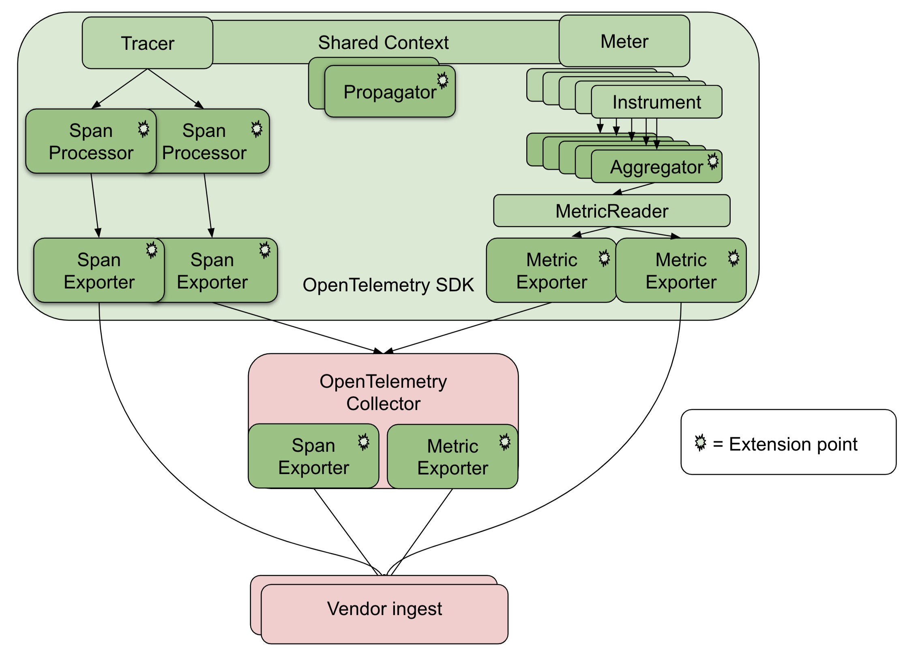

# OpenTelemetry .NET

## Вступление

Всем привет. 

При разработке микросервисов важную часть уделяют Observability - способность чувствовать свои сервисы как 3 руку. 
Одним из компонентов часто выделяют трейсинг запросов. 

За многие года создания микросервисных архитектур накопилось большое число систем, заточенных именно под это.
Время шло и в итоге после слияния OpenCensus и OpenTracing в 2019 году родился OpenTelemetry.

В этой статье опишу подключение OpenTelemetry в ASP.NET Core проект + некоторые варианты его использования. 

## Что такое OpenTelemetry

Трейсинг запросов является важной частью Observability систем. 
Микросервисов в частности.

В 2019 году появилась [OpenTelemetry](https://opentelemetry.io/) - спецификация распределенной трассировки.
Позже она обросла целой экосистемой и теперь состоит из наборов API, SDK и библиотек для различных языков программирования.

Многие продукты и системы уже [имеют поддержку](https://opentelemetry.io/ecosystem/vendors/) OpenTelemetry: AWS, Azure, Google Could, Grafana, Oracle



Архитектуру можно разбить на 3 слоя:
1. Хост
2. Коллектор
3. Вендор

### Хост

Хост - само приложение. 

Состоит из 3 частей:
- API - определенные в спецификации интерфейсы для сбора метрик и трейсинга
- SDK - реализация этого API
- Exporter - компонент занимающийся отправкой полученных данных

Здесь можно провести аналогию с архитектурой логирования в ASP.NET Core:
1. API - Microsoft.Extensions.Logging
2. SDK - Serilog, NLog, log4net
3. Exporter - Console, Serilog, ELK

### Коллектор 

Коллектор - сервис, занимающийся сбором, обработкой и отправкой замеров/трейсов вендору

Может работать как на той же машине, что и приложение (Агент), так и на другой (Коллектор)

### Вендор

Вендор - сервис, хранящий собранные данные

Например, Jaeger (поддерживает OLTP порт) или Zipkin (для него есть [правила трансформации](https://opentelemetry.io/docs/specs/otel/trace/sdk_exporters/zipkin/), которые выполняет коллектор)

## Сравнение OpenTelemetry и System.Diagnostics

Начиная с .NET 5 были добавлены типы из пространства `System.Diagnostics`, которые позволяют производить трейсинг работы приложения без необходимости подключения дополнительных библиотек. 
Речь о `Activity`, `ActivitySource`, `ActivityListener`. 
Они коррелируют с понятиями определенными в OpenTelemetry

| .NET            | OpenTelemetry | Комментарий                                                 |
| --------------- | ------------- | ----------------------------------------------------------- |
| Activity        | Span          | Операция, производимая приложением (бизнес-логика, запросы) |
| ActivitySource  | Tracer        | Создатель Activity/Span                                     |
| Tag             | Attribute     | Метаданные спана/операции                                   |
| ActivityKind    | SpanKind      | Взаимоотношения между зависимыми спанами                    |
| ActivityContext | SpanContext   | Контекст выполнения, который можно передать в другие спаны  |
| ActivityLink    | Link          | Ссылка на другой спан                                       |

Для приведения к единому знаменателю в OpenTelemetry добавили обертки вокруг System.Diagnostics, который работает с понятиями из OpenTelemetry. Эти типы объединены под одним понятием `Tracing shim`

| System.Diagnostics | Tracing shim  |
| ------------------ | ------------- |
| Activity           | TelemetrySpan |
| ActivitySource     | Tracer        |
| ActivityContext    | SpanContext   |

Но все же, создатели библиотеки рекомендуют пользоваться `System.Diagnostics` вместо `Tracing shim`. Дальше буду использовать `System.Diagnostics`

[Таблица сравнений](https://gist.github.com/lmolkova/6cd1f61f70dd45c0c61255сравнение039695cce8)

## Трейсинг в System.Diagnostics

Для трейсинга в .NET используется Activity API, предоставляемый `System.Diagnostics`.

Алгоритм работы с ним следующий:

1. Определяем источник событий: `ActivitySource`
```csharp
private static readonly AssemblyName CurrentAssembly = typeof(Tracing).Assembly.GetName();
private static string Version => CurrentAssembly.Version!.ToString();
private static string AssemblyName => CurrentAssembly.Name!;
public static readonly ActivitySource ConsumerActivitySource = new(AssemblyName, Version);
```

2. В интересуемой операции создаем начинаем отслеживание новой активности
```csharp
public const string KafkaMessageProcessing = "Обработка сообщения из кафки";

public Activity StartActivity()
{
    var activity = ConsumerActivitySource.StartActivity(KafkaMessageProcessing);
    // ...
    return activity;
}
```

3. Добавляем метаданные
```csharp
// https://github.com/open-telemetry/semantic-conventions/blob/main/semantic_conventions/trace/general.yaml
activity?.SetTag("thread.id", Environment.CurrentManagedThreadId);
activity?.SetTag("thread.name", Thread.CurrentThread.Name);
activity?.SetTag("enduser.id", Thread.CurrentPrincipal?.Identity?.Name);
SetLineNumber(activity);

void SetLineNumber(Activity? a, [CallerLineNumber] int lineNumber = 0)
{
    a?.SetTag("code.lineno", lineNumber);
}
```

4. Заканчиваем событие
```csharp
span.Stop();
// span.Dispose(); - вызывает span.Stop(), т.е. одно и то же
```

Как полученные `Activity` обрабатываются - лежит на `ActivityListener`, но это ~~уже другая история~~ делает подключенная библиотека.

Заметки:
- Метод `StartActivity` может вернуть `null`, если никто не подписан на событие. *При всех вызовах методов нужно делать проверку на `null`*
- `Activity` реализует `IDisposable`. *Можно не вызывать `Stop` вручную, а использовать `using`*
- `Activity` позволяет делать записи о пользовательских событиях: `activity.AddEvent(new ActivityEvent("Что-то случилось"))`. Дополнительно в библиотеке есть метод расширения для записи исключений: `activity.RecordException(ex)`
- Раз мы можем кидать/записывать исключения, то надо уметь отслеживать место, где исключение было брошено. Для этого можно выставить статус спана: `activity.SetStatus(ActivityStatusCode.Error, ex.Message)`. Под капотом, `activity.RecordException(ex)` работает через этот метод. (Кроме `Error` есть `Ok` и `Unset`, но не видел варианта их использования)
- У каждой активности есть `Baggage` - коллекция ассоциированных с операцией данных. Разница в том, что `Baggage` может использоваться логикой приложения и передается между контекстами (сериализуется), а `Tag` - это просто метаданные для расследования инцидентов. Доступ ведется через одноименное свойство: `activity.Baggage`
- Названия атрибутов взяты не из головы. Их наименование () регламентировано [спецификацией](https://github.com/open-telemetry/semantic-conventions/tree/main). Примеры некоторых атрибутов: 
  - [`db.system`](https://github.com/open-telemetry/semantic-conventions/blob/main/specification/trace/semantic_conventions/database.md) - название СУБД, с которой работает клиент (`mssql`, `postgresql`, `clickhouse`)
  - [`http.request.method`](https://github.com/open-telemetry/semantic-conventions/blob/main/specification/trace/semantic_conventions/http.md) - HTTP метод, использованный при запросе (`GET`, `POST`)
  - [`rpc.system`](https://github.com/open-telemetry/semantic-conventions/blob/main/specification/trace/semantic_conventions/rpc.md#common-attributes) - тип используемого RPC запроса (`grpc`, `dotnet_wcf`, `java_rmi`)

Вот пример полного пути выполнения:
```csharp
public async Task<IActionResult> ProcessRequest()
{
    using var activity = MyActivitySource.StartActivity(ActivityName);
    var userId = HttpContext.User.FindFirstValue(ClaimTypes.NameIdentifier);
    activity?.SetTag("enduser.id", userId);
    try
    {
        // Бизнес-логика
    }
    catch (Exception ex) when (activity is not null)
    {
        activity.RecordException(ex);
        activity.SetStatus(ActivityStatusCode.Error);
        throw;
    }
}

```

<spoiler title="ActivityKind - отношения между спанами">

`ActivityKind` представляет собой тип отношений между родительским и дочерним спанами. Его аналог в OpenTelemetry - [`SpanKind`](https://github.com/open-telemetry/opentelemetry-specification/blob/main/specification/trace/api.md#span)

```csharp
public enum ActivityKind
{
    /// <summary>
    /// Default value.
    /// Indicates that the Activity represents an internal operation within an application, as opposed to an operations with remote parents or children.
    /// </summary>
    Internal = 0,

    /// <summary>
    /// Server activity represents request incoming from external component.
    /// </summary>
    Server = 1,

    /// <summary>
    /// Client activity represents outgoing request to the external component.
    /// </summary>
    Client = 2,

    /// <summary>
    /// Producer activity represents output provided to external components.
    /// </summary>
    Producer = 3,

    /// <summary>
    /// Consumer activity represents output received from an external component.
    /// </summary>
    Consumer = 4,
}
```

Описания значений перечислений уже говорят что и когда использовать. Но для краткости к нему прилагается сравнительная таблица

| ActivityKind | Синхронное взаимодействие | Асинхронное взаимодействие | Входящий запрос | Исходящий запрос |
|--------------|---------------------------|----------------------------|-----------------|------------------|
| Internal     |                           |                            |                 |                  ||
| Client       | да                        |                            |                 | да               |
| Server       | да                        |                            | да              |                  |
| Producer     |                           | да                         |                 | возможно         |
| Consumer     |                           | да                         | возможно        |                  |

Тип спана указывается в атрибуте `span.kind`

Например, когда ASP.NET Core принимает запрос, то используется `ActivityKind.Server`


А когда `HttpClient` отправляет запрос, то `ActivityKind.Client`


</spoiler>

## Подключение OpenTelemetry

Теперь разберемся как подключать OpenTelemetry в проект. 

Все библиотеки OpenTelemetry имеют префикс OpenTelemetry (этот префикс зарезервирован).
Для подключения базовой функциональности в ASP.NET Core необходимо подключить:
```shell
dotnet add package OpenTelemetry
dotnet add package OpenTelemetry.Extensions.Hosting 
```

Первая команда подключает функциональность OpenTelemetry, а вторая - методы расширения для регистрации сервисов.

> Многие библиотеки OpenTelemetry находятся в `prerelease` статусе, поэтому в менеджере пакетов просто так не отобразятся

Следующий этап - включить функциональность OpenTelemetry в ASP.NET Core (регистрация в провайдере сервисов)

Это можно сделать методом расширения `AddOpenTelemetry()`

Но он только добавляет SDK в провайдер сервисов. Трейсинг подключается отдельно: `AddOpenTelemetry().WithTracing(...)`

Этот метод принимает лямбду для настройки трейсинга в приложении:
- Выставление метаинформации о приложении
- Подключение экспортеров трейсов
- Подписка на интересующие события

### Выставление информации о приложении

Для представления информации о чем-либо используется класс `Resource`. 
По факту это просто список пар ключ-значение. 
Информация о приложении выставляется через него. 
Точнее через `ResourceBuilder`, для которого в итоге вызывается `Build()` и получается результирующий `Resource`.

Для настройки можно использовать 2 варианта/метода:
- `SetResourceBuilder(ResourceBuilder builder)` - вручную выставляем нашего `ResourceBuilder` с выставленными значениями 
- `ConfigureResource(Action<ResourceBuilder> configure)` - лямбда с настройкой стандартного `ResourceBuilder`.

Информацию можно задать несколькими способами:
- `AddService` - вручную задать название, версию, ID экземпляра сервиса
- `AddAttributes` - выставить информацию приложения в виде перечисления пар ключ-значение
- `AddDetector` - получить информацию о приложении через переданный детектор (возможно получение детектора из переменных окружения)
- `AddEnvironmentVariableDetector` - задать информацию о приложении через стандартные переменные окружения: `OTEL_RESOURCE_ATTRIBUTES`, `OTEL_SERVICE_NAME`

<spoiler title="Что такое детектор">

При настройке информации о приложении по факту везде используется метод `AddDetector`. Остальное - методы расширения.

Детектор - это реализация интерфейса `IResourceDetector`

```cs
/// <summary>
/// An interface for Resource detectors.
/// </summary>
public interface IResourceDetector
{
    /// <summary>
    /// Called to get a resource with attributes from detector.
    /// </summary>
    /// <returns>An instance of <see cref="Resource"/>.</returns>
    Resource Detect();
}
```

Все добавленные детекторы в итоге возвращают `Resource` при вызове `Detect()` - информацию о приложении.

Например, есть метод расширения `.AddEnvironmentVariableDetector()`, 
который добавляет детекторы для выставления настроек сервиса из стандартных переменных окружения.

Такие детекторы можно создать самим. 
В `TemperatureApi` есть `RandomSeedDetector` - детектор, который в информацию о сервисе выставляет сид для `Random`.

```cs
public class RandomSeedDetector: IResourceDetector
{
    private readonly IOptions<RandomOptions> _options;

    public RandomSeedDetector(IOptions<RandomOptions> options)
    {
        _options = options;
    }
    
    public Resource Detect()
    {
        return new Resource(new KeyValuePair<string, object>[]
        {
            new("random.seed", _options.Value.RandomSeed)
        });
    }
}
```

Как можно увидеть, на вход он принимает `IOptions`. 
Его можно получить из `IServiceProvider` - есть перегрузка принимающая его для создания нового детектора.
Именно она и используется в проекте.
```cs
tracing.ConfigureResource(rb =>
{
    rb.AddDetector(sp =>
        new RandomSeedDetector(sp.GetRequiredService<IOptions<RandomOptions>>()));
});
```

</spoiler>

Пример конфигурирования `TemperatureApi`:
```cs
tracing.ConfigureResource(rb =>
{
   var name = typeof(TemperatureController).Assembly.GetName();
   rb.AddService(
       serviceName: name.Name!,
       serviceVersion: name.Version!.ToString(),
       autoGenerateServiceInstanceId: true);
   rb.AddDetector(sp =>
       new RandomSeedDetector(sp.GetRequiredService<IOptions<RandomOptions>>()));
})
```

### Инструментаторы

Инструментатор - это функциональность/библиотека, которая позволяет делать трейсинг других библиотек без необходимости настраивать это самому.

Примером может служить `HttpClient`.
Для его инструментирования есть библиотека `OpenTelemetry.Instrumentation.Http`. 
Она за вас проставит необходимые метаданные для проброса контекста при отправке запросов через `HttpClient`.

Подключение - метод расширения
```csharp
tracing.AddHttpClientInstrumentation();
```

Примеры других инструментаторов:
- `OpenTelemetry.Instrumentation.GrpcNetClient`
- `OpenTelemetry.Instrumentation.AspNetCore`
- `OpenTelemetry.Instrumentation.EntityFrameworkCore`
- `OpenTelemetry.Instrumentation.Runtime`
- `OpenTelemetry.Instrumentation.StackExchangeRedis`

### Источники событий

Источник событий - это созданный нами `ActivitySource`.

Просто так OpenTelemetry не станет их слушать.
Для регистрации есть метод `AddSource(params string[] names)`. 
На вход он принимает названия `ActivitySource`. 

Моя практика работы следующая:
- Создаю статический класс с `ActivitySource` (класс обычно называю `Tracing`) 
- Когда начинается новая активность - обращаюсь к необходимому источнику и константе активности: `using var activity = Tracing.ApplicationActivity.StartActivity(SampleOperation);`

Поэтому регистрация источников событий в `AddSource` выглядит как перечисление всех названий `ActivitySource` из всех подобных "классов-реестров":

```csharp
tracing.AddSource(
    FirstModule.Tracing.ApplicationActivity.Name, 
    SecondModule.Tracing.AnotherActivity.Name);
```

### Экспортеры

Спаны собираются - хорошо, но нужно их куда-то отправить. 
За это отвечают экспортеры.

Хоть это и OpenTelemetry библиотека, но экспортировать можно не только в OTEL формате.
Также есть поддержка (не только):
- Jaeger - [OpenTelemetry.Exporter.Jaeger](https://www.nuget.org/packages/OpenTelemetry.Exporter.Jaeger)
- Zipkin - [OpenTelemetry.Exporter.Zipkin](https://www.nuget.org/packages/OpenTelemetry.Exporter.Zipkin)
- Stackdriver - [OpenTelemetry.Exporter.Stackdriver](https://www.nuget.org/packages/OpenTelemetry.Exporter.Stackdriver)

Подключение OpenTelemetry экспортера:

1. Добавляем пакет с экспортером

```shell
dotnet add package OpenTelemetry.Exporter.OpenTelemetryProtocol
```

2. Регистрируем экспортер вызовом метода

```csharp
tracing.AddOltpExporter();
```

3. Настраиваем экспортера

```csharp
tracing.AddOltpExporter(oltp => 
{
    oltp.Endpoint = new Uri("http://oltp:4317");
});
```

Собираем воедино:
```csharp
builder.Services
       .AddOpenTelemetry()
       .WithTracing(tracing =>
        {
            tracing.AddAspNetCoreInstrumentation()
                   .AddOtlpExporter(oltp =>
                    {
                        oltp.Endpoint = new Uri("http://oltp:4317");
                    })
                   .ConfigureResource(rb =>
                    {
                        var name = typeof(TemperatureController).Assembly.GetName();
                        rb.AddService(
                            serviceName: name.Name!,
                            serviceVersion: name.Version!.ToString(),
                            autoGenerateServiceInstanceId: true);
                        rb.AddDetector(sp =>
                            new RandomSeedDetector(sp.GetRequiredService<IOptions<RandomOptions>>()));
                    });
        });
```

## Рецепты

Для примера я сделал небольшой стенд из 3 сервисов с единственной операцией (запросом):
- `OpenTelemetry.SystemApi.Web` - принимает запрос от пользователя, делает HTTP запрос к `TemperatureApi` и отправляет полученный объект в очередь кафки. Дальше называется `SystemApi`
- `OpenTelemetry.TemperatureApi.Web` - простой HTTP API с единственной ручкой `temperature/current`, который возвращает случайное число (температуру). Дальше называется `TemperatureApi`
- `OpenTelemetry.RecordSaver.Worker` - демон, который читает из кафки сообщения, отправляемые `SystemApi`, и сохраняет их в Postgres с помощью EF Core. Дальше называется `RecordSaver`

В качестве вендора использовал Jaeger. 
Он поддерживает работу с OLTP на 4317 порту (нужно выставить переменную окружения `COLLECTOR_OLTP_ENABLED=true`)

### Синхронный запрос от одного сервиса к другому

Синхронный запрос в цепочке - от `SystemApi` к `TemperatureApi`. 
Он выполняется с помощью `HttpClient`. 
Для отслеживания запросов в `SystemApi` добавлен инструментатор `HttpClient`, а в `TemperatureApi` - `ASP.NET Core` инструментатор.

Внутри контроллера `SystemApi` вызывается `ITemperatureService.GetTemeratureAsync()`, который делает HTTP запрос в `Temperature.Api`.

Эта часть отображена в трейсе:


Первая часть принадлежит инструментатору `HttpClient` на `SystemApi`, а вторая - инструментатору `AspNetCore` на `TemperatureApi`

### Проброс контекста между различными сервисами

Что делать, если для какого-то варианта взаимодействия нет своего инструментатора? 
Как в этом случае передавать контекст?

Для проброса контекста предназначен `Propagators API`.
Он предоставляет мини-фреймворк для передачи контекста.
Транспортный слой выбирает сам пользователь - можно передавать где захочешь.

Передающая сторона:

1. Получает экземпляр `Propagator`. 

> На данный момент есть только `TextMapPropagator`, который использует строковое отображение, но планируется добавление байтового варианта 

2. Вызывает метод `Inject<T>(PropagationContext context, T carrier, Action<T,string,string> setter)`

>`T carrier` - это тип используемого хранилища, а `Action<T,string,string> setter` - функция для добавления данных в хранилище.
   
3. Делает запрос

Получающая сторона:

1. Получает экземпляр `Propagator`
2. Получает хранилище, использовавшееся в запросе
3. Вызывает `Extract<T>(PropagationContext context, T carrier, Func<T,string,IEnumerable<string>> getter)`

> `getter` используется уже для получения данных из хранилища

4. Использует полученные данные при создании новой `Activity`:
   - Установка `Baggage`
   - Выставление родительского контекста
   - Добавление ссылок

Хватит теории, давайте практику.

К сожалению (или счастью), для кафки я не нашел инструментатора. 
Поэтому написал свои декораторы, которые пробрасывают контекст.

Продьюсер:
```csharp
public class TracingProducerDecorator<TKey, TValue>: IProducer<TKey, TValue>
{
    private readonly IProducer<TKey, TValue> _producer;

    public TracingProducerDecorator(IProducer<TKey, TValue> producer)
    {
        _producer = producer;
    }

    private const string ProducingActivity = "Kafka.Producer.Produce";

    private Activity? StartActiveSpan(Message<TKey, TValue> message)
    {
        var activity = Tracing.WebActivitySource.StartActivity(ProducingActivity, ActivityKind.Producer);
        if (activity is not null)
        {
            var propagationContext = new PropagationContext(activity.Context, Baggage.Current);
            Propagators.DefaultTextMapPropagator.Inject(propagationContext, message.Headers ??= new Headers(),
                (headers, key, value) => headers.Add(key, Encoding.UTF8.GetBytes(value)));
        }
        return activity;
    }

    public async Task<DeliveryResult<TKey, TValue>> ProduceAsync(string topic, Message<TKey, TValue> message, CancellationToken cancellationToken = new CancellationToken())
    {
        using var activity = StartActiveSpan(message);
        try
        {
            var result = await _producer.ProduceAsync(topic, message, cancellationToken);
            activity?.SetTag("kafka.topic", result.Topic);
            activity?.SetTag("kafka.partition", result.Partition.Value);
            activity?.SetTag("kafka.offset", result.Offset.Value);
            return result;
        }
        catch (Exception e)
        {
            activity.RecordException(e);
            activity.SetStatus(Status.Error);
            throw;
        }
    }

    public void Produce(string topic, Message<TKey, TValue> message, Action<DeliveryReport<TKey, TValue>> deliveryHandler = null!)
    {
        var span = StartActiveSpan(message);
        try
        {
            _producer.Produce(topic, message, (r) =>
            {
                try
                {
                    if (r.Error.IsError)
                    {
                        span?.SetStatus(ActivityStatusCode.Error, $"Ошибка кафки: {r.Error.Reason}");
                    }
                    else
                    {
                        span?.SetTag("kafka.topic", r.Topic);
                        span?.SetTag("kafka.partition", r.Partition.Value);
                        span?.SetTag("kafka.offset", r.Offset.Value);
                    }
                    span?.Dispose();
                }
                catch (ObjectDisposedException)
                { }
                deliveryHandler(r);
            });
        }
        catch (Exception e)
        {
            span?.RecordException(e);
            span?.SetStatus(Status.Error);
            span?.Dispose();
            throw;
        }
    }
}
```

Консьюмер:
```csharp
private static IEnumerable<string> GetValuesFromHeadersSafe(Headers headers, string key)
    => headers.Where(x => x.Key == key)
                .Select(b =>
                {
                    try
                    {
                        return Encoding.UTF8.GetString(b.GetValueBytes());
                    }
                    catch (Exception)
                    {
                        return null;
                    }
                })
                .Where(x => x is not null)!;


private Activity? StartActivity(ConsumeResult<Null, string> result)
{
    var propagationContext = Propagators.DefaultTextMapPropagator.Extract(default, result.Message.Headers,
        GetValuesFromHeadersSafe);

    var span = Tracing.ConsumerActivitySource.StartActivity(
        Tracing.KafkaMessageProcessing, 
        kind: ActivityKind.Consumer,
        parentContext: propagationContext.ActivityContext);

    Baggage.Current = propagationContext.Baggage;
    
    return span;
}
```

Если мы попробуем положить в `Baggage` какие-нибудь данные, то получим на обратной стороне.
Для приложений из стенда можно указать специальные переменные окружения:
- `TRACING_SEND_RANDOM_BAGGAGE=true` для `SystemApi`, чтобы генерировал и посылал случайные данные
- `TRACING_LOG_BAGGAGE=true` для `RecordSaver`, чтобы логировал получаемый `Baggage`

Логи `SystemApi`:


Логи `RecordSaver`:


> Функции `getter` и `setter` у `Propagator` не должны выкидывать исключения

### Добавление тегов в текущую `Activity`

Если в текущую `Activity` необходимо добавить информацию. 
Например, атрибуты или событие, то возникает вопрос как к ее получить.

Ответ прост - статическое свойство `Activity.Current`. Оно вернет текущий `Activity`, если он есть, иначе `null`.

> Для хранения `Activity`, используется статическое поле типа `AsyncLocal<Activity>`. Поэтому обращение к свойству из различных асинхронных функций вернет текущий `Activity`
> ```csharp
> private static readonly AsyncLocal<Activity?> s_current = new AsyncLocal<Activity?>();
> public static Activity? Current
> {
>     get { return s_current.Value; }
>     set
>     {
>         if (ValidateSetCurrent(value))
>         {
>             SetCurrent(value);
>         }
>     }
> }
> ```

Например, мы хотим сделать декоратор для какого-то сервиса, который будет добавлять событие при возникновении исключения

```csharp
public class JsonExceptionEventRecorderServiceDecorator: ITemperatureService
{
    private readonly ITemperatureService _service;

    public async Task<double> GetTemperatureAsync(CancellationToken token)
    {
        try
        {
            return await _service.GetTemperatureAsync(token);
        }
        catch (JsonException e) when (Activity.Current is {} activity)
        {
            var @event = new ActivityEvent("Ошибка парсинга JSON",
                tags: new ActivityTagsCollection(new KeyValuePair<string, object?>[]
                {
                    new("json.error.path", e.Path)
                }));
            activity.AddEvent(@event);
            throw;
        }
    }
}
```

### Дробление большого запроса на несколько меньших

Батч операции могут оптимизировать работу системы, но иногда вся информация не может вместиться в единственный запрос, поэтому надо дробить на несколько меньше. 

В примере я использую того же самого `IProducer<TKey, TValue>` с декоратором, описанным ранее.

Добавил новую ручку `System/state/batch`, которая делает буквально то же самое, но отправляет несколько запросов параллельно через `Task.WhenAll()`

```csharp
var measurements = Enumerable.Range(0, amount)
                             .Select(_ => new WeatherForecast()
                             {
                                 Id = Guid.NewGuid(),
                                 Date = DateTime.Now,
                                 Summary = Faker.Random.Words(5),
                                 TemperatureC = temp
                             })
                             .ToArray();

await Task.WhenAll(measurements.Select(m => _producer.ProduceAsync("weather", new Message<Null, string>()
{
    Value = JsonSerializer.Serialize(m)
},
token)));
```

Зависимости между спанами корректно обрабатываются


> Если внутри `.Select()` использовать отображение на другие асинхронные функции с собственной логикой (`.Select(async m => {await ...; await ...;})`) то все будет работать так же корректно

### Сторонние сервисы

Представим, что мы работаем с кафкой.
Как известно, из одного топика могут читать несколько групп потребителей. 
Пусть одна занимается непосредственной бизнес-логикой, а другие выполняют вспомогательную работу: синхронизация баз данных, аудит событий, составление отчетов, взаимодействия с другими сервисами экосистемы.

Как нам знать, что прочитанное сообщение относится к другому трейсу/спану? 
Самый простой вариант - пометить полученный контекст как родительский. 
Но в этом случае трейс замусорится лишними операциями.

Для таких ситуаций в OpenTelemetry определен [`Link`](https://opentelemetry.io/docs/concepts/signals/traces/#span-links). 
По факту, это просто метаинформация, сообщающая о корреляции/связи с другим спаном.

В .NET представляется типом `ActivityLink`. 
Эти ссылки должны быть добавлены во время создания `Activity`.

Сервис `RecordSaver` принимает на вход переменную окружения `TRACING_USE_LINK=true`. 
Если она выставлена, то во время создания `Activity` будет использоваться не родительский контекст, а ссылка

```csharp
ActivityLink[]? links = null;
ActivityContext parentContext = default;

if (useLink)
{
    links = new ActivityLink[]
    {
        new(propagationContext.ActivityContext)
    };
}
else
{
    parentContext = propagationContext.ActivityContext;
}

var span = Tracing.ConsumerActivitySource.StartActivity(
    Tracing.KafkaMessageProcessing, 
    kind: ActivityKind.Consumer,
    parentContext: parentContext,
    links: links);
```

Если сделать запрос из `SystemApi`, то получим следующие результаты:

1. Создались 2 разных трейса: `SystemApi` + `TemperatureApi` и `RecordSaver`


2. В родительский спан `RecordSaver` добавлена ссылка на спан продьюсера


Теперь `RecordSaver` "независим" - генерируется свой собственный `Trace Id`. 
Отследить такие запросы, как можно догадаться, сложнее.

### Обработка ошибок

В процессе работы могут возникнуть исключения. Отменить их невозможно, но можно записать факт их возникновения. То как это необходимо выполнять есть в [спецификации](https://github.com/open-telemetry/opentelemetry-specification/blob/v1.21.0/specification/trace/exceptions.md)

Записать исключения можно 2 способами:
- Вручную сделать запись события об ошибке (сервис `SystemApi`)
```csharp
var tags = new ActivityTagsCollection(new KeyValuePair<string, object?>[]
{
    new("exception.type", exception.GetType().Name), 
    new("exception.message", exception.Message),
    new("exception.stacktrace", exception.StackTrace)
});
activity.AddEvent(new ActivityEvent("exception", tags: tags));
```
- Воспользоваться методом расширения из OpenTelemetry (сервис `TemperatureApi`)
```csharp
activity.RecordException(e);
```

Первый вариант идентичен работе метода расширения. 
Буквально делает то же самое.

Названия атрибутов для события исключения определены в [спецификации](https://github.com/open-telemetry/semantic-conventions/blob/main/semantic_conventions/trace/trace-exception.yaml).

В проекте `TemperatureApi` добавил переменную окружения `THROW_EXCEPTION=true`. Если она выставлена, то эндпоинт генерирует исключение.

В результате получается такой трейс:


> P.S. в трейсе `TemperatureApi` нет `exception.stacktrace`, так как объект исключения сначала создался, и только после добавления события вызван `throw`

---

Думаю, эти варианты использования могут покрыть большую часть возникающих задач.

Кроме трейсинга, OpenTelemetry предоставляет аналогичную функциональность и для сбора метрик. 
Причем, также используется `System.Diagnostics` с нативными .NET'овскими типами.
Но это уже за рамками этой статьи.

Полезные ссылки: 
 - Спецификация OpenTelemetry - [ссылка](https://github.com/open-telemetry/opentelemetry-specification/blob/main/specification/trace/api.md#span)
 - Стенд из примера - [ссылка]()
 - Репозиторий OpenTelemetry для .NET - [ссылка](https://github.com/open-telemetry/opentelemetry-dotnet)
