# Группировка в PostgreSQL (на апрель 2026 года)

Приветствую.

Из названия статьи вы поняли, что речь пойдет о группировке в PostgreSQL. Админы и разработчики, скорее всего, сейчас подумают о том, что я буду рассказывать про всякие функции перехода агрегатов, разные стратегии группировки и т.д. Да, буду. Только рассказ пойдет не об использовании, а о реализации.

Если вы забьете в поисковике что-то вроде "реализация группировки в postgresql", то максимум, что вам может выдаться, - `CREATE AGGREGATE` с функциями перехода и/или немного "продвинутого" `GROUP BY GROUPING SETS`. Но ничего о том, как группировка реализована, нет.

Мне пришлось возиться с кодом группировки (зачем - в конце). И, когда декомпозировал задачу, самой сложной частью я выделил логику сброса на диск. Но, как потом оказалось, самое сложное - понять как устроен сам модуль группировки и агрегации, потому что информации об этом я нашел крайне мало.

Эта статья основана на моем докладе на PG BootCamp ([YouTube](https://www.youtube.com/watch?v=bt1FjjEw6Ps)/[RuTube](https://rutube.ru/video/8ed09434c98becdeced43b47074b28f4/)). Но из-за ограничений по времени мне пришлось многое выкинуть, поэтому эту статью можно назвать "расширенной" версией: в докладе я оставил только само ядро и выкинул все, что показалось неважным.

Содержание:

1. [Агрегатные функции](#агрегатные-функции)
2. [Плоская группировка](#плоская-группировка)
3. [Группировка по атрибутам](#группировка-по-атрибутам)
   1. [Сортировка](#сортировка)
   2. [хеширование](#хеширование)
   3. [хеширование, сброс на диск](#хеширование-сброс-на-диск)
4. [GROUPING SETS](#сложные-аналитические-функции-grouping-set-cube-rollup)
   1. [хеширование](#хешированиеgs)
   2. [Сортировка](#сортировкаgs)
   3. [Смешанная стратегия](#mixedaggregate)
5. [Оставшееся за кадром](#оставшееся-за-кадром)
   1. [Частичная агрегация](#частичная-агрегация)
   2. [ORDERED SET AGGREGATE](#ordered-setdistinct-агрегаты)
6. [Index Aggregate](#index-aggregate)
7. [Заключение](#заключение)

## Агрегатные функции

Вначале вспомним, что такое агрегатная функция. Это функция, вычисляющая результат на множестве данных.

Есть 2 ярких примера: `max` - наибольшее значение из всего множества и `avg` - среднее арифметическое.

```sql
-- Самый большой возрасти среди всех пользователей
SELECT max(age) FROM users;

-- Среднее количество денежных переводов каждого пользователя
SELECT userid, avg(transferred) FROM user_transactions GROUP BY userid;
```

Чтобы эффективно рассчитывать `max`, мы храним только только 1 число, самое большое значение, и при чтении очередного значения сохраняем большее. А вот для эффективного расчета `avg` придется хранить 2 числа: сумму и количество. При получении очередного значения инкрементируем количество и увеличиваем сумму на это число и перед возвращением результата делим сумму на количество.

На этом моменте становится ясно, что у разных агрегатов разное поведение и требования. Чтобы поддерживать такой зоопарк, был разработан протокол работы с агрегатами.

> Вообще, никакого "протокола" не существует - это мое именование, потому что надо как-то уметь описать всю эту систему.

Визуализировать его можно так:

```python
# Инициализация состояния
state = init()

# Применение функции перехода
for tuple in input:
   state = transit(state, tuple)

# Подсчет результата
result = finalize(state)
```

При создании агрегата с помощью `CREATE AGGREGATE` эти основные поля мы и можем заметить:

```sql
CREATE AGGREGATE some_agg(a int, b int) (
   -- Начальное состояние
   initcond  = '(0,0)'
   -- Функция перехода
   sfunc     = average_transition,
   -- Финализатор
   finalfunc = average_final,

   -- ...
)
```

Все агрегирующие функции хранятся в таблице `pg_aggregate`. Есть уже много встроенных агрегатов, но мы посмотрим на внутренности агрегатов из примера выше:

```sql
select aggfnoid, agginitval, aggtransfn, aggfinalfn from pg_aggregate;

         aggfnoid       |    agginitval   |    aggtransfn    |      aggfinalfn              
------------------------+-----------------+------------------+-----------------------
 pg_catalog.stddev      | {0,0,0}         | float4_accum     | float8_stddev_samp
 pg_catalog.avg         | {0,0,0}         | float4_accum     | float8_avg
 pg_catalog.avg         | {0,0}           | int4_avg_accum   | int8_avg
 pg_catalog.max         |                 | int4larger       | -
 pg_catalog.max         |                 | float4larger     | -
 
 ...
```

Основные моменты мы можем увидеть (перегрузка для `int4`):

- `avg` - начальное состояние - массив из 2 нулей (сумма и количество), функция перехода `int4_avg_accum` - увеличивает сумму и количество, а `int8_avg` финализатор - делит их.
   > Да, состояние для `avg` - это массив из 2 чисел, а не специальная структура с 2-мя полями. Многие типы хранятся подобным образом, т.к. тип массива уже существует, а если на каждый чих создавать отдельный тип, то база данных разбухнет.
- `max` - есть только функция перехода `int4larger`, начального состояния нет (`NULL`) и финализатора тоже.

Если начальное состояние `NULL` - это значит, что первое не `NULL` значение этим состоянием и становится. А если финализатора нет, то само состояние и есть финальное значение. В случае с `max` это все нам подходит: первое число становится состоянием, и функцию перехода вызывать не надо, а так как само число и есть финальное значение, то и финализатор применять не надо.

Например, для `avg` этот протокол мы могли мы описать так:

```python
state = {0, 0}

for number in input:
   state.count++
   state.sum += number

result = state.sum / state.count
```

А для `max` так:

```python
state = NULL

for number in input:
   if state == NULL or state < number:
      state = number

result = state
```

Но агрегирующие функции применяются не просто так, а при группировке. Самая простая группировка - плоская.

## Плоская группировка

```sql
SELECT avg(a) FROM tbl;

       QUERY PLAN
-----------------------
 Aggregate
   ->  Seq Scan on tbl
(2 rows)
```

Грубо говоря, плоская группировка - это агрегация по всем входным данным.

> Специально не говорю "плоская группировка - это группировка без атрибутов", т.к. тавтология получается

<spoiler title="()">

Можно сказать, что плоская группировка используется, когда нет `GROUP BY`, но это частично правда, т.к. есть специальная группа `()`, которая и обозначает плоскую группировку. Например, запрос выше можно написать так:

```sql
SELECT avg(a) FROM tbl GROUP BY ();
```

И план будет тем же самым.

В самой спецификации SQL (ISO/IEC 9075, Part 2, 7.13) к нему ссылаются как `<empty grouping set>`.

</spoiler>

Об этой стратегии ничего особенного сказать нельзя, поэтому сразу перейдем к коду.

> Реализация логики группировки хранится в [`src/backend/executor/nodeAgg.c`](https://github.com/postgres/postgres/blob/REL_18_STABLE/src/backend/executor/nodeAgg.c) и, если не оговорено иное, весь дальнейший код будет хранится там. Также, для краткости, весь этот файл я буду называть модулем.

PostgreSQL работает по итераторной модели - за каждый узел плана отвечает свой обработчик. Он читает кортежи из подузла, а затем возвращает по одному кортежу вызывающему (другому узлу).

<spoiler title="ExecAgg">

```c++
/* https://github.com/postgres/postgres/blob/REL_18_3/src/backend/executor/nodeAgg.c#L2244 */
static TupleTableSlot *
ExecAgg(PlanState *pstate)
{
    AggState   *node = castNode(AggState, pstate);
    TupleTableSlot *result = NULL;

    if (!node->agg_done)
    {
        /* Dispatch based on strategy */
        switch (node->aggstrategy)
        {
            case AGG_HASHED:
                /* ... */
            case AGG_MIXED:
                /* ... */
            case AGG_PLAIN:
                /* ... */
            case AGG_SORTED:
               return agg_retrieve_direct(node);
        }
    }

    return NULL;
}
```

</spoiler>

Обработчиком узла группировки является функция `ExecAgg`, внутри которой простой `switch`, определяющий нужную стратегию. То, что для группировки мы можем использовать несколько стратегий, секретом быть не должно. Сейчас мы рассматриваем плоскую группировку и за нее отвечает `AGG_PLAIN`, сам обработчик - `agg_retrieve_direct`.

<spoiler title="agg_retrieve_direct">

```c++
/* https://github.com/postgres/postgres/blob/REL_18_3/src/backend/executor/nodeAgg.c#L2280 */
static TupleTableSlot *
agg_retrieve_direct(AggState *aggstate)
{
   Agg           *node = aggstate->phase->aggnode;
   AggStatePerAgg peragg;
   AggStatePerGroup *pergroups;

   /* Вначале читаем первый кортеж */
   outerslot = fetch_input_tuple(aggstate);

   /* Инициализация состояния */
   initialize_aggregates(aggstate, pergroups, numReset);


   /* Для каждого кортежа из входа вызываем функцию перехода */
   for (;;)
   {
      advance_aggregates(aggstate);

      outerslot = fetch_input_tuple(aggstate);
      if (TupIsNull(outerslot))
      {
         aggstate->agg_done = true;
         break;
      }
   }

   /* Вызов финализатора */
   finalize_aggregates(aggstate, peragg, pergroups[currentSet]);
   
   return project_aggregates(aggstate);
}
```

</spoiler>

Здесь мы видим практически 1-к-1 отображение на протокол агрегатов (его псевдокод) выше. Единственная разница в том, что мы вначале читаем кортеж и только после этого инициализируем состояние. Это нужно, чтобы убедиться, что вход не пустой. Для чего нужно - увидим потом.

Для чтения кортежей из подузла в этом модуле используется функция `fetch_input_tuple`. Пока нам не интересно, что внутри, и читаем все кортежи из под-узла, например, `SeqScan`.

Первым делом, нужно инициализировать состояние агрегата. Для этого используется функция `initialize_aggregates`. Но перед этим нам нужно познакомиться с основными используемыми структурами.

```c++
/* https://github.com/postgres/postgres/blob/REL_18_3/src/include/executor/nodeAgg.h#L250 */
struct AggStatePerGroupData
{
    Datum  transValue;        /* current transition value */
    bool   transValueIsNull;
    bool   noTransValue;      /* true if transValue not set yet */
};
```

Структура `AggStatePerGroup` хранит само состояние агрегата. Она создается для каждого набора конкретных значений атрибутов группировки.

Но можете заметить, что здесь не 2 поля: значение и `NULL`, но есть и 3-ий - флаг `noTransValue`. Дело в нюансе работы с `NULL`'ами, о котором я упомянул ранее, - если изначальное состояние агрегата `NULL`, то первое не `NULL` значение становится состоянием, но если мы используем только 1 флаг - как мы различим `NULL`, когда состояние изначальное, от `NULL`, который вернула функция перехода. Для решения мы задействуем дополнительный флаг.

Но это только состояние, а сама логика хранится в двух других структурах - `AggStatePerTrans` и `AggStatePerAgg`.

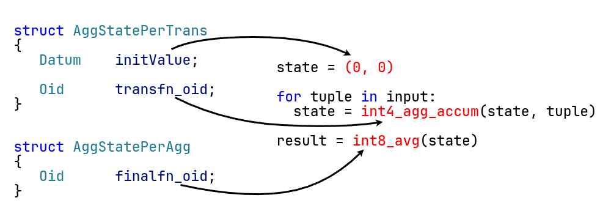

> Структуры довольно большие, поэтому их полное определение я не стал приводить, только нужные нам сейчас поля. Если кому интересно, то ссылка на [PerTrans](https://github.com/postgres/postgres/blob/972c14fb9134fdfd76ea6ebcf98a55a945bbc988/src/include/executor/nodeAgg.h#L30) и на [PerAgg](https://github.com/postgres/postgres/blob/972c14fb9134fdfd76ea6ebcf98a55a945bbc988/src/include/executor/nodeAgg.h#L187).

`AggStatePerTrans` хранит изначальное состояние и логику для вызова функции перехода, но вот финализация выделена в отдельную структуру - `AggStatePerAgg`. И сделано это не просто так, а в угоду оптимизации.

```sql
SELECT agginitval, aggtransfn, count(*) cnt FROM pg_aggregate GROUP BY 1, 2 HAVING count(*) > 1 ORDER BY 3 DESC;

  agginitval   |          aggtransfn          | cnt 
---------------+------------------------------+-----
 {0,0,0,0,0,0} | float8_regr_accum            |  11
 {0,0,0}       | float4_accum                 |   7
               | ordered_set_transition       |   7
 {0,0,0}       | float8_accum                 |   7
               | int4_accum                   |   6
               | numeric_accum                |   6
               | int2_accum                   |   6
               | int8_accum                   |   6
               | ordered_set_transition_multi |   4
               | interval_avg_accum           |   2
               | numeric_avg_accum            |   2
               | int8_avg_accum               |   2
               | booland_statefunc            |   2
(13 rows)
```

Из этого запроса мы можем понять, что существует множество функций агрегации с одинаковыми начальным значением и функцией перехода. Это значит, что запустив запрос с такими агрегатами, то в конце, мы получим копии одного и того же состояния. Нам незачем тратить и место, и время для них, поэтому подобные агрегаты мы находим и храним только по 1 состоянию, а в конце вызываем разные финализаторы над одним и тем же состоянием.

```sql
SELECT avg(a::float), stddev(a::float) FROM tbl;
```

И в качестве примера можно привести 2 функции: `avg` и `stddev`. Если запустим такой запрос, то окажется, что агрегатных функций 2 (`numaggs`), но состояние хранится только 1 (`numtrans`).


```c++
/* https://github.com/postgres/postgres/blob/REL_18_3/src/backend/executor/nodeAgg.c#L629 */
static void
initialize_aggregate(AggState *aggstate, AggStatePerTrans pertrans,
                     AggStatePerGroup pergroupstate)
{
    if (pertrans->initValueIsNull)
        pergroupstate->transValue = pertrans->initValue;
    else
        pergroupstate->transValue = datumCopy(pertrans->initValue,
                                              pertrans->transtypeByVal,
                                              pertrans->transtypeLen);

    pergroupstate->transValueIsNull = pertrans->initValueIsNull;
    pergroupstate->noTransValue = pertrans->initValueIsNull;
}
```

Теперь логика инициализации ясна: из `AggStatePerTrans` копируем состояние в `AggStatePerGroup` - само значение и 2 флага.

После инициализации нам нужно читать кортежи и применять функцию перехода, но так как первый кортеж мы уже прочитали, то сразу применяем функцию перехода. Это делается в `advance_aggregates`, но если опустимся внутрь, то вызова функций напрямую не увидим.

Дело в том, что многие выражения в PostgreSQL выполняются не как отдельные функции, а преобразовываются в последовательность команд для выполнения. В postgres это называется компиляцией выражений. У этого подхода много преимуществ, например, благодаря ему очень просто добавляется поддержка jit'а. Еще одно преимущество мы увидим далее.

А сейчас нам нужно выполнить 2 команды: загрузка кортежа в память и вызов самой функции перехода. Если спустимся еще раз внутрь, то увидим и саму функцию перехода.

```c++
/* https://github.com/postgres/postgres/blob/REL_18_3/src/backend/executor/execExprInterp.c#L643 */
static Datum ExecInterpExpr(ExprState *state, ExprContext *econtext, bool *isnull)
{
    EEO_SWITCH()
    {
       EEO_CASE(EEOP_OUTER_FETCHSOME)
       {
           slot_getsomeattrs(outerslot, op->d.fetch.last_var);
           EEO_NEXT();
       }
       EEO_CASE(EEOP_AGG_PLAIN_TRANS_BYVAL)
       {
           AggState   *aggstate = castNode(AggState, state->parent);
           AggStatePerTrans pertrans = op->d.agg_trans.pertrans;
           AggStatePerGroup pergroup = &aggstate->all_pergroups[op->d.agg_trans.transno];
           ExecAggPlainTransByVal(aggstate, pertrans, pergroup,
                                  op->d.agg_trans.aggcontext);
           EEO_NEXT();
       }
    }
}
```

Для `avg` функция перехода - `int4_avg_accum`, в которой мы сейчас и находимся. Так как мы только инициализировали состояние, то оно все по нулям (слева во вкладке) - `count` и `sum`. На вход нам подали число `1` (поле `newval`), поэтому состояние изменилось соответствующе - `count` и `sum` равны 1.


Это была одна итерация - чтение кортежа и вызов функции перехода. Мы так повторяем до тех пор, пока не обработаем все кортежи. Конец входа обозначается тем, что узел возвращает `NULL`, поэтому читаем пока не получим `NULL`.

В конце финализируем агрегаты. Здесь будет уже проще, так как скомпилированных выражений нет и мы вызываем сам финализатор напрямую.

```c++
/* https://github.com/postgres/postgres/blob/REL_18_3/src/backend/executor/nodeAgg.c#L1082 */
static void finalize_aggregate(AggState *aggstate, AggStatePerAgg peragg,
                               AggStatePerGroup pergroupstate,
                               Datum *resultVal, bool *resultIsNull)
{
    Datum result;
    InitFunctionCallInfoData(*fcinfo, &peragg->finalfn,
                             numFinalArgs,
                             pertrans->aggCollation,
                             (Node *) aggstate, NULL);
    *resultVal = FunctionCallInvoke(fcinfo);
    *resultIsNull = fcinfo->isnull;
}
```

Для того же `avg` финализатор `int8_avg`. Все что нам осталось сделать - поделить сумму на количество, но чтобы сохранить точность, мы оба числа (`int`) приводим к типу `numeric` и выполняем уже деление самих `numeric`'ов.

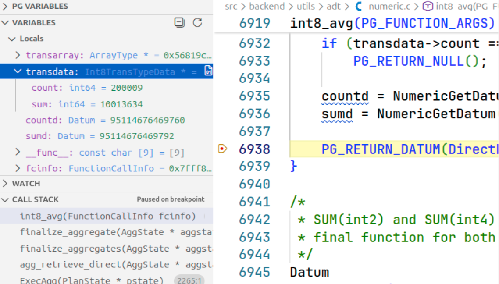

> Работа с этим типом довольно сложная, и описывать ее детали я здесь не буду, но если кому интересно, то можно посмотреть реализацию в [numeric_div_opt_error](https://github.com/postgres/postgres/blob/REL_18_3/src/backend/utils/adt/numeric.c#L3263).

## Группировка по атрибутам

```sql
SELECT a, avg(b) FROM tbl GROUP BY a;

          QUERY PLAN                        
------------------------
 HashAggregate
   Group Key: a
   ->  Seq Scan on tbl

SELECT a, b, c FROM tbl GROUP BY a, b, c;

          QUERY PLAN                           
-------------------------------
 Group
   Group Key: a, b, c
   ->  Sort
         Sort Key: a, b, c
         ->  Seq Scan on tbl
```

Мы рассмотрели как устроены агрегаты изнутри, а также инфраструктуру группировки на примере плоской стратегии. Но чаще всего мы группируем по конкретным атрибутам.

Для этого в SQL используется конструкция `GROUP BY`, в которой передается список из элементов группировки. Для этого в postgres используется в 2 стратегии: сортировка и хеширование. Вначале рассмотрим сортировку.

> Эту стратегию правильнее назвать потоковой группировкой (по аналогии с SQL Server или планировщиком GreenPlum, где есть узел Stream Aggregate), т.к. сам узел сортировку не выполняет, а на вход получает отсортированные данные. Но я выбрал использовать "сортировку", т.к. в коде используется слово "sort" и нет даже слова "stream".

### Сортировка

```sql
SELECT a, b FROM tbl GROUP BY a, b;

                  QUERY PLAN             
----------------------------------------------
 Group
   Group Key: a, b
   ->  Sort
         Sort Key: a, b
         ->  Seq Scan on tbl
```

Идея сортировки в следующем - если кортежи на входе отсортированы, то кортежи одной группы находятся друг за другом, а первый неравный предыдущему эти группы разделяет.

В такой постановке всю обработку мы можем выполнить за 1 проход (т.е. потоком, без сохранения огромного состояния). Нам только нужно отслеживать текущую группу (его представителя) и состояние текущей группы.

Алгоритм довольно простой: прочитали очередной кортеж - если равен представителю, то вызываем функцию перехода (внутри той же группы), иначе финализируем и обновляем представителя (новая группа). Граничные случаи: самое начало - первый кортеж сразу становится представителем, и самый конец - финализируем все текущее состояние.

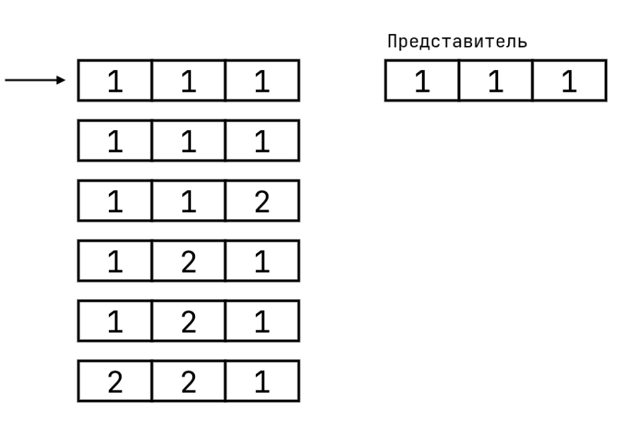

Это мы обработали вручную. Если же выполним запрос, то получим тот же самый результат:

```sql
SELECT a, b, c FROM tbl GROUP BY a, b, c;
           QUERY PLAN
-------------------------------
 Group
   Group Key: a, b, c
   ->  Sort
         Sort Key: a, b, c
         ->  Seq Scan on tbl
(5 rows)

 a | b | c 
---+---+---
 1 | 1 | 1
 1 | 1 | 2
 1 | 2 | 1
 2 | 2 | 1
(4 rows)
```

Теперь перейдем к коду.

```c++
/* https://github.com/postgres/postgres/blob/REL_18_3/src/backend/executor/nodeAgg.c#L2264 */
static TupleTableSlot *ExecAgg(PlanState *pstate)
{
    AggState   *node = castNode(AggState, pstate);
    TupleTableSlot *result = NULL;

    if (!node->agg_done)
    {
        /* Dispatch based on strategy */
        switch (node->aggstrategy)
        {
            case AGG_HASHED:
               /* ... */
            case AGG_MIXED:
               /* ... */
            case AGG_PLAIN:
            case AGG_SORTED:
                return agg_retrieve_direct(node);
        }
    }

    return NULL;
}
```

Сортировку представляет уже перечисление `AGG_SORTED`, и, как можете заметить, плоская группировка имеет тот же самый обработчик. Если так подумать, то плоскую группировку можно рассматривать как вырожденный случай сортировки, когда все кортежи как бы равны и сравнения выполнить не нужно.

<spoiler title="Еще одна важная разница и зачем читать кортеж перед инициализацией">

Хоть мы и сказали, что сортировка и плоская почти одно и то же, но разница в обработке все же есть и касается она правила SQL. Плоская группировка всегда возвращает только 1 кортеж, а другие - сколько угодно (0+).

Поэтому, если мы представим, что эти стратегии так можно обработать, то можем нарушить это правило, и тогда все пойдет наперекосяк (плоская группировка может ничего не вернуть).

Здесь и возвращаемся в самое начало, когда рассматривали `agg_retrieve_direct` - вначале мы читали кортеж и проверяли, что он не `NULL`, т.е. есть какие-то кортежи, которые нужно обработать. На тот момент в этом не было необходимости, но сейчас есть - если вход пустой, то для сортировки мы должны вернуть `NULL` (т.е. вход закончился и кортежей больше нет), а для плоской - 1 кортеж с какими-то результатами (вызываем финализатор над изначальным состоянием, для которого мы ни одной функции перехода не вызываем).

Расширенная версия участка чтения и проверки кортежа на `NULL` выглядит так:

```c++
/* https://github.com/postgres/postgres/blob/REL_18_3/src/backend/executor/nodeAgg.c#L2498 */
static TupleTableSlot *agg_retrieve_direct(AggState *aggstate)
{
   Agg           *node = aggstate->phase->aggnode;
   AggStatePerAgg peragg;
   AggStatePerGroup *pergroups;

   /* Самый первый вызов, поэтому первый кортеж становится представителем */
   if (aggstate->grp_firstTuple == NULL)
   {
      outerslot = fetch_input_tuple(aggstate);
      if (TupIsNull(outerslot))
      {
         /* При сортировке с пустым входом ничего не возвращаем, но плоская должна вернуть ровно 1 кортеж */
         if (node->aggstrategy != AGG_PLAIN)
            return NULL;
      }
   }

   /* Обработка группировки как раньше */
}
```

</spoiler>

Что происходит внутри `agg_retrieve_direct`, мы только что видели, поэтому сконцентрируемся на основном различии - обнаружении границ групп. А заключается она вот в этой строчке - когда читаем очередной кортеж, то проверяем его на равенство представителю:

```c++
/* https://github.com/postgres/postgres/blob/REL_18_3/src/backend/executor/nodeAgg.c#L2573 */
static TupleTableSlot *
agg_retrieve_direct(AggState *aggstate)
{
   /* ... */
   for (;;)
   {
      advance_aggregates(aggstate);

      if (TupIsNull(outerslot))
      {
         aggstate->agg_done = true;
         break;
      }

      /* If we are grouping, check whether we've crossed a group boundary */
      if (node->aggstrategy != AGG_PLAIN)
      {
         tmpcontext->ecxt_innertuple = firstSlot;
         if (!ExecQual(aggstate->phase->eqfunctions[node->numCols - 1], tmpcontext))
         {
            aggstate->grp_firstTuple = ExecCopySlotHeapTuple(outerslot);
            break;
         }
      }
   }
   /* ... */
}
```

Чтобы проверить кортежи на равенство, нужно проверить каждый атрибут. Как можете заметить (`ExecQual`), функции вызываются с помощью скомпилированных выражений - для каждого атрибута вызываем свою функцию проверки. Но откуда эти функции берутся? Как и всегда - из системного каталога.

У типов могут быть разные свойства, и все это также описывается классами и семействами операторов, но мы опять не будем углубляться. Сделаем только вывод - типы могут быть сравниваемыми и/или хешируемыми. Соответственно, они могут поддерживать операторы для B-tree и HASH индексов. У каждого индекса есть свои стратегии поиска, но главное, что у обоих этих индексов есть стратегия поиска равенство. Поэтому сейчас мы пытаемся получить оператор равенства для этого типа - вначале ищем у Btree, а затем, если не нашли, у HASH индекса.

Свойства типов и их операторы (в общем случае свойства типа) можно назвать горячими данными. Поэтому вместо того, чтобы постоянно ходить в системный каталог, эта информация кэшируется в кэше типов. Доступ к нему осуществляется через функцию `lookup_type_cache`, и вот ее кусок (максимально очищенный), отвечающий за поиск оператора сравнения.

```c++
/* https://github.com/postgres/postgres/blob/REL_18_3/src/backend/utils/cache/typcache.c#L632 */
TypeCacheEntry *lookup_type_cache(Oid type_id, int flags)
{
   TypeCacheEntry *typentry;

   if (flags & (TYPECACHE_EQ_OPR | TYPECACHE_EQ_OPR_FINFO))
   {
      Oid eq_opr = InvalidOid;
   
      /* BTREE */
      if (typentry->btree_opf != InvalidOid)
          eq_opr = get_opfamily_member(typentry->btree_opf,
                                       typentry->btree_opintype,
                                       typentry->btree_opintype,
                                       BTEqualStrategyNumber);
      /* HASH */
      if (typentry->hash_opf != InvalidOid && eq_opr == InvalidOid)
          eq_opr = get_opfamily_member(typentry->hash_opf,
                                       typentry->hash_opintype,
                                       typentry->hash_opintype,
                                       HTEqualStrategyNumber);
   }
}
```

Но нельзя просто взять и вызывать эти функции для проверки равенства. Вы могли заметить, что функции сравнения (как минимум для встроенных типов) помечены `STRICT`, то есть должны возвращать `NULL`, если хотя бы один из операндов `NULL` (что автоматически интерпретируется как `FALSE`), но если мы запустим запрос с `NULL` атрибутами, то они все попадут в одну группу, хотя по идее должны быть все в разных.

На самом деле для сравнения используется конструкция `IS NOT DISTINCT FROM`, которая имеет правила сравнения с `NULL` и возвращает `TRUE` если оба операнда `NULL` и `FALSE`, если только 1 из них. Обычный компаратор вызывается если оба операнда нормальные. Для нее также определена отдельная команда.

```c++
/* https://github.com/postgres/postgres/blob/REL_18_3/src/backend/executor/execExprInterp.c#L1481 */
static Datum ExecInterpExpr(ExprState *state, ExprContext *econtext)
{
   EEO_CASE(EEOP_NOT_DISTINCT)
   {
      if (left_isnull && right_isnull)
      {
          *op->resvalue = true;
      }
      else if (left_isnull || right_isnull)
      {
          *op->resvalue = false;
      }
      else
      {
          *op->resvalue = eqfunction();
      }
   }
}

```

<spoiler title="Эффективное сравнение">

Если вход отсортирован, то наиболее вероятно, что изменяться будут старшие атрибуты (в конце списка), поэтому при компиляции выражения сравнения мы кладем выражения проверки с конца: вначале проверяем последние атрибуты, а потом идем к началу.

```c++
/* https://github.com/postgres/postgres/blob/REL_18_3/src/backend/executor/execExpr.c#L4526 */
ExprState *
ExecBuildGroupingEqual(TupleDesc ldesc, TupleDesc rdesc, const TupleTableSlotOps *lops,
                       const TupleTableSlotOps *rops, int numCols, const AttrNumber *keyColIdx,
                       const Oid *eqfunctions, const Oid *collations, PlanState *parent)
{
    /*
     * Start comparing at the last field (least significant sort key). That's
     * the most likely to be different if we are dealing with sorted input.
     */
    for (int natt = numCols; --natt >= 0;)
    {
       /* Создание шагов проверки равенства атрибута */
    }
}
```

</spoiler>

На этом сортировка закончена и мы переходм к хешированию.

### Хеширование

```sql
SELECT a, b FROM tbl GROUP BY a, b;

      QUERY PLAN      
------------------------
 HashAggregate
   Group Key: a, b
   ->  Seq Scan on tbl
```

Верхнеуровнево она описывается просто. Используем хеш-таблицу в памяти: ключ - атрибуты группировки, значение - само состояние агрегата. При чтении очередного кортежа идем в хеш-таблицу и получаем существующее/создаем новое состояние ассоциированного агрегата и вызываем для него функцию перехода. В конце итерируемся по хеш-таблице и для каждого элемента (т.е. состояния) вызываем финализатор.

Но тут возникает проблема, которой не было в сортировке - нехватка памяти. В сортировке в каждый момент времени мы храним состояние только для 1 группы, но здесь нам придется хранить состояние для *каждой группы*, которая нам попадется. Из-за этого потребление памяти может быть огромным (в худшем случае, все кортежи уникальны). Ограничение (мягкое) памяти задается параметром `work_mem`, а для хеша мы даже можем указать множитель `hash_mem_multiplier`, но даже так памяти может не хватить.

Для решения этой проблемы мы будем сбрасывать часть данных на диск для их последующей обработки. А чтобы это сделать эффективно, надо знать устройство работы хеш-таблицы.

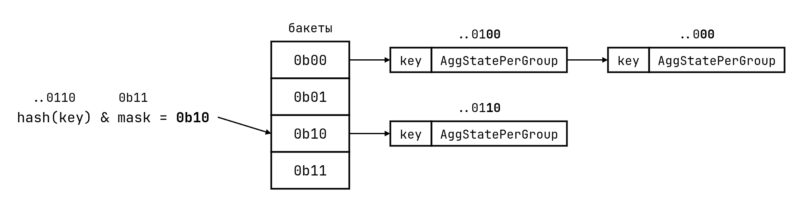

<spoiler title="Реализация хеш-таблицы">

Сама хеш-таблица нигде не реализуется - она кодогенерируется с помощью заголовочного файла `simplehash.h` ([ссылка](https://github.com/postgres/postgres/blob/62d6c7d3df6287f1bd83199c1a746e50d31571a0/src/include/lib/simplehash.h)). Вызывающему коду требуется с помощью макросов описать разные ее аспекты, а дальше включить (`#include`) этого файла. Хеш-таблица, используемая для группировки, [определяется так](https://github.com/postgres/postgres/blob/62d6c7d3df6287f1bd83199c1a746e50d31571a0/src/backend/executor/execGrouping.c#L35):

```c++
/* https://github.com/postgres/postgres/blob/REL_18_3/src/backend/executor/execGrouping.c#L35 */
#define SH_PREFIX tuplehash
#define SH_ELEMENT_TYPE TupleHashEntryData
#define SH_KEY_TYPE MinimalTuple
#define SH_KEY firstTuple
#define SH_HASH_KEY(tb, key) TupleHashTableHash_internal(tb, key)
#define SH_EQUAL(tb, a, b) TupleHashTableMatch(tb, a, b) == 0
#define SH_SCOPE extern
#define SH_STORE_HASH
#define SH_GET_HASH(tb, a) a->hash
#define SH_DEFINE
#include "lib/simplehash.h"
```

За что отвечают эти макросы должно стать понятно из их названия, поэтому внимание акцентировать на этом не будем.

Сама хеш-таблица - с открытой адресацией, и для разрешения коллизий используется видоизмененный "робин гуд". Если кто не знает - мы храним один большой массив всех элементов, а для разрешения коллизий идем в другую ячейку и для производительности эту другую ячейку ищем поближе.

Но здесь должен появиться вопрос, потому что схема устройства хеш-таблицы выше показывает реализацию списками (закрытая адресация). Да, я это сделал намеренно, по 2 причинам: 1) так проще для понимания и 2) четкое разделение на бакеты еще понадобится.

</spoiler>

Концептуально, хеш-таблицу можно представить как массив бакетов. В каждом бакете лежат элементы, хеши которых по определенной маске равны. Чтобы получить нужный элемент:

1. Хешируем ключ (атрибуты группировки)
2. Прикладываем маску к этому хешу и получаем индекс нужного бакета
3. Идем по элементам бакета и проверяем ключи на равенства

Так как эта часть хеша равна, то кортежи с одними и теми же ключами будут принадлежать одному и тому же бакету (потому что их хеши должны быть равны). Когда память переполнилась, сбрасывать саму хеш-таблицу не вариант, т.к. для сброса нужно состояние сериализовать, но не факт, что для этого состояния определена функция сериализации/десериализации (параметр `SERIALFUNC` в `CREATE AGGREGATE`). С другой стороны, так как памяти не хватает и группы для этого кортежа нет, то эта группа в хеш-таблице и не появится. Это значит, что мы можем сбросить сам кортеж на диск, а потом еще раз строить из сброшенных кортежей хеш-таблицу.

Если мы будем просто сбрасывать все кортежи и потом строить из них хеш-таблицу, то это сработает. Но если все элементы будут уникальными, то производительность может страдать - нам придется сделать столько же циклов записи/чтения сколько и будет самих таблиц.

Тут нам и пригодится знание об устройстве хеш-таблицы. Она разделена на отдельные, *непересекающиеся* бакеты (на основании хеша). Это означает, что каждый такой бакет мы можем обработать независимо от других и не беспокоиться, что что-то пропустили.

Таким образом, мы приходим к основной идее - когда мы начинаем сброс, то разбиваем все кортежи на несколько отдельных непересекающихся партиций на основании хеша. Рассчитываем количество партиций таким образом, чтобы из каждой можно было **построить новую хеш-таблицу, полностью помещающуюся в памяти**. В лучшем случае, эта стратегия позволит нам обойтись только 1 сбросом на диск.

По-хорошему, нам бы знать распределение, чтобы рассчитать необходимый размер каждой партиции, но с таким подходом возникает 2 проблемы. Первая и самая очевидная - распределения мы не знаем. Но даже если и знали бы, то есть вторая проблема - обработка количества партиций. Так как мы работаем с двоичной логикой, то самое простое - округлять количество партиций до степени 2, тогда маска будет простой последовательностью битов, которую мы прикладываем. Но если это количество будет переменным, то нужно приложить усилия, чтобы подобное обрабатывать.

Поэтому мы делаем так - предполагаем, что распределение данных равномерное и тогда нам нужно просто поделить целевое количество памяти (сколько потребуется вообще) на то, сколько нам доступно. Эта идея и лежит в основе расчета количества партиций:

```c++
/* https://github.com/postgres/postgres/blob/REL_18_3/src/backend/executor/nodeAgg.c#L2101 */
static int hash_choose_num_partitions(double input_groups, double hashentrysize,
                                      int used_bits, int *log2_npartitions)
{
   Size hash_mem_limit = get_hash_memory_limit();

   double mem_wanted = input_groups * hashentrysize;

   /* make enough partitions so that each one is likely to fit in memory */
   double dpartitions = 1 + (mem_wanted / hash_mem_limit);
}
```

К сожалению, мы можем ошибиться (статистика не та или распределение данных) и придется выполнить еще один сброс. В этом случае, возникает целых 2 проблемы:

Первое, так как мы уже использовали какое-то количество бит хеша и при этом все кортежи попали в одну и ту же партицию, то префиксы хешей этих кортежей равны и их нет смысла рассматривать. Поэтому для определения номера бакета в хеше мы используем обобщенную маску, а не префикс.

```c++
/* https://github.com/postgres/postgres/blob/REL_18_3/src/backend/executor/nodeAgg.c#L2990 */
static void
hashagg_spill_init(HashAggSpill *spill, LogicalTapeSet *tapeset, int used_bits,
                   double input_groups, double hashentrysize)
{
   npartitions = hash_choose_num_partitions(input_groups, hashentrysize,
                                            used_bits, &partition_bits);

   spill->shift = 32 - used_bits - partition_bits;
   if (spill->shift < 32)
       spill->mask = (npartitions - 1) << spill->shift;
   else
       spill->mask = 0;
   /* ... */
}

```

Второе - статистика. Она нужна для расчета необходимого количества партиций. Изначальную оценку мы можем получить от планировщика, но после она будет неправильной. Мы предполагаем, что распределение равномерное, и можно было бы просто поделить предыдущую оценку на количество бакетов, но раз уж мы здесь (при повторном сбросе), то, значит, с оценкой ошиблись и просто поделить нельзя.

Выход один - мы будем подсчитывать это самостоятельно. Для этого используется структура данных HyperLogLog. Она с помощью хеш-значений позволяет с некоторой точностью рассчитать количество уникальных значений в множестве.

```c++
/* https://github.com/postgres/postgres/blob/REL_18_3/src/backend/executor/nodeAgg.c#L3016 */
static void
hashagg_spill_init(HashAggSpill *spill, LogicalTapeSet *tapeset, int used_bits,
                   double input_groups, double hashentrysize)
{
   npartitions = hash_choose_num_partitions(input_groups, hashentrysize,
                                            used_bits, &partition_bits);
   for (int i = 0; i < npartitions; i++)
       initHyperLogLog(&spill->hll_card[i], HASHAGG_HLL_BIT_WIDTH);
}
```

Основные моменты закрыты, поэтому приступим к коду, как и всегда, начиная с точки входа. Сейчас у нас хеширование, и за него отвечает `AGG_HASHED`.

```c++
/* https://github.com/postgres/postgres/blob/REL_18_3/src/backend/executor/nodeAgg.c#L2256 */
static TupleTableSlot *ExecAgg(PlanState *pstate)
{
   AggState *node = castNode(AggState, pstate);
   switch (node->aggstrategy)
   {
       case AGG_HASHED:
           if (!node->table_filled)
               agg_fill_hash_table(node);
           result = agg_retrieve_hash_table(node);
           break;
       case AGG_MIXED:
       case AGG_SORTED:
       case AGG_PLAIN:
           /* ... */
   }
}
```

Сама логика разделена на 2 части: изначальное заполнение таблицы и ее обработка. Вначале мы рассмотрим только логику в памяти, без сброса на диск.

```c++
/* https://github.com/postgres/postgres/blob/REL_18_3/src/backend/executor/nodeAgg.c#L2625 */
static void agg_fill_hash_table(AggState *aggstate)
{
   TupleTableSlot *outerslot;
   for (;;)
   {
       outerslot = fetch_input_tuple(aggstate);
       if (TupIsNull(outerslot))
           break;
       lookup_hash_entries(aggstate);
       advance_aggregates(aggstate);
   }

   aggstate->table_filled = true;
}
```

Первая часть, заполнение таблицы, довольно проста. Ее большая часть уже должна быть понятна `fetch_input_tuple` - чтение кортежей, а `advance_aggregates` - вызов функции перехода. Основная логика работы с хеш-таблицей находится в `lookup_hash_entries`.

```c++
/* https://github.com/postgres/postgres/blob/REL_18_3/src/backend/executor/nodeAgg.c#L2205 */
static void lookup_hash_entries(AggState *aggstate)
{
    AggStatePerHash perhash = aggstate->perhash;
    TupleHashTable hashtable = perhash->hashtable;
    bool isnew = false;
    TupleHashEntry entry;

    entry = LookupTupleHashEntry(hashtable, hashslot, &isnew, &hash);
    if (isnew)
        initialize_hash_entry(aggstate, hashtable, entry);

    aggstate->pergroup = TupleHashEntryGetAdditional(hashtable, entry);
}
```

Для того, чтобы работать с хеш-таблицей, используется структура `AggStatePerHash`. В ней хранится вся необходимая для нее информация: сама хеш-таблица и все необходимые функции (хеширование или проверка равенства).

Непосредственная работа с хеш-таблицей заключена в `LookupTupleHashEntry`. Для оптимизации поиск и создание нового элемента в хеш-таблице выполняется за 1 вызов функции. Внутри ничего необычного: рассчитываем хеш ключа, а затем вызываем саму функцию поиска с данным хешем.

```c++
/* https://github.com/postgres/postgres/blob/REL_18_3/src/backend/executor/execGrouping.c#L420 */
static uint32 TupleHashTableHash_internal(struct tuplehash_hash *tb, const MinimalTuple tuple)
{
    uint32 hashkey = ExecEvalExpr(hashtable->tab_hash_expr, hashtable->exprcontext, &isnull);
    return murmurhash32(hashkey);
}

```

Сначала рассчитываем хеш для кортежа. Его мы рассчитываем из всех атрибутов и для этого нужно получить хеш-функцию для типа.

Для нас главное научиться хешировать базовый тип (в противопоставление сложным/составным типам: RECORD, ARRAY, RANGE и т.д.). Для этого мы снова идем в системный каталог: функция хеширования - это первая опорная функция хеш индекса.

<spoiler title="Опорные функции индексов">

У разных методов доступа могут быть разные свойства и, как следствие, разные требования. Чтобы обобщить подобное и сделать доступным легкое добавление новых методов доступа, была добавлена поддержка опорных функций. С помощью опорных функций мы можем включить поддержку фичи метода доступа для конкретного типа.

Только что мы рассмотрели хеш-индекс и соответствующий метод доступа. У него есть 3 опорные функции:

```c++
/* https://github.com/postgres/postgres/blob/REL_18_3/src/include/access/hash.h#L355 */

/*
 * When a new operator class is declared, we require that the user supply
 * us with an amproc function for hashing a key of the new type, returning
 * a 32-bit hash value.  We call this the "standard" hash function.  We
 * also allow an optional "extended" hash function which accepts a salt and
 * returns a 64-bit hash value.  This is highly recommended but, for reasons
 * of backward compatibility, optional.
 *
 * When the salt is 0, the low 32 bits of the value returned by the extended
 * hash function should match the value that would have been returned by the
 * standard hash function.
 */
#define HASHSTANDARD_PROC        1
#define HASHEXTENDED_PROC        2
#define HASHOPTIONS_PROC         3
#define HASHNProcs               3
```

Мы использовали первую функцию, "стандартную". Кроме нее есть "расширенная", принимающая больше параметров.

Другой пример - это популярный B+tree. У него есть целых 6 функций:

```c++
/* https://github.com/postgres/postgres/blob/REL_18_3/src/include/access/nbtree.h#L717 */

/*
 *    When a new operator class is declared, we require that the user
 *    supply us with an amproc procedure (BTORDER_PROC) for determining
 *    whether, for two keys a and b, a < b, a = b, or a > b.  This routine
 *    must return < 0, 0, > 0, respectively, in these three cases.
 *
 *    To facilitate accelerated sorting, an operator class may choose to
 *    offer a second procedure (BTSORTSUPPORT_PROC).  For full details, see
 *    src/include/utils/sortsupport.h.
 *
 *    To support window frames defined by "RANGE offset PRECEDING/FOLLOWING",
 *    an operator class may choose to offer a third amproc procedure
 *    (BTINRANGE_PROC), independently of whether it offers sortsupport.
 *    For full details, see doc/src/sgml/btree.sgml.
 *
 *    To facilitate B-Tree deduplication, an operator class may choose to
 *    offer a forth amproc procedure (BTEQUALIMAGE_PROC).  For full details,
 *    see doc/src/sgml/btree.sgml.
 *
 *    An operator class may choose to offer a fifth amproc procedure
 *    (BTOPTIONS_PROC).  These procedures define a set of user-visible
 *    parameters that can be used to control operator class behavior.  None of
 *    the built-in B-Tree operator classes currently register an "options" proc.
 *
 *    To facilitate more efficient B-Tree skip scans, an operator class may
 *    choose to offer a sixth amproc procedure (BTSKIPSUPPORT_PROC).  For full
 *    details, see src/include/utils/skipsupport.h.
 */

#define BTORDER_PROC          1
#define BTSORTSUPPORT_PROC    2
#define BTINRANGE_PROC        3
#define BTEQUALIMAGE_PROC     4
#define BTOPTIONS_PROC        5
#define BTSKIPSUPPORT_PROC    6
#define BTNProcs              6
```

Кроме этого, есть опорные функции для [GiST](https://github.com/postgres/postgres/blob/REL_18_3/src/include/access/gist.h#L32), [SP-GIST](https://github.com/postgres/postgres/blob/REL_18_3/src/include/access/spgist.h#L23), [GIN](https://github.com/postgres/postgres/blob/REL_18_3/src/include/access/gin.h#L24).

</spoiler>

Но это еще не все. Перед тем как этот хеш вернуть, мы *еще раз его хешируем*. Делается это для того, чтобы защититься от плохих хеш-функций - посмотреть внутрь функции хеширования и запретить плохие мы не можем, поэтому пессимистично хешируем хеш. Для этого используется murmurhash.

Теперь мы идем искать элемент с требуемым ключом в самой хеш-таблице. Здесь уже непосредственно логика самой хеш-таблицы, поэтому опустим.

Из хеш-таблицы мы получаем элемент и при необходимости надо инициализировать состояние агрегата (если создали новый элемент).

Это мы делаем в `initialize_hash_entry`, и пока ничего необычного тут нет - инициализация каждого состояния как и было раньше.

```c++
/* https://github.com/postgres/postgres/blob/REL_18_3/src/backend/executor/nodeAgg.c#L2136 */
static void initialize_hash_entry(AggState *aggstate, TupleHashTable hashtable,
                                  TupleHashEntry entry)
{
   /* ... какой-то код тут */

   for (transno = 0; transno < aggstate->numtrans; transno++)
   {
       AggStatePerTrans pertrans = &aggstate->pertrans[transno];
       AggStatePerGroup pergroupstate = &pergroup[transno];

       initialize_aggregate(aggstate, pertrans, pergroupstate);
   }
}
```

Состояние на руках и его нужно передать в `advance_aggregates`, откуда он передаст его функции перехода. Но если обратить внимание на ее сигнатуру, то заметим, что она принимает только само состояние узла, а не отдельное состояние (каждого агрегата) и кортеж.

Это потому что мы передаем аргументы для функции перехода через окружение. В частности, состояние агрегатов мы передаем через поле `pergroup`, в который сейчас сохраняем указатель на текущий массив из `AggStatePerGroup`, а после `advance_aggregates` поймет откуда брать состояние и передаст его нужному обработчику.

```c++
static void
lookup_hash_entries(AggState *aggstate)
{
   /* ... */
   aggstate->pergroup = TupleHashEntryGetAdditional(hashtable, entry);
}
```

После настройки мы вызываем функцию перехода в `advance_aggregates` и на этом итерация окончена. Продолжаем так, пока не обработаем весь вход и, когда вход обработан, приступаем к финализации состояний.

Делается это просто - итерируемся по хеш-таблице и вызываем финализатор для каждого элемента. Это реализуется в [`agg_retrieve_hash_table_in_memory`](https://github.com/postgres/postgres/blob/62d6c7d3df6287f1bd83199c1a746e50d31571a0/src/backend/executor/nodeAgg.c#L2859), но итерирование по хеш-таблице тривиально/неважно, а как происходит финализация, мы уже видели, поэтому эту часть не будем рассматривать.

```c++
/* https://github.com/postgres/postgres/blob/REL_18_3/src/backend/executor/nodeAgg.c#L2860 */
static TupleTableSlot *agg_retrieve_hash_table_in_memory(AggState *aggstate)
{
   for (;;)
   {
      TupleHashTable hashtable = perhash->hashtable;
      TupleHashEntry entry;
      entry = ScanTupleHashTable(hashtable, &perhash->hashiter);
      if (entry == NULL)
          return NULL;
      finalize_aggregates(aggstate, peragg, pergroup);
      result = project_aggregates(aggstate);
      if (result)
          return result;
   }
}
```

Это была самая простая часть - логика в памяти. Теперь перейдем к случаю, когда не хватает памяти.

### Хеширование, сброс на диск

Первый вопрос - где и когда мы обнаружим переполнение памяти? Самое оптимальное тогда, когда память выделили. Такое место мы знаем - `initialize_hash_entry`, инициализация состояния при создании новой группы.

Ранее я сказал, что "пока там только инициализация состояния агрегатов", намекая на то, что там есть и еще кое-что. И этим чем-то еще является проверка использования памяти - `hash_agg_check_limits`.

<spoiler title="hash_agg_check_limits">

```c++
/* https://github.com/postgres/postgres/blob/REL_18_3/src/backend/executor/nodeAgg.c#L1867 */
static void
hash_agg_check_limits(AggState *aggstate)
{
    uint64    ngroups = aggstate->hash_ngroups_current;
    Size      meta_mem = MemoryContextMemAllocated(aggstate->hash_metacxt,
                                                   true);
    Size      entry_mem = MemoryContextMemAllocated(aggstate->hash_tablecxt,
                                                    true);
    Size      tval_mem = MemoryContextMemAllocated(aggstate->hashcontext->ecxt_per_tuple_memory,
                                                   true);
    Size      total_mem = meta_mem + entry_mem + tval_mem;
    bool      do_spill = false;

    /*
     * Don't spill unless there's at least one group in the hash table so we
     * can be sure to make progress even in edge cases.
     */
    if (aggstate->hash_ngroups_current > 0 &&
        (total_mem > aggstate->hash_mem_limit ||
         ngroups > aggstate->hash_ngroups_limit))
    {
        do_spill = true;
    }

    if (do_spill)
        hash_agg_enter_spill_mode(aggstate);
}
```

</spoiler>

Сама проверка довольно тривиальная - сравниваем сколько памяти выделили в каждом `MemoryContext` с тем сколько доступно. И когда эта проверка проходит, то мы переходим в режим сброса, spill mode.

Режим сброса можно назвать другим режимом выполнения, так как меняется не только тот факт, что мы сбрасываем кортежи на диск, но и вообще предположения о состоянии.

Во-первых, если нет памяти, то и объект состояния мы создать не можем, а значит `AggStatePerGroup` мы не получим. Об этом нужно сообщить `advance_aggregates`, чтобы он не вызывал для этого кортежа функцию перехода - передаем `NULL` в `pergroup`.

Но с другой стороны, когда мы *не* в режиме сброса, то можем гарантировать, что `NULL` быть не может и нет смысла тратить время на его проверки. Здесь мы и приходим к еще одному преимуществу скомпилированных выражений - для каждого окружения мы можем создать свою версию функции, выполняющую только необходимую логику.

К чему все идет, вы, должно быть, уже догадались - у нас есть 2 версии функции перехода: одна проверяет `NULL`, другая нет - для режима сброса и обычного соответственно. В самом начале мы выполняли обычную версию без проверки (т.к. все помещается в памяти), а сейчас мы будем компилировать новую версию с `NULL` проверкой и дальше будем работать только с ней.

За компиляцию выражения для вызова функций перехода используется `ExecBuildAggTransCall` и первая команда, которую он добавляет, - эта самая проверка на `NULL`.

<spoiler title="ExecBuildAggTransCall">

```c++
/* https://github.com/postgres/postgres/blob/REL_18_3/src/backend/executor/execExpr.c#L4036 */
static void
ExecBuildAggTransCall(ExprState *state, AggState *aggstate, bool nullcheck)
{
   /* ... */
   /* add check for NULL pointer? */
   if (nullcheck)
   {
       scratch->opcode = EEOP_AGG_PLAIN_PERGROUP_NULLCHECK;
       scratch->d.agg_plain_pergroup_nullcheck.setoff = setoff;
       /* adjust later */
       scratch->d.agg_plain_pergroup_nullcheck.jumpnull = -1;
       ExprEvalPushStep(state, scratch);
       adjust_jumpnull = state->steps_len - 1;
   }
   /* ... */
}
```

</spoiler>

Во-вторых, кортежи без группы мы должны сбросить на диск для последующей обработки. Но и тут не все просто.

У алгоритмов, работающих с диском, есть повторяющиеся паттерны работы:

1. последовательная запись
2. откат в самое начало
3. последовательное чтение (и сама повторная обработка)

При всем этом во время записи мы ничего не читаем, а при чтении к уже прочитанным данным заново не обращаемся, сбрасываем все в потоке. К нам (группировка хешированием) это применимо: при сбросе читать заново кортежи нам не надо, а при перезаполнении хеш-таблицы каждая партиция используется единожды (если потребуется повторный сброс, то создадим новую партицию).

Для таких задач в postgres используется абстракция [LogicalTapeSet](https://github.com/postgres/postgres/blob/REL_18_3/src/backend/utils/sort/logtape.c#L187) - это обертка над временным файлом, которая позволяет делить его на несколько независимых LogicalTape (читай виртуальных файлов). Единица работы с файлами страница и временные файлы не исключение, поэтому каждый LogicalTape - это связный список страниц.

Идея LogicalTapeSet следующая: когда мы начинаем читать LogicalTape/партицию, то отматываемся в самое начало и, когда прочитали очередную страницу, кладем ее в пул свободных. Следующий LogicalTape, который хочет записать, использует эту страницу, вместо того, чтобы писать в конец файла и увеличивать его размер. В случае с группировкой каждый LogicalTape - это одна партиция.

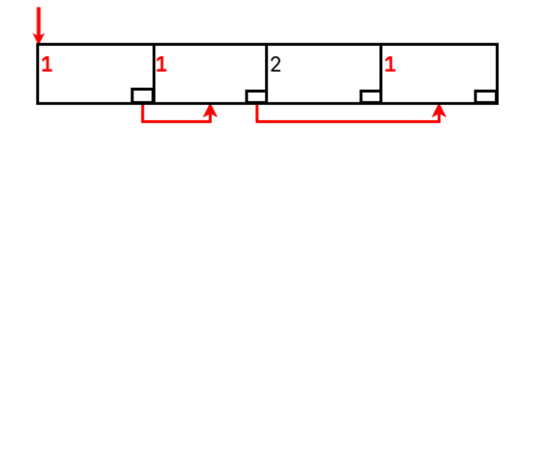

И в-третьих, нужно инициализировать внутреннее состояние, т.е. объекты самих партиций. Для этого используется структура `HashAggSpill`. В ней хранятся параллельные массивы данных для каждой партиции - статистика, LogicalTape и т.д.

Это то самое место, где нам нужно рассчитать количество партиций и так как это наш первый сброс, то при инициализации статистику мы берем от планировщика (`numGroups`), а `0` - это количество использованных битов хеша (пока не использовали).

Подытоживая, режим сброса означает следующее:

1. Перекомпиляция функций перехода с проверкой `NULL`
2. Создание временного файла для сброса кортежей
3. Подсчет статистики для каждой партиции

Все это и отражено в функции `hash_agg_enter_spill_mode`:

```c++
/* https://github.com/postgres/postgres/blob/REL_18_3/src/backend/executor/nodeAgg.c#L1911 */
static void hash_agg_enter_spill_mode(AggState *aggstate)
{
   aggstate->hash_spill_mode = true;
   hashagg_recompile_expressions(aggstate, aggstate->table_filled, true);
   aggstate->hash_tapeset = LogicalTapeSetCreate(true, NULL, -1);
   HashAggSpill *spill = palloc(sizeof(HashAggSpill));
   hashagg_spill_init(spill, aggstate->hash_tapeset, 0,
                      perhash->aggnode->numGroups,
                      aggstate->hashentrysize);
}
```

Как только эта функция отработает изменения будут заметны на следующей итерации. Теперь при отсутствии элемента его создавать не надо и хеш-таблице об этом надо сказать. Для этого мы переиспользуем флаг `isnew`, через который нам передавали флаг создания нового элемента. Сейчас мы передаем `NULL` - хеш-таблица это видит и вместо создания элемента возвращает `NULL`.

```c++
/* https://github.com/postgres/postgres/blob/REL_18_3/src/backend/executor/nodeAgg.c#L2216 */
static void lookup_hash_entries(AggState *aggstate)
{
   TupleHashEntry entry;
   uint32    hash;
   bool      isnew = false;
   bool     *p_isnew;

   /* if hash table already spilled, don't create new entries */
   p_isnew = aggstate->hash_spill_mode ? NULL : &isnew;

   entry = LookupTupleHashEntry(hashtable, hashslot,
                                p_isnew, &hash);
   if (entry != NULL)
   {
      /* ... */
   }
   else
   {
      HashAggSpill *spill = &aggstate->hash_spills;
      TupleTableSlot *slot = aggstate->tmpcontext->ecxt_outertuple;

      hashagg_spill_tuple(aggstate, spill, slot, hash);
      pergroup = NULL;
   }
}
```

Для сброса кортежа используется `hashagg_spill_tuple`, и хотя это довольно маленькая (чуть больше 50 строк) функция, в ней полно интересных деталей.

Во-первых, если вы запускали `EXPLAIN VERBOSE`, то замечали, что нижележащие Scan узлы могут вернуть все атрибуты кортежа, даже если нужна только некоторая часть. Ниже запрос с ярким примером - из таблицы нужен только атрибут `a`, но при этом возвращаются все 3.

```sql
EXPLAIN (VERBOSE) SELECT a FROM tbl GROUP BY a;

           QUERY PLAN
--------------------------------
 HashAggregate
   Output: a
   Group Key: tbl.a
   ->  Seq Scan on public.tbl
         Output: a, b, c
(5 rows)
```

Лишнее место на диске занимать не нужно, но и ломать существующий код тоже (полагается на конкретную разметку кортежа, `TupleDesc`), поэтому все ненужные атрибуты мы просто пометим `NULL`.

<spoiler title="Почему возвращаются все атрибуты">

Короткий ответ - оптимизация.

В данном примере нам действительно нужен только 1 атрибут, но не забывайте, что в любом случае со страницы мы прочитаем целый кортеж и на его проекцию (создание нового кортежа) будут затрачены какие-то ресурсы, причем это будет пустая работа, т.к. эти атрибуты мы (группировка) вообще не будем использовать.

Поэтому мы не пытаемся оптимизировать все, а поступаем умнее - если эти атрибуты все равно никому не нужны, то и трогать их никто не будет и незачем нам на них свое время тратить.

Нужно так делать или нет решается во время создания плана скана отношения в функции `create_scan_plan`:

```c++
/* https://github.com/postgres/postgres/blob/REL_18_3/src/backend/optimizer/plan/createplan.c#L642 */
static Plan *
create_scan_plan(PlannerInfo *root, Path *best_path, int flags)
{
   /* ... */
   if (use_physical_tlist(root, best_path, flags))
   {
      if (best_path->pathtype == T_IndexOnlyScan)
      {
         /* For index-only scan, the preferred tlist is the index's */
         tlist = copyObject(((IndexPath *) best_path)->indexinfo->indextlist);

         /*
          * Transfer sortgroupref data to the replacement tlist, if
          * requested (use_physical_tlist checked that this will work).
          */
         if (flags & CP_LABEL_TLIST)
            apply_pathtarget_labeling_to_tlist(tlist, best_path->pathtarget);
      }
      else
      {
         tlist = build_physical_tlist(root, rel);
         if (tlist == NIL)
         {
            /* Failed because of dropped cols, so use regular method */
            tlist = build_path_tlist(root, best_path);
         }
         else
         {
            /* As above, transfer sortgroupref data to replacement tlist */
            if (flags & CP_LABEL_TLIST)
               apply_pathtarget_labeling_to_tlist(tlist, best_path->pathtarget);
         }
      }
   }
   else
   {
      tlist = build_path_tlist(root, best_path);
   }
   /* ... */
}
```

Как можете заметить, большая часть логики определения находится в `use_physical_tlist`. Приводить ее код тут не буду (вот [ссылка](https://github.com/postgres/postgres/blob/REL_18_3/src/backend/optimizer/plan/createplan.c#L865), если хотите), но опишу ее правила когда *нужно* использовать все атрибуты:

- Отношение одно из: таблица (обычная, не наследуемая, т.е. например, не партиционированная), подзапрос, функция (включая SRF), `VALUES` или CTE
- Не `CustomPath` (подключаемые AM)
- Не содержит системных атрибутов
- Если это IndexOnlyScan, то все атрибуты могут быть возвращены из индекса напрямую
   > Кому-то может показаться странным, что это может быть не так. Да, когда мы говорим о мейнстримном Btree, то оно все атрибуты может вернуть, но в общем случае есть ограничения. За то, можно ли вернуть атрибут или нет отвечает специальная функция `amcanreturn` (определяется самим индексом). Для Btree ее реализация [`btcanreturn`](https://github.com/postgres/postgres/blob/REL_18_3/src/backend/access/nbtree/nbtree.c#L1745) всегда возвращает `true`, но вот у хеш и блум индексов этой функции нет вовсе - они никакие атрибуты не могут вернуть, а для GiST функция [`gistcanreturn`](https://github.com/postgres/postgres/blob/REL_18_3/src/backend/access/gist/gistget.c#L797) смотрит на свои опорные функции.
- Не находится в NULLable части OUTER JOIN'а (т.е. выражение не станет NULL, если условие JOIN'а не сработает)
   > Честно говоря, все пункты для меня были понятны, кроме этого. Но, поразмышляв, пришел к следующему выводу: если условие не выполнится, то все атрибуты из NULLable части нужно будет занулить, но как мы занулим атрибуты, о которых не знали (если планировщик работал только с теми атрибутами, которые были в запросе), поэтому оставляем только те, которые реально будем использовать.

</spoiler>

Во-вторых, не забываем обновить `HyperLogLog` на случай повторного сброса. Но, так как все кортежи идут в одну партицию, какой-то префикс их хеша одинаковый. Если передадим вот так сразу, то в конце оценка может быть хуже. Поэтому, перед тем как этот хеш передавать, мы его еще раз хешируем. Но на этот раз не MurmurHash, а `lookup3` ([описание в вики небольшое](https://en.wikipedia.org/wiki/Jenkins_hash_function)).

> Почему используются разные хеш-функции я не знаю. Но предполагаю, из-за того, что `lookup3` более простая, а значит, более быстрая, чем murmurhash.

В-третьих, чтобы лишний раз не рассчитывать хеш-значение, мы записываем и его вместе с самим кортежем на диск.

<spoiler title="hashagg_spill_tuple">

```c++
static Size
hashagg_spill_tuple(AggState *aggstate, HashAggSpill *spill,
                    TupleTableSlot *inputslot, uint32 hash)
{
   TupleTableSlot *spillslot;
   int             partition;
   MinimalTuple tuple;
   LogicalTape *tape;
   int          total_written = 0;

   /* 
    * 1. Сбрасываем только необходимые атрибуты
    */
   if (!aggstate->all_cols_needed)
   {
      spillslot = aggstate->hash_spill_wslot;
      slot_getsomeattrs(inputslot, aggstate->max_colno_needed);
      ExecClearTuple(spillslot);
      for (int i = 0; i < spillslot->tts_tupleDescriptor->natts; i++)
      {
         if (bms_is_member(i + 1, aggstate->colnos_needed))
         {
            spillslot->tts_values[i] = inputslot->tts_values[i];
            spillslot->tts_isnull[i] = inputslot->tts_isnull[i];
         }
         else
            spillslot->tts_isnull[i] = true;
      }
      ExecStoreVirtualTuple(spillslot);
   }
   else
      spillslot = inputslot;

   tuple = ExecFetchSlotMinimalTuple(spillslot);

   /* 
    * 2. Обновляем статистику
    */
   if (spill->shift < 32)
      partition = (hash & spill->mask) >> spill->shift;
   else
      partition = 0;

   spill->ntuples[partition]++;
   
                                            /* повторное хеширование */
   addHyperLogLog(&spill->hll_card[partition], hash_bytes_uint32(hash));

   tape = spill->partitions[partition];

   /* 
    * 3. Записываем кортеж и его хеш
    */
   LogicalTapeWrite(tape, &hash, sizeof(uint32));
   total_written += sizeof(uint32);

   LogicalTapeWrite(tape, tuple, tuple->t_len);
   total_written += tuple->t_len;

   return total_written;
}
```

</spoiler>

После сброса нам остается только передать `NULL` в `pergroup`. Тогда `advance_aggregates` это увидит и ничего делать не станет.

> Если вы, как и я, задались вопросом, что случится, если подложить обычную функцию, а не режима сброса, когда мы в режиме сброса, будет SEGFAULT.

Это все изменения в логике итерации. Раньше мы обрабатывали только логику в памяти, поэтому сразу приступали к обработке, но сейчас у нас на руках есть сброшенные партиции, которые надо дополнительно обработать. Делается это в `hashagg_finish_initial_spills` (которую я ранее специально пропустил).

Под обработкой имеется в виду "запечатывание" партиций. Во время сброса мы использовали структуру `HashAggSpill`, но для повторного заполнения хеш-таблицы она очень неудобна: некоторые партиции могут быть пустыми, сами партиции надо будет тогда отслеживать (ее текущий индекс в массиве), статистику лучше подсчитать, чтобы места не занимала, и т.д. Поэтому сейчас для каждой непустой партиции мы создаем `HashAggBatch` (дальше просто "батч") - отдельный объект, хранящий всю информацию необходимую для перезаполнения хеш-таблицы: LogicalTape (отмотанный для чтения), подсчитанная кардинальность (из HyperLogLog) и т.д.

Последняя деталь - каждый батч мы кладем в одну большую очередь, из которой будем читать батчи по одному и перезаполнять хеш-таблицу. Во время этого у нас также может возникнуть нехватка памяти и мы начнем сбрасывать все на диск, создавая партиции и кладя созданные батчи в очередь. Таким образом, обработка закончится тогда, когда эта самая очередь опустеет.

Для наглядности нарисовал такую схему:

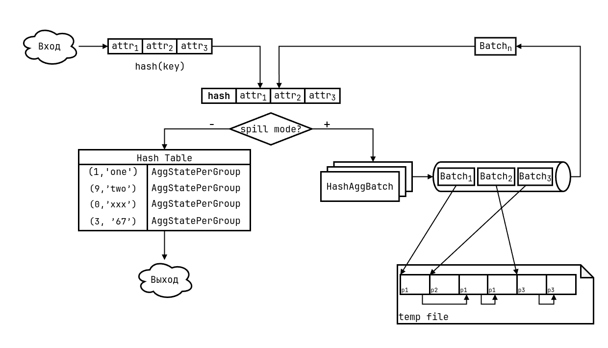

Эта схема довольно наглядная, но из нее можно сделать вывод, что за заполнение и перезаполнение таблицы отвечает один и тот же код. Это, конечно, не так - для этого используется другая функция - `agg_refill_hash_table`. Ее код практически идентичен тому, что при изначальном заполнении, но изменения уже должны быть понятны:

1. Чтение кортежей происходит из партиции, созданного тейпа для партиции
2. При получении элемента хеш-таблицы мы сразу передаем сохраненное хеш-значение
3. При сбросе нам нужно учитывать новую статистику по этой партиции: `used_bits` (сколько битов хеша использовали) сохранил вызывающий, а `input_card` (кардинальность) подсчитана с помощью HyperLogLog.

<spoiler title="agg_refill_hash_table">

```c++
/* https://github.com/postgres/postgres/blob/REL_18_3/src/backend/executor/nodeAgg.c#L2743 */
static bool agg_refill_hash_table(AggState *aggstate)
{
   for (;;)
   {
      bool  isnew = false;
      bool *p_isnew = aggstate->hash_spill_mode ? NULL : &isnew;
      
      /* 
       * 1. Для чтения кортежа используется другая функция, получающая хеш сразу
       */
      tuple = hashagg_batch_read(batch, &hash);
      if (tuple == NULL)
          break;
      /* 
       * 2. Хеш на руках, поэтому используем другую функцию для работы с хеш-таблицей, принимающую этот самый хеш
       */
      entry = LookupTupleHashEntryHash(hashtable, hashslot, p_isnew, hash);
      if (entry != NULL)
      {
         /* Группа существует или создана - код такой же как и при изначальном чтении */
         if (isnew)
            initialize_hash_entry(aggstate, hashtable, entry);
         aggstate->hash_pergroup = TupleHashEntryGetAdditional(hashtable, entry);
         advance_aggregates(aggstate);
      }
      else
      {
         if (!spill_initialized)
         {
            spill_initialized = true;
            hashagg_spill_init(&spill, tapeset,
                              /* 
                               * 3. При входе в режим сброса используем подсчитанную
                               *    для этого батча статистику
                               */
                               batch->used_bits, batch->input_card,

                               aggstate->hashentrysize);
         }
         /* no memory for a new group, spill */
         hashagg_spill_tuple(aggstate, &spill, spillslot, hash);

         aggstate->hash_pergroup = NULL;
      }
   }
}
```

</spoiler>

Вы могли подумать, что на этом все, расходимся, но нет. Вы 100% прочитали следующий заголовок и понимаете, что сейчас начнется веселье.

## Сложные аналитические функции: GROUPING SET, CUBE, ROLLUP

Дополнительно, для аналитических задач стандарт SQL определяет специальные функции: GROUPING SETS, CUBE и ROLLUP. Их идея в том, что мы в одном запросе можем определить сразу несколько группировок (возможно, по разным атрибутам), вместо того, чтобы выполнять несколько запросов и затем объединять их результаты вручную. Не все знают что это такое, поэтому вначале рассмотрим как они работают.

Самый простой и базовый - это GROUPING SETS. Он определяет список выражений, по которым будет одновременно производиться группировка. Для наглядности в [документации](https://www.postgresql.org/docs/current/queries-table-expressions.html#QUERIES-GROUPING-SETS) приводится такой пример: находим общую сумму продаж по бренду, размеру (каждого в отдельности) и общие продажи.

```sql
SELECT brand, size, sum(sales)
   FROM items_sold
   GROUP BY GROUPING SETS ((brand), (size), ());

-- Результат
 brand | size | sum
-------+------+-----
 Foo   |      |  30
 Bar   |      |  20
       | L    |  15
       | M    |  35
       |      |  50
(5 rows)

-- План запроса - отдельные группировки
          QUERY PLAN          
------------------------------
 MixedAggregate
   Hash Key: brand
   Hash Key: size
   Group Key: ()
   ->  Seq Scan on items_sold
(5 rows)
```

Итого, в этом запросе 3 GROUPING SET'а: brand, size и плоская группировка. Если какой-то атрибут есть в другой группе, но его нет в текущей, то в выводе он `NULL`.

> Надо разделять GROUPING SET и `GROUPING SETS`. Первое - это отдельная группировка (набор атрибутов для группировки по ним), а второе - это уже отдельное SQL выражение. Далее, я буду говорить "группировка" или "GROUPING SET" - это одно и то же (чтобы долго не писать, могу сокращать до GS)

Этот же запрос мы можем переписать таким образом с помощью UNION ALL:

```sql
-- brand
SELECT brand, NULL, sum(sales)
      FROM items_sold
      GROUP BY brand

UNION ALL

-- size
SELECT NULL, size, sum(sales)
      FROM items_sold
      GROUP BY size

UNION ALL

-- brand AND size
SELECT NULL, NULL, sum(sales)
      FROM items_sold
      GROUP BY brand, size;
```

Остальные же 2 функции мы можем определить в терминах GROUPING SETS.

ROLLUP - это группировка по всем возможным префиксам списка выражений (включая пустую группу - плоскую группировку).

```sql
ROLLUP(a, b, c)

-- Аналогично

GROUPING SETS(
   (a, b, c),
   (a, b),
   (a),
   ()
)
```

Если в примере из документации заменим `GROUPING SETS` на этот `ROLLUP`, то получим следующий результат:

```sql
SELECT brand, size, sum(sales)
   FROM items_sold
   GROUP BY ROLLUP (brand, size);

 brand | size | sum 
-------+------+-----
       |      |  50
 Foo   | M    |  20
 Bar   | L    |   5
 Bar   | M    |  15
 Foo   | L    |  10
 Foo   |      |  30
 Bar   |      |  20
(7 rows)

         QUERY PLAN
-------------------------------
 MixedAggregate
   Hash Key: brand, size
   Hash Key: brand
   Group Key: ()
   ->  Seq Scan on items_sold
(5 rows)
```

И последняя функция CUBE - группировка по всем возможным подмножествам ([power set](https://en.wikipedia.org/wiki/Power_set)).

```sql
CUBE(a, b, c)

-- Аналогично

GROUPING SETS(
    (a, b, c),
    (a, b   ),
    (a,    c),
    (a      ),
    (   b, c),
    (   b   ),
    (      c),
    (       )
)
```

Опять измененный пример из документации:

```sql
SELECT brand, size, sum(sales)
   FROM items_sold
   GROUP BY CUBE (brand, size);

         QUERY PLAN          
-------------------------------
 MixedAggregate
   Hash Key: brand, size
   Hash Key: brand
   Hash Key: size
   Group Key: ()
   ->  Seq Scan on items_sold
(6 rows)

 brand | size | sum 
-------+------+-----
       |      |  50
 Foo   | M    |  20
 Bar   | L    |   5
 Bar   | M    |  15
 Foo   | L    |  10
 Foo   |      |  30
 Bar   |      |  20
       | L    |  15
       | M    |  35
(9 rows)
```

<spoiler title="Конфликт CUBE и cube">

В postgres существует расширение [cube](https://www.postgresql.org/docs/current/cube.html) для работы с многомерными кубами (пересечение/вхождение и квадратов/кубов и т.д.).

Вот 2 факта:

1. В расширении есть одноименная функция `cube` - конструктор типа
2. Это расширение существовало еще *до* добавления GS (расширение появилось [25 лет назад](https://github.com/postgres/postgres/commit/9892ddf5ee0c1c82e879f4bb20bf1f53b4241a45), а поддержка GS - [10 лет назад](https://github.com/postgres/postgres/commit/f3d3118532175541a9a96ed78881a3b04a057128))

Из них можно сделать следующий вывод - добавление поддержки GS потребует усилий, т.к. `GROUP BY CUBE(...)` будет неоднозначным.

Решили это так: `CUBE`, `ROLLUP` и `GROUPING SETS` сделали незарезервированными ключевыми словами (unreserved keywords) - это позволяет использовать их в качестве идентификаторов (в данном случае, функция `cube`). Но осталось еще и сделать так, чтобы в обычном состоянии `CUBE()` интерпретировался как функция GS, а не расширения. Тут использовали хак парсера:

```c++
/*
 * ...
 * 
 * To support CUBE and ROLLUP in GROUP BY without reserving them, we give them
 * an explicit priority lower than '(', so that a rule with CUBE '(' will shift
 * rather than reducing a conflicting rule that takes CUBE as a function name.
 * Using the same precedence as IDENT seems right for the reasons given above.
 *
 * ...
 */
```

Разработчики использовали хак - выставили другой приоритет токенам для GS, но из-за этого правила для них стали обрабатываться выше, чем обычные выражения:

```yacc
/* https://github.com/postgres/postgres/blob/REL_18_3/src/backend/parser/gram.y#L13480 */
group_by_item:
            a_expr                                   { $$ = $1; }
            | empty_grouping_set                     { $$ = $1; }
            | cube_clause                            { $$ = $1; }
            | rollup_clause                          { $$ = $1; }
            | grouping_sets_clause                   { $$ = $1; }
        ;

/*
 * These hacks rely on setting precedence of CUBE and ROLLUP below that of '(',
 * so that they shift in these rules rather than reducing the conflicting
 * unreserved_keyword rule.
 */

rollup_clause:
            ROLLUP '(' expr_list ')'
                {
                    $$ = (Node *) makeGroupingSet(GROUPING_SET_ROLLUP, $3, @1);
                }
        ;

cube_clause:
            CUBE '(' expr_list ')'
                {
                    $$ = (Node *) makeGroupingSet(GROUPING_SET_CUBE, $3, @1);
                }
        ;
```

> Честно признаюсь, я не работал с парсером, поэтому не могу рассказать в подробностях, из чего именно этот хак состоит

</spoiler>

Можем заметить, что все эти функции мы можем переписать с помощью GROUPING SETS. И, перед тем, как приступить к основному действию, обговорим несколько оставшихся моментов.

Первое: если в запросе нет GROUPING SETS, то это вырожденный случай, когда GS только 1. Например, эти 2 запроса идентичны и порождают одинаковые планы:

```sql
EXPLAIN SELECT a, b FROM tbl GROUP BY a, b;
EXPLAIN SELECT a, b FROM tbl GROUP BY GROUPING SETS((a, b));

      QUERY PLAN
------------------------
 HashAggregate
   Group Key: a, b
   ->  Seq Scan on tbl
(3 rows)
```

Ну, а если у нас плоская группировка, без GROUP BY, то (мысленно) подставляем в запрос `GROUP BY ()` и затем трансформируем в `GROUP BY GROUPING SETS(())`. Эффект тот же самый.

Второе, комбинируются GROUPING SETS с помощью декартова произведения. Если они расположены на одном уровне, то перемножаем все GS, которые эти элементы порождают. Например:

```sql
EXPLAIN SELECT a, b FROM tbl GROUP BY
   GROUPING SETS(a, b), ROLLUP(a, c);

       QUERY PLAN
-------------------------
 HashAggregate
   Hash Key: a, c, b
   Hash Key: a, c
   Hash Key: a
   Hash Key: a
   Hash Key: b, a
   Hash Key: b
   ->  Seq Scan on tbl
(8 rows)
```

В этом примере, от GROUPING SETS мы получаем `a` и `b`, а от ROLLUP - `(a, c)`, `(a)` и `()`. Если вручную перемножим эти множества, то получим то, что дал нам планировщик:

```text
                         (a, c)
(a  )       (a, c)       (a)
        x   (a)      =   (a)
(  b)       ()           (b, a, c)
                         (b, a)
                         (b)
```

Мы сразу удалили ненужный `()`, т.к. в каждой группе уже есть атрибуты, а значит в нем нет смысла, а также удалили дублирующиеся атрибуты внутри каждого GS, т.к. в них тоже нет смысла. И можете проверить сами - множества равны.

<spoiler title="Дублирующиеся GS">

Из-за такого перемножения у нас могут быть дубликаты GS, как в этом случае получилось с `a` - повторяется дважды. По умолчанию, группировка происходит по всем GS, но если дубликаты не нужны, то для этого используется квалификатор `DISTINCT` для `GROUP BY`:

```sql
EXPLAIN SELECT a, b FROM tblGROUP BY DISTINCT
   GROUPING SETS(a, b), ROLLUP(a, c);
 
        QUERY PLAN                            
--------------------------
HashAggregate
   Hash Key: a, c
   Hash Key: a
   Hash Key: b, a, c
   Hash Key: b, a
   Hash Key: b
   ->  Seq Scan on tbl
(7 rows)
```

Дублирующийся `a` удален. Если посмотрите в документацию, то увидите, что есть и другой квалификатор - `ALL`. С помощью него мы группируем по всем GS, даже с дубликатами, и это, как можно догадаться, поведение по умолчанию.

</spoiler>

Также мы можем делать GROUPING SETS вложенными, НО! CUBE и ROLLUP могут содержать только атрибуты группировки, но не другие GROUPING SETS. Лучше это продемонстрировать на примере:

```sql
-- корректно
EXPLAIN a, b FROM tbl GROUP BY
   GROUPING SETS(a, GROUPING SETS(a, b, GROUPING SETS(a, b)));

-- некорректно, т.к. внутри ROLLUP не может быть другого ROLLUP
EXPLAIN a, b FROM tbl GROUP BY
   ROLLUP(a, b, ROLLUP(a, b, c));
```

И это не технический недостаток - такое поведение описывает стандарт SQL: `GROUPING SETS` может содержать любой валидный список группировки (включая себя), а `ROLLUP` и `CUBE` только ссылки на элементы SELECT.

Теперь, задача упрощается, так как если все представляется в виде `GROUPING SETS`, то нам остается вначале привести их к этому виду, а затем получить плоский список набора группировок. Тогда мы должны просто научить наши стратегии работать не с 1-м, а множеством GS. Вначале разберем хеширование.

### Хеширование/GS

Для него все просто - у нас на руках имеется множество группировок, и мы уже умеем работать с 1-ой. Поэтому для каждого GS создадим свою хеш-таблицу и будем работать с ними по отдельности, но так как память у всех общая, то и режим сброса также будет общим - если кто-то 1 входит в него, то и все остальные.

До сих пор код, который я показывал, работал только с 1 хеш-таблицей, но на самом деле весь код хеширования построен с помощью циклов, где в каждой итерации мы обрабатываем конкретную хеш-таблицу/группировку. Так устроен весь код *изначального заполнения* хеш-таблицы.

<spoiler title="Первоначальная обработка">

Главным маркером циклов, проходящих по всем GS, является переменная итерирования - она практически везде называется `setno`.

```c++
static void lookup_hash_entries(AggState *aggstate)
{
   for (int setno = 0; setno < aggstate->num_hashes; setno++)
   {
       AggStatePerHash perhash = &aggstate->perhash[setno];
       entry = LookupTupleHashEntry(hashtable, hashslot, p_isnew, &hash);
       if (entry != NULL)
       {
           /* ... */
           pergroup[setno] = TupleHashEntryGetAdditional(hashtable, entry);
       }
       else
       {
           /* ... */
           pergroup[setno] = NULL;
       }
   }
}

static void hash_agg_enter_spill_mode(AggState *aggstate)
{
   for (int setno = 0; setno < aggstate->num_hashes; setno++)
   {
       AggStatePerHash perhash = &aggstate->perhash[setno];
       HashAggSpill *spill = &aggstate->hash_spills[setno];

       hashagg_spill_init(spill, aggstate->hash_tapeset, 0,
                          perhash->aggnode->numGroups,
                          aggstate->hashentrysize);
   }
}

static void hashagg_finish_initial_spills(AggState *aggstate)
{
   for (int setno = 0; setno < aggstate->num_hashes; setno++)
   {
       HashAggSpill *spill = &aggstate->hash_spills[setno];
       hashagg_spill_finish(aggstate, spill, setno);
   }
}
```

</spoiler>

На каждой итерации мы получаем `AggStatePerHash` по нужному индексу (т.е. состояние хранится в виде массива), а после само состояние для `advance_aggregates` сохраняем также в массив по нужному индексу.

Опять-таки, при входе в режим сброса правила игры меняются. Главный вопрос - как мы будем сбрасывать кортежи? Если каждый, для которого не хватило группы хотя-бы в 1 хеш-таблице, то возникают трудности с их отслеживанием (как?). Поэтому для облегчения задачи для каждой хеш-таблицы кортежи сбрасываем независимо и `HashAggSpill` (а из них `HashAggBatch`) создаем также независимо друг от друга.

Это, конечно, увеличивает размер записи, но гораздо сильнее упрощает код. Из-за этого при *перезаполнении* мы всегда работаем с конкретной хеш-таблицей, а не со всеми (поэтому выше подчеркнул, что изменения касаются первоначальной обработки, а не всей). Какую хеш-таблицу мы обрабатываем, сохраняем в самом батче (он хранится в памяти, поэтому трудностей тут нет).

Пожалуй, это все, что можно сказать о хешировании, поэтому переходим к сортировке.

### Сортировка/GS

С ней уже будет сложнее. У хеширования есть хорошая точка параллелизации - отдельный GS. Но в случае с сортировкой такой трюк не прокатит, т.к. разные GS могут иметь разные атрибуты и придется выполнять несколько сортировок. Технически мы можем выполнять сортировку для каждого GS в отдельности, но это будет не очень эффективно. От этого мы не уйдем никак. И все же оптимальная обработка возможна. Чтобы понять как, посмотрим на структуру ROLLUP.

Он разворачивается в несколько GROUPING SETS, каждый раз удаляя по 1 атрибуту с конца. Мы сразу можем заметить, что вся эта последовательность может быть отсортирована 1 раз по наибольшей группе, а все остальные будут также отсортированы, т.к. это *префиксы сортированной последовательности*. Нам просто нужно научиться обрабатывать все группировки за 1 проход по отсортированной последовательности.

Когда мы обрабатывали только 1 группу, то нам нужно было обнаружить первый неравный кортеж. Причем нам было все равно какой именно атрибут поменялся - главное факт изменения. А чтобы понять идею поддержки множества GROUPING SET'ов, надо сделать такой вывод (или даже обобщение) - когда меняется атрибут под номером N, то это означает конец GS размером N, а также *всех больших*. Посмотрим на это состояние из примера ранее.

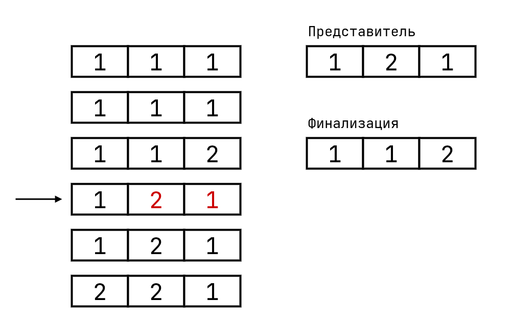

Когда мы рассматривали логику для 1 группы (т.е. только 1 группировка из 3-х атрибутов), то, натыкаясь на этот кортеж, финализировали группу `112` и начинали группу `121`. Но представим, что мы обрабатываем 2 GROUPING SET'а - `ab` и `abc`. То есть появляется еще один GS размером 2. Если мы возьмем состояние для GS 3 и как-бы вычернем ненужный 3-й атрибут, то увидим, что мы получили валидное состояние для GS размером 2.

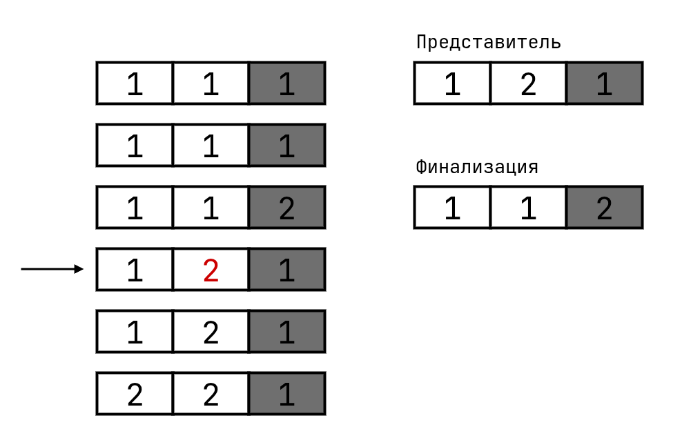

Но если мы вычеркнем еще и 2-й атрибут, то увидим, что для него время еще не настало и группу завершать не нужно. При этом мы получили последовательность, в которой ни один атрибут не поменялся.

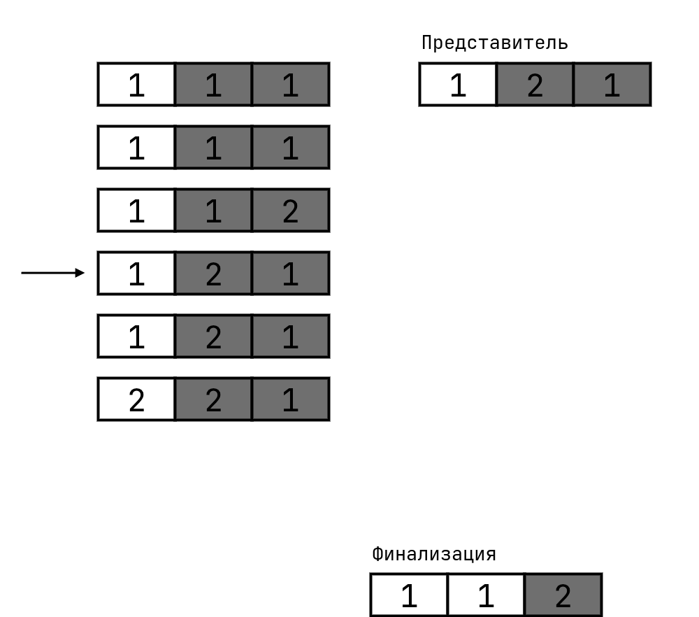

При всем этом заметьте, что представитель хранится только 1, т.к. для префиксов (групп) где ничего не поменялось, префикс самого представителя не поменяется, а там, где атрибут менялся (и надо обновить представителя), его префикс отражал изменения. То есть мы можем хранить только 1 копию представителя и обрабатывать только какой-то его префикс в зависимости от текущей группы.

В этом и заключается идея - когда мы доходим до кортежа неравного представителю, то финализируем все группы, у которых поменялся хотя бы 1 атрибут. Или что то же самое - при изменении атрибута под номером N мы финализируем все группы размером не меньше N.

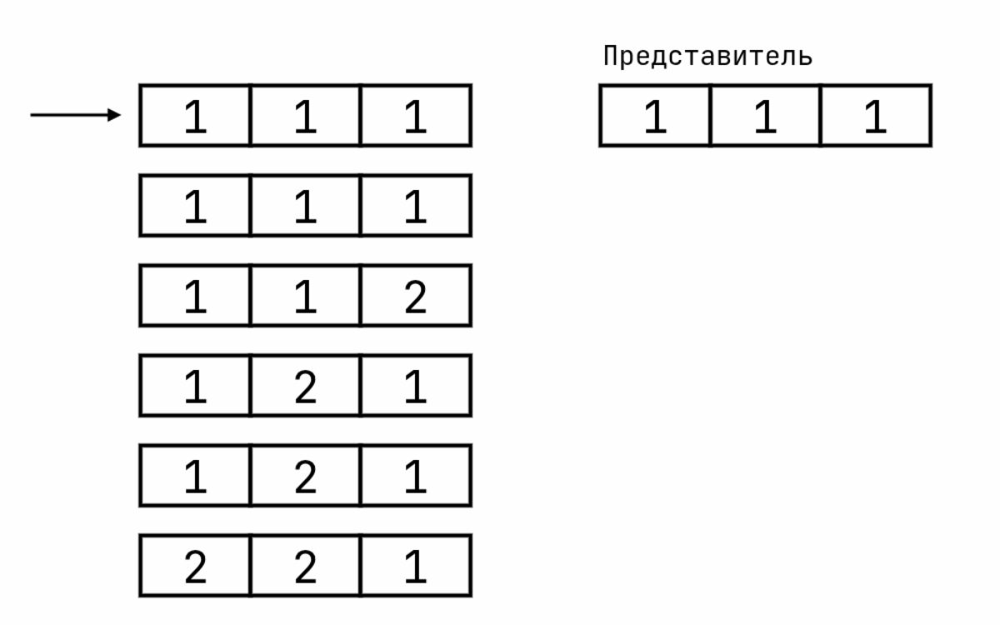

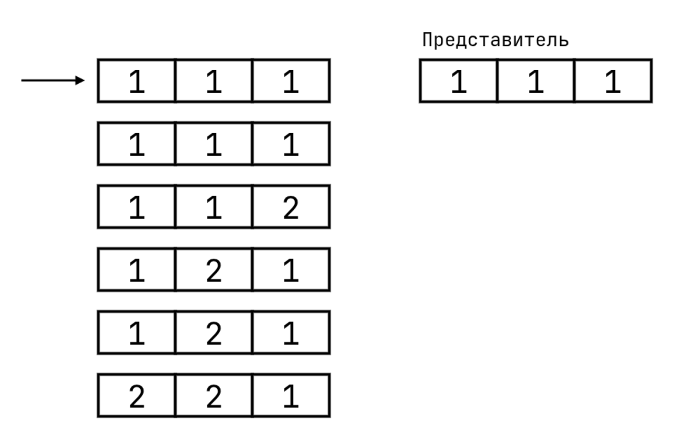

Проверить равенства кортежей (очередного и представителя) мы можем простым сравнением, как и раньше, когда находили неравные кортежи, но теперь нам придется сравнивать префиксы разных размеров. Равенство мы выполняем с помощью скомпилированных выражений, и внутрь лезть нам нельзя, поэтому поступаем проще: для каждого возможного размера GS мы компилируем свою функцию проверки, которая будет проверять необходимые ей атрибуты.

<spoiler title="Создание функций проверки равенства">

```c++
/* https://github.com/postgres/postgres/blob/REL_18_3/src/backend/executor/nodeAgg.c#L3605 */
static void ExecInitAgg(Agg *node, EState *estate, int eflags)
{

   /* for each grouping set */
   for (int k = 0; k < phasedata->numsets; k++)
   {
      int length = phasedata->gset_lengths[k];

      /* nothing to do for empty grouping set */
      if (length == 0)
         continue;

      /* if we already had one of this length, it'll do */
      if (phasedata->eqfunctions[length - 1] != NULL)
         continue;

      phasedata->eqfunctions[length - 1] =
         execTuplesMatchPrepare(scanDesc, length,
                                aggnode->grpColIdx,
                                aggnode->grpOperators,
                                aggnode->grpCollations,
                                (PlanState *) aggstate);
   }
}

/* https://github.com/postgres/postgres/blob/REL_18_3/src/backend/executor/execGrouping.c#L58 */
ExprState *execTuplesMatchPrepare(TupleDesc desc, int numCols,
                                  const AttrNumber *keyColIdx,
                                  const Oid *eqOperators,
                                  const Oid *collations,
                                  PlanState *parent)
{
   Oid          *eqFunctions;
   int           i;
   ExprState    *expr;

   if (numCols == 0)
      return NULL;

   eqFunctions = (Oid *) palloc(numCols * sizeof(Oid));

   /* lookup equality functions */
   for (i = 0; i < numCols; i++)
      eqFunctions[i] = get_opcode(eqOperators[i]);

   /* build actual expression */
   expr = ExecBuildGroupingEqual(desc, desc, NULL, NULL,
                                 numCols, keyColIdx, eqFunctions, collations,
                                 parent);

   return expr;
}
```

</spoiler>

Все, что требуется, - найти подобные структуры ROLLUP, но это задача планировщика, здесь о нем мы не говорим. Если хотите, можете сами выполнить запрос ниже и увидеть, что планировщик справляется с задачей.

```sql
SELECT a, b, c FROM tbl GROUP BY GROUPING SETS (
   (c, b, a),
   (b, a),
   (a)
);

        QUERY PLAN
-------------------------------
 GroupAggregate
   Group Key: a, b, c
   Group Key: a, b
   Group Key: a
   ->  Sort
         Sort Key: a, b, c
         ->  Seq Scan on tbl
(7 rows)
```

За стратегию сортировки отвечает все та же функция `agg_retrieve_direct`, и если посмотрим внутрь еще раз, то в том цикле обработки кортежей мы ничего о GROUPING SETS не найдем - ни обнаружение их границ, ни даже сравнение префиксов (кортежи всегда сравниваем полностью).

Дело в том, что наша модель выполнения итераторная, т.е. мы должны возвращать по 1 кортежу за раз, но, когда мы доходим до неравного кортежа, то, возможно, придется финализировать несколько групп. Нам ничего не остается, кроме как отслеживать на каком GS мы остановились, и проверять при следующем вызове, не нужно ли нам финализировать еще одну группу.

А для того, чтобы сильно не усложнять код для базового, самого частого случая (без `GROUPING SETS`), финализацию мы проводим от самого большого GS к самому маленькому, т.е. в самом цикле обработки входа всегда обрабатываем самую большую группу (ее размер нам известен - это количество столбцов группировки), а затем на следующем вызове перейдем к GS меньшего размера.

Если мы запустим запрос из примера выше (с 3 GS), то получим следующий вывод:

```sql
SELECT a, b, c FROM tbl GROUP BY GROUPING SETS((a, b, c), (a, b), (a));

 a | b | c 
---+---+---
 1 | 1 | 1
 1 | 1 | 2
 1 | 1 |  
 1 | 2 | 1
 1 | 2 |  
 1 |   |  
 2 | 2 | 1
 2 | 2 |  
 2 |   |  
(9 rows)
```

Если посмотрите на пример выше (с обработкой 3-х GS), то заметите, что вывод мы получили в той же самой последовательности - когда встречаем неравный кортеж финализируем в убывающем порядке по размеру GS.

> Теперь можно понять, почему группы в выводе идут пилообразно

Код (цикл) ранее работал со входом и предполагал, что мы должны начать новую группу, но сейчас нет - мы должны финализировать все оставшиеся группы. Этот код лежит за пределами цикла, и вообще, эту функцию можно поделить на 2 части:

1. Обработка новой группы (читаем кортежи из входа)
2. Финализация очередных GS (из предыдущего выполнения)

Поэтому здесь у нас `if`/`else` в начале. Если есть GS на очереди, то проверяем их.

```c++
/* https://github.com/postgres/postgres/blob/REL_18_3/src/backend/executor/nodeAgg.c#L2422 */
static TupleTableSlot *agg_retrieve_direct(AggState *aggstate)
{
   if (node->aggstrategy != AGG_PLAIN &&
       aggstate->projected_set != -1 &&
       aggstate->projected_set < (numGroupingSets - 1) &&
       /* Сравнение нового кортежа с представителем */
       !ExecQualAndReset(aggstate->phase->eqfunctions[nextSetSize - 1], tmpcontext))
   {
       /* Переходим к очередному GS */
       aggstate->projected_set += 1;
   }
   else
   {
       /* Обработка новой группы из входа */
       aggstate->projected_set = 0;

       /* ... тут код ... */
   }

   /* Финализация группы */
   select_current_set(aggstate, aggstate->projected_set, false);
   finalize_aggregates(aggstate, peragg, pergroups);
}
```

Вот таким образом мы обрабатываем `ROLLUP` за 1 проход в потоке. И именно `ROLLUP`! Не забываем, что мы должны научиться обрабатывать самые разные GS. Но невозможного от нас никто не требует - нельзя за 1 раз отсортировать по разным атрибутам. Например, в этом запросе нам придется выполнить дополнительную явную сортировку атрибута `c`.

```sql
SELECT a, b, c FROM tbl GROUP BY GROUPING SETS (
   (b, a),
   (a),
   (c)
);

          QUERY PLAN
--------------------------------
 GroupAggregate
   Group Key: a, b
   Group Key: a
   Sort Key: c
     Group Key: c
   ->  Sort
         Sort Key: a, b
         ->  Seq Scan on tbl 
(8 rows)
```

Тут мы поступаем хитрее, чем просто добавляем сортировку в `agg_retrieve_direct` - мы идем на уровень архитектуры и добавляем такое понятие, как "фаза" (phase). Все выполнение делится на последовательность фаз, и внутри каждой фазы находятся все группировки, которые мы можем обработать *одновременно*. В случае сортировки, внутри каждой фазы будет ROLLUP.

Каждая фаза представляется структурой `AggStatePerPhase`, и в ней хранятся все данные, специфичные для конкретной фазы. Например, в каждой фазе обрабатываются разные наборы GS - храним информацию, по каким атрибутам идет группировка. Также ранее мы увидели, что используются разные версии выражений для вызова функций перехода - эти функции хранятся здесь.

<spoiler title="AggStatePerPhaseData">

```c++
/* https://github.com/postgres/postgres/blob/REL_18_3/src/include/executor/nodeAgg.h#L280 */
typedef struct AggStatePerPhaseData
{
   AggStrategy aggstrategy;    /* strategy for this phase */
    int            numsets;           /* number of grouping sets (or 0) */
    int           *gset_lengths;    /* lengths of grouping sets */
    Bitmapset **grouped_cols;    /* column groupings for rollup */
    ExprState **eqfunctions;    /* expression returning equality, indexed by
                                       * nr of cols to compare */
    Agg           *aggnode;        /* Agg node for phase data */
    Sort          *sortnode;        /* Sort node for input ordering for phase */

    ExprState  *evaltrans;        /* evaluation of transition functions  */

    /*----------
     * Cached variants of the compiled expression.
     * first subscript: 0: outerops; 1: TTSOpsMinimalTuple
     * second subscript: 0: no NULL check; 1: with NULL check
     *----------
     */
    ExprState  *evaltrans_cache[2][2];
} AggStatePerPhaseData;
```

</spoiler>

Для того, чтобы передавать кортежи между фазами, используются 2 очереди: `sort_in` и `sort_out`. Если какой-то фазе нужно передать кортеж следующей фазе, то она кладет кортежи в `sort_out`. При переходе к следующей фазе выполняется сортировка, и они (кортежи) кладутся в `sort_in`, из которой читает следующая фаза.

Лучше понять эту архитектуру поможет эта схема:

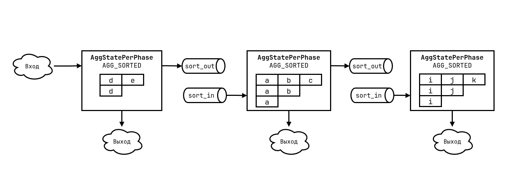

Она отображает обработку такого запроса:

```sql
SELECT a, b, c, d, e, i, j, k FROM tbl
   GROUP BY GROUPING SETS(
      ROLLUP(a, b, c), ROLLUP(d, e), ROLLUP(i, j, k)
   );

         QUERY PLAN         
----------------------------
 GroupAggregate
   Group Key: d, e
   Group Key: d
   Group Key: ()
   Group Key: ()
   Group Key: ()
   Sort Key: a, b, c
     Group Key: a, b, c
     Group Key: a, b
     Group Key: a
   Sort Key: i, j, k
     Group Key: i, j, k
     Group Key: i, j
     Group Key: i
   ->  Sort
         Sort Key: d, e
         ->  Seq Scan on tt
(17 rows)
```

<spoiler title="Особенности плоской группировки">

Запрос в примере использует множество явных `ROLLUP`, вместо множества `GROUPING SETS`, и этот самый ROLLUP порождает множество плоских группировок. Причем можете заметить - все пустые группы находятся в первой фазе.

Это небольшая деталь реализации - планировщик всегда выносит все плоские группировки в первый узел, где бы они ни находились. Почему это происходит сказать сложно - можно выделить множество причин. Можно сказать, что это оптимизация - результат всех этих группировок будет одинаковым, поэтому мы могли бы хранить для них только одно состояние, а затем скопировать (по аналогии с разделением trans/agg в агрегатах).

Но я все же склоняюсь к варианту деталей реализации. Для того, чтобы найти все возможные `ROLLUP`, нам необходимо создать плоский список всех группировок, а затем выполнять поиск по ним. За создание плоского массива этих группировок отвечает `expand_grouping_sets`, и последним его этапом является сортировка GS по размеру:

```c++
/* https://github.com/postgres/postgres/blob/REL_18_3/src/backend/parser/parse_agg.c#L2007 */
List *expand_grouping_sets(List *groupingSets, bool groupDistinct, int limit)
{
   /* плоский список всех GS */
   List *result;

   /* ... */

    if (!groupDistinct || list_length(result) < 2)
        list_sort(result, cmp_list_len_asc);

   return result;
}
```

Но когда мы сделаем это преобразование, то потеряем связь между разными элементами, и они станут равноценными. Когда же наступает момент создания `ROLLUP` из плоского массива GS, то эти пустые группировки надо куда-то вставить - кладем их в первый `ROLLUP`. Это происходит в `extract_rollup_sets`:

```c++
/* https://github.com/postgres/postgres/blob/REL_18_3/src/backend/optimizer/plan/planner.c#L2924 */
static List *
extract_rollup_sets(List *groupingSets)
{
    /*
     * Start by stripping out empty sets.  The algorithm doesn't require this,
     * but the planner currently needs all empty sets to be returned in the
     * first list, so we strip them here and add them back after.
     */
    while (lc1 && lfirst(lc1) == NIL)
    {
        ++num_empty;
        lc1 = lnext(groupingSets, lc1);
    }
    /* ... */
   
    /* push any empty sets back on the first list. */
    while (num_empty-- > 0)
        results[1] = lcons(NIL, results[1]);
}
```

Ну а если мы еще покопаемся, то заметим, что плоская группировка поддерживается только кодом сортировки.

> Почти для всех примеров сортировки выше я специально выключал `enable_hashagg`, т.к. хеширование очень часто эффективнее, но даже так, если была плоская группировка, то появлялся `Group Key` - использовалась стратегия сортировки без этой самой сортировки.

</spoiler>

Последняя деталь этого пазла - передача кортежей между фазами. Тут мы еще раз возвращаемся в самое начало - `fetch_input_tuple`.

```c++
/* https://github.com/postgres/postgres/blob/REL_18_3/src/backend/executor/nodeAgg.c#L549 */
static TupleTableSlot *
fetch_input_tuple(AggState *aggstate)
{
    TupleTableSlot *slot;

    if (aggstate->sort_in)
    {
        if (!tuplesort_gettupleslot(aggstate->sort_in, true, false,
                                    aggstate->sort_slot, NULL))
            return NULL;
        slot = aggstate->sort_slot;
    }
    else
        slot = ExecProcNode(outerPlanState(aggstate));

    if (!TupIsNull(slot) && aggstate->sort_out)
        tuplesort_puttupleslot(aggstate->sort_out, slot);

    return slot;
}

```

По середине мы видим вызов `ExecProcNode` - это функция, которая "вызывает" подузел и получает кортеж из него, а вот за эти самые очереди отвечает код вокруг.

> Опять я позволил себе допущение - назвал эти объекты/поля очередями. На самом деле эти "очереди" реализуются (нижележащий объект) с помощью сортировки - объект `Tuplesortstate`. Он нам подходит идеально, т.к. нам нужны не столько очереди, сколько возможность все кортежи отсортировать, даже то, что уже сброшено на диск.

Когда на очередной фазе заканчивается вход, то мы должны инициализировать новую фазу. Это делается в функции `initialize_phase`, и основная ее задача - выполнение сортировки сброшенных кортежей:

```c++
/* https://github.com/postgres/postgres/blob/REL_18_3/src/backend/executor/nodeAgg.c#L479 */
static void
initialize_phase(AggState *aggstate, int newphase)
{
   /* Вход текущей фазы закончился - очищаем место */
   if (aggstate->sort_in)
   {
      tuplesort_end(aggstate->sort_in);
      aggstate->sort_in = NULL;
   }

   /* Меняем местами sort_in и sort_out и выполнеяем сортировку */
   aggstate->sort_in = aggstate->sort_out;
   aggstate->sort_out = NULL;
   tuplesort_performsort(aggstate->sort_in);

   /* Инициализируем выходную очередь для следующей фазы */
   if (newphase > 0 && newphase < aggstate->numphases - 1)
   {
      Sort       *sortnode = aggstate->phases[newphase + 1].sortnode;
      PlanState  *outerNode = outerPlanState(aggstate);
      TupleDesc    tupDesc = ExecGetResultType(outerNode);

      aggstate->sort_out = tuplesort_begin_heap(tupDesc,
                                                sortnode->numCols,
                                                sortnode->sortColIdx,
                                                sortnode->sortOperators,
                                                sortnode->collations,
                                                sortnode->nullsFirst,
                                                work_mem,
                                                NULL, TUPLESORT_NONE);
   }

   aggstate->current_phase = newphase;
   aggstate->phase = &aggstate->phases[newphase];
}
```

### MixedAggregate

Теперь мы знаем, как можно обработать несколько GROUPING SETS сортировкой ИЛИ хешированием, но мы не знаем, как комбинировать их вместе.

Для этого была придумана стратегия MixedAggregate. Ее идея в том, что мы можем объединить в 1 узле плана и хеширование, и сортировку, причем для *каждого GS в отдельности* будем выбирать его эффективную реализацию.

Если мы посмотрим на план этого запроса, то увидим, что она из себя представляет.

```sql
SELECT a, b from tbl3 group by cube(a, b);

                   QUERY PLAN
----------------------------------------------------
 MixedAggregate
   Hash Key: b
   Group Key: a, b
   Group Key: a
   Group Key: ()
   ->  Index Only Scan using tbl3_a_b_idx on tbl3
(6 rows)
```

Планировщик увидел, что у нас уже есть индекс с нужной сортировкой, но для последнего GS он решил использовать хеширование.

Вместо ответа на вопрос "как скомбинируем вместе" ответим на другой, тоже важный - как представим хеширование в архитектуре фаз? В определении (и которое я дал и в комментариях в коде) сказано: внутри фазы находятся все GS, которые мы можем обработать за 1 проход. Но хеширование может обработать любые GS за 1 проход! Поэтому для него мы всегда используем единственную фазу.

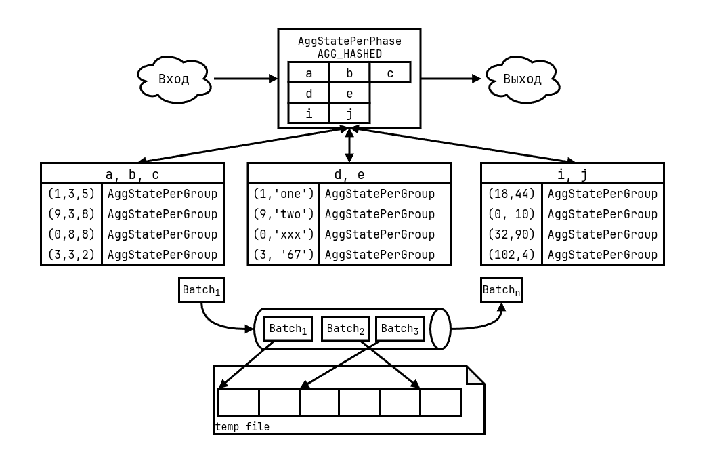

Теперь, перефразируем предыдущий вопрос так: куда мы вставим эту фазу хеширования в пайплайн обработки?

В начало не вариант, так как на вход могут подаваться уже (возможно, тривиально, из индекса) отсортированные данные, поэтому нам придется выполнять сортировку еще раз. Куда-то в между фазами сортировки тоже не лучшая затея, так как все передается через сортировку, а хешированию она не нужна.

Мы делаем ход конем. Вспомните, что обработка хеширования работает в 2 этапа - изначальное заполнение и обработка. Мы снова используем это.

В самом начале мы будем располагать все фазы сортировки, как описывалось ранее, а фазу хеширования располагаем последней. Но при этом *на первой фазе сортировки будем заполнять хеш-таблицу* (пока не обрабатываем, только заполняем), а когда закончим все фазы сортировки, то перейдем к хешированию. А так как таблица уже заполнена, то можем приступать сразу к обработке.

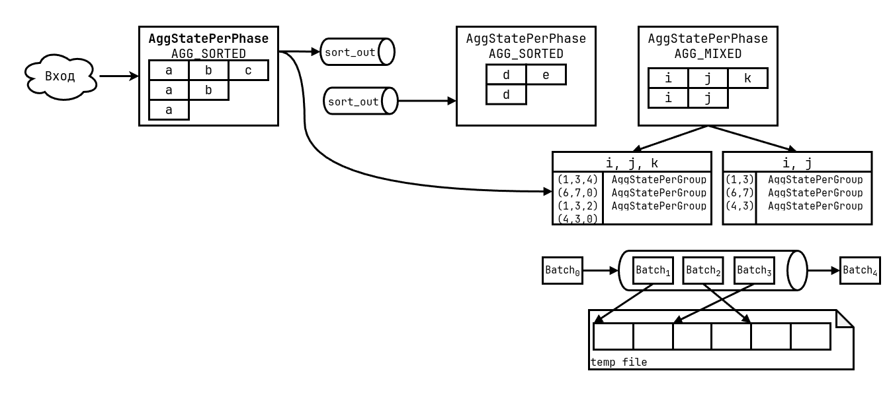

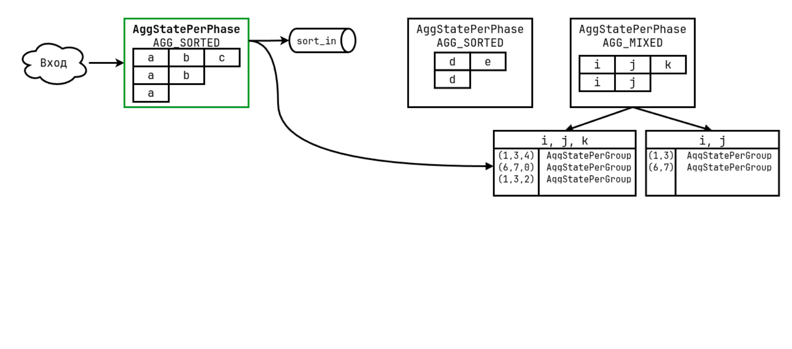

Для реализации этого "хака" сделано 2 вещи.

Первое, в код сортировки добавлено такое вкрапление хеширования - уже известная нам функция `lookup_hash_entries`:

```c++
/* https://github.com/postgres/postgres/blob/REL_18_3/src/backend/executor/nodeAgg.c#L2533 */
static TupleTableSlot *
agg_retrieve_direct(AggState *aggstate)
{
   outerslot = fetch_input_tuple(aggstate);
   initialize_aggregates(aggstate);

   for (;;)
   {      
      /*
       * During phase 1 only of a mixed agg, we need to update
       * hashtables as well in advance_aggregates.
       */
      if (aggstate->aggstrategy == AGG_MIXED &&
          aggstate->current_phase == 1)
      {
         lookup_hash_entries(aggstate);
      }
      
      /* ... */
   }
}
```

Должно быть понятно, что этот код делает, но может возникнуть вопрос - почему `current_phase == 1`? Потому что фаза 0 специально выделена под хеширование, даже в массиве фаз индекс 0 всегда выделен под хеширование, даже если хеширование не используется.

Когда же мы дойдем до последней фазы, то от нее (под номером N) мы перескочим на 0 фазу:

```c++
/* https://github.com/postgres/postgres/blob/REL_18_3/src/backend/executor/nodeAgg.c#L2361 */
static TupleTableSlot *
agg_retrieve_direct(AggState *aggstate)
{
   /*
    * Check if input is complete and there are no more groups to project
    * in this phase; move to next phase or mark as done.
    */
   if (aggstate->input_done == true &&
       aggstate->projected_set >= (numGroupingSets - 1))
   {
      if (aggstate->current_phase < aggstate->numphases - 1)
      {
         /* Переход на следующую фазу сортировки */
      }
      else if (aggstate->aggstrategy == AGG_MIXED)
      {
         /*
          * Mixed mode; we've output all the grouped stuff and have
          * full hashtables, so switch to outputting those.
          */
         initialize_phase(aggstate, 0);
         /* ... */
         return agg_retrieve_hash_table(aggstate);
      }
      else
      {
         aggstate->agg_done = true;
         break;
      }
   }
   /* ... */
}
```

На следующем вызове узла группировки мы должны будем выполнить хеширование, а не сортировку, поэтому в реальности в `ExecAgg` мы выполняем не глобальную стратегию, а стратегию текущей фазы:

```c++
/* https://github.com/postgres/postgres/blob/REL_18_3/src/backend/executor/nodeAgg.c#L2254 */
static TupleTableSlot *
ExecAgg(PlanState *pstate)
{
    AggState       *node = castNode(AggState, pstate);
    TupleTableSlot *result = NULL;

    if (!node->agg_done)
    {
      /* Используем стратегию фазы, а не глобальную */
        switch (node->phase->aggstrategy)
        {
            case AGG_HASHED:
                if (!node->table_filled)
                    agg_fill_hash_table(node);
                /* FALLTHROUGH */
            case AGG_MIXED:
                result = agg_retrieve_hash_table(node);
                break;
            case AGG_PLAIN:
            case AGG_SORTED:
                result = agg_retrieve_direct(node);
                break;
        }

        if (!TupIsNull(result))
            return result;
    }

    return NULL;
}

```

## Оставшееся за кадром

Мы разобрали общую архитектуру и логику работы группировки и агрегации, но есть пара моментов, которая не вошла, но будет полезна/интересна.

### Частичная агрегация

Наряду с функцией перехода (`transfn`) у агрегата может быть функция объединения (`combinefn`). Ее идея в том, что на вход мы можем подать не конкретное значение для агрегата, а другое состояние, как бы применяя множество значений за раз вместо одного.

Чаще всего мы это можем увидеть при параллелизации с партиционированными таблицами, как в запросе ниже:

```sql
SELECT a, sum(b) FROM pagg_tab GROUP BY a;

                          QUERY PLAN                          
-------------------------------------------------------
Finalize HashAggregate
   Group Key: pagg_tab.a
   ->  Append
         ->  Partial HashAggregate
               Group Key: pagg_tab.a
               ->  Seq Scan on pagg_tab_p1 pagg_tab
         ->  Partial HashAggregate
               Group Key: pagg_tab_1.a
               ->  Seq Scan on pagg_tab_p2 pagg_tab_1
         ->  Partial HashAggregate
               Group Key: pagg_tab_2.a
               ->  Seq Scan on pagg_tab_p3 pagg_tab_2
```

В случае использования частичных агрегатов в плане появляются узлы группировки с префиксами `Partial` и `Finalize`. Их идея в следующем: `Partial` узлы *не* финализируют агрегат и передают выше само состояние, а `Finalize` узел уже получает само состояние и вызывает функцию объединения (вместо перехода) и сам финализатор.

Самое удивительное, что вся эта магия творится *только на этапе инициализации*. Во время выполнения узлов никаких таких особенных проверок нет. Почему?

Если мы посмотрим на сам код, то заметим, что код группировки ничего не знает о типах или сигнатурах функций. Он работает так: читает (загружает) атрибут из кортежа и передает функции с сигнатурой `AggStatePerGroup FUNCTION(AggStatePerGroup, Datum args...)`.

`Datum` - это само значение, и его можно рассматривать как `void *`. То есть для всего кода он непрозрачен, и только целевой код знает как его интерпретировать. В таком случае, нам в реальности без разницы, что читать из кортежа - конкретное значение или другое состояние агрегата, просто загружаем какой-то атрибут из кортежа. То есть если мы просто подменим вызываемую функцию, то для нас (группировки) ничего не изменится - действия останутся теми же самыми.Инициализация узла происходит в функции `ExecInitAgg`, и что делать в каждом случае мы обговорили.

Для `Finalize` мы подменяем функцию перехода на объединения.

```c++
/* https://github.com/postgres/postgres/blob/REL_18_3/src/backend/executor/nodeAgg.c#L3948 */
AggState *
ExecInitAgg(Agg *node, EState *estate, int eflags)
{
   ListCell *lc;
   
   foreach(l, aggstate->aggs)
   {
      Oid transfn_oid;

      /*
       * If this aggregation is performing state combines, then instead
       * of using the transition function, we'll use the combine
       * function.
       */
      if (DO_AGGSPLIT_COMBINE(aggstate->aggsplit))
      {
         transfn_oid = aggform->aggcombinefn;

         /* If not set then the planner messed up */
         if (!OidIsValid(transfn_oid))
            elog(ERROR, "combinefn not set for aggregate function");
      }
      else
         transfn_oid = aggform->aggtransfn;

      /* ... */

      /* aggcombinefn always has two arguments of aggtranstype */
      build_pertrans_for_aggref(pertrans, aggstate, estate,
                                aggref, transfn_oid, aggtranstype,
                                serialfn_oid, deserialfn_oid,
                                initValue, initValueIsNull,
                                combineFnInputTypes, 2);
   }
}
```

Для `Partial` нам не нужно вызывать финализатор, поэтому просто удаляем его.

```c++
/* https://github.com/postgres/postgres/blob/REL_18_3/src/backend/executor/nodeAgg.c#L3806 */
AggState *
ExecInitAgg(Agg *node, EState *estate, int eflags)
{
   ListCell *lc;
   
   foreach(l, aggstate->aggs)
   {
      AggStatePerAgg peragg;

        /* Final function only required if we're finalizing the aggregates */
        if (DO_AGGSPLIT_SKIPFINAL(aggstate->aggsplit))
            peragg->finalfn_oid = finalfn_oid = InvalidOid;
        else
            peragg->finalfn_oid = finalfn_oid = aggform->aggfinalfn;

        /* Компилируем, только если есть финализатор */
        if (OidIsValid(finalfn_oid))
        {
            build_aggregate_finalfn_expr(aggTransFnInputTypes,
                                      peragg->numFinalArgs,
                                      aggtranstype,
                                      aggref->aggtype,
                                      aggref->inputcollid,
                                      finalfn_oid,
                                      &finalfnexpr);
            fmgr_info(finalfn_oid, &peragg->finalfn);
            fmgr_info_set_expr((Node *) finalfnexpr, &peragg->finalfn);
        }
   }
}
```

<spoiler title="Как различают Partial, Finalize и обычные узлы в коде">

Как уже могли заметить, чтобы различать тип узла используется поле `aggstate->aggsplit`. Это перечисление с битовыми полями:

```c++
/* https://github.com/postgres/postgres/blob/REL_18_3/src/include/nodes/nodes.h#L374 */

/* Primitive options supported by nodeAgg.c: */
#define AGGSPLITOP_COMBINE        0x01    /* substitute combinefn for transfn */
#define AGGSPLITOP_SKIPFINAL    0x02    /* skip finalfn, return state as-is */
#define AGGSPLITOP_SERIALIZE    0x04    /* apply serialfn to output */
#define AGGSPLITOP_DESERIALIZE    0x08    /* apply deserialfn to input */

/* Supported operating modes (i.e., useful combinations of these options): */
typedef enum AggSplit
{
    /* Basic, non-split aggregation: */
    AGGSPLIT_SIMPLE = 0,
    /* Initial phase of partial aggregation, with serialization: */
    AGGSPLIT_INITIAL_SERIAL = AGGSPLITOP_SKIPFINAL | AGGSPLITOP_SERIALIZE,
    /* Final phase of partial aggregation, with deserialization: */
    AGGSPLIT_FINAL_DESERIAL = AGGSPLITOP_COMBINE | AGGSPLITOP_DESERIALIZE,
} AggSplit;

/* Test whether an AggSplit value selects each primitive option: */
#define DO_AGGSPLIT_COMBINE(as)        (((as) & AGGSPLITOP_COMBINE) != 0)
#define DO_AGGSPLIT_SKIPFINAL(as)    (((as) & AGGSPLITOP_SKIPFINAL) != 0)
#define DO_AGGSPLIT_SERIALIZE(as)    (((as) & AGGSPLITOP_SERIALIZE) != 0)
#define DO_AGGSPLIT_DESERIALIZE(as) (((as) & AGGSPLITOP_DESERIALIZE) != 0)
```

В этом поле хранится перечисление `AggSplit`, но каждое значение - это битовая маска макросов выше. Из них 2 мы уже рассмотрели - COMBINE и SKIPFINAL, но осталось еще 2. Они отвечают за необходимость выполнения сериализации/десериализации значений. Это нужно для того, чтобы мы могли передавать состояние между разными процессами (при параллельном выполнении).

Таким образом, комбинируя эти 4 флага, мы и получаем 3 разных типа узла, которые описываются этими перечислениями: `SIMPLE` - обычный узел, `INITIAL_SERIAL` - Partial, `FINAL_DESERIAL` - Finalize.

</spoiler>

### ORDERED SET/DISTINCT агрегаты

Вторая вещь - это особый класс агрегатных функций, ordered-set aggregate.

> Есть еще hypothetical-set aggregate, но они то же самое, поэтому в одну кладу в одну топку

Их отличительная деталь в том, что для вычисления им нужно получить отсортированный вход. Например, моду (`mode`) нельзя вычислить в потоке, нужно знать всю выборку.

```sql
SELECT a, mode() WITHIN GROUP (ORDER BY b) FROM tbl GROUP BY a;

         QUERY PLAN
------------------------------
 GroupAggregate
   Group Key: a
   ->  Sort
         Sort Key: a
         ->  Seq Scan on tbl
```

Как вы заметили, в стратегии хеширования мы одновременно обрабатываем все увиденные группы, не как сортировка по одной. Из-за этого мы должны отслеживать переполнение памяти. Но если мы наивно для каждой группы будем хранить ее массив кортежей, то возникнут 2 проблемы:

1. Переполнение надо будет проверять *после каждого кортежа*, а не только при создании новой группы, так как этот кортеж легко может быть записан в этот массив, а значит, выделена память.

2. Хранение указателя на сам массив. Размер всего структуры состояния агрегата (`AggStatePerGroup`) 10 байт, но еще один указатель добавит 8 байт, то есть в хеш-таблице мы сможем хранить *почти в 2 раза меньше элементов*, хотя подавляющая часть агрегатов этого не требует.

Проблем мы получаем целую кучу, поэтому принято решение для ORDRED SET агрегатов *не* использовать хеширование, т.е. доступна только сортировка.

И с ней все гораздо проще, так как одновременно мы обрабатываем по 1 группе в каждом GS. Тогда обработку можно представить так:

1. По началу новой группы инициализируем массивы для каждого OS агрегата
2. Для каждого кортежа также вызываем `advance_aggregates`, но теперь, вместо вызова функции перехода сохраняем кортеж в ассоциированный массив
3. При финализации сортируем этот массив и передаем уже отсортированную последовательность функции перехода, а в конце вызываем и сам финализатор

<spoiler title="Обработка ORDERED SET агрегатов">

Здесь мне нравится то, что изменения мы должны сделать только для функций, работающих с агрегатами - саму логику группировки не трогаем.

Также еще замечание: в коде есть 2 версии логики - для одного значения (один `Datum`) и для кортежа. Это чисто техническое разделение - кортеж нужен, чтобы хранить и обрабатывать несколько атрибутов/значений (что подается на вход функции перехода). Например, `tuplesort_begin_datum` - инициализация для одного значения, а `tuplesort_begin_heap` - для кортежа (нескольких значений).

```c++
/* Инициализация */

/* https://github.com/postgres/postgres/blob/REL_18_3/src/backend/executor/nodeAgg.c#L586 */
static void
initialize_aggregate(AggState *aggstate, AggStatePerTrans pertrans, AggStatePerGroup pergroupstate)
{
   /* Инициализируем состояние для сортировки */
    if (pertrans->aggsortrequired)
    {
        if (pertrans->sortstates[aggstate->current_set])
            tuplesort_end(pertrans->sortstates[aggstate->current_set]);

        if (pertrans->numInputs == 1)
        {
            Form_pg_attribute attr = TupleDescAttr(pertrans->sortdesc, 0);

            pertrans->sortstates[aggstate->current_set] =
                tuplesort_begin_datum(attr->atttypid,
                                      pertrans->sortOperators[0],
                                      pertrans->sortCollations[0],
                                      pertrans->sortNullsFirst[0],
                                      work_mem, NULL, TUPLESORT_NONE);
        }
        else
            pertrans->sortstates[aggstate->current_set] =
                tuplesort_begin_heap(pertrans->sortdesc,
                                     pertrans->numSortCols,
                                     pertrans->sortColIdx,
                                     pertrans->sortOperators,
                                     pertrans->sortCollations,
                                     pertrans->sortNullsFirst,
                                     work_mem, NULL, TUPLESORT_NONE);
    }
   
   /* Копирование полей из AggStatePerTrans в AggStatePerGroup */
}

/* Скомпилированное выражение advance_aggregates */

/* https://github.com/postgres/postgres/blob/REL_18_3/src/backend/executor/execExprInterp.c#L2251 */
static Datum ExecInterpExpr(ExprState *state, ExprContext *econtext, bool *isnull)
{
   EEO_SWITCH()
   {
        /* ... */
        EEO_CASE(EEOP_AGG_ORDERED_TRANS_DATUM)
        {
            ExecEvalAggOrderedTransDatum(state, op, econtext);
            EEO_NEXT();
        }

        EEO_CASE(EEOP_AGG_ORDERED_TRANS_TUPLE)
        {
            ExecEvalAggOrderedTransTuple(state, op, econtext);
            EEO_NEXT();
        }
      
        /* ... */
   }
}

/* https://github.com/postgres/postgres/blob/REL_18_3/src/backend/executor/execExprInterp.c#L5808 */
void ExecEvalAggOrderedTransDatum(ExprState *state, ExprEvalStep *op, ExprContext *econtext)
{
    AggStatePerTrans pertrans = op->d.agg_trans.pertrans;
    int            setno = op->d.agg_trans.setno;

    tuplesort_putdatum(pertrans->sortstates[setno], *op->resvalue, *op->resnull);
}

/* Финализация */

/* https://github.com/postgres/postgres/blob/REL_18_3/src/backend/executor/nodeAgg.c#L1306 */
static void finalize_aggregates(AggState *aggstate, AggStatePerAgg peraggs, AggStatePerGroup pergroup)
{
   /* Сортируем вход и вызываем функцию перехода для ORDERED SET агрегатов */
   for (int transno = 0; transno < aggstate->numtrans; transno++)
    {
        AggStatePerTrans pertrans = &aggstate->pertrans[transno];
        AggStatePerGroup pergroupstate = &pergroup[transno];

        if (pertrans->aggsortrequired)
        {
            if (pertrans->numInputs == 1)
                process_ordered_aggregate_single(aggstate, pertrans, pergroupstate);
            else
                process_ordered_aggregate_multi(aggstate, pertrans, pergroupstate);
        }
    }
   
    /* Вызываем сам финализатор */
    for (aggno = 0; aggno < aggstate->numaggs; aggno++)
    {
        AggStatePerAgg peragg = &peraggs[aggno];
        int            transno = peragg->transno;
        AggStatePerGroup pergroupstate = &pergroup[transno];

        finalize_aggregate(aggstate, peragg, pergroupstate,
                           &aggvalues[aggno], &aggnulls[aggno]);
    }
}

/* https://github.com/postgres/postgres/blob/REL_18_3/src/backend/executor/nodeAgg.c#L847 */
static void process_ordered_aggregate_single(AggState *aggstate,
                                             AggStatePerTrans pertrans,
                                             AggStatePerGroup pergroupstate)
{
    /* Выполняем сортировку */
    tuplesort_performsort(pertrans->sortstates[aggstate->current_set]);

    Datum newVal = &fcinfo->args[1].value;
    bool isNull = &fcinfo->args[1].isnull;

    /* Вызов функции перехода с уже отсортированным входом */
    while (tuplesort_getdatum(pertrans->sortstates[aggstate->current_set],
                              true, false, newVal, isNull, &newAbbrevVal))
    {
      advance_transition_function(aggstate, pertrans, pergroupstate);
    }

    tuplesort_end(pertrans->sortstates[aggstate->current_set]);
    pertrans->sortstates[aggstate->current_set] = NULL;
}
```

</spoiler>

Но это еще не все. Из названия секции вы поняли, что речь будет идти также и о `DISTINCT`. Он позволяет передавать функции перехода только уникальные значения. Например, `COUNT(DISTINCT a)` возвращает количество уникальных значений атрибута `a`. Получение уникальных значений и группировка - это одно и то же, а мы уже умеем группировать с помощью сортировки.

Поэтому, чтобы не писать огромное количество разного кода, `DISTINCT` и `ORDERED SET` объединяются и реализуются одним и тем же функционалом - если используется хотя бы что-то из них, то применяется сортировка.

```c++
static void
process_ordered_aggregate_single(AggState *aggstate,
                                 AggStatePerTrans pertrans,
                                 AggStatePerGroup pergroupstate)
{
    Datum        oldVal = (Datum) 0;
    bool         oldIsNull = true;
    bool         haveOldVal = false;
    bool         isDistinct = (pertrans->numDistinctCols > 0);
    Datum        newAbbrevVal = (Datum) 0;
    Datum        oldAbbrevVal = (Datum) 0;
    FunctionCallInfo fcinfo = pertrans->transfn_fcinfo;
    Datum       *newVal;
    bool        *isNull;

    tuplesort_performsort(pertrans->sortstates[aggstate->current_set]);

    newVal = &fcinfo->args[1].value;
    isNull = &fcinfo->args[1].isnull;

    while (tuplesort_getdatum(pertrans->sortstates[aggstate->current_set],
                                    true, false, newVal, isNull, &newAbbrevVal))
    {
        if (isDistinct &&
            haveOldVal &&
            ((oldIsNull && *isNull) ||
             (!oldIsNull && !*isNull &&
              oldAbbrevVal == newAbbrevVal &&
              DatumGetBool(FunctionCall2Coll(&pertrans->equalfnOne,
                                             pertrans->aggCollation,
                                             oldVal, *newVal)))))
        {
            /* Надено одинаковое значение - пропускаем */
            MemoryContextSwitchTo(oldContext);
            continue;
        }
        else
        {
            advance_transition_function(aggstate, pertrans, pergroupstate);
         
            /* Сохраняем состояние для проверки дубликата на следующей итерации */
            oldVal = *newVal;
            oldAbbrevVal = newAbbrevVal;
            oldIsNull = *isNull;
            haveOldVal = true;
        }
    }

    tuplesort_end(pertrans->sortstates[aggstate->current_set]);
    pertrans->sortstates[aggstate->current_set] = NULL;
}
```

И теперь вишенка на торте - оптимизация объединения состояний для OS агрегатов также работает.

В Postgres есть несколько встроенных ordered set агрегатов и интересно вот что - у всех них одинаковые начальное состояние и функция перехода:

```sql
SELECT aggfnoid, aggtransfn, agginitval FROM pg_aggregate WHERE aggkind = 'o';

          aggfnoid          |       aggtransfn       | agginitval 
----------------------------+------------------------+------------
 pg_catalog.percentile_disc | ordered_set_transition | 
 pg_catalog.percentile_cont | ordered_set_transition | 
 pg_catalog.percentile_cont | ordered_set_transition | 
 pg_catalog.percentile_disc | ordered_set_transition | 
 pg_catalog.percentile_cont | ordered_set_transition | 
 pg_catalog.percentile_cont | ordered_set_transition | 
 mode                       | ordered_set_transition | 
(7 rows)
```

Это значит, для расчета всех этих функций будет использоваться только 1 состояние, и в случае, когда в каждой группе имеется много кортежей, использование памяти будет ниже.

В этом запросе имеется 3 агрегата, но у всех одинаковое начальное состояние и функция перехода. Поэтому, когда мы запустим его...

```sql
SELECT b,
       mode() WITHIN GROUP (ORDER BY cast(a as double precision)),
       percentile_cont(0.7) WITHIN GROUP (ORDER BY cast(a as double precision)),
       percentile_disc(0.7) WITHIN GROUP (ORDER BY cast(a as double precision))
FROM tbl GROUP BY b;
```

...то увидим, что состояние хранится только 1 (numtrans), хотя агрегатов 3 (numaggs).

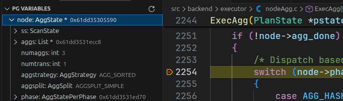

## Index Aggregate

Все это исследование прошло не из праздного любопытства. Во время чтения книги "More Modern B-tree techniques" (автор Грефе Гетц/Graefe Goetz) наткнулся на небольшую секцию про группировку и агрегацию. Она была основана на статье ["Efficient sorting, duplicate removal, grouping, and aggregation"](https://arxiv.org/pdf/2010.00152).

> В открытом доступе вы, скорее всего, найдете более старую версию "Modern B-tree techniques", но этой статьи там нет

### О чем статья

Суммаризуя статью, основная идея следующая - мы можем выполнить группировку и сортировку одновременно, если строить индекс на лету. Ключ индекса - атрибут группировки и сортировки, а значение - состояние агрегата.

Основные моменты реализации следующие:

- В качестве индекса мы используем [партиционированный B-tree индекс](https://www.cidrdb.org/cidr2003/program/p1.pdf)
- Мы используем общий пул буферов для хранения страниц этого индекса (по аналоги с postgres - `shared_buffers`)
- С помощью этого мы создаем отсортированные последовательности, которые сбрасываем на диск, а после сброса начинаем создавать новый индекс
- По завершении мы выполняем Wide merge - сливаем все последовательности в одну, т.е. выполняем merge, но эта версия более оптимизирована - у него гораздо больший fan-in, т.е. за раз он может обработать все последовательности, а не только некоторые (из-за ограничений памяти) с созданием промежуточных проходов.

> Кроме них были и другие, как, например, использовать дерево проигравших для определения следующего run (вместо приоритетной очереди) или использование offset-value coding.

Эта идея меня сильно вдохновила и долго не отпускала, и в какой-то момент я просто сел и начал реализовывать новую стратегию группировки.

### Проектирование

Первое, что пришло в голову, - сделать так, как написано в статье. Первую неделю я так и делал: "нужен партиционированный B-tree" - сел писать его, "нужен один wide merge" - напишем.

Но, поняв, какой большой объем работы предстоит, остановился, чтобы поразмышлять, и ко мне пришло понимание - большую часть его функционала практически нельзя (очень трудно) не реализовать в postgres. В частности, главная идея - использование партиционированного B-tree, который сбрасывает отсортированные последовательности на диск. Проблема здесь в том, что такой подход предполагает, что мы можем сохранить промежуточное состояние агрегата на диск.

При создании агрегата мы можем указать необязательные функции:

- сериализации и десериализации - для того, чтобы уметь передавать типы между бэкэндами, а также *сохранять на диск*
- объединения (combinefn) - для того, чтобы объединять результаты с помощью merge

Т.е. по факту, накладываем ограничение на агрегаты - они должны поддерживать возможность Partial/Finalize. Но эти функции необязательны, а значит их может не быть и тогда такой подход может не сработать. Так как решение оставалось за мной я решил задачу упростить и сделать подход похожим на хеширование - имеется структура данных в памяти, с которой мы работаем, (этот самый индекс), а при необходимости остальное сбрасываем на диск.

Осталось решить проблему со сбросом на диск. Мы и тут поступаем так же как и в хешировании - хешируем атрибуты группировки и используем несколько партиций. Используется та же самая идея - вычисляем размер партиции так, чтобы структура (индекс) полностью помещалась в памяти.

> Последнее отправленное письмо с патчами [в этом письме](https://www.postgresql.org/message-id/2b06b055-7f0d-42a7-ac0b-983ee92e239f%40tantorlabs.ru).

<spoiler title="Альтернативные варианты">

Я сразу описал финальный вариант реализации и не дал времени подумать над альтернативами. Это мы сделаем здесь.

Первое, реализация B-tree. В своей статье Грефе предлагает использовать партиционированный B-tree. Но проблема в том, что я вначале посмотрел не туда - прочитал ["Write-Optimized Indexing with Partitioned B-Trees"](https://dblab.reutlingen-university.de/paper/2017_iiWAS_WriteOptimizedIndexingWithpartitionedBTrees.pdf), а она предлагает совсем другой подход и *не* поддерживает скан - только точечный поиск. Я тогда не понял как в эту структуру добавить поддержку скана, поэтому решил упростить задачу и использовать обычный B+tree.

> Честно говоря, только во время написания этого поста я понял, что смотрел не на ту статью. Быстро пробежался по статье Грефе и немного выдохнул - ее тоже не так-то просто реализовать, и информации о ней не так много.

Другой вопрос - что сбрасывать. Есть 2 варианта при нехватке памяти:

1. Всю текущую структуру с промежуточным состоянием агрегата
2. Только кортежи, у которых нет группы (подход хеширования)

Я остановился на 2, т.к. не у каждого агрегата есть функции сериализации И объединения, что и описал выше.

И последнее: как сбрасывать кортежи. Тут задача в том, чтобы сбросить кортежи эффективно, и у нас, по сути, есть 2 варианта:

1. Сбрасывать абсолютно все, а затем также все считать и заполнить
2. Захешировать кортежи и разбить их на партиции (подход хеширования)

Я выбрал 2, т.к. подход хеширования более оптимальный с точки зрения лишнего IO. Проблема здесь в том, что этим самым мы заставляем группировку работать с типами сравниваемыми И хешируемыми, но я считаю, что большая часть типов такими и является.

> В общем-то вся реализация - это битва с компромиссами. В финальном варианте, я накладываю ограничения на сами типы - они должны быть И сортируемыми И хешируемыми. Альтернативный вариант - накладывать ограничения на агрегаты (их состояние) - они должны быть сериализуемыми.

Если все компромиссы красиво оформить, то мы получим на выходе 2 подхода:

1. При переполнении сбрасываем *кортеж* в определенную партицию, чтобы после читаем каждую партицию и создаем для нее структуру
   - Ограничение на типы: должны быть хешируемыми и сравниваемыми
2. При переполнении сбрасываем *индекс* (с сериализованными состояниями агрегатов), создавая отсортированную последовательность, а в конце выполняем слияние с вызовом функции объединения (combine)
   - Ограничение на агрегаты: должны быть сериализуемыми и объединяемыми

Это 2 разных подхода, и я выбрал 1-й, так как его было проще реализовать - все уже было готово. Второй подход я не реализовал.

</spoiler>

Последний вопрос, хотя это даже не вопрос, а замечание, - это поддержка GROUPING SETS. Семантика нашей стратегии в том, что мы за 1 узел можем выполнить И группировку, И сортировку, но если у нас будет много GS, то возникнут проблемы. Даже если мы сгенерируем `ORDER BY` для всех атрибутов, мы не сможем гарантировать сортируемость всех GS. Например, для такого запроса...

```sql
SELECT a, b, c, d, e FROM tbl GROUP BY GROUPING SETS((a, c), (b, d, e), (a, b));
```

...мы не сможем выполнить сортировку в том же узле, т.к. 3-й GS содержит атрибуты из 2-х других, поэтому в таких случаях придется выполнять явную сортировку всех GS, т.е. нужен явный узел сортировки. Поэтому я принял решение, что новая стратегия будет поддерживать только 1 GS.

### Реализация

Первое, что нужно сделать перед реализацией, - дать имя. Я решил назвать эту стратегию "Index Aggregate", потому что основная наша идея в том, чтобы строить индекс. Сейчас это будет B+ дерево, но (спойлер) необязательно.

Самый первый шаг - добавить такую стратегию в код, т.е. в само перечисление стратегий:

```c++
typedef enum AggStrategy
{
    AGG_PLAIN,                    /* simple agg across all input rows */
    AGG_SORTED,                    /* grouped agg, input must be sorted */
    AGG_HASHED,                    /* grouped agg, use internal hashtable */
    AGG_MIXED,                    /* grouped agg, hash and sort both used */

    AGG_INDEX,                    /* grouped agg, build index for input */
} AggStrategy;
```

Теперь перед нами 3 задачи:

1. Структура индекса
2. Код группировки
3. Поддержка вышестоящего кода (планировщик и `EXPLAIN`)

Вначале надо реализовать структуру самого индекса. Повторю еще раз - это B+ дерево. Что это такое и как работает, я описывать не буду - это долго и не особо здесь нужно.

Единственное, что можно сказать - реализация этого индекса вынесена в отдельный файл и не зависит от модуля группировки (так же сделано и для хеш-таблицы кортежей, которая используется для группировки хешированием). Просто приведу саму структуру.

```c++
/*
 * Representation of tuple in index.  It stores both tuple and
 * first key information.  If key abbreviation is used, then this
 * first key stores abbreviated key.
 */
typedef struct TupleIndexEntryData
{
    MinimalTuple tuple;       /* actual stored tuple */
    Datum        key1;        /* value of first key */
    bool         isnull1;     /* first key is null */
} TupleIndexEntryData;

typedef TupleIndexEntryData *TupleIndexEntry;

/*
 * Btree node of tuple index. Common for both internal and leaf nodes.
 */
typedef struct TupleIndexNodeData
{
    /* amount of tuples in the node */
    int ntuples;

/*
 * Maximal amount of tuples stored in tuple index node.
 *
 * NOTE: use 2^n - 1 count, so all all tuples will fully utilize cache lines
 *       (except first because of 'ntuples' padding)
 */
#define TUPLE_INDEX_NODE_MAX_ENTRIES  63

    /*
     * array of tuples for this page.
     *
     * for internal node these are separator keys.
     * for leaf nodes actual tuples.
     */
    TupleIndexEntry tuples[TUPLE_INDEX_NODE_MAX_ENTRIES];

    /*
     * for internal nodes this is an array with size
     * TUPLE_INDEX_NODE_MAX_ENTRIES + 1 - pointers to nodes below.
     *
     * for leaf nodes this is an array of 1 element - pointer to sibling
     * node required for iteration
     */
    struct TupleIndexNodeData *pointers[FLEXIBLE_ARRAY_MEMBER];
} TupleIndexNodeData;

typedef TupleIndexNodeData *TupleIndexNode;

#define SizeofTupleIndexInternalNode \
      (offsetof(TupleIndexNodeData, pointers) \
    + (TUPLE_INDEX_NODE_MAX_ENTRIES + 1) * sizeof(TupleIndexNode))

#define SizeofTupleIndexLeafNode \
    (offsetof(TupleIndexNodeData, pointers) + sizeof(TupleIndexNode))

typedef struct TupleIndexData
{
   TupleDesc    tupDesc;       /* descriptor for stored tuples */
   TupleIndexNode root;        /* root of the tree */
   int        height;                /* current tree height */
   int        ntuples;               /* number of tuples in index */
   int        nkeys;                 /* amount of keys in tuple */
   SortSupport      sortKeys;    /* support functions for key comparison */
   MemoryContext    tuplecxt;    /* memory context containing tuples */
   MemoryContext    nodecxt;     /* memory context containing index nodes */
   Size       additionalsize;        /* size of additional data for tuple */
   int        abbrevNext;            /* next time we should check abbreviation
                                      * optimization efficiency */
   bool       abbrevUsed;            /* true if key abbreviation optimization
                                      * was ever used */
   Oid        abbrevSortOp;          /* sort operator for first key */
} TupleIndexData;
```

> Реализация индекса в [первом патче](https://www.postgresql.org/message-id/attachment/189612/v4-0001-add-in-memory-btree-tuple-index.patch)

<spoiler title="Key Abbreviation">

Большая часть полей структур должна быть ясна, кроме 3 последних в `TupleIndexData`. Что такое `abbrev`? Это сокращение от `abbreviation` и является внутренней оптимизацией.

Или знаете, или уже узнали, что значения в postgres представляются типом `Datum`. По факту это просто достаточно широкое (байты) число, которое мы можем интерпретировать как указатель. Поэтому есть типы значения/by-value - если их можно представить в виде числа, а другие тип ссылочный/by-ref - Datum надо интерпретировать как указатель на само значение.

Но в случае с сортировкой мы должны очень часто выполнять операцию сравнения, поэтому каждый раз разыменовывать указатель может быть не эффективно. Кроме того, не редки случаи, когда нам не нужно выполнять сравнение по всей структуре, достаточно только лишь префикса.

Эти 2 проблемы решаются одной оптимизацией - key abbreviation (сокращение ключа). Ссылочный тип может "сжать" себя до by-value Datum'а (какого-то префикса), а затем при сортировке мы будем сравнивать не все значение, а только это сжатое. Таким образом, мы можем очень быстро проверить 2 значения на неравенство, но все же если функция сравнения этих сжатых ключей сказала, что они равны, мы должны проверить все значение уже полностью.

Чтобы добавить поддержку сжатия, необходимо определить `BTSORTSUPPORT_PROC` опорную функцию у B+дерева. Эта функция возвращает весь необходимый набор данных: функция сжатия, проверки равенства и т.д.

Нагляднее это можно продемонстрировать на `numeric`. Это числовой тип с плавающей точкой. Причем его главная особенность - сохранение точности, потому что под капотом он хранится как массив чисел, а не `int`/`float`. Для этого типа опорная функция `numeric_sortsupport` возвращает:

- сравнение - `numeric_cmp_abbrev` ([ссылка](https://github.com/postgres/postgres/blob/62d6c7d3df6287f1bd83199c1a746e50d31571a0/src/backend/utils/adt/numeric.c#L2322))
- сжатие - `numeric_abbrev_convert` ([ссылка](https://github.com/postgres/postgres/blob/62d6c7d3df6287f1bd83199c1a746e50d31571a0/src/backend/utils/adt/numeric.c#L2171))

Разницу можем заметить на каком-нибудь тест-кейсе, например, вот этом:

```sql
CREATE TABLE numerictbl(num numeric);
INSERT INTO numerictbl SELECT (random() * 1000000000)::numeric FROM generate_series(1, 1000000);

EXPLAIN (COSTS OFF) SELECT num FROM numerictbl ORDER BY num;

          QUERY PLAN
-------------------------------
 Sort
   Sort Key: num
   ->  Seq Scan on numerictbl
(3 rows)
```

Если мы запустим запрос сразу (ничего не меняя), то получим одно время:

```sql
EXPLAIN (COSTS OFF, ANALYZE) SELECT num FROM numerictbl ORDER BY num;
                                    QUERY PLAN                                    
----------------------------------------------------------------------------------
 Sort (actual time=517.539..911.922 rows=1000000.00 loops=1)
   Sort Key: num
   Sort Method: external merge  Disk: 16440kB
   Buffers: shared hit=5406, temp read=2055 written=2060
   ->  Seq Scan on numerictbl (actual time=0.019..92.871 rows=1000000.00 loops=1)
         Buffers: shared hit=5406
 Planning Time: 0.045 ms
 Execution Time: 948.386 ms
(8 rows)
```

Как видно, все выполнение заняло чуть меньше секунды.

Теперь, специально запретим использовать сжатие для `numeric`. Я это сделал изменением исходного кода (мне так проще). После выключения этой оптимизации время выполнения стало...

```sql
EXPLAIN (COSTS OFF, ANALYZE) SELECT num FROM numerictbl ORDER BY num;
                                    QUERY PLAN                                    
----------------------------------------------------------------------------------
 Sort (actual time=2064.322..2458.596 rows=1000000.00 loops=1)
   Sort Key: num
   Sort Method: external merge  Disk: 16440kB
   Buffers: shared hit=94 read=5312, temp read=2055 written=2060
   ->  Seq Scan on numerictbl (actual time=0.097..88.330 rows=1000000.00 loops=1)
         Buffers: shared hit=94 read=5312
 Planning Time: 0.042 ms
 Execution Time: 2495.272 ms
(8 rows)
```

... в 2.5 раза дольше.

Конечно, эта оптимизация не бесплатна - мы тратим время на это самое сжатие. Если распределение данных будет не в нашу пользу (равенство встречается очень часто), то мы скорее деградируем. Чтобы такого не допустить, ведется статистика и с определенной периодичностью вызывается еще одна функция для проверки эффективности. Для того же `numeric` - это `numeric_abbrev_abort`. Зачастую, реализация этих функций довольно схожа - прекращаем оптимизацию, если количество уникальных значений упало ниже определенного порога. Это лучше показать кодом, чем словами:

```c++
/* https://github.com/postgres/postgres/blob/REL_18_3/src/backend/utils/adt/numeric.c#L2233 */
static bool
numeric_abbrev_abort(int memtupcount, SortSupport ssup)
{
    NumericSortSupport *nss = ssup->ssup_extra;
    double        abbr_card;

    if (memtupcount < 10000 || nss->input_count < 10000 || !nss->estimating)
        return false;

    abbr_card = estimateHyperLogLog(&nss->abbr_card);

    /*
     * If we have >100k distinct values, then even if we were sorting many
     * billion rows we'd likely still break even, and the penalty of undoing
     * that many rows of abbrevs would probably not be worth it. Stop even
     * counting at that point.
     */
    if (abbr_card > 100000.0)
    {
        nss->estimating = false;
        return false;
    }

    /*
     * Target minimum cardinality is 1 per ~10k of non-null inputs.  (The
     * break even point is somewhere between one per 100k rows, where
     * abbreviation has a very slight penalty, and 1 per 10k where it wins by
     * a measurable percentage.)  We use the relatively pessimistic 10k
     * threshold, and add a 0.5 row fudge factor, because it allows us to
     * abort earlier on genuinely pathological data where we've had exactly
     * one abbreviated value in the first 10k (non-null) rows.
     */
    if (abbr_card < nss->input_count / 10000.0 + 0.5)
    {
        return true;
    }
    return false;
}
```

К чему это все - key abbreviation я также добавил в логику работы индекса.

</spoiler>

Индекс реализован. Теперь приступим к основной части - коду группировки. Вообще, ее логика слишком сильно похожа на хеширование, поэтому я не стал заморачиваться и просто (почти построчно) скопировал эту реализацию:

- `agg_fill_index` - обработчик стратегии (аналог `agg_fill_hash_table`)
- `lookup_index_entries` - работа с индексом (аналог `lookup_hash_entries`)
- `indexagg_refill_batch` - перезаполнение индекса после сброса на диск (аналог `agg_refill_hash_table`)
- код сброса - переиспользуются и адаптируются функции хеширования (`agg_spill_tuple`)

> Реализация этой части находится в 2 патчах: [первый](https://www.postgresql.org/message-id/attachment/189613/v4-0002-change-field-prefix-from-hash_-to-spill_-in-AggSt.patch) - рефакторинг и переименовывание (обобщение), а во [втором](https://www.postgresql.org/message-id/attachment/189614/v4-0003-introduce-AGG_INDEX-grouping-strategy-node.patch) уже сама реализация. Сделано для упрощения ревью.

Логика работы сделана по аналогии с хешированием, поэтому наследует его черты: в памяти довольно просто, но все усложняется с приходом сброса/нехватки памяти. Основную идею я описал: делаем как в хешировании - подсчитываем хеш для атрибутов группировки, а затем сбрасываем в свои бакеты. Практически весь этот код я адаптировал из хеширования, и это занимает значительную часть патча - переименовывание, учет некоторых особенностей и т.д. - и ничего особенного в ней нет, поэтому ее описание я опущу. Хотя интересные моменты все же есть.

Первое - как выполнять слияние отсортированных последовательностей'ов. В хешировании, как только мы завершили обработку хеш-таблицы, могли финализировать агрегаты и сразу возвращать готовые кортежи, но теперь мы должны сохранять сортированность, т.к. мы ее должны гарантировать. Единственная возможность этого - сохранять кортежи на диск для дальнейшего слияния. В postgres для сортировки (разных видов) используется структура/объект `tuplesort`. И в ней уже есть логика для выполнения сортировки слиянием. Так как сортировка уже выполнена, то остается только слияние.

Сам этот объект устроен в виде стейт-машины с несколькими состояниями, которые можно поделить на 2 части - заполнение (запись) и завершение (сортировка + чтение). Основная проблема в том, что можно выполнять только сортировку - до этого момента не было случаев, когда с ее помощью требовалось выполнять только слияние. Эту часть пришлось написать самому - я добавил новый интерфейс с префиксом `tuplemerge_` (интерфейсные функции для сортировки используют `tuplesort_`), который умеет выполнять только слияние.

Главное отличие прямого слияния (то, что нам нужно) от сортировки слиянием (то что делает `tuplesort`) в том, что мы уже знаем, где границы отсортированных последовательностей, поэтому нам не нужно выполнять лишнюю сортировку. В текущем интерфейсе есть только одна функция - `tuplesort_put_*`, которая кладет кортеж в память, а сброс на диск выполняется только тогда, когда памяти больше не хватает.

Грубо говоря, нам необходимо выполнить (если это можно так назвать) инверсию управления - теперь мы сами определяем что и когда будет сбрасываться на диск. Для этого используется 2 функции, которые обрамляют код записи кортежей (уже отсортированных):

- `tuplemerge_start_run` - инициализирует состояние и очередной тейп для записи
- `tuplemerge_end_run` - запечатывает тейп (помечает его конец)

Второе - надо знать *что* сбрасывать. Это мы уже обговорили выше - сбрасываем кортеж после финализации агрегатов, но это еще не конец. Перед тем как возвращать, кортеж есть этап проекции - `project_aggregates`, в котором мы должны выполнить предикат `HAVING`. Поэтому сохраняем мы не то, что находится в индексе, а то, что останется после выполнения проекции с проверкой предиката.

Конечно, это небольшая оптимизация, но даже у нее есть подводный камень. Крайний случай - все кортежи не проходят условие проверки. Это не выдуманный случай, особенно, если предикат очень селективный. С этим я столкнулся во время запуска тестов.

Теперь можно добавлять и саму поддержку этого узла планировщиком. Но в эту часть я вдаваться не буду, т.к. и ранее мы планировщик не рассматривали. Вся эта часть находится в [4-ом патче](https://www.postgresql.org/message-id/attachment/189615/v4-0004-make-use-of-IndexAggregate-in-planner-and-explain.patch).

Последняя же часть - это поддержка частичной агрегации. Но, как вы уже видели, ее поддержка полностью на уровне планировщика и со стороны логики группировки изменений нет. Это последний [патч](https://www.postgresql.org/message-id/attachment/189616/v4-0005-add-support-for-Partial-IndexAggregate.patch).

<spoiler title="Баг, обманувший меня, а я - остальных">

Для тестирования производительности я использовал TPC-H, т.к. он почти полностью состоит из группировки и агрегирования.

Во время работы над поддержкой частичной агрегации я еще раз запустил тест и не поверил своим глазам - почти все планы использовали Partial IndexAggregate. И не просто так - время выполнения некоторых запросов снизилось больше чем в 2 раза. Например, 13 запрос ускорился с 20 секунд до 10. Ускорение в 2 раза!.

Вот план ванильный:

```sql
                                                     QUERY PLAN                                                      
---------------------------------------------------------------------------------------------------------------------
 Limit
   ->  Sort
         Sort Key: orders.o_totalprice DESC, orders.o_orderdate
         ->  GroupAggregate
               Group Key: customer.c_custkey, orders.o_orderkey
               ->  Merge Join
                     Merge Cond: (orders.o_custkey = customer.c_custkey)
                     ->  Gather Merge
                           Workers Planned: 4
                           ->  Sort
                                 Sort Key: orders.o_custkey, orders.o_orderkey
                                 ->  Nested Loop
                                       ->  Merge Join
                                             Merge Cond: (orders.o_orderkey = lineitem_1.l_orderkey)
                                             ->  Parallel Index Scan using orders_pkey on orders
                                             ->  GroupAggregate
                                                   Group Key: lineitem_1.l_orderkey
                                                   Filter: (sum(lineitem_1.l_quantity) > '314'::numeric)
                                                   ->  Index Scan using idx_lineitem_orderkey on lineitem lineitem_1
                                       ->  Index Scan using idx_lineitem_orderkey on lineitem
                                             Index Cond: (l_orderkey = orders.o_orderkey)
                     ->  Index Scan using customer_pkey on customer
(22 rows)
```

А вот после:

```sql
                                               QUERY PLAN                                               
--------------------------------------------------------------------------------------------------------
 Limit
   ->  Sort
         Sort Key: orders.o_totalprice DESC, orders.o_orderdate
         ->  Finalize GroupAggregate
               Group Key: customer.c_custkey, orders.o_orderkey
               ->  Nested Loop
                     Join Filter: (orders.o_orderkey = lineitem_1.l_orderkey)
                     ->  Merge Join
                           Merge Cond: (orders.o_custkey = customer.c_custkey)
                           ->  Nested Loop
                                 Join Filter: (orders.o_orderkey = lineitem.l_orderkey)
                                 ->  Gather Merge
                                       Workers Planned: 4
                                       ->  Incremental Sort
                                             Sort Key: orders.o_custkey, orders.o_orderkey
                                             Presorted Key: orders.o_custkey
                                             ->  Parallel Index Scan using idx_orders_custkey on orders
                                 ->  Materialize
                                       ->  Partial GroupAggregate
                                             Group Key: lineitem.l_orderkey
                                             ->  Index Scan using idx_lineitem_orderkey on lineitem
                           ->  Index Scan using customer_pkey on customer
                     ->  Finalize GroupAggregate
                           Group Key: lineitem_1.l_orderkey
                           Filter: (sum(lineitem_1.l_quantity) > '314'::numeric)
                           ->  Gather Merge
                                 Workers Planned: 4
                                 ->  Partial IndexAggregate
                                       Group Key: lineitem_1.l_orderkey
                                       ->  Parallel Seq Scan on lineitem lineitem_1
(30 rows)
```

После этого я решил запустить и другие тесты - почти все запросы с агрегацией начали использовать *Partial* IndexAggregate. Тут я подумал, что это золотая жила. Вот он алгоритм, который всех спасет. Но потом я внимательнее посмотрел на план, с их стоимостями:

```sql
                                                                       QUERY PLAN                                                                       
--------------------------------------------------------------------------------------------------------------------------------------------------------
 Limit  (cost=NaN..NaN rows=1 width=71)
   ->  Sort  (cost=NaN..NaN rows=1 width=71)
         Sort Key: orders.o_totalprice DESC, orders.o_orderdate
         ->  Finalize GroupAggregate  (cost=-Infinity..NaN rows=1 width=71)
               Group Key: customer.c_custkey, orders.o_orderkey
               ->  Nested Loop  (cost=-Infinity..NaN rows=1 width=71)
                     Join Filter: (orders.o_orderkey = lineitem_1.l_orderkey)
                     ->  Merge Join  (cost=1028.29..141008138077.91 rows=411897 width=75)
                           Merge Cond: (orders.o_custkey = customer.c_custkey)
                           ->  Nested Loop  (cost=1026.66..141008054180.05 rows=411897 width=56)
                                 Join Filter: (orders.o_orderkey = lineitem.l_orderkey)
                                 ->  Gather Merge  (cost=1026.09..40270115.62 rows=15001942 width=20)
                                       Workers Planned: 4
                                       ->  Incremental Sort  (cost=26.03..38482239.64 rows=3750486 width=20)
                                             Sort Key: orders.o_custkey, orders.o_orderkey
                                             Presorted Key: orders.o_custkey
                                             ->  Parallel Index Scan using idx_orders_custkey on orders  (cost=0.43..38380565.22 rows=3750486 width=20)
                                 ->  Materialize  (cost=0.56..2715396.56 rows=411897 width=36)
                                       ->  Partial GroupAggregate  (cost=0.56..2710119.08 rows=411897 width=36)
                                             Group Key: lineitem.l_orderkey
                                             ->  Index Scan using idx_lineitem_orderkey on lineitem  (cost=0.56..2405038.67 rows=59986340 width=9)
                           ->  Index Scan using customer_pkey on customer  (cost=0.43..75004.52 rows=1500243 width=23)
                     ->  Finalize GroupAggregate  (cost=-Infinity..-Infinity rows=1 width=4)
                           Group Key: lineitem_1.l_orderkey
                           Filter: (sum(lineitem_1.l_quantity) > '314'::numeric)
                           ->  Gather Merge  (cost=-Infinity..-Infinity rows=1 width=36)
                                 Workers Planned: 4
                                 ->  Partial IndexAggregate  (cost=-Infinity..-Infinity rows=0 width=36)
                                       Group Key: lineitem_1.l_orderkey
                                       ->  Parallel Seq Scan on lineitem lineitem_1  (cost=0.00..1275109.85 rows=14996585 width=9)
(30 rows)
```

Первое, что может броситься в глаза, - `cost=NaN..NaN` у корневого узла. Если спустимся вниз, то дойдем до корня проблем - узел Partial IndexAggreate: `rows=0`. Этого быть не может, потому что база не пустая. Потом я посмотрел на все остальные планы и заметил, что у всех планов с Partial IndexAggregate оценка 0. Это баг.

Причина оказалась банальной - я использовал не ту переменную оценки кардинальности.

```c++
static RelOptInfo *
create_partial_grouping_paths(PlannerInfo *root,
                              RelOptInfo *grouped_rel,
                              RelOptInfo *input_rel,
                              grouping_sets_data *gd,
                              GroupPathExtraData *extra,
                              bool force_rel_creation)
{
   /* ... */

    /*
     * Now add a partially-grouped IndexAgg partial Path where possible
     */
    if (can_index && cheapest_partial_path != NULL)
    {
        List *pathkeys;

        /* This should have been checked previously */
        Assert(parse->hasAggs || parse->groupClause);
        
        pathkeys = make_pathkeys_for_sortclauses(root,
                                                 root->processed_groupClause,
                                                 root->processed_tlist);
        add_partial_path(partially_grouped_rel, (Path *)
                          create_agg_path(root,
                                    partially_grouped_rel,
                                    cheapest_partial_path,
                                    partially_grouped_rel->reltarget,
                                    AGG_INDEX,
                                    AGGSPLIT_INITIAL_SERIAL,
                                    root->processed_groupClause,
                                    NIL,
                                    pathkeys,
                                    agg_partial_costs,
                                    /* Здесь надо передавать dNumPartialPartialGroups */
                                    dNumPartialGroups));
    }

   /* ... */
}
```

Когда я исправил эту проблему, то практически все перестали использовать эту стратегию - ее стоимость была больше в сравнении с другими.

У кого-то могут возникнуть вопрос - так почему же время выполнения было больше? А все просто - `max_parallel_workers_per_gather` был не нулевым и так получалось, что план с IndexAggregate использовал дополнительные воркеры, а ванильный нет. Когда же я после этого бага выключил параллелизацию, то ситуация стала хуже - IndexAgg выполняется медленнее.

> Планы выше я привел больше для наглядности. Те, что были с багом утеряны, а т.к. я за после того случая трогал планировщик, то воспроизвести баг больше не могу, даже вручную передавая неправильную переменную оценки.

К сожалению, эту ошибку я нашел после того, как успел всем о ней рассказать.

</spoiler>

### Производительность

Никаких серьезных замеров я не производил. Все ограничилось 2 тестами:

1. Сравнение Hash/Group/Index Agg узлов (полностью в памяти, без чтения с диска)
2. TPC-H

По первому тесту результаты есть в [этом письме](https://www.postgresql.org/message-id/e04d5bce-101d-4d70-aa0e-9d1c241cda18%40tantorlabs.ru). Я сравнивал производительность `GROUP BY` с 1 атрибутом и получилась матрица сравнения ТИП x АЛГОРИТМ x РАЗМЕР ВХОДА.

<spoiler title="Производительность">

Значение - TPS. Больше - лучше. N/A - эту стратегию планировщик никак не хотел использовать.

int

| amount  | HashAgg     | GroupAgg    | IndexAgg    |
| ------- | ----------- | ----------- | ----------- |
| 100     | 3249.929602 | 3501.174072 | 3765.727121 |
| 1000    | 504.420643  | 501.465754  | 575.255906  |
| 10000   | 50.528155   | 49.312322   | 54.510261   |
| 100000  | 4.775069    | 4.317584    | 4.791735    |
| 1000000 | 0.405538    | 0.406698    | 0.321379    |

bigint

| amount  | HashAgg     | GroupAgg    | IndexAgg    |
| ------- | ----------- | ----------- | ----------- |
| 100     | 3225.287886 | 3510.612641 | 3742.911726 |
| 1000    | 492.908092  | 491.530184  | 574.475159  |
| 10000   | 50.192018   | 49.555983   | 53.909437   |
| 100000  | 4.831086    | 4.430059    | 4.748821    |
| 1000000 | 0.401983    | 0.413218    | 0.318144    |

text

| amount  | HashAgg     | GroupAgg    | IndexAgg    |
| ------- | ----------- | ----------- | ----------- |
| 100     | 2647.030876 | 2553.503954 | 2946.282525 |
| 1000    | 348.464373  | 286.818555  | 342.771923  |
| 10000   | 32.891834   | 24.386304   | 28.249571   |
| 100000  | 2.934513    | 1.956983    | 2.237997    |
| 1000000 | 0.249291    | 0.148780    | 0.150943    |

uuid

| amount  | HashAgg | GroupAgg    | IndexAgg    |
| ------- | ------- | ----------- | ----------- |
| 100     | N/A     | 2282.812585 | 2432.713816 |
| 1000    | N/A     | 282.637163  | 303.892131  |
| 10000   | N/A     | 28.375838   | 28.924711   |
| 100000  | N/A     | 2.649958    | 2.449907    |
| 1000000 | N/A     | 0.255203    | 0.194414    |

bigtext (длинные строки)

| HashAgg | GroupAgg | IndexAgg |
| ------- | -------- | -------- |
| N/A     | 0.035247 | 0.041120 |

</spoiler>

Вывод можно сделать следующий: ускорение заметно, но на небольших данных, а само изменение не огромное (пара процентов).

Другой тест - TPC-H. Изменений почти нет. Всего в этом наборе представлено 22 теста, из которых только 8 начали использовать эту стратегию (причем не везде), а сам результат плавающий - в одной части есть прирост, а в другой нет, да и само изменение на уровне погрешности, пара миллисекунд.

<spoiler title="Производительность TPC-H">

Значение - мс задержки. Меньше - лучше. Только запросы, которые использовали IndexAgg.

| запрос | Vanilla   | IndexAgg  |
| ------ | --------- | --------- |
| 4      | 1023.309  | 1016.593  |
| 5      | 3811.967  | 3815.733  |
| 7      | 3904.189  | 3901.531  |
| 8      | 2474.345  | 2469.738  |
| 10     | 4740.509  | 4563.427  |
| 12     | 6128.857  | 6142.829  |
| 21     | 4920.473  | 5001.543  |
| 22     | 652.161   | 651.856   |

</spoiler>

В один момент я подумал, что проблема в структуре данных, и решил поменять B+tree на T-tree, но это прироста не дало, а наоборот, снизило. Сообщение с патчем и результатом теста [тут](https://www.postgresql.org/message-id/f41ddd0f-25ba-4b02-af6b-23a44f4164d8%40tantorlabs.ru).

### Что дальше

Подытожим:

- Моя реализация со статьей общего имеет только идею, т.к. практически все основные моменты я переделал под себя
- Производительность малозаметна
- Затронуто большое количество кода (дифф патча большой)

Я считаю, что эксперимент неудачный - слишком большая цена за такой маленький профит.

Скорее проблема в том, что я слишком сильно отошел от изначальной статьи и не стал использовать все наработки:

- Обычное B+tree вместо партиционированного
- Выбор нужного элемента в слиянии реализовано с помощью обычного бинарного дерева, а не дерева проигравших (tree of losers)
- При слиянии создается множество промежуточных файлов, вместо слияния всех за 1 проход (Wide Merge)

> Кстати, пока писал свой патч в хакерсы отправили патч, добавляющий поддержку дерева проигравших для слияния - [сообщение](https://www.postgresql.org/message-id/tencent_901D6A0152786410F0E00E72EC38432D0A09%40qq.com).

Но учитывая, что 2 последних доработки отвечают за логику сброса (а я тестировал без нее) и при этом получил ухудшение производительности говорит о том, что все-таки проблема в самом подходе.

## Заключение

Осталось только закончить на красивой ноте. Сейчас мы рассмотрели, как работает не `GROUP BY`, а сама группировка. Это более фундаментальная вещь, т.к. сама группировка используется и в других случаях: `DISTINCT` и `UNION`. Кроме того, есть еще и оконные функции, которые также используют агрегаты. В общем и целом, можно сказать, что здесь мы разобрали принципы работы группировки и агрегации в PostgreSQL, а не просто то, как работает `GROUP BY`.

Сама идея этой статьи (и доклада) родилась по той причине, что я нигде в интернете не нашел описание архитектуры и реализации группировки (модуля `nodeAgg.c`). Конечно есть комментарии в коде, но их было недостаточно, чтобы "прочитать и понять". Как минимум, мне пришлось возиться, думать и отлаживать довольно продолжительное время. По этой же причине здесь я рассматривал только логику выполнения и обходил другие компоненты, в частности планировщик, т.к. и того, что я уже написал, хватит с головой.

На этом все.
