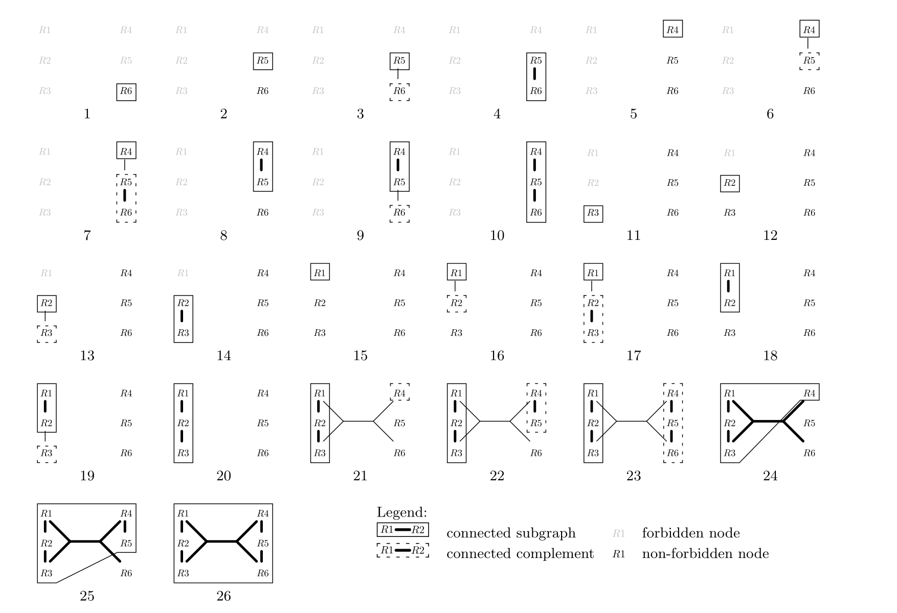
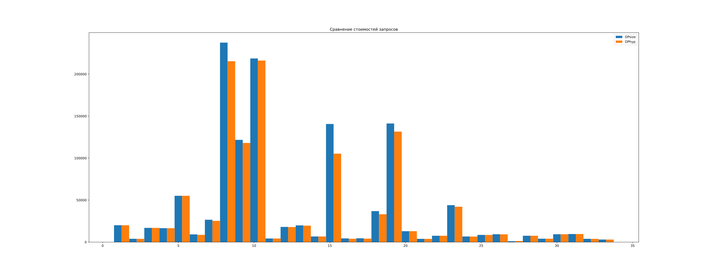

# pg_dphyp

Приветствую!

Как разработчик баз данных я увлекаюсь базами данных и, читая [красную книгу](https://www.redbook.io/), что-то во мне щелкнуло и захотел глубже поизучать планировщик. Спустя некоторое время сидел над алгоритмами соединений таблиц и наткнулся на алгоритм DPhyp. Его используют многие современные (и не очень) базы данных. Мне стало интересно: а есть ли в PostgreSQL такое? К великому удивлению, нет. Ну, если чего-то нет, то это надо создать самому. Закатал рукава, создал репозиторий и принялся писать код.

Эта статья не о DPhyp и том, как он работает, а о том, с чем мне пришлось столкнуться в процессе написания соответствующего расширения для PostgreSQL. Но вначале немного теории.

## Планировщики запросов

Планировщик в базах данных это, пожалуй, самый сложный и важный компонент системы, особенно, если мы говорим о терабайтах данных: неважно насколько быстрое железо стоит в серверной - если планировщик чуть-чуть ошибся и использует последовательное сканирование вместо индекса, то приходите за результатом через неделю. И в этом сложном компоненте можно выделить ядро - перебор JOIN'ов.

Это важная часть, так как по большей часть правильный выбор порядка соединения таблиц оказывает наибольшее влияние на стоимость всего запроса. Например, вот такой запрос:

```sql
SELECT *
FROM t1 
JOIN t2 ON t1.x = t2.x
JOIN t3 ON t2.x = t3.x
JOIN t4 ON t3.x = t4.x;
```

Имеет 14 возможных комбинаций соединений таблиц. А в общем случае - это число возможных представлений бинарного дерева из `N` узлов, где под узлами понимаются таблицы, [число Каталана](https://ru.wikipedia.org/wiki/Числа_Каталана), которое уже для 7 таблиц равно 429, а дальше для 8 - 1430. Стоит ли говорить, что с определенного момента оно становится насколько огромным, что практически невозможно найти оптимальный план простым перебором всех возможных комбинаций.

То, как мы собираемся выполнять перебор и определяет ~~наш лагерь~~ архитектуру планировщика: top-down или bottom-up.

Top-down подход - это подход сверху вниз (еще называют goal-oriented, ориентированный на цель). Мы заходим в корень, понимаем его "цель" (есть ли группировка/фильтрация, что на выходе и т.д.) и на основании этого создают план запроса. Преимуществом такого подхода является то, что у нас на руках полный контекст и мы можем его использовать. Примером может служить планировщик (грубо говоря, это архитектура) cascades, который используется в MS SQL Server.

Bottom-up - это противоположный лагерь, где вначале планируют все JOIN'ы, а только потом навешивают сортировку/группировку и другие операторы. Этот подход используются во многих базах данных, например, в том же самом PostgreSQL. Преимуществом этого подхода является масштабируемость, так как он позволяет планировать огромное количество JOIN'ов, например, в статье [Adaptive Optimization of Very Large Join Queries](https://db.in.tum.de/~radke/papers/hugejoins.pdf) представляется подход, который комбинируя несколько разных алгоритмов позволяет выполнять планирование запросов с несколькими тысячами таблиц. Примером кто так делает в статье указывается SAP, который из-за постоянного использования представлений внутри других представлений может создать запрос использующий тысячи обычных таблиц.

Сейчас мы акцентируем внимание на последнем подходе - bottom-up, а именно на используемых алгоритмах. Но этих алгоритмов довольно много, поэтому вначале рассмотри алгоритмы, используемые в PostgreSQL.

### DPsize

Во времена рассвета РСУБД никто не понимал, как это все должно работать и делали кто как знал. Тогда и появился первый алгоритм динамического программирования для поиска порядка соединений. Сегодня все (как минимум в статьях) обращаются к нему как `DPsize`.

> Для начала простое определение, что такое отношение. Реляционная алгебра построена на работе с отношениями и это можно назвать простым источником данных со своей схемой (атрибутами). Таблица - это самый простой пример отношения. Но другой важный сейчас пример - это `JOIN`, т.к. по факту он отвечает требованиям (дает кортежи и есть атрибуты). Далее, я буду говорить именно "отношение", а где это важно, то "таблица".

Его идея довольно проста - чтобы создать JOIN из `i` таблиц отношений нужно соединить другие отношения, которые в сумме количества таблиц дадут этот `i`. Например, для `4` нам нужно соединить: `1` и `3`, `2` и `2`. Собственно, это и есть динамическое программирование - ответ текущего шага зависит от ответа прошлых, ну а базой выступают отношения размером `1`, то есть обычные таблицы. Этот алгоритм неплохо себя показывает на OLTP нагрузке (когда таблиц мало) и дает практически оптимальные планы запросов, но проблемы начинаются когда таблиц становится слишком много.

Как можете заметить, сложность этого алгоритма экспоненциальная, так как на каждом следующем шаге нам предстоит обработать еще больше пар отношений. Разные базы данных борются с этим по разному, но в PostgreSQL пошли путем использования другого алгоритма.

### GEQO

GEQO, Genetic Query Optimizer - это генетический алгоритм поиска оптимального плана запроса. Если вы попробуете запустить в PostgreSQL запрос сначала на 12 таблиц, а после на 13, то удивитесь, что затраченное время снизилось с нескольких секунд, до почти *десяти миллисекунд*. Почему?

Ответ прост - это рандомизированный алгоритм. Его работу можно описать просто: вначале строим *хоть какой-нибудь* план запроса, а затем проводим несколько итераций (определяется конфигурацией), в каждой из которых случайно меняем какие-нибудь узлы, и в следующую итерацию идет план с лучшей стоимостью. Отсюда и название - генетический, так как в следующее поколение (итерацию) переходят сильнейшие (самые дешевые).

## DPhyp

Переходим к основной теме - DPhyp.

DPhyp - это алгоритм динамического программирования для перебора JOIN'ов. Его основная идея заключается в том, что сам запрос содержит указания того, как должно происходить соединение таблиц. Так почему-бы его не использовать? Основная проблема в самом представлении запроса. Ранее, я оговорился, что запрос можно представить в виде графа, но можно ли так сделать для целей перебора JOIN'ов? Чтобы понять в чем трудность посмотрим на пример из статьи:

```sql
SELECT *
FROM R1, R2, R3, R4, R5, R6
WHERE R1.x = R2.x AND R2.x = R3.x AND R4.x = R5.x AND R5.x = R6.x AND
      R1.x + R2.x + R3.x = R4.x + R5.x + R6.x
```

Да, мы видим, что есть несколько *явно* соединенных между собой таблиц - для них мы можем создать ребра в нашем графе (например, `R1 - R2`), но что делать с последним предикатом, который по факту соединяет множества таблиц?

Эту проблему и решает DPhyp - алгоритм динамического программирования (DP), основанных на *гиперграфах* (hyp - hypergraph).

Пугаться не стоит, все довольно просто. Для начала, предполагаю, что вы знакомы с обычным графом - множество узлов, соединенных между собой ребрами. Гиперграф - это множество гиперузлов, соединенных между собой гиперребрами:

- гиперузел (hypernode) - это *множество* обычных узлов
- гиперребро (hyperedge) - это ребро, *соединяющее 2 гиперузла*

В запросе из примера у нас имеются следующие гиперребра:

1. `{R1} - {R2}`
2. `{R2} - {R3}`
3. `{R4} - {R5}`
4. `{R5} - {R6}`
5. `{R1, R2, R3} - {R4, R5, R6}`

Если в гиперузле только 1 отношение, то его называют *простым гиперузлом*. Аналогично, если гиперребро соединяет 2 простых гиперузла, то это *простой гиперузел*. Первые 4 - это простые гиперребра.

В итоге, чтобы создать план для множества из `i` узлов нам нужно обойти уже не все возможные пары, дающие `i` в сумме, а все пары гиперузлов, которые в объединении дают тоже множество. Такая пара - это пара из 2-ух непересекающихся множеств: `connected subgraph` (csg, подграф) и `connected complement` (cmp, дополнение). Эти аббревиатуры вы увидите еще не раз.

Но не все так просто и, чтобы это заработало оптимально, требуется небольшое ограничение - порядок узлов. Над узлами (т.е. таблицами) должно быть отношение порядка, грубо говоря, они должны быть пронумерованы (что используется чаще всего) для того, чтобы потом мы могли их сравнить и отсортировать. Чтобы понять зачем рассмотрим ядро алгоритма - соседство.

В процессе работы алгоритма, чтобы переходить от одного гиперузла к другому мы используем соседей (neighborhood). В статье дается и математическое определение, но проще всего сказать, что соседи для какого-либо гиперузла - это множество других достижимых узлов. Также требуется, чтобы это множество было минимальным, в противном случае мы будем обрабатывать одни и те же узлы несколько раз. Вот тут и нужен порядок - когда обходим ребра для нахождения соседей, то в множество добавляем только *представителя* гиперузла, его *минимальный элемент*. Дальше нам нужно просто проверить, что другие ребра не содержат уже добавленные узлы.

И последняя важная деталь алгоритма - исключенное множество (excluded set). В DPsize в качестве оптимизации итерирование по дополняющим парам мы начинаем не с 0, а со следующего индекса, или в противном случае попытаемся соединить себя с собой же, а некоторые пары обработать дважды. Здесь примерно та же идея - мы ведем учет узлов, которые не стоит рассматривать (исключенные) и проверяем это практически везде (даже при нахождении соседей). Благодаря этому, мы не рассматривать одно и то же множество дважды.

Основная логика алгоритма в статье представлена в виде 4 функций, но вкратце ядро алгоритма можно описать так: нам нужно найти csg-cmp пару, которая в объединении дает весь запрос, поэтому с помощью поиска соседей будет поочередно/рекурсивно увеличивать csg и cmp. Вопрос только в том с чего начать. На это ответ тоже простой - мы начинаем итерироваться по всем узлам начиная *с конца*, а при дальнейшем вызове в *excluded* записываем все узлы, которые меньше текущего. В итоге, мы начинаем с простого гиперузла, который никто не рассматривал и затем рекурсивно его расширяем, находим cmp для него с помощью соседей.

Собственно, теперь все готово, чтобы понять функции:

- `Solve` - входная точка алгоритма, просто итерируемся по простым гиперузлам с конца и вызываем `EmitCsg` и `EnumerateCsgRecursive`
- `EmitCsg` - принимает уже *фиксированный* csg, для которого находит подходящий cmp, а затем вызывает `EmitCsgCmp` и/или `EnumerateCmpRecursive`
- `EmitCsgRecursive` - принимает csg, который расширяет с помощью соседей, затем вызывает `EmitCsg` и/или `EnumerateCsgRecursive`
- `EnumerateCmpRecursive` - принимает *фиксированный* csg и cmp, с помощью соседей расширяет cmp, затем вызывает `EmitCsgCmp` и/или `EnumerateCmpRecursive`
- `EmitCsgCmp` - создает готовый план для *фиксированных* csg и cmp

В общем, это все. Основная идея алгоритма довольно проста и понятна. В качестве примера в статье также есть пошаговая иллюстрация работы алгоритма для запроса из примера:



Что происходит:

1. Итерирование происходит в обратном порядке, поэтому начинаем с отношения `R6` (который самый большой по индексу), но для него соседей нет, так как все остальные узлы находятся в исключенном множестве.
2. Переходим к `R5`
3. Для него нашли соседа `R6` и создаем из него CMP `{R6}`
4. Теперь увеличиваем сам CSG до `{R5, R6}`
5. Переходим к `R4`
6. Для него есть сосед `{R5}`, для которого создаем CMP `{R5}`
7. После увеличиваем этот CMP до `{R5, R6}`, так как `R6` сосед `R5`
8. Возвращаемся к 6 итерации и вместо увеличиваем сам CSG до `{R4, R5}`
9. Для уже этого подграфа мы нашли CMP `{R6}`
10. Увеличиваем CSG `{R4, R5}` до `{R4, R5, R6}`
11. Переходим к `R3` (множество исключенных `{R1, R2}`), но для него соседей нет, так как:
    - Все гиперузлы с которыми есть соединение через простые гиперреба (`R1`, `R2`) лежат в множестве исключенных
    - Представитель левого вершины единственного сложного гиперребра (`min({R1, R2, R3}) = R1`) тоже лежит в множестве исключенных
12. Переходим к `R2`
13. Для него есть сосед `R3`, для которого создаем CMP
14. Увеличиваем сам CSG до `{R2, R3}`
15. Переходим к `R1`
16. Для него есть сосед `{R2}`, для которого и создаем CMP
17. Для самого `R2` есть сосед `R3` - увеличиваем CMP
18. Увеличиваем исходный подграф `{R1}` до `{R1, R2}` (сосед)
19. Для получившегося подграфа есть сосед `R3` (вывели из соседства с `R2`)
20. Увеличиваем подграф `{R1, R2}` до `{R1, R2, R3}` с помощью этого соседа
21. Используем единственное сложное гиперребро и получаем соседа для `{R1, R2, R3}` - это `{R4}`, представитель правой вершины `{R4, R5, R6}`. Для него создали CMP
22. Увеличиваем CMP до `{R4, R5}` с помощью простого соседа
23. Еще раз увеличиваем CMP, уже до `{R4, R5, R6}`
24. Возвращаемся к 20 и начинаем увеличивать подграф. Вначале добавляем `{R4}`
25. Затем `{R5}`
26. В конце `{R6}`. Теперь CSG равен всему гиперграфу и мы можем закончить

Алгоритм хороший, так почему бы не добавить его в PostgreSQL? Можно? Можно и всегда было! Для это и существует `join_search_hook` - точка, позволяющая подменить алгоритм перебора JOIN'ов.

## Расширение pg_dphyp

Идея для создания этого расширения пришла ко мне спонтанно. Я изучал разные алгоритмы JOIN'ов и наткнулся на него. Немного поискав в интернете я не нашел ничего для PostgreSQL и понял, что надо сделать самому. Кому уже сразу хочется посмотреть на то, что получилось [вот ссылка на репозиторий](https://github.com/ashenBlade/pg_dphyp).

В контексте ядра работы алгоритма я не принес ничего нового, даже наоборот - больше копипастил у других. Перед тем как приступить к реализации своего, я посмотрел реализации нескольких СУБД. В частности посмотрел на YDB, MySQL и DuckDB. Если кто хочет изучить DPhyp по коду, то рекомендую посмотреть на [код YDB](https://github.com/ydb-platform/ydb/blob/c23202bc294cf703741f1ea6ac30786578a58920/ydb/library/yql/dq/opt/dq_opt_dphyp_solver.h) - код чистый и понятный, очень легко читать. Но сам я начал не с YDB, а с MySQL, чего не рекомендую, так как их реализация значительно изменена и оптимизирована - сразу разобраться не получится (только по комментариям и с изначальным пониманием самого DPhyp)

В реализации я старался быть ближе к статье и делать минимальное количество изменений. Например, название функций и некоторых переменных тоже самое, что и в статье. Но хоть изменений в ядре алгоритма практически нет, они есть на уровне принятия операционных решений. Первое решение, которое надо принять - это представление множеств.

### Представление множеств

Множества являются лошадкой алгоритма, поэтому эффективность всей программы зависит от эффективности этого атома.

Разные СУБД делают это по разному. Например, DuckDB [использует числа напрямую и хранит их в массиве](https://github.com/duckdb/duckdb/blob/73f85abbbdd38555ef7afa08090dfb4b10120df8/src/include/duckdb/optimizer/join_order/join_relation.hpp#L24), [YDB - `std::bitset<>`](https://github.com/ydb-platform/ydb/blob/c23202bc294cf703741f1ea6ac30786578a58920/ydb/library/yql/dq/opt/dq_opt_join_cost_based.cpp#L341), а [MySQL простое 8-байтное число](https://github.com/mysql/mysql-server/blob/ff05628a530696bc6851ba6540ac250c7a059aa7/sql/join_optimizer/node_map.h#L40).

Кто работает с PostgreSQL знает, что там имеется [своя реализация множества - `Bitmapset`](https://github.com/postgres/postgres/blob/62a47aea1d8d8ea36e63fe6dd3d9891452a3f968/src/include/nodes/bitmapset.h#L49). Она используется повсеместно и часто для хранения ID отношений. Вроде бы бери раз дают, но проблема в том, что операций над множествами огромное количество, а `Bitmapset` создает новую копию каждый раз когда меняется, то есть это лишние аллокации памяти. В PostgreSQL эта проблема часто не возникает, так как после создания `Bitmapset` он редко меняется, но в моем случае это критично.

Проблему я решил реализовав сразу 2 подхода - создал 2 файла где в одном использовал `bitmapword` (8 байтное число, как в MySQL), а в другом `Bitmapset` (для сложных запросов). Но это произошло в самом начале разработки, когда я еще не особо понимал как работает алгоритм и его тонкости, поэтому через некоторое время на файл с `Bitmapset` забил (решил добавить изменения позже), а потом вообще удалил. В итоге, сейчас я использую представление множества с помощью числа.

Проблем это не доставляет. Основные операции с множеством выполняются простыми битовыми `|`, `&` и `~`. Но есть и еще пара операций, которая важна для самого алгоритма. Например, итерирование по элементам множества (например, в процессе вычисления соседей). Таких операций много, поэтому я вынес их в отдельный [заголовочный файл](https://github.com/ashenBlade/pg_dphyp/blob/0cdc5b410d3bce41398a6646c576cca77994b6e3/simplebms.h).

Другая интересная операция - итерирование по всем подмножествам. Это нужно для расширения csg/cmp. Так как множество это число, то и операция проводится с числом. В MySQL это решили с помощью битового трюка `(init - state) & state`, который при постоянном применении ведет себя как инкремент, но при этом изменяются только биты множества. Эту реализацию я [взял себе](https://github.com/ashenBlade/pg_dphyp/blob/0cdc5b410d3bce41398a6646c576cca77994b6e3/pg_dphyp.c#L584).

Например, для множества `01010010` мы получим следующие подмножества:

```text
00000010    001
00010000    010
00010010    011
01000000    100
01000010    101
01010000    110
01010010    111
```

Слева само множество, а справа его битовая маска. Так как мы итерируемся инкрементом, то можно сказать, что эта битовая маска в числовом представлении также отображает и номер итерации. Дальше, это свойство будет использоваться часто.

### DP таблица

DPhyp - это алгоритм динамического программирования и у него есть своя таблица для отслеживания состояния выполнения.

Если посмотреть на алгоритм из статьи, то видно, что эта таблица используется только для хранения готовых планов. В PostgreSQL для готовых планов (представление отношения) используется структура `RelOptInfo` и *она уже хранится в хэш-таблице*. Вроде вот и хорошо - не надо думать о создании своей, но нет.

Проблема заключается уже в самом PostgreSQL, а точнее его обработке `FULL JOIN`. Для этого типа соединений сейчас поддерживается только предикат равенства, а в коде, когда встречается такой предикат, все отношения в левой и правой части попадают в отдельные списки, которые планируются *независимо*. Это причина по которой, для внутренних таблиц используется своя система индексации (то есть индексы узлов DPhyp не обязательно соответствуют индексам отношений). Поэтому даже если я буду на время превращать `bitmapword` в `Bitmapset` (что потребует еще выделения памяти), то не смогу этого сделать, если индексы отношений больше 64 (максимального значения для 8-байтного числа).

Поэтому для алгоритма используется своя DP таблица. По факту, это хэш-таблица - `HTAB *`, часть PostgreSQL. Особенность этой таблицы в том, что в ней хранится только 1 структура, а ее ключ элемента должен хранится в начале этой структуры. Из-за этого была добавлена еще 1 структура `HyperNode`, которая представляет гиперузел. Но сейчас это не просто пара из множества узлов и отношения - в ней хранятся и другие данные.

### Построение графа

Другая не менее важная задача - это построение самого графа. Проблема в том, что в отличие от YDB или MySQL, балом я не правлю и должен подстраиваться под саму БД.

С одной стороны, проблемы вроде нет - я могу пройтись по всем предикатам, используемым в запросе и из них создать ребра. Собственно, сейчас это так и реализуется. Но дьявол кроется в деталях.

Для начала - эту информацию мне приходится брать из 3 различных мест:

1. `RelOptInfo->joinclauses` - список из предикатов, которые используют больше 1 отношения, то есть по факту это JOIN условие.
2. `PlannerInfo->join_info_list` - список из non-INNER JOIN условий
3. `PlannerInfo->eq_classes` - список классов эквивалентности (далее)

Самое простое - это 2. Этот список содержит ограничения, которые накладывают разные не INNER (т.е. LEFT/RIGHT/FULL и т.д.) JOIN'ы. В нем есть 2 пары частей: синтаксические ограничения и минимальные (нужны для непосредственного вычисления). На всякий случай, я создаю гиперребро для обеих пар.

Про остальные тоже надо сказать. Первое имеет сложности с точки зрения *самого выражения* - оно может и не быть бинарным, а может быть, но по обеим сторонам используется одно и то же отношение. Для таких моментов я добавил свое понятие - cross join set (cjs). По факту, это просто множество отношений, которые должны соединиться между собой. Для каждого отношения в cjs я создаю простые ребра (каждый с каждым). Это решает проблему того, что какие-то предикаты могут отсутствовать. DPsize (который по умолчанию в PostgreSQL) решает это за счет того, что обрабатывает каждую возможную пару.

Теперь 3 - классы эквивалентности. Класс эквивалентности - это механизм PostgreSQL, с помощью которого он определяет, что какие-то выражения равны друг другу. Это используется не только в выражениях. Например, выражения в `ORDER BY` или `GROUP BY` представляются именно классом эквивалентности (возможно, вырожденным, с единственным элементом). Но сейчас не об этом, а том как это стреляет. Такие классы эквивалентности появляются, когда в запросе имеются выражения равенства, даже одного достаточно для создания класса эквивалентности. Как можно догадаться, они также используются для JOIN'ов. Когда я встречаю класс эквивалентности с несколькими отношениями, то приходится создавать гиперребра для каждой пары. Поэтому подобные запросы с одними равенствам под капотом превращается в клику.

К сожалению, эти источники не покрывает всех вариантов. Проблема кроется в первом (`joinclauses`). Во время работы PostgreSQL создает все возможные варианты выражения с разным набором необходимых отношений с левой и правой части. Это позволяет рассмотреть разные варианты расположения выражения в дереве. Проблема в том, что индексы отношений, которые там используются могут относится не к таблицам, а к индексам узлов JOIN (`RangeTblEntry` типа `RTE_JOIN`). Но я не нашел оптимального способа собрать все индексы таблиц по переданному индексу JOIN, и из-за этого теряю львиную долю гиперребер. Вы можете сказать "ну обойди дерево запроса и собери". Да я так и сделал - время планирования на сложных запросах увеличилось *совсем чуть-чуть* - с 500 мс до 16 секунд и это при том, что план остался тем же самым. Поэтому сейчас расширение дает не самые оптимальные планы запросов из-за того, что пока не могу вычленить из предикатов некоторые "подсказки" по порядку соединений.

### Несвязные подграфы

Из предыдущего вытекает еще одна проблема. Что будет если мы получили несвязный граф (то есть лес)? В таком случае алгоритм ничего не сможет сделать. Точнее, он создаст план для каждого графа в лесу, но для *всего* запроса не сможет.

Причем эта проблема может вылиться не только из-за `CROSS JOIN` или `,`, но и из-за внешних параметров подзапросов. Приведу пример:

```sql
SELECT * FROM t1
WHERE t1.x IN 
    (SELECT t2.x FROM t2, t3 WHERE t2.x = t1.x AND t3.x = t1.x);
```

В этом подзапросе `t1.x` является параметром, но на выходе в графе у нас лес, потому что для `t1` в подзапросе нет индекса. Можно представить и более сложные запросы, которые могут упасть таким образом. Вообще, это я обнаружил, когда запустил `\d` (чтобы отобразить все таблицы) в `psql` и оказалось, что там был примерный запрос.

С одной стороны, на практике несвязные графы довольно редкое явление, чтобы тратить ресурсы для обнаружения этого, с другой, из-за подобного мы можем потратить лишнее время (просто удвоить время планирования без полезной нагрузки). Поэтому решение как поступать я отдал на откуп пользователям.

Имеется отдельный параметр `pg_dphyp.cj_strategy`, который принимает 3 значения:

- `no` - если не смогли построить план, то вызвать DPsize/GEQO
- `pass` - если не смогли построить план, то собрать все готовые планы несвязных деревьев и отдать DPsize/GEQO на финальную доработку
- `detect` - создавать гиперребра для несвязных графов перед началом работы

Кажется, что первый вариант лишний, но на самом деле не особо, так как планы, созданные для этих подграфов могу быть не оптимальными из-за причины выше (между несвязными подграфами могут быть неявные связи, которые помогают создать оптимальный план), поэтому и финальный план тоже может быть не оптимальным.

Остается вопрос - как находить несвязные графы. Ответ на поверхности - [Union-Set алгоритм](https://github.com/ashenBlade/pg_dphyp/blob/0cdc5b410d3bce41398a6646c576cca77994b6e3/pg_dphyp.c#L975). Для производительности я использую оптимизированную версию - с ранжированием и обновлением лидера у обеих частей.

### Хранение гиперребер

Еще одна задача - хранение гиперграфа. Граф можно хранить в виде списка ребер, а можно таблицей смежности. Но для гиперграфа, остается только первый вариант, так как практически невозможно построить таблицу смежности для гиперребер (это не 1 элемент, а целое множество).

Хорошо, определились, но можно ли применить какие-нибудь оптимизации? Да, можно. Почти у всех реализаций (например, [YDB](https://github.com/ydb-platform/ydb/blob/c23202bc294cf703741f1ea6ac30786578a58920/ydb/library/yql/dq/opt/dq_opt_join_hypergraph.h#L84) и [MySQL](https://github.com/mysql/mysql-server/blob/ff05628a530696bc6851ba6540ac250c7a059aa7/sql/join_optimizer/hypergraph.h#L69)) есть оптимизация для простых гиперребер. Напомню, что у простого гиперребра по обеим сторонам множества из единственного элемента. Эта оптимизация заключается в том, что мы храним все узлы, с которыми нас связывают простые гиперребра, в одном единственном множестве. Далее, в процессе работы нам нужно сделать единственную операцию для проверки сразу нескольких ребер. Такое множество часто называют `simple neighborhood`, почему, наверное, понятно.

Я тоже взял себе эту оптимизацию, но пошел чуть дальше и храню этот `simple neighborhood` для каждого гиперузла (в структуре `HyperNode`). Это немного упрощает работу, так как не нужно тратить время на дополнительное итерирование по узлам, а места занимает только 8 байт.

А что по сложным гиперребрам? Тут тоже не без замечаний. Ранее я сказал, что для одного и того же выражения могут существовать несколько выражений, но с разным набором индексов необходимых отношений. Тогда же я и сказал, что не могу эти дополнительные индексы обработать. Поэтому в результате я могу получить множество дубликатов.

С этим я решил бороться обычной [сортировкой](https://github.com/ashenBlade/pg_dphyp/blob/0cdc5b410d3bce41398a6646c576cca77994b6e3/pg_dphyp.c#L1096) - все ребра я храню в отсортированном виде и если при вставке нахожу равное ребро, то ничего не делаю (не вставляю).

### Создание плана

Сама статья не только про алгоритм на гиперграфах, но также и про эффективное создание плана. Это важный момент, так как некоторые JOIN операторы не коммутативны (например, `LEFT JOIN`), и если это не учитывать, возможно придется вычислять одну и ту же пару дважды.

Но это еще не все. Напомню, что DPsize плотно засел в кодовой базе, да на столько, что нельзя создать план для `i` таблиц, без нахождения оптимального плана для нижележащих.

Изначально я так и делал - после создания плана вызывал `set_cheapest` для нахождения лучшего плана и дальше мог спокойно вызывать `make_join_rel` для других. Но если посмотреть внутрь, то увидим, что она проходит по всем найденным путям для нахождения лучшего, то есть по мере работы программы время, затраченное на ее выполнение, будет только увеличиться.

Из-за этого я перешел на DPsize-like подход. Для каждого гиперузла я веду список пар гиперузлов-кандидатов, которые могут его создать, а в конце рекурсивно вызываю создание плана. Этакий pull подход. Да, есть вероятность, что внутри окажется пара, которая не сможет создать план запроса и я потрачу время впустую, но накладные расходы на изначальный подход (с постоянным вызовом `set_cheapest`) все же больше, а, тем более, вероятность того, что какая-то пара гиперузлов не создаст полезного JOIN'а крайне мала из-за самой идеи DPhyp.

## Оптимальное итерирование по соседям

Наконец-то мы пришли к самой интересной части - как мы будем обходить соседей. В алгоритме можно выделить 3 функции, которые заняты перебором пар csg/cmp и в них нам нужно вычислять соседей целых 4 раза. Все становится страшнее, когда осознаешь, что алгоритм предполагает итерирование по всем возможным подмножествам соседей ([power set](https://en.wikipedia.org/wiki/Power_set) без пустого множества) - это $2^i$ комбинаций.

Да, мы добавили оптимизацию простого соседства (simple neighborhood), но все же нам необходимо обработать все узлы в подмножествах (кроме того, есть и основная часть, к которой это подмножество добавляется - для него тоже надо посчитать). Всего получается $\sum_{k = 1}^{n}kC_{n}^{k}$ узлов которые надо обработать в сумме для всех подмножеств.

> Количество разных комбинаций подмножеств из $k$ элементов составляет $C_{n}^{k}$, но для каждого подмножества размером $k$ нужно обработать каждый его элемент, а их $k$. То есть количество элементов во всех подмножествах размером $k$ равно $kC_{n}^{k}$.

Для начала посмотрим на определение соседства:

$$
E\darr'(S, X) = \{v|(u, v) \in E, u \subseteq S, v \cap S = \emptyset, v \cap X = \emptyset \} \\
E\darr(S, X) = minimal\ set: \forall_{v\in E\darr'(S,X)} \exists v' \in E\darr(S,X): v' \subseteq v \\
\mathcal{N}(X, X) = \cup_{v \in E\darr(S, X)} min(v)
$$

Вначале создается множество $E\darr'$ - гиперребра, принадлежащие текущему гиперузлу и указывающие за его пределы. Затем, это множество сжимается до минимального и из него выбираются представители (наименьшие элементы).

2 шаг, нахождение *минимального* множества, - это сложная вычислительная задача, поэтому для ее облегчения многие используют оптимизацию: по мере обхода узлов в соседи попадают только представители (минимальные узлы), а перед добавлением  проверяем, что очередной гиперузел не пересекается с уже найденными соседями. Этот подход использует как сам [MySQL](https://github.com/mysql/mysql-server/blob/ff05628a530696bc6851ba6540ac250c7a059aa7/sql/join_optimizer/subgraph_enumeration.h#L314) так и [YDB](https://github.com/ydb-platform/ydb/blob/c23202bc294cf703741f1ea6ac30786578a58920/ydb/library/yql/dq/opt/dq_opt_dphyp_solver.h#L438).

Имеет ли смысл оптимизировать это место? В коде MySQL довольно много комментариев, которыми они описывают те или иные принятые решения (чаще всего на основании микробенчмарков). Один из [таких комментариев](https://github.com/mysql/mysql-server/blob/ff05628a530696bc6851ba6540ac250c7a059aa7/sql/join_optimizer/subgraph_enumeration.h#L280) написан к функции вычисления соседей `FindNeighborhood`:

> ...
> This function accounts for roughly 20–70% of the total DPhyp running time, depending on the shape of the graph (~40% average across the microbenchmarks)
> ...

То есть практически все время работы алгоритма занимает логика вычисления соседей, поэтому - да, смысл в ее оптимизации есть.

Для того, чтобы ускорить вычисление соседей в MySQL используют кэширование по подмножествам.

### Подход в MySQL

Их идея построена на свойстве подмножеств, которые мы получаем при итерировании инкрементом.

Если посмотреть на этот способ повнимательнее, то можно заметить, что при таком подходе при следующем шаге мы часть получаем подмножество предыдущего шага. И при этом очень часто (каждый следующий шаг) первый бит постоянно переключается то в `0`, то в `1`. А если его переключить из `0` в `1`, то мы получим подмножество! Например, `0011100` -> `0011101`.

Сразу возникает желание просто взять предыдущих соседей и добавить этим первым элементом, но возникает вопрос - а корректно ли это? Да, корректно. Если еще раз взглянем на определение соседей из статьи, то не увидим там ограничение на порядок обхода узлов, а это значит, что мы можем взять одно множество и дополнить еще одним.

Чтобы стала понятна идея рассмотрим на примере итерации по подмножеству из 4 узлов. Привожу пример из комментария:

```text
0001
0010 *
0011
0100 *
0101
0110 *
0111
1000 *
1001
1010 *
1011
1100 *
1101
1110 *
1111
```

Звездочкой я указал места, в которых нам придется полностью вычислять соседей, то есть очищать кэш, но после на следующем подмножестве нам будет достаточно обработать только 1 узел (первый). Если все делать честно, то для исходного множества размера 4 придется обрабатывать 32 узла, а с помощью этой эвристики только 20.

В комментарии они также указали, что существуют оптимальные порядки обхода подмножеств, которые дадут еще больший прирост. Для множества из 4 элементов он будет таким (в комментарии в коде, наверное, очепятка - после 0111 идет 1110, что не позволяет оптимально вычислить соседей, поэтому здесь моя поправленная версия). Идея проста: мы как бы итеративно делаем сдвиг правого (первого) бита вправо, пока он не упрется в левую часть, а когда эта левая часть закончилась, то начинаем новый разряд - кэш обновляем в начале нового разряда или когда этот бит упирается в последовательность единиц:

```text
0001 
0010 *
0011 
0100 *
0101
0110 *
0111
1000 *
1010
1100
1001 *
1011
1101
1110 *
1111
```

Здесь нам нужно уже только 15 итераций. Но на практике, даже такая эвристика с отслеживанием последнего бита дает значительный прирост - требуется практически в 2 раза меньше итераций.

Известен ли оптимальный порядок для большего множества? Да, но только для 5 (писать его здесь не буду, можете посмотреть в том же комментарии).

Если кто-то подумал "просто захардкодить и все", то нет. Не забывайте, что перед вами сейчас просто битовая маска включенных/исключенных элементов из множества. В реальности, элементы в битовой маске разрозненны. Например, итерация по множеству из 3 элементов `00101001` будет выглядеть так (слева подмножество, справа эта маска/номер итерации):

```text
00000001   001
00001000   010
00001001   011
00100000   100
00100001   101
00101000   110
00101001   111
```

<spoiler title="Ограничене схемы кеширования">

Схема кэширования соседей работает только в случае, когда множество исключенных узлов зафиксировано. Под это условие попадают последние циклы в `Enumerate*` функциях, когда множество исключенных добавляется соседями csg/cmp (в определении из статьи эти функции рекурсивно вызывают себя, но с множеством исключенных узлов $X \cup \mathcal{N}(S, X)$, которое не зависит от цикла).

Но даже этого достаточно для прироста производительности, так как остальные 2 места перебора подмножеств:

- `EnumerateCmpRecursive`, но там вызывается `EmitCsgCmp` для которого находить соседей не нужно
- `EnumerateCsgRecursive`, но в нем вызывается `EmitCsg`, который сбрасывает множество исключенных узлов.

Чтобы понять, почему нельзя кешировать соседей, если множество исключенных узлов меняется рассмотрим конкретный пример. Вызван `EnumerateCsgRecursive` с множеством $S = 000110$ и $X = 000111$. Для него есть множество соседей, по подмножествам которых будем итерироваться, $\mathcal{N} = 1110000$ (то есть получается, что $0001000$ пока свободен и никому не принадлежит).

Мы хотим эффективно вычислять соседей и для этого кешируем их. Возникает вопрос - что кешировать? Неизменяемая часть - это $S$, к которой добавляется подмножество соседей. Решаем закешировать его, но тут возникает такая ситуация: для какого-то узла есть гиперребро правая часть которого $1001000$. Как это ребро корректно обработать? Имеем 2 возможных исхода:

1. В множество исключенных узлов *не были* добавлены все соседи. Тогда в соседи для `EmitCsg` добавляется узел $0001000$, который будет прокидываться везде. Но это значит, что для итераций, в которых *участвует* $1000000$ будет нарушена логика вычисления соседей в `EmitCsg`, так как этот элемент будет в исключенном множестве, а соответственно *ребро не должно учитываться*
2. В множество исключенных узлов *были* добавлены все соседи. Тогда мы получаем обратную сторону медали - в итерациях, где элемент $1000000$ *не участвует*, *будет отсутствовать какой-то узел*

Но если посмотреть в код MySQL, то можно увидеть, что они все же используют кеширование. Но почему? Если говорить просто, то они вычисляют соседей для подмножества, а затем к получившимся соседям добавляют исключенные узлы и исходных соседей.

Исключенные они добавляют по логике `Enumerate*` функций, так как к ним на вход передаются исключенные множества, которые содержат все ранее найденные множества, хотя рекурсивным вызовом могли передать только небольшое подмножество. Например, в процессе работы `EnumerateCsgRecursive` рекурсивно вызывал себя несколько раз и каждый раз множество соседей составляло 2 элемента, но рекурсивные вызовы передавали только 1 элемент, хотя аккумулированные исключенные узлы это объединение всех найденных соседей. То есть, множество исключенных узлов, которые нам передали может содержать все узлы, которые будут валидными соседями в `EmitCsg` (так как он сбрасывает текущие исключенные и начинает использовать свои).

Пример: после нескольких рекурсивных вызовов `EnumerateCsgRecursive` имеет $S = 1010001011$, $X = 1111111111$, но при вызове `EmitCsg` множество исключенных будет сброшено до $X = 0000000011$ (например, потому что наименьший узел это 2). Тогда добавление $X \\ S = 0101110100$ будет просто означать, что мы на всякий случай хотим обработать те узлы, которые были соседями предыдущих вызовов, но в текущее множество CSG не попали.

Исходных соседей добавляют по той же самой логике. Но чтобы не нарушать корректность алгоритма, из полученного множества удаляются все узлы, которые находятся в полученном подграфе. Вкратце: авторы изначально знают, что соседи полученные таким способом могут не содержать всех соседей, поэтому добавляют вообще все, что может быть правдой, даже если это приведет к избыточным вычислениям.

Вот часть этого кода с комментариями, более подробно описывающими причины (`lowest_node_idx` - это индекс узла, с которым запущена текущая итерация в `solve`):

```c++
// EnumerateComplementsTo() resets the forbidden set, since nodes that
// were forbidden under this subgraph may very well be part of the
// complement. However, this also means that the neighborhood we just
// computed may be incomplete; it just looks at recently-added nodes,
// but there are older nodes that may have neighbors that we added to
// the forbidden set (X) instead of the subgraph itself (S). However,
// this is also the only time we add to the forbidden set, so we know
// exactly which nodes they are! Thus, simply add our forbidden set
// to the neighborhood for purposes of computing the complement.
//
// This behavior is tested in the SmallStar unit test.
new_neighborhood |= forbidden & ~TablesBetween(0, lowest_node_idx);

// This node's neighborhood is also part of the new neighborhood
// it's just not added to the forbidden set yet, so we missed it in
// the previous calculation).
new_neighborhood |= neighborhood;
```

</spoiler>

Для реализации своего 1-элементного кэша они используют [класс `NeighborhoodCache`](https://github.com/mysql/mysql-server/blob/ff05628a530696bc6851ba6540ac250c7a059aa7/sql/join_optimizer/subgraph_enumeration.h#L163) и прокидывают его почти везде. Его логика проста: перед началом поиска соседей находим дельту множеств, но, по факту, проверяем, что последний бит выставлен, а в конце сохраняем рассчитанных соседей, но только если не стоит первый бит (его они назвали `taboo bit`).

Как только я понял идею, то переписал этот код себе. Буквально. Переписал почти слово в слово, только ~~Васю на Петю~~ `taboo` на `forbidden` поменял (чтобы хоть что-то свое было). Код жил так довольно долго, несколько недель. А потом я спохватился - GPLv2!

Код MySQL распространяется под лицензией GPLv2, а учитывая, что я переписал почти все слово в слово (на тот момент, наверное, еще даже не до конца понимая саму идею), то нарушил эту лицензию - мой то проект под MIT, они не совместимы. Тогда я встал перед вопросом - выкинуть эту хорошую оптимизацию и сделать код медленным или оставить, но поменять лицензию на GPLv2. По итогу выбрал первое и это стало началом увлекательного думания на несколько недель - как мне оптимизировать эту комбинаторику.

### Суффиксный кэш

Передо мной стоит задача - оптимизировать алгоритм, но так, чтобы это не было копиркой MySQL (в моем случае, это важный аспект, потому что после нахождения первого решения часто использую только его). Сама идея ясна - зачем вычислять все множество соседей, если можно просто его дополнять этой дельтой. Нам нужно как-то найти то-ли шаблон, то-ли еще что, что поможет нам обнаружить подобное подмножество.

А что если посмотреть с другой стороны? Действительно, у нашего способа итерирования по подмножествам есть хорошее свойство - верхняя часть (MSB) меняется гораздо реже чем нижняя (LSB). А почему-бы нам не использовать это свойство - просто закэшируем то, что редко меняется!

Но что такое "редко меняется"? В первой идее за эту константу я взял замыкающие единицы - последовательность последних единиц (при фиксированном разряде) в числе может только увеличиваться, то есть достаточно только подсчитать соседей для этой последовательности, а затем добавлять меняющуюся. Отделить базовую (не меняющуюся) часть мы можем простой битовой маской, а ее размер мы знаем (подсчитали).

> Если вспомнить оптимальную последовательность итерирования, предложенный MySQL, то можно заметить, что эта стратегия идеально подходит под такую последовательность.

Как нам отследить изменение этой части? Не проблема - это ведь двоичная арифметика, просто отслеживаем сколько итераций до следующей новой `1`, а затем делим на 2 и ожидаем полученное количество итераций. Когда начинается новый разряд, то просто сбрасываем счетчик и повторяем.

Алгоритм следующий:

1. Инициализация:
   1. `nb_cache = 0` Закешированные соседи
   2. `nb_cache_subset = 0` Маска множества, для которого хранится `nb_cache`
   3. `prev_update = 0` Сохраненное значение `next_update`
   4. `next_update = 0` Итераций до следующего обновления кэша
2. Для очередной итерации (начиная с 1):
   1. Если `next_update == 0`:
      1. Довычисляю соседей последним элементом
      2. `next_update = prev_update / 2` - следующая единица в последовательности появится ровно через половину числа предыдущих операций
      3. `prev_update = next_update` - это нужно для вычисления следующих соседей
      4. `nb_cache = *вычисленные сейчас соседи*`
      5. `nb_cache_subset = *текущее подмножество*`
   2. Если в множестве только 1 элемент:
      1. Вычисляю соседей для этого единственного элемента
      2. `next_update = 2^*номер разряда - 2*` - столько осталось до добавления еще одной единицы в множество
      3. `prev_update = next_update`
      4. `nb_cache = *вычисленные сейчас соседи*`
      5. `nb_cache_subset = *текущее подмножество*`
   3. В противном случае:
      1. Из подмножества удаляем закешированные элементы (храним в `nb_cache_subset`)
      2. Вычисляем соседей с `nb_cache` в качестве базы

### 1-слойный кэш

Хорошая ли это идея? Как подспорье для дальнейших рассуждений да, но на практике эта схема кэширования даст прирост только в конце, когда у нас почти все заполнено единицами (так как способа итерирования по оптимальным подмножествам не нашел, значит итерирование инкрементом).

Вернемся в самое начало. Мы обсуждали то, что кешировать нужно редко меняющиеся части. За эту часть мы взяли последовательность замыкающих единиц. Она действительно редко меняется, но заметим, что эта часть вариативная, то есть надо отслеживать ее размер. Теперь сделаем эту часть фиксированной, то есть кэшировать будем определенный суффикс множества.

Вопрос - что даст больший прирост: кэширование замыкающих единиц или MSB? Давайте посчитаем. Для простоты сделаем это наглядно, на том же множестве из 4 элементов.

Для схемы кэширования лидирующих `1` мы имеем следующую схему расчета (2 столбец количество обработанных узлов, а звездочкой пометил места обновления кэша):

```text
0001  1
0010  1  *
0011  2
0100  1  *
0101  2
0110  2  *
0111  1
1000  1  *
1001  1
1010  1
1011  2
1100  2  *
1101  1
1110  3  *
1111  1 
```

Всего надо обработать 22 элемента. На 2 больше чем схема с табу-битом.

Со схемой кэширования MSB надо вначале ответить на вопрос - а что такое MSB, каков его размер? Возьмем мало, будем очень много вычислять, возьмем много будем часто вычислять этот MSB. В принципе, это все можно также вычислить, так как тут та же самая двоичная математика. Но для наглядности, возьмем MSB равный 2:

```text
0001  1
0010  1
0011  2
0100  1  *
0101  1
0110  1
0111  2
1000  1  *
1001  1
1010  1
1011  2
1100  2  *
1101  1
1110  1
1111  2
```

Тут уже 20 элементов - столько же сколько, чем замыкающие единицы, но меньше чем замыкающие единицы.

> Здесь каждый раз при обновлении кэша я честно полностью рассчитывал соседей. Но вы могли заметить, что при расчете закешированной части для соседей мы могли использовать ту же самую оптимизацию с последним битом - добавить к закешированным соседям этот последний элемент. Такая оптимизация позволит достичь всего-лишь 16 итераций, что намного эффективнее.
> Тогда я упустил этот момент и не стал рассматривать, но это было к лучшему и скоро узнаете почему.

Схема с кэшированием фиксированной части MSB показала себя лучше, да и к тому же у нее есть возможность настраивания (параметр - размер кешированной части). По итогу, выбираем схему кэширования с 1 элементом - MSB. Далее, эту неизменяемую часть, которую используем за стартовое значение для вычисления соседей, буду называть base (базой).

Алгоритм работы с ней довольно прост: через каждые $2^{len(64 - MSB)}$ элементов сохраняем в кэш эту базовую часть, а затем просто используем как стартовую точку при расчете соседей.

### 2-слойный кэш

Погодите, мы ведь работаем с множествами, а любое множество можно создать из предыдущего добавлением одного элемента! Например, множество `011010` можно построить из любого `001010`, `010010` или `011000`. Но это также значит, что можно создать текущее множество простым добавлением самого крайнего с начала элемента. Тот же изначальный пример с табу битом - это частный случай, когда мы добавляли первый элемент.

Давайте построим таблицу из 4 элементов и посмотрим, как мы можем создать текущее множество из предыдущего:

```text
0000 <+  <+  <+
   ^  |   |   |
0001  |   |   |
      |   |   |
0010 -+   |   |
   ^      |   |
0011      |   |
          |   |
0100 <+  -+   |
   ^  |       |
0101  |       |
      |       |
0110 -+       |
   ^          |
0111          |
              |
1000 <+  <+  -+
   ^  |   |
1001  |   |
      |   |
1010 -+   |
   ^      |
1011      |
          |
1100 <+  -+
   ^  |
1101  |
      |
1110 -+
   ^
1111
```

Вы видите этот паттерн? Я да - мы берем элементы в ячейке под индексом меньше нашей на какую-то степень 2 и используем как базу для создания текущего множества добавлением текущего крайнего элемента. Что это за степень 2? Можно увидеть из этой же схемы - это количество текущих лидирующих нулей! То есть множество соседей, которое может использоваться для создания текущего располагается в $2^{zeros}$ шагах назад, где $zeros$ - это количество текущих лидирующих нулей номера итерации.

Погодите - так это таблица динамического программирования! Для вычисления текущего множества мы используем результат предыдущего вычисления. И еще погодите, но не значит ли это, что для вычисления соседей для каждого из $2^i$ подмножества нам потребуется обработать ровно $2^i$ узлов? Да, значит!

Таким образом все наше множество можно поделить на 2 части: базовую (base), где мы закешировали редко меняющуюся старшую часть, и табличную (table), которая вычисляется с помощью нашей таблицы динамического программирования. Вопроса о размере каждой части не возникает - table часть берет то, что осталось: $64 - len(MSB)$ (либо наоборот). По итогу мы имеем следующий алгоритм:

1. Если итерация делится на $2^{table size}$, то честно рассчитываем всех соседей и сохраняем в base.
2. В противном случае:
   1. Берем нижнюю часть номера итерации (битовой маской)
   2. Считаем количество нулей и вычисляем: $delta = 2^{zeros}$
   3. Берем соседей родителя: $table[iteration - delta]$
   4. Довычисляем соседей для первого элемента
   5. Сохраняем полученное значение в таблицу

Возникает уже практический вопрос - а сколько мы готовы отдать на эту таблицу? Для хранения множества используется 8-байтное число, поэтому размер каждого множества фиксированный. Значит, для хранения таблицы с $i$ элементами требуется $8 * 2^i = 2^{i + 3}$ байтов. Теперь можно сделать грубые прикидки.

| Размер таблицы | Занимаемая память | Всего элементов | Итераций | Сохранено |
| -------------- | ----------------- | --------------- | -------- | --------- |
| 2              | 32   б            | 4               | 3        | 1         |
| 3              | 64   б            | 12              | 7        | 5         |
| 4              | 128  б            | 32              | 15       | 17        |
| 5              | 256  б            | 80              | 31       | 49        |
| 6              | 512  б            | 192             | 63       | 129       |
| 7              | 1    Кб           | 448             | 127      | 321       |
| 8              | 2    Кб           | 1024            | 255      | 769       |
| 9              | 4    Кб           | 2304            | 511      | 1793      |
| 10             | 8    Кб           | 5120            | 1023     | 4097      |
| 11             | 16   Кб           | 11264           | 2047     | 9217      |
| 12             | 32   Кб           | 24576           | 4095     | 20481     |

Легенда:

- Размер таблицы - размер множества, которое мы кэшируем
- Занимаемая память - сколько занимает таблица для текущей реализации ($2^{table\ size + 3}$)
- Всего элементов - сумма элементов из всех подмножеств ($\sum_{k = 1}^{table\ size}k C_{table\ size}^{k}$)
- Итераций - сколько должны обработать элементов в оптимизированной реализации, тоже самое что и количество итераций, но первую (пустую) не считаем ($2^{table\ size} - 1$)
- Итераций сохранено - разница между "Всего элементов" и "Итераций"

Какой размер таблицы использовать можно вычислять динамически или просто выбрать оптимальное значение под свою нагрузку эвристически.

Чтобы дальше было проще размышлять, я выберу размер таблицы в 10 элементов.

<spoiler title="Увеличение таблицы только уменьшает количество итераций">

Мне стало интересно, а какой выигрыш дает увеличение таблицы? Например, сколько мы можем сохранить итераций если вместо таблицы с `tbl` элементами использовать `tbl + 1`.

Для начала формула общего числа итераций. Представим, что количество наших соседей (т.е. размер множества) равен `max`, а размер таблицы `tbl`. Тогда, количество итераций необходимое для обработки всех подмножеств соседей равняется:

$$
\sum^{k = 0}_{max - tbl}C_{max - tbl}^{k}(2^{tbl} - 1 + k)
$$

То есть, для каждого нового `base` $k$ итераций для вычисления его соседей, а потом еще $2^{tbl}$ итераций табличных. Делаем это для каждого подмножества ($\sum^{k}_{max - tbl}$). Теперь мы можем вычислить разницу между количествами итераций для текущей таблицы и увеличенной на 1.

$$

\sum_{k}^{max - tbl}C_{max - tbl}^{k}(2^{tbl} - 1 + k) - \sum_{k}^{max - tbl - 1}C_{max - tbl - 1}^{k}(2^{tbl + 1} - 1 + k) = \\
\sum_{k}^{max - tbl - 1}C_{max - tbl}^{k}(2^{tbl} - 1 + k) - \sum_{k}^{max - tbl - 1}C_{max - tbl - 1}^{k}(2^{tbl + 1} - 1 + k) + C_{max - tbl}^{max - tbl}(2^{tbl} - 1 + max - tbl) = \\
\sum_{k}^{max - tbl - 1}(C_{max - tbl - 1}^{k} + C_{max - tbl - 1}^{k - 1})(2^{tbl} - 1 + k) - \sum_{k}^{max - tbl - 1}C_{max - tbl - 1}^{k}(2^{tbl + 1} - 1 + k) + 2^{tbl} - 1 + max - tbl = \\
\sum_{k}^{max - tbl - 1}C_{max - tbl - 1}^{k}(2^{tbl} - 1 + k) + \sum_{k}^{max - tbl - 1}C_{max - tbl - 1}^{k - 1}(2^{tbl} - 1 + k) - \sum_{k}^{max - tbl - 1}C_{max - tbl - 1}^{k}(2^{tbl + 1} - 1 + k) + 2^{tbl} - 1 + max - tbl = \\
\sum_{k}^{max - tbl - 1}C_{max - tbl - 1}^{k}(2^{tbl} - 1 + k - 2^{tbl + 1} + 1 - k) + \sum_{k}^{max - tbl - 1}C_{max - tbl - 1}^{k - 1}(2^{tbl} - 1 + k) + 2^{tbl} - 1 + max - tbl = \\
-2^{tbl}\sum_{k}^{max - tbl - 1}C_{max - tbl - 1}^{k} + \sum_{k}^{max - tbl - 1}C_{max - tbl - 1}^{k - 1}(2 ^{tbl} - 1 + k) + 2^{tbl} - 1 + max - tbl = \\
2^{tbl}(\sum_{k}^{max - tbl - 1}C_{max - tbl - 1}^{k - 1} - \sum_{k}^{max - tbl - 1}C_{max - tbl - 1}^{k}) + \sum_{k}^{max - tbl - 1}C_{max - tbl - 1}^{k - 1}(2^{tbl} - 1 + k) + 2^{tbl} + max - tbl
$$

Если раскроем суммы под скобками в первом слагаемом, то получим сумму такого вида: $C^0 - C^1 + C^1 - C^2 + C^2 - ...$. Легко увидеть, что слагаемые взаимно уничтожаются и на выходе мы получаем $C^0 - C^{max - tbl - 1} = 0$ - первое слагаемое равно нулю. Значит итоговое выражение:

$$
\sum_{k}^{max - tbl - 1}C_{max - tbl - 1}^{k - 1}(2^{tbl} - 1 + k) + 2^{tbl} - 1 + max - tbl = \\
\sum_{k}^{max - tbl - 1}C_{max - tbl - 1}^{k - 1}(2^{tbl} - 1 + k) = \\
\sum_{k}^{max - tbl}C_{max - tbl - 1}^{k}(2^{tbl} + k)
$$

Учитывая $max > tbl$ (так как формула предполагает, что мы увеличиваем $tbl$ на 1, то есть это предыдущее значение, а размер таблицы нет смысла увеличивать больше размера множество) видим, что это выражение неотрицательно, так как каждый член этой суммы неотрицателен.

</spoiler>

### 3-слойный кэш

Итак, мы пришли к идее хранения таблицы вычисленных соседей с постоянным ее дополнением. Неплохо, конечно, но грустно, что в кеше только 10 узлов - для сложных запросов мы будем постоянно перерасчитывать base. Да, мы можем сделать размер таблицы настраиваемым, но в любом случае с какого-то момента размер таблицы может стать непозволительно большим, например, уже с 15 элементов потребуется таблица размером 256 Кб. В худшем случае, после нескольких подобных рекурсивных вызовов (например, тот же `EnumerateCsgRecursive`) память выделенная только под таблицы может составить больше мегабайта. А можно ли как-то еще оптимизировать? Можно. Вернемся практически к началу.

Вся идея кеширования в MySQL основывалась на дорасчете соседей первым узлом текущего множества, но когда наступал момент сохранения соседей для дальнейших расчетов, то мы *не* сохраняли соседей, если в текущем множестве участвует этот первый `taboo` бит. Почему? А потому что это конечная остановка! Соседи, созданные в таком множестве, при итерировании инкрементом никем использоваться больше не будут. За доказательством долго идти не надо - посмотрите на предыдущую схему и увидите, что соседи, вычисленные в нечетных итерациях, никем не используются.

То есть мы спокойно можем не сохранять соседей нечетных итераций. Сколько же такая оптимизация нам сохраняет? Половину. Ровно половина множеств четна, а другая нечетна. Код, конечно, придется немного доработать - надо учитывать индексацию новой схемы: для получения предыдущего индекса нужно взять не $2^{zeros}$, а $2^{zeros - 1}$ элементов назад.

Подождите, но если мы обрежем первые биты, то останется другая часть, которая имеет похожий паттерн. Что если и ее тоже так оптимизировать? Сколько раз так можно повторить? Не буду утомлять подобными рассуждениями и сразу скажу - я смог применить подобное префиксное сжатие для 4 элементов. При этом потребовалось только 2 дополнительных переменных для расчета текущих соседей. Таким образом, мы приходим к 3-слойной схеме кэширования: base, table, hot (изначально я их назвал well-done, medium и rare). Третью часть, hot, можно назвать сжатым префиксом.

Алгоритм работы теперь еще сильнее зависит от номера итерации - в зависимости от его значения мы работаем с base, table или hot частью.

Для начала рассмотрим как мы должны обрабатывать hot часть. Она состоит из 4 элементов и главное - паттерн повторяется. Схему обращений мы уже видели, но здесь повторю ее в контексте ее вычисления:

```text
0   0000 <+  <+  <+    quad leader
       ^  |   |   |
1   0001  |   |   |
          |   |   |
2   0010 -+   |   |
       ^      |   |
3   0011      |   |
              |   |
4   0100 <+  -+   |
       ^  |       |
5   0101  |       |
          |       |
6   0110 -+       |
       ^          |
7   0111          |
                  |
8   1000 <+  <+  -+    quad leader
       ^  |   |
9   1001  |   |
          |   |
10  1010 -+   |
       ^      |
11  1011      |
              |
12  1100 <+  -+
       ^  |
13  1101  |
          |
14  1110 -+
       ^
15  1111
```

Все эти 16 элементов мы делим пополам на 2 части, у каждой из которых есть свой лидер - quad leader. По факту, это закешированные соседи для множества, в котором выставлен только последний бит. Его мы рассчитываем 2 раза: на итерациях 0 и 8.

Далее, мы также используем оптимизацию для нечетных итераций - для них мы специально на каждой итерации сохраняем соседей четных множеств и на следующей (уже нечетной) итерации просто используем готовое значение (то есть сохранять для нечетных ничего не надо).

В итоге у нас остались итерации: 2, 4, 6, 10, 12, 14. Здесь также все просто - можем заметить, что для 2, 6, 10, 14 нужно просто взять соседей предыдущей четной итерации - его мы и так сохраняем для нечетных итераций, но вот 4 и 12 требуют отдельной обработки - в качестве стартовой точки нужно взять quad leader, но и его мы тоже сохраняем.

В итоге мы храним только 2 вычисленных значения соседей: предыдущая четная итерация и quad leader.

Переходим к table части. Изменения коснулись прежде всего расчета индекса - теперь для дельты нужно из количества нулей вычесть 4 (размер hot части): $2^{zeros - 4}$. Но стоит заметить, что когда начинается новая table часть, то, соответственно, и новая hot часть тоже. Поэтому каждый раз после расчета соседей и сохранения этого значения в таблицу, нам нужно очистить состояние hot части - назначить нового quad-leader текущим значением соседей.

С base частью изменений почти нет. Во-первых, как можно понять из предыдущих шагов, при начале новой base части нам нужно сбросить состояние table части (вычисление таблицы начинается заново), а также и hot части (quad leader выставить в текущее вычисленное значение соседей). Но и это еще не все - почему бы нам не использовать тот же трюк с нечетными итерациями? И верно же - если первый бит текущего номера итерации base части равен 1, то мы можем просто довычислить соседей, так же как делали раньше.

Последний вопрос - как это все комбинировать. Здесь надо использовать префикс. Легко увидеть, что:

- каждые $2^{table size}$ итераций обновлять base часть (что в терминах двоичных чисел означает, что первые $i$ битов 0)
- каждые $2^4 = 16$ итераций делать новые записи в таблицу
- каждые $8$ итераций обновлять quad leader в hot части

Алгоритм значительно усложнился, но чего не сделаешь ради оптимизаций. Зато, теперь, для того же размера кэшируемого множества требуется не $2^{i}$ байт, а всего лишь $2^{i - 4}$. Например, вместо 8Кб теперь требуется только 0.5Кб, но при этом кэшируется все 10 элементов.

Когда эта идея устаканилась в голове я уже принялся во всю писать код. И вдруг меня осенило.

### Идеальный кеш

Я еще раз посмотрел на схему обращений, расписал ее на 5 элементов и заметил то, что я не замечал, но было на виду все время. Вот эта схема, а справа количество обращений к элементам (для нечетных не писал):

```text
00000 <+  <+  <+  <+    5
    ^  |   |   |   |    
00001  |   |   |   |
       |   |   |   |
00010 -+   |   |   |    1
    ^      |   |   |
00011      |   |   |
           |   |   |
00100 <+  -+   |   |    2
    ^  |       |   |
00101  |       |   |
       |       |   |
00110 -+       |   |    1
    ^          |   |
00111          |   |
               |   |
01000 <+  <+  -+   |    3
    ^  |   |       |
01001  |   |       |
       |   |       |
01010 -+   |       |    1
    ^      |       |
01011      |       |
           |       |
01100 <+  -+       |    2
    ^  |           |
01101  |           |
       |           |
01110 -+           |    1
    ^              |
11111              |
                   |
10000 <+  <+  <+  -+    4  
    ^  |   |   |
10001  |   |   |
       |   |   |
10010 -+   |   |        1
    ^      |   |
10011      |   |
           |   |
10100 <+  -+   |        2
    ^  |       |
10101  |       |
       |       |
10110 -+       |        1
    ^          |
10111          |
               |
11000 <+  <+  -+        3
    ^  |   |
11001  |   |
       |   |
11010 -+   |            1
    ^      |
11011      |
           |
11100 <+  -+            2
    ^  |
11101  |
       |
11110 -+                1
    ^
11111
```

Видите этот паттерн? Если еще нет, то намекну - есть связь между префиксом номера итерации и количеством обращений. Количество повторных обращений к элементу равно количеству нулей в начале, и после этого количества обращений дальше значение *вообще не будет использоваться* - вместо него будет уже новое, но номер итерации будет иметь столько же нулей в начале. То есть нам незачем хранить эти значения, а так как наше итерирование идет только вперед (инкремент), то мы спокойно можем удалять старые элементы. При таком подходе максимальный размер таблицы равен размеру исходного множества. Так как я представляю множество числом, то мне даже думать не надо - на стеке выделяю массив размером 64 элемента (64 * 8 = 512 байт).

Но как правильно ее использовать? Ответ тоже прост. Вспомним то, как мы вычисляем соседей - мы просто берем родительских соседей и дорасчитываем первым элементом. А вот и 2 наблюдение: родительское множество - это наше, но без крайнего бита, например, для `01110` родителем будет `01100`. А в какой ячейке хранятся соседи для `01100`? Правильно под индексом 2, т.к. у него 2 нуля в начале. Крайний случай когда мы переходим в новый старший разряд - тогда после удаления бита мы получим пустое множество, но для пустого множества мы возвращаем пустое множество, так как у него не может быть соседей.

А теперь, собственно, и сам алгоритм:

1. Создаем DP таблицу, (динамический) массив.
2. Начинаем очередную итерацию
3. Из номера итерации убираем первый выставленный бит и считаем количество нулей
4. Из DP таблицы берем элемент под этим индексом
5. Рассчитываем соседей, беря за основу закешированных, а за обновление - первый элемент текущего подмножества
6. Сохраняем в таблицу полученное значение

Корректно ли это? Да. Проведем доказательство от обратного. Базой будет то, что соседи пустого множества - это пустое множество (либо другое, но определенное значение). Само доказательство исходит из свойства алгоритма перебора подмножеств - инкремента.

Доказательство:

1. Нам дана текущая итерация `iter`.
2. Мы убираем последний бит/элемент и получаем число `iter_parent`
3. Считаем количество нулей и из таблицы берем родительское множество `nb_parent`

Утверждается, что `nb_parent` - это соседи множества `iter_parent`. Представим, что это не так, то есть в той ячейке хранятся соседи `iter_parent_2`, который не равен `iter_parent`. Тогда это число может быть либо больше, либо меньше его, но:

- `iter_parent_2` точно не может быть больше `iter_parent`, так как это означает, что он был бы больше и изначального `iter` (так как различия в MSB части), но мы итерируемся строго возрастающим способом, а значит этого числа мы еще не встречали и его значение в таблице быть не может
- числом меньше тоже быть не может, потому что это означает, что `iter_parent` мы пропустили: у обоих чисел одинаковое количество лидирующих нулей (по нашему предположению), а так как `iter_parent` идет *после* `iter_parent_2` (так как больше в числовом представлении), то значение под соответствующим индексом мы должны были перезаписать (перезаписать соседей `iter_parent_2`), но не сделали это, то есть нарушили алгоритм.

Единственный оставшийся вариант - под этим индексом хранятся соседи множества `iter_parent`. Учитывая, что для пустого множества соседи определены, мы также можем утверждать, что и мусора мы получить не можем:

- если текущее множество состоит из 1 элемента, то значит мы перешли в новый старший разряд, в котором раньше не были раньше. Убрав этот элемент мы получим пустое множество, но для него соседи определены и для этого нового, ранее не виденного индекса соседи сохранятся и далее значение будет определено.
- в противном случае, количество лидирующих нулей будет *не больше* номера старшего разряда (иначе мы начали новый разряд и это случай 1), и соседей для них мы уже должны были записать в таблицу, то есть оно определено.

Вот мы и доказали, что данная схема кэширования корректна.

Сам код, который это все и вычисляет:

```c++
typedef struct SubsetIteratorState
{
    /* Текущее подмножество */
    bitmapword subset;
    /* Переменные состояния для итерирования */
    bitmapword state;
    bitmapword init;
    /* Номер текущей итерации */
    bitmapword iteration;
    /* Кэш соседей */
    bitmapword cached_neighborhood[64];
} SubsetIteratorState;

/* Получение соседей родителя для текущей итарации */
static inline bitmapword
get_parent_neighborhood(DPHypContext *context, SubsetIteratorState *iter_state)
{
    int zero_count;
    bitmapword last_bit_removed;

    /* Удаляем первый бит */
    last_bit_removed = bmw_difference(iter_state->iteration, bmw_lowest_bit(iter_state->iteration));
    if (last_bit_removed == 0)
    {
        /* Соседей нет */
        return 0;
    }

    zero_count = bmw_rightmost_one_pos(last_bit_removed);
    return iter_state->cached_neighborhood[zero_count];
}

static bitmapword
get_neighbors_iter(DPHypContext *context, bitmapword subgroup,
                   bitmapword excluded, SubsetIteratorState *iter_state)
{
    int i;
    int idx;
    int zero_count;
    bitmapword neighbors;
    EdgeArray *complex_edges;

    excluded |= subgroup;

    iter_state->iteration++;

    idx = bmw_rightmost_one_pos(iter_state->subset);

    /* База вычисления - соседи родителя текущей итерации */
    neighbors = get_parent_neighborhood(context, iter_state);

    /* Добавляем узлы простых соседей */
    neighbors |= bmw_difference(context->simple_edges[idx], excluded);

    /* Обрабатываем сложные ребра */
    complex_edges = &context->complex_edges[idx];
    i = get_start_index(complex_edges, neighbors | excluded);
    for (; i < complex_edges->size; i++)
    {
        HyperEdge edge = complex_edges->edges[i];
        if ( bmw_is_subset(edge.left, subgroup) &&
            !bmw_overlap(edge.right, neighbors | excluded))
        {
            neighbors |= bmw_lowest_bit(edge.right);
        }
    }

    neighbors = bmw_difference(neighbors, excluded);

    /* Сохраняем соседей */
    zero_count = bmw_rightmost_one_pos(iter_state->iteration);
    iter_state->cached_neighborhood[zero_count] = neighbors;

    return neighbors;
}
```

> Схему также можно чуть-чуть оптимизировать не сохраняя нечетные множества, но это уже область микро-оптимизаций.

А нельзя ли еще добавить оптимизаций? Да, можно. Пример этого уже есть в коде, который только что показал - индексирование.

<spoiler title="Не совсем идеальный кеш">

Да, эта стратегия кеширования хороша, но не идеальна. Вспомните начало, когда описывался подход кеширования MySQL - они использовали его даже в первом цикле `EnumerateCsgRec`. В нем множество исключенных узлов постоянно меняется и из-за этого в чистом виде кешировать нельзя. Они обошли это эвристикой - кэшируют исключенные узлы, а потом добавляют все ранее запрещенные, но которые *могли бы быть* соседями.

Пример, когда это *не* так. Есть 3 вызова `EnumerateCsgRec` (`S` - подграф, `X` - множество исключенных узлов, `N` - соседи, по которым сейчас происходит итерация, т.е. вычислены `N(S, X)`):

```text
1. S = 00000001, X = 00000001, N = 00001110
2. S = 00001001, X = 00001111, N = 01110000
3. S = 01001001, X = 01111111, N = 10000000
```

Первые 2 итерации дали соседей из 3 рядом стоящих элементов и сейчас мы находимся в 3 вызове: подграф = `1001001`, исключенные = `1111111`, соседи = `10000000`. В первом (и единственном цикле) мы обнаружили, что у `11001001` есть план, поэтому нужно найти для этого множества соседей. Следуя логике MySQL, для него соседи - `10110110`, так как нужно добавить всех предыдущих соседей.

Где здесь может возникнуть проблема? Посмотрите на вызов 2: откуда взялись соседи `1110000`? Мы получили их от `0000100`, но он *был не в нашем **итоговом** подграфе*, а значит, что одно из гиперребер могло содержать в себе `01000000`, который должен быть исключен (содержится в итоговом подграфе).

Как не трудно догадаться, после этого количество узлов (а значит и возможных пар csg/cmp), которые следует рассмотреть, увеличится, а значит и количество "мусорных" решений, которые либо не дадут полезного ответа, либо будут рассмотрены несколько раз, тоже увеличиться. Между ними безусловно есть связь, так как прошлые соседи получены из текущих узлов, но не могу сказать на сколько это решение плохое или хорошее для MySQL. А вот для PostgreSQL, как минимум на данном этапе жизни расширения, могу - оно плохое. Причина заключается в выборе функции создания плана - `make_join_rel`.

Вызов этой функции очень дорого стоит и занимает почти все время работы. Если использовать подход MySQL в этой части то по итогу будет создано довольно много ненужных пар CSG/CMP, для которых мы должны будем создать план. И мы, скорее всего, потратим свое время и ресурсы на это, потому что, даже если между отношениями нет предикатов, то мы можем создать `CROSS JOIN`. Короче говоря, в текущей модели стоимости, гораздо выгоднее потратиться на лишний вызов функции нахождения соседей (`get_neighbors`), чем на создание плана (`make_join_rel`).

Но это еще не все.

Надо обратить внимание на фундаментальное различие в подходе кеширования. В подходе MySQL они вполне справедливо могут использовать свой кеш и использовать его при необходимости, так как необходимо просто проверить подножество. Может быть он не такой оптимальный, но работает даже в случае *условного* выполнения. А вот "идеальный" кеш другое дело - он требует от нас постоянной его поддержки, то есть мы обязаны на каждой итерации вычислять соседей, чтобы дальнейшее вычисления дало корректный результат.

Сказать, какой подход лучше нельзя:

1. В одних сценариях, имеет смысл использовать "идеальный" кеш (и адаптировать кеширование из MySQL):
   - Для большей части подмножеств у нас уже имеется созданный план
   - Дальнейших рекурсивных вызовов не предвидится (и не будет экспоненциального взрыва)
2. В других, таких планов вообще нет, поэтому соседей находить не надо вообще и можно изредка их честно вычислять

Но даже так, взяв первый подход, нам следует оценить последствия, так как добавление еще нескольких узлов в соседство увеличит дальнейшие расходы на другие итерации. Это может практически полностью нивелировать полученный прямо сейчас выигрыш - не забывайте, что каждый дополнительный узел увеличивает количество итераций по подмножествам *в 2 раза*, а этот дополнительный узел еще и добавит новых узлов в будущих соседей! Из примера выше - мы добавили 2 узла в соседи, а значит итераций станет в 4 раза больше и для каждого нужно будет найти еще соседей и вызвать другие функции и так далее. А сколько таких "косвенных" соседей накопится за еще большее количество рекурсивных вызовов? Вопрос риторический.

</spoiler>

## Индексирование ребер

Во время рассказа о деталях реализации упомянул, что сложные ребра сортируются. Одна из причин - это избавление от дубликатов, но есть и другая. Чтобы понять какая, надо посмотреть на некоторые части DPhyp, а конкретно те места, в которых нам необходимо обходить ребра: нахождение соседей и определение связи (ребра) между 2 гиперузлами. Если приглядеться, то можно увидеть похожий паттерн с идеей кеширования - есть движущиеся детали, а есть постоянные:

- при поиске соседей множество исключенных узлов (`excluded`) фиксированно (либо только увеличивается)
- при определении связи между гиперузлами оба гиперузла фиксированы

Можно ли как-то использовать это знание? Почему бы и нет. Для начала научимся учитывать исключенные узлы.

Проанализировав DPhyp, можно понять, что множество исключенных узлов имеет одинаковую структуру: лидирующие единицы, а затем разрозненные элементы, например, `010110011111` - есть 5 лидирующих единиц. Это не случайно, так работает алгоритм - мы не должны смотреть на узлы, которые еще не обрабатывали, поэтому каждый раз при обходе ребер мы проверяем, что никакая часть не пересекается с этими исключенными. Множество исключенных узлов в процессе итерирования может только увеличиться, но не уменьшится, а это значит, что мы заранее можем знать, что какие узлы точно не будут удовлетворять условию, то есть будут пересекаться с этими лидирующими нулями.

Мы можем сделать следующее. Берем все гиперребра и сортируем их по правой части, а для сравнения используем количество лидирующих нулей. Затем, когда приходит время итерирования, мы вычисляем длину последовательности лидирующих единиц в множестве исключенных и стартовый индекс для итерации ставим таким, чтобы первый элемент правой части ребра был точно больше последнего элемента последовательности единиц.

Если не понятно, покажу на примере. У нас имеется несколько отсортированных по количеству лидирующих нулей гиперребер. Справа написал индексы для удобства (левая часть гиперребра не важна, только правая):

```text
[
    xxxxx - 00101    0
    xxxxx - 00111    1
    xxxxx - 00100    2
    xxxxx - 00100    3
    xxxxx - 01100    4
    xxxxx - 10100    5
    xxxxx - 11100    6
    xxxxx - 01000    7
]
```

Теперь мы с легкостью можем понять с какого индекса нам стоит начать итерацию в зависимости от того, какое множество исключенных узлов перед нами:

| `excluded` | стартовый индекс |
| ---------- | ---------------- |
| `00100`    | 0                |
| `00001`    | 2                |
| `11101`    | 2                |
| `10011`    | 2                |
| `00111`    | 7                |
| `01111`    | 8                |

Сразу несколько моментов:

1. Мы можем быть уверен только в размере лидирующих единиц, остальная часть для нас черный ящик. Например, из-за этого в 3 примере итерацию начинаем со 2 индекса, хотя остальная часть видно, что полностью исключена.
2. Для обобщения кода, в случае когда нет подходящих ребер мы можем возвращать длину массива (большое число)

Чтобы понять ее пользу, вспомните, что все ребра в графе двунаправленные, то есть для каждого гиперребра мы создаем 2 пары с обмененными левой и правой частями. Поэтому, может оказаться, что на какой-то узел ссылается очень большое количество таблиц (например, это таблица фактов, а размерностей у нас 100+), а сама эта таблица имеет самый большой индекс, то есть `excluded` будет включать почти все таблицы. В этом случае, нам придется безуспешно проходить по всем сложным ребрам, зная, что это не даст никакого результата.

Хорошо, а как мы будем получать стартовый индекс? Первое что приходит в голову, когда говорят "отсортированный" - бинарный поиск, но не спешите с выводами. Вспомним, что наше пространство "ключей" (это количество лидирующих нулей/единиц) дискретное. Начинается оно с 0 и может только увеличиваться (в моем случае есть предел - 64). А что подходит под описание такой структуры? Массив. Под индексом `i` будет хранится первый индекс массива гиперребер, первый элемент правой части (гиперребра) которого не меньше этого `i`.

А что делать с пробелами? Например, в примере после `00111` сразу идет `00100`, без `00010`. Эти пробелы мы заполняем предыдущим значением, то есть если для какой-то длины `i` я не знаю с какого индекса мне лучше начать итерацию, то нужно взять предыдущий индекс, так как если мой первый элемент `i`, то я буду удовлетворять и всем последовательностям исключенных длиной меньше этого `i`. За базу мы возьмем индекс `0`, то есть если такой последовательности исключенных узлов нет, - ее значение будет `0`, так как в этом случае мы должны проитерироваться по всем гиперребрам.

Затраты на использование такого индекса равны только расчету количества лидирующих единиц в множестве исключенных узлов. Но это можно оптимизировать простым битовым трюком - прибавляем `1` и получаем последовательность из `0` такой же длины, но оканчивающуюся на `1`, а затем рассчитываем позицию этой единицы. Получить это значение можно специальной инструкцией, например, `POPCNT`.

Для ребер из примера, мы можем построить такой индекс (индекс массива ребер справа):

```text
[
    0: 0
    1: 2
    2: 2
    3: 7
    4: 8
    5: 8
]
```

Размер этого индекса зависит только от максимального количества лидирующих `0` во всем массиве ребер. Для примера видно, что я мог бы создать массив только из 4 элементов, а дальше всегда возвращать `8` (как размер массива).

Мы научились быстро отсекать ненужные ребра при поиске соседей. Но по ребрам мы ходим также для определения связанности 2 гиперузлов. Можно ли использовать этот индекс и здесь? Да, можно.

2 гиперузла соединены, когда есть гиперребро левая часть которого подмножество левого гиперузла, а правая часть - правого. Гиперузлы на входе никак не меняются - точно также как и множество исключенных. А теперь надо заметить, что правая часть гиперребра точно не будет подмножеством, если в этой части есть элементы, индекс которых меньше, чем наименьший в гиперузле справа. Пример: правая часть гиперребра `001010` никак не будет подмножеством гиперузла `001100` из-за того, что в ребре есть элемент с индексом 2. То есть семантика здесь практически та же, что и в случае исключенного множества - мы должны исключать все ребра, у которых есть элементы меньше наименьшего элемента правого гиперузла.

Вычисление стартового индекса находится в функции `get_start_index`. Для удобства на вход она принимает не готовый индекс, а множество исключенных узлов. Эта функция также используется при определении связанности 2 гиперузлов - надо просто перед передачей аргумента из множества, представляющего правое гиперребро, вычесть 1, тогда последовательность нулей обратно станет последовательностью единиц, что по требуемой семантике одно и то же.

```c++
static int
get_start_index(EdgeArray *edges, bitmapword excluded)
{
    int index;
    int lowest_bit;

    lowest_bit = bmw_rightmost_one_pos(excluded + 1);

    if (edges->start_idx_size <= lowest_bit)
        return edges->size;

    index = (int)edges->start_idx[lowest_bit];
    return index;
}
```

## Определение сложности запроса

PostgreSQL использует 2 алгоритма: DPsize и GEQO. Причем последний используется если в запросе таблиц больше, чем значение параметра `geqo_threshold`. Но почему именно количество таблиц? А потому что сложность DPsize определяется количеством таблиц - мы безусловно будем рассматривать все возможные комбинации. Но DPhyp другое дело, его сложность зависит от самого графа запроса. В оригинальной статье сравниваются производительности алгоритмов на некоторых типах запросов, но они не дают прямой ответ на то, как определять сложность запроса (а может я проглядел). Но зато этот ответ есть в другой статье - ["Adaptive Optimization of Large Join Queries"](https://db.in.tum.de/~radke/papers/hugejoins.pdf).

Эта статья предлагает мета-алгоритм, который комбинируя несколько разных алгоритмов JOIN'а позволяет создать планы запросов с количеством таблиц в несколько тысяч. Но сейчас не об этом, а о DPhyp. Авторы предлагают использовать его в простых запросах. Но что такое простой запрос? Например, если в запросе 100 таблиц, то это не значит, что DPhyp с ним не справится. Например, если граф запроса представляет простую цепочку, например, все предикаты в форме `Ti.x OP T(i + 1).x`, то план для него найти просто. Но вот если это клика (каждый с каждым), то даже 15 таблиц это уже много. Поэтому для DPhyp сложность надо определять не в количестве таблиц, в сложности графа запроса - **количестве связных подграфов**. Значение в 10000 связных подграфов как предел эффективности запроса. Это соответствует примерно 14 таблицам в клике.

Главное, что в этой же самой статье не только предлагается эта идея, но также предлагается и функция для вычисления количества связных подграфов. Посмотрев на нее я понял - она идеально ложится на схему кэширования, описанную ранее. Вот собственно эта функция:

```c++
static uint64
count_cc_recursive(DPHypContext *context, bitmapword subgraph, bitmapword excluded,
                   uint64 count, uint64 max, bitmapword base_neighborhood)
{
    SubsetIteratorState subset_iter;
    subset_iterator_init(&subset_iter, base_neighborhood);
    while (subset_iterator_next(&subset_iter))
    {
        bitmapword set;
        bitmapword excluded_ext;
        bitmapword neighborhood;
    
        count++;
        if (count > max)
            break;

        excluded_ext = excluded | base_neighborhood;
        set = subgraph | subset_iter.subset;
        neighborhood = get_neighbors_iter(context, set, excluded_ext, &subset_iter);
        count = count_cc_recursive(context, set, excluded_ext, count, max, neighborhood);
    }

    return count;
}

static uint64
count_cc(DPHypContext *context, uint64 max)
{
    int64 count = 0;
    int rels_count;

    rels_count = list_length(context->initial_rels);
    for (size_t i = 0; i < rels_count; i++)
    {
        bitmapword excluded;
        bitmapword neighborhood;

        count++;
        if (count > max)
            break;

        excluded = bmw_make_b_v(i);
        neighborhood = get_neighbors_base(context, i, excluded);
        count = count_cc_recursive(context, bmw_make_singleton(i), excluded,
                                   count, max, neighborhood);
    }

    return count;
}
```

Названия для функций я оставил те же самые, что и в статье, но адаптировал сигнатуру для поддержки эффективного итерирования по соседям.

Бонус: количество связных подграфов - это размер результирующей DP таблицы. Сейчас это значение используется для ее предварительной аллокации.

## Тестирование

Вначале проверим на каком-нибудь простом запросе. Долго гадать не будем:

```sql
EXPLAIN ANALYZE
SELECT * 
FROM t1, t2, t3, t4, t5, t6, t7, t8, t9, t10, t11, t12, t13, t14
WHERE 
    t1.x + t2.x + t3.x + t4.x + t5.x + t6.x + t7.x > t8.x + t9.x + t10.x + t11.x + t12.x + t13.x + t14.x;
```

Это 14 таблиц, соединенных 1 гиперребром: `{t1, t2, t3, t4, t5, t6, t7} - {t8, t9, t10, t11, t12, t13, t14}`. Каждая таблица - одноколоночная, с 3 значениями (чтобы запрос долго не выполнялся).

Для DPsize результат следующий:

```text
                                                                  QUERY PLAN                                                                   
-----------------------------------------------------------------------------------------------------------------------------------------------
 Nested Loop  (cost=0.00..215311.78 rows=1594323 width=56) (actual time=1.672..1330.944 rows=2083371 loops=1)
   Join Filter: (((((((t1.x + t2.x) + t3.x) + t4.x) + t5.x) + t6.x) + t7.x) > ((((((t8.x + t9.x) + t10.x) + t11.x) + t12.x) + t13.x) + t14.x))
   Rows Removed by Join Filter: 2699598
   ->  Nested Loop  (cost=0.00..36.36 rows=2187 width=28) (actual time=0.057..0.612 rows=2187 loops=1)
         ->  Nested Loop  (cost=0.00..5.39 rows=81 width=16) (actual time=0.042..0.128 rows=81 loops=1)
               ->  Nested Loop  (cost=0.00..2.18 rows=9 width=8) (actual time=0.029..0.061 rows=9 loops=1)
                     ->  Seq Scan on t4  (cost=0.00..1.03 rows=3 width=4) (actual time=0.018..0.028 rows=3 loops=1)
                     ->  Materialize  (cost=0.00..1.04 rows=3 width=4) (actual time=0.003..0.008 rows=3 loops=3)
                           ->  Seq Scan on t5  (cost=0.00..1.03 rows=3 width=4) (actual time=0.003..0.012 rows=3 loops=1)
               ->  Materialize  (cost=0.00..2.23 rows=9 width=8) (actual time=0.001..0.005 rows=9 loops=9)
                     ->  Nested Loop  (cost=0.00..2.18 rows=9 width=8) (actual time=0.007..0.025 rows=9 loops=1)
                           ->  Seq Scan on t6  (cost=0.00..1.03 rows=3 width=4) (actual time=0.002..0.010 rows=3 loops=1)
                           ->  Materialize  (cost=0.00..1.04 rows=3 width=4) (actual time=0.002..0.004 rows=3 loops=3)
                                 ->  Seq Scan on t7  (cost=0.00..1.03 rows=3 width=4) (actual time=0.002..0.006 rows=3 loops=1)
         ->  Materialize  (cost=0.00..3.69 rows=27 width=12) (actual time=0.001..0.002 rows=27 loops=81)
               ->  Nested Loop  (cost=0.00..3.56 rows=27 width=12) (actual time=0.014..0.037 rows=27 loops=1)
                     ->  Nested Loop  (cost=0.00..2.18 rows=9 width=8) (actual time=0.008..0.022 rows=9 loops=1)
                           ->  Seq Scan on t1  (cost=0.00..1.03 rows=3 width=4) (actual time=0.003..0.008 rows=3 loops=1)
                           ->  Materialize  (cost=0.00..1.04 rows=3 width=4) (actual time=0.002..0.004 rows=3 loops=3)
                                 ->  Seq Scan on t2  (cost=0.00..1.03 rows=3 width=4) (actual time=0.002..0.007 rows=3 loops=1)
                     ->  Materialize  (cost=0.00..1.04 rows=3 width=4) (actual time=0.001..0.001 rows=3 loops=9)
                           ->  Seq Scan on t3  (cost=0.00..1.03 rows=3 width=4) (actual time=0.003..0.004 rows=3 loops=1)
   ->  Materialize  (cost=0.00..47.29 rows=2187 width=28) (actual time=0.000..0.078 rows=2187 loops=2187)
         ->  Nested Loop  (cost=0.00..36.36 rows=2187 width=28) (actual time=0.039..0.405 rows=2187 loops=1)
               ->  Nested Loop  (cost=0.00..5.39 rows=81 width=16) (actual time=0.021..0.043 rows=81 loops=1)
                     ->  Nested Loop  (cost=0.00..2.18 rows=9 width=8) (actual time=0.010..0.014 rows=9 loops=1)
                           ->  Seq Scan on t11  (cost=0.00..1.03 rows=3 width=4) (actual time=0.004..0.005 rows=3 loops=1)
                           ->  Materialize  (cost=0.00..1.04 rows=3 width=4) (actual time=0.002..0.002 rows=3 loops=3)
                                 ->  Seq Scan on t12  (cost=0.00..1.03 rows=3 width=4) (actual time=0.003..0.004 rows=3 loops=1)
                     ->  Materialize  (cost=0.00..2.23 rows=9 width=8) (actual time=0.001..0.002 rows=9 loops=9)
                           ->  Nested Loop  (cost=0.00..2.18 rows=9 width=8) (actual time=0.009..0.013 rows=9 loops=1)
                                 ->  Seq Scan on t13  (cost=0.00..1.03 rows=3 width=4) (actual time=0.004..0.005 rows=3 loops=1)
                                 ->  Materialize  (cost=0.00..1.04 rows=3 width=4) (actual time=0.001..0.002 rows=3 loops=3)
                                       ->  Seq Scan on t14  (cost=0.00..1.03 rows=3 width=4) (actual time=0.003..0.003 rows=3 loops=1)
               ->  Materialize  (cost=0.00..3.69 rows=27 width=12) (actual time=0.000..0.001 rows=27 loops=81)
                     ->  Nested Loop  (cost=0.00..3.56 rows=27 width=12) (actual time=0.016..0.026 rows=27 loops=1)
                           ->  Nested Loop  (cost=0.00..2.18 rows=9 width=8) (actual time=0.010..0.014 rows=9 loops=1)
                                 ->  Seq Scan on t8  (cost=0.00..1.03 rows=3 width=4) (actual time=0.005..0.006 rows=3 loops=1)
                                 ->  Materialize  (cost=0.00..1.04 rows=3 width=4) (actual time=0.001..0.002 rows=3 loops=3)
                                       ->  Seq Scan on t9  (cost=0.00..1.03 rows=3 width=4) (actual time=0.003..0.003 rows=3 loops=1)
                           ->  Materialize  (cost=0.00..1.04 rows=3 width=4) (actual time=0.001..0.001 rows=3 loops=9)
                                 ->  Seq Scan on t10  (cost=0.00..1.03 rows=3 width=4) (actual time=0.004..0.005 rows=3 loops=1)
 Planning Time: 3069.835 ms
 Execution Time: 1371.090 ms
(44 rows)
```

На планирование ушло 3 секунды, хотя на выполнение - меньше 1.5 секунд. Что нам даст DPhyp:

```text
                                                                  QUERY PLAN                                                                   
-----------------------------------------------------------------------------------------------------------------------------------------------
 Nested Loop  (cost=0.00..215311.78 rows=1594323 width=56) (actual time=1.612..1325.670 rows=2083371 loops=1)
   Join Filter: (((((((t1.x + t2.x) + t3.x) + t4.x) + t5.x) + t6.x) + t7.x) > ((((((t8.x + t9.x) + t10.x) + t11.x) + t12.x) + t13.x) + t14.x))
   Rows Removed by Join Filter: 2699598
   ->  Nested Loop  (cost=0.00..36.36 rows=2187 width=28) (actual time=0.039..0.551 rows=2187 loops=1)
         ->  Nested Loop  (cost=0.00..5.39 rows=81 width=16) (actual time=0.029..0.131 rows=81 loops=1)
               ->  Nested Loop  (cost=0.00..2.18 rows=9 width=8) (actual time=0.021..0.051 rows=9 loops=1)
                     ->  Seq Scan on t4  (cost=0.00..1.03 rows=3 width=4) (actual time=0.015..0.023 rows=3 loops=1)
                     ->  Materialize  (cost=0.00..1.04 rows=3 width=4) (actual time=0.001..0.006 rows=3 loops=3)
                           ->  Seq Scan on t5  (cost=0.00..1.03 rows=3 width=4) (actual time=0.003..0.012 rows=3 loops=1)
               ->  Materialize  (cost=0.00..2.23 rows=9 width=8) (actual time=0.001..0.006 rows=9 loops=9)
                     ->  Nested Loop  (cost=0.00..2.18 rows=9 width=8) (actual time=0.006..0.034 rows=9 loops=1)
                           ->  Seq Scan on t6  (cost=0.00..1.03 rows=3 width=4) (actual time=0.003..0.012 rows=3 loops=1)
                           ->  Materialize  (cost=0.00..1.04 rows=3 width=4) (actual time=0.001..0.005 rows=3 loops=3)
                                 ->  Seq Scan on t7  (cost=0.00..1.03 rows=3 width=4) (actual time=0.002..0.009 rows=3 loops=1)
         ->  Materialize  (cost=0.00..3.69 rows=27 width=12) (actual time=0.000..0.002 rows=27 loops=81)
               ->  Nested Loop  (cost=0.00..3.56 rows=27 width=12) (actual time=0.009..0.032 rows=27 loops=1)
                     ->  Nested Loop  (cost=0.00..2.18 rows=9 width=8) (actual time=0.006..0.020 rows=9 loops=1)
                           ->  Seq Scan on t2  (cost=0.00..1.03 rows=3 width=4) (actual time=0.002..0.008 rows=3 loops=1)
                           ->  Materialize  (cost=0.00..1.04 rows=3 width=4) (actual time=0.001..0.003 rows=3 loops=3)
                                 ->  Seq Scan on t3  (cost=0.00..1.03 rows=3 width=4) (actual time=0.002..0.006 rows=3 loops=1)
                     ->  Materialize  (cost=0.00..1.04 rows=3 width=4) (actual time=0.000..0.001 rows=3 loops=9)
                           ->  Seq Scan on t1  (cost=0.00..1.03 rows=3 width=4) (actual time=0.002..0.003 rows=3 loops=1)
   ->  Materialize  (cost=0.00..47.29 rows=2187 width=28) (actual time=0.000..0.078 rows=2187 loops=2187)
         ->  Nested Loop  (cost=0.00..36.36 rows=2187 width=28) (actual time=0.025..0.397 rows=2187 loops=1)
               ->  Nested Loop  (cost=0.00..5.39 rows=81 width=16) (actual time=0.013..0.037 rows=81 loops=1)
                     ->  Nested Loop  (cost=0.00..2.18 rows=9 width=8) (actual time=0.007..0.012 rows=9 loops=1)
                           ->  Seq Scan on t11  (cost=0.00..1.03 rows=3 width=4) (actual time=0.003..0.005 rows=3 loops=1)
                           ->  Materialize  (cost=0.00..1.04 rows=3 width=4) (actual time=0.001..0.002 rows=3 loops=3)
                                 ->  Seq Scan on t12  (cost=0.00..1.03 rows=3 width=4) (actual time=0.003..0.003 rows=3 loops=1)
                     ->  Materialize  (cost=0.00..2.23 rows=9 width=8) (actual time=0.001..0.002 rows=9 loops=9)
                           ->  Nested Loop  (cost=0.00..2.18 rows=9 width=8) (actual time=0.006..0.009 rows=9 loops=1)
                                 ->  Seq Scan on t13  (cost=0.00..1.03 rows=3 width=4) (actual time=0.003..0.003 rows=3 loops=1)
                                 ->  Materialize  (cost=0.00..1.04 rows=3 width=4) (actual time=0.001..0.001 rows=3 loops=3)
                                       ->  Seq Scan on t14  (cost=0.00..1.03 rows=3 width=4) (actual time=0.002..0.003 rows=3 loops=1)
               ->  Materialize  (cost=0.00..3.69 rows=27 width=12) (actual time=0.000..0.001 rows=27 loops=81)
                     ->  Nested Loop  (cost=0.00..3.56 rows=27 width=12) (actual time=0.011..0.021 rows=27 loops=1)
                           ->  Nested Loop  (cost=0.00..2.18 rows=9 width=8) (actual time=0.007..0.011 rows=9 loops=1)
                                 ->  Seq Scan on t9  (cost=0.00..1.03 rows=3 width=4) (actual time=0.004..0.004 rows=3 loops=1)
                                 ->  Materialize  (cost=0.00..1.04 rows=3 width=4) (actual time=0.001..0.001 rows=3 loops=3)
                                       ->  Seq Scan on t10  (cost=0.00..1.03 rows=3 width=4) (actual time=0.003..0.003 rows=3 loops=1)
                           ->  Materialize  (cost=0.00..1.04 rows=3 width=4) (actual time=0.000..0.001 rows=3 loops=9)
                                 ->  Seq Scan on t8  (cost=0.00..1.03 rows=3 width=4) (actual time=0.003..0.004 rows=3 loops=1)
 Planning Time: 4.706 ms
 Execution Time: 1365.543 ms
(44 rows)
```

**4 миллисекунды**! При этом планы идентичные - прирост производительности почти в **600 раз**!

Но это всего-лишь 1 небольшой запрос, нужно что-то  На чем тестировать гадать не будем - возьмем готовый JOB, Join Order Benchmarks. Он был представлен в работе ["How Good Are Query Optimizers, Really?"](https://vldb.org/pvldb/vol9/p204-leis.pdf) и использовался для сравнения планировщиков нескольких СУБД, включая сам PostgreSQL. Сам бенчмарк можно найти в [этом репозитории](https://github.com/gregrahn/join-order-benchmark).

> В самой работе производилось сравнение не скорости работы планировщика, а оценок, которые он дает. Запросы, которые там используются не сложные - это INNER equi-JOIN'ы (т.е. условия JOIN только равенство), хотя для оценки реальной производительности следует использовать самые различные нагрузки, включая всякие сложные `LEFT JOIN`, но пока этого достаточно.

Как производилось тестирование:

- Замер времени производился с помощью простенького расширения, которое замеряло время выполнения `join_search_hook`.
- После заливки данных итоговый размер БД чуть больше 8Гб.
- Всего имеется *113* запросов, но на самом деле их 33 - все остальные это вариации с различными константами. Для тестов каждый запрос запускался 10 раз и рассчитывалось среднее время его выполнения, а затем, чтобы "шуметь", результаты одних и тех же классов запросов (с разными константами) группировались и рассчитывалось среднее значение.

По итогу всех запусков получилась такая таблица:

| Класс запроса | Время, DPsize | Время, DPhyp | Стоимость, DPsize    | Стоимость, DPhyp    |
| ------------- | ------------- | ------------ | -------------------- | -------------------- |
| 1             | 0.00          | 0.00         | 20063.63..20063.64   | 20047.21..20047.22   |
| 2             | 0.00          | 0.00         | 3917.21..3917.22     | 3865.78..3865.79     |
| 3             | 0.00          | 0.00         | 16893.51..16893.52   | 16893.07..16893.08   |
| 4             | 0.00          | 0.00         | 16537.03..16537.04   | 16532.75..16532.76   |
| 5             | 0.00          | 0.00         | 55136.70..55136.71   | 55110.84..55110.85   |
| 6             | 0.00          | 0.00         | 9136.23..9136.24     | 8601.80..8601.81     |
| 7             | 1.30          | 2.00         | 26596.24..26596.25   | 25281.84..25281.85   |
| 8             | 0.25          | 0.85         | 237500.71..237500.73 | 215342.88..215342.89 |
| 9             | 1.75          | 1.95         | 121709.02..121709.03 | 118041.88..118041.89 |
| 10            | 0.23          | 0.30         | 218646.80..218646.81 | 216146.76..216146.77 |
| 11            | 1.25          | 2.03         | 4264.53..4264.54     | 4263.81..4263.82     |
| 12            | 1.47          | 2.27         | 18062.07..18062.08   | 17923.86..17923.87   |
| 13            | 3.28          | 3.73         | 19880.57..19880.58   | 19561.58..19561.60   |
| 14            | 1.20          | 1.30         | 6675.30..6675.31     | 6675.12..6675.13     |
| 15            | 4.70          | 6.03         | 140612.22..140612.23 | 105280.24..105280.26 |
| 16            | 2.03          | 2.30         | 4373.61..4373.62     | 3928.40..3928.41     |
| 17            | 0.72          | 1.10         | 4526.53..4526.54     | 4073.57..4073.58     |
| 18            | 0.50          | 1.03         | 36882.96..36882.97   | 33151.67..33151.68   |
| 19            | 8.35          | 9.23         | 141225.66..141225.67 | 131527.60..131527.61 |
| 20            | 4.60          | 6.23         | 12982.67..12982.68   | 12976.69..12976.70   |
| 21            | 4.57          | 5.90         | 3833.12..3833.13     | 3833.12..3833.13     |
| 22            | 17.55         | 21.00        | 7532.63..7532.64     | 7532.28..7532.29     |
| 23            | 16.07         | 20.53        | 43981.68..43981.69   | 42108.50..42108.51   |
| 24            | 47.90         | 56.35        | 6665.46..6665.47     | 6580.84..6580.85     |
| 25            | 3.73          | 5.30         | 8502.14..8502.15     | 8495.15..8495.16     |
| 26            | 29.83         | 41.83        | 9324.37..9324.38     | 9237.43..9237.44     |
| 27            | 42.40         | 69.67        | 1053.48..1053.49     | 1290.69..1290.70     |
| 28            | 137.20        | 208.17       | 7534.70..7534.71     | 7534.67..7534.68     |
| 29            | 949.77        | 936.80       | 4013.73..4013.74     | 4013.73..4013.74     |
| 30            | 38.67         | 61.60        | 9323.59..9323.60     | 9323.59..9323.60     |
| 31            | 20.83         | 34.00        | 9584.13..9584.14     | 9575.61..9575.62     |
| 32            | 0.00          | 0.00         | 3880.96..3880.97     | 3838.37..3838.38     |
| 33            | 165.90        | 216.83       | 3029.91..3029.92     | 2995.14..2995.15     |

Когда я слегка пробежался по таблице, то не поверил своим глазам. Таблица не очень информативная, поэтому лучше посмотреть на график и вы поймете:



DPhyp в подавляющем большинстве создает план *лучше*, чем DPsize. Да, время его выполнения больше, но зато план-то лучше, а значит в долгосроке мы выигрываем!

Но что-то здесь явно не так. Как минимум, мы только управляли *порядком* обследуемых отношений, но сами планы не создавали - это на самом PostgreSQL. Значит встроенный планировщик сломан!?

Для чистоты эксперимента, давайте посмотрим, что получается на выходе. Под нож пойдет запрос `6f` (первый попался под руку). Вот, что нам дает DPsize:

```text
                                                                        QUERY PLAN                                                                         
-----------------------------------------------------------------------------------------------------------------------------------------------------------
 Aggregate  (cost=15215.38..15215.39 rows=1 width=96)
   ->  Nested Loop  (cost=8.10..15175.34 rows=5339 width=48)
         ->  Nested Loop  (cost=7.67..12744.50 rows=5339 width=37)
               Join Filter: (ci.movie_id = t.id)
               ->  Nested Loop  (cost=7.23..12483.46 rows=147 width=41)
                     ->  Nested Loop  (cost=6.80..12351.21 rows=270 width=20)
                           ->  Seq Scan on keyword k  (cost=0.00..3691.40 rows=8 width=20)
                                 Filter: (keyword = ANY ('{superhero,sequel,second-part,marvel-comics,based-on-comic,tv-special,fight,violence}'::text[]))
                           ->  Bitmap Heap Scan on movie_keyword mk  (cost=6.80..1079.43 rows=305 width=8)
                                 Recheck Cond: (k.id = keyword_id)
                                 ->  Bitmap Index Scan on keyword_id_movie_keyword  (cost=0.00..6.72 rows=305 width=0)
                                       Index Cond: (keyword_id = k.id)
                     ->  Index Scan using title_pkey on title t  (cost=0.43..0.49 rows=1 width=21)
                           Index Cond: (id = mk.movie_id)
                           Filter: (production_year > 2000)
               ->  Index Scan using movie_id_cast_info on cast_info ci  (cost=0.44..1.33 rows=36 width=8)
                     Index Cond: (movie_id = mk.movie_id)
         ->  Index Scan using name_pkey on name n  (cost=0.43..0.46 rows=1 width=19)
               Index Cond: (id = ci.person_id)
(19 rows)
```

А вот, что дает DPhyp:

```text
                                                                        QUERY PLAN                                                                         
-----------------------------------------------------------------------------------------------------------------------------------------------------------
 Aggregate  (cost=13720.08..13720.09 rows=1 width=96)
   ->  Nested Loop  (cost=8.10..13704.27 rows=2108 width=48)
         ->  Nested Loop  (cost=7.67..12744.50 rows=2108 width=37)
               Join Filter: (ci.movie_id = t.id)
               ->  Nested Loop  (cost=7.23..12483.46 rows=147 width=41)
                     ->  Nested Loop  (cost=6.80..12351.21 rows=270 width=20)
                           ->  Seq Scan on keyword k  (cost=0.00..3691.40 rows=8 width=20)
                                 Filter: (keyword = ANY ('{superhero,sequel,second-part,marvel-comics,based-on-comic,tv-special,fight,violence}'::text[]))
                           ->  Bitmap Heap Scan on movie_keyword mk  (cost=6.80..1079.43 rows=305 width=8)
                                 Recheck Cond: (k.id = keyword_id)
                                 ->  Bitmap Index Scan on keyword_id_movie_keyword  (cost=0.00..6.72 rows=305 width=0)
                                       Index Cond: (keyword_id = k.id)
                     ->  Index Scan using title_pkey on title t  (cost=0.43..0.49 rows=1 width=21)
                           Index Cond: (id = mk.movie_id)
                           Filter: (production_year > 2000)
               ->  Index Scan using movie_id_cast_info on cast_info ci  (cost=0.44..1.33 rows=36 width=8)
                     Index Cond: (movie_id = mk.movie_id)
         ->  Index Scan using name_pkey on name n  (cost=0.43..0.46 rows=1 width=19)
               Index Cond: (id = ci.person_id)
(19 rows)
```

План дешевле на почти на 20000 у.е.! То есть расширение действительно дает план лучше...

Так стоп! Это что такое? Почему **планы идентичные, но стоимости разные**? Различия наступают в 3 узле - `Nested Loop` с `ci.movie_id = t.id` предикатом: DPsize оценивает его в 5339 строк, а DPhyp - в 2108. Как такое вообще могло произойти? Надо найти причину.

Стартовой точкой будет трейсинг запроса, чтобы обнаружить какие подпланы используются для создания этого NL. Это придется делать отладкой вручную, так как нет специальных настроек для подобного (есть макрос `OPTIMIZER_DEBUG`, но он будет выводить уже готовые отношения, а нам нужно проследить порядок выбора, поэтому не подходит).

Для DPsize будет такой порядок:

```text
{1, 2, 3} {5}
{1, 3, 5} {2}
{2, 3, 5} {1}
{1, 5} {2, 3}
```

Для DPhyp такой:

```text
{1} {2, 3, 5}
{1, 5} {2, 3}
{1, 3, 5} {2}
{1, 2, 3} {5}
```

> Числа - это ID отношений:
>
> 1 - `cast_info ci`
> 2 - `keyword k`
> 3 - `movie_keyword mk`
> 5 - `title t`

Несмотря на разницах в порядке следования, обрабатываются одни и те же пары, то есть мы ничего не теряем. Но почему же тогда разная стоимость? Давайте пойдем с другой стороны.

Что это за числа `2108` и `5339` в планах запроса? Если посмотреть в коде, то это поле `rows` у структуры `Path`. А как это поле инициализируется? Если посмотрим в код, то увидим, что `rows` у структуры `Path` инициализируется полем `rows` у `RelOptInfo`. Причем это делается во всех типах узлов плана (небольшая часть примеров):

```c++
/* https://github.com/postgres/postgres/blob/144ad723a4484927266a316d1c9550d56745ff67/src/backend/optimizer/path/costsize.c#L3375 */
void
final_cost_nestloop(PlannerInfo *root, NestPath *path, JoinCostWorkspace *workspace, JoinPathExtraData *extra)
{
    /* ... */
    if (path->jpath.path.param_info)
        path->jpath.path.rows = path->jpath.path.param_info->ppi_rows;
    else
        path->jpath.path.rows = path->jpath.path.parent->rows;
    /* ... */
}

/* https://github.com/postgres/postgres/blob/144ad723a4484927266a316d1c9550d56745ff67/src/backend/optimizer/path/costsize.c#L3873 */
void
final_cost_mergejoin(PlannerInfo *root, MergePath *path, JoinCostWorkspace *workspace, JoinPathExtraData *extra)
{
    /* ... */
    if (path->jpath.path.param_info)
        path->jpath.path.rows = path->jpath.path.param_info->ppi_rows;
    else
        path->jpath.path.rows = path->jpath.path.parent->rows;
    /* ... */
}

/* https://github.com/postgres/postgres/blob/144ad723a4484927266a316d1c9550d56745ff67/src/backend/optimizer/path/costsize.c#L4305 */
void
final_cost_hashjoin(PlannerInfo *root, HashPath *path, JoinCostWorkspace *workspace, JoinPathExtraData *extra)
{
    /* ... */
    if (path->jpath.path.param_info)
        path->jpath.path.rows = path->jpath.path.param_info->ppi_rows;
    else
        path->jpath.path.rows = path->jpath.path.parent->rows;
    /* ... */
}
```

Хорошо, а откуда тогда `rows` берется в `RelOptInfo`? Если поискать по коду, то для JOIN мы найдем *единственное* место ее инициализации - `set_joinrel_size_estimates`. И где же он вызывается? В 2 местах: `build_join_rel` - создает *новый* `RelOptInfo` типа JOIN и `build_child_join_rel` - тоже самое, но для наследуемых таблиц (например, сюда попадают партиции). В нашем случае, никаких партиций нет, поэтому используется `build_join_rel`. Финальная черта - и где же в нем выставляется оценка количества строк? Ответ - при *первом создании* структуры вызывается `set_joinrel_size_estimates`, которая выставляет это поле *оценивая по текущей паре* соединяемых отношений.

Короче говоря, оценка возвращаемого количества строк происходит единожды, а дальше мы используем эту оценку во всех случаях. Звучит вполне логично, так как на каждое множество отношений предикаты тоже фиксированы, поэтому количество возвращаемых строк не должно зависеть от физической реализации оператора. Но почему тогда оценка так сильно разнится? Для этого еще раз проведем трейсинг, но на этот раз уже подсчитаем все вызовы и все оценки, которые мы делаем.

Мы построим дерево, узлами которого будут множества отношений, а дочерними узлами - те, из которых создается родитель. Так как в запросе используется только `JOIN INNER`, то формула вычисления количества кортежей проста: `nrows = outer_rows * inner_rows * jselect`:

- `nrows` - итоговое количество кортежей
- `outer_rows` - количество кортежей во внешней части
- `inner_rows` - количество кортежей во внутренней части
- `jselec` - селективность предикатов

Для DPsize этот стек вызовов будет следующим (под множествами написана селективность предикатов, ребра содержат количество кортежей на выходе):

```text
                     {1, 2, 3, 5}
                        3.95e-7
                    /           \
                9813           1375372
                 /                   \
            {1, 2, 3}                {5}
             7.45e-6              
            /      \ 
     164574168      8
        /            \
    {1, 3}           {2}
     1e-6
    /     \
36245584  4523930 
  /          \
{1}          {3}        
```

Указанная селективность сильно обрезана, чтобы не занимать много места, так как числа длинные, но даже без этого можно подсчитать, что `9813 * 1375372 * 3.95e-7 = 5332`. Если добавить те разряды, что отбросил, то наберется на ожидаемое число - `5339`.

Теперь посмотрим, что случилось в DPhyp:

```text
                 {1, 2, 3, 5}
                    3.95e-7
                  /         \   
             36245584        147
               /               \
            {1}             {2, 3, 5}
                              7.45e-6
                            /        \
                           8       2461152
                          /             \
                        {2}           {3, 5}
                                      3.95e-7
                                     /      \
                                 4523930  1375372
                                   /          \
                                 {3}          {5} 
```

Что и следовало ожидать: `36245584 * 147 * 3.95e-7 = 2104`, что с округлением дает `2108`.

Таким образом, мы нашли исходную проблему - плохой выбор первоначальной оценки. Но действительно ли она плохая? В данном случае да, так как если выполнить запрос, то получим следующие результаты:

```text
                                                                             QUERY PLAN                                                                             
--------------------------------------------------------------------------------------------------------------------------------------------------------------------
 Aggregate  (cost=13720.08..13720.09 rows=1 width=96) (actual time=8753.807..8753.810 rows=1 loops=1)
   ->  Nested Loop  (cost=8.10..13704.27 rows=2108 width=48) (actual time=0.637..8530.663 rows=785477 loops=1)
         ->  Nested Loop  (cost=7.67..12744.50 rows=2108 width=37) (actual time=0.623..2643.045 rows=785477 loops=1)
               Join Filter: (ci.movie_id = t.id)
               ->  Nested Loop  (cost=7.23..12483.46 rows=147 width=41) (actual time=0.610..405.496 rows=14165 loops=1)
                     ->  Nested Loop  (cost=6.80..12351.21 rows=270 width=20) (actual time=0.597..140.721 rows=35548 loops=1)
                           ->  Seq Scan on keyword k  (cost=0.00..3691.40 rows=8 width=20) (actual time=0.143..37.305 rows=8 loops=1)
                                 Filter: (keyword = ANY ('{superhero,sequel,second-part,marvel-comics,based-on-comic,tv-special,fight,violence}'::text[]))
                                 Rows Removed by Filter: 134162
                           ->  Bitmap Heap Scan on movie_keyword mk  (cost=6.80..1079.43 rows=305 width=8) (actual time=0.993..12.278 rows=4444 loops=8)
                                 Recheck Cond: (k.id = keyword_id)
                                 Heap Blocks: exact=23488
                                 ->  Bitmap Index Scan on keyword_id_movie_keyword  (cost=0.00..6.72 rows=305 width=0) (actual time=0.501..0.501 rows=4444 loops=8)
                                       Index Cond: (keyword_id = k.id)
                     ->  Index Scan using title_pkey on title t  (cost=0.43..0.49 rows=1 width=21) (actual time=0.007..0.007 rows=0 loops=35548)
                           Index Cond: (id = mk.movie_id)
                           Filter: (production_year > 2000)
                           Rows Removed by Filter: 1
               ->  Index Scan using movie_id_cast_info on cast_info ci  (cost=0.44..1.33 rows=36 width=8) (actual time=0.008..0.148 rows=55 loops=14165)
                     Index Cond: (movie_id = mk.movie_id)
         ->  Index Scan using name_pkey on name n  (cost=0.43..0.46 rows=1 width=19) (actual time=0.007..0.007 rows=1 loops=785477)
               Index Cond: (id = ci.person_id)
 Planning Time: 1.419 ms
 Execution Time: 8753.873 ms
(24 rows)
```

В реальности, узел дал 785477 кортежей, и ошибка составляет (кратность):

- DPhyp: 370
- DPsize: 150

Ошиблись в оценке количества кортежей более чем в 2 раза! Причем в худшую сторону - недосчитались. Но это еще не все.

Вспомните первый пример - запрос с единственным гиперребром. Он планируется очень быстро, но вот если сделать шаг в сторону, например, перенести `t7.x` в правую строну выражения, то мы получим такой план:

```text
-----------------------------------------------------------------------------------------------------------------------------------------------
 Nested Loop  (cost=0.00..215344.72 rows=1594323 width=56)
   Join Filter: ((((((t1.x + t2.x) + t3.x) + t4.x) + t5.x) + t6.x) > (((((((t7.x + t8.x) + t9.x) + t10.x) + t11.x) + t12.x) + t13.x) + t14.x))
   ->  Nested Loop  (cost=0.00..93.00 rows=6561 width=32)
         ->  Nested Loop  (cost=0.00..5.39 rows=81 width=16)
               ->  Nested Loop  (cost=0.00..2.18 rows=9 width=8)
                     ->  Seq Scan on t7  (cost=0.00..1.03 rows=3 width=4)
                     ->  Materialize  (cost=0.00..1.04 rows=3 width=4)
                           ->  Seq Scan on t8  (cost=0.00..1.03 rows=3 width=4)
               ->  Materialize  (cost=0.00..2.23 rows=9 width=8)
                     ->  Nested Loop  (cost=0.00..2.18 rows=9 width=8)
                           ->  Seq Scan on t9  (cost=0.00..1.03 rows=3 width=4)
                           ->  Materialize  (cost=0.00..1.04 rows=3 width=4)
                                 ->  Seq Scan on t10  (cost=0.00..1.03 rows=3 width=4)
         ->  Materialize  (cost=0.00..5.80 rows=81 width=16)
               ->  Nested Loop  (cost=0.00..5.39 rows=81 width=16)
                     ->  Nested Loop  (cost=0.00..2.18 rows=9 width=8)
                           ->  Seq Scan on t11  (cost=0.00..1.03 rows=3 width=4)
                           ->  Materialize  (cost=0.00..1.04 rows=3 width=4)
                                 ->  Seq Scan on t12  (cost=0.00..1.03 rows=3 width=4)
                     ->  Materialize  (cost=0.00..2.23 rows=9 width=8)
                           ->  Nested Loop  (cost=0.00..2.18 rows=9 width=8)
                                 ->  Seq Scan on t13  (cost=0.00..1.03 rows=3 width=4)
                                 ->  Materialize  (cost=0.00..1.04 rows=3 width=4)
                                       ->  Seq Scan on t14  (cost=0.00..1.03 rows=3 width=4)
   ->  Materialize  (cost=0.00..19.94 rows=729 width=24)
         ->  Nested Loop  (cost=0.00..16.29 rows=729 width=24)
               ->  Nested Loop  (cost=0.00..3.56 rows=27 width=12)
                     ->  Nested Loop  (cost=0.00..2.18 rows=9 width=8)
                           ->  Seq Scan on t2  (cost=0.00..1.03 rows=3 width=4)
                           ->  Materialize  (cost=0.00..1.04 rows=3 width=4)
                                 ->  Seq Scan on t3  (cost=0.00..1.03 rows=3 width=4)
                     ->  Materialize  (cost=0.00..1.04 rows=3 width=4)
                           ->  Seq Scan on t1  (cost=0.00..1.03 rows=3 width=4)
               ->  Materialize  (cost=0.00..3.69 rows=27 width=12)
                     ->  Nested Loop  (cost=0.00..3.56 rows=27 width=12)
                           ->  Nested Loop  (cost=0.00..2.18 rows=9 width=8)
                                 ->  Seq Scan on t5  (cost=0.00..1.03 rows=3 width=4)
                                 ->  Materialize  (cost=0.00..1.04 rows=3 width=4)
                                       ->  Seq Scan on t6  (cost=0.00..1.03 rows=3 width=4)
                           ->  Materialize  (cost=0.00..1.04 rows=3 width=4)
                                 ->  Seq Scan on t4  (cost=0.00..1.03 rows=3 width=4)
 Planning Time: 9.477 ms
(42 rows)
```

Ну, немного медленнее - 9 мс, вместо 4 мс, но это же все равно быстро. Да, быстро, вот только дело уже не в скорости. Посмотрите, что дает DPsize:

```text
                                                                  QUERY PLAN                                                                   
-----------------------------------------------------------------------------------------------------------------------------------------------
 Nested Loop  (cost=0.00..215311.78 rows=1594323 width=56)
   Join Filter: ((((((t1.x + t2.x) + t3.x) + t4.x) + t5.x) + t6.x) > (((((((t7.x + t8.x) + t9.x) + t10.x) + t11.x) + t12.x) + t13.x) + t14.x))
   ->  Nested Loop  (cost=0.00..36.36 rows=2187 width=28)
         ->  Nested Loop  (cost=0.00..5.39 rows=81 width=16)
               ->  Nested Loop  (cost=0.00..2.18 rows=9 width=8)
                     ->  Seq Scan on t4  (cost=0.00..1.03 rows=3 width=4)
                     ->  Materialize  (cost=0.00..1.04 rows=3 width=4)
                           ->  Seq Scan on t5  (cost=0.00..1.03 rows=3 width=4)
               ->  Materialize  (cost=0.00..2.23 rows=9 width=8)
                     ->  Nested Loop  (cost=0.00..2.18 rows=9 width=8)
                           ->  Seq Scan on t6  (cost=0.00..1.03 rows=3 width=4)
                           ->  Materialize  (cost=0.00..1.04 rows=3 width=4)
                                 ->  Seq Scan on t7  (cost=0.00..1.03 rows=3 width=4)
         ->  Materialize  (cost=0.00..3.69 rows=27 width=12)
               ->  Nested Loop  (cost=0.00..3.56 rows=27 width=12)
                     ->  Nested Loop  (cost=0.00..2.18 rows=9 width=8)
                           ->  Seq Scan on t1  (cost=0.00..1.03 rows=3 width=4)
                           ->  Materialize  (cost=0.00..1.04 rows=3 width=4)
                                 ->  Seq Scan on t2  (cost=0.00..1.03 rows=3 width=4)
                     ->  Materialize  (cost=0.00..1.04 rows=3 width=4)
                           ->  Seq Scan on t3  (cost=0.00..1.03 rows=3 width=4)
   ->  Materialize  (cost=0.00..47.29 rows=2187 width=28)
         ->  Nested Loop  (cost=0.00..36.36 rows=2187 width=28)
               ->  Nested Loop  (cost=0.00..5.39 rows=81 width=16)
                     ->  Nested Loop  (cost=0.00..2.18 rows=9 width=8)
                           ->  Seq Scan on t11  (cost=0.00..1.03 rows=3 width=4)
                           ->  Materialize  (cost=0.00..1.04 rows=3 width=4)
                                 ->  Seq Scan on t12  (cost=0.00..1.03 rows=3 width=4)
                     ->  Materialize  (cost=0.00..2.23 rows=9 width=8)
                           ->  Nested Loop  (cost=0.00..2.18 rows=9 width=8)
                                 ->  Seq Scan on t13  (cost=0.00..1.03 rows=3 width=4)
                                 ->  Materialize  (cost=0.00..1.04 rows=3 width=4)
                                       ->  Seq Scan on t14  (cost=0.00..1.03 rows=3 width=4)
               ->  Materialize  (cost=0.00..3.69 rows=27 width=12)
                     ->  Nested Loop  (cost=0.00..3.56 rows=27 width=12)
                           ->  Nested Loop  (cost=0.00..2.18 rows=9 width=8)
                                 ->  Seq Scan on t8  (cost=0.00..1.03 rows=3 width=4)
                                 ->  Materialize  (cost=0.00..1.04 rows=3 width=4)
                                       ->  Seq Scan on t9  (cost=0.00..1.03 rows=3 width=4)
                           ->  Materialize  (cost=0.00..1.04 rows=3 width=4)
                                 ->  Seq Scan on t10  (cost=0.00..1.03 rows=3 width=4)
 Planning Time: 3337.097 ms
(42 rows)
```

Время планирования действительно гораздо дольше, но внимательнее всмотритесь в план запроса. Первое, что надо заметить - стоимость меньше. За счет чего? А все из-за вот этой неприглядной строчки:

```text
                     ->  Nested Loop  (cost=0.00..2.18 rows=9 width=8)
                           ->  Seq Scan on t6  (cost=0.00..1.03 rows=3 width=4)
                           ->  Materialize  (cost=0.00..1.04 rows=3 width=4)
                                 ->  Seq Scan on t7  (cost=0.00..1.03 rows=3 width=4)
```

Да, DPsize смог *найти неявную связь* между отношениями, даже если они были по разную сторону операндов. DPhyp такого не сделает, так как это разные стороны ребра, а по его правилам, такого делать нельзя - нельзя соединять отдельные узлы разных гиперузлов, если они по разные стороны гиперребра, только все вместе. Из этого можно заключить, что DPhyp - это очень хорошая, но все же эвристика.

## Итоги

Как вы могли догадаться, расширение пока довольно сырое. Из-за того, что существующая инфраструктура заточена под особенности PostgreSQL для реализации одного функционала приходится искать обходные пути, а для другого работает скрипя зубами.

Подытожим недостатки:

1. Теряются некоторые возможные оптимизации - гиперребра создаются из предикатов, которые на данный момент нельзя полностью трансформировать в гиперребра из-за индексов RangeTable, указывающих НЕ на отношения (например, на JOIN'ы)
2. Несвязные подграфы требуют отдельной обработки - пользователь сам должен говорить расширению как действовать (параметр `cj_strategy`)
3. Оценка страдает из-за неоптимальных первых аргументов - порядок обрабатываемых пар отношений для JOIN'ов важен, но сейчас он не соотносится с тем, что делает встроенный планировщик
4. Довольно долгое выполнение - сейчас используется встроенный `make_join_rel`, но он занимает колоссальное количество времени

Но есть и хорошая новость - **все поправимо**. Эти ограничения продиктованы только лишь реализацией, то есть не фундаментальные ограничения. Никто не запрещает нам написать свой `make_join_rel`, оптимизированный под DPhyp. В крайнем случае, мы можем пропатчить ядро и добавить недостающую функциональность. Тем более, мы нашли, как минимум, 1 запрос, который в сотни раз производительнее, что может открыть целую область применимости, а значит работа проделана не зря.

Всем слона.

Ссылки:

- [Расширение pg_dphyp](https://github.com/ashenBlade/pg_dphyp)
- [Dynamic Programming Strikes Back](https://15721.courses.cs.cmu.edu/spring2018/papers/16-optimizer2/p539-moerkotte.pdf) - DPhyp
- [Adaptive Optimization of Very Large Join Queries](https://db.in.tum.de/~radke/papers/hugejoins.pdf) - планирование огромных запросов
